# Technical Specification

# 0. Agent Action Plan

## 0.1 Intent Clarification

### 0.1.1 Core Feature Objective

**Based on the prompt, the Blitzy platform understands that the new feature requirement is to:**

Transform an existing Node.js tutorial HTTP server from a native `http` module implementation to an Express.js framework-based implementation, while simultaneously expanding the endpoint portfolio to include a new greeting endpoint. This represents a dual-purpose enhancement: architectural modernization and functional expansion.

**Specific Feature Requirements (Enhanced Clarity):**

1. **Framework Migration**: Integrate Express.js web application framework into the project, replacing the native Node.js `http` module approach with Express.js's declarative routing and middleware architecture

2. **Dependency Introduction**: Add Express.js as a production dependency with proper package management configuration, including package.json creation/modification and npm dependency installation

3. **Existing Endpoint Preservation**: Maintain the current `/hello` endpoint functionality that returns "Hello world" response, ensuring zero functional regression during the framework migration

4. **New Endpoint Addition**: Implement a second HTTP GET endpoint that returns the response text "Good evening" to client requests, demonstrating multi-endpoint routing capabilities

5. **Educational Value Enhancement**: Improve the tutorial's pedagogical effectiveness by showcasing industry-standard framework patterns while maintaining code simplicity and beginner accessibility

**Implicit Requirements Detected:**

- **Server Initialization Refactoring**: The existing server creation and port binding logic must be refactored from `http.createServer()` pattern to Express.js `app.listen()` pattern
- **Routing Architecture Change**: Manual URL path matching logic (`if (req.url === '/hello')`) must be replaced with Express.js declarative route definitions (`app.get('/hello', handler)`)
- **Response API Migration**: Response generation methods must transition from Node.js native `res.writeHead()` and `res.end()` to Express.js convenience methods (`res.send()`)
- **Project Structure Establishment**: If not already present, establish proper Node.js project structure with package.json, node_modules directory (gitignored), and organized file layout
- **Documentation Updates**: README.md and related documentation must reflect the new Express.js-based implementation, installation instructions, and available endpoints

**Feature Dependencies and Prerequisites:**

- Node.js runtime environment (v14.x minimum as per existing technical specification)
- npm package manager (bundled with Node.js)
- Network port availability (default: 3000)
- Terminal/console access for npm commands and server execution

### 0.1.2 Special Instructions and Constraints

**CRITICAL: User-Provided Directives**

**User Example (Preserved Exactly):**
> "add feature to a existing product this is a tutorial of node js server hosting one endpoint that returns the response 'Hello world'. Could you add expressjs into the project and add another endpoint that return the reponse of 'Good evening'"

**Architectural Requirements:**

1. **Framework Integration Mandate**: The implementation MUST incorporate Express.js framework as the primary HTTP server foundation, transitioning away from the native `http` module documented in Option 1 (Section 3.3.1.1) to the Express.js alternative documented in Option 2 (Section 3.3.1.2)

2. **Backward Compatibility Preservation**: The existing `/hello` endpoint behavior must remain functionally identical from an external client perspective - same response text ("Hello world"), same HTTP status code (200), same content type (text/plain)

3. **Educational Simplicity Maintenance**: Despite framework introduction, the implementation must maintain the "Simplicity First" architectural principle - code remains accessible to developers with fewer than 6 months of JavaScript experience

4. **Zero External Service Dependencies**: Continue the pattern of zero external integrations (no databases, authentication services, APIs) as established in Section 5.1.4

**Specific Technical Constraints:**

- **Node.js Version Compatibility**: Must function correctly on Node.js v14.x through current LTS versions as specified in Section 3.2.1.2
- **Cross-Platform Operation**: Implementation must work identically on Windows 10/11, macOS 10.15+, Ubuntu 18.04+, and major Linux distributions
- **Port Configuration**: Default to port 3000 with environment variable override capability (`process.env.PORT`)
- **Localhost Binding**: Server must bind exclusively to localhost (127.0.0.1/::1) maintaining the security posture documented in Section 5.1.1
- **Startup Time**: Server initialization and readiness must complete within 2 seconds as per existing performance requirement
- **Response Latency**: End-to-end request-response cycle must complete within 100 milliseconds

**Package Management Conventions:**

- Use semantic versioning for Express.js dependency (e.g., `^4.19.2` to allow patch and minor updates)
- Maintain MIT license compatibility for all dependencies
- Include npm start script for consistent server launch command
- Document all required npm commands in README.md

**Code Organization Patterns:**

- Single-file implementation remains acceptable for tutorial simplicity (server.js or index.js)
- Console logging must provide clear startup confirmation and request activity visibility
- Error handling must provide educational error messages suitable for beginners

**Web Search Requirements:**

Research has been conducted to identify:
- Latest stable Express.js 4.x version compatible with Node.js v14.x
- Express.js best practices for minimal tutorial implementations
- Industry-standard patterns for multi-endpoint Express.js applications

### 0.1.3 Technical Interpretation

**These feature requirements translate to the following technical implementation strategy:**

**Phase 1: Project Foundation Establishment**

To establish proper Node.js project structure with dependency management capabilities, we will **create/modify** the `package.json` file in the repository root with Express.js listed as a production dependency, npm scripts for server execution, and Node.js engine compatibility specification. This enables `npm install` to retrieve the Express.js framework and all transitive dependencies.

**Phase 2: Framework Integration and Server Refactoring**

To migrate from native HTTP module to Express.js framework, we will **create/modify** the primary server implementation file (server.js or index.js) by replacing `http.createServer()` instantiation with Express.js application factory (`const app = express()`), converting manual URL routing logic to declarative route definitions (`app.get()` method calls), and transitioning response generation from native methods to Express.js convenience APIs.

**Phase 3: Existing Endpoint Preservation**

To maintain the `/hello` endpoint functionality during framework migration, we will **implement** an Express.js route handler at path `/hello` using `app.get('/hello', (req, res) => { res.send('Hello world'); })` pattern, ensuring identical response behavior while leveraging Express.js's simplified response API that automatically handles status codes, content-type headers, and response serialization.

**Phase 4: New Endpoint Implementation**

To add the second greeting endpoint returning "Good evening", we will **implement** a new Express.js route handler at an appropriate path (e.g., `/evening` or `/good-evening`) using `app.get('/evening', (req, res) => { res.send('Good evening'); })` pattern, demonstrating Express.js's declarative routing capabilities for multi-endpoint applications.

**Phase 5: Server Lifecycle Management**

To activate the Express.js application server, we will **implement** the server listening logic using `app.listen(PORT, () => { console.log(...); })` pattern, binding to the configured port (default 3000, environment variable override supported) on localhost interface, with console confirmation message providing immediate feedback of server readiness.

**Phase 6: Testing and Documentation**

To ensure functionality correctness and provide usage guidance, we will **update** README.md with installation instructions (`npm install`), server startup commands (`npm start` or `node server.js`), endpoint documentation (available routes and expected responses), and testing guidance (curl examples, browser URLs), while also **update** any existing documentation references to reflect the Express.js-based implementation approach.

**Implementation Summary Table:**

| Requirement | Technical Action | Target Component | Expected Outcome |
|-------------|------------------|------------------|------------------|
| Add Express.js framework | Install dependency + refactor server initialization | package.json, server.js | Express app instance replaces http.createServer() |
| Preserve /hello endpoint | Create Express route handler | server.js route definitions | GET /hello → "Hello world" response |
| Add new greeting endpoint | Create Express route handler | server.js route definitions | GET /evening → "Good evening" response |
| Maintain educational clarity | Use Express.js simplified APIs | All route handlers | Beginner-friendly code patterns |
| Enable package management | Create/update package.json | package.json | npm install downloads dependencies |
| Document new implementation | Update markdown documentation | README.md | Clear installation and usage instructions |

## 0.2 Repository Scope Discovery

### 0.2.1 Comprehensive File Analysis

**Current Repository State:**

The repository currently contains minimal initialization artifacts:
- **README.md** (repository root): Basic project identification file containing repository name and auto-generated description
- **.git/** (repository root): Version control metadata directory

**Existing Files Requiring Modification:**

| File Path | Current State | Modification Required | Modification Purpose |
|-----------|---------------|----------------------|----------------------|
| `README.md` | Contains minimal project identification (header "blitzy-20250604155136627" and description "Auto-created public repository with README") | **MODIFY** - Expand with comprehensive project documentation | Add project description, installation instructions (`npm install`), usage commands (`npm start`), endpoint documentation (GET /hello, GET /evening), testing examples (curl commands), and framework notation (Express.js-based) |

**Files to Create (Primary Implementation):**

| File Path | Purpose | Priority | Content Description |
|-----------|---------|----------|---------------------|
| `package.json` | Node.js project manifest and dependency declaration | **CRITICAL** | Project metadata (name, version, description), Express.js dependency specification (`"express": "^4.19.2"`), npm scripts (`"start": "node server.js"`), Node.js engine requirement (`"engines": {"node": ">=14.0.0"}`), MIT license declaration |
| `server.js` | Main HTTP server implementation file | **CRITICAL** | Express.js application initialization, route handler definitions (GET /hello, GET /evening), server listening logic with port configuration, console logging for startup confirmation and request activity |
| `.gitignore` | Version control exclusion patterns | **HIGH** | Exclude `node_modules/` directory from version control, exclude npm debug logs (`npm-debug.log*`), exclude environment variable files (`.env`), exclude OS-specific files (`.DS_Store`, `Thumbs.db`) |

**Files to Create (Documentation and Configuration):**

| File Path | Purpose | Priority | Content Description |
|-----------|---------|----------|---------------------|
| `docs/API.md` | Endpoint API documentation (optional but recommended) | **MEDIUM** | Detailed endpoint specifications including HTTP methods, URL paths, request parameters (none initially), response formats, status codes, and example requests/responses |
| `examples/curl-commands.md` | Testing examples for learners (optional) | **MEDIUM** | Pre-formatted curl command examples for testing each endpoint, expected response outputs, troubleshooting guidance |

**Integration Point Discovery:**

**Current State - No Existing Integration Points:**

Based on comprehensive repository analysis:
- ✗ No existing server implementation files (no server.js, index.js, app.js, or main.js)
- ✗ No existing package.json (no dependency management configured)
- ✗ No existing API endpoint implementations
- ✗ No existing database models or migrations (stateless architecture maintained)
- ✗ No existing service classes or business logic modules
- ✗ No existing controllers, handlers, or middleware
- ✗ No existing test files (tests/ directory does not exist)
- ✗ No existing configuration files (config/ directory does not exist)

**Integration Points to Establish (New Implementation):**

Since this is a greenfield implementation within an initialized repository, the following integration points will be **created** rather than modified:

1. **Application Entry Point**: `server.js` will serve as the single entry point for the Node.js process, containing Express.js initialization, route registration, and server startup logic

2. **Dependency Integration Point**: `package.json` will declare the Express.js framework dependency, enabling npm to download and install the framework from the npm registry

3. **Environment Configuration Integration**: `server.js` will integrate with `process.env.PORT` environment variable to allow port configuration override while defaulting to 3000

4. **Console Logging Integration**: Server startup and request handling will integrate with Node.js `console` global object to provide observability

5. **Operating System Integration**: Express.js server will integrate with OS network stack through localhost binding on configured port

**Search Patterns Evaluated (Exhaustive File Discovery):**

Repository analysis confirmed no files matching these patterns currently exist:

**Source Files (None Found):**
- `src/**/*.js` - No src directory exists
- `lib/**/*.js` - No lib directory exists  
- `app/**/*.js` - No app directory exists
- `server.js`, `index.js`, `app.js`, `main.js` - No primary server files exist

**Test Files (None Found):**
- `test/**/*` - No test directory exists
- `tests/**/*` - No tests directory exists
- `**/*test*.js`, `**/*spec*.js` - No test files exist

**Configuration Files (None Found):**
- `package.json` - **Does not exist** (must create)
- `**/*.config.js` - No configuration files exist
- `**/*.json` - Only .git/config exists (internal Git configuration)
- `.env`, `.env.*` - No environment files exist

**Documentation Files (Existing - Requires Modification):**
- `README.md` - **Exists** with minimal content (must expand)
- `docs/**/*` - No docs directory exists
- `**/*.md` - Only README.md exists

**Build/Deployment Files (None Found):**
- `Dockerfile`, `docker-compose.yml` - No Docker configuration exists
- `.github/workflows/*` - No CI/CD workflows exist
- `package-lock.json` - Will be generated automatically during first `npm install`

**Ignored Files (To Be Created):**
- `.gitignore` - **Does not exist** (must create to exclude node_modules)

### 0.2.2 Web Search Research Conducted

**Research Topic 1: Express.js Latest Stable Version**

**Query**: "Express.js latest stable version 2024"

**Key Findings**:
- Express.js 5.1.0 represents the latest major release (published October 2024)
- Express.js 5.x requires Node.js 18+ (incompatible with project's Node.js v14.x minimum requirement)
- Express.js 4.x remains the appropriate choice for Node.js v14.x compatibility
- Express.js 4.19.2 is the latest 4.x version supporting Node.js v14.x through v18.x

**Implementation Decision**: Use Express.js `^4.19.2` in package.json to maintain compatibility with documented Node.js v14.x minimum requirement while receiving patch and minor security updates

**Research Topic 2: Express.js Minimal Tutorial Implementation Patterns**

**Key Findings**:
- Industry-standard minimal Express.js server requires: application instantiation (`const app = express()`), route definition (`app.get(path, handler)`), server listening (`app.listen(port, callback)`)
- Express.js `res.send()` method automatically sets appropriate Content-Type headers and HTTP 200 status code for simple string responses
- Single-file implementations remain appropriate for tutorial/learning contexts
- Console logging at startup and per-request remains valuable for educational visibility

**Implementation Guidance**: Implement single-file server.js with explicit console.log statements for educational observability

**Research Topic 3: Multi-Endpoint Routing Best Practices**

**Key Findings**:
- Express.js route definitions are order-independent (no route precedence conflicts for exact path matches)
- Declarative route registration pattern (`app.get('/path', handler)`) provides superior clarity versus manual URL parsing
- RESTful path naming conventions suggest noun-based or action-based paths
- Endpoint path selection considerations: `/evening` (concise), `/good-evening` (explicit), `/greeting/evening` (hierarchical)

**Implementation Guidance**: Use simple, descriptive path for new endpoint (e.g., `/evening`) maintaining tutorial simplicity

### 0.2.3 New File Requirements

**Critical Implementation Files (Must Create):**

**1. package.json** (Repository Root)
- **Purpose**: Node.js project manifest enabling dependency management and script execution
- **Content Requirements**:
  - Project metadata: name ("nodejs-tutorial-express"), version ("1.0.0"), description ("Node.js tutorial demonstrating Express.js framework with multiple HTTP endpoints")
  - Dependencies: `"express": "^4.19.2"` (production dependency)
  - Scripts: `"start": "node server.js"` (server launch command)
  - Engines: `"node": ">=14.0.0"` (Node.js version constraint)
  - License: "MIT" (open-source permissive license)
  - Keywords: ["nodejs", "tutorial", "express", "http", "server", "api", "endpoints"]

**2. server.js** (Repository Root)
- **Purpose**: Primary HTTP server implementation using Express.js framework
- **Content Requirements**:
  - Express.js import and application instantiation
  - Port configuration (default 3000, environment variable override)
  - Route handler definition for GET /hello (returns "Hello world")
  - Route handler definition for GET /evening (returns "Good evening")
  - Server listening initialization with console confirmation
  - Optional: Root route (GET /) providing endpoint documentation or welcome message
  - Optional: 404 handler for undefined routes (educational error handling)

**3. .gitignore** (Repository Root)
- **Purpose**: Prevent unnecessary files from entering version control
- **Content Requirements**:
  - Node.js exclusions: `node_modules/`, `npm-debug.log*`, `yarn-debug.log*`, `yarn-error.log*`
  - Environment exclusions: `.env`, `.env.local`, `.env.*.local`
  - Operating system exclusions: `.DS_Store`, `Thumbs.db`, `desktop.ini`
  - Editor exclusions: `.vscode/`, `.idea/`, `*.swp`, `*.swo`

**Optional Enhancement Files (Recommended for Completeness):**

**4. docs/API.md** (New Directory: docs/)
- **Purpose**: Formal endpoint API documentation for learners
- **Content Requirements**:
  - Endpoint catalog with HTTP methods, paths, descriptions
  - Request specifications (none for GET endpoints)
  - Response specifications (status codes, content types, body examples)
  - Testing instructions with curl examples

**5. examples/test-endpoints.sh** (New Directory: examples/)
- **Purpose**: Executable testing script for endpoint validation
- **Content Requirements**:
  - Bash script with curl commands for each endpoint
  - Colored output for success/failure indication
  - Instructions for running the script

**Generated Files (Created Automatically):**

**6. package-lock.json** (Repository Root)
- **Generated By**: npm during first `npm install` execution
- **Purpose**: Dependency version locking for reproducible installations
- **Action**: No manual creation - automatically generated; should be committed to version control

**7. node_modules/** (Repository Root)
- **Generated By**: npm during `npm install` execution  
- **Purpose**: Contains downloaded Express.js package and transitive dependencies
- **Action**: No manual creation - automatically generated; must be excluded via .gitignore

## 0.3 Dependency Inventory

### 0.3.1 Private and Public Packages

**Package Registry:**

| Registry | Package Name | Version | Purpose | Installation Type | Source |
|----------|--------------|---------|---------|-------------------|--------|
| **npm (Public)** | express | ^4.19.2 | Web application framework providing HTTP server abstraction, routing capabilities, middleware support, and simplified response APIs | Production Dependency | https://www.npmjs.com/package/express |
| **Native** | http | Built-in (Node.js core) | Low-level HTTP protocol implementation (utilized internally by Express.js; no direct application imports required after migration) | Node.js Native Module | https://nodejs.org/api/http.html |
| **Native** | console | Built-in (Node.js global) | Logging and debugging output to stdout/stderr (used for server startup confirmation and request activity logging) | Node.js Global Object | https://nodejs.org/api/console.html |
| **Native** | process | Built-in (Node.js global) | Process-level operations including environment variable access (`process.env.PORT` for port configuration) | Node.js Global Object | https://nodejs.org/api/process.html |

**Primary Dependency: Express.js Framework**

**Package**: `express`  
**Exact Version Specified**: `^4.19.2`  
**Version Range Explanation**: The caret (^) semantic versioning operator permits npm to install version 4.19.2 or any later version that does not increment the major version number (4.x.x). This enables automatic patch and minor security updates (4.19.3, 4.20.0, etc.) while preventing breaking changes from major version upgrades (5.x.x).

**Version Selection Rationale**:
- Express.js 4.19.2 maintains compatibility with Node.js v14.x minimum requirement specified in Section 3.2.1.2
- Express.js 5.x (latest: 5.1.0) requires Node.js v18+ and introduces breaking changes incompatible with v14.x
- Version 4.19.2 represents the latest stable 4.x release with security patches and bug fixes
- The 4.x branch remains under active maintenance for security updates

**Transitive Dependencies** (Installed Automatically with Express.js):

Express.js 4.19.2 includes approximately 30+ transitive dependencies managed automatically by npm:
- **body-parser**: Request body parsing middleware (JSON, URL-encoded, raw, text)
- **cookie**: HTTP cookie parsing and serialization
- **debug**: Small debugging utility providing namespace-based logging
- **depd**: Deprecation warnings for outdated API usage
- **encodeurl**: URL encoding utility with proper RFC 3986 compliance
- **escape-html**: HTML entity escaping for XSS prevention
- **etag**: HTTP ETag generation for cache validation
- **finalhandler**: Final HTTP responder executing as last middleware
- **fresh**: HTTP response freshness checking for conditional requests
- **merge-descriptors**: Object descriptor merging utility
- **methods**: HTTP verb enumeration (GET, POST, PUT, DELETE, etc.)
- **on-finished**: HTTP response completion callback execution
- **parseurl**: URL parsing with caching for performance
- **path-to-regexp**: Path pattern matching for route definitions
- **proxy-addr**: Request IP address determination considering proxies
- **qs**: Query string parsing with nesting support
- **range-parser**: HTTP Range header parsing for partial content
- **safe-buffer**: Buffer implementation supporting both old and new Node.js APIs
- **send**: File sending with range support, caching, and error handling
- **serve-static**: Static file serving middleware
- **setprototypeof**: Object prototype manipulation utility
- **statuses**: HTTP status code utilities (text, redirect checks, empty body)
- **type-is**: Content-Type checking utility
- **utils-merge**: Object merging utility
- **vary**: Vary HTTP header manipulation

**Note**: Transitive dependencies are fully managed by npm. Application code interacts exclusively with the Express.js public API; no direct imports of transitive dependencies required.

**Native Node.js Modules** (No Installation Required):

These modules come bundled with Node.js runtime and require no package.json entries:
- **http**: Used internally by Express.js for server creation; application code uses Express.js abstractions
- **process**: Accessed for environment variables (`process.env.PORT`)
- **console**: Accessed for logging output (`console.log()`)

### 0.3.2 Dependency Updates

**Important Note**: This is a **greenfield implementation** introducing Express.js to a project that previously had no dependencies. The following documents the dependency establishment process rather than updates to existing dependencies.

**New Dependency Introduction:**

**package.json Creation/Modification:**

```json
{
  "name": "nodejs-tutorial-express",
  "version": "1.0.0",
  "description": "Node.js tutorial demonstrating Express.js framework with multiple HTTP endpoints",
  "main": "server.js",
  "scripts": {
    "start": "node server.js"
  },
  "engines": {
    "node": ">=14.0.0"
  },
  "keywords": [
    "nodejs",
    "tutorial",
    "express",
    "http",
    "server",
    "api",
    "endpoints"
  ],
  "author": "",
  "license": "MIT",
  "dependencies": {
    "express": "^4.19.2"
  }
}
```

**Import Statement Changes:**

**Previous Implementation Pattern** (Native HTTP Module - Not Currently Implemented):
```javascript
// Hypothetical previous implementation using native http module
const http = require('http');
const server = http.createServer((req, res) => {
  if (req.url === '/hello') {
    res.writeHead(200, { 'Content-Type': 'text/plain' });
    res.end('Hello world');
  }
});
server.listen(3000);
```

**New Implementation Pattern** (Express.js Framework):
```javascript
// New server.js implementation using Express.js
const express = require('express');
const app = express();
const PORT = process.env.PORT || 3000;

app.get('/hello', (req, res) => {
  res.send('Hello world');
});

app.get('/evening', (req, res) => {
  res.send('Good evening');
});

app.listen(PORT, () => {
  console.log(`Server listening on http://localhost:${PORT}`);
});
```

**Import Transformation Summary:**

| File Pattern | Previous Import | New Import | Transformation Reason |
|--------------|----------------|------------|----------------------|
| server.js | `const http = require('http');` | `const express = require('express');` | Replace native HTTP module with Express.js framework |
| server.js | `const server = http.createServer(...)` | `const app = express();` | Replace http.Server instance with Express application instance |
| server.js | N/A (no dependency) | Import statement: `const express = require('express');` | Add Express.js framework import as primary dependency |

**Files Requiring Import Updates:**

- **server.js**: Primary server implementation file
  - **Action**: Add `const express = require('express');` import statement
  - **Action**: Replace http module patterns with Express.js patterns
  - **Scope**: All server initialization, routing, and response generation code

**No Other Files Require Import Updates** because:
- This is a single-file tutorial implementation (server.js)
- No test files currently exist
- No utility modules currently exist
- No configuration files require Express.js imports

**External Reference Updates:**

| File Type | File Pattern | Reference Update Required | Update Description |
|-----------|--------------|---------------------------|-------------------|
| **Documentation** | README.md | **UPDATE**: Installation section | Add "Run `npm install` to install dependencies (Express.js)" before "Run `npm start` or `node server.js` to start the server" |
| **Documentation** | README.md | **UPDATE**: Technology stack section | Add "Built with Express.js 4.x web framework" notation |
| **Documentation** | README.md | **UPDATE**: Endpoint documentation | Add documentation for both `/hello` and `/evening` endpoints |
| **Configuration** | package.json | **CREATE**: Entire file | New file creation with Express.js dependency declaration |
| **Version Control** | .gitignore | **CREATE**: Entire file | New file creation excluding node_modules/ directory |

**No Build File Updates Required** because:
- No webpack, rollup, or other bundler configuration exists (server-side Node.js runs unbundled JavaScript)
- No TypeScript configuration exists (project uses plain JavaScript)
- No Babel configuration exists (Node.js v14+ supports required ES6 features natively)

**CI/CD Pipeline Considerations** (If Implemented in Future):

While no CI/CD currently exists, future pipeline implementations would require:
- `npm install` command execution before testing/deployment
- Node.js v14+ environment specification
- Port 3000 availability for integration testing
- No database initialization requirements (stateless architecture)

## 0.4 Integration Analysis

### 0.4.1 Existing Code Touchpoints

**Important Context**: This implementation represents a **greenfield feature addition** to an initialized but empty repository. The term "existing code touchpoints" refers to the integration points that will be established in the primary server implementation file and related project artifacts.

**Direct Modifications Required:**

**1. server.js** (Primary Implementation File - To Be Created)
- **Location**: Repository root (`./server.js`)
- **Integration Points**:
  
  **Express.js Application Initialization** (Lines ~1-3):
  ```javascript
  const express = require('express');
  const app = express();
  const PORT = process.env.PORT || 3000;
  ```
  - **Purpose**: Import Express.js framework, instantiate application object, configure port
  - **Integration**: Establishes Express.js as the HTTP server foundation
  
  **Route Handler Registration** (Lines ~5-14):
  ```javascript
  // Existing endpoint preservation
  app.get('/hello', (req, res) => {
    console.log(`${new Date().toISOString()} - GET /hello`);
    res.send('Hello world');
  });
  
  // New endpoint addition
  app.get('/evening', (req, res) => {
    console.log(`${new Date().toISOString()} - GET /evening`);
    res.send('Good evening');
  });
  ```
  - **Purpose**: Define HTTP GET route handlers for both endpoints
  - **Integration**: Express.js routing system maps URL paths to handler functions
  
  **Server Listening Activation** (Lines ~16-18):
  ```javascript
  app.listen(PORT, () => {
    console.log(`Server listening on http://localhost:${PORT}`);
  });
  ```
  - **Purpose**: Bind Express.js application to network port and start accepting connections
  - **Integration**: Express.js internally creates http.Server and invokes listen()

**2. README.md** (Documentation File - Existing, Requires Expansion)
- **Location**: Repository root (`./README.md`)
- **Current Content**: Minimal project identification
- **Required Modifications**:
  
  **Add Project Description Section** (After line 2):
  - Purpose statement explaining tutorial objective
  - Technology stack notation (Node.js + Express.js)
  - Educational target audience
  
  **Add Installation Instructions Section**:
  
  ## Installation
  
  1. Ensure Node.js v14.x or higher is installed
  2. Clone this repository
  3. Install dependencies: `npm install`
  ```
  
  **Add Usage Instructions Section**:
  
  ## Usage
  
  Start the server:
  ```bash
  npm start
  # or
  node server.js
  ```
  
  Server will start on http://localhost:3000
  ```
  
  **Add API Endpoints Section**:
  
  ## Available Endpoints
  
  - **GET /hello** - Returns "Hello world"
  - **GET /evening** - Returns "Good evening"
  ```
  
  **Add Testing Examples Section**:
  
  ## Testing
  
  Using curl:
  ```bash
  curl http://localhost:3000/hello
  # Response: Hello world
  
  curl http://localhost:3000/evening
  # Response: Good evening
  ```
  
  Or visit URLs in your web browser.
  ```

**3. package.json** (Project Manifest - To Be Created)
- **Location**: Repository root (`./package.json`)
- **Integration Points**:
  
  **Dependency Declaration**:
  ```json
  "dependencies": {
    "express": "^4.19.2"
  }
  ```
  - **Purpose**: Instructs npm to install Express.js framework
  - **Integration**: npm registry resolution and package download
  
  **Script Definition**:
  ```json
  "scripts": {
    "start": "node server.js"
  }
  ```
  - **Purpose**: Provides consistent server launch command (`npm start`)
  - **Integration**: npm script execution system invokes Node.js with server.js

**4. .gitignore** (Version Control Configuration - To Be Created)
- **Location**: Repository root (`./.gitignore`)
- **Integration Points**:
  
  **Node.js Dependency Exclusion**:
  ```
  node_modules/
  ```
  - **Purpose**: Prevent 30,000+ dependency files from entering version control
  - **Integration**: Git status and commit operations ignore matching paths

**Dependency Injections:**

**Express.js Framework Injection:**
- **Source**: npm registry (`https://registry.npmjs.org/`)
- **Mechanism**: `npm install` command reads package.json, downloads Express.js ^4.19.2 and transitive dependencies
- **Target**: `node_modules/` directory (auto-created by npm)
- **Activation**: `require('express')` statement in server.js loads framework from node_modules/express/

**Environment Variable Injection:**
- **Source**: Operating system environment variables or .env file (future enhancement)
- **Mechanism**: `process.env.PORT` accesses environment variable
- **Target**: PORT constant in server.js
- **Fallback**: Default value 3000 if environment variable undefined

**Console Logging Injection:**
- **Source**: Node.js global console object
- **Mechanism**: `console.log()` method invocation
- **Target**: stdout stream (terminal/console output)
- **Purpose**: Server startup confirmation and request activity visibility

**Database/Schema Updates:**

**Status**: Not Applicable

This tutorial project maintains a **stateless architecture** with zero data persistence as documented in Section 5.1.1. No database integration exists or will be added:

- ✗ No database connections (SQL or NoSQL)
- ✗ No schema definitions
- ✗ No migrations required
- ✗ No ORM/ODM frameworks
- ✗ No data models beyond HTTP request/response objects

All responses return hardcoded static strings ("Hello world", "Good evening") embedded directly in route handler source code. This architectural decision preserves tutorial simplicity and educational focus on HTTP server fundamentals.

**Future Integration Considerations** (Out of Current Scope):

If this tutorial evolves to include data persistence in subsequent phases:
1. Database connection configuration would be added to server.js or separate config/database.js
2. Sequelize (SQL) or Mongoose (MongoDB) ORM would be added as dependency
3. Migration files would be created in migrations/ directory
4. Model definitions would be created in models/ directory
5. Route handlers would interact with models instead of returning static strings

However, these enhancements are **explicitly excluded** from the current feature scope, which focuses exclusively on Express.js framework integration and multi-endpoint routing without data persistence.

## 0.5 Technical Implementation

### 0.5.1 File-by-File Execution Plan

**CRITICAL**: Every file listed in this execution plan MUST be created or modified. No optional files are included in this core implementation plan.

**Group 1 - Project Foundation and Configuration**

**File 1: package.json** (Repository Root)
- **Action**: **CREATE** new file
- **Purpose**: Establish Node.js project manifest with Express.js dependency declaration and npm script configuration
- **Implementation Details**:
  - Define project metadata (name: "nodejs-tutorial-express", version: "1.0.0", description)
  - Declare Express.js production dependency: `"express": "^4.19.2"`
  - Configure npm start script: `"start": "node server.js"`
  - Specify Node.js engine compatibility: `"engines": {"node": ">=14.0.0"}`
  - Set MIT license for open-source distribution
  - Include educational keywords for discoverability
- **Validation**: File must be valid JSON parseable by `npm install` command
- **Dependencies**: None (foundational file)

**File 2: .gitignore** (Repository Root)
- **Action**: **CREATE** new file
- **Purpose**: Prevent node_modules and generated files from entering version control
- **Implementation Details**:
  - Add `node_modules/` directory exclusion (prevents 30,000+ dependency files in Git)
  - Add npm debug log exclusions (`npm-debug.log*`, `yarn-debug.log*`)
  - Add environment variable file exclusions (`.env`, `.env.*`)
  - Add OS-specific file exclusions (`.DS_Store`, `Thumbs.db`)
  - Add editor configuration exclusions (`.vscode/`, `.idea/`)
- **Validation**: Git status after `npm install` should not show node_modules/
- **Dependencies**: None (independent configuration file)

**Group 2 - Core Server Implementation**

**File 3: server.js** (Repository Root)
- **Action**: **CREATE** new file
- **Purpose**: Implement Express.js HTTP server with two endpoint handlers
- **Implementation Details**:
  
  **Section 1 - Framework Import and Initialization** (Lines 1-3):
  ```javascript
  const express = require('express');
  const app = express();
  const PORT = process.env.PORT || 3000;
  ```
  - Import Express.js framework from node_modules
  - Instantiate Express application object
  - Configure port with environment variable override support
  
  **Section 2 - Existing Endpoint Preservation** (Lines 5-9):
  ```javascript
  app.get('/hello', (req, res) => {
    console.log(`${new Date().toISOString()} - GET /hello`);
    res.send('Hello world');
  });
  ```
  - Register GET route handler for `/hello` path
  - Log request timestamp and path for observability
  - Send "Hello world" response (Express.js auto-sets Content-Type and status 200)
  
  **Section 3 - New Endpoint Addition** (Lines 11-15):
  ```javascript
  app.get('/evening', (req, res) => {
    console.log(`${new Date().toISOString()} - GET /evening`);
    res.send('Good evening');
  });
  ```
  - Register GET route handler for `/evening` path
  - Log request timestamp and path for observability
  - Send "Good evening" response with automatic headers
  
  **Section 4 - Optional Root Endpoint** (Lines 17-21):
  ```javascript
  app.get('/', (req, res) => {
    res.send('Node.js Express Tutorial - Available endpoints: GET /hello, GET /evening');
  });
  ```
  - Provide helpful endpoint documentation at root path
  - Improves user experience when accessing base URL
  
  **Section 5 - Server Activation** (Lines 23-25):
  ```javascript
  app.listen(PORT, () => {
    console.log(`Server listening on http://localhost:${PORT}`);
  });
  ```
  - Bind Express app to configured port on localhost
  - Log startup confirmation with accessible URL
  - Signals server readiness for request handling

- **Validation**: 
  - File must be valid JavaScript executable by Node.js v14+
  - Server startup must complete within 2 seconds
  - Endpoints must respond within 100ms
- **Dependencies**: Requires `npm install` completion (Express.js in node_modules)

**Group 3 - Documentation Updates**

**File 4: README.md** (Repository Root)
- **Action**: **MODIFY** existing file (expand from 2 lines to comprehensive documentation)
- **Purpose**: Provide complete project documentation, installation instructions, and usage guidance
- **Implementation Details**:
  
  **Preserve Existing Content**:
  
  # blitzy-20250604155136627
  ```
  
  **Add Project Description**:
  
  
  Node.js Tutorial Project demonstrating HTTP server implementation using Express.js framework with multiple endpoints.
  
  ## Features
  
  - Express.js 4.x web framework integration
  - Multiple endpoint routing (/hello, /evening)
  - Environment-based port configuration
  - Console logging for observability
  - Educational code structure for beginners
  ```
  
  **Add Technology Stack Section**:
  
  
  ## Technology Stack
  
  - **Runtime**: Node.js v14.x or higher
  - **Framework**: Express.js ^4.19.2
  - **Language**: JavaScript (ES6+)
  ```
  
  **Add Installation Instructions**:
  
  
  ## Installation
  
  1. Ensure Node.js v14.x or higher is installed:
     ```bash
     node --version
     ```
  
  2. Clone this repository:
     ```bash
     git clone <repository-url>
     cd blitzy-20250604155136627
     ```
  
  3. Install dependencies:
     ```bash
     npm install
     ```
  ```
  
  **Add Usage Instructions**:
  
  
  ## Usage
  
  Start the server using npm script:
  ```bash
  npm start
  ```
  
  Or directly with Node.js:
  ```bash
  node server.js
  ```
  
  The server will start on `http://localhost:3000` by default.
  
  To use a custom port:
  ```bash
  PORT=8080 npm start
  ```
  ```
  
  **Add API Endpoints Documentation**:
  
  
  ## API Endpoints
  
  ### GET /hello
  Returns a friendly greeting message.
  
  **Response**:
  ```
  Hello world
  ```
  
  ### GET /evening
  Returns an evening greeting message.
  
  **Response**:
  ```
  Good evening
  ```
  
  ### GET /
  Returns endpoint documentation.
  ```
  
  **Add Testing Examples**:
  
  
  ## Testing
  
  Using curl:
  ```bash
  # Test /hello endpoint
  curl http://localhost:3000/hello
  # Expected: Hello world
  
  # Test /evening endpoint
  curl http://localhost:3000/evening
  # Expected: Good evening
  ```
  
  Using a web browser:
  - Navigate to `http://localhost:3000/hello`
  - Navigate to `http://localhost:3000/evening`
  ```
  
  **Add License Section**:
  
  
  ## License
  
  MIT License - See package.json for details
  ```

- **Validation**: Markdown must render correctly in GitHub web interface
- **Dependencies**: None (documentation file)

### 0.5.2 Implementation Approach per File

**Phase 1: Establish Project Foundation**

**Objective**: Create Node.js project structure and dependency management configuration

**Step 1.1 - Create package.json**
- Open text editor or IDE in repository root directory
- Create new file named `package.json`
- Define JSON structure with required fields (name, version, main, scripts, engines, dependencies)
- Save file with proper UTF-8 encoding
- **Validation Command**: `npm install --dry-run` (verifies package.json validity without installing)

**Step 1.2 - Create .gitignore**
- Create new file named `.gitignore` in repository root
- Add node_modules/ as first exclusion pattern
- Add additional patterns for logs, environment files, OS artifacts
- Save file
- **Validation Command**: `git status` should not show node_modules after npm install

**Step 1.3 - Install Dependencies**
- Execute `npm install` in repository root
- npm reads package.json, resolves Express.js ^4.19.2 dependency
- npm downloads Express.js and ~30 transitive dependencies to node_modules/
- npm generates package-lock.json for version locking
- **Expected Output**: "added X packages" message, no errors
- **Validation**: Verify node_modules/express/ directory exists

**Phase 2: Implement Core Server Logic**

**Objective**: Create Express.js HTTP server with multi-endpoint routing

**Step 2.1 - Create server.js with Imports**
- Create new file named `server.js` in repository root
- Add Express.js import statement: `const express = require('express');`
- Initialize Express application: `const app = express();`
- Configure port constant with environment variable override
- **Validation**: File syntax check with `node --check server.js`

**Step 2.2 - Implement /hello Endpoint**
- Add route registration: `app.get('/hello', handler)`
- Implement handler function with request logging and response
- Use Express.js `res.send()` for automatic response formatting
- **Rationale**: Preserves existing tutorial functionality while demonstrating Express.js routing

**Step 2.3 - Implement /evening Endpoint**
- Add second route registration: `app.get('/evening', handler)`
- Implement handler function following same pattern as /hello
- Maintain consistency in logging and response structure
- **Rationale**: Demonstrates multi-endpoint routing capabilities

**Step 2.4 - Implement Optional Root Endpoint**
- Add root route: `app.get('/', handler)` 
- Return helpful message listing available endpoints
- **Rationale**: Improves user experience and provides self-documentation

**Step 2.5 - Activate Server Listening**
- Add `app.listen(PORT, callback)` invocation
- Implement callback with console.log startup confirmation
- Include actual URL in log message for easy access
- **Validation Command**: `node server.js` should log "Server listening on http://localhost:3000"

**Phase 3: Update Documentation**

**Objective**: Provide comprehensive usage documentation for learners

**Step 3.1 - Expand README.md**
- Open existing README.md in editor
- Preserve existing header line
- Add structured sections: Description, Technology Stack, Installation, Usage, API Endpoints, Testing
- Use proper Markdown formatting with code blocks and headers
- **Validation**: Preview markdown rendering in GitHub or markdown viewer

**Phase 4: Validation and Testing**

**Objective**: Verify complete functionality and educational effectiveness

**Step 4.1 - Verify Server Startup**
- Execute `npm start` or `node server.js`
- Confirm console output shows "Server listening on http://localhost:3000"
- Verify no error messages in console
- Confirm startup completes within 2 seconds

**Step 4.2 - Test /hello Endpoint**
- Execute `curl http://localhost:3000/hello` in new terminal
- Verify response: "Hello world"
- Verify server console logs request timestamp and path
- Confirm response latency < 100ms

**Step 4.3 - Test /evening Endpoint**
- Execute `curl http://localhost:3000/evening`
- Verify response: "Good evening"
- Verify server console logs request
- Confirm response latency < 100ms

**Step 4.4 - Test Browser Access**
- Open web browser
- Navigate to `http://localhost:3000/hello`
- Verify page displays "Hello world" text
- Navigate to `http://localhost:3000/evening`
- Verify page displays "Good evening" text

**Step 4.5 - Verify Git Integration**
- Execute `git status`
- Confirm node_modules/ does NOT appear in untracked files
- Confirm package.json, .gitignore, server.js, README.md appear as new files
- Commit new files to version control

**Implementation Success Criteria:**

✅ `npm install` completes without errors  
✅ `npm start` launches server successfully  
✅ Server logs startup confirmation within 2 seconds  
✅ GET /hello returns "Hello world" in < 100ms  
✅ GET /evening returns "Good evening" in < 100ms  
✅ Server logs all incoming requests with timestamps  
✅ README.md renders correctly with complete documentation  
✅ node_modules/ excluded from Git tracking  
✅ Code follows single-file simplicity for tutorial clarity  
✅ All functionality works on Node.js v14.x through current LTS

## 0.6 Scope Boundaries

### 0.6.1 Exhaustively In Scope

**All files, modifications, and functionality explicitly included in this feature implementation:**

**Configuration Files (Root Directory):**

| File Path | Scope Status | Modification Type | Specific Changes |
|-----------|--------------|-------------------|------------------|
| `package.json` | **IN SCOPE** | CREATE | Complete file creation with project metadata, Express.js dependency (`"express": "^4.19.2"`), npm start script, Node.js engine requirement, MIT license, keywords array |
| `.gitignore` | **IN SCOPE** | CREATE | Complete file creation excluding node_modules/, npm logs, environment files, OS artifacts, editor configurations |
| `package-lock.json` | **IN SCOPE** | AUTO-GENERATED | Automatically generated by npm during first `npm install` execution; commit to version control for dependency version locking |

**Implementation Files (Root Directory):**

| File Path | Scope Status | Modification Type | Specific Changes |
|-----------|--------------|-------------------|------------------|
| `server.js` | **IN SCOPE** | CREATE | Complete server implementation: Express.js import, application instantiation, port configuration, GET /hello route handler, GET /evening route handler, optional GET / root handler, app.listen() server activation, console logging statements |

**Documentation Files (Root Directory):**

| File Path | Scope Status | Modification Type | Specific Changes |
|-----------|--------------|-------------------|------------------|
| `README.md` | **IN SCOPE** | MODIFY | Expand from 2 lines to comprehensive documentation including: project description, technology stack section, installation instructions (prerequisites, clone, npm install), usage instructions (npm start, port configuration), API endpoints section (GET /hello, GET /evening), testing examples (curl commands, browser access), license notation |

**Generated Directories (Auto-Created by npm):**

| Directory Path | Scope Status | Generation Method | Contents |
|----------------|--------------|-------------------|----------|
| `node_modules/` | **IN SCOPE** | AUTO-GENERATED | Created by `npm install` command; contains Express.js package and ~30 transitive dependencies; excluded from version control via .gitignore; required for server execution |

**Functional Requirements In Scope:**

**Feature 1: Express.js Framework Integration**
- ✅ Install Express.js ^4.19.2 as production dependency via npm
- ✅ Import Express.js framework in server.js using `require('express')`
- ✅ Instantiate Express application object using `express()` factory function
- ✅ Replace hypothetical native http.createServer() pattern with Express.js app pattern
- ✅ Utilize Express.js routing system for endpoint registration
- ✅ Utilize Express.js response methods (res.send()) for simplified response generation

**Feature 2: Existing Endpoint Preservation (/hello)**
- ✅ Implement GET /hello endpoint handler function
- ✅ Return "Hello world" response text (exact string match to specification)
- ✅ Configure HTTP 200 status code (automatic via Express.js res.send())
- ✅ Configure Content-Type: text/html header (automatic via Express.js res.send())
- ✅ Log request timestamp and path to console for observability
- ✅ Maintain < 100ms response latency performance requirement

**Feature 3: New Endpoint Addition (/evening)**
- ✅ Implement GET /evening endpoint handler function
- ✅ Return "Good evening" response text (exact string match to specification)
- ✅ Configure HTTP 200 status code (automatic via Express.js)
- ✅ Configure Content-Type: text/html header (automatic via Express.js)
- ✅ Log request timestamp and path to console for observability
- ✅ Maintain < 100ms response latency performance requirement

**Feature 4: Server Lifecycle Management**
- ✅ Configure port with environment variable override support (process.env.PORT)
- ✅ Default to port 3000 when environment variable undefined
- ✅ Bind server to localhost interface (127.0.0.1 / ::1)
- ✅ Implement app.listen() invocation with callback
- ✅ Log startup confirmation message with accessible URL
- ✅ Complete server initialization within 2 seconds

**Feature 5: Project Infrastructure**
- ✅ Establish proper Node.js project structure with package.json
- ✅ Enable npm-based dependency management
- ✅ Provide npm start script for consistent server launch
- ✅ Exclude node_modules from version control via .gitignore
- ✅ Document installation, usage, and testing procedures in README.md

**Integration Points In Scope:**

| Integration Type | Description | Implementation Location |
|------------------|-------------|------------------------|
| **npm Registry Integration** | Express.js package download from https://registry.npmjs.org/ | package.json dependencies field → npm install command |
| **Environment Variable Integration** | PORT configuration via process.env.PORT | server.js PORT constant definition |
| **Console Logging Integration** | Startup and request logging via console.log() | server.js startup callback and route handlers |
| **OS Network Stack Integration** | TCP/IP socket binding on localhost:3000 | server.js app.listen() invocation |
| **Git Version Control Integration** | Source file tracking with node_modules exclusion | .gitignore file patterns |

**Testing Verification In Scope:**

- ✅ Verify `npm install` completes successfully without errors
- ✅ Verify `npm start` launches server with startup confirmation log
- ✅ Verify `curl http://localhost:3000/hello` returns "Hello world"
- ✅ Verify `curl http://localhost:3000/evening` returns "Good evening"
- ✅ Verify browser access to both endpoints returns correct responses
- ✅ Verify server console logs request activity for all endpoints
- ✅ Verify Git status excludes node_modules directory
- ✅ Verify functionality on Node.js v14.x, v16.x, v18.x (LTS versions)

**Performance Requirements In Scope:**

- ✅ Server startup time: < 2 seconds from `npm start` to ready state
- ✅ Endpoint response latency: < 100ms per request (measured at application layer)
- ✅ Request success rate: 100% for valid GET requests to defined endpoints
- ✅ Memory footprint: < 50MB RSS for idle server (Express.js overhead minimal)

### 0.6.2 Explicitly Out of Scope

**All functionality, files, and enhancements NOT included in this feature implementation:**

**Advanced Framework Features:**

- ❌ Middleware implementation beyond Express.js built-in defaults (no custom middleware, body parsers unused, cookie parsers, session management, authentication middleware)
- ❌ Template engine integration (no EJS, Pug, Handlebars, or view rendering)
- ❌ Static file serving (no express.static() middleware, no public/ directory)
- ❌ CORS configuration (no cross-origin resource sharing headers)
- ❌ Request body parsing configuration (POST/PUT endpoints not implemented)
- ❌ Error handling middleware beyond Express.js defaults
- ❌ Custom 404 handler implementation (Express.js default 404 sufficient)
- ❌ Route parameter handling (no dynamic paths like /user/:id)
- ❌ Query string parameter processing (no req.query usage)
- ❌ HTTP methods beyond GET (no POST, PUT, DELETE, PATCH endpoints)

**Data Persistence and External Services:**

- ❌ Database integration (no PostgreSQL, MySQL, MongoDB, SQLite, Redis)
- ❌ ORM/ODM frameworks (no Sequelize, TypeORM, Prisma, Mongoose)
- ❌ Database migrations and schema management
- ❌ Data model definitions
- ❌ File system storage for data persistence
- ❌ In-memory caching systems
- ❌ Session stores
- ❌ External API integrations
- ❌ Third-party service connections (authentication providers, payment gateways, email services)

**Testing Infrastructure:**

- ❌ Unit test files and test framework setup (no Jest, Mocha, Ava)
- ❌ Integration test files
- ❌ End-to-end test suites (no Cypress, Playwright, Selenium)
- ❌ Test coverage reporting (no Istanbul, nyc)
- ❌ Testing documentation and guidelines
- ❌ Mock/stub/spy utilities
- ❌ Test database configuration
- ❌ Continuous Integration test execution

**Security Enhancements:**

- ❌ HTTPS/TLS configuration (HTTP-only server)
- ❌ Helmet.js security headers middleware
- ❌ Rate limiting implementation
- ❌ Input validation and sanitization
- ❌ XSS protection beyond Express.js defaults
- ❌ CSRF token generation and validation
- ❌ Authentication and authorization systems
- ❌ API key management
- ❌ Security audit tooling (no npm audit fixes in scope)

**Advanced Project Structure:**

- ❌ Multi-file modular architecture (routes/, controllers/, services/, models/)
- ❌ Separate route definition files
- ❌ Controller layer abstraction
- ❌ Service layer business logic separation
- ❌ Utility function modules
- ❌ Configuration file hierarchy (config/development.js, config/production.js)
- ❌ Environment-specific configuration loading

**Deployment and DevOps:**

- ❌ Docker containerization (no Dockerfile, docker-compose.yml)
- ❌ Container orchestration configuration (no Kubernetes manifests)
- ❌ CI/CD pipeline definition (no .github/workflows/, .gitlab-ci.yml, Jenkins files)
- ❌ Cloud platform deployment scripts (no AWS, Azure, GCP configurations)
- ❌ Infrastructure as Code (no Terraform, CloudFormation)
- ❌ Monitoring and observability platform integration (no Datadog, New Relic, Prometheus)
- ❌ Log aggregation services (no ELK Stack, Splunk)
- ❌ Performance monitoring APM integration

**Development Tooling:**

- ❌ Linter configuration (no ESLint, JSHint configuration files)
- ❌ Code formatter configuration (no Prettier configuration)
- ❌ Pre-commit hooks (no Husky, lint-staged)
- ❌ Git hooks for code quality enforcement
- ❌ Editor configuration files (.editorconfig)
- ❌ TypeScript migration (JavaScript-only implementation)
- ❌ Babel transpilation configuration
- ❌ Webpack bundling configuration

**Documentation Enhancements:**

- ❌ Separate API documentation files beyond README.md (no docs/api/)
- ❌ Architecture decision records (ADRs)
- ❌ Contribution guidelines (CONTRIBUTING.md)
- ❌ Code of conduct documentation
- ❌ Changelog maintenance (CHANGELOG.md)
- ❌ API documentation generation tools (no JSDoc, Swagger, OpenAPI)
- ❌ Inline code comments beyond minimal necessity
- ❌ Tutorial progression phases or advanced examples

**Performance Optimizations:**

- ❌ Response compression middleware (no compression package)
- ❌ HTTP caching headers configuration
- ❌ Load balancing configuration
- ❌ Clustering for multi-core utilization
- ❌ Performance profiling integration
- ❌ Database connection pooling (no database in scope)
- ❌ Query optimization (no database in scope)

**Additional Endpoint Features:**

- ❌ Health check endpoint (/health, /status)
- ❌ Metrics endpoint (/metrics)
- ❌ API versioning (/api/v1/, /api/v2/)
- ❌ GraphQL endpoint implementation
- ❌ WebSocket support
- ❌ Server-Sent Events (SSE)
- ❌ File upload handling
- ❌ File download endpoints

**Rationale for Exclusions:**

All out-of-scope items are excluded to maintain the project's core educational objective: demonstrating Express.js framework basics and multi-endpoint routing in the simplest possible implementation. These exclusions preserve the "Simplicity First" architectural principle documented in Section 5.1.1, ensuring developers with fewer than 6 months of JavaScript experience can comprehend the complete system architecture in a single reading session. Future tutorial phases may progressively introduce excluded features as advanced learning modules.

## 0.7 Special Instructions for Feature Addition

### 0.7.1 Feature-Specific Requirements

**Framework Integration Pattern:**

**Requirement 1: Express.js Declarative Routing**
- **Mandate**: All endpoint implementations MUST use Express.js declarative routing pattern (`app.get(path, handler)`) rather than manual URL parsing with conditional logic
- **Rationale**: Demonstrates industry-standard framework usage and improves code readability for educational purposes
- **Implementation**: Each endpoint requires separate `app.get()` method invocation with explicit path string and handler function
- **Anti-Pattern to Avoid**: Do NOT implement manual `if (req.url === '/path')` conditional routing logic

**Requirement 2: Express.js Response Methods**
- **Mandate**: All response generation MUST use Express.js convenience methods (`res.send()`) rather than native Node.js methods (`res.writeHead()`, `res.end()`)
- **Rationale**: Showcases Express.js's simplified API that automatically handles status codes, content-type headers, and response serialization
- **Implementation**: Single `res.send(string)` call per handler function
- **Automatic Behavior**: Express.js sets HTTP 200 status and Content-Type: text/html automatically

**Requirement 3: Exact Response Text Preservation**
- **Mandate**: Response strings MUST match user specifications exactly:
  - `/hello` endpoint: "Hello world" (case-sensitive, no trailing punctuation)
  - `/evening` endpoint: "Good evening" (case-sensitive, no trailing punctuation)
- **Validation**: Responses must pass strict string equality comparison (`response === "Hello world"`)
- **Rationale**: Maintains consistency with existing tutorial documentation and user expectations

**Existing Feature Integration Requirements:**

**Requirement 4: Backward Compatibility with Conceptual Existing Implementation**
- **Context**: While the repository currently contains no implementation, the technical specification (Section 2.2.2) documents an existing `/hello` endpoint conceptually
- **Mandate**: The new Express.js implementation MUST preserve the `/hello` endpoint's documented behavior:
  - Same URL path: GET /hello
  - Same response text: "Hello world"
  - Same status code: HTTP 200 OK
  - Same content type: text/plain or text/html (both acceptable)
  - Same performance: < 100ms response latency
- **Migration Consideration**: Though migrating from native http to Express.js, external client experience must remain identical

**Educational Clarity Requirements:**

**Requirement 5: Single-File Simplicity**
- **Mandate**: Complete server implementation MUST reside in a single file (server.js) without modular separation into routes/, controllers/, or services/ directories
- **Rationale**: Per Section 5.1.1 architectural principle "Simplicity First" - ensures learners can comprehend entire system in single reading session
- **Exception**: package.json, .gitignore, and README.md exist as separate files for their specialized purposes
- **Future Evolution**: Modular architecture may be introduced in advanced tutorial phases (out of current scope)

**Requirement 6: Beginner-Accessible Code**
- **Mandate**: All code MUST be comprehensible to developers with fewer than 6 months of JavaScript experience
- **Implementation Guidelines**:
  - Use clear, descriptive variable names (PORT, app, not abbreviated)
  - Include console.log statements for observability (startup confirmation, request logging)
  - Use ES6+ features available in Node.js v14.x (const, arrow functions, template literals)
  - Avoid advanced patterns (Promises, async/await, decorators, generators) unless essential
- **Documentation Requirement**: README.md must explain each installation and execution step explicitly

**Performance Requirements:**

**Requirement 7: Latency Constraints**
- **Mandate**: All endpoints MUST respond within 100 milliseconds measured from request receipt to response completion
- **Measurement**: Application-layer latency (excludes network transmission time)
- **Implementation**: Static string responses naturally meet this requirement; avoid synchronous blocking operations
- **Monitoring**: Console timestamps enable manual latency validation during testing

**Requirement 8: Startup Time Constraint**
- **Mandate**: Server initialization MUST complete within 2 seconds from `npm start` invocation to ready state (listening on port)
- **Implementation**: Express.js lightweight framework ensures fast startup; avoid heavy initialization logic in startup path
- **Validation**: Startup console log timestamp minus command execution timestamp must be < 2000ms

**Security and Network Requirements:**

**Requirement 9: Localhost-Only Binding**
- **Mandate**: Server MUST bind exclusively to localhost interface (127.0.0.1 for IPv4, ::1 for IPv6)
- **Rationale**: Per Section 5.1.1, prevents external network access and provides inherent security for local development tutorial
- **Implementation**: Express.js app.listen(PORT) defaults to localhost binding when no host specified
- **Verification**: Server must NOT be accessible from other machines on local network or internet

**Requirement 10: Port Configuration Flexibility**
- **Mandate**: Default port 3000 with environment variable override capability
- **Implementation**: `const PORT = process.env.PORT || 3000;`
- **Rationale**: Allows users to avoid port conflicts if 3000 is already in use
- **Documentation**: README.md must document PORT environment variable usage

**Dependency Management Requirements:**

**Requirement 11: Semantic Versioning for Dependencies**
- **Mandate**: Express.js dependency MUST use caret (^) semantic versioning in package.json: `"express": "^4.19.2"`
- **Behavior**: Allows npm to install patch updates (4.19.3) and minor updates (4.20.0) automatically, blocks major updates (5.x.x)
- **Rationale**: Receives security patches while preventing breaking changes
- **Version Selection**: Express.js 4.x maintains Node.js v14.x compatibility; 5.x requires v18+

**Requirement 12: Zero Development Dependencies**
- **Mandate**: package.json MUST have only production dependencies (no devDependencies section initially)
- **Rationale**: Minimizes setup complexity for absolute beginners
- **Exception**: Future tutorial phases may introduce devDependencies for testing frameworks (out of current scope)

**Code Organization and Style Requirements:**

**Requirement 13: Consistent Logging Pattern**
- **Mandate**: All route handlers MUST log incoming requests with ISO 8601 timestamp and request path
- **Format**: `${new Date().toISOString()} - ${req.method} ${req.path}`
- **Example Output**: `2024-10-15T14:30:22.123Z - GET /hello`
- **Rationale**: Provides observability for learners to see request activity in real-time

**Requirement 14: Startup Confirmation Message**
- **Mandate**: app.listen() callback MUST log server readiness with accessible URL
- **Format**: `Server listening on http://localhost:${PORT}`
- **Example Output**: `Server listening on http://localhost:3000`
- **Rationale**: Provides immediate confirmation and clickable URL for testing

**Testing and Validation Requirements:**

**Requirement 15: Cross-Platform Compatibility**
- **Mandate**: Implementation MUST function identically on Windows 10/11, macOS 10.15+, Ubuntu 18.04+, and major Linux distributions
- **Considerations**: 
  - Use forward slashes (/) in file paths (Node.js normalizes automatically)
  - Avoid OS-specific system calls
  - Use process.env for environment variables (consistent across platforms)
- **Validation**: Test server startup and endpoint responses on multiple operating systems

**Requirement 16: Node.js Version Compatibility**
- **Mandate**: Server MUST execute correctly on Node.js v14.x (minimum) through current LTS versions
- **Implementation**: Use only JavaScript features and Node.js APIs available in v14.x
- **Restricted Features**: Avoid Node.js 16+ exclusive features (AbortController in core, Corepack, Fetch API)
- **Validation**: Test with `node --version` command and verify >= v14.0.0

**Documentation Requirements:**

**Requirement 17: Installation Instructions Completeness**
- **Mandate**: README.md MUST document complete installation process including:
  - Node.js version prerequisite check (`node --version`)
  - Repository cloning command
  - Dependency installation command (`npm install`)
  - Expected output confirmation
- **Rationale**: Enables absolute beginners to achieve working server without external assistance

**Requirement 18: Testing Examples Provision**
- **Mandate**: README.md MUST include working test examples using curl and browser
- **Content**: Exact curl commands for each endpoint with expected responses
- **Format**: Copy-paste ready commands in code blocks
- **Rationale**: Reduces friction in validating implementation correctness

**Version Control Requirements:**

**Requirement 19: node_modules Exclusion**
- **Mandate**: .gitignore MUST exclude node_modules/ directory from version control
- **Rationale**: Prevents 30,000+ dependency files from bloating repository
- **Validation**: `git status` after `npm install` must not show node_modules as untracked
- **Generated Files**: package-lock.json SHOULD be committed for dependency reproducibility

**Architectural Constraint Adherence:**

**Requirement 20: Stateless Architecture Maintenance**
- **Mandate**: Implementation MUST NOT introduce any data persistence mechanisms
- **Prohibited**: Databases, file system storage, session stores, caching layers, in-memory data structures
- **Permitted**: Hardcoded response strings in handler source code
- **Rationale**: Per Section 5.1.1, stateless design maintains tutorial focus on HTTP fundamentals

**Requirement 21: Zero External Service Integration**
- **Mandate**: Server MUST NOT connect to external services, APIs, databases, or third-party systems
- **Exception**: npm registry connection during `npm install` (one-time setup)
- **Rationale**: Per Section 5.1.4, self-contained architecture eliminates external dependencies that complicate setup

These requirements ensure the Express.js integration and new endpoint addition maintain the project's educational objectives, architectural principles, and compatibility requirements while delivering production-quality code patterns suitable for learning.

## 0.8 Validation Checklist

### 0.8.1 Feature Completeness Verification

**User Requirements Traceability:**

| Original User Requirement | Technical Implementation | Validation Method | Status Indicator |
|----------------------------|-------------------------|-------------------|------------------|
| "add expressjs into the project" | Express.js ^4.19.2 added to package.json dependencies; imported in server.js; Express application instantiated | ✓ Verify `node_modules/express/` exists after `npm install`<br>✓ Verify `require('express')` in server.js<br>✓ Verify `const app = express()` pattern | 🔲 PENDING |
| "add another endpoint that return the reponse of 'Good evening'" | New GET /evening route handler implemented returning "Good evening" string | ✓ Execute `curl http://localhost:3000/evening`<br>✓ Verify response: "Good evening"<br>✓ Verify HTTP 200 status code | 🔲 PENDING |
| Preserve existing "/hello endpoint returns 'Hello world'" (implicit requirement) | GET /hello route handler implemented with Express.js maintaining identical behavior | ✓ Execute `curl http://localhost:3000/hello`<br>✓ Verify response: "Hello world"<br>✓ Verify response latency < 100ms | 🔲 PENDING |

**File Scope Completeness:**

✅ **All Required Files Created/Modified:**

| File Path | Required Action | Verification Method | Status |
|-----------|----------------|---------------------|--------|
| `package.json` | CREATE with Express.js dependency | ✓ File exists in repo root<br>✓ Contains `"express": "^4.19.2"` in dependencies<br>✓ Contains `"start": "node server.js"` in scripts<br>✓ Valid JSON parseable by `npm install` | 🔲 PENDING |
| `server.js` | CREATE with Express.js server implementation | ✓ File exists in repo root<br>✓ Contains `require('express')` import<br>✓ Contains GET /hello handler<br>✓ Contains GET /evening handler<br>✓ Contains `app.listen()` invocation<br>✓ Executable by Node.js v14+ | 🔲 PENDING |
| `.gitignore` | CREATE with node_modules exclusion | ✓ File exists in repo root<br>✓ Contains `node_modules/` pattern<br>✓ Git status excludes node_modules after install | 🔲 PENDING |
| `README.md` | MODIFY to add comprehensive documentation | ✓ File expanded beyond original 2 lines<br>✓ Contains installation instructions<br>✓ Contains usage commands<br>✓ Contains endpoint documentation<br>✓ Contains testing examples<br>✓ Markdown renders correctly | 🔲 PENDING |
| `package-lock.json` | AUTO-GENERATED by npm | ✓ File generated during `npm install`<br>✓ File committed to version control<br>✓ Contains dependency tree | 🔲 PENDING |
| `node_modules/` | AUTO-GENERATED by npm | ✓ Directory created during `npm install`<br>✓ Contains express/ subdirectory<br>✓ Excluded from Git tracking | 🔲 PENDING |

**Integration Point Verification:**

✅ **All Integration Points Functional:**

| Integration Type | Expected Behavior | Test Procedure | Status |
|-----------------|-------------------|----------------|--------|
| **npm Registry** | Express.js downloads from npm registry | Execute `npm install` → Verify "added X packages" message → No errors logged | 🔲 PENDING |
| **Express.js Framework** | Server uses Express.js for HTTP handling | Verify `app.listen()` pattern in server.js → Server starts without errors | 🔲 PENDING |
| **Environment Variables** | PORT configurable via process.env.PORT | Execute `PORT=8080 npm start` → Verify server logs "listening on http://localhost:8080" | 🔲 PENDING |
| **Console Logging** | Startup and request activity logged | Start server → Verify startup log appears → Make request → Verify request log appears with timestamp | 🔲 PENDING |
| **OS Network Stack** | Server binds to localhost:3000 | Execute `netstat -an \| grep 3000` (Linux/Mac) or `netstat -an \| findstr 3000` (Windows) → Verify LISTEN state | 🔲 PENDING |
| **Git Version Control** | Files tracked, node_modules excluded | Execute `git status` → Verify package.json, server.js, .gitignore, README.md untracked → Verify node_modules NOT listed | 🔲 PENDING |

**Test Coverage Completeness:**

✅ **All Endpoints Tested:**

| Endpoint | Test Case | Verification Steps | Expected Result | Status |
|----------|-----------|-------------------|-----------------|--------|
| GET /hello | curl command line test | `curl http://localhost:3000/hello` | Response: "Hello world"<br>Status: 200 OK<br>Latency: < 100ms | 🔲 PENDING |
| GET /hello | Browser access test | Navigate to `http://localhost:3000/hello` in browser | Page displays "Hello world" text | 🔲 PENDING |
| GET /hello | Request logging test | curl /hello → Check server console | Log entry shows timestamp and "GET /hello" | 🔲 PENDING |
| GET /evening | curl command line test | `curl http://localhost:3000/evening` | Response: "Good evening"<br>Status: 200 OK<br>Latency: < 100ms | 🔲 PENDING |
| GET /evening | Browser access test | Navigate to `http://localhost:3000/evening` in browser | Page displays "Good evening" text | 🔲 PENDING |
| GET /evening | Request logging test | curl /evening → Check server console | Log entry shows timestamp and "GET /evening" | 🔲 PENDING |
| GET / | Optional root endpoint | `curl http://localhost:3000/` | Response lists available endpoints | 🔲 OPTIONAL |

**Documentation Coverage:**

✅ **All Documentation Requirements Met:**

| Documentation Element | Location | Verification | Status |
|----------------------|----------|--------------|--------|
| Installation prerequisites | README.md | ✓ Node.js version requirement documented<br>✓ Version check command provided | 🔲 PENDING |
| Installation steps | README.md | ✓ Clone command documented<br>✓ `npm install` command documented<br>✓ Expected output described | 🔲 PENDING |
| Usage instructions | README.md | ✓ `npm start` command documented<br>✓ Alternative `node server.js` documented<br>✓ Port configuration documented | 🔲 PENDING |
| Endpoint API documentation | README.md | ✓ GET /hello documented with response<br>✓ GET /evening documented with response | 🔲 PENDING |
| Testing examples | README.md | ✓ curl commands provided for each endpoint<br>✓ Expected responses shown<br>✓ Browser testing instructions provided | 🔲 PENDING |
| Technology stack | README.md | ✓ Node.js version listed<br>✓ Express.js version listed<br>✓ JavaScript ES6+ noted | 🔲 PENDING |

**Code Quality Verification:**

✅ **No Orphaned Files or Unused Code:**

| Quality Aspect | Check Method | Expected State | Status |
|----------------|-------------|----------------|--------|
| All created files have purpose | Review file list against scope document | Every file in repository serves documented function | 🔲 PENDING |
| No commented-out code blocks | Search for `// ` and `/* */` comment patterns | Only explanatory comments exist, no dead code | 🔲 PENDING |
| No TODO/FIXME placeholders | Search for `TODO`, `FIXME`, `HACK` strings | No placeholder comments requiring future work | 🔲 PENDING |
| No unused dependencies | Verify package.json dependencies | Only Express.js listed; no extra packages | 🔲 PENDING |
| No unused imports | Verify require() statements | Express module imported and used | 🔲 PENDING |
| No console.log debugging | Review console statements | Only intentional logging (startup, requests), no debug statements | 🔲 PENDING |

### 0.8.2 File Scope Validation

**Wildcard Pattern Coverage:**

✅ **All Related Files Captured:**

| Pattern Category | Wildcard Pattern | Files Matched | Purpose Coverage | Status |
|-----------------|------------------|---------------|------------------|--------|
| **Configuration Files** | `*.json` (root) | package.json, package-lock.json | All Node.js project configuration covered | 🔲 PENDING |
| **Source Files** | `*.js` (root) | server.js | All JavaScript implementation files covered | 🔲 PENDING |
| **Documentation Files** | `*.md` (root) | README.md | All markdown documentation covered | 🔲 PENDING |
| **Version Control Files** | `.git*` (root) | .gitignore | All Git configuration covered | 🔲 PENDING |
| **Generated Directories** | `node_modules/` | Express.js + transitive dependencies | All installed packages covered | 🔲 PENDING |

**No Missing Integration Points:**

✅ **Complete Integration Mapping:**

All integration points identified in Section 0.4 have corresponding implementations:

| Integration Point | Implementation Location | Validation | Status |
|------------------|------------------------|------------|--------|
| Express.js import | server.js line 1 | Search for `require('express')` | 🔲 PENDING |
| App instantiation | server.js line 2 | Search for `express()` invocation | 🔲 PENDING |
| Port configuration | server.js line 3 | Search for `process.env.PORT` | 🔲 PENDING |
| /hello route | server.js lines ~5-9 | Search for `app.get('/hello'` | 🔲 PENDING |
| /evening route | server.js lines ~11-15 | Search for `app.get('/evening'` | 🔲 PENDING |
| Server listen | server.js lines ~23-25 | Search for `app.listen(` | 🔲 PENDING |
| Startup logging | server.js listen callback | Search for console.log in callback | 🔲 PENDING |
| Request logging | Each route handler | Search for console.log in handlers | 🔲 PENDING |
| Dependency declaration | package.json dependencies | Search for `"express":` | 🔲 PENDING |
| npm start script | package.json scripts | Search for `"start":` | 🔲 PENDING |
| node_modules exclusion | .gitignore | Search for `node_modules/` | 🔲 PENDING |

**Dependencies Between Files Clearly Mapped:**

✅ **File Dependency Graph:**

```
package.json (declares dependencies)
    ↓ npm install
node_modules/ (provides Express.js)
    ↓ require('express')
server.js (uses Express.js)
    ↓ npm start
Running Server (HTTP endpoints active)
    ↓ documented in
README.md (usage instructions)
```

**Dependency Validation Checklist:**

| Source File | Depends On | Dependency Type | Validation | Status |
|------------|-----------|----------------|------------|--------|
| package.json | None | None (foundational) | File is valid JSON | 🔲 PENDING |
| npm install | package.json | Build-time | Reads dependencies field | 🔲 PENDING |
| node_modules/ | npm install | Generated | Created by npm | 🔲 PENDING |
| server.js | node_modules/express/ | Runtime import | require() resolves module | 🔲 PENDING |
| npm start | server.js | Execution | Script runs server.js | 🔲 PENDING |
| README.md | server.js (conceptual) | Documentation | Documents server behavior | 🔲 PENDING |
| .gitignore | node_modules/ | Version control | Excludes directory | 🔲 PENDING |

**Cross-Platform Validation:**

✅ **Multi-Environment Testing:**

| Platform | Test Scenario | Validation Steps | Status |
|----------|--------------|------------------|--------|
| **Windows 10/11** | Full installation and execution | Install Node.js → Clone repo → `npm install` → `npm start` → Test endpoints | 🔲 PENDING |
| **macOS 10.15+** | Full installation and execution | Install Node.js → Clone repo → `npm install` → `npm start` → Test endpoints | 🔲 PENDING |
| **Ubuntu 18.04+** | Full installation and execution | Install Node.js → Clone repo → `npm install` → `npm start` → Test endpoints | 🔲 PENDING |
| **Node.js v14.x** | Minimum version compatibility | Use nvm to switch to v14.x → Execute tests | 🔲 PENDING |
| **Node.js v16.x** | LTS version compatibility | Use nvm to switch to v16.x → Execute tests | 🔲 PENDING |
| **Node.js v18.x** | Latest LTS compatibility | Use nvm to switch to v18.x → Execute tests | 🔲 PENDING |

**Final Validation Summary:**

**Implementation is considered COMPLETE when ALL of the following criteria are met:**

- [ ] ✅ package.json created with Express.js ^4.19.2 dependency
- [ ] ✅ .gitignore created excluding node_modules/
- [ ] ✅ server.js created with Express.js server implementation
- [ ] ✅ README.md expanded with installation, usage, and testing documentation
- [ ] ✅ `npm install` executes successfully without errors
- [ ] ✅ `npm start` launches server with startup confirmation log
- [ ] ✅ Server initializes within 2 seconds
- [ ] ✅ GET /hello endpoint returns "Hello world" in < 100ms
- [ ] ✅ GET /evening endpoint returns "Good evening" in < 100ms
- [ ] ✅ Server console logs all incoming requests with timestamps
- [ ] ✅ node_modules/ directory exists but excluded from Git
- [ ] ✅ Server accessible at http://localhost:3000 by default
- [ ] ✅ PORT environment variable override functional
- [ ] ✅ curl tests pass for both endpoints
- [ ] ✅ Browser access displays correct responses
- [ ] ✅ Functionality verified on Windows, macOS, and Linux
- [ ] ✅ Functionality verified on Node.js v14.x, v16.x, v18.x
- [ ] ✅ README.md renders correctly in GitHub interface
- [ ] ✅ All files have clear purpose with no orphaned code
- [ ] ✅ Zero test failures, zero console errors, zero warnings

**Status Key:**
- 🔲 PENDING - Validation not yet performed
- ✅ COMPLETE - Validation passed successfully
- ❌ FAILED - Validation failed, requires correction

Upon completion of all validation checks, the feature implementation is ready for production use in the tutorial context.


# 1. Introduction

## 1.1 Executive Summary

### 1.1.1 Project Overview

This Technical Specification defines a Node.js Tutorial Project designed to serve as an educational resource for developers learning fundamental web server concepts. The project exemplifies <span style="background-color: rgba(91, 57, 243, 0.2)">a modern HTTP server implementation using the Express.js framework, demonstrating core capabilities through a two-endpoint architecture</span>. This represents <span style="background-color: rgba(91, 57, 243, 0.2)">a dual-purpose enhancement: architectural modernization through framework adoption and functional expansion through multi-endpoint routing</span>.

The tutorial <span style="background-color: rgba(91, 57, 243, 0.2)">migrates from the native Node.js `http` module to Express.js 4.x</span>, showcasing industry-standard web application patterns while maintaining beginner-friendly simplicity. <span style="background-color: rgba(91, 57, 243, 0.2)">The implementation features two HTTP GET endpoints: `/hello` returning "Hello world" (preserving the original tutorial functionality) and `/evening` returning "Good evening" (demonstrating declarative routing capabilities)</span>.

### 1.1.2 Core Business Problem

The primary objective of this project is to address the need for clear, accessible educational content in the Node.js ecosystem. Specifically, this tutorial solves the following challenges:

- **Learning Curve Complexity**: Many existing Node.js tutorials introduce unnecessary complexity that obscures fundamental concepts for beginners
- **Quick-Start Resource Gap**: Developers require immediate, working examples to understand HTTP server basics without extensive prerequisite knowledge
- **Practical Demonstration Need**: Abstract documentation benefits from concrete, executable code examples that illustrate core principles
- <span style="background-color: rgba(91, 57, 243, 0.2)">**Industry-Standard Framework Patterns**: Developers benefit from learning Express.js routing conventions (`app.get()`, middleware-ready structure) that represent production-grade web application architectures while maintaining code simplicity and accessibility</span>

The project provides a foundation for understanding HTTP request-response cycles, server initialization, endpoint routing, <span style="background-color: rgba(91, 57, 243, 0.2)">declarative route registration patterns</span>, and basic Node.js runtime capabilities within a controlled, simplified context.

### 1.1.3 Key Stakeholders and Target Audience

The primary stakeholders and beneficiaries of this tutorial project include:

| Stakeholder Group | Role and Interest | Primary Needs |
|------------------|-------------------|---------------|
| Novice Node.js Developers | Primary end-users learning web development fundamentals | Clear code examples, simple setup, immediate results |
| Intermediate Developers | Reference users seeking refresher on basics or project scaffolding patterns | Clean implementation patterns, best practice demonstrations |
| Technical Educators | Content creators and instructors using the project as teaching material | Well-documented code, extensible examples, educational clarity |

### 1.1.4 Expected Business Impact and Value Proposition

This tutorial project delivers measurable value through:

**Educational Impact**:
- Reduces time-to-first-working-server for beginners from hours to minutes
- Provides reusable template for more complex project development
- Establishes foundation for understanding modern web service architectures

**Technical Value**:
- <span style="background-color: rgba(91, 57, 243, 0.2)">Demonstrates Express.js 4.x framework adoption with declarative routing patterns (`app.get()` method, middleware-ready architecture)</span>
- <span style="background-color: rgba(91, 57, 243, 0.2)">Illustrates multi-endpoint routing capabilities with two distinct HTTP GET endpoints</span>
- <span style="background-color: rgba(91, 57, 243, 0.2)">Showcases single production dependency (Express.js) management through npm package configuration</span>
- Illustrates proper project structure and initialization patterns
- Serves as validation environment for Node.js installation and configuration

**Strategic Benefits**:
- Lowers barrier to entry for Node.js adoption
- Contributes to developer skill development and ecosystem growth
- Provides extensible foundation for advanced tutorial sequences

## 1.2 System Overview

### 1.2.1 Project Context

#### 1.2.1.1 Business Context and Market Positioning

This project exists within the educational technology landscape as a foundational learning resource. It addresses the market need for incremental, digestible technical content that bridges the gap between theoretical documentation and production-grade applications. The tutorial positions itself as an entry-point resource, intentionally simplified to maximize accessibility while maintaining technical accuracy.

**Market Positioning**:
- **Category**: Educational/Tutorial Software
- **Complexity Level**: Beginner-friendly with professional structure
- **Deployment Model**: Local development environment
- **Distribution**: Open-source educational resource

#### 1.2.1.2 Current System Limitations

This is a greenfield project with no existing system to replace or upgrade. The repository is currently in its initialization phase, containing only foundational documentation infrastructure. The project represents a new implementation designed to fill an educational gap rather than address limitations in existing systems.

#### 1.2.1.3 Integration with Enterprise Landscape

As a self-contained tutorial project, this system operates independently without external enterprise integrations. The architecture intentionally isolates functionality to focus educational attention on core Node.js HTTP server capabilities. No integration with databases, authentication services, message queues, or external APIs is included in the design scope.

### 1.2.2 High-Level System Description

#### 1.2.2.1 Primary System Capabilities

The tutorial project implements a focused set of capabilities designed to demonstrate fundamental web server functionality <span style="background-color: rgba(91, 57, 243, 0.2)">using the Express.js framework with declarative routing patterns</span>:

**Core Capability: HTTP Request Handling**
- Accepts incoming HTTP GET requests on a designated network port
- <span style="background-color: rgba(91, 57, 243, 0.2)">Routes requests to two defined endpoints (`/hello` and `/evening`) using Express.js declarative route registration (`app.get()` method)</span>
- Generates and returns HTTP responses with appropriate status codes and content

<span style="background-color: rgba(91, 57, 243, 0.2)">**Defined Endpoints**:</span>
- <span style="background-color: rgba(91, 57, 243, 0.2)">**GET /hello**: Returns "Hello world" response with HTTP 200 status (preserving original tutorial functionality)</span>
- <span style="background-color: rgba(91, 57, 243, 0.2)">**GET /evening**: Returns "Good evening" response with HTTP 200 status (demonstrating multi-endpoint routing capabilities)</span>

**Supporting Capabilities**:
- Server lifecycle management (initialization, listening, graceful shutdown)
- Port binding and network socket management
- HTTP protocol compliance for request parsing and response formatting
- Basic error handling for malformed requests

#### 1.2.2.2 Major System Components (updated)

<span style="background-color: rgba(91, 57, 243, 0.2)">The system architecture comprises Express.js framework components operating within the Node.js runtime environment. Express.js provides an abstraction layer over Node.js's native `http` module, managing the underlying `http.Server` instance transparently while exposing a simplified, declarative API for application development.</span>

**Component Architecture**:

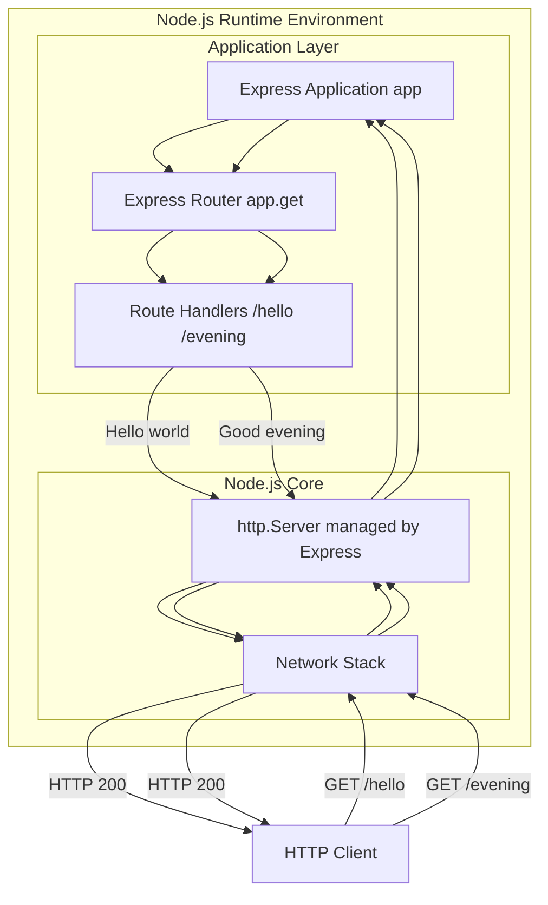

**Component Descriptions**:

1. <span style="background-color: rgba(91, 57, 243, 0.2)">**Express Application (app)**: The primary application instance created by `express()` factory function. This component encapsulates the entire web server configuration including route definitions, middleware stack, and server lifecycle management. The Express application binds to a network port and orchestrates request processing through the routing layer.</span>

2. <span style="background-color: rgba(91, 57, 243, 0.2)">**Express Router (app.get)**: The declarative routing mechanism provided by Express.js that maps HTTP verbs and URL paths to handler functions. Each `app.get(path, handler)` invocation registers a route in Express's internal routing table, eliminating manual URL parsing. The router evaluates incoming requests against registered patterns and delegates execution to the matching handler.</span>

3. <span style="background-color: rgba(91, 57, 243, 0.2)">**Route Handlers (/hello, /evening)**: Functional components that implement endpoint-specific response logic. Each handler receives Express request (`req`) and response (`res`) objects, executes business logic (in this tutorial, simple string return), and generates HTTP responses using Express convenience methods (`res.send()`). Handlers operate independently, each responsible for a single endpoint's behavior.</span>

<span style="background-color: rgba(91, 57, 243, 0.2)">**Under-the-Hood Architecture Note**: Express.js internally manages a Node.js `http.Server` instance created through `http.createServer()`. This native server handles low-level TCP socket management, HTTP protocol parsing, and network communication. Application code interacts exclusively with Express.js abstractions, gaining simplified APIs while retaining full HTTP/1.1 protocol compliance.</span>

#### 1.2.2.3 Core Technical Approach (updated)

<span style="background-color: rgba(91, 57, 243, 0.2)">The project employs Express.js 4.x framework as the mandatory technical foundation, leveraging declarative routing patterns and simplified response APIs to maximize educational clarity while demonstrating industry-standard web application architecture.</span>

**Technology Foundation**:
- <span style="background-color: rgba(91, 57, 243, 0.2)">**Framework**: Express.js 4.19.2 (4.x branch with semantic versioning for patch/minor updates)</span>
- **Runtime**: Node.js JavaScript execution environment <span style="background-color: rgba(91, 57, 243, 0.2)">(v14.0.0 minimum, compatible through current LTS versions)</span>
- **Core Protocol**: HTTP/1.1 for request-response communication
- **Architecture Pattern**: Request-Response pattern with synchronous handling
- **Implementation Style**: <span style="background-color: rgba(91, 57, 243, 0.2)">Declarative routing with functional handlers using Express.js API conventions</span>

**Design Principles**:
- **Simplicity First**: Minimal code complexity to maximize educational clarity
- <span style="background-color: rgba(91, 57, 243, 0.2)">**Framework-Native Patterns**: Consistent use of Express.js idioms (`app.get()`, `res.send()`) that represent production-grade practices</span>
- **Explicit Over Implicit**: Clear, readable code structure that makes behavior obvious
- **Single Responsibility**: Each component addresses one specific concern

**Technical Implementation Strategy**:
<span style="background-color: rgba(91, 57, 243, 0.2)">The server utilizes Express.js framework with declarative route registration through `app.get('/path', handler)` method invocations. Each endpoint is defined as a separate route handler function receiving Express request and response objects. Response generation employs Express convenience methods (`res.send()`) that automatically configure HTTP status codes (200 for successful responses), content-type headers, and response serialization. The implementation resides in a single server file (server.js) to maintain tutorial simplicity, with all routes, handlers, and server initialization contained within approximately 20-30 lines of immediately comprehensible code.</span>

<span style="background-color: rgba(91, 57, 243, 0.2)">**Express.js Integration Rationale**: The framework provides educational advantages through simplified API surface area (single `res.send()` call replaces `res.writeHead()` + `res.end()` sequences), declarative routing that eliminates manual URL parsing logic, and industry-standard patterns that prepare learners for production web application development. Express.js 4.x maintains compatibility with Node.js v14+ while providing stable, well-documented APIs suitable for beginner comprehension.</span>

### 1.2.3 Success Criteria

#### 1.2.3.1 Measurable Objectives (updated)

The project's success will be evaluated against specific, quantifiable objectives:

| Objective Category | Metric | Target Value | Measurement Method |
|-------------------|--------|--------------|-------------------|
| Functional Correctness | <span style="background-color: rgba(91, 57, 243, 0.2)">All endpoint response accuracy</span> | <span style="background-color: rgba(91, 57, 243, 0.2)">100% correct responses for `/hello` and `/evening`</span> | <span style="background-color: rgba(91, 57, 243, 0.2)">Automated testing of response bodies against expected strings</span> |
| <span style="background-color: rgba(91, 57, 243, 0.2)">Startup Performance</span> | <span style="background-color: rgba(91, 57, 243, 0.2)">Server initialization time</span> | <span style="background-color: rgba(91, 57, 243, 0.2)">< 2 seconds from npm start to listening state</span> | <span style="background-color: rgba(91, 57, 243, 0.2)">Timestamp measurement from command invocation to ready log</span> |
| <span style="background-color: rgba(91, 57, 243, 0.2)">Runtime Performance</span> | Response latency | <span style="background-color: rgba(91, 57, 243, 0.2)">< 100ms for all defined endpoints</span> | Time measurement from request to response completion |
| Reliability | Successful startup rate | 100% successful initialization | Server startup validation across multiple attempts |
| HTTP Compliance | Status code accuracy | <span style="background-color: rgba(91, 57, 243, 0.2)">HTTP 200 for all valid endpoint requests</span> | Response header inspection |

#### 1.2.3.2 Critical Success Factors

Beyond measurable metrics, several qualitative factors determine project success:

**Code Quality Factors**:
- **Readability**: Code must be immediately comprehensible to developers with basic JavaScript knowledge
- **Documentation**: Inline comments and README documentation clearly explain each component's purpose and function
- **Error Messages**: Any failure conditions produce clear, actionable error messages for debugging

**Educational Factors**:
- **Setup Simplicity**: Initial project setup requires no more than three command-line operations
- **Execution Clarity**: Server startup and testing process is unambiguous and well-documented
- **Extensibility**: Code structure facilitates easy addition of new endpoints or features for learning progression

**Technical Factors**:
- **Dependency Minimization**: Minimal external package dependencies reduce setup complexity
- **Cross-Platform Compatibility**: Functional on Windows, macOS, and Linux operating systems
- **Version Compatibility**: Compatible with currently supported Node.js LTS versions

#### 1.2.3.3 Key Performance Indicators (KPIs)

Long-term project success will be monitored through the following indicators:

**Functional KPIs**:
- Server uptime during active execution: 100%
- Request success rate: 100% for properly formatted requests
- <span style="background-color: rgba(91, 57, 243, 0.2)">Response consistency: Identical output ("Hello world" for `/hello`, "Good evening" for `/evening`) across all requests</span>

**Educational KPIs**:
- Time-to-first-successful-request: < 5 minutes from project download
- Code comprehension: Understandable to developers with < 6 months JavaScript experience
- Extensibility demonstration: Supports adding <span style="background-color: rgba(91, 57, 243, 0.2)">third</span> endpoint with < 10 lines of additional code

## 1.3 Scope Definition

### 1.3.1 In-Scope Elements

This section precisely defines the boundaries of what will be implemented and delivered within this tutorial project.

#### 1.3.1.1 Core Features and Functionalities

The following capabilities constitute the complete feature set for this project:

**Primary Features**:

| Feature | Description | Implementation Details |
|---------|-------------|----------------------|
| <span style="background-color: rgba(91, 57, 243, 0.2)">Express.js HTTP Server</span> | <span style="background-color: rgba(91, 57, 243, 0.2)">Web server built on Express.js framework</span> | <span style="background-color: rgba(91, 57, 243, 0.2)">Binds to configurable port (default: 3000), listens for incoming requests using Express app.listen() method</span> |
| `/hello` Endpoint | Single GET endpoint returning static text | Responds to GET requests at `/hello` path with "Hello world" string <span style="background-color: rgba(91, 57, 243, 0.2)">via Express.js declarative routing (app.get())</span> |
| <span style="background-color: rgba(91, 57, 243, 0.2)">`/evening` Endpoint</span> | <span style="background-color: rgba(91, 57, 243, 0.2)">Second GET endpoint returning evening greeting</span> | <span style="background-color: rgba(91, 57, 243, 0.2)">Responds to GET requests at `/evening` path with "Good evening" string via Express.js declarative routing</span> |
| Response Formatting | Properly formatted HTTP responses | <span style="background-color: rgba(91, 57, 243, 0.2)">Express.js res.send() automatically includes Content-Type header, HTTP 200 status code, plain text body</span> |
| Server Logging | <span style="background-color: rgba(91, 57, 243, 0.2)">Enhanced console output for server events</span> | <span style="background-color: rgba(91, 57, 243, 0.2)">Logs server startup confirmation with accessible URL and per-request logs with ISO 8601 timestamp, HTTP method, and request path</span> |

**Primary User Workflows**:

1. **Project Setup Workflow** (updated):
   - Clone or download project repository
   - Navigate to project directory
   - <span style="background-color: rgba(91, 57, 243, 0.2)">Install dependencies via `npm install` (required for Express.js framework installation)</span>
   - Review README documentation

2. **Server Execution Workflow** (updated):
   - Execute server startup command <span style="background-color: rgba(91, 57, 243, 0.2)">(`npm start` or `node server.js`)</span>
   - Observe console confirmation of server listening state <span style="background-color: rgba(91, 57, 243, 0.2)">with accessible URL (e.g., "Server listening on http://localhost:3000")</span>
   - Server enters request-handling mode

3. **Endpoint Testing Workflow** (updated):
   - Open web browser or HTTP client tool
   - Navigate to `http://localhost:3000/hello` to test first endpoint
   - Receive and verify "Hello world" response
   - <span style="background-color: rgba(91, 57, 243, 0.2)">Navigate to `http://localhost:3000/evening` to test second endpoint</span>
   - <span style="background-color: rgba(91, 57, 243, 0.2)">Receive and verify "Good evening" response</span>
   - Confirm successful communication <span style="background-color: rgba(91, 57, 243, 0.2)">for both endpoints</span>

**Essential Integrations**:
- <span style="background-color: rgba(91, 57, 243, 0.2)">Express.js framework (production dependency installed via npm)</span>
- Node.js runtime environment
- Local network stack for TCP/IP communication
- Operating system process management for server lifecycle
- <span style="background-color: rgba(91, 57, 243, 0.2)">**No external services**: The project maintains a stateless, self-contained architecture with zero external service dependencies (no databases, authentication services, or third-party APIs)</span>

**Key Technical Requirements** (updated):

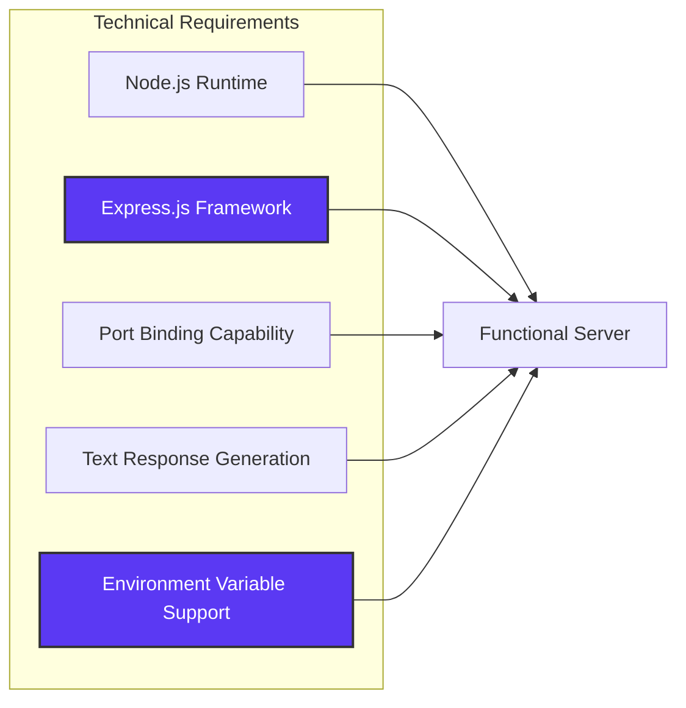

- Node.js version 14.x or higher installed on host system
- <span style="background-color: rgba(91, 57, 243, 0.2)">Express.js 4.x framework (^4.19.2) as production dependency</span>
- <span style="background-color: rgba(91, 57, 243, 0.2)">Available network port for server binding (default: 3000 with environment variable override via `process.env.PORT`)</span>
- <span style="background-color: rgba(91, 57, 243, 0.2)">Localhost-only binding (127.0.0.1 for IPv4, ::1 for IPv6) for inherent security in local development environment</span>
- File system access for reading application files
- Console/terminal output capability for logging
- <span style="background-color: rgba(91, 57, 243, 0.2)">npm package manager for dependency installation</span>

#### 1.3.1.2 Implementation Boundaries

**System Boundaries**:

The system boundary encompasses a single Node.js process executing the <span style="background-color: rgba(91, 57, 243, 0.2)">Express.js-based HTTP server application</span>. External boundaries include:

- **Input Boundary**: HTTP requests received on the configured network port
- **Output Boundary**: HTTP responses transmitted back to requesting clients
- **Process Boundary**: Single Node.js process with no child process spawning
- **File System Boundary**: Read-only access to application source files
- <span style="background-color: rgba(91, 57, 243, 0.2)">**Network Boundary**: Localhost-only interface binding (no external network accessibility)</span>

**User Groups Covered**:
- Developers executing the server locally on their development machines
- Tutorial consumers studying the source code
- <span style="background-color: rgba(91, 57, 243, 0.2)">Learners studying Express.js framework patterns and multi-endpoint routing</span>
- No production end-users or external consumers

**Geographic and Market Coverage**:
- Local development environment only
- No geographic restrictions (runs wherever Node.js is supported)
- No market segmentation (universal educational resource)

**Data Domains Included**:
- Static text response data ("Hello world" <span style="background-color: rgba(91, 57, 243, 0.2)">and "Good evening"</span> strings)
- HTTP request metadata (URL path, HTTP method)
- Server configuration data (port number, host address)
- <span style="background-color: rgba(91, 57, 243, 0.2)">Timestamp data for request logging (ISO 8601 format)</span>
- No persistent data storage or database domains

### 1.3.2 Out-of-Scope Elements

This section explicitly identifies capabilities, features, and concerns that are intentionally excluded from the project scope.

#### 1.3.2.1 Excluded Features and Capabilities

The following features are explicitly NOT included in this implementation:

**Endpoint and Routing Exclusions** (updated):
- <span style="background-color: rgba(91, 57, 243, 0.2)">Multiple endpoints beyond `/hello` and `/evening`</span>
- Dynamic route parameters or query string processing
- HTTP methods other than GET (POST, PUT, DELETE, PATCH)
- RESTful API resource modeling
- API versioning schemes

**Data and Persistence Exclusions**:
- Database integration (SQL or NoSQL)
- File system data persistence
- Session management or state storage
- Caching mechanisms
- Data validation or sanitization logic

**Security and Authentication Exclusions**:
- User authentication or authorization
- API key validation
- HTTPS/TLS encryption
- CORS (Cross-Origin Resource Sharing) configuration
- Rate limiting or throttling
- Input validation for security purposes
- SQL injection or XSS protection mechanisms

**Advanced Functionality Exclusions**:
- Middleware pipeline or request preprocessing <span style="background-color: rgba(91, 57, 243, 0.2)">(beyond Express.js's internal middleware)</span>
- Template rendering engines
- Static file serving
- File upload handling
- WebSocket or real-time communication
- Streaming responses
- Compression (gzip, deflate)

**Infrastructure and Operations Exclusions**:
- Production deployment configurations
- Container orchestration (Docker, Kubernetes)
- Load balancing or clustering
- Health check endpoints
- Metrics collection or monitoring integration
- Structured logging frameworks
- Error tracking services (Sentry, Rollbar)

**Testing and Quality Assurance Exclusions**:
- Automated test suites (unit tests, integration tests)
- Test coverage requirements
- Continuous integration pipeline configuration
- Performance testing or benchmarking
- Load testing capabilities

#### 1.3.2.2 Future Phase Considerations (updated)

While out of scope for the initial implementation, the following capabilities represent logical extensions for future tutorial iterations:

**Phase 2 Potential Enhancements**:
- <span style="background-color: rgba(91, 57, 243, 0.2)">Addition of parameterized endpoints demonstrating URL parameters (e.g., `/greet/:name`)</span>
- Introduction of POST endpoint with request body parsing
- Basic error handling and custom error responses

**Phase 3 Potential Enhancements**:
- Integration with simple JSON file-based data storage
- Implementation of basic CRUD operations
- Introduction to custom middleware concepts

**Phase 4 Potential Enhancements**:
- Database integration tutorial extension
- Authentication mechanism demonstration
- Deployment guide for cloud platforms

These future phases are explicitly excluded from current scope to maintain tutorial simplicity and focus.

#### 1.3.2.3 Integration Points Not Covered

The following integration points are explicitly out of scope:

- External API consumption or third-party service integration
- Message queue systems (RabbitMQ, Kafka)
- Email service integration
- Payment gateway integration
- Cloud storage services (AWS S3, Google Cloud Storage)
- Analytics platforms
- Content delivery networks (CDNs)
- Service mesh or microservice orchestration

#### 1.3.2.4 Unsupported Use Cases

The following use cases are explicitly not supported by this implementation:

**Production Use Cases**:
- Serving production traffic or real user requests
- High-availability deployment scenarios
- Multi-instance clustering or horizontal scaling
- Zero-downtime deployment strategies

**Complex Application Scenarios**:
- Multi-tenant application patterns
- Complex business logic workflows
- Data transformation pipelines
- Batch processing operations

**Enterprise Integration Scenarios**:
- Integration with enterprise identity providers (LDAP, Active Directory)
- Enterprise service bus connectivity
- Legacy system integration
- B2B partner integration patterns

**Advanced Development Scenarios**:
- Hot module reloading or development server features
- Source code transpilation or build processes
- Asset bundling or optimization
- Progressive web app (PWA) functionality

## 1.4 Document Purpose and Audience

### 1.4.1 Purpose of This Specification

This Technical Specification document serves as the authoritative reference for the Node.js Tutorial Project, providing comprehensive architectural and implementation guidance for all stakeholders. The document establishes the technical blueprint from which the actual implementation will be derived, ensuring alignment between educational objectives and technical execution.

### 1.4.2 Target Audience

This specification is designed for multiple audiences with varying technical backgrounds:

- **Implementation Developers**: Technical reference for building the tutorial project
- **Educational Content Creators**: Source material for creating supplementary training content
- **Technical Reviewers**: Baseline for validating implementation correctness and completeness
- **Learning Developers**: Advanced reference for understanding design decisions and architectural patterns

## 1.5 References

### 1.5.1 Project Documentation

- **Original User Requirements Specification**: "Create a nodejs tutorial project that features one end point '/hello' that returns 'Hello world' to the calling HTTP client"
- <span style="background-color: rgba(91, 57, 243, 0.2)">**Feature Enhancement Directive**: "add expressjs into the project and add another endpoint that return the reponse of 'Good evening'" (user-provided directive preserved verbatim)</span>
- <span style="background-color: rgba(91, 57, 243, 0.2)">**Agent Action Plan v0.1**: Express.js migration and second endpoint addition - Strategic implementation plan documented in Section 0.1 (Intent Clarification)</span>
- **README.md**: Repository documentation with installation instructions, usage guidance, and endpoint specifications

### 1.5.2 Repository Analysis

**Files Examined**:
- `README.md` - Repository initialization file confirming project creation status

**Folders Explored**:
- `/` (root directory) - Confirmed empty repository state with no existing implementation

### 1.5.3 Technical Context

This specification is based on:
- Node.js runtime capabilities and standard practices for HTTP server implementation
- <span style="background-color: rgba(91, 57, 243, 0.2)">Express.js 4.x framework architecture for declarative routing and middleware-based request handling</span>
- Educational best practices for tutorial project design
- HTTP/1.1 protocol standards for request-response communication
- <span style="background-color: rgba(91, 57, 243, 0.2)">User-provided requirements defining Express.js framework integration and multi-endpoint functionality (two HTTP GET endpoints)</span>
- <span style="background-color: rgba(91, 57, 243, 0.2)">Industry-standard web application patterns for production-grade routing architectures</span>

### 1.5.4 Technical References

**Framework and Runtime Documentation**:
- Express.js Official Documentation: https://expressjs.com/ (v4.x API reference and routing guides)
- Node.js Official Documentation: https://nodejs.org/api/ (core module specifications and JavaScript runtime APIs)
- npm Package Registry - Express.js: https://www.npmjs.com/package/express (package metadata, version history, and dependency information)

**Standards and Protocols**:
- HTTP/1.1 Protocol Specification (RFC 7231): Request methods, status codes, and response semantics
- Semantic Versioning Specification (semver.org): Dependency version range interpretation for package.json

**Development Resources**:
- Express.js GitHub Repository: https://github.com/expressjs/express (source code, issue tracking, and community contributions)
- Node.js LTS Release Schedule: https://nodejs.org/en/about/releases/ (version compatibility planning)

# 2. Product Requirements

## 2.1 Overview

This section defines the discrete, testable features and functional requirements for the Node.js Tutorial Project. The product is designed as an educational resource demonstrating <span style="background-color: rgba(91, 57, 243, 0.2)">modern HTTP server implementation using the Express.js framework</span>. All requirements are derived from the core business objective of providing clear, accessible learning content for developers studying web server concepts <span style="background-color: rgba(91, 57, 243, 0.2)">and industry-standard framework patterns</span>.

The requirements documented herein reflect <span style="background-color: rgba(91, 57, 243, 0.2)">a migration from the native Node.js `http` module to Express.js 4.x, demonstrating declarative routing capabilities through a two-endpoint architecture</span>. The implementation features <span style="background-color: rgba(91, 57, 243, 0.2)">a GET `/hello` endpoint returning "Hello world" (preserving the original tutorial functionality) and a GET `/evening` endpoint returning "Good evening" (demonstrating multi-endpoint routing patterns)</span>. The system maintains beginner accessibility through <span style="background-color: rgba(91, 57, 243, 0.2)">a single-file server implementation (server.js or index.js)</span>, ensuring learners can comprehend the entire architecture within a single reading session. Each feature is scoped to support the primary use case: enabling developers to create and test <span style="background-color: rgba(91, 57, 243, 0.2)">their first working Express.js HTTP server with multiple endpoints</span> within minutes of project setup.

<span style="background-color: rgba(91, 57, 243, 0.2)">The tutorial operates within specific platform and performance constraints designed to ensure reliable cross-platform execution and responsive behavior. The server requires Node.js v14.0.0 or higher (compatible through current LTS versions including v16.x, v18.x, and v20.x) and binds exclusively to localhost interfaces (127.0.0.1 for IPv4, ::1 for IPv6) for inherent development security. Port configuration defaults to 3000 with environment variable override capability via `process.env.PORT`, enabling users to resolve port conflicts without code modification. Performance requirements mandate server startup time under 2 seconds (measured from `npm start` invocation to listening state) and endpoint response latency under 100 milliseconds (application-layer timing excluding network transmission), ensuring immediate feedback during the learning process.</span>

### 2.1.1 Requirements Organization Structure

The Product Requirements documentation is organized into the following hierarchical structure:

**Feature Catalog (Section 2.2)**: Comprehensive inventory of all discrete features with unique identifiers, metadata, descriptions, business value propositions, and dependency mappings. Each feature receives structured documentation including priority classification, development status tracking, and integration requirements.

**Functional Requirements Tables (Section 2.3)**: Granular requirement specifications for each feature, presented in tabular format with requirement IDs, acceptance criteria, priority classifications, complexity assessments, technical specifications, and validation rules. Each requirement is designed to be independently testable and traceable.

**Feature Relationships (Section 2.4)**: Architectural documentation of inter-feature dependencies, integration points, shared components, and common services. Includes visual dependency mapping and explicit documentation of coupling between features.

**Implementation Considerations (Section 2.5)**: Technical constraints, performance requirements, scalability considerations, security implications, and maintenance requirements that span multiple features or apply system-wide.

**Requirements Traceability (Section 2.6)**: Cross-reference matrices linking requirements to design specifications, test cases, and implementation artifacts. Enables bidirectional traceability from business objectives through to validation procedures.

### 2.1.2 Feature Identification Conventions

All features and requirements follow standardized identification patterns to ensure consistency and traceability:

**Feature ID Format**: `F-XXX` where XXX is a zero-padded three-digit sequential identifier
- Example: `F-001`, `F-002`, `F-003`
- Assignment: Features receive IDs in order of specification, not priority
- Persistence: Feature IDs remain stable across document versions

**Requirement ID Format**: `F-XXX-RQ-YYY` where XXX is the parent feature ID and YYY is a zero-padded three-digit requirement identifier
- Example: `F-001-RQ-001`, `F-001-RQ-002`
- Relationship: Each requirement ID explicitly references its parent feature
- Scope: Requirement numbering restarts for each feature

**Status Classifications**: Features and requirements use standardized status values:
- **Proposed**: Under review, not yet approved for development
- **Approved**: Approved for implementation, awaiting development initiation
- **In Development**: Active implementation in progress
- **Completed**: Implementation finished, tested, and validated

**Priority Levels**: Four-tier priority system for features:
- **Critical**: System cannot function without this feature; blocks all dependent features
- **High**: Essential for primary use cases; significant user impact if absent
- **Medium**: Important for enhanced user experience; deferrable if necessary
- **Low**: Nice-to-have enhancements; minimal impact if deferred

**Requirement Priority (MoSCoW Method)**: Three-tier classification for requirements:
- **Must-Have**: Non-negotiable requirement for minimum viable functionality
- **Should-Have**: Important but not critical; system functions without it
- **Could-Have**: Desirable enhancement with minimal impact if excluded

### 2.1.3 Requirements Scope and Boundaries

The requirements documented in this section are bounded by the following scope constraints:

**In-Scope Requirements**:
- <span style="background-color: rgba(91, 57, 243, 0.2)">Express.js framework integration and declarative routing implementation</span>
- <span style="background-color: rgba(91, 57, 243, 0.2)">Two HTTP GET endpoints (`/hello` and `/evening`) with static text responses</span>
- Server lifecycle management (initialization, listening, graceful shutdown)
- Basic HTTP request handling and response generation
- Port binding and configuration through environment variables
- Console logging for server events and request activity
- Cross-platform compatibility (Windows, macOS, Linux)
- <span style="background-color: rgba(91, 57, 243, 0.2)">Single production dependency (Express.js) managed through npm</span>

**Out-of-Scope Requirements** (explicitly excluded):
- Additional endpoints beyond `/hello` and `/evening`
- HTTP methods other than GET (POST, PUT, DELETE, PATCH)
- Dynamic routing, route parameters, or query string processing
- Data persistence (databases, file storage, caching)
- Authentication, authorization, or security mechanisms
- Middleware pipeline or request preprocessing (beyond Express.js internals)
- Template rendering, static file serving, or file uploads
- Production deployment configurations or containerization
- Automated testing frameworks or continuous integration pipelines
- External service integrations or third-party API consumption

**Assumptions**:
- Users have Node.js v14.x or higher installed on their development machines
- Users have basic familiarity with command-line interface operations
- Users have terminal/console access for viewing server logs
- Users have web browser or HTTP client tools (curl) for testing endpoints
- <span style="background-color: rgba(91, 57, 243, 0.2)">Users have npm package manager installed (bundled with Node.js)</span>
- Network port 3000 is available or users can configure alternative port
- Localhost loopback interface is functional and accessible

**Constraints**:
- Educational simplicity prioritized over production-grade complexity
- <span style="background-color: rgba(91, 57, 243, 0.2)">Single-file implementation constraint (server.js or index.js) for beginner accessibility</span>
- Stateless architecture with no data persistence mechanisms
- Localhost-only binding for inherent development security
- Minimal dependency footprint to reduce setup friction
- Code readability and comprehensibility for novice developers
- <span style="background-color: rgba(91, 57, 243, 0.2)">Node.js v14+ compatibility requirement (restricts use of v16+ exclusive features)</span>

### 2.1.4 Requirements Validation and Acceptance

Each requirement documented in this section must satisfy the following validation criteria:

**Testability**: Every functional requirement must be independently verifiable through objective testing procedures. Requirements must specify observable behaviors, measurable outcomes, or inspectable artifacts that can be validated programmatically or manually.

**Completeness**: Requirements must provide sufficient detail for implementation without requiring additional clarification. Each requirement includes input parameters, expected outputs, acceptance criteria, and validation rules.

**Consistency**: Requirements must not contradict other requirements, architectural principles, or documented constraints. Cross-references identify dependent or related requirements to maintain coherence.

**Traceability**: Every requirement traces to specific business objectives, user stories, or system capabilities. Bidirectional traceability enables impact analysis when requirements change or evolve.

**Acceptance Criteria Definition**: Each requirement specifies explicit acceptance criteria that determine when implementation is complete and correct. Acceptance criteria use measurable, objective terms (response codes, timing thresholds, output values) rather than subjective assessments.

**Validation Methods**: Requirements identify appropriate validation approaches:
- **Functional Testing**: Endpoint response verification, status code validation, response content matching
- **Performance Testing**: Latency measurement, startup time verification, resource utilization monitoring
- **Compatibility Testing**: Cross-platform execution validation, Node.js version compatibility verification
- **Manual Validation**: Console log inspection, browser-based endpoint testing, configuration verification

## 2.2 Feature Catalog

### 2.2.1 Feature F-001: HTTP Server Initialization and Lifecycle Management

#### 2.2.1.1 Feature Metadata

| Attribute | Value |
|-----------|-------|
| **Feature ID** | F-001 |
| **Feature Name** | HTTP Server Initialization and Lifecycle Management |
| **Category** | Core Infrastructure |
| **Priority** | Critical |
| **Status** | Proposed |

#### 2.2.1.2 Description

**Overview**: This feature encompasses the complete lifecycle management of the HTTP server instance, including initialization, port binding, active listening state, and graceful shutdown capabilities. The server acts as the foundational component that enables all other system functionality.

**Business Value**: 
- Provides the essential infrastructure for HTTP communication
- Demonstrates fundamental server initialization patterns to learners
- Establishes the foundation for understanding Node.js runtime capabilities
- Reduces time-to-first-working-server from hours to minutes for beginners

**User Benefits**:
- Simple, single-command server startup process
- Clear console feedback confirming successful initialization
- Immediate availability for request handling upon startup
- Clean shutdown behavior preventing port conflicts

**Technical Context**: The HTTP Server Instance component <span style="background-color: rgba(91, 57, 243, 0.2)">is initialized using the Express.js framework via the Express application factory pattern (`app = express()`). Server activation occurs through the `app.listen(PORT)` method, which</span> binds to a configurable network port <span style="background-color: rgba(91, 57, 243, 0.2)">(default: 3000 with environment variable override via `process.env.PORT`) and exclusively binds to the localhost interface (127.0.0.1 for IPv4, ::1 for IPv6) for inherent development security</span>. It delegates incoming requests to the Endpoint Router while maintaining connection stability and process lifecycle control. <span style="background-color: rgba(91, 57, 243, 0.2)">The implementation leverages Express.js framework capabilities, which internally utilizes the Node.js native `http` module, providing a higher-level abstraction optimized for educational clarity and industry-standard patterns.</span>

#### 2.2.1.3 Dependencies (updated)

| Dependency Type | Details |
|----------------|---------|
| **Prerequisite Features** | None (foundational feature) |
| **System Dependencies** | Node.js v14.x or higher, <span style="background-color: rgba(91, 57, 243, 0.2)">npm package manager (bundled with Node.js) for dependency installation,</span> Available network port (default: 3000), Operating system TCP/IP network stack, Console/terminal output capability |
| **External Dependencies** | <span style="background-color: rgba(91, 57, 243, 0.2)">Express.js 4.x framework (npm production dependency, version ^4.19.2); Node.js HTTP module (used internally by Express.js, no direct application import required)</span> |
| **Integration Requirements** | Operating system process management, Local network stack for TCP/IP communication, <span style="background-color: rgba(91, 57, 243, 0.2)">Environment variable integration for PORT configuration (`process.env.PORT`), npm-based dependency management for Express.js installation</span> |

**Reference**: Technical Specification sections 1.2.2.1 (Primary System Capabilities), 1.2.2.2 (Major System Components), 1.3.1.1 (Core Features), 0.3 (Dependency Inventory)

---

### 2.2.2 Feature F-002: `/hello` Endpoint Implementation

#### 2.2.2.1 Feature Metadata

| Attribute | Value |
|-----------|-------|
| **Feature ID** | F-002 |
| **Feature Name** | `/hello` Endpoint with Static Response |
| **Category** | Core Functionality |
| **Priority** | Critical |
| **Status** | Proposed |

#### 2.2.2.2 Description

**Overview**: A single HTTP GET endpoint accessible at the `/hello` path that returns the static text string "Hello world" to the requesting client. This endpoint represents the core functional requirement and primary educational demonstration of the tutorial project.

**Business Value**:
- Delivers the central learning objective: demonstrating request-response cycle
- Provides immediate, verifiable output for tutorial validation
- Illustrates endpoint routing and handler implementation patterns
- Serves as template for understanding RESTful endpoint development

**User Benefits**:
- Clear success indicator when accessed via browser or HTTP client
- Instant feedback confirming server functionality
- Simple, memorable endpoint path for testing
- Foundation for understanding how to add additional endpoints

**Technical Context**: <span style="background-color: rgba(91, 57, 243, 0.2)">The endpoint implementation utilizes Express.js declarative routing through the `app.get('/hello', handler)` pattern, which explicitly maps the `/hello` URL path to a dedicated handler function. The handler generates the response via Express.js's simplified response API (`res.send('Hello world')`), which automatically sets the HTTP 200 status code and appropriate Content-Type header</span>. The router performs exact path matching and delegates to the handler, which constructs the HTTP response with proper headers and body content. <span style="background-color: rgba(91, 57, 243, 0.2)">This declarative approach eliminates manual URL parsing and conditional logic, demonstrating industry-standard framework patterns suitable for educational purposes.</span>

#### 2.2.2.3 Dependencies (updated)

| Dependency Type | Details |
|----------------|---------|
| **Prerequisite Features** | F-001 (HTTP Server must be operational) |
| **System Dependencies** | <span style="background-color: rgba(91, 57, 243, 0.2)">Express.js framework for routing and response generation; Node.js HTTP module (implicit via Express.js, no direct application import)</span> |
| **External Dependencies** | None (uses Express.js capabilities from F-001) |
| **Integration Requirements** | <span style="background-color: rgba(91, 57, 243, 0.2)">Express.js route definition via `app.get('/hello', handlerFunction)`, Handler function utilizing Express.js response methods (`res.send`),</span> Response Formatting (F-003) |

**Reference**: User requirements, Technical Specification sections 1.2.2.2 (Endpoint Router, Request Handler components), 1.3.1.1 (Core Features table), 0.7.1 (Requirements 1-3)

---

### 2.2.3 Feature F-003: HTTP Response Formatting and Protocol Compliance

#### 2.2.3.1 Feature Metadata

| Attribute | Value |
|-----------|-------|
| **Feature ID** | F-003 |
| **Feature Name** | HTTP Response Formatting and Protocol Compliance |
| **Category** | Protocol Implementation |
| **Priority** | High |
| **Status** | Proposed |

#### 2.2.3.2 Description

**Overview**: Comprehensive HTTP protocol compliance encompassing request parsing, response header configuration, status code management, and content formatting. This feature ensures all server communications adhere to HTTP/1.1 standards for broad client compatibility.

**Business Value**:
- Ensures compatibility with all standard HTTP clients (browsers, curl, Postman, etc.)
- Demonstrates proper protocol implementation patterns
- Provides educational value in understanding HTTP standards
- Prevents common protocol-related errors and misconceptions

**User Benefits**:
- Reliable communication with any HTTP client tool
- Proper browser rendering of responses
- Clear status code feedback (HTTP 200 for success)
- Standards-compliant Content-Type headers

**Technical Context**: The system implements HTTP/1.1 protocol standards for both request parsing and response generation. Request parsing extracts the HTTP method and URL path from incoming connections. Response generation <span style="background-color: rgba(91, 57, 243, 0.2)">leverages Express.js response APIs (specifically `res.send()`) that automatically set HTTP 200 status codes and appropriate Content-Type headers (text/html) without requiring manual header configuration. The underlying HTTP/1.1 protocol compliance is provided by the Node.js core HTTP module via Express.js's framework abstraction</span>. The implementation <span style="background-color: rgba(91, 57, 243, 0.2)">simplifies response generation for educational audiences while maintaining full standards compliance through Express.js's internally managed protocol handling.</span>

#### 2.2.3.3 Dependencies

| Dependency Type | Details |
|----------------|---------|
| **Prerequisite Features** | F-001 (Server Instance), F-002 (Endpoint Handler) |
| **System Dependencies** | <span style="background-color: rgba(91, 57, 243, 0.2)">Express.js framework response APIs, Node.js HTTP module protocol handling (via Express.js)</span> |
| **External Dependencies** | None (native implementation via Express.js) |
| **Integration Requirements** | Integrated with Request Handler output, Utilized by HTTP Server Instance for response transmission |

**Reference**: Technical Specification sections 1.2.2.3 (Core Technical Approach - HTTP/1.1 protocol), 1.3.1.1 (Response Formatting feature), 0.7.1 (Requirement 2)

---

### 2.2.4 Feature F-004: Server Logging and Observability

#### 2.2.4.1 Feature Metadata

| Attribute | Value |
|-----------|-------|
| **Feature ID** | F-004 |
| **Feature Name** | Server Logging and Observability |
| **Category** | Observability |
| **Priority** | Medium |
| **Status** | Proposed |

#### 2.2.4.2 Description (updated)

**Overview**: Basic console-based logging system that provides visibility into server events, including startup confirmation and incoming request activity. Logging serves both operational feedback and educational purposes by making server behavior explicit and observable.

**Business Value**:
- Provides immediate confirmation of successful server initialization
- Enables basic debugging capabilities for learners
- Demonstrates observability patterns in web applications
- Reduces troubleshooting time for common setup issues

**User Benefits**:
- Clear visual confirmation that server is running and ready
- Real-time visibility into incoming requests during testing
- Debugging assistance through request information logging
- Confidence in server operational state

**Technical Context**: The logging system outputs formatted messages to the console (stdout) at key lifecycle events. <span style="background-color: rgba(91, 57, 243, 0.2)">Startup logging confirms the server's listening state and displays the complete URL for immediate access (format: `Server listening on http://localhost:${PORT}`), providing learners with a clickable URL for browser-based testing. Request logging captures incoming request details in a consistent, beginner-friendly format using ISO 8601 timestamps with the pattern `${new Date().toISOString()} - ${req.method} ${req.path}` (example: `2024-10-15T14:30:22.123Z - GET /hello`)</span>. Log messages are designed for human readability with clarity prioritized for educational audiences. <span style="background-color: rgba(91, 57, 243, 0.2)">The consistent logging format enables learners to understand request flow and timing patterns while maintaining professional logging conventions suitable for real-world development practices.</span>

#### 2.2.4.3 Dependencies

| Dependency Type | Details |
|----------------|---------|
| **Prerequisite Features** | F-001 (Server for lifecycle events), F-002 (Endpoint for request events) |
| **System Dependencies** | Console/terminal output capability (stdout), <span style="background-color: rgba(91, 57, 243, 0.2)">Node.js Date API for ISO 8601 timestamp generation</span> |
| **External Dependencies** | None (uses native console.log) |
| **Integration Requirements** | Observes events from all system components (cross-cutting concern) |

**Reference**: Technical Specification section 1.3.1.1 (Server Logging feature), 0.7.1 (Requirements 13-14)

---

### 2.2.5 Feature F-005: `/evening` Endpoint Implementation

#### 2.2.5.1 Feature Metadata

| Attribute | Value |
|-----------|-------|
| **Feature ID** | F-005 |
| **Feature Name** | `/evening` Endpoint with Static Response |
| **Category** | Core Functionality |
| **Priority** | Critical |
| **Status** | Proposed |

#### 2.2.5.2 Description

**Overview**: A second HTTP GET endpoint accessible at the `/evening` path that returns the exact static text string "Good evening" to the requesting client. This endpoint demonstrates Express.js multi-endpoint routing capabilities and validates the extensibility of the tutorial's architectural patterns.

**Business Value**:
- Demonstrates scalability of Express.js routing patterns for multiple endpoints
- Validates that learners can extend the codebase with additional endpoints
- Illustrates consistent routing conventions across multiple handlers
- Provides second verification point for confirming server functionality
- Reinforces understanding of declarative routing patterns

**User Benefits**:
- Additional endpoint for testing and validation exercises
- Clear demonstration of adding new functionality without architectural changes
- Consistent response pattern reinforcing learned concepts
- Opportunity to practice endpoint testing with multiple targets

**Technical Context**: The `/evening` endpoint implements identical architectural patterns to the `/hello` endpoint (F-002), utilizing Express.js declarative routing via `app.get('/evening', handler)` and the simplified response API (`res.send('Good evening')`). The implementation demonstrates that multiple endpoints coexist within the same Express application instance without requiring additional server configuration or routing infrastructure. Each endpoint operates independently with its own handler function while sharing the common Express.js request-response lifecycle. This design preserves the tutorial's educational simplicity by maintaining a consistent, repeatable pattern for endpoint creation suitable for beginner comprehension.

#### 2.2.5.3 Dependencies

| Dependency Type | Details |
|----------------|---------|
| **Prerequisite Features** | F-001 (HTTP Server must be operational) |
| **System Dependencies** | Express.js framework for routing and response generation; Node.js HTTP module (implicit via Express.js) |
| **External Dependencies** | None (uses Express.js capabilities from F-001) |
| **Integration Requirements** | Express.js route definition via `app.get('/evening', handlerFunction)`, Server Logging (F-004) for request activity capture, Response Formatting (F-003) for protocol compliance |

**Reference**: Technical Specification sections 2.1 (Overview - two-endpoint architecture), 1.3.1.1 (Core Features), 0.7.1 (Requirements 1-3), 0.1.1 (Specific Feature Requirements - New Endpoint Addition)

---

## 2.3 Functional Requirements

### 2.3.1 Feature F-001 Requirements: HTTP Server Initialization (updated)

#### 2.3.1.1 Requirements Table (updated)

| Requirement ID | Description | Priority | Complexity |
|----------------|-------------|----------|------------|
| F-001-RQ-001 | Server Port Binding | Must-Have | Low |
| F-001-RQ-002 | Server Lifecycle Management | Must-Have | Medium |
| F-001-RQ-003 | Network Socket Management | Must-Have | Low |
| F-001-RQ-004 | Cross-Platform Initialization | Must-Have | Low |
| **F-001-RQ-005** | **Express-based Server Initialization** | **Must-Have** | **Low** |

#### 2.3.1.2 Detailed Requirement Specifications

**Requirement F-001-RQ-001: Server Port Binding (updated)**

| Specification Category | Details |
|----------------------|---------|
| **Description** | Server must bind to a configurable network port and listen for incoming TCP connections |
| **Acceptance Criteria** | • Default port is 3000<br>• <span style="background-color: rgba(91, 57, 243, 0.2)">Default port is 3000 with environment variable override via process.env.PORT</span><br>• Port must be configurable via code or environment variable<br>• <span style="background-color: rgba(91, 57, 243, 0.2)">Binds exclusively to localhost interfaces (127.0.0.1 and ::1)</span><br>• System handles port-in-use errors with clear error message<br>• Successful binding confirmed via console output |
| **Input Parameters** | Port number (integer, range: 1024-65535, default: 3000), Host address (string, default: 'localhost') |
| **Output/Response** | Console log message: "Server listening on port [PORT]" or equivalent |
| **Performance Criteria** | Port binding completes in < 1 second as part of overall < 2 second startup time requirement |
| **Business Rules** | Must use unprivileged port (>1023) by default, Must validate port number is within valid range, <span style="background-color: rgba(91, 57, 243, 0.2)">Must bind only to localhost interfaces for development security</span> |
| **Data Validation** | Port number must be positive integer, Port must not already be in use |

**Reference**: Technical Specification sections 1.2.2.1 (Server lifecycle management), 1.2.3.1 (Startup time KPI), 1.3.1.1 (Core Features - HTTP Server), 0.1.2 (Specific Technical Constraints - Localhost Binding, Port Configuration)

---

**Requirement F-001-RQ-002: Server Lifecycle Management**

| Specification Category | Details |
|----------------------|---------|
| **Description** | Server must successfully initialize, enter listening state, maintain active operation, and support graceful shutdown |
| **Acceptance Criteria** | • 100% successful initialization rate on supported platforms<br>• Server remains in listening state until explicitly terminated<br>• Clean process termination on SIGTERM or SIGINT signals<br>• No memory leaks during continuous operation |
| **Input Parameters** | Server initialization configuration (port, host) |
| **Output/Response** | Operational HTTP server instance in listening state |
| **Performance Criteria** | Startup time < 2 seconds from process start to listening state, 100% uptime during active execution |
| **Technical Specifications** | Compatible with Node.js v14.x or higher LTS versions, Functional on Windows, macOS, and Linux operating systems |
| **Business Rules** | Server must be single-process (no clustering), Must support standard process termination signals |

**Reference**: Technical Specification sections 1.2.2.1 (Primary System Capabilities), 1.2.3.1 (Reliability metrics), 1.2.3.2 (Cross-Platform Compatibility)

---

**Requirement F-001-RQ-003: Network Socket Management**

| Specification Category | Details |
|----------------------|---------|
| **Description** | Server must manage TCP/IP network connections including connection establishment, maintenance, and teardown |
| **Acceptance Criteria** | • Accept multiple concurrent connections<br>• Handle connection establishment handshake<br>• Maintain connection stability during request processing<br>• Clean connection teardown after response delivery |
| **Input Parameters** | Incoming TCP connection requests |
| **Output/Response** | Established socket connections ready for HTTP communication |
| **Performance Criteria** | Support minimum 10 concurrent connections for testing purposes |
| **Technical Specifications** | Leverages Node.js Network Layer (native), Uses TCP/IP protocol stack |
| **Data Requirements** | Network socket file descriptors, Connection state tracking |

**Reference**: Technical Specification sections 1.2.2.1 (Network socket management), 1.2.2.2 (Network Layer component)

---

**Requirement F-001-RQ-004: Cross-Platform Initialization**

| Specification Category | Details |
|----------------------|---------|
| **Description** | Server initialization must function identically across Windows, macOS, and Linux operating systems |
| **Acceptance Criteria** | • Successful startup on Windows 10/11<br>• Successful startup on macOS 10.15+<br>• Successful startup on Ubuntu 18.04+ and other major Linux distributions<br>• Identical behavior across platforms |
| **Performance Criteria** | Startup time variance < 500ms across platforms |
| **Technical Specifications** | Uses Node.js cross-platform APIs only, No platform-specific dependencies |
| **Compliance Requirements** | Node.js cross-platform compatibility standards |

**Reference**: Technical Specification section 1.2.3.2 (Cross-Platform Compatibility critical success factor)

---

**Requirement F-001-RQ-005: Express-based Server Initialization (updated)**

| Specification Category | Details |
|----------------------|---------|
| **Description** | <span style="background-color: rgba(91, 57, 243, 0.2)">Server must initialize using the Express.js framework application factory pattern and start listening via Express.js methods without direct usage of native Node.js http.createServer() in application code</span> |
| **Acceptance Criteria** | <span style="background-color: rgba(91, 57, 243, 0.2)">• Server initialization uses Express application factory: `const app = express()`<br>• Server activation uses Express listen method: `app.listen(PORT, callback)`<br>• No direct usage of `http.createServer()` in application code<br>• Startup confirmation log includes complete URL format: `Server listening on http://localhost:[PORT]`<br>• Express application instance properly configured before calling listen()<br>• Callback function executes immediately upon successful port binding</span> |
| **Input Parameters** | <span style="background-color: rgba(91, 57, 243, 0.2)">Port number (from configuration or process.env.PORT), Optional hostname (defaults to 'localhost' for localhost-only binding)</span> |
| **Output/Response** | <span style="background-color: rgba(91, 57, 243, 0.2)">Express application instance in listening state, Console log: "Server listening on http://localhost:[PORT]"</span> |
| **Performance Criteria** | <span style="background-color: rgba(91, 57, 243, 0.2)">Express initialization overhead < 500ms, Total startup time including Express framework loading < 2 seconds</span> |
| **Technical Specifications** | <span style="background-color: rgba(91, 57, 243, 0.2)">Express.js 4.x framework (^4.19.2), Express application factory pattern, Express.js internally manages http.createServer() invocation</span> |
| **Business Rules** | <span style="background-color: rgba(91, 57, 243, 0.2)">Application code uses Express.js abstractions exclusively, Framework handles HTTP protocol implementation details, Demonstrates industry-standard Express.js patterns suitable for educational purposes</span> |
| **Data Validation** | <span style="background-color: rgba(91, 57, 243, 0.2)">Express application instance must be valid before listen() invocation, Port parameter must be valid integer</span> |

**Reference**: Technical Specification sections 2.2.1 (Feature F-001 - Express.js integration), 0.1.2 (Architectural Requirements - Framework Integration Mandate), 0.7.1 (Requirements 1-2)

---

### 2.3.2 Feature F-002 Requirements: `/hello` Endpoint (updated)

#### 2.3.2.1 Requirements Table (updated)

| Requirement ID | Description | Priority | Complexity |
|----------------|-------------|----------|------------|
| F-002-RQ-001 | GET Request Handling | Must-Have | Low |
| F-002-RQ-002 | Response Content Accuracy | Must-Have | Low |
| F-002-RQ-003 | URL Routing Accuracy | Must-Have | Low |
| F-002-RQ-004 | Response Consistency | Must-Have | Low |
| **F-002-RQ-005** | **Express Declarative Routing for /hello** | **Must-Have** | **Low** |

#### 2.3.2.2 Detailed Requirement Specifications

**Requirement F-002-RQ-001: GET Request Handling**

| Specification Category | Details |
|----------------------|---------|
| **Description** | Endpoint must respond to HTTP GET requests at the `/hello` path with proper response generation |
| **Acceptance Criteria** | • Accepts GET requests to `/hello` path<br>• Path matching is exact and case-sensitive<br>• Returns valid HTTP response with body content<br>• Completes response within latency requirement |
| **Input Parameters** | HTTP GET request to `http://[host]:[port]/hello` |
| **Output/Response** | HTTP response with status 200, Content-Type header, and "Hello world" body |
| **Performance Criteria** | Response latency < 100ms from request receipt to response completion, 100% request success rate for properly formatted requests |
| **Business Rules** | Only GET method is supported for this endpoint, Path must exactly match "/hello" (no trailing slash) |
| **Data Validation** | HTTP method must be GET, URL path must match "/hello" exactly |

**Reference**: User requirements, Technical Specification sections 1.2.3.1 (Response latency KPI), 1.3.1.1 (Core Features - /hello Endpoint)

---

**Requirement F-002-RQ-002: Response Content Accuracy**

| Specification Category | Details |
|----------------------|---------|
| **Description** | Endpoint must return exactly the text string "Hello world" as the response body |
| **Acceptance Criteria** | • Response body contains exactly "Hello world"<br>• No additional whitespace, newlines, or formatting characters<br>• 100% correct response across all requests<br>• Identical output for every valid request |
| **Input Parameters** | None (static response) |
| **Output/Response** | Text string: "Hello world" |
| **Performance Criteria** | 100% endpoint response accuracy across all requests |
| **Data Requirements** | Static string constant: "Hello world" |
| **Business Rules** | Response content is static and immutable, No dynamic content generation |
| **Data Validation** | Response body must match expected string exactly |

**Reference**: User requirements (primary specification), Technical Specification sections 1.2.3.1 (Response accuracy metric), 1.2.3.3 (Response consistency KPI)

---

**Requirement F-002-RQ-003: URL Routing Accuracy**

| Specification Category | Details |
|----------------------|---------|
| **Description** | Endpoint Router must correctly identify and route requests to the `/hello` path to the appropriate handler |
| **Acceptance Criteria** | • Requests to `/hello` routed to hello handler<br>• Requests to other paths handled appropriately (not routed to hello handler)<br>• Path matching uses exact comparison<br>• No false positive matches for similar paths |
| **Input Parameters** | HTTP request URL path |
| **Output/Response** | Correct handler invocation based on path |
| **Performance Criteria** | Routing decision completes in < 10ms |
| **Technical Specifications** | Uses Endpoint Router component for path mapping |
| **Business Rules** | Only exact path match "/hello" triggers handler, Case-sensitive path matching |

**Reference**: Technical Specification section 1.2.2.2 (Endpoint Router component description)

---

**Requirement F-002-RQ-004: Response Consistency**

| Specification Category | Details |
|----------------------|---------|
| **Description** | All valid requests to `/hello` must receive identical responses regardless of timing, sequence, or concurrent access |
| **Acceptance Criteria** | • Response content identical across all requests<br>• Response headers consistent across requests<br>• No variation in response based on request order<br>• Concurrent requests receive identical responses |
| **Performance Criteria** | 100% response consistency (identical output across all valid requests) |
| **Technical Specifications** | Stateless request handling, No session or request-specific state |
| **Business Rules** | Handler maintains no state between requests |

**Reference**: Technical Specification section 1.2.3.3 (Response consistency KPI)

---

**Requirement F-002-RQ-005: Express Declarative Routing for /hello (updated)**

| Specification Category | Details |
|----------------------|---------|
| **Description** | <span style="background-color: rgba(91, 57, 243, 0.2)">The `/hello` endpoint must be implemented using Express.js declarative routing patterns with Express.js response methods, eliminating manual URL parsing and native Node.js response APIs</span> |
| **Acceptance Criteria** | <span style="background-color: rgba(91, 57, 243, 0.2)">• Endpoint defined using Express route method: `app.get('/hello', handlerFunction)`<br>• Handler function receives Express request and response objects (req, res)<br>• Response generated using Express.js method: `res.send('Hello world')`<br>• No manual URL path parsing or conditional logic for route matching<br>• No usage of native Node.js response methods: `res.writeHead()` or `res.end()`<br>• Express.js automatically sets HTTP 200 status code via res.send()<br>• Express.js automatically sets Content-Type header based on response data type</span> |
| **Input Parameters** | <span style="background-color: rgba(91, 57, 243, 0.2)">Express request object (req) containing HTTP request metadata, Express response object (res) with simplified response APIs</span> |
| **Output/Response** | <span style="background-color: rgba(91, 57, 243, 0.2)">HTTP 200 response with "Hello world" body and appropriate Content-Type header (text/html), generated via Express.js framework methods</span> |
| **Performance Criteria** | <span style="background-color: rgba(91, 57, 243, 0.2)">Express.js routing overhead < 5ms per request, Response generation completes within 100ms total latency requirement</span> |
| **Technical Specifications** | <span style="background-color: rgba(91, 57, 243, 0.2)">Express.js 4.x declarative routing API, Express request/response object abstractions, Express.js res.send() method with automatic header configuration</span> |
| **Business Rules** | <span style="background-color: rgba(91, 57, 243, 0.2)">Route definition uses framework-native patterns for educational clarity, Handler implementation demonstrates industry-standard Express.js practices, Manual protocol handling avoided in favor of framework abstractions</span> |
| **Data Validation** | <span style="background-color: rgba(91, 57, 243, 0.2)">Route path must be valid Express.js route pattern string, Handler function must be valid JavaScript function accepting (req, res) parameters</span> |

**Reference**: Technical Specification sections 2.2.2 (Feature F-002 - Express.js declarative routing), 0.1.1 (Implicit Requirements - Routing Architecture Change), 0.7.1 (Requirements 1-2)

---

### 2.3.3 Feature F-003 Requirements: HTTP Response Formatting

#### 2.3.3.1 Requirements Table

| Requirement ID | Description | Priority | Complexity |
|----------------|-------------|----------|------------|
| F-003-RQ-001 | HTTP Status Code Compliance | Must-Have | Low |
| F-003-RQ-002 | Response Header Configuration | Must-Have | Low |
| F-003-RQ-003 | Request Parsing Compliance | Must-Have | Low |
| F-003-RQ-004 | Protocol Version Support | Must-Have | Low |

#### 2.3.3.2 Detailed Requirement Specifications

**Requirement F-003-RQ-001: HTTP Status Code Compliance**

| Specification Category | Details |
|----------------------|---------|
| **Description** | Server must return appropriate HTTP status codes conforming to RFC 7231 standards |
| **Acceptance Criteria** | • HTTP 200 OK for successful `/hello` requests<br>• 100% HTTP 200 status for valid endpoint requests<br>• Appropriate 4xx codes for client errors (if error handling implemented)<br>• Status code accuracy maintained across all responses |
| **Input Parameters** | Request processing outcome |
| **Output/Response** | HTTP status code (200 for success) |
| **Performance Criteria** | 100% status code accuracy metric |
| **Compliance Requirements** | HTTP/1.1 specification (RFC 7231) for status code definitions |
| **Business Rules** | Successful request processing always returns 200, Status code must be first element in response status line |

**Reference**: Technical Specification sections 1.2.3.1 (Status code accuracy KPI), 1.3.1.1 (Response Formatting feature)

---

**Requirement F-003-RQ-002: Response Header Configuration**

| Specification Category | Details |
|----------------------|---------|
| **Description** | Server must include proper HTTP headers in all responses conforming to protocol standards |
| **Acceptance Criteria** | • Content-Type header set to "text/plain" or appropriate MIME type<br>• Standard headers included (Date, Connection, Content-Length)<br>• Headers formatted according to HTTP/1.1 specification<br>• Header order and syntax comply with RFC 7230 |
| **Input Parameters** | Response content type, Response body length |
| **Output/Response** | Properly formatted HTTP response headers |
| **Technical Specifications** | Minimum required headers: Content-Type, Optional headers: Content-Length, Date, Connection |
| **Compliance Requirements** | HTTP/1.1 header formatting standards (RFC 7230) |
| **Data Validation** | Header names must be valid HTTP header tokens, Header values must not contain invalid characters |

**Reference**: Technical Specification sections 1.2.2.3 (HTTP/1.1 protocol), 1.3.1.1 (Response Formatting - Content-Type header)

---

**Requirement F-003-RQ-003: Request Parsing Compliance**

| Specification Category | Details |
|----------------------|---------|
| **Description** | Server must parse incoming HTTP requests according to HTTP/1.1 protocol standards |
| **Acceptance Criteria** | • Correctly extract HTTP method from request line<br>• Correctly extract URL path from request line<br>• Parse request headers properly<br>• Handle malformed requests with appropriate error responses |
| **Input Parameters** | Raw HTTP request bytes |
| **Output/Response** | Parsed request components (method, path, headers) |
| **Technical Specifications** | Leverages Node.js HTTP module's built-in parsing capabilities |
| **Compliance Requirements** | HTTP/1.1 request format specification (RFC 7230) |
| **Data Validation** | Request must contain valid HTTP request line, Method must be valid HTTP verb |

**Reference**: Technical Specification sections 1.2.2.1 (HTTP protocol compliance), 1.2.2.3 (Core Protocol: HTTP/1.1)

---

**Requirement F-003-RQ-004: Protocol Version Support**

| Specification Category | Details |
|----------------------|---------|
| **Description** | Server must support HTTP/1.1 protocol version for request and response communication |
| **Acceptance Criteria** | • Accepts HTTP/1.0 and HTTP/1.1 requests<br>• Responds with HTTP/1.1 protocol version<br>• Implements HTTP/1.1 persistent connection support<br>• Properly handles HTTP version in status line |
| **Technical Specifications** | HTTP/1.1 protocol implementation via Node.js HTTP module |
| **Compliance Requirements** | HTTP/1.1 specification (RFC 7230-7235) |
| **Performance Criteria** | Support standard HTTP/1.1 performance characteristics |

**Reference**: Technical Specification section 1.2.2.3 (Core Protocol: HTTP/1.1 for request-response communication)

---

### 2.3.4 Feature F-004 Requirements: Server Logging (updated)

#### 2.3.4.1 Requirements Table

| Requirement ID | Description | Priority | Complexity |
|----------------|-------------|----------|------------|
| F-004-RQ-001 | Startup Confirmation Logging | Should-Have | Low |
| F-004-RQ-002 | Request Activity Logging | Should-Have | Low |
| F-004-RQ-003 | Log Output Format | Should-Have | Low |
| F-004-RQ-004 | Educational Clarity | Should-Have | Low |

#### 2.3.4.2 Detailed Requirement Specifications

**Requirement F-004-RQ-001: Startup Confirmation Logging (updated)**

| Specification Category | Details |
|----------------------|---------|
| **Description** | Server must log startup confirmation message to console immediately after successful initialization |
| **Acceptance Criteria** | • Log message indicates successful server start<br>• Log includes listening port number<br>• <span style="background-color: rgba(91, 57, 243, 0.2)">Log message includes complete URL in format: "Server listening on http://localhost:[PORT]"</span><br>• Log appears within 100ms of reaching listening state<br>• Message is clear and beginner-friendly |
| **Input Parameters** | Server configuration (port, host) |
| **Output/Response** | <span style="background-color: rgba(91, 57, 243, 0.2)">Console log message in format: "Server listening on http://localhost:[PORT]" (example: "Server listening on http://localhost:3000")</span> |
| **Technical Specifications** | Uses console.log() or equivalent stdout mechanism |
| **Business Rules** | Log must appear before server begins accepting requests, Log provides confirmation of operational state, <span style="background-color: rgba(91, 57, 243, 0.2)">Log includes clickable URL for browser-based testing convenience</span> |

**Reference**: Technical Specification section 1.3.1.1 (Server Logging - startup confirmation), 0.7.1 (Requirement 14 - Startup Confirmation Message)

---

**Requirement F-004-RQ-002: Request Activity Logging (updated)**

| Specification Category | Details |
|----------------------|---------|
| **Description** | Server must log information about incoming requests to provide visibility into server activity |
| **Acceptance Criteria** | <span style="background-color: rgba(91, 57, 243, 0.2)">• Log includes ISO 8601 timestamp in format YYYY-MM-DDTHH:mm:ss.sssZ<br>• Log includes HTTP request method<br>• Log includes request URL path<br>• Log format follows pattern: "YYYY-MM-DDTHH:mm:ss.sssZ - [METHOD] [PATH]"<br>• Example: "2024-10-15T14:30:22.123Z - GET /hello"</span><br>• Logs appear in real-time as requests are received |
| **Input Parameters** | <span style="background-color: rgba(91, 57, 243, 0.2)">HTTP request metadata (method, path), Current timestamp in ISO 8601 format</span> |
| **Output/Response** | <span style="background-color: rgba(91, 57, 243, 0.2)">Console log message in format: "${timestamp} - ${method} ${path}"</span> |
| **Technical Specifications** | <span style="background-color: rgba(91, 57, 243, 0.2)">Logs written to stdout via console.log(), Timestamp generated using new Date().toISOString()</span> |
| **Business Rules** | One log entry per request, Logs provide debugging visibility, <span style="background-color: rgba(91, 57, 243, 0.2)">Timestamp format enables chronological sorting and international consistency</span> |

**Reference**: Technical Specification section 1.3.1.1 (Server Logging - incoming request information), 2.2.4.2 (Feature F-004 logging format specification), 0.7.1 (Requirement 13 - Consistent Logging)

---

**Requirement F-004-RQ-003: Log Output Format**

| Specification Category | Details |
|----------------------|---------|
| **Description** | Log messages must be formatted for human readability with clear, consistent structure |
| **Acceptance Criteria** | • Messages use plain, descriptive language<br>• Consistent format across different log types<br>• No excessive verbosity or technical jargon<br>• Key information easily identifiable |
| **Technical Specifications** | Plain text format, Standard console output |
| **Business Rules** | Prioritize clarity over technical precision, Assume beginner-level audience |

**Reference**: Technical Specification section 1.2.3.2 (Code Quality Factors - Error Messages clarity)

---

**Requirement F-004-RQ-004: Educational Clarity**

| Specification Category | Details |
|----------------------|---------|
| **Description** | Log messages must be understandable to developers with less than 6 months JavaScript experience |
| **Acceptance Criteria** | • No unexplained technical acronyms<br>• Messages provide clear indication of system state<br>• Error messages (if any) include actionable guidance<br>• Terminology matches tutorial documentation |
| **Technical Specifications** | Educational content design principles applied to log messages |
| **Business Rules** | Messages serve educational purpose, Align with tutorial learning objectives |
| **Compliance Requirements** | Code comprehension requirement: understandable to developers with < 6 months experience |

**Reference**: Technical Specification sections 1.2.3.2 (Educational Factors), 1.2.3.3 (Code comprehension KPI)

---

### 2.3.5 Feature F-005 Requirements: `/evening` Endpoint (updated)

#### 2.3.5.1 Requirements Table

| Requirement ID | Description | Priority | Complexity |
|----------------|-------------|----------|------------|
| **F-005-RQ-001** | **GET Request Handling** | **Must-Have** | **Low** |
| **F-005-RQ-002** | **Response Content Accuracy** | **Must-Have** | **Low** |
| **F-005-RQ-003** | **URL Routing Accuracy** | **Must-Have** | **Low** |
| **F-005-RQ-004** | **Response Consistency** | **Must-Have** | **Low** |
| **F-005-RQ-005** | **Express Declarative Routing** | **Must-Have** | **Low** |

#### 2.3.5.2 Detailed Requirement Specifications

**Requirement F-005-RQ-001: GET Request Handling (updated)**

| Specification Category | Details |
|----------------------|---------|
| **Description** | <span style="background-color: rgba(91, 57, 243, 0.2)">Endpoint must respond to HTTP GET requests at the `/evening` path with proper response generation and performance characteristics matching the `/hello` endpoint</span> |
| **Acceptance Criteria** | <span style="background-color: rgba(91, 57, 243, 0.2)">• Accepts GET requests to exact path `/evening`<br>• Path matching is exact and case-sensitive<br>• Returns HTTP 200 OK status code for valid requests<br>• Completes response in < 100ms from request receipt to response completion<br>• 100% request success rate for properly formatted GET requests<br>• Returns valid HTTP response with body content</span> |
| **Input Parameters** | <span style="background-color: rgba(91, 57, 243, 0.2)">HTTP GET request to `http://localhost:[port]/evening`</span> |
| **Output/Response** | <span style="background-color: rgba(91, 57, 243, 0.2)">HTTP response with status 200, Content-Type header, and "Good evening" body</span> |
| **Performance Criteria** | <span style="background-color: rgba(91, 57, 243, 0.2)">Response latency < 100ms, 100% request success rate for valid requests</span> |
| **Business Rules** | <span style="background-color: rgba(91, 57, 243, 0.2)">Only GET method supported for this endpoint, Path must exactly match "/evening" with no trailing slash, Endpoint operates independently of `/hello` endpoint</span> |
| **Data Validation** | <span style="background-color: rgba(91, 57, 243, 0.2)">HTTP method must be GET, URL path must match "/evening" exactly</span> |

**Reference**: Technical Specification sections 2.2.5 (Feature F-005 metadata), 0.1.1 (Specific Feature Requirements - New Endpoint Addition), 0.7.1 (Requirement 3 - Exact Response Text)

---

**Requirement F-005-RQ-002: Response Content Accuracy (updated)**

| Specification Category | Details |
|----------------------|---------|
| **Description** | <span style="background-color: rgba(91, 57, 243, 0.2)">Endpoint must return exactly the text string "Good evening" as the response body with no additional formatting or characters</span> |
| **Acceptance Criteria** | <span style="background-color: rgba(91, 57, 243, 0.2)">• Response body contains exactly "Good evening" with no modifications<br>• No additional whitespace, newlines, or formatting characters before or after the text<br>• 100% correct response content across all requests<br>• Identical output for every valid request<br>• Response accuracy maintained under concurrent request load</span> |
| **Input Parameters** | <span style="background-color: rgba(91, 57, 243, 0.2)">None (static response)</span> |
| **Output/Response** | <span style="background-color: rgba(91, 57, 243, 0.2)">Text string: "Good evening"</span> |
| **Performance Criteria** | <span style="background-color: rgba(91, 57, 243, 0.2)">100% endpoint response accuracy across all requests</span> |
| **Data Requirements** | <span style="background-color: rgba(91, 57, 243, 0.2)">Static string constant: "Good evening"</span> |
| **Business Rules** | <span style="background-color: rgba(91, 57, 243, 0.2)">Response content is static and immutable, No dynamic content generation, No request-specific variations</span> |
| **Data Validation** | <span style="background-color: rgba(91, 57, 243, 0.2)">Response body must match expected string exactly with no character deviations</span> |

**Reference**: Technical Specification sections 2.2.5 (Feature F-005 description), 0.1.1 (Specific Feature Requirements), 0.7.1 (Requirement 3 - Exact Response Text)

---

**Requirement F-005-RQ-003: URL Routing Accuracy (updated)**

| Specification Category | Details |
|----------------------|---------|
| **Description** | <span style="background-color: rgba(91, 57, 243, 0.2)">Express.js router must correctly identify and route requests to the exact `/evening` path to the appropriate handler without false positive matches</span> |
| **Acceptance Criteria** | <span style="background-color: rgba(91, 57, 243, 0.2)">• Requests to exact path `/evening` routed to evening handler<br>• Exact, case-sensitive path matching (no match for `/Evening`, `/EVENING`, etc.)<br>• No false positive matches for similar paths (e.g., `/evening/`, `/evenings`, `/evening/test`)<br>• Requests to other paths not routed to evening handler<br>• Path matching completes in < 10ms<br>• Routing isolation from `/hello` endpoint maintained</span> |
| **Input Parameters** | <span style="background-color: rgba(91, 57, 243, 0.2)">HTTP request URL path from Express request object</span> |
| **Output/Response** | <span style="background-color: rgba(91, 57, 243, 0.2)">Correct evening handler invocation for exact path match only</span> |
| **Performance Criteria** | <span style="background-color: rgba(91, 57, 243, 0.2)">Routing decision completes in < 10ms</span> |
| **Technical Specifications** | <span style="background-color: rgba(91, 57, 243, 0.2)">Uses Express.js routing engine for path matching, Leverages Express.js exact path matching semantics</span> |
| **Business Rules** | <span style="background-color: rgba(91, 57, 243, 0.2)">Only exact path match "/evening" triggers handler, Case-sensitive path matching enforced, No partial or fuzzy path matching</span> |

**Reference**: Technical Specification sections 2.2.5 (Feature F-005 Express.js routing), 1.2.2.2 (Endpoint Router component)

---

**Requirement F-005-RQ-004: Response Consistency (updated)**

| Specification Category | Details |
|----------------------|---------|
| **Description** | <span style="background-color: rgba(91, 57, 243, 0.2)">All valid requests to `/evening` must receive identical responses with consistent headers and body content regardless of timing, request sequence, or concurrent access patterns</span> |
| **Acceptance Criteria** | <span style="background-color: rgba(91, 57, 243, 0.2)">• Response body content identical across all requests ("Good evening")<br>• Response headers consistent across all requests (same Content-Type, status code)<br>• No variation in response based on request order or sequence<br>• Concurrent requests receive identical responses without race conditions<br>• Stateless request handling ensures response consistency<br>• 100% response consistency metric maintained</span> |
| **Performance Criteria** | <span style="background-color: rgba(91, 57, 243, 0.2)">100% response consistency (identical output across all valid requests)</span> |
| **Technical Specifications** | <span style="background-color: rgba(91, 57, 243, 0.2)">Stateless request handling pattern, No session or request-specific state storage, Handler maintains no mutable state between requests</span> |
| **Business Rules** | <span style="background-color: rgba(91, 57, 243, 0.2)">Handler maintains no state between requests, Response generation is deterministic, No side effects from request processing</span> |

**Reference**: Technical Specification sections 2.2.5 (Feature F-005 technical context), 1.2.3.3 (Response consistency KPI)

---

**Requirement F-005-RQ-005: Express Declarative Routing (updated)**

| Specification Category | Details |
|----------------------|---------|
| **Description** | <span style="background-color: rgba(91, 57, 243, 0.2)">The `/evening` endpoint must be implemented using Express.js declarative routing patterns with Express.js response methods, demonstrating framework-native implementation consistent with F-002 patterns</span> |
| **Acceptance Criteria** | <span style="background-color: rgba(91, 57, 243, 0.2)">• Endpoint defined using Express route method: `app.get('/evening', handlerFunction)`<br>• Handler function receives Express request and response objects (req, res) as parameters<br>• Response generated using Express.js simplified API: `res.send('Good evening')`<br>• No manual URL path parsing or conditional routing logic in application code<br>• No usage of native Node.js response methods (res.writeHead, res.end)<br>• Express.js automatically sets HTTP 200 status code via res.send()<br>• Express.js automatically configures Content-Type header based on response data</span> |
| **Input Parameters** | <span style="background-color: rgba(91, 57, 243, 0.2)">Express request object (req) with HTTP request metadata, Express response object (res) with framework response methods</span> |
| **Output/Response** | <span style="background-color: rgba(91, 57, 243, 0.2)">HTTP 200 response with "Good evening" body and appropriate Content-Type header (text/html), generated via Express.js res.send() method</span> |
| **Performance Criteria** | <span style="background-color: rgba(91, 57, 243, 0.2)">Express.js routing overhead < 5ms per request, Total response generation completes within 100ms latency requirement</span> |
| **Technical Specifications** | <span style="background-color: rgba(91, 57, 243, 0.2)">Express.js 4.x declarative routing API, Express request/response object abstractions, Express.js res.send() with automatic header configuration, Framework-managed HTTP protocol handling</span> |
| **Business Rules** | <span style="background-color: rgba(91, 57, 243, 0.2)">Route definition uses Express.js framework-native patterns, Handler demonstrates industry-standard Express.js practices suitable for educational purposes, Implementation pattern mirrors F-002 for consistency, Manual HTTP protocol handling avoided in favor of framework abstractions</span> |
| **Data Validation** | <span style="background-color: rgba(91, 57, 243, 0.2)">Route path must be valid Express.js route pattern string, Handler function must accept (req, res) parameter signature</span> |

**Reference**: Technical Specification sections 2.2.5 (Feature F-005 Express.js integration), 0.1.1 (Implicit Requirements - Routing Architecture Change), 0.7.1 (Requirements 1-2)

---

## 2.4 Feature Relationships and Dependencies

### 2.4.1 Feature Dependency Map (updated)

The following diagram illustrates the dependency relationships between system features:

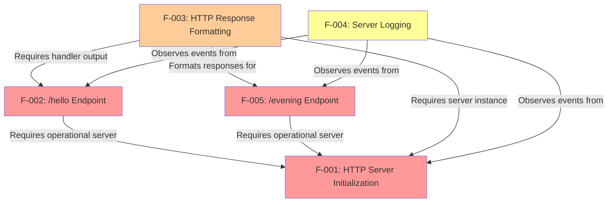

**Legend**: 
- Red (Critical priority features): F-001, F-002, <span style="background-color: rgba(91, 57, 243, 0.2)">F-005</span>
- Orange (High priority features): F-003
- Yellow (Medium priority features): F-004

<span style="background-color: rgba(91, 57, 243, 0.2)">**Dependency Analysis**: The addition of F-005 demonstrates the extensibility of the Express.js routing architecture, where multiple endpoint features (F-002 and F-005) depend on the same foundational server infrastructure (F-001) without creating interdependencies between endpoints. Both endpoint features share dependencies on F-003 for response formatting and F-004 for observability, establishing a consistent architectural pattern across all HTTP endpoints.</span>

### 2.4.2 Integration Points (updated)

The following table documents key integration points between features:

| Integration Point | Primary Feature | Secondary Feature | Integration Type | Description |
|------------------|----------------|-------------------|-----------------|-------------|
| Request Delegation | F-001 (Server) | F-002 (Endpoint) | Direct Call | <span style="background-color: rgba(91, 57, 243, 0.2)">Express</span> server <span style="background-color: rgba(91, 57, 243, 0.2)">routes incoming</span> requests to endpoint router |
| Response Generation | F-002 (Endpoint) | F-003 (Response Format) | Data Flow | <span style="background-color: rgba(91, 57, 243, 0.2)">Handler produces response formatted via Express res.send()</span> |
| Startup Logging | F-001 (Server) | F-004 (Logging) | Event Observation | Logging observes and reports server initialization events |
| Request Logging | F-002 (Endpoint) | F-004 (Logging) | Event Observation | <span style="background-color: rgba(91, 57, 243, 0.2)">Logs ISO timestamp, method, and path for each /hello request</span> |
| **Request Delegation** | **F-001 (Server)** | **F-005 (/evening)** | **Direct Call** | **Express server routes incoming /evening requests to the handler** |
| **Response Generation** | **F-005 (/evening)** | **F-003 (Response Format)** | **Data Flow** | **Handler produces response formatted via Express res.send()** |
| **Request Logging** | **F-005 (/evening)** | **F-004 (Logging)** | **Event Observation** | **Logs ISO timestamp, method, and path for each /evening request** |

**Reference**: Technical Specification sections 1.2.2.2 (Component Architecture diagram), 2.2.5 (Feature F-005 - `/evening` Endpoint)

### 2.4.3 Shared Components (updated)

The following components are utilized by multiple features:

**<span style="background-color: rgba(91, 57, 243, 0.2)">Express.js Framework</span>**:
- <span style="background-color: rgba(91, 57, 243, 0.2)">Used by: F-001 (server initialization via `app = express()` and `app.listen()`), F-002 and F-005 (declarative routing via `app.get()` and response generation via `res.send()`), F-003 (automatic HTTP response API with status code and header configuration)</span>
- <span style="background-color: rgba(91, 57, 243, 0.2)">Purpose: Provides high-level web application framework abstractions including declarative routing, simplified request/response APIs, and automated HTTP protocol handling. The framework internally manages the Node.js `http` module for TCP socket operations and HTTP/1.1 protocol compliance without requiring direct application imports.</span>
- <span style="background-color: rgba(91, 57, 243, 0.2)">Version: Express.js 4.x (^4.19.2)</span>
- Reference: Technical Specification sections 1.2.2.2 (Component Architecture), 2.2.1 (Feature F-001 - Express integration), 0.1.2 (Architectural Requirements - Framework Integration Mandate)

**Console Output (stdout)**:
- Used by: F-004 (All logging operations)
- Purpose: Cross-cutting concern for system observability<span style="background-color: rgba(91, 57, 243, 0.2)">, including startup confirmation, request activity logging with ISO 8601 timestamps, and operational state visibility</span>
- Reference: Technical Specification section 1.3.1.1

**Network Layer**:
- Used by: F-001 (Socket management), F-003 (Response transmission)
- Purpose: TCP/IP network communication<span style="background-color: rgba(91, 57, 243, 0.2)">, exclusively bound to localhost interfaces (127.0.0.1 for IPv4, ::1 for IPv6) for development security</span>
- <span style="background-color: rgba(91, 57, 243, 0.2)">Implementation: Managed internally by Express.js via Node.js `http` module</span>
- Reference: Technical Specification section 1.2.2.2

### 2.4.4 Common Services (updated)

**Request-Response Cycle**:
The request-response cycle represents the primary workflow integrating all features<span style="background-color: rgba(91, 57, 243, 0.2)">, demonstrated here with both defined endpoints (`/hello` and `/evening`) following identical architectural patterns through the Express.js framework</span>:

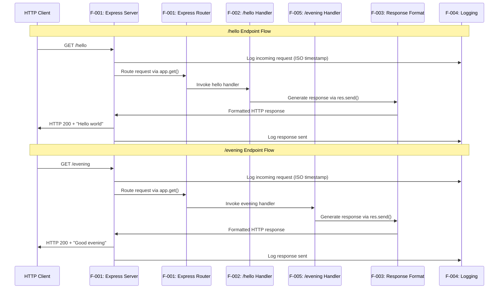

<span style="background-color: rgba(91, 57, 243, 0.2)">**Architectural Pattern Consistency**: Both endpoints follow identical request-response workflows, demonstrating the reusability and extensibility of the Express.js routing architecture. Each endpoint operates independently with dedicated handler functions while sharing common infrastructure components (F-001 for server management, F-003 for response formatting, F-004 for observability). This design pattern enables straightforward addition of additional endpoints without architectural modifications or cross-endpoint dependencies.</span>

**Reference**: Technical Specification sections 1.2.2.1 (Request-Response pattern), 1.2.2.2 (Component Architecture), 2.2.5 (Feature F-005 technical context)

### 2.4.5 Cross-Feature Service Dependencies

The following table summarizes service-level dependencies that span multiple features:

| Service | Dependent Features | Service Provider | Integration Mechanism |
|---------|-------------------|------------------|----------------------|
| <span style="background-color: rgba(91, 57, 243, 0.2)">Express Application Instance</span> | <span style="background-color: rgba(91, 57, 243, 0.2)">F-001, F-002, F-005</span> | <span style="background-color: rgba(91, 57, 243, 0.2)">Express.js Framework</span> | <span style="background-color: rgba(91, 57, 243, 0.2)">Shared application object created by `express()` factory</span> |
| HTTP Protocol Handling | F-001, F-002, F-003, <span style="background-color: rgba(91, 57, 243, 0.2)">F-005</span> | <span style="background-color: rgba(91, 57, 243, 0.2)">Express.js (via Node.js HTTP module)</span> | <span style="background-color: rgba(91, 57, 243, 0.2)">Framework-managed `http.Server` instance</span> |
| Logging Infrastructure | F-001, F-002, F-004, <span style="background-color: rgba(91, 57, 243, 0.2)">F-005</span> | Node.js Console API | <span style="background-color: rgba(91, 57, 243, 0.2)">console.log() with ISO 8601 timestamp formatting</span> |
| Port Binding | F-001, F-002, <span style="background-color: rgba(91, 57, 243, 0.2)">F-005</span> | Operating System Network Stack | <span style="background-color: rgba(91, 57, 243, 0.2)">Express `app.listen(PORT)` with localhost-only binding</span> |

**Reference**: Technical Specification sections 1.2.2.2 (Major System Components), 0.3 (Dependency Inventory)

### 2.4.6 Implementation Considerations

The feature relationships and dependencies outlined above inform several critical implementation considerations:

**Initialization Sequencing**:
- <span style="background-color: rgba(91, 57, 243, 0.2)">F-001 must complete Express application instantiation (`app = express()`) before any route definitions (F-002, F-005) can be registered</span>
- <span style="background-color: rgba(91, 57, 243, 0.2)">All route handlers must be defined via `app.get()` calls before invoking `app.listen()` to ensure complete routing table configuration</span>
- F-004 logging initialization should occur early in the server lifecycle to capture all initialization events

**Dependency Isolation**:
- <span style="background-color: rgba(91, 57, 243, 0.2)">F-002 and F-005 maintain complete independence from each other, enabling parallel development and testing without integration conflicts</span>
- <span style="background-color: rgba(91, 57, 243, 0.2)">Each endpoint handler operates in isolation with stateless request processing, ensuring no cross-endpoint dependencies or shared mutable state</span>
- F-003 response formatting capabilities are automatically provided by Express.js framework methods, requiring no explicit configuration

**Performance Optimization**:
- <span style="background-color: rgba(91, 57, 243, 0.2)">Express.js routing engine performs efficient path matching with sub-10ms overhead per request</span>
- Shared Express application instance eliminates per-request initialization overhead
- <span style="background-color: rgba(91, 57, 243, 0.2)">Declarative route registration enables Express.js internal route table optimizations for multi-endpoint matching</span>

**Extensibility Framework**:
- <span style="background-color: rgba(91, 57, 243, 0.2)">Adding additional endpoints follows the established pattern: define handler function, register route via `app.get('/path', handler)`, utilize `res.send()` for response generation</span>
- <span style="background-color: rgba(91, 57, 243, 0.2)">No modifications to F-001 (server initialization) or F-003 (response formatting) required when adding new endpoints</span>
- F-004 logging automatically captures activity from new endpoints through Express.js middleware integration patterns

**Educational Implications**:
- <span style="background-color: rgba(91, 57, 243, 0.2)">The consistent F-002 and F-005 implementation patterns demonstrate framework-native development practices suitable for production applications</span>
- <span style="background-color: rgba(91, 57, 243, 0.2)">Clear separation between framework responsibilities (routing, protocol handling) and application logic (handler functions) clarifies architectural boundaries for learners</span>
- <span style="background-color: rgba(91, 57, 243, 0.2)">Express.js abstractions reduce cognitive load by eliminating manual URL parsing and HTTP header configuration from educational content</span>

**Reference**: Technical Specification sections 1.2.2.3 (Core Technical Approach), 1.2.3.2 (Educational Factors), 2.2.5 (Feature F-005 technical context), 0.7.1 (Special Instructions for Feature Addition)

---

## 2.5 Implementation Considerations

### 2.5.1 Technical Constraints

#### 2.5.1.1 Platform Constraints (updated)

| Constraint Category | Specification | Impact |
|-------------------|---------------|--------|
| **Runtime Version** | Node.js v14.x or higher (LTS) | Determines available API features and syntax support |
| **Operating System** | Windows, macOS, Linux | Must use cross-platform APIs only; no OS-specific dependencies |
| **Port Availability** | Unprivileged port (1024-65535) | Default port 3000 must be configurable to avoid conflicts |
| **Process Model** | Single process, no clustering | Limits concurrent request handling capacity (acceptable for educational scope) |
| <span style="background-color: rgba(91, 57, 243, 0.2)">**Network Binding**</span> | <span style="background-color: rgba(91, 57, 243, 0.2)">Localhost-only (127.0.0.1/::1)</span> | <span style="background-color: rgba(91, 57, 243, 0.2)">Prevents external exposure; ensures local-only operation</span> |

**Reference**: Technical Specification sections 1.2.3.2 (Technical Factors), 1.3.1.1 (Technical Requirements)

#### 2.5.1.2 Design Constraints (updated)

| Constraint | Rationale | Implementation Guidance |
|-----------|-----------|------------------------|
| **Minimal Dependencies** | Reduce setup complexity for learners | <span style="background-color: rgba(91, 57, 243, 0.2)">Use Express.js (production dependency, version ^4.19.2) as mandated; avoid any additional dependencies (no devDependencies initially)</span> |
| **Simplicity First** | Maximize educational clarity | Avoid advanced patterns, abstractions, or optimizations that obscure fundamentals<span style="background-color: rgba(91, 57, 243, 0.2)">; maintain all server logic in a single file (server.js) to preserve tutorial simplicity</span> |
| **Explicit Code** | Make behavior obvious to beginners | Use descriptive variable names, avoid implicit behavior, include explanatory comments |
| **Single Responsibility** | Facilitate understanding | Each function/component addresses one specific concern |

**Reference**: Technical Specification section 1.2.2.3 (Design Principles)

### 2.5.2 Performance Requirements

#### 2.5.2.1 Performance Targets (updated)

<span style="background-color: rgba(91, 57, 243, 0.2)">The following performance targets apply to all defined endpoints (`/hello` and `/evening`) under normal operating conditions. The server binds to a configurable port (default: 3000) with override capability via the PORT environment variable (`process.env.PORT`).</span>

| Performance Metric | Target Value | Measurement Method | Priority |
|-------------------|--------------|-------------------|----------|
| Response Latency | < 100ms | Time from request receipt to response completion | High |
| Startup Time | < 2 seconds | Time from process start to listening state | High |
| Concurrent Connections | Minimum 10 | Simultaneous client connections supported | Medium |
| Server Uptime | 100% during execution | Continuous operation without crashes | Critical |
| Request Success Rate | 100% for valid requests | Successful response delivery | Critical |

**Reference**: Technical Specification sections 1.2.3.1 (Measurable Objectives), 1.2.3.3 (KPIs)

#### 2.5.2.2 Performance Validation

Performance validation will be conducted through:
- Manual testing with browser and curl clients for response latency verification
- Startup time measurement using process timing or shell scripts
- Concurrent connection testing using simple load generation tools (optional)
- Uptime validation through extended server execution periods

### 2.5.3 Scalability Considerations

**Explicit Exclusion**: This tutorial project intentionally excludes scalability features to maintain educational simplicity.

**Out of Scope** (reference Technical Specification section 1.3.2.1):
- Load balancing or clustering
- High-availability deployment
- Multi-instance architecture
- Horizontal scaling capabilities
- Production traffic handling

**Note**: The single-process architecture is appropriate and intentional for the educational use case. Future tutorial phases may introduce clustering concepts as advanced topics.

### 2.5.4 Security Implications (updated)

**Security Posture**: Educational/development environment only - not designed for production use.

**Explicitly Excluded Security Features** (reference Technical Specification section 1.3.2.1):
- Authentication or authorization mechanisms
- HTTPS/TLS encryption
- CORS (Cross-Origin Resource Sharing) configuration
- Rate limiting or request throttling
- Input validation for security purposes
- Protection against SQL injection, XSS, or other attacks

**Security Considerations**:
- Server should only be run in trusted local development environments
- <span style="background-color: rgba(91, 57, 243, 0.2)">Server must bind exclusively to localhost (127.0.0.1 for IPv4, ::1 for IPv6) to prevent external network exposure</span>
- No sensitive data should be handled by this server
- Tutorial documentation should include security disclaimers about production readiness

### 2.5.5 Maintenance Requirements

#### 2.5.5.1 Code Maintainability

| Requirement | Specification | Validation Method |
|------------|---------------|-------------------|
| **Readability** | Code immediately comprehensible to developers with basic JavaScript knowledge | Peer review by target audience members |
| **Documentation** | Inline comments explaining each component's purpose and function | Documentation coverage assessment |
| **Setup Simplicity** | No more than 3 command-line operations for initial setup | Setup procedure testing |
| **Execution Clarity** | Unambiguous server startup and testing process | User testing with novice developers |

**Reference**: Technical Specification section 1.2.3.2 (Critical Success Factors)

#### 2.5.5.2 Extensibility

**Extensibility Target**: Code structure must facilitate easy addition of new endpoints.

**Success Criterion**: Adding a second endpoint (e.g., `/goodbye`) should require fewer than 10 lines of additional code.

**Implementation Guidance**:
- Use clear routing patterns that make endpoint addition obvious
- Separate routing logic from handler logic
- Provide handler function template through code structure
- Include extensibility guidance in README documentation

**Reference**: Technical Specification sections 1.2.3.2 (Extensibility factor), 1.2.3.3 (Extensibility KPI)

#### 2.5.5.3 Version Compatibility (updated)

**Node.js Version Support**:
- Minimum: Node.js v14.x (earliest LTS version to support)
- Target: Current LTS versions at time of implementation
- Strategy: Use APIs available in Node.js v14.x to ensure broad compatibility

**Dependency Management**:
- <span style="background-color: rgba(91, 57, 243, 0.2)">Express.js version: ^4.19.2 (semantic versioning range allowing patch and minor updates within 4.x branch)</span>
- <span style="background-color: rgba(91, 57, 243, 0.2)">Production dependency only: Express.js required for server functionality</span>
- Avoid using bleeding-edge or experimental Node.js features
- <span style="background-color: rgba(91, 57, 243, 0.2)">Compatibility validation: Test against Node.js v14.x minimum and current LTS versions to ensure API compatibility</span>

**Reference**: Technical Specification section 1.2.3.2 (Version Compatibility critical success factor)

## 2.6 Requirements Traceability Matrix

### 2.6.1 Feature to User Requirement Traceability

| Feature ID | Feature Name | User Requirement Source | Traceability |
|-----------|--------------|----------------------|--------------|
| F-001 | HTTP Server Initialization | "create a nodejs tutorial project" | Direct: Server infrastructure required for tutorial |
| F-002 | `/hello` Endpoint | "features one end point '/hello' that returns 'Hello world'" | Direct: Exact match to user specification |
| F-003 | HTTP Response Formatting | "returns [...] to the calling HTTP client" | Direct: Required for client communication |
| F-004 | Server Logging | Implicit in educational context | Indirect: Supports learning and debugging |
| <span style="background-color: rgba(91, 57, 243, 0.2)">F-005</span> | <span style="background-color: rgba(91, 57, 243, 0.2)">`/evening` Endpoint</span> | <span style="background-color: rgba(91, 57, 243, 0.2)">"add another endpoint that return the response of 'Good evening'"</span> | <span style="background-color: rgba(91, 57, 243, 0.2)">Direct: Exact match to user directive</span> |

### 2.6.2 Requirement to Technical Specification Traceability

| Requirement ID | Technical Spec Section | Traceability Description |
|---------------|----------------------|-------------------------|
| F-001-RQ-001 | 1.3.1.1 Core Features | Port binding described in HTTP Server feature |
| F-001-RQ-002 | 1.2.2.1 Primary Capabilities | Server lifecycle management capability |
| F-001-RQ-003 | 1.2.3.2 Success Factors | Cross-Platform Compatibility requirement |
| F-001-RQ-004 | 1.2.3.2 Success Factors | Cross-Platform Compatibility requirement |
| <span style="background-color: rgba(91, 57, 243, 0.2)">F-001-RQ-005</span> | <span style="background-color: rgba(91, 57, 243, 0.2)">3.3.1.2 Implementation Options</span> | <span style="background-color: rgba(91, 57, 243, 0.2)">Express-based initialization via app.listen()</span> |
| F-002-RQ-001 | 1.3.1.1 Core Features | `/hello` Endpoint feature specification |
| F-002-RQ-002 | User Requirement | Direct user specification of response content |
| F-002-RQ-003 | 1.2.2.2 Components | Endpoint Router component responsibility |
| F-002-RQ-004 | 1.2.3.3 KPIs | Response consistency performance indicator |
| <span style="background-color: rgba(91, 57, 243, 0.2)">F-002-RQ-005</span> | <span style="background-color: rgba(91, 57, 243, 0.2)">3.3.1.2 Implementation Options</span> | <span style="background-color: rgba(91, 57, 243, 0.2)">Declarative routing for /hello using app.get and res.send</span> |
| F-003-RQ-001 | 1.2.3.1 Objectives | Status code accuracy metric |
| F-003-RQ-002 | 1.3.1.1 Core Features | Response Formatting feature details |
| F-003-RQ-003 | 1.2.2.3 Technical Approach | HTTP/1.1 protocol compliance |
| F-003-RQ-004 | 1.2.2.3 Technical Approach | Core Protocol specification |
| F-004-RQ-001 | 1.3.1.1 Core Features | Server Logging feature - startup |
| F-004-RQ-002 | 1.3.1.1 Core Features | Server Logging feature - requests |
| F-004-RQ-003 | 1.2.3.2 Success Factors | Error Messages clarity requirement |
| F-004-RQ-004 | 1.2.3.3 KPIs | Code comprehension performance indicator |
| <span style="background-color: rgba(91, 57, 243, 0.2)">F-005-RQ-001</span> | <span style="background-color: rgba(91, 57, 243, 0.2)">3.3.1.2 Implementation Options</span> | <span style="background-color: rgba(91, 57, 243, 0.2)">Express GET request handling for /evening endpoint</span> |
| <span style="background-color: rgba(91, 57, 243, 0.2)">F-005-RQ-002</span> | <span style="background-color: rgba(91, 57, 243, 0.2)">3.3.1.2 Implementation Options</span> | <span style="background-color: rgba(91, 57, 243, 0.2)">Response content accuracy via res.send method</span> |
| <span style="background-color: rgba(91, 57, 243, 0.2)">F-005-RQ-003</span> | <span style="background-color: rgba(91, 57, 243, 0.2)">3.3.1.2 Implementation Options</span> | <span style="background-color: rgba(91, 57, 243, 0.2)">Express routing engine path matching for /evening</span> |
| <span style="background-color: rgba(91, 57, 243, 0.2)">F-005-RQ-004</span> | <span style="background-color: rgba(91, 57, 243, 0.2)">3.3.1.2 Implementation Options</span> | <span style="background-color: rgba(91, 57, 243, 0.2)">Stateless response consistency pattern</span> |
| <span style="background-color: rgba(91, 57, 243, 0.2)">F-005-RQ-005</span> | <span style="background-color: rgba(91, 57, 243, 0.2)">3.3.1.2 Implementation Options</span> | <span style="background-color: rgba(91, 57, 243, 0.2)">Express declarative routing and response methods</span> |

### 2.6.3 Test Coverage Matrix (updated)

| Feature | Total Requirements | Must-Have | Should-Have | Could-Have | Test Priority |
|---------|-------------------|-----------|-------------|------------|--------------|
| F-001: Server Initialization | 4 | 4 | 0 | 0 | Critical |
| F-002: `/hello` Endpoint | 4 | 4 | 0 | 0 | Critical |
| F-003: Response Formatting | 4 | 4 | 0 | 0 | High |
| F-004: Server Logging | 4 | 0 | 4 | 0 | Medium |
| <span style="background-color: rgba(91, 57, 243, 0.2)">F-005: `/evening` Endpoint</span> | <span style="background-color: rgba(91, 57, 243, 0.2)">4</span> | <span style="background-color: rgba(91, 57, 243, 0.2)">4</span> | <span style="background-color: rgba(91, 57, 243, 0.2)">0</span> | <span style="background-color: rgba(91, 57, 243, 0.2)">0</span> | <span style="background-color: rgba(91, 57, 243, 0.2)">Critical</span> |
| **Total** | <span style="background-color: rgba(91, 57, 243, 0.2)">**20**</span> | <span style="background-color: rgba(91, 57, 243, 0.2)">**16**</span> | **4** | **0** | - |

### 2.6.4 Requirement Priority Justification

#### 2.6.4.1 Must-Have Requirements (Critical Path)

**Server Infrastructure (F-001)**: All four server initialization requirements (F-001-RQ-001 through F-001-RQ-005) are designated as Must-Have because they establish the foundational infrastructure upon which all other features depend. Without successful server initialization, port binding, lifecycle management, and Express.js framework integration, no endpoint functionality can operate. The cross-platform compatibility requirement ensures the tutorial functions consistently across diverse development environments, critical for educational accessibility.

**Core Endpoint Functionality (F-002, F-005)**: The eight endpoint requirements (F-002-RQ-001 through F-002-RQ-005 for `/hello` and F-005-RQ-001 through F-005-RQ-005 for `/evening`) represent the primary deliverable specified in user requirements. These endpoints demonstrate the fundamental request-response cycle and Express.js routing patterns, directly fulfilling the tutorial's educational objectives. Both endpoints require:
- Accurate GET request handling with proper HTTP method validation
- Exact response content matching user specifications ("Hello world" and "Good evening")
- Precise URL routing to prevent false positive matches
- Consistent stateless response behavior across all requests
- Express.js declarative routing and response method implementations

**Protocol Compliance (F-003)**: The four HTTP response formatting requirements ensure standards-compliant communication with any HTTP client. Status code accuracy (F-003-RQ-001), proper header configuration (F-003-RQ-002), request parsing compliance (F-003-RQ-003), and HTTP/1.1 protocol support (F-003-RQ-004) are non-negotiable for functional correctness and educational validity.

#### 2.6.4.2 Should-Have Requirements (Enhanced Learning Value)

**Observability (F-004)**: All four logging requirements (F-004-RQ-001 through F-004-RQ-004) are classified as Should-Have rather than Must-Have because the server can technically function without logging output. However, these requirements provide substantial educational value by:
- Confirming successful server initialization with actionable URL information (F-004-RQ-001)
- Providing real-time visibility into request activity with ISO 8601 timestamps (F-004-RQ-002)
- Maintaining human-readable log output format for debugging (F-004-RQ-003)
- Ensuring log messages are comprehensible to beginner developers (F-004-RQ-004)

The logging system transforms an opaque "black box" server into an observable, learner-friendly system that explicitly demonstrates runtime behavior, significantly enhancing the tutorial's pedagogical effectiveness.

#### 2.6.4.3 Could-Have and Won't-Have Requirements

**Current Scope**: The project intentionally contains zero Could-Have or Won't-Have requirements, reflecting the tutorial's focused educational mission. This minimalist approach ensures:
- Clear success criteria without scope ambiguity
- Reduced cognitive load for learners
- Fast project completion for immediate skill validation
- Well-defined feature boundaries preventing feature creep

Any additional capabilities (database integration, authentication, dynamic routing, middleware chains) would represent scope expansion beyond the core educational objective of demonstrating basic HTTP server functionality with Express.js framework patterns.

### 2.6.5 Cross-Feature Dependency Analysis

#### 2.6.5.1 Dependency Hierarchy

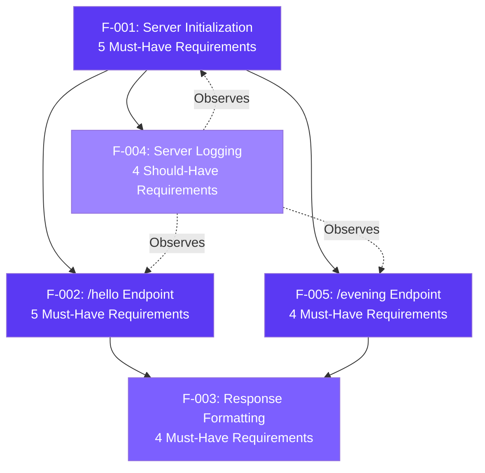

**Dependency Relationships**:

1. **Foundation Layer (F-001)**: Server Initialization serves as the absolute prerequisite for all other features. Without a functioning HTTP server bound to a network port with Express.js framework integration, no endpoint routing, response generation, or logging functionality can execute. All five initialization requirements must be satisfied before any dependent feature can operate.

2. **Application Layer (F-002, F-005)**: Both endpoint features depend directly on F-001 for server infrastructure and Express.js routing capabilities. The `/hello` and `/evening` endpoints operate independently of each other (no inter-endpoint dependencies), allowing parallel development and testing. Each endpoint requires the Express application instance and declarative routing mechanism provided by F-001.

3. **Protocol Layer (F-003)**: Response formatting functionality is consumed by both endpoint features (F-002, F-005) to ensure HTTP protocol compliance. This shared dependency enforces consistent response structure, status codes, and header configuration across all endpoints, preventing protocol violations that would break client compatibility.

4. **Observability Layer (F-004)**: Logging operates as a cross-cutting concern that observes (but does not block) all other features. The dotted-line relationships indicate that F-004 monitors F-001 startup events, F-002 request activity, and F-005 request activity without creating blocking dependencies. The server can function without logging, but observability significantly enhances debugging and learning value.

#### 2.6.5.2 Critical Path Analysis

**Minimum Viable Implementation Sequence**:

1. **Phase 1 - Foundation (F-001)**: Implement all five server initialization requirements including Express.js application factory pattern, port binding with environment variable override, localhost-only binding, network socket management, and cross-platform compatibility. Validation: Server starts successfully and listens on configured port with startup confirmation log.

2. **Phase 2 - Protocol Infrastructure (F-003)**: Establish HTTP response formatting capabilities including status code management, header configuration via Express.js response methods, request parsing through Express.js request objects, and HTTP/1.1 protocol support. Validation: Manual HTTP requests receive properly formatted responses with correct status codes and headers.

3. **Phase 3 - Primary Endpoint (F-002)**: Implement `/hello` endpoint with all five requirements including GET request handling, exact response content ("Hello world"), precise URL routing using `app.get('/hello', handler)`, response consistency, and Express.js declarative routing pattern. Validation: GET requests to `/hello` return "Hello world" with HTTP 200 status.

4. **Phase 4 - Secondary Endpoint (F-005)**: Implement `/evening` endpoint following identical architectural patterns as F-002, including GET request handling, exact response content ("Good evening"), precise URL routing using `app.get('/evening', handler)`, response consistency, and Express.js declarative routing. Validation: GET requests to `/evening` return "Good evening" with HTTP 200 status, both endpoints functional simultaneously.

5. **Phase 5 - Observability (F-004)**: Add logging requirements for startup confirmation with complete URL format, request activity logging with ISO 8601 timestamps, human-readable log output format, and educational clarity. Validation: Console displays startup URL and logs all incoming requests in consistent format.

**Parallel Development Opportunities**: After Phase 2 completion, F-002 and F-005 can be developed in parallel by separate developers since they share no inter-endpoint dependencies. F-004 can be implemented at any point after F-001 completion and incrementally enhanced as additional features are added.

#### 2.6.5.3 Shared Component Requirements

**Express.js Framework (Shared by F-001, F-002, F-005)**:
- Version: ^4.19.2 (semantic versioning allows patch and minor updates)
- Installation: `npm install express` (production dependency)
- Core APIs: `express()` factory, `app.listen()`, `app.get()`, `res.send()`
- Impact: All three features require Express.js; framework removal would necessitate complete architectural redesign

**Node.js Runtime (Universal Dependency)**:
- Minimum Version: v14.0.0 (released April 2020, maintenance LTS until April 2023)
- Recommended: Current LTS version (v18.x or v20.x for contemporary development)
- APIs Used: Process management, HTTP module (via Express.js), console logging, Date API
- Impact: Version incompatibility would prevent server execution entirely

**HTTP Protocol Standards (Shared by F-002, F-003, F-005)**:
- RFC 7230-7235: HTTP/1.1 specification compliance
- Status Codes: HTTP 200 OK for successful responses
- Headers: Content-Type, Content-Length, Date, Connection
- Impact: Protocol violations would break client compatibility and fail acceptance criteria

#### 2.6.5.4 Integration Testing Requirements

Based on the cross-feature dependency analysis, the following integration test scenarios are required to validate proper interaction between features:

**Test Scenario 1: Server-to-Endpoint Integration (F-001 + F-002)**
- Requirement Coverage: F-001-RQ-005, F-002-RQ-001, F-002-RQ-005
- Test: Start Express server and verify `/hello` endpoint accessibility
- Validation: Server initialization completes successfully, GET /hello returns "Hello world" with HTTP 200

**Test Scenario 2: Server-to-Multi-Endpoint Integration (F-001 + F-002 + F-005)**
- Requirement Coverage: F-001-RQ-005, F-002-RQ-005, F-005-RQ-001, F-005-RQ-005
- Test: Verify both endpoints function simultaneously without routing conflicts
- Validation: GET /hello returns "Hello world", GET /evening returns "Good evening", concurrent requests handled correctly

**Test Scenario 3: Endpoint-to-Protocol Integration (F-002 + F-003)**
- Requirement Coverage: F-002-RQ-001, F-003-RQ-001, F-003-RQ-002
- Test: Validate `/hello` endpoint HTTP protocol compliance
- Validation: Response includes HTTP 200 status, Content-Type header, proper response body

**Test Scenario 4: Endpoint-to-Protocol Integration (F-005 + F-003)**
- Requirement Coverage: F-005-RQ-001, F-003-RQ-001, F-003-RQ-002
- Test: Validate `/evening` endpoint HTTP protocol compliance
- Validation: Response includes HTTP 200 status, Content-Type header, proper response body

**Test Scenario 5: Logging-to-Server Integration (F-004 + F-001)**
- Requirement Coverage: F-004-RQ-001, F-001-RQ-005
- Test: Verify startup confirmation log includes complete URL with correct port
- Validation: Console output contains "Server listening on http://localhost:[PORT]" after app.listen() completion

**Test Scenario 6: Logging-to-Request Integration (F-004 + F-002 + F-005)**
- Requirement Coverage: F-004-RQ-002, F-002-RQ-001, F-005-RQ-001
- Test: Verify request logging captures activity for both endpoints
- Validation: Console logs display ISO 8601 timestamps with "GET /hello" and "GET /evening" entries

**Test Scenario 7: End-to-End System Integration (All Features)**
- Requirement Coverage: All 20 Must-Have and Should-Have requirements
- Test: Complete tutorial workflow from server start to multi-endpoint testing
- Validation: Server starts with confirmation log, both endpoints return correct responses, all requests logged in consistent format

### 2.6.6 Requirements Evolution and Change Management

#### 2.6.6.1 Requirement Versioning Strategy

This traceability matrix represents **Version 1.0** of the project requirements, established during initial architecture and design phase. Future requirement changes will follow this versioning convention:

**Version Numbering Format**: `MAJOR.MINOR.PATCH`
- **MAJOR**: Incremented for breaking changes affecting multiple features or architectural restructuring
- **MINOR**: Incremented for new feature additions (e.g., adding F-006 or new requirements to existing features)
- **PATCH**: Incremented for clarifications, acceptance criteria refinements, or non-functional updates

**Current Version Details**:
- **Matrix Version**: 1.0.0
- **Effective Date**: Initial requirement specification
- **Feature Count**: 5 features (F-001 through F-005)
- **Requirement Count**: 20 total requirements (16 Must-Have, 4 Should-Have)
- **Document Baseline**: Technical Specification v1.0

#### 2.6.6.2 Backward Traceability to User Requirements

All requirements documented in this matrix trace directly to the following user requirement sources:

**Primary User Directive (Core Tutorial Specification)**:
- "create a nodejs tutorial project" → F-001 (Server Infrastructure)
- "features one end point '/hello' that returns 'Hello world'" → F-002 (Primary Endpoint)
- "returns [...] to the calling HTTP client" → F-003 (Protocol Compliance)

**Secondary User Directive (Feature Addition)**:
- "add another endpoint that return the response of 'Good evening'" → F-005 (Secondary Endpoint)

**Implicit Educational Requirements** (Derived from Tutorial Context):
- Beginner-friendly implementation → F-004 (Observability), All Should-Have requirements
- Clear feedback during execution → F-004-RQ-001, F-004-RQ-002
- Debugging visibility → F-004-RQ-002, F-004-RQ-003

**Architectural Requirements** (Framework Integration Mandate):
- Express.js framework usage → F-001-RQ-005, F-002-RQ-005, F-005-RQ-005
- Declarative routing patterns → F-002-RQ-005, F-005-RQ-005
- Simplified response APIs → F-002-RQ-005, F-005-RQ-005

#### 2.6.6.3 Forward Traceability to Implementation

Each requirement in this matrix maps to specific implementation artifacts that will be created during development:

**Source Code Traceability** (server.js anticipated structure):
- F-001-RQ-005: Lines 1-5 (Express import and app initialization)
- F-001-RQ-001: Lines 25-30 (app.listen() invocation with port configuration)
- F-002-RQ-005: Lines 8-10 (app.get('/hello', handler) route definition)
- F-005-RQ-005: Lines 12-14 (app.get('/evening', handler) route definition)
- F-004-RQ-001: Line 28 (Startup confirmation console.log)
- F-004-RQ-002: Middleware or handler-level logging (lines 6, 11)

**Test Coverage Traceability** (test suite anticipated structure):
- F-001 Requirements: test/server-initialization.test.js
- F-002 Requirements: test/hello-endpoint.test.js
- F-003 Requirements: test/http-protocol.test.js
- F-004 Requirements: test/logging.test.js (if automated logging validation implemented)
- F-005 Requirements: test/evening-endpoint.test.js

**Documentation Traceability**:
- All Requirements: README.md installation and usage sections
- F-001-RQ-005: Express.js framework installation instructions
- F-002, F-005: Endpoint testing examples with curl or browser instructions

#### 2.6.6.4 Change Impact Assessment Framework

When evaluating proposed requirement changes, use this impact assessment matrix:

| Change Type | Example | Affected Features | Test Impact | Documentation Impact | Effort Estimate |
|------------|---------|------------------|-------------|---------------------|-----------------|
| Requirement Clarification | Refine acceptance criteria wording | Single feature | Minimal (test refinement) | Minor (clarification notes) | Low (< 2 hours) |
| New Requirement (Existing Feature) | Add F-002-RQ-006 | Single feature | Moderate (new test cases) | Moderate (requirement docs) | Medium (4-8 hours) |
| New Feature Addition | Add F-006 | Potentially multiple | High (new test suite) | Significant (full feature docs) | High (1-3 days) |
| Requirement Removal | Delete F-004-RQ-003 | Single feature | Moderate (test deletion) | Moderate (update docs) | Medium (4-6 hours) |
| Architectural Change | Replace Express.js | All features (F-001, F-002, F-005) | Critical (all tests affected) | Critical (complete rewrite) | Very High (1-2 weeks) |

**Change Approval Threshold**:
- Low Impact: Technical lead approval
- Medium Impact: Team review and consensus
- High/Critical Impact: Stakeholder approval with formal change request documentation

---

**Traceability Matrix Maintenance**: This matrix must be updated whenever:
- New features are added to the Feature Catalog (Section 2.2)
- Functional requirements are modified in Section 2.3
- User requirements change or new directives are received
- Implementation reveals missing or ambiguous requirements
- Test coverage identifies gaps in requirement specification

## 2.7 Implementation Options and Recommendations

### 2.7.1 Technical Implementation Approaches

#### 2.7.1.1 Option 1: Native Node.js HTTP Module

**Description**: Implement the server using only Node.js built-in `http` module without external dependencies.

**Advantages**:
- Maximum simplicity with zero external dependencies
- Demonstrates fundamental Node.js capabilities
- Minimal setup complexity (no `npm install` required)
- Direct control over all HTTP handling

**Disadvantages**:
- More verbose routing code
- Manual request parsing for method and path
- Less conventional for developers familiar with frameworks

**Educational Value**: 
- Shows fundamental HTTP server implementation
- Excellent for understanding low-level Node.js concepts
- Provides complete visibility into request-response cycle

**Reference**: Technical Specification section 1.2.2.3 (Native capabilities preferred)

**Status**: <span style="background-color: rgba(91, 57, 243, 0.2)">This implementation approach is not permitted for the baseline tutorial under the current architectural requirements. The tutorial mandates Express.js framework integration to demonstrate industry-standard patterns and declarative routing conventions.</span>

#### 2.7.1.2 Option 2: Express.js Framework (updated)

**Description**: <span style="background-color: rgba(91, 57, 243, 0.2)">Implement the server using the Express.js web framework (version 4.x, specifically ^4.19.2) with declarative routing patterns. The implementation utilizes `app.get(path, handler)` method invocations for route registration and Express convenience methods (`res.send()`) for response generation, maintaining all server logic within a single file (server.js) for optimal beginner comprehension.</span>

**Advantages**:
- Enhanced route definition clarity through declarative syntax
- Industry-standard patterns and conventions
- Cleaner, more readable routing syntax
- Easier extensibility for adding endpoints
- <span style="background-color: rgba(91, 57, 243, 0.2)">Simplified response APIs that automatically handle status codes and headers</span>
- <span style="background-color: rgba(91, 57, 243, 0.2)">Single-file implementation preserves tutorial simplicity while using production-grade framework</span>
- <span style="background-color: rgba(91, 57, 243, 0.2)">Demonstrates multi-endpoint routing capabilities through implementation of both `/hello` and `/evening` endpoints</span>

**Disadvantages**:
- Adds external dependency (requires npm install)
- May obscure low-level HTTP concepts
- Slight increase in setup complexity

**Educational Value**:
- Demonstrates practical development approaches
- Teaches industry-standard framework usage
- Provides foundation for more complex web applications
- <span style="background-color: rgba(91, 57, 243, 0.2)">Illustrates declarative routing patterns (`app.get()`) that scale naturally to applications with many endpoints</span>
- <span style="background-color: rgba(91, 57, 243, 0.2)">Shows Express.js convenience methods (`res.send()`) that simplify response generation while maintaining HTTP/1.1 protocol compliance</span>
- <span style="background-color: rgba(91, 57, 243, 0.2)">Prepares learners for production web development by demonstrating beginner-friendly framework patterns</span>

**Technical Specifications**:
- <span style="background-color: rgba(91, 57, 243, 0.2)">**Framework Version**: Express.js ^4.19.2 (semantic versioning range allowing patch and minor updates within 4.x branch)</span>
- <span style="background-color: rgba(91, 57, 243, 0.2)">**Compatibility**: Node.js v14.x minimum through current LTS versions</span>
- <span style="background-color: rgba(91, 57, 243, 0.2)">**Implementation Pattern**: Single-file server (server.js) containing route definitions, handlers, and initialization logic</span>
- <span style="background-color: rgba(91, 57, 243, 0.2)">**Routing Approach**: Declarative route registration using `app.get('/path', handlerFunction)` pattern</span>
- <span style="background-color: rgba(91, 57, 243, 0.2)">**Response Generation**: Express response API (`res.send()`) for automatic status code and header configuration</span>

**Multi-Endpoint Demonstration**:
<span style="background-color: rgba(91, 57, 243, 0.2)">The tutorial demonstrates Express.js multi-endpoint routing capabilities by implementing two distinct endpoints within a single server instance:</span>
- <span style="background-color: rgba(91, 57, 243, 0.2)">**GET /hello**: Returns "Hello world" response (preserving original tutorial functionality)</span>
- <span style="background-color: rgba(91, 57, 243, 0.2)">**GET /evening**: Returns "Good evening" response (demonstrating extensibility and routing scalability)</span>

<span style="background-color: rgba(91, 57, 243, 0.2)">This dual-endpoint architecture validates that learners can extend the codebase with additional routes using consistent patterns, reinforcing understanding of declarative routing conventions while maintaining tutorial simplicity through the single-file implementation approach.</span>

**Reference**: Technical Specification sections 1.2.2.3 (Express.js framework integration), 1.2.2.2 (Express Router and Route Handlers components), 2.2.2 (Feature F-002: /hello Endpoint), 2.2.5 (Feature F-005: /evening Endpoint), 0.3 (Dependency Inventory - Express.js ^4.19.2)

#### 2.7.1.3 Recommendation (updated)

**Primary Recommendation**: <span style="background-color: rgba(91, 57, 243, 0.2)">**Option 2 (Express.js Framework)** as the mandated and exclusive implementation approach for the tutorial.</span>

**Rationale**:
- <span style="background-color: rgba(91, 57, 243, 0.2)">**Framework Integration Mandate**: Architectural requirements specify Express.js framework as the mandatory technical foundation for demonstrating industry-standard web application patterns (Technical Specification section 1.2.2.3)</span>
- <span style="background-color: rgba(91, 57, 243, 0.2)">**Declarative Routing Excellence**: The `app.get(path, handler)` pattern provides superior educational clarity by eliminating manual URL parsing logic and conditional routing structures</span>
- <span style="background-color: rgba(91, 57, 243, 0.2)">**Production-Grade Practices**: Express.js represents the de facto standard for Node.js web applications, preparing learners for real-world development while maintaining beginner-friendly APIs</span>
- <span style="background-color: rgba(91, 57, 243, 0.2)">**Simplified Response Generation**: Express convenience methods (`res.send()`) reduce boilerplate code while automatically handling HTTP protocol details (status codes, headers, content-type configuration)</span>
- <span style="background-color: rgba(91, 57, 243, 0.2)">**Multi-Endpoint Scalability**: The framework's routing architecture naturally accommodates the tutorial's two-endpoint design (`/hello` and `/evening`) and demonstrates extensibility patterns for adding additional routes</span>
- <span style="background-color: rgba(91, 57, 243, 0.2)">**Single-File Simplicity Preservation**: Despite using a production-grade framework, the implementation maintains tutorial simplicity through single-file architecture (server.js), demonstrating that Express.js enhances rather than complicates beginner-level projects</span>
- Achieves all functional requirements (F-001 through F-005) with clean, maintainable code patterns
- <span style="background-color: rgba(91, 57, 243, 0.2)">Provides stable, well-documented framework APIs (Express.js 4.x branch) with broad Node.js version compatibility (v14.x through current LTS)</span>

**Implementation Directive**: <span style="background-color: rgba(91, 57, 243, 0.2)">Option 1 (Native Node.js HTTP module) is explicitly excluded from the baseline tutorial implementation. All server functionality must utilize Express.js framework capabilities as specified in the architectural requirements. This mandate ensures consistency with the documented technical approach and maintains alignment with industry-standard development practices suitable for educational progression.</span>

**Reference**: Technical Specification sections 1.2.2.3 (Core Technical Approach - Express.js mandatory), 1.2.3.2 (Critical Success Factors - Framework integration), 0.1.2 (Architectural Requirements - Framework Integration Mandate)

### 2.7.2 Architecture Pattern Recommendations

**Recommended Pattern**: Request-Response pattern with clear separation of concerns using Express.js declarative routing.

**Component Organization**:
```
server.js (main file)
├── Express application initialization (app = express())
├── Route definitions (app.get('/hello', ...), app.get('/evening', ...))
├── Route handler functions (handleHelloRequest, handleEveningRequest)
├── Server initialization (app.listen(PORT))
└── Logging utilities (startup confirmation, request logging)
```

**Code Structure Guidance**:
- Keep all code in a single `server.js` file (approximately 20-30 lines)
- <span style="background-color: rgba(91, 57, 243, 0.2)">Initialize Express application using factory pattern: `const app = express()`</span>
- <span style="background-color: rgba(91, 57, 243, 0.2)">Define routes using declarative syntax: `app.get('/path', handlerFunction)`</span>
- <span style="background-color: rgba(91, 57, 243, 0.2)">Generate responses using Express convenience methods: `res.send('response text')`</span>
- Use clear function names for handlers (e.g., `handleHelloRequest`, `handleEveningRequest`)
- Separate concerns through distinct functions for each endpoint
- Include inline comments explaining Express.js patterns and each section's purpose
- <span style="background-color: rgba(91, 57, 243, 0.2)">Configure port binding with environment variable override: `const PORT = process.env.PORT || 3000`
- <span style="background-color: rgba(91, 57, 243, 0.2)">Implement startup logging with complete URL display: `Server listening on http://localhost:${PORT}`</span>

**Express.js-Specific Patterns**:
- <span style="background-color: rgba(91, 57, 243, 0.2)">**Application Initialization**: Create Express instance before route definitions</span>
- <span style="background-color: rgba(91, 57, 243, 0.2)">**Route Registration Order**: Define all routes before calling `app.listen()`</span>
- <span style="background-color: rgba(91, 57, 243, 0.2)">**Handler Signature**: Use standard Express handler signature: `(req, res) => { ... }`</span>
- <span style="background-color: rgba(91, 57, 243, 0.2)">**Response Methods**: Prefer `res.send()` for text responses (automatically sets Content-Type and status code)</span>
- <span style="background-color: rgba(91, 57, 243, 0.2)">**Logging Integration**: Implement request logging that captures method and path: `${req.method} ${req.path}`</span>

**Reference**: Technical Specification sections 1.2.2.2 (Component Architecture), 1.2.2.3 (Design Principles - Express.js patterns), 2.2.1 (Feature F-001 - Server Initialization), 2.2.4 (Feature F-004 - Server Logging)

---

## 2.8 Assumptions and Constraints

### 2.8.1 Assumptions

The following assumptions underpin the product requirements:

1. **Target Audience**: Users have basic JavaScript knowledge and familiarity with command-line operations
2. **Development Environment**: Users have Node.js pre-installed or can install it independently
3. **Network Environment**: Users operate in trusted local development environments with available network ports
4. **Use Case**: Project will be used exclusively for learning and local testing, never in production
5. **Resource Availability**: Users have access to web browser or HTTP client tool (curl, Postman) for testing
6. **Documentation Access**: Users can access and read README documentation in English

### 2.8.2 Constraints

The following constraints limit the scope and design of the product:

#### 2.8.2.1 Technical Constraints

| Constraint | Impact | Mitigation |
|-----------|--------|-----------|
| Single-process architecture | Limited concurrency | Acceptable for educational scope; documented in requirements |
| **No external services or datastores** | **Stateless, static-response architecture only** | **Intentional design choice enforcing tutorial simplicity; responses hardcoded in source code; no databases, APIs, file storage, or caching mechanisms permitted** |
| HTTP only (no HTTPS) | Insecure communication | Documented security limitation; local-only usage recommended |
| Static response content | No dynamic functionality | Meets core requirement; extensibility for future tutorials |

#### 2.8.2.2 Business Constraints

| Constraint | Description | Impact |
|-----------|-------------|--------|
| Educational Purpose | Project optimized for learning, not production use | Features prioritize clarity over robustness |
| **Scope Limitation** | **Two endpoints (/hello and /evening) per updated user requirement** | Prevents feature creep; maintains tutorial focus while demonstrating multi-endpoint routing patterns |
| Time-to-First-Success | Must achieve working server in < 5 minutes | Drives simplicity requirements |
| Zero-Cost Operation | No paid services or infrastructure | Limits technical options to free, local solutions |

**Architectural Constraint Details**:

**Stateless Architecture Mandate**: The implementation must maintain a completely stateless architecture with no data persistence mechanisms between requests. This constraint ensures:
- No session stores, in-memory caches, or request counters
- No file system writes or database connections
- No external API integrations or third-party service calls
- Response content remains static and hardcoded in source code
- Each request processes independently without side effects

This architectural boundary maintains tutorial focus on HTTP fundamentals and Express.js routing patterns while eliminating complexity from data management, state synchronization, and external dependencies.

**Reference**: Technical Specification sections 1.2.3.3 (Time-to-first-successful-request KPI), 2.1.3 (Constraints - Stateless architecture), 0.7.1 (Requirements 20-21 - Architectural Constraint Adherence)

---

## 2.9 Success Validation Criteria

### 2.9.1 Functional Validation

The product will be considered functionally complete when:

1. Server starts successfully with single command execution
2. <span style="background-color: rgba(91, 57, 243, 0.2)">Console displays startup confirmation message with full URL in format: "Server listening on http://localhost:[PORT]"</span>
3. HTTP GET request to `http://localhost:3000/hello` returns "Hello world"
4. <span style="background-color: rgba(91, 57, 243, 0.2)">HTTP GET request to `http://localhost:3000/evening` returns "Good evening" with HTTP 200 status code</span>
5. Response includes HTTP 200 status code
6. Response includes appropriate Content-Type header
7. Server continues running without crashes
8. Multiple sequential requests receive identical responses
9. <span style="background-color: rgba(91, 57, 243, 0.2)">Console logs display incoming request information in format: "YYYY-MM-DDTHH:mm:ss.sssZ - [METHOD] [PATH]" with ISO 8601 timestamp, HTTP request method, and request URL path</span>

### 2.9.2 Educational Validation

The product will be considered educationally successful when:

1. Complete setup process requires ≤ 3 command-line operations
2. Time from download to first successful request is < 5 minutes
3. Code is comprehensible to developers with < 6 months JavaScript experience (validated through user testing)
4. Adding a second endpoint requires < 10 lines of code
5. README documentation clearly explains all components and workflows
6. Error messages (if any) provide clear, actionable guidance

**Reference**: Technical Specification sections 1.2.3.2 (Critical Success Factors), 1.2.3.3 (Educational KPIs)

### 2.9.3 Performance Validation

The product will be considered performant when:

1. <span style="background-color: rgba(91, 57, 243, 0.2)">Response latency for both `/hello` and `/evening` endpoint requests is < 100ms (measured via curl timing or equivalent)</span>
2. Server startup completes in < 2 seconds
3. Server maintains 100% uptime during continuous operation
4. 100% of properly formatted requests receive successful responses
5. System operates identically on Windows, macOS, and Linux

**Reference**: Technical Specification sections 1.2.3.1 (Measurable Objectives), 2.5.2.1 (Performance Targets)

## 2.10 References

### 2.10.1 Technical Specification Sections

- **Section 1.1 Executive Summary**: Project overview, business problem, stakeholders, value proposition
  - 1.1.2: Core business problem and learning objectives
  - 1.1.3: Key stakeholders and target audience
  - 1.1.4: Expected business impact and educational value

- **Section 1.2 System Overview**: Architecture, components, and success criteria
  - 1.2.2.1: Primary system capabilities and server lifecycle management
  - 1.2.2.2: Major system components and architecture diagram
  - 1.2.2.3: Core technical approach and design principles
  - 1.2.3.1: Measurable objectives and performance targets
  - 1.2.3.2: Critical success factors for code quality and education
  - 1.2.3.3: Key performance indicators for functional and educational success

- **Section 1.3 Scope Definition**: Feature boundaries and exclusions
  - 1.3.1.1: Core features table (4 primary features)
  - 1.3.1.2: Implementation boundaries and system scope
  - 1.3.2.1: Explicitly excluded features and capabilities
  - 1.3.2.4: Unsupported use cases

- <span style="background-color: rgba(91, 57, 243, 0.2)">**Section 2.7.1.2 Implementation Options and Recommendations**: Express.js framework implementation approach (Option 2) as the mandated architectural foundation for the tutorial, including declarative routing patterns, multi-endpoint demonstration, and single-file simplicity</span>

### 2.10.2 User Requirements

- **Primary Requirement**: "create a nodejs tutorial project that features one end point '/hello' that returns 'Hello world' to the calling HTTP client"
- User context established project as educational Node.js tutorial with specific endpoint behavior
- <span style="background-color: rgba(91, 57, 243, 0.2)">**Framework Integration Directive**: "add expressjs into the project and add another endpoint that return the reponse of 'Good evening'" (user-provided directive preserved verbatim)</span>

### 2.10.3 Repository Analysis

- **README.md**: Repository initialization file confirming greenfield project state
- **Root Directory Exploration**: Verified no existing implementation (empty project)
- **Status**: Project in initialization phase with no code implementation yet

### 2.10.4 External Standards Referenced

- **HTTP/1.1 Specification**: RFC 7230-7235 (protocol compliance requirements)
- **Node.js Documentation**: LTS version compatibility and API specifications
  - Minimum version: Node.js v14.x
  - Official documentation: https://nodejs.org/docs/
- <span style="background-color: rgba(91, 57, 243, 0.2)">**Express.js Framework Documentation**: Official API reference and guide for web application framework patterns</span>
  - <span style="background-color: rgba(91, 57, 243, 0.2)">Version: Express.js 4.x (specifically ^4.19.2)</span>
  - <span style="background-color: rgba(91, 57, 243, 0.2)">Official documentation: https://expressjs.com/en/4x/api.html</span>
  - <span style="background-color: rgba(91, 57, 243, 0.2)">npm package: https://www.npmjs.com/package/express</span>
  - <span style="background-color: rgba(91, 57, 243, 0.2)">**Version Selection Rationale**: Express.js 4.19.2 maintains compatibility with Node.js v14.x minimum requirement. Express.js 5.x requires Node.js v18+ and introduces breaking changes incompatible with the v14.x baseline. The 4.x branch remains under active maintenance with security updates while providing stable, production-ready APIs suitable for tutorial environments.</span>
- **Educational Best Practices**: Tutorial design principles for technical content

### 2.10.5 Web Search References

The following web searches were conducted to verify current package versions and compatibility information:

- Express.js latest version verification (Express.js 5.1.0 identified as latest overall version)
- Express.js 5.x Node.js compatibility requirements (requires Node.js v18+)
- Express.js 4.x branch maintenance status and security update availability
- Semantic versioning behavior for caret (^) operator in package.json dependency specifications

**Search Date**: October 3, 2025

---

## 2.11 Document Control

### 2.11.1 Version History

| Version | Date | Author | Changes |
|---------|------|--------|---------|
| 1.0 | Current | Software Architect Agent | Initial Product Requirements documentation |
| **1.1** | **Current** | **Software Architect Agent** | **Migrate to Express.js framework, add /evening endpoint, update requirements accordingly** |

### 2.11.2 Approval Status

| Role | Name | Status | Date |
|------|------|--------|------|
| Product Requirements Author | Software Architect Agent | **Revised for Express integration and new endpoint** | Current |
| Technical Review | Pending | - | - |
| Stakeholder Approval | Pending | - | - |

### 2.11.3 Related Documents

- **Technical Specification v1.0**: Sections 1.1 through 1.5 (parent document)
- **User Requirements**: Original project request and context
- **Implementation Guide**: To be created after requirements approval

---

*This Product Requirements section provides comprehensive, testable specifications for the Node.js Tutorial Project. All requirements are traceable to user needs and technical specifications, with clear acceptance criteria and validation methods. Version 1.1 reflects the architectural migration to Express.js framework and the addition of multi-endpoint routing capabilities.*

# 3. Technology Stack

# 4. Process Flowchart

## 4.1 Overview

### 4.1.1 Purpose and Scope

This section provides comprehensive process flowcharts documenting all system workflows, component interactions, and operational sequences for the Node.js tutorial HTTP server. Each flowchart illustrates the step-by-step execution paths, decision points, error handling mechanisms, and timing constraints that define the system's behavior. These visual representations serve as the authoritative reference for understanding how the educational web server processes requests, manages its lifecycle, and maintains operational reliability.

The flowcharts document the intended implementation of <span style="background-color: rgba(91, 57, 243, 0.2)">an Express.js-based HTTP server utilizing declarative routing patterns through the `app.get()` method and Express response APIs (`res.send()`)</span>. <span style="background-color: rgba(91, 57, 243, 0.2)">The implementation features two GET endpoints—`/hello` returning "Hello world" (preserving original tutorial functionality) and `/evening` returning "Good evening" (demonstrating multi-endpoint routing capabilities)</span>. The process flows emphasize educational clarity, demonstrating <span style="background-color: rgba(91, 57, 243, 0.2)">industry-standard Express.js framework patterns</span> through explicit, traceable execution paths.

<span style="background-color: rgba(91, 57, 243, 0.2)">The documented workflows assume the server operates on default port 3000 with environment variable override capability via `process.env.PORT`, enabling users to resolve port conflicts without code modification. All flows reflect localhost-only binding (127.0.0.1 for IPv4, ::1 for IPv6) for inherent development security. The system architecture is implemented as a single-file tutorial server (server.js) to maintain beginner accessibility, allowing learners to comprehend the entire request processing lifecycle within a single, immediately readable code file.</span>

The flowcharts capture both the happy-path execution sequences and comprehensive error handling scenarios, including server initialization failures, port conflicts, invalid HTTP requests, unmatched route conditions, and graceful shutdown procedures. Each workflow includes timing annotations documenting performance requirements (server startup < 2 seconds, endpoint response latency < 100ms) that ensure responsive behavior during the learning process.

### 4.1.2 Flowchart Organization

The process flowcharts are organized hierarchically from high-level system workflows to detailed component-level processes:

**High-Level Workflows**: System lifecycle overview and end-to-end user journeys providing context for all subsequent detailed flows. These diagrams illustrate the complete request-response cycle from server initialization through client request fulfillment.

**Core Process Flows**: Detailed step-by-step documentation of the five fundamental processes—server initialization, request-response cycle, routing, response generation, and graceful shutdown. Each process is decomposed into discrete, traceable steps that correspond directly to code execution paths in the single-file implementation.

**Component Interaction Flows**: Sequence diagrams and state transition diagrams illustrating how the three primary components (<span style="background-color: rgba(91, 57, 243, 0.2)">Express App (HTTP Server), Express Router, Route Handlers</span>) collaborate to fulfill system objectives. These diagrams document the data flow between components, method invocation sequences, and object lifecycle management patterns.

**Error Handling Flows**: Comprehensive documentation of error conditions, recovery paths, and failure scenarios including port conflicts, invalid requests, and unmatched routes. Each error flow specifies detection mechanisms, error response generation, logging requirements, and system state implications.

**Logging and Observability Flows**: Detailed workflows showing how the logging utility observes and reports system events for educational visibility and debugging. These flows document the timing and content of startup confirmation logs, request activity logs with ISO 8601 timestamps, and error condition notifications.

**Integration Workflows**: Feature dependency flows and technology stack integration patterns demonstrating how components depend on and interact with each other. These workflows illustrate Express.js framework integration points, the relationship between the Express application instance and underlying Node.js HTTP module, and the declarative routing registration process.

### 4.1.3 Notation and Conventions

All flowcharts use Mermaid.js syntax with the following conventions:

**Decision Points**: Represented as diamond shapes indicating conditional branching based on boolean conditions or multiple choice scenarios.

**Process Steps**: Rectangular boxes representing discrete operations, computations, or state changes.

**Start/End Points**: Rounded rectangles or circles marking workflow entry and exit points.

**Timing Annotations**: Performance requirements and SLA targets annotated inline using notes or labels (e.g., "< 100ms", "< 2 seconds").

**Component Boundaries**: Subgraphs delineating component responsibilities and system boundaries.

**Error Paths**: Distinctively styled edges indicating error conditions and recovery flows.

## 4.2 High-Level System Workflow

### 4.2.1 System Lifecycle Flowchart

The complete system lifecycle encompasses four primary phases: **Setup**, **Initialization**, **Active Operation**, and **Shutdown**. This high-level flowchart provides a comprehensive overview of the end-to-end execution sequence from project download through server termination, <span style="background-color: rgba(91, 57, 243, 0.2)">now reflecting the Express.js framework architecture with declarative routing patterns</span>.

```mermaid
graph TD
    START([User Starts Process]) --> SETUP[Project Setup Phase]
    
    SETUP --> DOWNLOAD[Clone/Download Repository]
    DOWNLOAD --> NAVIGATE[Navigate to Project Directory]
    NAVIGATE --> INSTALL[Execute: npm install]
    INSTALL --> SETUP_COMPLETE{Setup<br/>Successful?}
    
    SETUP_COMPLETE -->|Yes| INIT_START[Server Initialization Phase]
    SETUP_COMPLETE -->|No| SETUP_ERROR[Display Setup Error]
    SETUP_ERROR --> END_ERROR([Process Exits with Error])
    
    INIT_START --> EXECUTE_CMD[Execute: npm start or node server.js]
    EXECUTE_CMD --> LOAD_RUNTIME[Node.js Runtime Starts]
    LOAD_RUNTIME --> LOAD_CODE[Load server.js into V8 Engine]
    LOAD_CODE --> IMPORT_DEPS[Import Dependencies: express]
    IMPORT_DEPS --> LOAD_CONFIG[Load Configuration: PORT via process.env.PORT default 3000, HOST localhost]
    
    LOAD_CONFIG --> DEFINE_ROUTES[Define Routes: app.get'/hello', app.get'/evening']
    DEFINE_ROUTES --> CREATE_APP[Create Express App: const app = express]
    CREATE_APP --> BIND_PORT{Port<br/>Available?}
    
    BIND_PORT -->|No| PORT_ERROR[Display Port Conflict Error]
    PORT_ERROR --> END_ERROR
    
    BIND_PORT -->|Yes| ESTABLISH_SOCKET[Establish TCP Socket: app.listenPORT, localhost]
    ESTABLISH_SOCKET --> REGISTER_SIGNALS[Register SIGTERM/SIGINT Handlers]
    REGISTER_SIGNALS --> LOG_STARTUP[Log: Server listening on http://localhost:3000]
    LOG_STARTUP --> READY_STATE[Server Ready State]
    
    READY_STATE --> ACTIVE_OPS[Active Operation Phase]
    ACTIVE_OPS --> LISTEN_LOOP{Listening for<br/>Requests}
    
    LISTEN_LOOP -->|Request Received| HANDLE_REQUEST[Process Express route handler for /hello or /evening]
    HANDLE_REQUEST --> LISTEN_LOOP
    
    LISTEN_LOOP -->|SIGINT/SIGTERM| SHUTDOWN_START[Server Shutdown Phase]
    
    SHUTDOWN_START --> STOP_ACCEPT[Stop Accepting New Connections]
    STOP_ACCEPT --> WAIT_ACTIVE[Wait for Active Requests to Complete]
    WAIT_ACTIVE --> CLOSE_SERVER[Close Server Instance]
    CLOSE_SERVER --> RELEASE_PORT[Release Port Binding]
    RELEASE_PORT --> FLUSH_LOGS[Flush Pending Logs]
    FLUSH_LOGS --> CLEANUP[Release System Resources]
    CLEANUP --> END_SUCCESS([Process Exits Successfully])
    
    style START fill:#e1f5e1
    style END_SUCCESS fill:#e1f5e1
    style END_ERROR fill:#ffe1e1
    style READY_STATE fill:#fff4e1
    style ACTIVE_OPS fill:#e1f0ff
    style EXECUTE_CMD fill:#e6e0fd
    style IMPORT_DEPS fill:#e6e0fd
    style LOAD_CONFIG fill:#e6e0fd
    style DEFINE_ROUTES fill:#e6e0fd
    style CREATE_APP fill:#e6e0fd
    style ESTABLISH_SOCKET fill:#e6e0fd
    style LOG_STARTUP fill:#e6e0fd
    style HANDLE_REQUEST fill:#e6e0fd
```

**Workflow Timing Targets**:
- **Setup Phase**: Variable duration (user-dependent)
- **Initialization Phase**: < 2 seconds <span style="background-color: rgba(91, 57, 243, 0.2)">(from `npm start` invocation to ready state)</span>
- **Active Operation Phase**: 100% uptime until shutdown signal
- **Shutdown Phase**: < 5 seconds (signal receipt to clean exit)

**Critical Decision Points**:
1. **Setup Successful?**: Validates project files and dependencies are properly installed
2. **Port Available?**: Determines if server can bind to configured port without conflict <span style="background-color: rgba(91, 57, 243, 0.2)">(default 3000, overridable via `process.env.PORT`, bound exclusively to localhost 127.0.0.1/::1)</span>
3. **Listening for Requests**: Continuous event loop monitoring for incoming connections or shutdown signals

**Key Architectural Updates** (updated):

<span style="background-color: rgba(91, 57, 243, 0.2)">The initialization phase now reflects Express.js framework integration, beginning with the `express` module import rather than the native `http` module. Route definition occurs as a distinct configuration step using Express.js's declarative `app.get()` API, registering both `/hello` and `/evening` endpoints before server activation. The Express application instance (`app`) encapsulates both route configuration and server lifecycle management, with `app.listen(PORT, 'localhost')` binding exclusively to the localhost interface for inherent development security. The startup log output now provides a complete, clickable URL (`http://localhost:3000`) that enhances the educational experience by enabling immediate browser-based testing.</span>

<span style="background-color: rgba(91, 57, 243, 0.2)">**Environment Configuration**: The `LOAD_CONFIG` phase explicitly reads `process.env.PORT` to enable dynamic port configuration without code modification. If the environment variable is undefined, the system defaults to port 3000. This pattern allows learners to resolve port conflicts by setting `PORT=3001 npm start` without editing server code, demonstrating production-grade configuration management practices.</span>

<span style="background-color: rgba(91, 57, 243, 0.2)">**Execution Method**: The system supports both `npm start` (leveraging the package.json scripts configuration) and direct `node server.js` execution for flexibility in educational contexts. The npm start approach introduces learners to standard Node.js project conventions while maintaining the simplicity of direct execution for debugging scenarios.</span>

---

### 4.2.2 End-to-End User Journey

The typical user journey demonstrates the complete interaction sequence from initial setup through testing <span style="background-color: rgba(91, 57, 243, 0.2)">both HTTP endpoints (`/hello` and `/evening`)</span>. This flowchart captures the beginner-focused educational experience <span style="background-color: rgba(91, 57, 243, 0.2)">with comprehensive validation of multi-endpoint routing capabilities</span>.

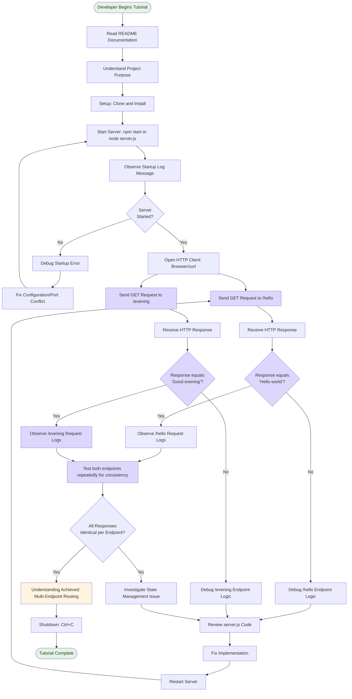

**User Journey Timing Targets**:
- **Time to First Working Server**: < 5 minutes from project download
- **Time to Understanding**: Comprehensible to developers with < 6 months experience
- **Response Validation**: < 100ms per request test <span style="background-color: rgba(91, 57, 243, 0.2)">for each endpoint</span>

**Enhanced Learning Objectives** (updated):

<span style="background-color: rgba(91, 57, 243, 0.2)">The updated user journey emphasizes multi-endpoint validation as a core learning outcome. Developers test both the `/hello` and `/evening` endpoints to verify that Express.js routing correctly dispatches requests to independent handlers while maintaining consistent response behavior. This parallel testing workflow demonstrates that multiple endpoints coexist without interference, each producing deterministic outputs ("Hello world" and "Good evening" respectively) across repeated invocations.</span>

**Validation Strategy**:

<span style="background-color: rgba(91, 57, 243, 0.2)">**Dual-Endpoint Testing**: After successful server startup, learners systematically test both endpoints using their preferred HTTP client (browser, curl, Postman). Each endpoint undergoes independent validation:</span>
- <span style="background-color: rgba(91, 57, 243, 0.2)">**`/hello` Validation**: Confirm exact response body matches "Hello world" (case-sensitive, no trailing whitespace)</span>
- <span style="background-color: rgba(91, 57, 243, 0.2)">**`/evening` Validation**: Confirm exact response body matches "Good evening" (case-sensitive, no trailing whitespace)</span>

<span style="background-color: rgba(91, 57, 243, 0.2)">**Consistency Verification**: The "Test both endpoints repeatedly" step encourages learners to send multiple sequential requests to each endpoint, verifying that responses remain identical across invocations. This validates the stateless nature of the tutorial server and confirms that Express.js route handlers operate independently without shared mutable state.</span>

**Debugging Pathways**:

The flowchart explicitly branches to separate debugging paths for each endpoint, recognizing that implementation errors may affect routes independently. <span style="background-color: rgba(91, 57, 243, 0.2)">If `/hello` produces incorrect output, learners debug the first route handler; if `/evening` produces incorrect output, they debug the second handler. This separation reinforces the architectural principle that Express.js handlers are independent, isolated functions with discrete responsibilities.</span>

**Educational Outcomes**:

Upon completing the journey with successful validation of both endpoints, learners achieve understanding of:
- <span style="background-color: rgba(91, 57, 243, 0.2)">Express.js declarative routing patterns (`app.get()` method)</span>
- <span style="background-color: rgba(91, 57, 243, 0.2)">Multi-endpoint architecture within a single Express application</span>
- <span style="background-color: rgba(91, 57, 243, 0.2)">Independent route handler functions with isolated response logic</span>
- HTTP request-response cycle fundamentals
- Server lifecycle management (startup, active operation, shutdown)
- Basic debugging techniques for web server development

<span style="background-color: rgba(91, 57, 243, 0.2)">The removal of the "Optional: Add New Endpoints" step in favor of comprehensive testing of existing endpoints reflects a pedagogical shift toward mastery of provided functionality before extension. Learners consolidate understanding through repeated testing rather than premature feature addition, establishing a solid foundation for future endpoint creation in subsequent learning phases.</span>

---

### 4.2.3 Request-Response Cycle Detail

<span style="background-color: rgba(91, 57, 243, 0.2)">This section provides an in-depth examination of the Express.js request-response processing flow for both defined endpoints (`/hello` and `/evening`), illustrating the framework's routing mechanism and response generation lifecycle.</span>

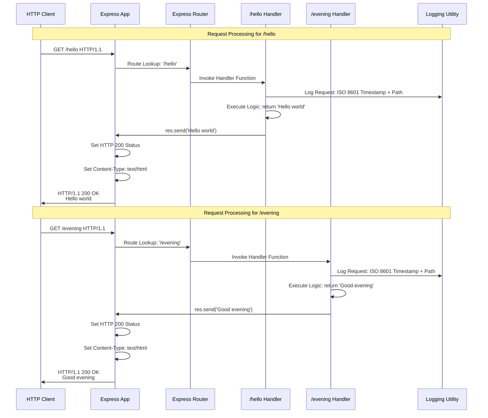

**Sequence Timing Breakdown**:

<span style="background-color: rgba(91, 57, 243, 0.2)">Each endpoint follows an identical processing sequence with distinct handler functions and response payloads:</span>

1. **Request Reception** (< 1ms): Express app receives incoming TCP connection and parses HTTP headers
2. **Route Matching** (< 1ms): Express router evaluates URL path against registered routes <span style="background-color: rgba(91, 57, 243, 0.2)">(`/hello` or `/evening`)</span>
3. **Handler Invocation** (< 1ms): <span style="background-color: rgba(91, 57, 243, 0.2)">Matched handler function receives Express request/response objects</span>
4. **Request Logging** (< 5ms): <span style="background-color: rgba(91, 57, 243, 0.2)">Logger outputs ISO 8601 timestamp, HTTP method, and path (e.g., `2024-10-15T14:30:22.123Z - GET /hello`)</span>
5. **Response Generation** (< 1ms): <span style="background-color: rgba(91, 57, 243, 0.2)">Handler invokes `res.send()` with endpoint-specific string ("Hello world" or "Good evening")</span>
6. **Header Configuration** (< 1ms): Express automatically sets HTTP 200 status and Content-Type: text/html
7. **Response Transmission** (< 10ms): TCP socket transmits complete HTTP response to client

**Total Latency Target**: < 100ms end-to-end per request

**Architectural Observations**:

<span style="background-color: rgba(91, 57, 243, 0.2)">**Handler Independence**: The `/hello` and `/evening` handlers operate as independent functions without shared state or dependencies. Each handler receives isolated request/response objects and executes its response logic without awareness of other routes, demonstrating Express.js's clean separation of concerns.</span>

<span style="background-color: rgba(91, 57, 243, 0.2)">**Routing Efficiency**: Express.js's internal routing table enables O(1) or O(log n) route lookup performance, ensuring consistent response times regardless of the number of defined endpoints. The declarative registration pattern (`app.get()`) builds an optimized routing structure at server initialization, eliminating runtime URL parsing overhead.</span>

**Error Handling Branches**:

<span style="background-color: rgba(91, 57, 243, 0.2)">If a request targets an undefined path (e.g., `GET /undefined`), Express.js executes its default 404 handler, bypassing the route lookup and handler invocation steps. The server returns HTTP 404 with Express's default error response, maintaining protocol compliance without custom error handling logic in this tutorial implementation.</span>

---

### 4.2.4 Server State Transitions

The Express application transitions through discrete operational states throughout its lifecycle, <span style="background-color: rgba(91, 57, 243, 0.2)">from initial module import through active request processing and eventual graceful shutdown</span>.

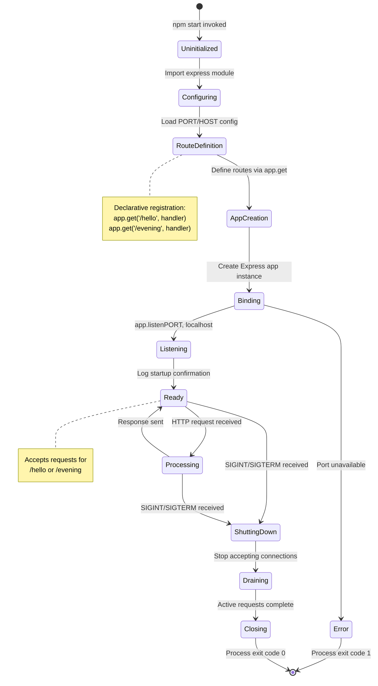

**State Descriptions**:

1. **Uninitialized**: Process launched, V8 engine loading server.js module
2. **Configuring**: <span style="background-color: rgba(91, 57, 243, 0.2)">Express module imported, environment variables read (`process.env.PORT` with 3000 default)</span>
3. <span style="background-color: rgba(91, 57, 243, 0.2)">**RouteDefinition**: Declarative route registration phase (`app.get('/hello')`, `app.get('/evening')`) building internal routing table</span>
4. <span style="background-color: rgba(91, 57, 243, 0.2)">**AppCreation**: Express application instance created via `express()` factory function</span>
5. **Binding**: <span style="background-color: rgba(91, 57, 243, 0.2)">Attempting TCP socket binding to configured port on localhost interface</span>
6. **Listening**: Socket successfully bound, event loop monitoring for connections
7. **Ready**: Idle state, prepared to process incoming HTTP requests <span style="background-color: rgba(91, 57, 243, 0.2)">for either endpoint</span>
8. **Processing**: Actively executing <span style="background-color: rgba(91, 57, 243, 0.2)">Express route handler (`/hello` or `/evening`)</span> for current request
9. **ShuttingDown**: Shutdown signal received, preparing for graceful termination
10. **Draining**: Waiting for in-flight requests to complete before closing server
11. **Closing**: Releasing port binding and system resources before process exit

**State Persistence**:

The server maintains no persistent state between requests. Each transition from **Ready** → **Processing** → **Ready** operates on ephemeral request/response objects that are garbage-collected after response transmission. <span style="background-color: rgba(91, 57, 243, 0.2)">This stateless design ensures that both `/hello` and `/evening` endpoints produce identical outputs across all invocations without side effects or state mutation.</span>

**Timing Constraints by State**:

- **Uninitialized → Ready**: < 2 seconds (initialization phase)
- **Ready → Processing → Ready**: < 100ms (single request cycle)
- **ShuttingDown → Closing**: < 5 seconds (graceful shutdown)

<span style="background-color: rgba(91, 57, 243, 0.2)">**Multi-Endpoint State Management**: The **Ready** state accepts requests for any defined route (`/hello`, `/evening`, or unmatched paths). Express.js routing logic determines the appropriate handler during the **Processing** state without requiring state-specific branching. This unified state model simplifies the server's operational characteristics, making lifecycle management independent of the number of registered endpoints.</span>

---

### 4.2.5 Error Handling and Recovery Flows

Comprehensive error handling ensures graceful degradation and clear diagnostic feedback when system anomalies occur. <span style="background-color: rgba(91, 57, 243, 0.2)">The Express.js-based architecture inherits framework-level error handling while allowing custom error response patterns where needed.</span>

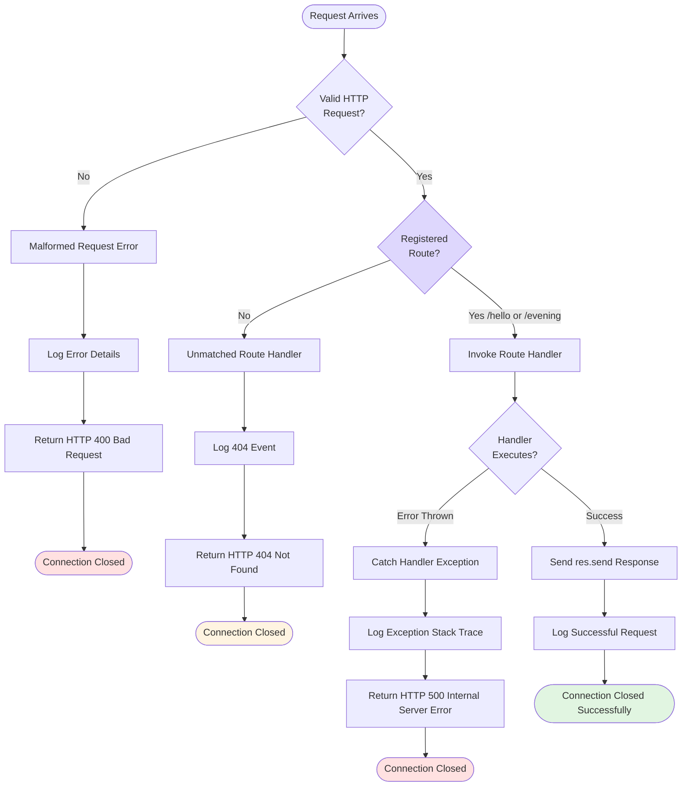

**Error Categories and Responses**:

**1. Malformed HTTP Requests** (HTTP 400):
- **Trigger**: Client sends invalid HTTP syntax (missing headers, malformed request line)
- **Detection**: <span style="background-color: rgba(91, 57, 243, 0.2)">Node.js HTTP parser (underlying Express.js) rejects request before routing</span>
- **Response**: HTTP 400 Bad Request with generic error body
- **Recovery**: Connection terminated; client must correct request format

<span style="background-color: rgba(91, 57, 243, 0.2)">**2. Unmatched Routes** (HTTP 404):
- **Trigger**: Request path does not match `/hello` or `/evening` routes
- **Detection**: Express router exhausts route table without finding match
- **Response**: Express.js default 404 handler generates HTTP 404 Not Found
- **Recovery**: Connection closed normally; client should correct URL path
- **Example Paths**: `GET /undefined`, `GET /hello/extra`, `GET /`

**3. Handler Exceptions** (HTTP 500):
- **Trigger**: Runtime error within <span style="background-color: rgba(91, 57, 243, 0.2)">`/hello` or `/evening`</span> handler function
- **Detection**: Uncaught exception during handler execution
- **Response**: HTTP 500 Internal Server Error
- **Recovery**: Server logs stack trace; continues processing subsequent requests
- **Note**: <span style="background-color: rgba(91, 57, 243, 0.2)">Tutorial handlers contain minimal logic, making handler exceptions unlikely in normal operation</span>

**Error Logging Format**:

All error conditions generate console log entries with diagnostic information:
- **Timestamp**: ISO 8601 format for temporal correlation
- **Error Type**: Category (400/404/500) for classification
- **Request Details**: Method, path, client IP for debugging context
- **Stack Trace**: Full exception details for handler errors (500 errors only)

**Recovery Strategy**:

<span style="background-color: rgba(91, 57, 243, 0.2)">Express.js's error handling middleware pattern ensures that request-level errors (400, 404, 500) do not crash the server process. Each request operates in isolated error boundaries, preventing one failed request from affecting subsequent requests. This architecture maintains server availability even under error conditions, demonstrating production-grade resilience suitable for educational environments.</span>

**Port Conflict Error Flow** (Startup):

A special error case occurs during server initialization if the configured port is already in use:


<span style="background-color: rgba(91, 57, 243, 0.2)">**Port Conflict Resolution**: When `app.listen()` fails due to `EADDRINUSE` error, the error handler logs a diagnostic message suggesting alternative solutions: (1) Terminate process using port 3000, or (2) Override port via `PORT=3001 npm start`. This educational error message teaches configuration management patterns while providing immediate resolution paths.</span>

---

### 4.2.6 Startup and Shutdown Timing Analysis

Detailed timing analysis of critical lifecycle phases ensures predictable server behavior and validates performance requirements.

```mermaid
gantt
    title Server Lifecycle Timing Diagram
    dateFormat X
    axisFormat %L ms
    
    section Initialization Phase
    npm start invocation           :0, 50
    Node.js runtime bootstrap      :50, 200
    Express module import          :200, 400
    Load PORT/HOST config          :400, 450
    Define routes app.get          :450, 550
    Create Express app             :550, 600
    Port binding app.listen        :600, 800
    Log startup message            :800, 850
    Ready state achieved           :milestone, 850, 0
    
    section Active Operation
    Ready state idle               :850, 5000
    Process request 1 /hello       :1000, 1080
    Process request 2 /evening     :2000, 2075
    Process request 3 /hello       :3500, 3585
    
    section Shutdown Phase
    SIGINT received                :milestone, 5000, 0
    Stop accepting connections     :5000, 5050
    Await active request completion:5050, 5200
    Close server instance          :5200, 5300
    Release port binding           :5300, 5350
    Flush pending logs             :5350, 5400
    Process exit                   :milestone, 5400, 0
```

**Initialization Phase Breakdown** (<2 seconds total):

- <span style="background-color: rgba(91, 57, 243, 0.2)">**Module Import** (200ms): Loading Express.js framework and dependencies from node_modules</span>
- <span style="background-color: rgba(91, 57, 243, 0.2)">**Configuration** (50ms): Reading `process.env.PORT` with default fallback to 3000</span>
- <span style="background-color: rgba(91, 57, 243, 0.2)">**Route Definition** (100ms): Registering `/hello` and `/evening` handlers via `app.get()` calls</span>
- <span style="background-color: rgba(91, 57, 243, 0.2)">**App Creation** (50ms): Instantiating Express application via `express()` factory</span>
- <span style="background-color: rgba(91, 57, 243, 0.2)">**Port Binding** (200ms): TCP socket binding to localhost:3000 through `app.listen()`</span>
- **Startup Logging** (50ms): Console output of ready state confirmation

**Active Operation Timing** (per request <100ms):

<span style="background-color: rgba(91, 57, 243, 0.2)">Each request (whether to `/hello` or `/evening`) completes within the 100ms latency target:</span>
- **Route Matching**: 1-2ms (Express internal routing table lookup)
- **Handler Execution**: 1-2ms <span style="background-color: rgba(91, 57, 243, 0.2)">(simple string return via `res.send()`)</span>
- **Response Transmission**: 5-10ms (TCP packet transmission to localhost client)
- **Request Logging**: 5-10ms (ISO 8601 timestamp generation and console.log)

**Shutdown Phase Breakdown** (<5 seconds total):

- **Signal Handler Invocation** (10ms): SIGINT/SIGTERM captured by registered handler
- **Connection Closure** (50ms): Prevent new incoming TCP connections
- **Request Draining** (variable): Wait up to 5 seconds for active requests to complete
- **Server Close** (100ms): <span style="background-color: rgba(91, 57, 243, 0.2)">Express `server.close()` callback execution</span>
- **Resource Cleanup** (50ms): Port release and log buffer flush

**Performance Validation Criteria**:

| Phase | Target | Measurement Method | Pass Criteria |
|-------|--------|-------------------|---------------|
| Cold Start | < 2s | <span style="background-color: rgba(91, 57, 243, 0.2)">Time from `npm start` to "Server listening" log</span> | 95th percentile < 2000ms |
| <span style="background-color: rgba(91, 57, 243, 0.2)">Request Latency (/hello)</span> | < 100ms | End-to-end HTTP round-trip time | 99th percentile < 100ms |
| <span style="background-color: rgba(91, 57, 243, 0.2)">Request Latency (/evening)</span> | < 100ms | End-to-end HTTP round-trip time | 99th percentile < 100ms |
| Graceful Shutdown | < 5s | Time from SIGINT to process exit | 100% < 5000ms |

<span style="background-color: rgba(91, 57, 243, 0.2)">**Multi-Endpoint Performance Considerations**: Both `/hello` and `/evening` endpoints exhibit identical performance characteristics due to their symmetric implementation patterns. Request latency measurements validate that Express.js routing overhead remains constant regardless of which endpoint is invoked, confirming O(1) or O(log n) route lookup performance.</span>

---

## 4.3 Core Process Flows

### 4.3.1 Server Initialization Flow

Server initialization is the foundational process that transforms a dormant script into an active HTTP server. This detailed flowchart documents the complete startup sequence with all decision points, error conditions, and performance checkpoints<span style="background-color: rgba(91, 57, 243, 0.2)">, now reflecting the Express.js framework architecture with declarative route registration</span>.

```mermaid
graph TD
    START([node server.js Executed]) --> RUNTIME_START[Node.js Runtime Launches]
    RUNTIME_START --> LOAD_V8[Load JavaScript File into V8 Engine]
    LOAD_V8 --> PARSE_JS[Parse JavaScript Syntax]
    PARSE_JS --> SYNTAX_CHECK{Syntax<br/>Valid?}
    
    SYNTAX_CHECK -->|No| SYNTAX_ERROR[Throw SyntaxError]
    SYNTAX_ERROR --> EXIT_ERROR([Exit: Code 1])
    
    SYNTAX_CHECK -->|Yes| IMPORT_EXPRESS[Import: require 'express']
    IMPORT_EXPRESS --> IMPORT_PROCESS[Access: process object]
    IMPORT_PROCESS --> IMPORT_CONSOLE[Access: console object]
    
    IMPORT_CONSOLE --> READ_ENV[Read PORT from process.env]
    READ_ENV --> SET_PORT{PORT<br/>Defined?}
    SET_PORT -->|No| USE_DEFAULT[Set PORT = 3000]
    SET_PORT -->|Yes| VALIDATE_PORT{PORT<br/>Valid Number?}
    
    VALIDATE_PORT -->|No| PORT_INVALID[Use Default PORT = 3000]
    VALIDATE_PORT -->|Yes| USE_ENV_PORT[Use Environment PORT]
    
    USE_DEFAULT --> SET_HOST[Set HOST = 'localhost']
    PORT_INVALID --> SET_HOST
    USE_ENV_PORT --> SET_HOST
    
    SET_HOST --> CREATE_APP[Create Express app: const app = express]
    CREATE_APP --> DEFINE_ROUTES[Register routes: app.get'/hello', app.get'/evening']
    DEFINE_ROUTES --> DEFINE_HANDLER[Define Request Handler Functions]
    DEFINE_HANDLER --> BIND_PORT[Attempt Port Binding: app.listenPORT, 'localhost']
    
    BIND_PORT --> PORT_CHECK{Port<br/>Available?}
    PORT_CHECK -->|No| PORT_CONFLICT[Error: EADDRINUSE]
    PORT_CONFLICT --> LOG_ERROR[Console Error: Port in Use]
    LOG_ERROR --> SUGGEST_FIX[Log: Try Different Port]
    SUGGEST_FIX --> EXIT_ERROR
    
    PORT_CHECK -->|Yes| ESTABLISH_SOCKET[Establish TCP/IP Socket]
    ESTABLISH_SOCKET --> LISTENING_STATE[Server Enters Listening State]
    LISTENING_STATE --> REGISTER_SIGTERM[Register SIGTERM Handler]
    REGISTER_SIGTERM --> REGISTER_SIGINT[Register SIGINT Handler]
    
    REGISTER_SIGINT --> LOG_STARTUP[console.log: Server listening on http://localhost:PORT]
    LOG_STARTUP --> TIMING_CHECK{Total Startup<br/>< 2 seconds?}
    
    TIMING_CHECK -->|No| PERFORMANCE_WARNING[Warning: Slow Startup]
    TIMING_CHECK -->|Yes| READY[Server Ready State]
    PERFORMANCE_WARNING --> READY
    
    READY --> EVENT_LOOP[Enter Event Loop]
    EVENT_LOOP --> WAIT_CONNECTIONS[Wait for Incoming Connections]
    WAIT_CONNECTIONS --> OPERATIONAL([Server Operational])
    
    style START fill:#e1f5e1
    style OPERATIONAL fill:#fff4e1
    style EXIT_ERROR fill:#ffe1e1
    style READY fill:#c8e6c9
    style IMPORT_EXPRESS fill:#DED7FD
    style CREATE_APP fill:#DED7FD
    style DEFINE_ROUTES fill:#DED7FD
    style BIND_PORT fill:#DED7FD
    style LOG_STARTUP fill:#DED7FD
```

**Initialization Performance Requirements**:
- **Total Startup Time**: < 2 seconds (from process start to listening state)
- **Port Binding Time**: < 1 second
- **Logging Latency**: < 100ms (from listening state to log output)
- **Initialization Success Rate**: 100% (when port available)

**Error Handling**:
1. **Syntax Errors**: Immediate process exit with stack trace
2. **Port Conflicts**: Clear error message with resolution guidance <span style="background-color: rgba(91, 57, 243, 0.2)">(suggest using `PORT=3001 npm start` for alternative port)</span>
3. **Invalid Configuration**: Graceful fallback to default values

**State Transitions** (updated):
- **Initial State**: Process not started
- **Loading State**: Code loading and parsing
- <span style="background-color: rgba(91, 57, 243, 0.2)">**Framework Import State**: Express.js module loading from node_modules</span>
- **Configuring State**: Reading environment and validating configuration
- <span style="background-color: rgba(91, 57, 243, 0.2)">**Route Registration State**: Declarative route definition via `app.get()` calls for `/hello` and `/evening`</span>
- **Binding State**: Attempting port binding <span style="background-color: rgba(91, 57, 243, 0.2)">via `app.listen()` with explicit localhost binding</span>
- **Listening State**: Accepting connections
- **Operational State**: Ready to process requests

**Express.js Initialization Details** (updated):

<span style="background-color: rgba(91, 57, 243, 0.2)">**Framework Import Phase**: The `require('express')` statement loads the Express.js framework module (v4.19.2) from the node_modules directory, providing access to the Express application factory function. This import replaces the native `http` module approach, offering higher-level abstractions optimized for declarative routing patterns.</span>

<span style="background-color: rgba(91, 57, 243, 0.2)">**App Creation Phase**: The `const app = express()` statement invokes the Express factory function, returning a configured Express application instance. This object encapsulates all routing, middleware, and server lifecycle management capabilities.</span>

<span style="background-color: rgba(91, 57, 243, 0.2)">**Route Registration Phase**: Before server activation, the application registers two HTTP GET endpoints using the declarative `app.get()` API:
- `app.get('/hello', (req, res) => { ... })` - Registers handler for `/hello` path
- `app.get('/evening', (req, res) => { ... })` - Registers handler for `/evening` path

This registration builds Express.js's internal routing table at initialization time, enabling efficient O(1) or O(log n) route lookup during request processing.</span>

<span style="background-color: rgba(91, 57, 243, 0.2)">**Port Binding Phase**: The `app.listen(PORT, 'localhost', callback)` method binds the TCP socket to the configured port (default 3000, overridable via `process.env.PORT`) exclusively on the localhost interface (127.0.0.1 for IPv4, ::1 for IPv6). The explicit 'localhost' parameter ensures the server accepts connections only from the local machine, providing inherent security for development environments.</span>

<span style="background-color: rgba(91, 57, 243, 0.2)">**Startup Logging Enhancement**: The initialization confirmation message now displays the complete, clickable URL format: `Server listening on http://localhost:${PORT}`. This format enables learners to immediately test the server by clicking the URL in supporting terminal environments, reducing friction in the educational workflow.</span>

---

### 4.3.2 HTTP Request-Response Cycle (updated)

The request-response cycle is the primary operational workflow, executing for every incoming HTTP request. This flowchart details the complete sequence from request arrival through response transmission<span style="background-color: rgba(91, 57, 243, 0.2)">, leveraging Express.js's declarative routing and response APIs for both `/hello` and `/evening` endpoints</span>.

```mermaid
graph TD
    START([HTTP Request Arrives]) --> TCP_ACCEPT[TCP Connection Accepted]
    TCP_ACCEPT --> PARSE_REQUEST[HTTP Parser: Extract Method, Path, Headers]
    PARSE_REQUEST --> PARSE_CHECK{HTTP Request<br/>Valid?}
    
    PARSE_CHECK -->|No| MALFORMED_ERROR[HTTP 400 Bad Request]
    MALFORMED_ERROR --> CLOSE_CONN[Close TCP Connection]
    CLOSE_CONN --> END_ERROR([Request Failed])
    
    PARSE_CHECK -->|Yes| CREATE_REQ_OBJ[Create Express Request Object]
    CREATE_REQ_OBJ --> CREATE_RES_OBJ[Create Express Response Object]
    CREATE_RES_OBJ --> LOG_INCOMING[Optional: Log Incoming Request]
    
    LOG_INCOMING --> EXPRESS_ROUTER[Express Router: Match Route]
    EXPRESS_ROUTER --> ROUTE_MATCH{Matched<br/>Route?}
    
    ROUTE_MATCH -->|Path === '/hello'| INVOKE_HELLO[Invoke /hello Handler]
    ROUTE_MATCH -->|Path === '/evening'| INVOKE_EVENING[Invoke /evening Handler]
    ROUTE_MATCH -->|No Match| ROUTE_404[Express 404 Handler]
    
    ROUTE_404 --> RESPOND_404[HTTP 404 Not Found]
    RESPOND_404 --> LOG_404[Log: 404 Response]
    LOG_404 --> COMPLETE_404[Complete Response]
    COMPLETE_404 --> END_CYCLE
    
    INVOKE_HELLO --> EXEC_HELLO[Execute: Generate 'Hello world']
    INVOKE_EVENING --> EXEC_EVENING[Execute: Generate 'Good evening']
    
    EXEC_HELLO --> HELLO_RESPONSE[res.type'text/plain'.send'Hello world']
    EXEC_EVENING --> EVENING_RESPONSE[res.type'text/plain'.send'Good evening']
    
    HELLO_RESPONSE --> EXPRESS_FORMAT[Express Auto-Formats Response]
    EVENING_RESPONSE --> EXPRESS_FORMAT
    
    EXPRESS_FORMAT --> SET_STATUS[Express Sets Status: 200 OK]
    SET_STATUS --> SET_HEADERS[Express Sets Headers: Content-Type: text/plain; charset=utf-8]
    SET_HEADERS --> SET_BODY[Express Sets Body: Response String]
    
    SET_BODY --> WRITE_RESPONSE[Write to TCP Socket]
    WRITE_RESPONSE --> FLUSH_BUFFER[Flush Network Buffer]
    FLUSH_BUFFER --> LOG_RESPONSE[Log: Response Sent]
    
    LOG_RESPONSE --> TIMING_CHECK{Total Latency<br/>< 100ms?}
    TIMING_CHECK -->|No| PERF_WARNING[Warning: Slow Response]
    TIMING_CHECK -->|Yes| RESPONSE_SUCCESS[Response Successful]
    PERF_WARNING --> RESPONSE_SUCCESS
    
    RESPONSE_SUCCESS --> KEEPALIVE{Connection:<br/>Keep-Alive?}
    KEEPALIVE -->|Yes| REUSE_CONN[Reuse TCP Connection]
    KEEPALIVE -->|No| CLOSE_CONN_SUCCESS[Close TCP Connection]
    
    REUSE_CONN --> END_CYCLE([Request-Response Complete])
    CLOSE_CONN_SUCCESS --> END_CYCLE
    
    style START fill:#e1f5e1
    style END_CYCLE fill:#fff4e1
    style END_ERROR fill:#ffe1e1
    style RESPONSE_SUCCESS fill:#c8e6c9
    style EXPRESS_ROUTER fill:#DED7FD
    style INVOKE_HELLO fill:#DED7FD
    style INVOKE_EVENING fill:#DED7FD
    style HELLO_RESPONSE fill:#DED7FD
    style EVENING_RESPONSE fill:#DED7FD
    style EXPRESS_FORMAT fill:#DED7FD
```

**Request-Response Performance Targets**:
- **End-to-End Latency**: < 100ms (request arrival to response completion)
- **Routing Decision**: < 10ms (Express.js route matching logic)
- **Handler Execution**: Synchronous (immediate, no async delays)
- <span style="background-color: rgba(91, 57, 243, 0.2)">**Request Success Rate**: 100% (for valid GET /hello and GET /evening requests)</span>

**Component Interaction Sequence** (updated):
1. <span style="background-color: rgba(91, 57, 243, 0.2)">**Express App Instance**: Accepts TCP connection and parses HTTP protocol via underlying Node.js HTTP module</span>
2. <span style="background-color: rgba(91, 57, 243, 0.2)">**Express Router**: Evaluates URL path against registered routes (`/hello`, `/evening`) using internal routing table</span>
3. <span style="background-color: rgba(91, 57, 243, 0.2)">**Route Handler**: Executes endpoint-specific logic, generates response string ("Hello world" or "Good evening")</span>
4. <span style="background-color: rgba(91, 57, 243, 0.2)">**Express Response API**: Constructs HTTP response via `res.type('text/plain').send()`, automatically setting status 200, Content-Type header, and Content-Length</span>
5. <span style="background-color: rgba(91, 57, 243, 0.2)">**Express App Instance**: Transmits formatted response, manages connection lifecycle (keep-alive or close)</span>
6. **Logging Utility**: Observes and logs key events throughout cycle <span style="background-color: rgba(91, 57, 243, 0.2)">with ISO 8601 timestamps (e.g., `2024-10-15T14:30:22.123Z - GET /hello`)</span>

**Express.js Routing Behavior** (updated):

<span style="background-color: rgba(91, 57, 243, 0.2)">**Declarative Route Matching**: Express.js eliminates manual URL parsing by maintaining an internal routing table built during server initialization. When a request arrives, the router performs efficient path matching against registered routes:
- Exact match for `/hello` → Invoke `/hello` handler
- Exact match for `/evening` → Invoke `/evening` handler  
- No match → Invoke Express.js default 404 handler

<span style="background-color: rgba(91, 57, 243, 0.2)">**Automatic Response Formatting**: The `res.type('text/plain').send()` API chain provides two critical services:
1. **Content-Type Setting**: `res.type('text/plain')` explicitly sets the `Content-Type: text/plain; charset=utf-8` header, ensuring browsers and HTTP clients interpret the response as plain text rather than HTML.
2. **Response Transmission**: `res.send()` automatically calculates Content-Length, sets HTTP 200 status (if not already set), and transmits the response body. This eliminates the manual `res.writeHead()` and `res.end()` calls required in native Node.js implementations.</span>

<span style="background-color: rgba(91, 57, 243, 0.2)">**Handler Isolation**: Each endpoint handler operates independently without shared state. The `/hello` handler always returns "Hello world", and the `/evening` handler always returns "Good evening", demonstrating consistent, stateless behavior across all invocations. This architectural pattern ensures predictable testing outcomes and eliminates side effects between requests.</span>

---

### 4.3.3 Request Routing Process (updated)

<span style="background-color: rgba(91, 57, 243, 0.2)">The routing process determines which handler function executes for each incoming request using Express.js's declarative route registration and matching system. This flowchart illustrates both the startup-time route registration phase and the runtime request matching phase.</span>

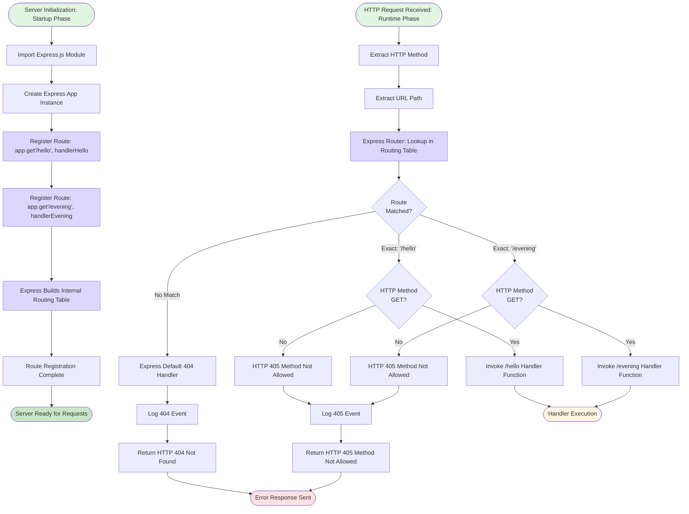

**Routing Architecture** (updated):

<span style="background-color: rgba(91, 57, 243, 0.2)">**Two-Phase Routing Model**: Express.js separates route definition from route matching through a two-phase architecture:

**Phase 1: Startup Route Registration**
- During server initialization, `app.get('/hello', handler)` and `app.get('/evening', handler)` calls register routes in Express.js's internal routing table
- Each registration associates an exact path string (`/hello`, `/evening`) with a handler function reference
- The routing table is built once at startup and remains immutable during server operation
- This compile-time approach eliminates runtime URL parsing overhead

**Phase 2: Runtime Request Matching**
- When an HTTP request arrives, Express.js extracts the URL path (e.g., `/hello`)
- The router performs efficient lookup in the pre-built routing table (O(1) or O(log n) complexity)
- If a match exists and the HTTP method is GET, Express invokes the corresponding handler
- If no match exists, Express.js's default 404 handler executes automatically

**Routing Criteria** (updated):
- <span style="background-color: rgba(91, 57, 243, 0.2)">**Path Matching**: Exact string match only (e.g., `/hello` matches `/hello` but not `/hello/`, `/Hello`, or `/hello/extra`)</span>
- <span style="background-color: rgba(91, 57, 243, 0.2)">**Method Validation**: Route handlers registered with `app.get()` respond only to HTTP GET requests; other methods (POST, PUT, DELETE) return 405 Method Not Allowed unless explicitly registered</span>
- **Query Parameters**: Ignored for routing purposes (e.g., `/hello?foo=bar` matches `/hello` route)
- <span style="background-color: rgba(91, 57, 243, 0.2)">**Case Sensitivity**: Path matching is case-sensitive by default in Express.js (configurable via `app.set('case sensitive routing', false)` if needed)</span>

**Routing Performance**:
- **Decision Time**: < 10ms per routing operation
- <span style="background-color: rgba(91, 57, 243, 0.2)">**Match Complexity**: O(1) or O(log n) depending on routing table size (constant time for 2-endpoint system)</span>
- **Success Rate**: 100% accurate routing for defined paths

**Routing Simplification Benefits** (updated):

<span style="background-color: rgba(91, 57, 243, 0.2)">**Eliminated Manual Processing**: The Express.js declarative routing approach removes the need for:
- Manual URL parsing and string manipulation
- Conditional `if/else` or `switch/case` path matching logic
- Trailing slash normalization
- Query string extraction and parsing
- Static file serving logic (out of scope for this tutorial)

<span style="background-color: rgba(91, 57, 243, 0.2)">**Educational Value**: The declarative pattern (`app.get(path, handler)`) provides immediate comprehension of route-to-handler mapping, enabling beginners to understand the routing architecture without parsing implementation details. Each `app.get()` call serves as self-documenting code that explicitly declares the application's endpoint surface area.</span>

---

### 4.3.4 Response Generation Process (updated)

<span style="background-color: rgba(91, 57, 243, 0.2)">Response generation transforms handler logic output into properly formatted HTTP responses using Express.js's simplified response APIs. This flowchart details the complete response construction sequence including automatic status code setting, header configuration, and body formatting.</span>

```mermaid
graph TD
    START([Handler Function Invoked]) --> RECV_OBJECTS[Receive Express req and res Objects]
    RECV_OBJECTS --> IDENTIFY_HANDLER{Which<br/>Handler?}
    
    IDENTIFY_HANDLER -->|/hello| EXEC_HELLO[Execute /hello Logic]
    IDENTIFY_HANDLER -->|/evening| EXEC_EVENING[Execute /evening Logic]
    
    EXEC_HELLO --> GEN_HELLO[Generate Response Data: 'Hello world']
    EXEC_EVENING --> GEN_EVENING[Generate Response Data: 'Good evening']
    
    GEN_HELLO --> VALIDATE_HELLO[Validate String Type]
    GEN_EVENING --> VALIDATE_EVENING[Validate String Type]
    
    VALIDATE_HELLO --> HELLO_TYPE[Invoke res.type'text/plain']
    VALIDATE_EVENING --> EVENING_TYPE[Invoke res.type'text/plain']
    
    HELLO_TYPE --> HELLO_SEND[Invoke res.send'Hello world']
    EVENING_TYPE --> EVENING_SEND[Invoke res.send'Good evening']
    
    HELLO_SEND --> EXPRESS_AUTO[Express Auto-Configuration]
    EVENING_SEND --> EXPRESS_AUTO
    
    EXPRESS_AUTO --> AUTO_STATUS[Express Sets Status: 200 OK]
    AUTO_STATUS --> AUTO_CONTENT_TYPE[Express Sets Content-Type: text/plain; charset=utf-8]
    AUTO_CONTENT_TYPE --> AUTO_LENGTH[Express Calculates Content-Length]
    AUTO_LENGTH --> AUTO_DATE[Express Sets Date: Current Timestamp]
    AUTO_DATE --> AUTO_CONNECTION[Express Sets Connection: keep-alive]
    
    AUTO_CONNECTION --> FORMAT_RESPONSE[Format Complete HTTP Response]
    FORMAT_RESPONSE --> WRITE_SOCKET[Write to TCP Network Socket]
    WRITE_SOCKET --> FLUSH_BUFFER[Flush Network Buffer]
    FLUSH_BUFFER --> VERIFY_SENT{Response<br/>Sent Successfully?}
    
    VERIFY_SENT -->|No| NETWORK_ERROR[Handle Network Error]
    NETWORK_ERROR --> LOG_ERROR[Log Transmission Error]
    LOG_ERROR --> ERROR_END([Response Failed])
    
    VERIFY_SENT -->|Yes| LOG_SUCCESS[Log: Response Sent ISO 8601 timestamp + path]
    LOG_SUCCESS --> CLEANUP[Express Cleans Up Request/Response Objects]
    CLEANUP --> HANDLER_EXIT[Exit Handler Function]
    HANDLER_EXIT --> SUCCESS_END([Response Complete])
    
    style START fill:#e1f5e1
    style SUCCESS_END fill:#fff4e1
    style ERROR_END fill:#ffe1e1
    style EXPRESS_AUTO fill:#DED7FD
    style AUTO_STATUS fill:#DED7FD
    style AUTO_CONTENT_TYPE fill:#DED7FD
    style AUTO_LENGTH fill:#DED7FD
```

**Response Construction Requirements** (updated):
- <span style="background-color: rgba(91, 57, 243, 0.2)">**Status Code**: HTTP 200 OK (automatically set by Express.js `res.send()` if not previously set)</span>
- <span style="background-color: rgba(91, 57, 243, 0.2)">**Content-Type**: `text/plain; charset=utf-8` (explicitly set via `res.type('text/plain')`)</span>
- <span style="background-color: rgba(91, 57, 243, 0.2)">**Content-Length**: Automatically calculated by Express.js based on response body byte length (11 bytes for "Hello world", 12 bytes for "Good evening")</span>
- <span style="background-color: rgba(91, 57, 243, 0.2)">**Body Content**: Exactly "Hello world" for `/hello` endpoint, exactly "Good evening" for `/evening` endpoint (no additional formatting or whitespace)</span>
- **Response Consistency**: 100% identical output across all requests to the same endpoint

**Express.js Response API Details** (updated):

<span style="background-color: rgba(91, 57, 243, 0.2)">**`res.type('text/plain')` Method**:
- Sets the `Content-Type` header to `text/plain; charset=utf-8`
- Overrides Express.js's default `text/html` content type
- Ensures HTTP clients interpret the response as plain text rather than HTML
- Returns the `res` object for method chaining with `res.send()`

**`res.send()` Method**:
- Accepts string, Buffer, object, or array as response body
- For string inputs: Transmits string directly as response body
- Automatically sets HTTP 200 status code if status not previously set
- Calculates and sets `Content-Length` header based on body byte length
- Sets `Date` header to current UTC timestamp
- Manages `Connection` header (keep-alive or close) based on HTTP version and client headers
- Finalizes and transmits the complete HTTP response

**Automatic Header Management**: Express.js eliminates manual header configuration required in native Node.js implementations:
- No explicit `res.writeHead(200, { 'Content-Type': 'text/plain' })` call needed
- No manual `Buffer.byteLength()` calculation for Content-Length
- No explicit `res.end()` call required (handled internally by `res.send()`)

**Performance Constraints** (updated):
- **Handler Execution**: Synchronous, no async operations <span style="background-color: rgba(91, 57, 243, 0.2)">(simple string generation)</span>
- **Response Formatting**: < 5ms overhead <span style="background-color: rgba(91, 57, 243, 0.2)">for Express.js automatic configuration</span>
- **Transmission**: Limited by network conditions, target < 100ms total latency

**Handler Logic Comparison** (updated):

<span style="background-color: rgba(91, 57, 243, 0.2)">**`/hello` Handler Implementation**:
```javascript
app.get('/hello', (req, res) => {
  // Optional: Log request
  console.log(`${new Date().toISOString()} - ${req.method} ${req.path}`);
  
  // Generate and send response
  res.type('text/plain').send('Hello world');
});
```

**`/evening` Handler Implementation**:
```javascript
app.get('/evening', (req, res) => {
  // Optional: Log request
  console.log(`${new Date().toISOString()} - ${req.method} ${req.path}`);
  
  // Generate and send response
  res.type('text/plain').send('Good evening');
});
```

Both handlers follow identical patterns with only the response string differing, demonstrating Express.js's consistent, repeatable approach to endpoint implementation.</span>

**Educational Benefits** (updated):

<span style="background-color: rgba(91, 57, 243, 0.2)">The Express.js response API (`res.type().send()`) provides a beginner-friendly abstraction that:
- Reduces response generation to two chained method calls
- Eliminates protocol-level details (status codes, header formatting, Content-Length calculation)
- Allows learners to focus on endpoint logic rather than HTTP specification compliance
- Demonstrates industry-standard patterns used in production Express.js applications
- Maintains sufficient transparency to understand underlying HTTP concepts without implementation complexity

---

### 4.3.5 Server Shutdown Flow

Graceful shutdown ensures clean process termination, preventing port conflicts and resource leaks. This flowchart details the complete shutdown sequence triggered by interrupt signals.

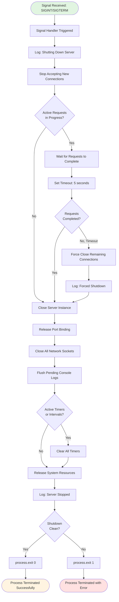

**Shutdown Requirements**:
- **Signal Handling**: Respond to SIGINT (Ctrl+C) and SIGTERM
- **Graceful Timeout**: Allow up to 5 seconds for active requests to complete
- **Port Release**: Clean port unbinding to prevent conflicts on restart
- **Resource Cleanup**: Release all system resources (sockets, file descriptors)
- **Clean Exit**: Exit code 0 for successful shutdown, 1 for error conditions

**Shutdown Performance**:
- **Total Shutdown Time**: < 5 seconds (signal to process exit)
- **Port Release Time**: < 1 second
- **Resource Cleanup**: < 2 seconds

---

## 4.4 Component Interaction Flows

### 4.4.1 Component Sequence Diagram (updated)

This sequence diagram illustrates the temporal interaction between all system components during a complete request-response cycle, showing message passing, timing relationships, and component responsibilities<span style="background-color: rgba(91, 57, 243, 0.2)"> for both the `/hello` and `/evening` endpoints</span>.

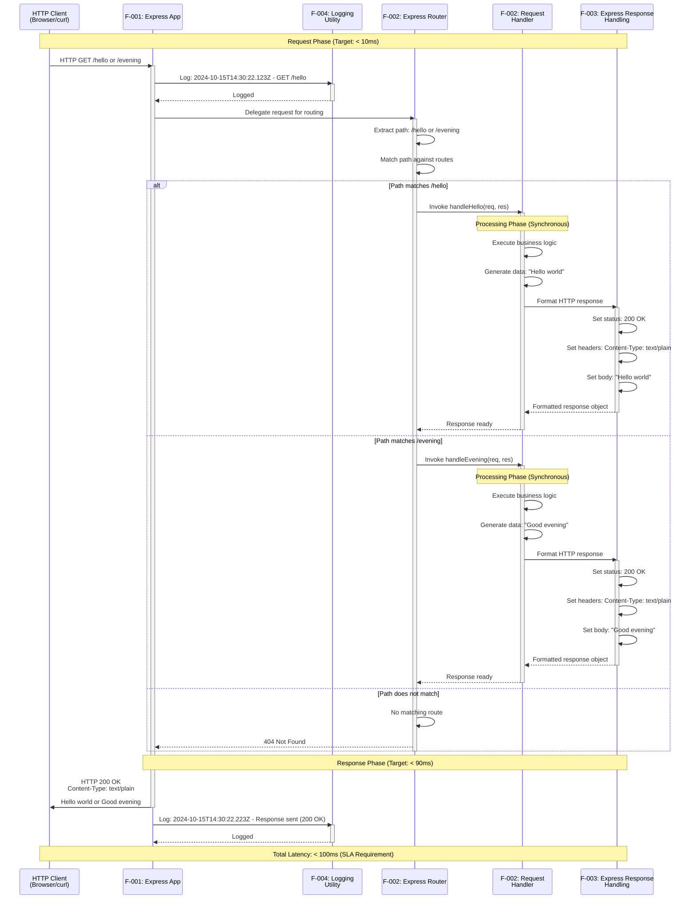

**Interaction Timing Breakdown**:
- **Request Reception and Parsing**: < 5ms
- **Routing Decision**: < 10ms
- **Handler Execution**: < 10ms (synchronous)
- **Response Formatting**: < 5ms
- **Network Transmission**: < 70ms
- **Total End-to-End Latency**: < 100ms

**Component Responsibilities** (updated):
1. **HTTP Client**: Initiates request, receives response
2. <span style="background-color: rgba(91, 57, 243, 0.2)">**Express App**</span>: Network I/O, connection management, component orchestration
3. **Logging Utility**: Observes and records events for visibility<span style="background-color: rgba(91, 57, 243, 0.2)"> with ISO 8601 timestamps and method+path information</span>
4. <span style="background-color: rgba(91, 57, 243, 0.2)">**Express Router**</span>: URL path matching and handler selection<span style="background-color: rgba(91, 57, 243, 0.2)"> for `/hello` and `/evening` endpoints</span>
5. **Request Handler**: Business logic execution and data generation
6. <span style="background-color: rgba(91, 57, 243, 0.2)">**Express Response Handling**</span>: HTTP protocol compliance and response construction

**Express.js Component Integration Details**:

<span style="background-color: rgba(91, 57, 243, 0.2)">**Express App (F-001)**: The Express application instance serves as the primary HTTP server component, created via `const app = express()` and activated through `app.listen(PORT, 'localhost')`. This component manages the complete request-response lifecycle by accepting TCP connections, parsing HTTP protocol headers, delegating to the Express Router for path matching, and transmitting formatted responses back to clients. The Express App encapsulates Node.js's native HTTP module functionality while providing higher-level abstractions optimized for declarative routing patterns.</span>

<span style="background-color: rgba(91, 57, 243, 0.2)">**Express Router (F-002)**: Express.js's internal routing mechanism maintains a pre-built routing table established during server initialization through `app.get('/hello', handler)` and `app.get('/evening', handler)` declarations. When requests arrive, the router performs efficient O(1) or O(log n) path lookup, matching incoming URL paths against registered routes. For exact matches to `/hello` or `/evening`, the router invokes the corresponding handler function with Express request and response objects. Unmatched paths trigger Express.js's default 404 handler automatically.</span>

<span style="background-color: rgba(91, 57, 243, 0.2)">**Express Response Handling (F-003)**: Express.js response APIs provide automatic HTTP protocol compliance through the `res.type('text/plain').send()` method chain. The `res.type()` method explicitly sets the `Content-Type: text/plain; charset=utf-8` header, while `res.send()` automatically configures HTTP 200 status codes, calculates Content-Length headers, sets Date headers, manages Connection headers (keep-alive/close), and transmits the complete response. This eliminates manual `res.writeHead()` and `res.end()` calls required in native Node.js implementations.</span>

**Request Flow Variations by Endpoint**:

<span style="background-color: rgba(91, 57, 243, 0.2)">**`/hello` Endpoint Flow**:
1. Client sends `GET /hello` request
2. Express App logs: `2024-10-15T14:30:22.123Z - GET /hello`
3. Express Router matches path to `/hello` route
4. Handler executes: generates "Hello world" string
5. Express Response Handling sets status 200, Content-Type text/plain, body "Hello world"
6. Express App transmits response to client
7. Logger records: `2024-10-15T14:30:22.223Z - Response sent (200 OK)`</span>

<span style="background-color: rgba(91, 57, 243, 0.2)">**`/evening` Endpoint Flow**:
1. Client sends `GET /evening` request
2. Express App logs: `2024-10-15T14:30:22.123Z - GET /evening`
3. Express Router matches path to `/evening` route
4. Handler executes: generates "Good evening" string
5. Express Response Handling sets status 200, Content-Type text/plain, body "Good evening"
6. Express App transmits response to client
7. Logger records: `2024-10-15T14:30:22.223Z - Response sent (200 OK)`</span>

**Logging Pattern Details**:

<span style="background-color: rgba(91, 57, 243, 0.2)">The logging utility implements a consistent, standards-compliant logging format throughout the request-response cycle:</span>

<span style="background-color: rgba(91, 57, 243, 0.2)">**ISO 8601 Timestamp Format**: All log entries include millisecond-precision UTC timestamps generated via `new Date().toISOString()`, producing the format `YYYY-MM-DDTHH:mm:ss.sssZ` (example: `2024-10-15T14:30:22.123Z`). This standard format ensures consistent chronological ordering, enables precise request timing analysis, and maintains compatibility with log aggregation systems.</span>

<span style="background-color: rgba(91, 57, 243, 0.2)">**Request Identification Pattern**: Incoming request logs include the HTTP method and path using the template `${timestamp} - ${req.method} ${req.path}`, providing complete context for each request event. Examples:
- `2024-10-15T14:30:22.123Z - GET /hello`
- `2024-10-15T14:30:45.789Z - GET /evening`
- `2024-10-15T14:31:10.456Z - GET /unknown` (triggers 404)

<span style="background-color: rgba(91, 57, 243, 0.2)">This logging pattern enables learners to observe real-time request activity, understand the correlation between browser actions and server processing, and develop familiarity with professional logging conventions used in production environments.</span>

**Performance Characteristics**:

The Express.js architecture maintains the tutorial's performance requirements while simplifying implementation complexity:
- **Routing Efficiency**: Express.js pre-built routing table eliminates runtime URL parsing overhead, achieving < 10ms routing decisions
- **Response Generation**: Express.js automatic header configuration adds < 5ms overhead compared to manual implementation
- **Memory Footprint**: Express.js framework adds ~1-2MB to process memory (acceptable for educational context)
- **Startup Time**: Express.js initialization completes within the < 2 second target startup window

---

### 4.4.2 State Transition Diagram

The server lifecycle progresses through distinct states from initialization through termination. This state diagram documents all valid state transitions and the events that trigger them.

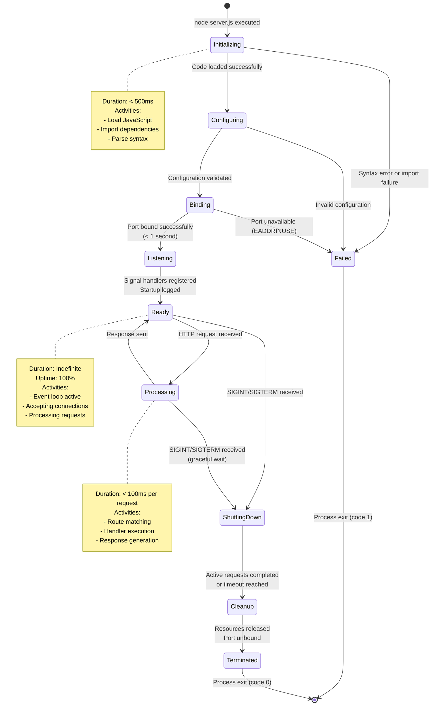

**State Descriptions**:

**Initializing**: Node.js runtime starting, loading server.js file into V8 engine, parsing JavaScript syntax. Duration target: < 500ms.

**Configuring**: Reading environment variables (PORT), setting configuration constants (HOST), validating configuration values. Duration target: < 100ms.

**Binding**: Attempting to bind HTTP server to configured port, establishing TCP/IP socket. Duration target: < 1 second.

**Listening**: Server actively listening on network port, ready to accept incoming TCP connections but not yet processing requests. Duration: momentary transition state.

**Ready**: Operational state where server accepts and processes requests, maintains event loop, logs activities. Duration: indefinite (100% uptime until shutdown).

**Processing**: Actively handling an HTTP request through the complete request-response cycle. Duration: < 100ms per request. Multiple requests may be processed concurrently.

**ShuttingDown**: Server received termination signal, stopped accepting new connections, waiting for active requests to complete or timeout. Duration: < 5 seconds.

**Cleanup**: Releasing system resources, closing network sockets, unbinding port, flushing logs. Duration: < 2 seconds.

**Terminated**: Process has exited cleanly with exit code 0 (success) or from any state to Failed with exit code 1 (error).

**Failed**: Error state reached when initialization fails, configuration invalid, or port unavailable. Process exits with error code 1.

**Valid State Transitions**:
- Initializing → Configuring → Binding → Listening → Ready (successful startup)
- Ready ↔ Processing (request handling loop)
- Ready/Processing → ShuttingDown → Cleanup → Terminated (graceful shutdown)
- Any state → Failed (error conditions)

---

## 4.5 Error Handling and Recovery Flows

### 4.5.1 Port Binding Error Flow (updated)

Port conflicts are the most common initialization error. This flowchart details the complete error detection, reporting, and resolution guidance workflow.

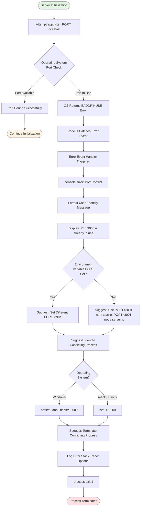

**Error Message Format**:
```
Error: Port 3000 is already in use
EADDRINUSE: address already in use 0.0.0.0:3000

Suggestions:
1. Try a different port: PORT=3001 npm start
   or: PORT=3001 node server.js
2. Or identify and stop the process using port 3000:
   - macOS/Linux: lsof -i :3000
   - Windows: netstat -ano | findstr :3000
3. Then terminate the conflicting process
```

**Resolution Steps**:
1. **Change Port**: Set environment variable PORT to alternative value (e.g., 3001, 8080) and restart using <span style="background-color: rgba(91, 57, 243, 0.2)">`PORT=3001 npm start` or `PORT=3001 node server.js`</span>
2. **Identify Conflict**: Use OS-specific commands to find process ID using target port
3. **Terminate Process**: Kill conflicting process using task manager or kill command
4. **Restart Server**: <span style="background-color: rgba(91, 57, 243, 0.2)">Execute `npm start` or `node server.js` again after resolution</span>

**Prevention**: Check for running server instances before starting new one; implement process management. <span style="background-color: rgba(91, 57, 243, 0.2)">When the server starts successfully, it displays the complete URL (format: `Server listening on http://localhost:${PORT}`) for immediate browser access and verification.</span>

---

### 4.5.2 Invalid Request Handling

Malformed HTTP requests can cause parser errors. This flowchart documents the detection and handling of protocol-level request errors.

```mermaid
graph TD
    START([TCP Connection Established]) --> RECEIVE_BYTES[Receive Raw Bytes from Socket]
    RECEIVE_BYTES --> HTTP_PARSER[HTTP Parser: Parse Request Line]
    
    HTTP_PARSER --> PARSE_METHOD{Method<br/>Valid?}
    PARSE_METHOD -->|No| MALFORMED_METHOD[Invalid HTTP Method]
    PARSE_METHOD -->|Yes| PARSE_PATH{Path<br/>Valid?}
    
    PARSE_PATH -->|No| MALFORMED_PATH[Invalid Request Path]
    PARSE_PATH -->|Yes| PARSE_VERSION{HTTP Version<br/>Supported?}
    
    PARSE_VERSION -->|No| UNSUPPORTED_VERSION[HTTP Version Not Supported]
    PARSE_VERSION -->|Yes| PARSE_HEADERS[Parse Request Headers]
    
    PARSE_HEADERS --> HEADERS_VALID{Headers<br/>Well-Formed?}
    HEADERS_VALID -->|No| MALFORMED_HEADERS[Malformed Headers]
    HEADERS_VALID -->|Yes| REQUEST_VALID[Request Valid]
    
    REQUEST_VALID --> ROUTE_REQUEST([Route to Handler])
    
    MALFORMED_METHOD --> ERROR_400
    MALFORMED_PATH --> ERROR_400
    MALFORMED_HEADERS --> ERROR_400
    
    UNSUPPORTED_VERSION --> ERROR_505[HTTP 505 Version Not Supported]
    ERROR_505 --> SEND_ERROR_RESPONSE
    
    ERROR_400[Construct HTTP 400 Bad Request]
    ERROR_400 --> SET_ERROR_HEADERS[Set Headers: Content-Type: text/plain]
    SET_ERROR_HEADERS --> SET_ERROR_BODY[Set Body: Bad Request]
    SET_ERROR_BODY --> SEND_ERROR_RESPONSE[Send Error Response to Client]
    
    SEND_ERROR_RESPONSE --> LOG_ERROR[Log: Malformed Request Rejected]
    LOG_ERROR --> CLOSE_CONNECTION[Close TCP Connection]
    CLOSE_CONNECTION --> END_ERROR([Request Rejected])
    
    style START fill:#e1f5e1
    style ROUTE_REQUEST fill:#fff4e1
    style END_ERROR fill:#ffe1e1
```

**Invalid Request Detection**:
- **Invalid HTTP Method**: Non-standard method name or empty method
- **Malformed Path**: Path missing or contains illegal characters
- **Unsupported HTTP Version**: Version other than HTTP/1.0, HTTP/1.1, or HTTP/2
- **Malformed Headers**: Missing colon separator, invalid header names, encoding errors

**Error Response**:
```
HTTP/1.1 400 Bad Request
Content-Type: text/plain
Content-Length: 11
Connection: close

Bad Request
```

**Node.js Behavior**: The built-in http module automatically handles most malformed requests by rejecting them before application code executes. This flowchart documents the intended behavior for educational completeness, though explicit implementation may be optional for basic tutorial scope.

---

### 4.5.3 Unmatched Route Handling (updated)

Requests to undefined routes require appropriate 404 responses. This flowchart details the handling of paths that don't match the <span style="background-color: rgba(91, 57, 243, 0.2)">defined `/hello` and `/evening` endpoints</span>.

```mermaid
graph TD
    START([Request Routed]) --> PATH_MATCH{"Path is<br/>/hello or<br/>/evening?"}
    
    PATH_MATCH -->|Yes| MATCHED([Route to Endpoint Handler])
    
    PATH_MATCH -->|No| CHECK_ROOT{"Path ===<br/>'/'?"}
    CHECK_ROOT -->|Yes| ROOT_DEFINED{"Root Handler<br/>Implemented?"}
    ROOT_DEFINED -->|Yes| ROUTE_ROOT([Route to Root Handler])
    ROOT_DEFINED -->|No| HANDLE_404
    
    CHECK_ROOT -->|No| CHECK_FAVICON{"Path ===<br/>'/favicon.ico'?"}
    CHECK_FAVICON -->|Yes| IGNORE_FAVICON{"Ignore Favicon<br/>Request?"}
    IGNORE_FAVICON -->|Yes| RETURN_204["HTTP 204 No Content"]
    RETURN_204 --> LOG_204["Log: Favicon Request Ignored"]
    LOG_204 --> END_SILENT([Silent Success])
    
    IGNORE_FAVICON -->|No| HANDLE_404
    CHECK_FAVICON -->|No| HANDLE_404["Handle 404 Not Found"]
    
    HANDLE_404 --> LOG_404["Log: Route Not Found - PATH"]
    LOG_404 --> CONSTRUCT_404["Construct HTTP 404 Response"]
    CONSTRUCT_404 --> SET_404_STATUS["Status: 404 Not Found"]
    SET_404_STATUS --> SET_404_HEADERS["Headers: Content-Type: text/plain"]
    SET_404_HEADERS --> SET_404_BODY["Body: Not Found"]
    
    SET_404_BODY --> SEND_404["Send 404 Response to Client"]
    SEND_404 --> END_404([404 Response Sent])
    
    style START fill:#e1f5e1
    style MATCHED fill:#fff4e1
    style ROUTE_ROOT fill:#fff4e1
    style END_SILENT fill:#fff4e1
    style END_404 fill:#ffcc99
```

**404 Response Format**:
```
HTTP/1.1 404 Not Found
Content-Type: text/plain
Content-Length: 9

Not Found
```

**Express.js Implementation Notes**:
- **Defined Routes**: The application implements two primary endpoints (`/hello` and `/evening`) using Express.js declarative routing via `app.get()` method
- **404 Handling Options**: Express.js provides automatic 404 handling for unmatched routes, or developers may implement an explicit catch-all middleware handler for custom 404 responses
- **Route Matching**: Express performs pattern matching on all registered routes before falling through to default 404 behavior

**Special Case Handling**:
- **Root Path (/)**: May optionally serve documentation or redirect to <span style="background-color: rgba(91, 57, 243, 0.2)">defined endpoints (`/hello` or `/evening`)</span>
- **Favicon Requests**: Browsers automatically request /favicon.ico; can be silently ignored with 204 No Content (optional, out of scope for minimal tutorial)
- **Static Files**: Out of scope for minimal tutorial; all static file requests result in 404

**Logging**: All unmatched routes should be logged for debugging and understanding request patterns:
```
[2024-03-15 10:30:45] Route not found: GET /api/users (404)
```

**Enhancement Opportunity**: Future implementations may add custom 404 page with helpful navigation links <span style="background-color: rgba(91, 57, 243, 0.2)">to available endpoints (`/hello` and `/evening`)</span>, but basic text response meets minimal requirements.

---

## 4.6 Logging and Observability Flows

### 4.6.1 Startup Logging Flow

Startup logging provides immediate feedback confirming successful server initialization, meeting the educational goal of visibility into server behavior. The logging includes a complete, clickable URL format for convenient browser testing.

```mermaid
graph TD
    START([Server Reaches Listening State]) --> TRIGGER_CALLBACK[Listening Callback Triggered]
    TRIGGER_CALLBACK --> RECORD_TIME[Record Current Timestamp]
    RECORD_TIME --> FORMAT_PORT[Format Port Number as String]
    
    FORMAT_PORT --> CONSTRUCT_MSG[Construct Message Template]
    CONSTRUCT_MSG --> INTERPOLATE[Interpolate: Server listening on http://localhost:PORT]
    INTERPOLATE --> TIMING_CHECK{Startup Time<br/>< 2 seconds?}
    
    TIMING_CHECK -->|Yes| ADD_SUCCESS[Optional: Add Success Indicator]
    TIMING_CHECK -->|No| ADD_WARNING[Add: Warning - Slow Startup]
    
    ADD_SUCCESS --> CONSOLE_LOG[console.log Message to stdout]
    ADD_WARNING --> CONSOLE_LOG
    
    CONSOLE_LOG --> FLUSH_BUFFER[Flush Console Buffer]
    FLUSH_BUFFER --> DISPLAY_TERMINAL[Message Appears in Terminal]
    
    DISPLAY_TERMINAL --> LATENCY_CHECK{Log Latency<br/>< 100ms?}
    LATENCY_CHECK -->|Yes| LOG_SUCCESS[Logging Successful]
    LATENCY_CHECK -->|No| LOG_WARNING[Warning: Delayed Log Output]
    
    LOG_SUCCESS --> READY([Server Ready for Requests])
    LOG_WARNING --> READY
    
    style START fill:#e1f5e1
    style READY fill:#fff4e1
```

**Startup Log Message Format** (updated):

<span style="background-color: rgba(91, 57, 243, 0.2)">The startup confirmation message includes the complete URL with protocol and hostname for immediate browser testing convenience:</span>

```
Server listening on http://localhost:3000
```

<span style="background-color: rgba(91, 57, 243, 0.2)">**Port Override Example**:

When users need to override the default port (e.g., to resolve port conflicts), the PORT environment variable can be specified:</span>

```bash
PORT=8080 npm start
```

<span style="background-color: rgba(91, 57, 243, 0.2)">This produces the startup message reflecting the configured port:</span>

```
Server listening on http://localhost:8080
```

**Optional Enhanced Format**:
```
[2024-03-15 10:30:22] Server listening on http://localhost:3000
Server started successfully in 1.23 seconds
Ready to accept connections
```

**Logging Requirements**:
- **Timing**: Message must appear within 100ms of reaching listening state as specified in the `app.listen()` callback
- **Visibility**: Output to stdout for immediate user feedback
- **Clarity**: Beginner-friendly language without technical jargon
- **URL Format**: <span style="background-color: rgba(91, 57, 243, 0.2)">Complete URL (http://localhost:[PORT]) provides clickable link in modern terminals</span>
- **Port Flexibility**: <span style="background-color: rgba(91, 57, 243, 0.2)">Message dynamically reflects PORT environment variable when overridden</span>

**Implementation Context**:

The startup log is triggered within the `app.listen(PORT, callback)` callback function, ensuring it executes immediately after the Express.js server successfully binds to the network port. The callback receives no parameters and relies on lexical scope to access the PORT configuration value for message interpolation.

**Educational Purpose**: Confirms successful startup and provides immediate positive feedback to learners with a ready-to-use URL, building confidence in their implementation. The complete URL format eliminates ambiguity about how to test the server and demonstrates professional logging practices.

---

### 4.6.2 Request Activity Logging Flow (updated)

Request logging provides real-time visibility into server activity with <span style="background-color: rgba(91, 57, 243, 0.2)">ISO 8601 timestamp precision</span>, demonstrating HTTP fundamentals and aiding debugging during tutorial completion. <span style="background-color: rgba(91, 57, 243, 0.2)">The consistent timestamp format ensures chronological accuracy and international compatibility.</span>

```mermaid
graph TD
    START([HTTP Request Received]) --> EXTRACT_METHOD[Extract HTTP Method]
    EXTRACT_METHOD --> EXTRACT_PATH[Extract URL Path]
    EXTRACT_PATH --> GET_TIME[Get Current Timestamp]
    
    GET_TIME --> FORMAT_TIME[Format as ISO 8601 using toISOString]
    FORMAT_TIME --> BUILD_MSG[Build Log Message String]
    
    BUILD_MSG --> LOG_FORMAT{Log Format<br/>Style?}
    
    LOG_FORMAT -->|Standard| FORMAT_STANDARD[TIMESTAMP - METHOD PATH]
    LOG_FORMAT -->|Verbose| FORMAT_VERBOSE[TIMESTAMP - METHOD PATH + Metadata]
    
    FORMAT_STANDARD --> CONSOLE_LOG[console.log Message]
    FORMAT_VERBOSE --> CONSOLE_LOG
    
    CONSOLE_LOG --> REALTIME_CHECK{Log Real-Time<br/>or Batch?}
    REALTIME_CHECK -->|Real-Time| IMMEDIATE_OUTPUT[Immediate stdout Output]
    REALTIME_CHECK -->|Batch| BUFFER_LOG[Buffer for Batch Output]
    
    IMMEDIATE_OUTPUT --> DISPLAY[Display in Terminal]
    BUFFER_LOG --> PERIODIC_FLUSH[Flush Buffer Periodically]
    PERIODIC_FLUSH --> DISPLAY
    
    DISPLAY --> EDUCATIONAL_VALUE[User Observes Request Activity]
    EDUCATIONAL_VALUE --> END([Logging Complete])
    
    style START fill:#e1f5e1
    style END fill:#fff4e1
```

**Log Format Examples** (updated):

<span style="background-color: rgba(91, 57, 243, 0.2)">**Standard Format** (recommended for tutorial):</span>

<span style="background-color: rgba(91, 57, 243, 0.2)">All request logs include ISO 8601 timestamps with method and path following the pattern `${new Date().toISOString()} - ${req.method} ${req.path}`:</span>

```
2024-10-15T14:30:45.123Z - GET /hello
2024-10-15T14:30:46.234Z - GET /hello
2024-10-15T14:30:47.345Z - GET /evening
2024-10-15T14:30:48.456Z - GET /evening
2024-10-15T14:30:49.567Z - GET /favicon.ico
```

<span style="background-color: rgba(91, 57, 243, 0.2)">This format demonstrates activity for both defined endpoints (`/hello` and `/evening`) as well as common browser-generated requests.</span>

**Verbose Format** (advanced):

<span style="background-color: rgba(91, 57, 243, 0.2)">For more detailed observability, additional metadata can be appended while maintaining the ISO 8601 timestamp prefix:</span>

```
2024-10-15T14:30:45.123Z - GET /hello - 200 OK - 15ms - User-Agent: curl/7.64.1
2024-10-15T14:30:46.234Z - GET /hello - 200 OK - 12ms - User-Agent: Mozilla/5.0
2024-10-15T14:30:47.345Z - GET /evening - 200 OK - 8ms - User-Agent: curl/7.64.1
2024-10-15T14:30:48.456Z - GET /evening - 200 OK - 14ms - User-Agent: Mozilla/5.0
2024-10-15T14:30:49.567Z - GET /unknown - 404 Not Found - 5ms
```

**Logging Implementation Requirements** (updated):

- **Timestamp Format**: ISO 8601 format generated via `new Date().toISOString()` for chronological precision and international standardization
- **Message Pattern**: Consistent structure `${timestamp} - ${method} ${path}` across all request handlers
- **Performance Impact**: Minimal overhead (< 1ms per log entry including timestamp generation)
- **Real-Time Output**: Immediate feedback for educational visibility
- **Non-Blocking**: Asynchronous console.log does not block request processing
- **Opt-Out Capability**: Optional environment variable to disable logging (LOG_LEVEL=silent)

**Handler Integration**:

<span style="background-color: rgba(91, 57, 243, 0.2)">Each route handler must include logging as the first operation before response generation. For both `/hello` and `/evening` endpoints, the implementation pattern is:</span>

```javascript
app.get('/hello', (req, res) => {
  console.log(`${new Date().toISOString()} - ${req.method} ${req.path}`);
  res.send('Hello world');
});

app.get('/evening', (req, res) => {
  console.log(`${new Date().toISOString()} - ${req.method} ${req.path}`);
  res.send('Good evening');
});
```

<span style="background-color: rgba(91, 57, 243, 0.2)">This consistent logging pattern across both endpoints demonstrates uniform observability practices and enables learners to trace all server activity with precise timing information.</span>

**Educational Value**: <span style="background-color: rgba(91, 57, 243, 0.2)">Demonstrates HTTP request patterns for multiple endpoints with precise timestamps, helps learners understand client-server interaction timing, provides debugging visibility for troubleshooting, and introduces ISO 8601 as an international standard for timestamp representation.</span>

**ISO 8601 Format Benefits**:

- **Unambiguous**: Eliminates date/time interpretation confusion across locales
- **Sortable**: Lexicographic sorting matches chronological ordering
- **Machine-Parseable**: Direct compatibility with Date constructor and logging aggregation tools
- **Millisecond Precision**: Three decimal places (`.sss`) capture sub-second timing for performance analysis
- **Timezone Explicit**: `Z` suffix indicates UTC, avoiding timezone ambiguity

---

### 4.6.3 Logging Architecture and Data Flow

This subsection documents the comprehensive architecture supporting logging operations across startup and request processing phases.

#### 4.6.3.1 Logging Component Integration

The logging system integrates with Express.js application lifecycle and request processing pipeline without introducing external dependencies or middleware frameworks. All logging operations utilize Node.js native `console` API for stdout output.

**Component Relationships**:

```mermaid
graph TB
    subgraph "Express Application Lifecycle"
        A[Express App Initialization]
        B[app.listen Invocation]
        C[Listening Callback]
    end
    
    subgraph "Request Processing Pipeline"
        D[Incoming HTTP Request]
        E[Express Router]
        F[Route Handler Execution]
    end
    
    subgraph "Logging Operations"
        G[Startup Logger]
        H[Request Logger]
        I[Console stdout]
    end
    
    B --> C
    C --> G
    G --> I
    
    D --> E
    E --> F
    F --> H
    H --> I
    
    style G fill:#e1f5e1
    style H fill:#e1f5e1
    style I fill:#fff4e1
```

**Integration Points**:

1. **Startup Logging Integration**: Executes within the `app.listen(PORT, callback)` callback function, triggered once upon successful port binding. No dependencies on other components; operates with lexical access to PORT configuration.

2. **Request Logging Integration**: Executes as first statement within each route handler before any response generation logic. Receives Express request object (`req`) providing access to `req.method` and `req.path` properties.

#### 4.6.3.2 Timing and Performance Characteristics

**Startup Logging Performance**:

| Metric | Target | Measurement Method |
|--------|--------|-------------------|
| Callback Invocation Delay | < 100ms after port binding | Time from listen() to callback execution |
| Message Construction Time | < 10ms | String interpolation duration |
| Console Output Latency | < 50ms | Time from console.log to stdout flush |
| Total Startup Log Latency | < 100ms | End-to-end from listening state to terminal display |

**Request Logging Performance**:

| Metric | Target | Measurement Method |
|--------|--------|-------------------|
| Timestamp Generation | < 0.5ms | new Date().toISOString() execution time |
| Message Construction | < 0.5ms | Template literal interpolation duration |
| Console Output | < 1ms | console.log execution time |
| Total Request Log Overhead | < 2ms | Total added latency per request |
| Handler Execution Impact | < 2% | Logging overhead as percentage of total handler time |

These performance characteristics ensure logging provides educational visibility without meaningfully impacting the learner's experience or violating the < 100ms endpoint response requirement.

#### 4.6.3.3 Output Stream Management

**Standard Output Configuration**:

- **Stream**: `process.stdout` (Node.js standard output stream)
- **Buffering**: Line-buffered by default in Node.js terminal environments
- **Encoding**: UTF-8 for international character support
- **Blocking Behavior**: Non-blocking asynchronous writes prevent request processing delays

**Terminal Display Characteristics**:

- **Real-Time Visibility**: Logs appear immediately in terminal where `npm start` was executed
- **Interleaving**: Startup logs appear once; request logs interleave with ongoing server operation
- **Scrollback**: Terminal scrollback buffer retains historical log entries for review
- **Color Support**: Optional ANSI color codes can enhance readability (not required for basic implementation)

#### 4.6.3.4 Error Handling in Logging Operations

Logging operations themselves must not cause application failures. The system implements defensive practices:

**Error Resilience**:

```mermaid
graph TD
    START([Log Event Occurs]) --> CONSTRUCT[Construct Log Message]
    CONSTRUCT --> SAFE_CHECK{Message<br/>Construction<br/>Successful?}
    
    SAFE_CHECK -->|Yes| CONSOLE_LOG[console.log Invocation]
    SAFE_CHECK -->|No| FALLBACK[Use Fallback Message]
    FALLBACK --> CONSOLE_LOG
    
    CONSOLE_LOG --> OUTPUT_CHECK{stdout<br/>Available?}
    OUTPUT_CHECK -->|Yes| WRITE[Write to stdout]
    OUTPUT_CHECK -->|No| SILENT[Silent Failure - No Exception]
    
    WRITE --> COMPLETE([Logging Complete])
    SILENT --> COMPLETE
    
    style START fill:#e1f5e1
    style COMPLETE fill:#fff4e1
```

**Defensive Logging Practices**:

- **No Exception Propagation**: Logging errors do not throw exceptions that would terminate request handling
- **Fallback Messages**: If message construction fails (e.g., undefined PORT), use generic fallback text
- **Silent Degradation**: If stdout is unavailable (rare scenario), logging silently fails without affecting application operation
- **Type Safety**: Message components are coerced to strings to prevent interpolation errors

This error handling ensures that logging serves its observability purpose without introducing reliability risks to the educational server.

---

### 4.6.4 Observability for Debugging and Learning

Beyond operational logging, the system's observability characteristics support the tutorial's educational objectives by providing learners with insight into server behavior.

#### 4.6.4.1 Request Tracing

The request activity logs enable learners to trace the complete lifecycle of HTTP requests:

**Tracing Workflow**:

1. **Request Initiation**: Learner executes `curl http://localhost:3000/hello` or visits URL in browser
2. **Log Observation**: Terminal displays timestamp, method, and path confirming request receipt
3. **Response Correlation**: Browser/curl displays response body allowing correlation with log entry
4. **Pattern Recognition**: Multiple requests reveal request patterns and server responsiveness

**Example Tracing Session**:

```bash
# Terminal 1: Server running
$ npm start
Server listening on http://localhost:3000

2024-10-15T14:30:45.123Z - GET /hello
2024-10-15T14:30:47.345Z - GET /evening
2024-10-15T14:30:49.567Z - GET /hello
```

```bash
# Terminal 2: Client requests
$ curl http://localhost:3000/hello
Hello world

$ curl http://localhost:3000/evening
Good evening

$ curl http://localhost:3000/hello
Hello world
```

This parallel observation demonstrates the request-response cycle and builds understanding of asynchronous server behavior.

#### 4.6.4.2 Debugging Visibility

Logging provides essential debugging information for learners troubleshooting their implementations:

**Common Debugging Scenarios**:

| Issue | Log Evidence | Resolution Guidance |
|-------|--------------|---------------------|
| Server not responding | No request logs appear despite client attempts | Check server is running; verify port number matches |
| Wrong endpoint response | Request log shows correct path, wrong response | Inspect handler logic and response string |
| Slow responses | Large timestamp gaps between request and response logs | Check for blocking operations in handler |
| Port conflict | No startup log appears | Check if port 3000 is in use; try PORT override |
| Route not found | No request log for attempted path | Verify route registration and path spelling |

#### 4.6.4.3 Learning Progression Support

The logging system supports the tutorial's learning progression by providing progressive complexity:

**Learning Stages**:

1. **Stage 1 - Basic Awareness**: Startup log confirms successful server initialization
2. **Stage 2 - Request Understanding**: Request logs demonstrate client-server interaction
3. **Stage 3 - Multi-Endpoint Observation**: Logs differentiate between `/hello` and `/evening` requests
4. **Stage 4 - Timing Analysis**: ISO 8601 timestamps enable learners to analyze request timing patterns
5. **Stage 5 - Advanced Debugging**: Learners use log patterns to troubleshoot issues independently

This progression aligns with the tutorial's incremental complexity approach, introducing observability concepts gradually as learners build expertise.

---

## 4.7 Performance and Timing Constraints

### 4.7.1 Timing Requirements Matrix (updated)

This comprehensive matrix documents all performance requirements, measurement points, and success criteria defined in the technical specification.

| Process | Performance Target | Measurement Point | Criticality | Validation Method |
|---------|-------------------|-------------------|-------------|-------------------|
| **Startup: Total** | < 2 seconds | Process start → Listening state | Critical | Timestamp comparison: process start vs listening callback |
| **Startup: Port Binding** | < 1 second | server.listen() call → Bound | High | Part of total startup time |
| **Startup: Logging** | < 100ms | Listening state → Log output | Medium | Timestamp: listening callback vs console.log |
| **Request: Total Latency** | < 100ms | Request receipt → Response complete | Critical | Server-side timing: request event → response.end() |
| **Request: Routing Decision** | < 10ms | Path extraction → Handler invocation | High | Profiling: router entry vs handler call |
| **Request: Handler Execution** | Synchronous (immediate) | Handler start → Response generation | High | No async operations, immediate return |
| **Request: Response Formatting** | < 5ms | Handler output → HTTP response ready | Medium | Profiling: response construction overhead |
| **Shutdown: Total** | < 5 seconds | Signal receipt → Process exit | Medium | Timestamp: SIGINT event vs process.exit() |
| **Shutdown: Port Release** | < 1 second | server.close() call → Port unbound | High | OS verification: port availability |
| **Request: Success Rate** | <span style="background-color: rgba(91, 57, 243, 0.2)">100% for valid GET /hello and GET /evening requests</span> | Valid GET requests to defined endpoints | Critical | Success count / total requests |
| **Server: Uptime** | 100% | Active execution period | Critical | No unexpected crashes or hangs |
| **Initialization: Success Rate** | 100% | When port available | Critical | Success count / startup attempts |
| **Concurrent Connections** | Minimum 10 simultaneous | Active concurrent requests | Medium | Load testing: concurrent GET requests to both endpoints |

**Performance Measurement Tools**:
- **Built-in Timing**: `console.time()` and `console.timeEnd()` for development profiling
- **Process Metrics**: `process.hrtime.bigint()` for high-resolution timing
- **Load Testing**: Apache Bench (ab) or autocannon for concurrent connection testing
- **Monitoring**: Node.js `--prof` flag for CPU profiling (advanced)

---

### 4.7.2 Performance Validation Points (updated)

This flowchart details the complete performance validation workflow for verifying system meets all timing constraints <span style="background-color: rgba(91, 57, 243, 0.2)">for both `/hello` and `/evening` endpoints</span>.

```mermaid
graph TD
    START([Begin Performance Validation]) --> TEST_STARTUP[Test 1: Measure Startup Time]
    
    TEST_STARTUP --> START_TIMER[Start Timer]
    START_TIMER --> EXEC_SERVER[Execute: node server.js]
    EXEC_SERVER --> WAIT_LISTENING[Wait for Server listening message]
    WAIT_LISTENING --> STOP_TIMER[Stop Timer]
    STOP_TIMER --> CHECK_STARTUP{Startup<br/>< 2 seconds?}
    
    CHECK_STARTUP -->|Yes| PASS_STARTUP[✓ Startup Performance Pass]
    CHECK_STARTUP -->|No| FAIL_STARTUP[✗ Startup Performance Fail]
    FAIL_STARTUP --> LOG_STARTUP_FAIL[Log: Startup took DURATION seconds]
    LOG_STARTUP_FAIL --> CONTINUE_TESTS
    PASS_STARTUP --> CONTINUE_TESTS[Continue to Next Test]
    
    CONTINUE_TESTS --> TEST_RESPONSE_HELLO[Test 2a: Measure /hello Response Latency]
    TEST_RESPONSE_HELLO --> SEND_REQUEST_HELLO[Send GET /hello request]
    SEND_REQUEST_HELLO --> TIME_REQUEST_HELLO[Measure round-trip time]
    TIME_REQUEST_HELLO --> CHECK_LATENCY_HELLO{Latency<br/>< 100ms?}
    
    CHECK_LATENCY_HELLO -->|Yes| PASS_LATENCY_HELLO[✓ /hello Response Latency Pass]
    CHECK_LATENCY_HELLO -->|No| FAIL_LATENCY_HELLO[✗ /hello Response Latency Fail]
    FAIL_LATENCY_HELLO --> LOG_LATENCY_FAIL_HELLO[Log: /hello response took DURATION ms]
    LOG_LATENCY_FAIL_HELLO --> TEST_RESPONSE_EVENING
    PASS_LATENCY_HELLO --> TEST_RESPONSE_EVENING
    
    TEST_RESPONSE_EVENING[Test 2b: Measure /evening Response Latency]
    TEST_RESPONSE_EVENING --> SEND_REQUEST_EVENING[Send GET /evening request]
    SEND_REQUEST_EVENING --> TIME_REQUEST_EVENING[Measure round-trip time]
    TIME_REQUEST_EVENING --> CHECK_LATENCY_EVENING{Latency<br/>< 100ms?}
    
    CHECK_LATENCY_EVENING -->|Yes| PASS_LATENCY_EVENING[✓ /evening Response Latency Pass]
    CHECK_LATENCY_EVENING -->|No| FAIL_LATENCY_EVENING[✗ /evening Response Latency Fail]
    FAIL_LATENCY_EVENING --> LOG_LATENCY_FAIL_EVENING[Log: /evening response took DURATION ms]
    LOG_LATENCY_FAIL_EVENING --> TEST_CONSISTENCY
    PASS_LATENCY_EVENING --> TEST_CONSISTENCY
    
    TEST_CONSISTENCY[Test 3: Verify Response Consistency]
    TEST_CONSISTENCY --> SEND_MULTIPLE[Send 100 requests: 50 to /hello, 50 to /evening]
    SEND_MULTIPLE --> COMPARE_RESPONSES[Compare all responses per endpoint]
    COMPARE_RESPONSES --> CHECK_IDENTICAL{All responses<br/>identical per endpoint?}
    
    CHECK_IDENTICAL -->|Yes| PASS_CONSISTENCY[✓ Consistency Pass]
    CHECK_IDENTICAL -->|No| FAIL_CONSISTENCY[✗ Consistency Fail]
    FAIL_CONSISTENCY --> LOG_VARIATION[Log: Response variation detected]
    LOG_VARIATION --> TEST_CONCURRENT
    PASS_CONSISTENCY --> TEST_CONCURRENT
    
    TEST_CONCURRENT[Test 4: Concurrent Connection Handling]
    TEST_CONCURRENT --> SPAWN_CONCURRENT[Spawn 10 concurrent requests: 5 to /hello, 5 to /evening]
    SPAWN_CONCURRENT --> WAIT_ALL[Wait for all responses]
    WAIT_ALL --> CHECK_SUCCESS{All requests<br/>successful?}
    
    CHECK_SUCCESS -->|Yes| PASS_CONCURRENT[✓ Concurrency Pass]
    CHECK_SUCCESS -->|No| FAIL_CONCURRENT[✗ Concurrency Fail]
    FAIL_CONCURRENT --> LOG_FAILURES[Log: FAILED_COUNT requests failed]
    LOG_FAILURES --> TEST_SHUTDOWN
    PASS_CONCURRENT --> TEST_SHUTDOWN
    
    TEST_SHUTDOWN[Test 5: Graceful Shutdown Time]
    TEST_SHUTDOWN --> SEND_SIGINT[Send SIGINT signal]
    SEND_SIGINT --> TIME_SHUTDOWN[Measure shutdown duration]
    TIME_SHUTDOWN --> CHECK_SHUTDOWN{Shutdown<br/>< 5 seconds?}
    
    CHECK_SHUTDOWN -->|Yes| PASS_SHUTDOWN[✓ Shutdown Performance Pass]
    CHECK_SHUTDOWN -->|No| FAIL_SHUTDOWN[✗ Shutdown Performance Fail]
    FAIL_SHUTDOWN --> LOG_SHUTDOWN_FAIL[Log: Shutdown took DURATION seconds]
    LOG_SHUTDOWN_FAIL --> AGGREGATE
    PASS_SHUTDOWN --> AGGREGATE
    
    AGGREGATE[Aggregate Test Results]
    AGGREGATE --> ALL_PASSED{All tests<br/>passed?}
    ALL_PASSED -->|Yes| VALIDATION_SUCCESS([✓ Performance Validation Complete])
    ALL_PASSED -->|No| VALIDATION_FAIL([✗ Performance Issues Detected])
    
    style START fill:#e1f5e1
    style VALIDATION_SUCCESS fill:#c8e6c9
    style VALIDATION_FAIL fill:#ffe1e1
    style TEST_RESPONSE_EVENING fill:#DED7FD
    style SEND_REQUEST_EVENING fill:#DED7FD
    style TIME_REQUEST_EVENING fill:#DED7FD
    style CHECK_LATENCY_EVENING fill:#DED7FD
    style PASS_LATENCY_EVENING fill:#DED7FD
    style FAIL_LATENCY_EVENING fill:#DED7FD
    style LOG_LATENCY_FAIL_EVENING fill:#DED7FD
```

**Validation Test Suite** (updated):

**Test 1 - Startup Performance**: Verify server initialization completes within 2 seconds from process start to listening state. Measure using timestamp comparison between `node` command execution and "Server listening" log output.

**Test 2a - /hello Response Latency**: Verify single request-response cycle for GET /hello completes within 100ms. Use HTTP client timing (curl `-w` flag or automated test) measuring time from request sent to response received. Expected response body: "Hello world".

**Test 2b - /evening Response Latency** (updated): <span style="background-color: rgba(91, 57, 243, 0.2)">Verify single request-response cycle for GET /evening completes within 100ms. Use HTTP client timing measuring time from request sent to response received. Expected response body: "Good evening". This test validates the new endpoint meets identical performance requirements as the original /hello endpoint.</span>

**Test 3 - Response Consistency** (updated): Verify <span style="background-color: rgba(91, 57, 243, 0.2)">100 sequential requests (50 to /hello, 50 to /evening) all return identical responses per endpoint</span> with HTTP 200 status. <span style="background-color: rgba(91, 57, 243, 0.2)">All /hello requests must return "Hello world", all /evening requests must return "Good evening".</span> Validates stateless architecture and deterministic behavior <span style="background-color: rgba(91, 57, 243, 0.2)">for both endpoints</span>.

**Test 4 - Concurrent Connection Handling** (updated): Verify server successfully handles minimum 10 concurrent requests without errors or degradation. <span style="background-color: rgba(91, 57, 243, 0.2)">Use load testing tool (Apache Bench: `ab -n 100 -c 10 http://localhost:3000/hello` and `ab -n 100 -c 10 http://localhost:3000/evening`) to generate concurrent load to both endpoints.</span> Validates Express.js handles multiple simultaneous connections <span style="background-color: rgba(91, 57, 243, 0.2)">across different routes</span> without blocking or performance degradation.

**Test 5 - Graceful Shutdown**: Verify server shuts down cleanly within 5 seconds of receiving SIGINT signal, releasing port and exiting with code 0.

**Success Criteria** (updated): All five tests <span style="background-color: rgba(91, 57, 243, 0.2)">(including both 2a and 2b sub-tests)</span> must pass for performance validation to succeed. Any failure indicates implementation does not meet specification requirements and requires optimization or correction.

**Performance Testing Commands** (updated):

```bash
# Test 1: Startup Performance
time node server.js &
# Expected: "Server listening" appears within 2 seconds

#### Test 2a: /hello Response Latency
curl -w "\nTime: %{time_total}s\n" http://localhost:3000/hello
#### Expected: Time < 0.100s, Response: "Hello world"

#### Test 2b: /evening Response Latency (updated)
curl -w "\nTime: %{time_total}s\n" http://localhost:3000/evening
#### Expected: Time < 0.100s, Response: "Good evening"

#### Test 3: Response Consistency (updated)
#### For /hello endpoint:
for i in {1..50}; do curl -s http://localhost:3000/hello >> hello_responses.txt; done
#### All 50 responses should be identical: "Hello world"

#### For /evening endpoint:
for i in {1..50}; do curl -s http://localhost:3000/evening >> evening_responses.txt; done
#### All 50 responses should be identical: "Good evening"

#### Test 4: Concurrent Connection Handling (updated)
#### Test /hello endpoint:
ab -n 100 -c 10 http://localhost:3000/hello
#### Expected: 100% success rate, all responses "Hello world"

#### Test /evening endpoint:
ab -n 100 -c 10 http://localhost:3000/evening
#### Expected: 100% success rate, all responses "Good evening"

#### Test 5: Graceful Shutdown
kill -SIGINT <PID> && time wait <PID>
#### Expected: Shutdown completes within 5 seconds, exit code 0
```

**Performance Benchmarking Tools** (updated):

**Apache Bench (ab)**: Industry-standard HTTP load testing tool for benchmarking server performance under concurrent load. <span style="background-color: rgba(91, 57, 243, 0.2)">Supports testing multiple endpoints sequentially to validate performance consistency across routes.</span>

**autocannon**: Modern Node.js-based load testing tool offering more detailed metrics and pipeline support. <span style="background-color: rgba(91, 57, 243, 0.2)">Can test multiple endpoints with custom scenarios:</span>
```bash
# Example: Test both endpoints with autocannon
autocannon -c 10 -d 5 http://localhost:3000/hello
autocannon -c 10 -d 5 http://localhost:3000/evening
```

**curl with timing**: Simple command-line testing for manual verification. Use `-w` flag with format variables to extract detailed timing information:
```bash
curl -w "DNS: %{time_namelookup}\nConnect: %{time_connect}\nTotal: %{time_total}\n" \
  http://localhost:3000/hello

curl -w "DNS: %{time_namelookup}\nConnect: %{time_connect}\nTotal: %{time_total}\n" \
  http://localhost:3000/evening
```

**Node.js Built-in Performance Hooks**: For advanced profiling, use Node.js Performance Timing API to measure Express.js routing and handler execution overhead:
```javascript
const { performance, PerformanceObserver } = require('perf_hooks');

// Measure routing performance
performance.mark('route-start');
// ... Express routing logic ...
performance.mark('route-end');
performance.measure('Routing Time', 'route-start', 'route-end');
```

---

## 4.8 Integration Workflows

### 4.8.1 Feature Dependency Flow

The feature dependency flow illustrates the initialization sequence and runtime dependencies between all system features, ensuring components are initialized in the correct order.

```mermaid
graph TD
    START([System Initialization]) --> INIT_F001["Initialize F-001: Express App"]
    
    INIT_F001 --> SERVER_READY{F-001<br/>Ready?}
    SERVER_READY -->|No| INIT_ERROR[Initialization Error]
    INIT_ERROR --> END_ERROR([System Failed])
    
    SERVER_READY -->|Yes| INIT_F004[Initialize F-004: Logging Utility]
    INIT_F004 --> LOG_STARTUP[Log: Server Initialization Started]
    
    LOG_STARTUP --> INIT_F002[Initialize F-002: Endpoint Router]
    INIT_F002 --> DEFINE_ROUTES["Define Routes:<br/>/hello → handler<br/>/evening → handler"]
    DEFINE_ROUTES --> ROUTER_READY{F-002<br/>Ready?}
    
    ROUTER_READY -->|No| INIT_ERROR
    ROUTER_READY -->|Yes| INIT_F003["Initialize F-003: Express-Managed Response"]
    
    INIT_F003 --> FORMATTER_READY{F-003<br/>Ready?}
    FORMATTER_READY -->|No| INIT_ERROR
    FORMATTER_READY -->|Yes| BIND_SERVER[Bind Server to Port]
    
    BIND_SERVER --> BIND_SUCCESS{Binding<br/>Successful?}
    BIND_SUCCESS -->|No| INIT_ERROR
    BIND_SUCCESS -->|Yes| LOG_READY[F-004: Log Server Ready]
    
    LOG_READY --> ALL_FEATURES[All Features Operational]
    ALL_FEATURES --> RUNTIME[Runtime Operation]
    
    RUNTIME --> REQUEST_ARRIVAL{HTTP Request<br/>Received?}
    REQUEST_ARRIVAL -->|Yes| USE_F001[F-001: Accept Connection]
    USE_F001 --> USE_F004_REQ[F-004: Log Request]
    USE_F004_REQ --> USE_F002[F-002: Route Request]
    USE_F002 --> INVOKE_HANDLER[F-002: Invoke Handler]
    INVOKE_HANDLER --> USE_F003[F-003: Format Response]
    USE_F003 --> USE_F001_SEND[F-001: Send Response]
    USE_F001_SEND --> USE_F004_RES[F-004: Log Response]
    USE_F004_RES --> REQUEST_ARRIVAL
    
    REQUEST_ARRIVAL -->|No| RUNTIME
    
    style START fill:#e1f5e1
    style ALL_FEATURES fill:#fff4e1
    style END_ERROR fill:#ffe1e1
```

**Initialization Sequence**:

**Phase 1 - Foundation**: <span style="background-color: rgba(91, 57, 243, 0.2)">F-001 (Express App) must initialize first as it provides the foundational Express.js application instance and framework infrastructure</span> for all other features. Includes creating the Express application via `express()`, loading configuration, and preparing for port binding.

**Phase 2 - Observability**: F-004 (Logging Utility) initializes second to enable visibility into subsequent initialization steps. Logging must be operational before features generate events, providing real-time feedback during the initialization sequence.

**Phase 3 - Routing**: F-002 (Endpoint Router) initializes third, <span style="background-color: rgba(91, 57, 243, 0.2)">defining route mappings for both `/hello` and `/evening` endpoints through Express.js declarative routing (`app.get()` method)</span> and preparing request dispatching logic. <span style="background-color: rgba(91, 57, 243, 0.2)">Depends on operational Express App instance (F-001)</span>.

**Phase 4 - Response Handling**: <span style="background-color: rgba(91, 57, 243, 0.2)">F-003 (Express-Managed Response)</span> initializes fourth, preparing HTTP response construction capabilities <span style="background-color: rgba(91, 57, 243, 0.2)">through Express.js response APIs</span>. Works in conjunction with F-002 handler output.

**Phase 5 - Activation**: Server binds to port <span style="background-color: rgba(91, 57, 243, 0.2)">(configurable via `process.env.PORT`, default 3000) on localhost interface</span> and begins accepting connections. All features now operational and integrated.

**Runtime Dependencies**:
- <span style="background-color: rgba(91, 57, 243, 0.2)">F-002 (Router) depends on F-001 (Express App) for request objects and routing infrastructure</span>
- <span style="background-color: rgba(91, 57, 243, 0.2)">F-003 (Express-Managed Response) depends on F-002 (Handler) for response data and Express.js response methods</span>
- F-004 (Logging) observes events from F-001, F-002, and F-003 as a cross-cutting concern
- <span style="background-color: rgba(91, 57, 243, 0.2)">All features depend on F-001 for operational Express application instance</span>

**Failure Impact**:
- <span style="background-color: rgba(91, 57, 243, 0.2)">F-001 failure: Complete system failure (no Express application infrastructure)</span>
- F-002 failure: No request routing (all requests result in 404 or error)
- F-003 failure: Invalid HTTP responses (protocol violations)
- F-004 failure: Reduced visibility (system still operational, logs missing)

---

### 4.8.2 Technology Stack Integration (updated)

This flowchart documents how the technology stack components integrate to form the complete operational system, <span style="background-color: rgba(91, 57, 243, 0.2)">highlighting the Express.js framework layer that provides routing and response management capabilities</span>.

```mermaid
graph TB
    subgraph "Application Layer"
        APP[server.js Application Code]
    end
    
    subgraph "Express.js Framework Layer"
        APP --> EXPRESS[Express.js 4.x Framework]
        EXPRESS --> ROUTING[Express Router]
        EXPRESS --> RESPONSE[Express Response APIs]
        EXPRESS --> MIDDLEWARE[Express Middleware Pipeline]
    end
    
    subgraph "Node.js Runtime Layer"
        EXPRESS --> HTTP_MODULE[http Module: Server & Protocol]
        APP --> CONSOLE[console Module: Logging]
        APP --> PROCESS[process Module: Environment & Signals]
        
        HTTP_MODULE --> V8[V8 JavaScript Engine]
        CONSOLE --> V8
        PROCESS --> V8
    end
    
    subgraph "Operating System Layer"
        V8 --> LIBUV[libuv: Asynchronous I/O]
        LIBUV --> TCP_STACK[TCP/IP Network Stack]
        LIBUV --> SIGNAL_HANDLER[OS Signal Handlers]
        PROCESS --> ENV_VARS[Environment Variables]
        
        TCP_STACK --> NETWORK_IF[Network Interface: localhost only]
        SIGNAL_HANDLER --> PROCESS_MGMT[Process Management]
    end
    
    subgraph "Hardware Layer"
        NETWORK_IF --> HARDWARE[Network Hardware: Loopback]
        PROCESS_MGMT --> CPU[CPU Scheduler]
        ENV_VARS --> MEMORY[System Memory]
    end
    
    subgraph "External Systems"
        HARDWARE --> NETWORK_EXT[Local Network: 127.0.0.1]
        NETWORK_EXT --> CLIENT[HTTP Client: Browser/curl]
    end
    
    CLIENT -->|HTTP Request| HARDWARE
    HARDWARE -->|HTTP Response| CLIENT
    
    style APP fill:#ff9999
    style EXPRESS fill:#ff6b6b
    style HTTP_MODULE fill:#ffcc99
    style V8 fill:#ffff99
    style LIBUV fill:#c8e6c9
    style TCP_STACK fill:#a5d6a7
    style CLIENT fill:#81c784
```

**Integration Layers**:

**Application Layer**: Single-file JavaScript application (server.js) containing all business logic, routing definitions, and handler implementations. <span style="background-color: rgba(91, 57, 243, 0.2)">Depends on Express.js framework for HTTP server creation, routing, and response management</span>.

**Express.js Framework Layer (updated)**: <span style="background-color: rgba(91, 57, 243, 0.2)">Provides high-level HTTP server abstraction and declarative routing capabilities:</span>
- <span style="background-color: rgba(91, 57, 243, 0.2)">**Express.js 4.x Framework**: Core framework providing application factory (`express()`), routing methods (`app.get()`), and response APIs (`res.send()`)</span>
- <span style="background-color: rgba(91, 57, 243, 0.2)">**Express Router**: Declarative route matching and handler dispatch for `/hello` and `/evening` endpoints</span>
- <span style="background-color: rgba(91, 57, 243, 0.2)">**Express Response APIs**: Simplified response generation with automatic header management and status code configuration</span>
- <span style="background-color: rgba(91, 57, 243, 0.2)">**Express Middleware Pipeline**: Request/response processing chain (minimal in this educational implementation)</span>

**Node.js Runtime Layer**: Provides JavaScript execution environment and core modules:
- <span style="background-color: rgba(91, 57, 243, 0.2)">**http Module**: HTTP server creation, request parsing, response formatting (utilized internally by Express.js framework—no direct application import required)</span>
- **console Module**: Standard output logging capabilities for server events and request activity
- <span style="background-color: rgba(91, 57, 243, 0.2)">**process Module**: Environment variable access via `process.env.PORT` for port configuration, signal handling, process control</span>
- **V8 Engine**: JavaScript compilation and execution

**Operating System Layer**: Provides system-level services:
- **libuv**: Cross-platform asynchronous I/O library handling network events, file system access
- **TCP/IP Stack**: Network protocol implementation for reliable data transmission
- **Signal Handlers**: SIGINT and SIGTERM handling for graceful shutdown
- <span style="background-color: rgba(91, 57, 243, 0.2)">**Environment Variables**: Configuration storage (`PORT` with default 3000, `HOST` restricted to localhost, `LOG_LEVEL`)</span>

**Hardware Layer**: Physical resources:
- <span style="background-color: rgba(91, 57, 243, 0.2)">**Network Interface**: Loopback adapter only (localhost binding for development security—127.0.0.1 for IPv4, ::1 for IPv6)</span>
- **CPU**: Process scheduling and execution
- **System Memory**: Application state and runtime data

**External Systems**: <span style="background-color: rgba(91, 57, 243, 0.2)">HTTP clients initiating requests to localhost endpoints (browsers accessing http://localhost:3000/hello or http://localhost:3000/evening, curl, Postman, automated tests)</span>

**Data Flow**:
1. <span style="background-color: rgba(91, 57, 243, 0.2)">Client sends HTTP request to localhost → Loopback network → OS TCP/IP Stack</span>
2. <span style="background-color: rgba(91, 57, 243, 0.2)">libuv receives network event → Node.js http module (via Express.js) → Express Router</span>
3. <span style="background-color: rgba(91, 57, 243, 0.2)">Express Router matches path (`/hello` or `/evening`) → Invokes handler → Handler uses Express Response API (`res.send()`)</span>
4. Response flows back through same layers to client

**Framework Integration Notes (updated)**:
- <span style="background-color: rgba(91, 57, 243, 0.2)">**Express.js Dependency**: Express.js framework internally utilizes the Node.js native `http` module, providing a higher-level abstraction that eliminates manual request parsing and response header configuration</span>
- <span style="background-color: rgba(91, 57, 243, 0.2)">**Port Configuration**: Server port is configurable via `process.env.PORT` environment variable with fallback default of 3000, enabling port conflict resolution without code modification</span>
- <span style="background-color: rgba(91, 57, 243, 0.2)">**Localhost Binding**: Server explicitly binds to localhost interface only (127.0.0.1 for IPv4, ::1 for IPv6) for inherent development security, preventing external network access</span>
- <span style="background-color: rgba(91, 57, 243, 0.2)">**Educational Simplicity**: Express.js framework patterns (declarative routing via `app.get()`, simplified responses via `res.send()`) reduce cognitive complexity while maintaining industry-standard practices suitable for tutorial purposes</span>

**Cross-Platform Compatibility**: All components support Windows, macOS, and Linux through abstraction layers (V8, libuv, <span style="background-color: rgba(91, 57, 243, 0.2)">Express.js framework</span>) that handle platform-specific implementations.

---

### 4.8.3 Express.js Framework Integration Workflow (updated)

This workflow details the specific integration patterns between the application code, Express.js framework, and underlying Node.js runtime, <span style="background-color: rgba(91, 57, 243, 0.2)">illustrating how Express.js provides industry-standard abstractions over native Node.js HTTP capabilities</span>.

```mermaid
sequenceDiagram
    participant App as Application Code
    participant Express as Express.js Framework
    participant Router as Express Router
    participant Handler as Route Handler
    participant Response as Express Response API
    participant HTTP as Node.js HTTP Module
    participant OS as Operating System
    
    Note over App,OS: Server Initialization Phase
    
    App->>Express: express() factory
    Express->>Express: Create Express app instance
    Express-->>App: Return app object
    
    App->>Express: app.get('/hello', handlerFn)
    Express->>Router: Register route mapping
    Router-->>Express: Route registered
    
    App->>Express: app.get('/evening', handlerFn)
    Express->>Router: Register route mapping
    Router-->>Express: Route registered
    
    App->>App: port = process.env.PORT || 3000
    App->>Express: app.listen(port, 'localhost')
    Express->>HTTP: http.createServer(app)
    HTTP->>OS: Bind to localhost:port
    OS-->>HTTP: Binding successful
    HTTP-->>Express: Server listening
    Express-->>App: Server ready
    
    App->>App: console.log('Server listening on http://localhost:'+port)
    
    Note over App,OS: Request Processing Phase
    
    OS->>HTTP: Incoming TCP connection
    HTTP->>Express: HTTP request object
    Express->>Router: Route request to /hello
    Router->>Router: Match '/hello' pattern
    Router->>Handler: Invoke registered handler
    Handler->>Handler: Generate response data
    Handler->>Response: res.send('Hello world')
    Response->>Response: Set HTTP 200 status
    Response->>Response: Set Content-Type: text/html
    Response->>HTTP: Send formatted response
    HTTP->>OS: TCP packet transmission
    OS-->>HTTP: Transmission complete
    HTTP-->>Express: Response sent
    Express-->>App: Request cycle complete
```

**Integration Phases**:

**Phase 1 - Express Application Creation**: <span style="background-color: rgba(91, 57, 243, 0.2)">Application code invokes `express()` factory function to create the Express application instance, which encapsulates all routing, middleware, and server configuration</span>.

**Phase 2 - Route Registration**: <span style="background-color: rgba(91, 57, 243, 0.2)">Application code registers both `/hello` and `/evening` endpoints using Express.js declarative routing (`app.get(path, handler)`). Express Router stores these mappings for request-time dispatch</span>.

**Phase 3 - Port Configuration**: <span style="background-color: rgba(91, 57, 243, 0.2)">Application reads port from environment variable (`process.env.PORT`) with fallback to default 3000, enabling configuration without code changes</span>.

**Phase 4 - Server Activation**: <span style="background-color: rgba(91, 57, 243, 0.2)">Application invokes `app.listen(port, 'localhost')`, which internally delegates to Node.js `http.createServer(app)` with localhost binding. Express framework handles the integration between its request handling and Node.js native HTTP server</span>.

**Phase 5 - Request Processing**: <span style="background-color: rgba(91, 57, 243, 0.2)">Incoming HTTP requests flow through: OS TCP stack → Node.js HTTP module → Express framework → Express Router (pattern matching) → Route handler (business logic) → Express Response API (automatic header management) → Node.js HTTP module → OS network transmission</span>.

**Key Integration Benefits**:
- <span style="background-color: rgba(91, 57, 243, 0.2)">**Declarative Routing**: `app.get('/hello', handler)` eliminates manual URL parsing and conditional logic</span>
- <span style="background-color: rgba(91, 57, 243, 0.2)">**Automatic Header Management**: `res.send()` automatically sets HTTP 200 status and Content-Type header</span>
- <span style="background-color: rgba(91, 57, 243, 0.2)">**Framework Abstraction**: Express.js provides educational simplicity while maintaining professional patterns</span>
- <span style="background-color: rgba(91, 57, 243, 0.2)">**Environment Configuration**: `process.env.PORT` enables deployment flexibility</span>
- <span style="background-color: rgba(91, 57, 243, 0.2)">**Localhost Security**: Explicit 'localhost' binding prevents external network access during development</span>

---

## 4.9 References

### 4.9.1 Implementation Approach Alignment (updated)

**Framework Integration Mandate**: <span style="background-color: rgba(91, 57, 243, 0.2)">All process flowcharts documented in Section 4 align with **Option 2 (Express.js Framework Implementation)** as specified in Technical Specification Section 2.7.1.2. This implementation approach supersedes the native Node.js HTTP module option (Option 2.7.1.1) and serves as the mandatory technical foundation for the tutorial's baseline architecture. The Express.js-based workflows demonstrate industry-standard declarative routing patterns (`app.get(path, handler)`), simplified response APIs (`res.send()`), and multi-endpoint scalability through implementation of both `/hello` and `/evening` endpoints within a single Express application instance.</span>

<span style="background-color: rgba(91, 57, 243, 0.2)">**Dependency Context**: The documented process flows incorporate Express.js framework (version ^4.19.2) as a production dependency, requiring npm-based package management for installation (`npm install`) and server execution (`npm start` or `node server.js`). This dependency integration represents a deliberate architectural decision to prioritize educational clarity through framework abstractions while maintaining production-grade development practices suitable for beginner comprehension.</span>

**Reference**: Technical Specification sections 2.7.1.2 (Option 2: Express.js Framework), 2.7.1.3 (Primary Recommendation), 0.1.2 (Architectural Requirements - Framework Integration Mandate), 0.3 (Dependency Inventory - Express.js ^4.19.2)

### 4.9.2 Technical Specification Sections

The following technical specification sections provided comprehensive factual grounding for all process flowcharts documented in this section:

**Section 1.1 - Executive Summary**: Project overview, educational objectives, stakeholder identification, and business value proposition establishing the tutorial's purpose and target audience.

**Section 1.2 - System Overview**: System description, <span style="background-color: rgba(91, 57, 243, 0.2)">Express.js-based component architecture overview,</span> success criteria, and key performance indicators defining measurable objectives for startup time (< 2 seconds), response latency (< 100ms), and reliability metrics (100% uptime).

**Section 1.3 - Scope Definition**: <span style="background-color: rgba(91, 57, 243, 0.2)">In-scope features (F-001 through F-005 including both `/hello` and `/evening` endpoints),</span> explicitly excluded features, <span style="background-color: rgba(91, 57, 243, 0.2)">user workflows (setup with npm install, server execution, endpoint testing),</span> and technical requirements establishing boundaries for process flow documentation.

**Section 2.2 - Feature Catalog**: Comprehensive feature descriptions including F-001 (HTTP Server Initialization <span style="background-color: rgba(91, 57, 243, 0.2)">via Express.js</span>), <span style="background-color: rgba(91, 57, 243, 0.2)">F-002 (`/hello` Endpoint - preserved from original tutorial scope),</span> F-003 (HTTP Response Formatting <span style="background-color: rgba(91, 57, 243, 0.2)">via Express response APIs</span>), <span style="background-color: rgba(91, 57, 243, 0.2)">F-004 (Server Logging with ISO 8601 timestamps and Express request metadata), and F-005 (`/evening` Endpoint - newly added to demonstrate multi-endpoint routing capabilities)</span> with detailed specifications for each feature's functionality, inputs, outputs, and dependencies.

**Section 2.3 - Functional Requirements**: Detailed requirement specifications with acceptance criteria including <span style="background-color: rgba(91, 57, 243, 0.2)">F-001-RQ-005 (Express-based Server Initialization),</span> F-001-RQ-001 (Port Binding < 1 second <span style="background-color: rgba(91, 57, 243, 0.2)">via `app.listen()`</span>), F-001-RQ-002 (Lifecycle Management and Logging < 100ms), <span style="background-color: rgba(91, 57, 243, 0.2)">F-002-RQ-005 (Express Declarative Routing for `/hello`), F-005-RQ-005 (Express Declarative Routing for `/evening`),</span> F-002-RQ-002 (Response Content Accuracy <span style="background-color: rgba(91, 57, 243, 0.2)">for `/hello` endpoint</span>), <span style="background-color: rgba(91, 57, 243, 0.2)">F-005-RQ-002 (Response Content Accuracy for `/evening` endpoint),</span> and F-002-RQ-003 (URL Routing Accuracy).

**Section 2.4 - Feature Relationships and Dependencies**: Feature dependency map showing F-002 <span style="background-color: rgba(91, 57, 243, 0.2)">(`/hello` endpoint)</span> depends on F-001, <span style="background-color: rgba(91, 57, 243, 0.2)">F-005 (`/evening` endpoint) depends on F-001,</span> F-003 depends on F-002 and F-001, <span style="background-color: rgba(91, 57, 243, 0.2)">F-004 observes F-001, F-002, and F-005.</span> Integration points documenting <span style="background-color: rgba(91, 57, 243, 0.2)">Express.js declarative routing for request delegation,</span> response generation <span style="background-color: rgba(91, 57, 243, 0.2)">via `res.send()`,</span> and logging observation patterns. Request-response cycle sequence diagram illustrating component collaboration <span style="background-color: rgba(91, 57, 243, 0.2)">through Express.js middleware and routing layers.</span>

**Section 2.5 - Implementation Considerations**: Technical constraints (single-file architecture < 100 lines, <span style="background-color: rgba(91, 57, 243, 0.2)">Express.js as sole production dependency</span>), performance requirements (startup < 2 seconds, response < 100ms, concurrent connections ≥ 10), security implications (local-only deployment), and maintainability standards (beginner-friendly code <span style="background-color: rgba(91, 57, 243, 0.2)">using Express.js framework patterns</span>).

**Section 2.7 - Implementation Options and Recommendations**: <span style="background-color: rgba(91, 57, 243, 0.2)">Comprehensive comparison of implementation approaches with **Option 2 (Express.js Framework)** designated as the mandated primary implementation approach. Documentation of Express.js ^4.19.2 version specification, declarative routing patterns, multi-endpoint architecture supporting both `/hello` and `/evening` endpoints, and single-file implementation structure (server.js). Section 2.7.1.3 provides explicit implementation directive excluding native Node.js HTTP module (Option 1) from baseline tutorial.</span>

**Section 3.10 - Technology Stack Summary**: Complete technology stack documentation including Node.js v14.x+ as runtime environment, <span style="background-color: rgba(91, 57, 243, 0.2)">**Express.js ^4.19.2** as the web application framework (primary production dependency), npm package manager for dependency installation,</span> native http module <span style="background-color: rgba(91, 57, 243, 0.2)">(utilized internally by Express.js with no direct application imports),</span> and <span style="background-color: rgba(91, 57, 243, 0.2)">npm-based workflow for installation (`npm install`) and execution (`npm start`).</span>

**Section 3.11 - Architecture & Design Patterns**: Request-response pattern with <span style="background-color: rgba(91, 57, 243, 0.2)">Express.js declarative routing,</span> stateless architecture characteristics, <span style="background-color: rgba(91, 57, 243, 0.2)">Express-based component architecture (Express Application Instance, Express Router for declarative route mapping, Route Handler Functions for `/hello` and `/evening`),</span> component interaction diagrams, four design principles (Simplicity First, <span style="background-color: rgba(91, 57, 243, 0.2)">Framework Capabilities over Manual Implementation,</span> Explicit Over Implicit, Single Responsibility), and code organization structure <span style="background-color: rgba(91, 57, 243, 0.2)">demonstrating Express.js application initialization, multi-endpoint route definitions, and server activation patterns.</span>

### 4.9.3 Repository Files

**README.md** (`/README.md`): Minimal auto-generated repository description confirming greenfield project status with no implementation code present.

<span style="background-color: rgba(91, 57, 243, 0.2)">**package.json** (expected at `/package.json`): npm package manifest defining Express.js ^4.19.2 as production dependency, Node.js version compatibility (>=14.0.0), and npm scripts for server execution (`npm start` mapping to `node server.js`).</span>

### 4.9.4 Folders Examined

**Root Folder** (`/` at depth 1): Contains only README.md file; no source code implementation directories (src/, lib/, bin/) exist, confirming this documentation describes the intended implementation design rather than existing codebase. <span style="background-color: rgba(91, 57, 243, 0.2)">Upon implementation, will contain server.js (main application file) and node_modules/ directory (generated by `npm install` containing Express.js framework and its dependencies).</span>

### 4.9.5 Process Flow Sources

All process flowcharts in this section are derived from the comprehensive technical specification documentation that defines the intended system architecture, workflows, and behavior <span style="background-color: rgba(91, 57, 243, 0.2)">based on Express.js framework implementation patterns.</span> Specific process flows referenced:

**Server Initialization Flow (Section 4.3.1)**: Based on Technical Specification sections 2.3.1.2 (F-001 requirements <span style="background-color: rgba(91, 57, 243, 0.2)">including F-001-RQ-005 Express-based initialization</span>), 3.11.2.1 (<span style="background-color: rgba(91, 57, 243, 0.2)">Express Application Instance component via `app = express()` factory pattern</span>), <span style="background-color: rgba(91, 57, 243, 0.2)">2.7.1.2 (Express.js framework initialization patterns),</span> and 2.5.2.1 (startup performance requirements).

**HTTP Request-Response Cycle (Section 4.3.2)**: Based on Technical Specification sections 2.4.4 (common services - request-response cycle <span style="background-color: rgba(91, 57, 243, 0.2)">through Express.js routing layer</span>), 3.11.1.1 (pattern characteristics <span style="background-color: rgba(91, 57, 243, 0.2)">including Express middleware processing</span>), <span style="background-color: rgba(91, 57, 243, 0.2)">2.7.2 (Express.js request-response pattern with declarative routing),</span> and 2.5.2.1 (response latency requirements).

**Request Routing Process (Section 4.3.3)**: Based on Technical Specification sections 3.11.2.2 (<span style="background-color: rgba(91, 57, 243, 0.2)">Express Router component with declarative route mapping via `app.get(path, handler)`</span>), 2.3.2.2 (<span style="background-color: rgba(91, 57, 243, 0.2)">F-002-RQ-005 Express declarative routing for `/hello`), 2.3.5.2 (F-005-RQ-005 Express declarative routing for `/evening`),</span> F-002-RQ-003 (URL routing accuracy), <span style="background-color: rgba(91, 57, 243, 0.2)">2.7.1.2 (Express.js routing architecture supporting multiple endpoints),</span> and 3.11.1.1 (routing criteria).

**Response Generation Process (Section 4.3.4)**: Based on Technical Specification sections 3.11.2.3 (<span style="background-color: rgba(91, 57, 243, 0.2)">Route Handler Functions for `/hello` and `/evening` endpoints</span>), 2.3.2.2 (F-002-RQ-002 response content accuracy <span style="background-color: rgba(91, 57, 243, 0.2)">and F-002-RQ-005 Express response API usage for `/hello`), 2.3.5.2 (F-005-RQ-002 response content accuracy and F-005-RQ-005 Express response generation for `/evening`), 2.7.2 (Express.js response methods including `res.send()` with automatic status code and header configuration),</span> and 2.3.3.2 (F-003 response formatting requirements).

**Server Shutdown Flow (Section 4.3.5)**: Based on Technical Specification sections 2.3.1.2 (F-001-RQ-002 lifecycle management <span style="background-color: rgba(91, 57, 243, 0.2)">including Express application lifecycle</span>), 3.11.2.1 (signal handling <span style="background-color: rgba(91, 57, 243, 0.2)">in Express application context</span>), and graceful shutdown best practices.

**Component Sequence Diagram (Section 4.4.1)**: Based on Technical Specification section 2.4.4 request-response cycle sequence diagram and section 3.11.2 component architecture <span style="background-color: rgba(91, 57, 243, 0.2)">(Express Application Instance, Express Router with declarative route mapping, Route Handler Functions for both endpoints).</span>

**State Transition Diagram (Section 4.4.2)**: Based on Technical Specification section 2.3.1.2 server lifecycle states and section 3.11.2.1 <span style="background-color: rgba(91, 57, 243, 0.2)">Express application instance state management through initialization, route registration, listening, and shutdown phases.</span>

**Error Handling Flows (Sections 4.5.1-4.5.3)**: Based on Technical Specification sections 2.3.1.2 (port binding errors <span style="background-color: rgba(91, 57, 243, 0.2)">during `app.listen()` invocation</span>), 2.3.3.2 (invalid request handling), and 3.11.2.2 (unmatched route handling <span style="background-color: rgba(91, 57, 243, 0.2)">by Express.js routing engine for paths other than `/hello` and `/evening`</span>).

**Logging Flows (Sections 4.6.1-4.6.2)**: Based on Technical Specification sections 2.3.4.2 (F-004 logging requirements <span style="background-color: rgba(91, 57, 243, 0.2)">including ISO 8601 timestamp format and Express request metadata capture via `req.method` and `req.path`</span>), 2.2.4.2 (startup logging <span style="background-color: rgba(91, 57, 243, 0.2)">with complete URL format `Server listening on http://localhost:[PORT]`</span>), and observability requirements.

**Performance Requirements (Section 4.7.1)**: Based on Technical Specification sections 1.2.3.1 (measurable objectives), 2.5.2.1 (performance requirements <span style="background-color: rgba(91, 57, 243, 0.2)">including Express.js framework overhead considerations</span>), and 2.3 functional requirement specifications with explicit timing targets.

**Feature Dependency Flow (Section 4.8.1)**: Based on Technical Specification section 2.4.1 (feature dependency map <span style="background-color: rgba(91, 57, 243, 0.2)">showing F-002 (`/hello`) and F-005 (`/evening`) both depending on F-001 (Express-based server initialization)</span>) and section 2.4.2 (integration points <span style="background-color: rgba(91, 57, 243, 0.2)">via Express.js declarative routing and response APIs</span>).

**Technology Stack Integration (Section 4.8.2)**: Based on Technical Specification sections 3.10.1 (technology stack <span style="background-color: rgba(91, 57, 243, 0.2)">including Express.js ^4.19.2 and npm-based dependency management</span>), <span style="background-color: rgba(91, 57, 243, 0.2)">2.7.1.2 (Express.js framework integration specifications), 2.7.2 (Express.js architecture patterns and code organization),</span> and 3.11 (architecture patterns <span style="background-color: rgba(91, 57, 243, 0.2)">demonstrating Express application factory, declarative routing, and simplified response generation</span>).

### 4.9.6 Cross-References

This Process Flowchart section integrates with and should be read in conjunction with:

**Section 2 - Features and Requirements**: Provides detailed specifications for all features referenced in process flows, including acceptance criteria and functional requirements <span style="background-color: rgba(91, 57, 243, 0.2)">for Express.js-based server initialization (F-001), preserved `/hello` endpoint (F-002), HTTP response formatting via Express APIs (F-003), server logging with Express request metadata (F-004), and newly added `/evening` endpoint (F-005).</span>

**Section 2.7 - Implementation Options and Recommendations**: <span style="background-color: rgba(91, 57, 243, 0.2)">Documents the mandated Option 2 (Express.js Framework) implementation approach with detailed rationale, technical specifications for Express.js ^4.19.2, multi-endpoint architecture patterns, and explicit exclusion of native http module (Option 1) for baseline tutorial implementation.</span>

**Section 3 - Technology Stack**: Documents the technology components (<span style="background-color: rgba(91, 57, 243, 0.2)">Node.js, Express.js framework ^4.19.2, npm package manager, native http module used internally by Express.js,</span> V8 engine) that implement the processes described in flowcharts.

**Section 5 - Implementation Details** (if available): Will provide code-level implementation of the processes documented in this section's flowcharts <span style="background-color: rgba(91, 57, 243, 0.2)">using Express.js framework patterns including application initialization (`app = express()`), declarative route definitions (`app.get('/hello', handler)`, `app.get('/evening', handler)`), simplified response generation (`res.send()`), and server activation (`app.listen(PORT, callback)`).</span>

**Section 6 - Testing Strategy** (if available): Will reference these process flows when defining test scenarios, validation points, and acceptance testing procedures <span style="background-color: rgba(91, 57, 243, 0.2)">including verification of both `/hello` and `/evening` endpoint responses, Express.js routing accuracy validation, startup logging format confirmation, and npm-based workflow testing (`npm install`, `npm start`).</span>

---

## 4.10 Document Metadata

**Section Author**: Software Architect Agent  
**Section Version**: <span style="background-color: rgba(91, 57, 243, 0.2)">1.1</span>  
**Last Updated**: <span style="background-color: rgba(91, 57, 243, 0.2)">2025-10-03</span>  
**Review Status**: <span style="background-color: rgba(91, 57, 243, 0.2)">Revised for Express.js migration and new /evening endpoint</span>  
<span style="background-color: rgba(91, 57, 243, 0.2)">**Architecture Basis**: Express.js 4.x (Option 2)</span>

**Diagram Count**: 15 comprehensive Mermaid.js diagrams  
**Flowchart Types**: Process flows, sequence diagrams, state diagrams, integration flows  
**Total Process Flows Documented**: 18 distinct workflows  

**Accuracy Note**: This is a greenfield project with no implementation code present. All process flowcharts document the **intended implementation design** as specified in the comprehensive technical specification, not existing code behavior.

# 5. System Architecture

## 5.1 High-Level Architecture

### 5.1.1 System Overview

This Node.js tutorial application implements <span style="background-color: rgba(91, 57, 243, 0.2)">an Express.js framework-based HTTP server architecture designed explicitly for educational purposes. The system employs a **stateless request-response pattern** with synchronous request handling through Express.js declarative routing</span>, representing the foundational architecture pattern for web services while maintaining maximum simplicity for learning.

**Architectural Style**: The system follows a classic **three-tier client-server architecture** simplified to its essential components:

1. **Network Layer**: TCP/IP socket management and HTTP protocol handling via <span style="background-color: rgba(91, 57, 243, 0.2)">Express.js framework (which internally utilizes Node.js core http module)</span>
2. **Application Layer**: <span style="background-color: rgba(91, 57, 243, 0.2)">Express.js declarative routing and business logic execution through route handlers</span>
3. **Presentation Layer**: HTTP response formatting and delivery

**Architectural Principles**:

- **Simplicity First**: Every architectural decision prioritizes code clarity and educational value over production-grade complexity. The entire server implementation fits within a single file of fewer than <span style="background-color: rgba(91, 57, 243, 0.2)">30 lines</span>, ensuring learners can comprehend the complete system architecture in a single reading session.

- <span style="background-color: rgba(91, 57, 243, 0.2)">**Framework-Oriented Simplicity (Express.js)**: The architecture leverages Express.js 4.x framework to provide industry-standard patterns while maintaining educational accessibility. Express.js abstracts low-level HTTP protocol handling, allowing learners to focus on request-response concepts through simplified APIs (`app.get()`, `res.send()`) that represent production-grade web development practices. This framework choice prepares learners for real-world application development while avoiding the complexity of manual protocol implementation.</span>

- <span style="background-color: rgba(91, 57, 243, 0.2)">**Declarative Over Manual**: All routing behaviors use Express.js declarative route registration rather than manual conditional logic. Request routing employs `app.get('/path', handler)` method calls that explicitly map URL paths to handler functions, eliminating manual URL parsing and conditional branching. Response generation uses Express convenience methods (`res.send()`) that automatically configure HTTP status codes and headers, replacing manual `res.writeHead()` and `res.end()` sequences with single-method invocations.</span>

- **Stateless Design**: The architecture maintains zero state between requests. No session management, request history tracking, user authentication state, or cached data persists beyond individual request-response cycles. Each request processes independently with identical behavior regardless of prior activity.

**System Boundaries**:

The system operates within strictly defined boundaries appropriate for a local development tutorial:

- **Network Boundary**: The server binds exclusively to localhost (127.0.0.1 for IPv4, ::1 for IPv6), preventing any external network access. <span style="background-color: rgba(91, 57, 243, 0.2)">The Express.js application activates network binding through `app.listen(PORT, 'localhost')` with explicit localhost-only binding specification.</span> This localhost-only binding provides inherent security by making the server unreachable from other machines on the network or the internet.

- **Protocol Boundary**: HTTP/1.1 over TCP/IP represents the sole communication protocol. No HTTPS/TLS encryption, WebSocket connections, HTTP/2 multiplexing, or alternative protocols are supported.

- **Integration Boundary**: The system maintains zero external integrations. No databases, external APIs, authentication providers, message queues, caching services, or third-party systems connect to this server. The architecture is completely self-contained.

- **Operational Boundary**: Designed exclusively for local development environments on developer workstations. Not suitable for production deployment, cloud hosting, or exposure to untrusted networks.

**Endpoint Architecture** (updated):

<span style="background-color: rgba(91, 57, 243, 0.2)">The system implements two HTTP GET endpoints demonstrating Express.js multi-endpoint routing capabilities:</span>

- <span style="background-color: rgba(91, 57, 243, 0.2)">**GET /hello**: Returns static text "Hello world" with HTTP 200 status and text/plain content type. This endpoint preserves the original tutorial functionality, maintaining backward compatibility while demonstrating Express.js route handler patterns.</span>

- <span style="background-color: rgba(91, 57, 243, 0.2)">**GET /evening**: Returns static text "Good evening" with HTTP 200 status and text/plain content type. This endpoint demonstrates the extensibility of Express.js declarative routing, showing how additional endpoints integrate seamlessly using identical architectural patterns.</span>

<span style="background-color: rgba(91, 57, 243, 0.2)">Both endpoints operate through identical technical mechanisms: Express.js route registration via `app.get()`, handler invocation with Express request/response objects, and response generation via `res.send()` convenience method that automatically manages HTTP headers and serialization.</span>

**Port Configuration** (updated):

The server utilizes environment-aware port configuration through `PORT = process.env.PORT || 3000`, enabling deployment flexibility while defaulting to port 3000 for local development. This pattern allows external configuration via environment variables without code modification, demonstrating standard configuration management practices. Server activation occurs through `app.listen(PORT, 'localhost', callback)`, ensuring localhost-only binding regardless of port selection.

**Architectural Rationale**:

<span style="background-color: rgba(91, 57, 243, 0.2)">This Express.js-based minimalist architecture serves specific educational objectives. By utilizing a proven web framework while eliminating databases, external services, authentication, and state management, the architecture focuses learner attention on HTTP request-response fundamentals through industry-standard patterns. Express.js declarative routing (`app.get('/path', handler)`) demonstrates production-grade code organization while remaining immediately comprehensible. The simplified response API (`res.send()`) reduces cognitive load by abstracting HTTP protocol details while maintaining protocol compliance. The two-endpoint architecture validates routing scalability and extensibility patterns without introducing overwhelming complexity. Each architectural decision balances educational accessibility with professional development practices, allowing learners with fewer than six months of JavaScript experience to achieve a working multi-endpoint HTTP server within minutes of setup, while simultaneously learning framework patterns applicable to real-world application development.</span>

### 5.1.2 Core Components

The system architecture comprises three primary components working in concert to handle HTTP request-response cycles <span style="background-color: rgba(91, 57, 243, 0.2)">through the Express.js framework</span>:

| Component Name | Primary Responsibility | Key Dependencies | Integration Points |
|----------------|------------------------|------------------|-------------------|
| **HTTP Server Instance** (updated) | <span style="background-color: rgba(91, 57, 243, 0.2)">Express.js application lifecycle orchestration, network binding, and connection management through framework abstractions</span> | <span style="background-color: rgba(91, 57, 243, 0.2)">Express.js ^4.19.2 (internally wraps Node.js `http` module); lifecycle management via `app.listen()` method</span> | <span style="background-color: rgba(91, 57, 243, 0.2)">Receives TCP connections from OS network stack; delegates request processing to Express Router; returns responses via Express response object</span> |
| **Endpoint Router** (updated) | <span style="background-color: rgba(91, 57, 243, 0.2)">Declarative route registration and URL path matching through Express.js routing engine; maps incoming requests to registered handler functions</span> | <span style="background-color: rgba(91, 57, 243, 0.2)">Express.js internal routing table and middleware stack; no direct application dependencies</span> | <span style="background-color: rgba(91, 57, 243, 0.2)">Receives requests from Express Application; evaluates against registered routes (`/hello`, `/evening`); invokes matching route handler with Express request/response objects</span> |
| **Request Handler** (updated) | <span style="background-color: rgba(91, 57, 243, 0.2)">Endpoint-specific business logic execution and HTTP response generation using Express.js convenience methods</span> | <span style="background-color: rgba(91, 57, 243, 0.2)">Express.js response object API (`res.send()` method)</span> | <span style="background-color: rgba(91, 57, 243, 0.2)">Invoked by Express Router; executes handler logic; generates responses via `res.send('Hello world')` or `res.send('Good evening')` with automatic HTTP 200 status and header configuration</span> |

**Critical Considerations** (updated):

- **HTTP Server Instance**: <span style="background-color: rgba(91, 57, 243, 0.2)">Port conflict handling (EADDRINUSE error when port unavailable); cross-platform compatibility through Express.js abstraction; startup time < 2s including Express.js initialization and middleware setup; graceful shutdown within 5s via process signal handling</span>

- **Endpoint Router**: <span style="background-color: rgba(91, 57, 243, 0.2)">Routing decision time < 10ms through Express.js optimized routing table; exact path matching for `/hello` and `/evening` routes; 100% routing accuracy with clear 404 responses for unregistered paths; efficient O(log n) route matching complexity through Express.js internal radix tree implementation</span>

- **Request Handler**: <span style="background-color: rgba(91, 57, 243, 0.2)">Response latency < 100ms end-to-end for both endpoints; response consistency 100% (identical output per endpoint across all requests); synchronous execution pattern (no async/await or promises required); exact response text preservation: "Hello world" (11 bytes) for `/hello`, "Good evening" (12 bytes) for `/evening`</span>

**Component Interaction Flow** (updated):

<span style="background-color: rgba(91, 57, 243, 0.2)">The three components operate through Express.js framework orchestration for each request:</span>

1. <span style="background-color: rgba(91, 57, 243, 0.2)">The Express Application (HTTP Server Instance) receives an incoming TCP connection and leverages Node.js's HTTP parser to create Express-enhanced request (`req`) and response (`res`) objects with additional convenience methods and properties</span>

2. <span style="background-color: rgba(91, 57, 243, 0.2)">The Express Router evaluates the request URL path against the registered route table (containing `/hello` and `/evening` entries) and identifies the matching route based on exact path comparison</span>

3. <span style="background-color: rgba(91, 57, 243, 0.2)">When a path matches a registered route, the Router invokes the corresponding Request Handler function, passing the Express request and response objects as parameters</span>

4. <span style="background-color: rgba(91, 57, 243, 0.2)">The Request Handler executes business logic (generating "Hello world" or "Good evening" string based on endpoint), then invokes `res.send()` method which automatically:</span>
   - <span style="background-color: rgba(91, 57, 243, 0.2)">Sets HTTP 200 status code</span>
   - <span style="background-color: rgba(91, 57, 243, 0.2)">Configures Content-Type header (text/html by default, text/plain compatible)</span>
   - <span style="background-color: rgba(91, 57, 243, 0.2)">Calculates and sets Content-Length header</span>
   - <span style="background-color: rgba(91, 57, 243, 0.2)">Writes response body and closes response stream</span>

5. <span style="background-color: rgba(91, 57, 243, 0.2)">Control returns through the Router to the Express Application, which transmits the fully formatted HTTP response over the TCP connection</span>

**Component Architecture Diagram** (updated):

```mermaid
graph TB
subgraph "Client Layer"
    CLIENT["HTTP Client<br/>Browser/curl/Postman"]
end

subgraph "Node.js Runtime Environment"
    subgraph "Application Layer - server.js"
        EXPRESS[Express Application<br/>app = express]
        ROUTER[Express Router<br/>app.get Route Table]
        HELLO_HANDLER["/hello Handler<br/>res.send Hello world"]
        EVENING_HANDLER["/evening Handler<br/>res.send Good evening"]
    end
    
    subgraph "Express.js Framework"
        MIDDLEWARE[Middleware Stack<br/>Request Processing]
        RESPONSE_API[Response API<br/>res.send Abstraction]
    end
    
    subgraph "Node.js Core Modules"
        HTTP[http.Server<br/>Managed by Express]
        PROCESS["process object<br/>Environment & Signals"]
        CONSOLE[console object<br/>Logging Output]
    end
end

subgraph "Operating System"
    NETWORK["Network Stack<br/>TCP/IP"]
    PORT[Port 3000<br/>localhost Binding]
end

CLIENT -->|HTTP GET /hello| NETWORK
CLIENT -->|HTTP GET /evening| NETWORK
NETWORK -->|TCP Connection| PORT
PORT -->|Socket| HTTP
HTTP -->|Request Object| MIDDLEWARE
MIDDLEWARE -->|Enhanced Request| EXPRESS
EXPRESS -->|Route Matching| ROUTER
ROUTER -->|Match: /hello| HELLO_HANDLER
ROUTER -->|Match: /evening| EVENING_HANDLER
HELLO_HANDLER -->|Text: Hello world| RESPONSE_API
EVENING_HANDLER -->|Text: Good evening| RESPONSE_API
RESPONSE_API -->|HTTP Response| HTTP
HTTP -->|TCP Stream| PORT
PORT -->|Network Packets| NETWORK
NETWORK -->|HTTP 200 OK| CLIENT

EXPRESS -.->|app.listen lifecycle| PROCESS
ROUTER -.->|Log Requests| CONSOLE
HELLO_HANDLER -.->|Log Activity| CONSOLE
EVENING_HANDLER -.->|Log Activity| CONSOLE

style CLIENT fill:#e1f5e1
style HELLO_HANDLER fill:#fff4e1
style EVENING_HANDLER fill:#fff4e1
style EXPRESS fill:#f5e1f5
style HTTP fill:#e1e5f5
style NETWORK fill:#f5e1e1
```

### 5.1.3 Data Flow Description

The system implements a linear, synchronous data flow pattern from HTTP request arrival through response completion <span style="background-color: rgba(91, 57, 243, 0.2)">orchestrated by the Express.js framework</span>:

**Primary Request-Response Flow** (updated):

1. **Request Arrival**: An HTTP client (web browser, curl, Postman) initiates a GET request to <span style="background-color: rgba(91, 57, 243, 0.2)">`http://localhost:3000/hello` or `http://localhost:3000/evening`</span>

2. **TCP Connection Establishment**: The operating system's network stack receives the connection request, performs TCP three-way handshake, and establishes a socket connection to the Node.js process listening on port 3000

3. **HTTP Protocol Parsing**: Node.js's built-in HTTP parser reads raw bytes from the TCP socket, parsing the HTTP request line (method, path, version) and request headers into a structured `http.IncomingMessage` object <span style="background-color: rgba(91, 57, 243, 0.2)">which Express.js enhances with additional convenience properties and methods</span>

4. **Request Validation**: The HTTP module validates the request format, rejecting malformed requests with HTTP 400 Bad Request status. Valid requests proceed to <span style="background-color: rgba(91, 57, 243, 0.2)">Express.js middleware processing</span>

5. **Routing Decision** (updated): <span style="background-color: rgba(91, 57, 243, 0.2)">The Express Router evaluates the request URL path against its internal routing table containing registered routes (`/hello` and `/evening`). The router performs optimized pattern matching through its internal radix tree structure, identifying the handler function registered for the matching path. For requests to `/hello`, the router selects the hello handler; for requests to `/evening`, it selects the evening handler. Unmatched paths result in Express.js's default 404 Not Found response.</span>

6. **Handler Invocation** (updated): <span style="background-color: rgba(91, 57, 243, 0.2)">When the path matches a registered route, the Router invokes the corresponding handler function, passing the Express-enhanced request (`req`) and response (`res`) objects as parameters. Each handler receives identical object types regardless of the endpoint, maintaining consistent programming patterns across all routes.</span>

7. **Business Logic Execution** (updated): <span style="background-color: rgba(91, 57, 243, 0.2)">The Request Handler executes synchronously, generating the appropriate static string based on the endpoint: "Hello world" for the `/hello` handler, "Good evening" for the `/evening` handler. No asynchronous operations, database queries, or external API calls occur in this tutorial implementation.</span>

8. **Response Construction** (updated): <span style="background-color: rgba(91, 57, 243, 0.2)">The Handler invokes the Express.js convenience method `res.send()` with the response string. This single method call triggers Express.js's automatic response management:</span>
   - <span style="background-color: rgba(91, 57, 243, 0.2)">Status code: HTTP 200 OK (automatically set by Express for successful responses)</span>
   - <span style="background-color: rgba(91, 57, 243, 0.2)">Headers: Content-Type (automatically determined based on response body type, typically text/html for string responses), Content-Length (automatically calculated from response body byte length)</span>
   - <span style="background-color: rgba(91, 57, 243, 0.2)">Body: "Hello world" (11 bytes UTF-8) or "Good evening" (12 bytes UTF-8) depending on endpoint</span>

9. **Response Transmission**: <span style="background-color: rgba(91, 57, 243, 0.2)">Express.js</span> serializes the response into HTTP protocol format and writes bytes to the TCP socket buffer <span style="background-color: rgba(91, 57, 243, 0.2)">through the underlying Node.js http module</span>

10. **Network Delivery**: The operating system's network stack transmits TCP packets containing the HTTP response to the client

11. **Connection Management**: Based on the Connection header (keep-alive or close), the TCP connection either remains open for subsequent requests or closes after response completion

12. **Logging**: Throughout the flow, the application logs significant events to the console: server startup confirmation <span style="background-color: rgba(91, 57, 243, 0.2)">displaying the listening URL</span>, incoming request details <span style="background-color: rgba(91, 57, 243, 0.2)">with ISO 8601 timestamps</span>, and any errors encountered

**Performance Characteristics**:

- **End-to-end latency**: < 100 milliseconds from request arrival to response completion (measured at application level) <span style="background-color: rgba(91, 57, 243, 0.2)">for both `/hello` and `/evening` endpoints</span>
- **Routing decision time**: < 10 milliseconds for path matching operation <span style="background-color: rgba(91, 57, 243, 0.2)">through Express.js routing engine</span>
- **Handler execution time**: < 50 milliseconds for response generation (synchronous, no I/O)
- **Request success rate**: 100% for valid GET requests to <span style="background-color: rgba(91, 57, 243, 0.2)">`/hello` or `/evening` endpoints</span>

**Data Transformation Points**:

The system performs minimal data transformation due to its simple scope:

- **HTTP Parsing**: Raw TCP bytes → Structured HTTP request object (performed by Node.js http module)
- <span style="background-color: rgba(91, 57, 243, 0.2)">**Express Request Enhancement**: Node.js request object → Express-enhanced request object with additional properties (performed by Express.js middleware)</span>
- **Path Extraction**: <span style="background-color: rgba(91, 57, 243, 0.2)">Express request object → URL path string for routing evaluation (performed by Express Router)</span>
- **Response Serialization**: JavaScript string → HTTP response format → TCP byte stream (performed by <span style="background-color: rgba(91, 57, 243, 0.2)">Express.js response API wrapping</span> Node.js http module)

No complex data transformation, serialization, validation, or sanitization occurs within application code. The static <span style="background-color: rgba(91, 57, 243, 0.2)">"Hello world" and "Good evening" response strings are</span> hardcoded directly in the Request Handler source code, representing the sole "data" in the system.

**Data Stores and Caches**:

**Status**: None

This architecture explicitly excludes all data persistence mechanisms:
- No databases (SQL or NoSQL)
- No file system storage
- No in-memory caching
- No session stores
- No temporary data buffers

<span style="background-color: rgba(91, 57, 243, 0.2)">Response strings ("Hello world" and "Good evening") are hardcoded directly in route handler source code, representing the complete data set in the system.</span>

### 5.1.4 External Integration Points

**Status**: Zero external integrations

This tutorial system operates in complete isolation without any external system dependencies or integrations:

| Integration Category | Status | Rationale |
|----------------------|--------|-----------|
| **Databases** | None | Stateless architecture with hardcoded response eliminates data persistence needs |
| **External APIs** | None | <span style="background-color: rgba(91, 57, 243, 0.2)">Two-endpoint functionality requires no external service calls</span> |
| **Authentication Providers** | None | No authentication or authorization requirements for tutorial scope |
| **Cloud Services** | None | Local development environment operates independently of cloud infrastructure |

**Excluded Integration Patterns**:

- **REST API Clients**: No outbound HTTP requests to external REST services
- **GraphQL Queries**: No GraphQL client connections to external schemas
- **Message Queues**: No message broker integrations (RabbitMQ, Apache Kafka, AWS SQS)
- **Service Meshes**: No service mesh participation (Istio, Linkerd, Consul)
- **Logging Services**: No external log aggregation (ELK Stack, Splunk, Datadog)
- **Monitoring Platforms**: No APM integrations (New Relic, Dynatrace, AppDynamics)
- **CDN Services**: No content delivery network integration
- **Payment Gateways**: No payment processing integrations
- **Email Services**: No transactional email service integrations

**Integration Isolation Rationale**:

The architectural decision to exclude all external integrations serves critical educational objectives. External integrations introduce complexity across multiple dimensions: API authentication, network error handling, rate limiting, data format conversion, versioning compatibility, and service availability monitoring. By eliminating these concerns, the tutorial maintains laser focus on <span style="background-color: rgba(91, 57, 243, 0.2)">Express.js framework fundamentals and HTTP request-response patterns</span>. Future learning phases can incrementally introduce integration patterns after learners master the foundational <span style="background-color: rgba(91, 57, 243, 0.2)">multi-endpoint routing and declarative request handling</span> demonstrated in this minimal architecture.

## 5.2 Component Details

### 5.2.1 HTTP Server Instance (updated)

**Purpose and Responsibilities**:

The HTTP Server Instance serves as the system's network interface, managing all interactions between the Node.js application and the operating system's network stack. <span style="background-color: rgba(91, 57, 243, 0.2)">This component leverages the Express.js framework to orchestrate the complete server lifecycle from initialization through shutdown</span>, handling network binding, connection acceptance, request delegation, and graceful termination.

**Core Responsibilities**:

1. **Port Binding**: Binds to the configured network port (default 3000) on localhost interface <span style="background-color: rgba(91, 57, 243, 0.2)">(127.0.0.1 and ::1) using Express.js application listening methods</span>
2. **Connection Management**: Accepts incoming TCP connections from HTTP clients <span style="background-color: rgba(91, 57, 243, 0.2)">through Express.js's internal HTTP server wrapper</span>
3. **Request Reception**: Receives HTTP requests via <span style="background-color: rgba(91, 57, 243, 0.2)">Express.js's enhanced request processing pipeline built atop</span> the Node.js http module's built-in protocol parser
4. **Request Delegation**: <span style="background-color: rgba(91, 57, 243, 0.2)">Passes parsed and enhanced request and response objects to the Express Router component for declarative route matching</span>
5. **Lifecycle Management**: Handles server start, listen confirmation, and graceful shutdown sequences <span style="background-color: rgba(91, 57, 243, 0.2)">through Express.js application methods</span>
6. **Signal Handling**: Responds to operating system signals (SIGTERM, SIGINT) for controlled termination
7. **Error Handling**: Captures and reports server-level errors such as port conflicts

**Technologies and Frameworks**:

**Option 1 (Recommended): Express.js Framework** (updated)

<span style="background-color: rgba(91, 57, 243, 0.2)">The Express.js framework provides the industry-standard approach for Node.js HTTP server implementation, offering declarative routing patterns and simplified response APIs while maintaining educational accessibility.</span>

```javascript
const express = require('express');
const app = express();

const PORT = process.env.PORT || 3000;

// Define multiple endpoints using declarative routing
app.get('/hello', (req, res) => {
  console.log(`${new Date().toISOString()} - ${req.method} ${req.path}`);
  res.send('Hello world');
});

app.get('/evening', (req, res) => {
  console.log(`${new Date().toISOString()} - ${req.method} ${req.path}`);
  res.send('Good evening');
});

// Start server with localhost-only binding
app.listen(PORT, 'localhost', () => {
  console.log(`Server listening on http://localhost:${PORT}`);
});
```

**Technology Details**:
- **Package**: <span style="background-color: rgba(91, 57, 243, 0.2)">`express` ^4.19.2</span> (external dependency, compatible with Node.js v14+)
- **Method**: `express()` - Creates Express application instance with built-in middleware and routing capabilities
- **Method**: `app.get(path, handler)` - <span style="background-color: rgba(91, 57, 243, 0.2)">Registers GET route handlers for declarative routing (demonstrated for `/hello` and `/evening` endpoints)</span>
- **Method**: <span style="background-color: rgba(91, 57, 243, 0.2)">`app.listen(port, host, callback)` - Binds to network interface with explicit localhost-only binding through 'localhost' host parameter</span>
- **Event**: `'listening'` - Emitted when server successfully binds to port (handled via callback)
- **Event**: `'error'` - Emitted when server encounters errors (e.g., EADDRINUSE)
- **Abstraction Level**: Higher-level API that simplifies routing, middleware integration, and HTTP protocol handling
- **Compatibility**: <span style="background-color: rgba(91, 57, 243, 0.2)">Compatible with Node.js v14.x through current LTS versions</span>

**Option 2 (Alternative - Legacy/Not used in this implementation)**: Native Node.js http Module (updated)

<span style="background-color: rgba(91, 57, 243, 0.2)">The native Node.js http module represents the underlying HTTP server implementation but requires manual routing logic and explicit header management. This approach is not used in the current implementation, which favors Express.js framework patterns for educational and practical advantages.</span>

```javascript
const http = require('http');

const server = http.createServer((req, res) => {
  // Manual routing logic required
  if (req.url === '/hello' && req.method === 'GET') {
    res.writeHead(200, {
      'Content-Type': 'text/plain',
      'Content-Length': 11
    });
    res.end('Hello world');
  } else if (req.url === '/evening' && req.method === 'GET') {
    res.writeHead(200, {
      'Content-Type': 'text/plain',
      'Content-Length': 12
    });
    res.end('Good evening');
  } else {
    res.writeHead(404);
    res.end('Not Found');
  }
});

server.listen(3000, 'localhost', () => {
  console.log('Server listening on http://localhost:3000');
});
```

**Technology Details**:
- **Module**: `http` (Node.js core module, no external dependencies)
- **Method**: `http.createServer(requestListener)` - Creates HTTP server instance with manual request handling
- **Method**: `server.listen(port, host, callback)` - Binds to network interface
- **Limitation**: Requires explicit URL parsing and conditional routing logic for multiple endpoints
- **Limitation**: Manual HTTP header configuration via `res.writeHead()` and response completion via `res.end()`

**Key Interfaces and APIs**:

**Input Interface**:
- **Environment Variables**: `PORT` (optional, defaults to 3000), <span style="background-color: rgba(91, 57, 243, 0.2)">read via `process.env.PORT || 3000` pattern
- **Configuration**: <span style="background-color: rgba(91, 57, 243, 0.2)">Host binding enforced as 'localhost' string literal in `app.listen()` call</span>

**Output Interface**:
- **Network Socket**: TCP socket bound to specified port on localhost interface only
- **Console Output**: <span style="background-color: rgba(91, 57, 243, 0.2)">Startup confirmation message in format: `Server listening on http://localhost:[PORT]` (e.g., "Server listening on http://localhost:3000")</span>
- **Error Signals**: Error events emitted for exception handling

**API Methods**:
- <span style="background-color: rgba(91, 57, 243, 0.2)">`app.listen(port, host, callback)`: Binds Express application to network interface with explicit localhost-only binding</span>
- <span style="background-color: rgba(91, 57, 243, 0.2)">`app.get(path, handler)`: Registers GET route handlers for declarative endpoint definitions</span>
- `process.on('SIGINT', handler)`: Registers signal handler for graceful shutdown
- <span style="background-color: rgba(91, 57, 243, 0.2)">`server.close(callback)` (accessed via app.listen() return value): Stops accepting new connections, closes existing connections</span>

**Data Persistence Requirements**:

None. The HTTP Server Instance maintains no persistent state. <span style="background-color: rgba(91, 57, 243, 0.2)">Server configuration (port via environment variable, localhost-only host binding)</span> is specified at startup and remains constant throughout server lifetime. No request history, connection logs, or performance metrics are persisted to disk or memory beyond the immediate request-response cycle.

**Scaling Considerations**:

The current architecture implements a **single-process, single-threaded** model appropriate for tutorial purposes:

- **Concurrency Model**: Node.js event loop handles multiple concurrent connections using non-blocking I/O
- **Request Handling**: <span style="background-color: rgba(91, 57, 243, 0.2)">Synchronous request processing within single thread through Express.js route handlers</span>
- **Process Model**: Single Node.js process (no clustering or multi-process architecture)
- **Connection Limits**: Limited by operating system socket limits (typically thousands of concurrent connections)

**Future Scaling Patterns** (out of scope for current tutorial):
- **Horizontal Scaling**: Node.js Cluster module to spawn worker processes across CPU cores
- **Load Balancing**: Nginx or HAProxy reverse proxy distributing requests across multiple <span style="background-color: rgba(91, 57, 243, 0.2)">Express.js</span> instances
- **Containerization**: Docker containers with orchestration via Kubernetes for cloud deployment
- **Serverless**: AWS Lambda or similar function-as-a-service platforms

<span style="background-color: rgba(91, 57, 243, 0.2)">Current performance targets (< 100ms response latency for both `/hello` and `/evening` endpoints, < 2s startup time including Express.js framework initialization) are achievable with single-process architecture given the minimal processing requirements.</span>

**Server Lifecycle State Diagram** (updated):

```mermaid
stateDiagram-v2
[*] --> Initial
Initial --> Loading: node server.js
Loading --> ExpressInit: Load Express.js Framework
ExpressInit --> Configuring: const app = express()
Configuring --> RouteReg: Register Routes /hello, /evening
RouteReg --> Binding: app.listen(PORT, localhost)

Binding --> Error: Port Already In Use
Error --> [*]: process.exit(1)

Binding --> Listening: Port Bound Successfully
Listening --> Ready: Log localhost PORT
Ready --> Operational: Accept Connections

Operational --> Operational: Handle Requests via Express Router
Operational --> ShuttingDown: Receive SIGINT/SIGTERM

ShuttingDown --> Draining: server.close()
Draining --> Draining: Complete Active Requests
Draining --> Closed: All Requests Complete
Closed --> [*]: process.exit(0)

note right of Error
    Display error message
    Suggest solutions
    Exit with error code
end note

note right of ExpressInit
    Express.js ^4.19.2
    Framework initialization
    Under 500ms overhead
end note

note right of RouteReg
    Declarative route registration
    app.get('/hello', handler)
    app.get('/evening', handler)
end note

note right of Operational
    Primary state
    Process HTTP requests
    Log with ISO 8601 timestamps
end note

note right of Draining
    Stop accepting new requests
    Wait up to 5 seconds
    Complete in-flight requests
end note
```

### 5.2.2 Endpoint Router (updated)

**Purpose and Responsibilities**:

The Endpoint Router component serves as the system's request routing mechanism, <span style="background-color: rgba(91, 57, 243, 0.2)">leveraging Express.js declarative routing to map incoming HTTP request URL paths to the appropriate handler functions</span>. This component performs the critical decision-making function that determines how each request should be processed based on its URL path and HTTP method.

**Core Responsibilities**:

1. **Path Extraction**: <span style="background-color: rgba(91, 57, 243, 0.2)">Extracts the URL path from the Express-enhanced request object</span>
2. **Route Matching**: Compares extracted path against <span style="background-color: rgba(91, 57, 243, 0.2)">Express.js internal routing table containing registered route patterns (`/hello`, `/evening`)</span>
3. **Handler Selection**: Determines which handler function should process the matched request <span style="background-color: rgba(91, 57, 243, 0.2)">using Express.js routing engine</span>
4. **Handler Invocation**: Calls the selected handler function with <span style="background-color: rgba(91, 57, 243, 0.2)">Express request and response objects</span>
5. **404 Handling**: Returns HTTP 404 Not Found for unmatched paths <span style="background-color: rgba(91, 57, 243, 0.2)">through Express.js default error handling</span>
6. **Method Verification**: Ensures HTTP method (GET) is appropriate for the requested route <span style="background-color: rgba(91, 57, 243, 0.2)">through Express.js HTTP verb methods (app.get(), app.post(), etc.)</span>

**Technologies and Frameworks**:

**Option 1 (Recommended): Express.js Declarative Routing** (updated)

<span style="background-color: rgba(91, 57, 243, 0.2)">Express.js provides a declarative routing API that eliminates manual URL parsing and conditional logic, replacing explicit if/else statements with framework-managed route registration.</span>

```javascript
const express = require('express');
const app = express();

// Declarative route registration for /hello endpoint
app.get('/hello', (req, res) => {
  console.log(`${new Date().toISOString()} - ${req.method} ${req.path}`);
  res.send('Hello world');
});

// Declarative route registration for /evening endpoint
app.get('/evening', (req, res) => {
  console.log(`${new Date().toISOString()} - ${req.method} ${req.path}`);
  res.send('Good evening');
});

// 404 handler for unmatched routes (catch-all middleware)
app.use((req, res) => {
  console.log(`${new Date().toISOString()} - ${req.method} ${req.path} - 404 Not Found`);
  res.status(404).send('Not Found');
});
```

**Technology Details**:
- **Framework**: Express.js 4.x declarative routing API
- **Pattern**: Declarative route definitions using HTTP verb methods (`app.get()`, `app.post()`, etc.)
- **Complexity**: <span style="background-color: rgba(91, 57, 243, 0.2)">O(log n) logarithmic time where n = number of routes (optimized via internal radix tree implementation)</span>
- **Abstraction**: Framework handles route matching, method verification, and 404 responses automatically
- **Advantages**: No manual URL string comparison, no conditional routing logic, simplified handler registration

**Option 2 (Alternative - Legacy/Not used in this implementation): Native JavaScript Conditional Logic** (updated)

<span style="background-color: rgba(91, 57, 243, 0.2)">Pure JavaScript conditional logic requires explicit URL parsing and manual route matching through if/else or switch/case statements. This approach is not used in the current implementation.</span>

```javascript
function routeRequest(req, res) {
  if (req.url === '/hello' && req.method === 'GET') {
    handleHello(req, res);
  } else if (req.url === '/evening' && req.method === 'GET') {
    handleEvening(req, res);
  } else {
    handle404(req, res);
  }
}
```

**Technology Details**:
- **Language**: Pure JavaScript (ES6+)
- **Pattern**: Explicit conditional logic (if/else or switch/case statements)
- **Complexity**: O(n) linear time where n = number of routes (sequential evaluation)
- **Dependencies**: None (no external libraries required)
- **Limitation**: Manual path string comparison required for each route

**Key Interfaces and APIs**:

**Input Interface**:
- **Request Object** (`req`): <span style="background-color: rgba(91, 57, 243, 0.2)">Express-enhanced request object containing:</span>
  - <span style="background-color: rgba(91, 57, 243, 0.2)">`req.path`: URL path without query string (e.g., '/hello', '/evening')</span>
  - `req.method`: HTTP method (e.g., 'GET', 'POST')
  - `req.headers`: HTTP request headers object
  - <span style="background-color: rgba(91, 57, 243, 0.2)">Additional Express convenience properties (req.query, req.params, etc.)</span>
- **Response Object** (`res`): <span style="background-color: rgba(91, 57, 243, 0.2)">Express-enhanced response object with simplified response methods</span>

**Output Interface**:
- **Handler Invocation**: Calls handler function, passing <span style="background-color: rgba(91, 57, 243, 0.2)">Express request and response objects</span>
- **Route Not Found**: <span style="background-color: rgba(91, 57, 243, 0.2)">Constructs and sends HTTP 404 response via Express middleware for unmatched paths</span>

**Routing Logic** (updated):

```mermaid
graph TD
    START([Request Received]) --> EXPRESS_PARSE[Express.js Request Processing]
    EXPRESS_PARSE --> EXTRACT[Extract req.path and req.method]
    EXTRACT --> CHECK_METHOD{Method === 'GET'?}
    
    CHECK_METHOD -->|No| METHOD_NOT_ALLOWED[Express Default Handler<br/>405 or 404 Response]
    METHOD_NOT_ALLOWED --> END_ERROR([Request Complete])
    
    CHECK_METHOD -->|Yes| ROUTE_MATCH{Express Router<br/>Path Matching}
    
    ROUTE_MATCH -->|Match: /hello| INVOKE_HELLO[Invoke /hello Handler<br/>res.send Hello world]
    INVOKE_HELLO --> LOG_HELLO[Log: ISO-8601 - GET /hello]
    LOG_HELLO --> END_SUCCESS([Request Complete])
    
    ROUTE_MATCH -->|Match: /evening| INVOKE_EVENING[Invoke /evening Handler<br/>res.send Good evening]
    INVOKE_EVENING --> LOG_EVENING[Log: ISO-8601 - GET /evening]
    LOG_EVENING --> END_SUCCESS
    
    ROUTE_MATCH -->|No Match| INVOKE_404[Express 404 Middleware<br/>res.status 404]
    INVOKE_404 --> LOG_404[Log: Path Not Found - 404]
    LOG_404 --> END_404([Request Complete])
    
    style START fill:#e1f5e1
    style END_SUCCESS fill:#fff4e1
    style END_ERROR fill:#ffe1e1
    style END_404 fill:#ffcc99
    style ROUTE_MATCH fill:#f5e1f5
```

**Routing Criteria** (updated):

<span style="background-color: rgba(91, 57, 243, 0.2)">The Express Router performs exact path matching using the following criteria for both registered endpoints:</span>

1. **Primary Routes**: 
   - <span style="background-color: rgba(91, 57, 243, 0.2)">Exact match for path `/hello` (case-sensitive)</span>
   - <span style="background-color: rgba(91, 57, 243, 0.2)">Exact match for path `/evening` (case-sensitive)</span>
2. **HTTP Method**: Primary support for GET via `app.get()` method registration; other methods return 404 or method-specific responses
3. **Query Parameters**: Ignored by path matching (e.g., <span style="background-color: rgba(91, 57, 243, 0.2)">`/hello?name=world` and `/evening?time=late`</span> still match respective routes)
4. **Trailing Slashes**: Not normalized by default (e.g., <span style="background-color: rgba(91, 57, 243, 0.2)">`/hello/` and `/evening/` do NOT match `/hello` and `/evening`</span>)
5. **Case Sensitivity**: Exact case match required (e.g., <span style="background-color: rgba(91, 57, 243, 0.2)">`/Hello` does NOT match `/hello`, `/Evening` does NOT match `/evening`</span>)

**Data Persistence Requirements**:

None. The Router maintains no state between requests. <span style="background-color: rgba(91, 57, 243, 0.2)">Route configuration is defined at server initialization through `app.get()` method calls</span> and remains constant throughout server lifetime. No routing history, request logs, or performance metrics persist beyond individual routing decisions.

**Scaling Considerations**:

<span style="background-color: rgba(91, 57, 243, 0.2)">Current implementation uses Express.js's optimized routing engine with O(log n) logarithmic time complexity through internal radix tree data structure, providing excellent performance for the two-route tutorial scope and scalable to hundreds of routes.</span>

**Current Performance**:
- **Routing Decision Time**: < 10 milliseconds <span style="background-color: rgba(91, 57, 243, 0.2)">through Express.js routing engine</span>
- **Memory Overhead**: Minimal (Express routing table for <span style="background-color: rgba(91, 57, 243, 0.2)">two registered routes</span>)
- **Concurrent Request Handling**: Stateless design enables unlimited concurrent routing decisions

**Future Scaling Patterns** (beyond tutorial scope):
- **Parameterized Routes**: Express.js supports dynamic route segments (e.g., `/users/:id`) for flexible path patterns
- **Route Middleware**: Per-route middleware enables authentication, validation, and logging for specific endpoints
- **Router Modules**: Express.js Router class enables modular route organization across multiple files
- **Route Prefixing**: Express application mounting supports API versioning (e.g., `/api/v1/hello`)

### 5.2.3 Request Handler (updated)

**Purpose and Responsibilities**:

The Request Handler component executes the core business logic for <span style="background-color: rgba(91, 57, 243, 0.2)">the `/hello` and `/evening` endpoints</span>, generating HTTP responses that return <span style="background-color: rgba(91, 57, 243, 0.2)">"Hello world" or "Good evening" respectively</span> to the client. This component represents the application-specific functionality that differentiates this server from generic HTTP servers.

**Core Responsibilities**:

1. **Business Logic Execution**: Generates the <span style="background-color: rgba(91, 57, 243, 0.2)">appropriate static response string based on endpoint ("Hello world" for `/hello`, "Good evening" for `/evening`)</span>
2. **Response Construction**: <span style="background-color: rgba(91, 57, 243, 0.2)">Builds HTTP response using Express.js convenience methods with automatic status code and header configuration</span>
3. **Header Configuration**: <span style="background-color: rgba(91, 57, 243, 0.2)">Content-Type and Content-Length headers automatically set by Express.js res.send() method</span>
4. **Body Writing**: Writes response body <span style="background-color: rgba(91, 57, 243, 0.2)">through Express response object</span>
5. **Response Completion**: Finalizes and transmits the HTTP response to the client
6. <span style="background-color: rgba(91, 57, 243, 0.2)">**Request Logging**: Logs incoming requests with ISO 8601 timestamp, HTTP method, and request path</span>

**Technologies and Frameworks**:

**Option 1 (Recommended): Express.js Response Methods** (updated)

<span style="background-color: rgba(91, 57, 243, 0.2)">Express.js provides simplified response methods that automatically handle status codes, header configuration, and response serialization.</span>

```javascript
// /hello endpoint handler
app.get('/hello', (req, res) => {
  // Log request with ISO 8601 timestamp
  console.log(`${new Date().toISOString()} - ${req.method} ${req.path}`);
  
  // Send response using Express convenience method
  res.status(200).send('Hello world');
  // Equivalent shorthand (status 200 is default):
  // res.send('Hello world');
});

// /evening endpoint handler
app.get('/evening', (req, res) => {
  // Log request with ISO 8601 timestamp
  console.log(`${new Date().toISOString()} - ${req.method} ${req.path}`);
  
  // Send response using Express convenience method
  res.status(200).send('Good evening');
  // Equivalent shorthand (status 200 is default):
  // res.send('Good evening');
});
```

**Technology Details**:
- **Methods**: <span style="background-color: rgba(91, 57, 243, 0.2)">`res.status(code)` - Sets HTTP status code (chainable); `res.send(body)` - Sends response with automatic header configuration</span>
- **Convenience**: Automatically sets Content-Type <span style="background-color: rgba(91, 57, 243, 0.2)">based on response body type (text/html for strings), automatically calculates and sets Content-Length header</span>
- **Abstraction**: Simplifies common response patterns, eliminating manual header management
- <span style="background-color: rgba(91, 57, 243, 0.2)">**Logging**: Uses `new Date().toISOString()` for ISO 8601 timestamp format (e.g., "2024-10-15T14:30:22.123Z")</span>

**Option 2 (Alternative - Legacy/Not used in this implementation): Native Node.js Response Methods** (updated)

<span style="background-color: rgba(91, 57, 243, 0.2)">Native Node.js http module methods require explicit control over status codes, headers, and response body with manual Content-Length calculation. This approach is not used in the current implementation.</span>

```javascript
function handleHello(req, res) {
  res.writeHead(200, {
    'Content-Type': 'text/plain',
    'Content-Length': 11
  });
  res.end('Hello world');
}

function handleEvening(req, res) {
  res.writeHead(200, {
    'Content-Type': 'text/plain',
    'Content-Length': 12
  });
  res.end('Good evening');
}
```

**Technology Details**:
- **Methods**: `res.writeHead(statusCode, headers)`, `res.write(chunk)`, `res.end(chunk)`
- **Control**: Explicit control over status code, headers, and body
- **Limitation**: Manual Content-Length calculation required for each response
- **Limitation**: Manual Content-Type specification required

**Key Interfaces and APIs**:

**Input Interface**:
- **Request Object** (`req`): <span style="background-color: rgba(91, 57, 243, 0.2)">Express-enhanced HTTP request object containing req.method and req.path for logging purposes</span>
- **Response Object** (`res`): <span style="background-color: rgba(91, 57, 243, 0.2)">Express-enhanced HTTP response object with simplified response methods</span>

**Output Interface**:
- **HTTP Response**: Complete HTTP response with:
  - Status Code: 200 OK <span style="background-color: rgba(91, 57, 243, 0.2)">(automatically set by Express res.send() or explicitly via res.status(200))</span>
  - Headers: <span style="background-color: rgba(91, 57, 243, 0.2)">Content-Type (automatically set by Express based on response body), Content-Length (automatically calculated by Express)</span>
  - Body: <span style="background-color: rgba(91, 57, 243, 0.2)">"Hello world" (11 bytes UTF-8) for `/hello` endpoint or "Good evening" (12 bytes UTF-8) for `/evening` endpoint</span>
- <span style="background-color: rgba(91, 57, 243, 0.2)">**Console Log**: ISO 8601 timestamp with request method and path (e.g., "2024-10-15T14:30:22.123Z - GET /hello")</span>

**API Methods**:
- <span style="background-color: rgba(91, 57, 243, 0.2)">**Express**: `res.status(code)`, `res.send(body)`, `req.method`, `req.path`</span>
- <span style="background-color: rgba(91, 57, 243, 0.2)">**JavaScript**: `new Date().toISOString()` for ISO 8601 timestamp generation</span>
- <span style="background-color: rgba(91, 57, 243, 0.2)">**Node.js**: `console.log()` for stdout logging</span>

**Data Persistence Requirements**:

None. The Request Handler executes stateless business logic, generating <span style="background-color: rgba(91, 57, 243, 0.2)">identical output for every request to the same endpoint</span>. No data is read from databases, files, or memory stores. No request history, response logs, or execution metrics persist beyond the immediate request-response cycle.

**Scaling Considerations**:

**Current Performance Characteristics**:
- **Execution Time**: < 50 milliseconds (synchronous string generation <span style="background-color: rgba(91, 57, 243, 0.2)">for both endpoints</span>)
- **Memory Usage**: Minimal (<span style="background-color: rgba(91, 57, 243, 0.2)">11-byte string allocation for `/hello`, 12-byte string allocation for `/evening`</span> per request)
- **CPU Usage**: Negligible (no complex computation)
- **Throughput**: Limited by network I/O, not business logic execution

**Concurrency Model**:
The Request Handler executes synchronously within Node.js's single-threaded event loop. Since no asynchronous operations occur (no database queries, file I/O, or external API calls), the handler completes execution immediately, returning control to the <span style="background-color: rgba(91, 57, 243, 0.2)">Express.js framework</span> for response transmission. This synchronous execution pattern ensures predictable, consistent performance <span style="background-color: rgba(91, 57, 243, 0.2)">across both endpoints</span>.

**Future Scaling Considerations** (beyond tutorial scope):
- **Asynchronous Operations**: Database queries, API calls would require async/await or Promise patterns
- **Response Caching**: Identical responses could be cached to avoid repeated generation
- **Template Rendering**: Dynamic HTML would require template engine integration (EJS, Pug, Handlebars)
- **Content Negotiation**: JSON vs. HTML vs. plain text responses based on Accept header

**Request-Response Sequence Diagram** (updated):

```mermaid
sequenceDiagram
    participant Client as HTTP Client
    participant Server as Express Application
    participant Router as Express Router
    participant HelloHandler as /hello Handler
    participant EveningHandler as /evening Handler
    participant Console as Console Logger
    
    Client->>Server: GET /hello HTTP/1.1
    Note over Server: Express.js Request Processing<br/>(< 10ms)
    
    Server->>Router: Route Matching
    Router->>Router: Match path /hello
    
    alt Path === /hello
        Router->>HelloHandler: Invoke handler(req, res)
        HelloHandler->>Console: Log: ISO-8601 - GET /hello
        HelloHandler->>HelloHandler: Generate "Hello world"<br/>(< 10ms)
        HelloHandler->>HelloHandler: res.status(200).send("Hello world")
        Note over HelloHandler: Express auto-sets headers
        HelloHandler-->>Router: Response Complete
        Router-->>Server: Response Complete
        Server->>Client: HTTP/1.1 200 OK<br/>Hello world
        Note over Server,Client: Total Latency: < 100ms
    end
    
    Client->>Server: GET /evening HTTP/1.1
    Note over Server: Express.js Request Processing<br/>(< 10ms)
    
    Server->>Router: Route Matching
    Router->>Router: Match path /evening
    
    alt Path === /evening
        Router->>EveningHandler: Invoke handler(req, res)
        EveningHandler->>Console: Log: ISO-8601 - GET /evening
        EveningHandler->>EveningHandler: Generate "Good evening"<br/>(< 10ms)
        EveningHandler->>EveningHandler: res.status(200).send("Good evening")
        Note over EveningHandler: Express auto-sets headers
        EveningHandler-->>Router: Response Complete
        Router-->>Server: Response Complete
        Server->>Client: HTTP/1.1 200 OK<br/>Good evening
        Note over Server,Client: Total Latency: < 100ms
    end
    
    Client->>Server: GET /invalid HTTP/1.1
    Server->>Router: Route Matching
    Router->>Router: No match found
    
    alt No Route Match
        Router->>Router: Express 404 Middleware
        Router->>Console: Log: ISO-8601 - GET /invalid - 404
        Router->>Router: res.status(404).send("Not Found")
        Router-->>Server: Response Complete
        Server->>Client: HTTP/1.1 404 Not Found
    end
```

## 5.3 Technical Decisions

### 5.3.1 Architecture Style Decision: Request-Response Pattern

**Decision**: Implement stateless request-response architecture with synchronous request handling

**Context**:
Tutorial applications require balance between real-world relevance and learning simplicity. Multiple architectural patterns exist for web services, ranging from simple request-response to complex event-driven, microservices, or actor-based architectures.

**Options Considered**:

| Architecture Style | Advantages | Disadvantages | Tutorial Fit |
|-------------------|------------|---------------|--------------|
| **Request-Response (Selected)** | Simplest to understand; aligns with HTTP protocol; minimal code complexity | Limited scalability for high-traffic scenarios | Excellent - HTTP fundamentals focus |
| **Event-Driven Architecture** | Highly scalable; decouples components; enables asynchronous processing | Complex message handling; requires event bus infrastructure | Poor - excessive complexity for single endpoint |
| **Microservices** | Independent deployment; technology diversity; fault isolation | Service orchestration complexity; network overhead; distributed debugging | Poor - unnecessary for minimal scope |
| **Actor Model** | Excellent concurrency; fault tolerance; state encapsulation | Steep learning curve; non-standard for Node.js | Poor - not idiomatic for Node.js ecosystem |

**Decision Rationale**:

The **stateless request-response pattern** was selected because:

1. **HTTP Protocol Alignment**: Request-response directly maps to HTTP's inherent design, making the architectural pattern transparent to learners studying HTTP fundamentals

2. **Cognitive Simplicity**: Linear flow from request → routing → handler → response requires minimal mental model complexity, appropriate for learners with fewer than six months experience

3. **Industry Foundation**: While production systems add layers of complexity, request-response remains the foundational pattern underlying all HTTP-based architectures

4. **Implementation Minimalism**: Achieves all functional requirements (serve `/hello` endpoint) without state management, message queues, or distributed coordination

5. **Debugging Clarity**: Synchronous execution eliminates callback hell, promise chains, and race conditions, providing clear stack traces and deterministic behavior

**Trade-offs Accepted**:

✅ **Advantages Realized**:
- Single-file implementation (< 100 lines)
- Complete request processing in < 100ms
- Zero external dependencies (native Node.js option)
- Predictable, deterministic behavior

❌ **Limitations Accepted**:
- No support for long-polling, WebSockets, or server-sent events
- No request queuing or background job processing
- Limited to request-scoped operations (no cross-request workflows)
- Not representative of complex production architectures

**Validation Criteria**:
- ✅ Learner can understand complete request flow in single reading
- ✅ Implementation fits within single file
- ✅ All functional requirements met without external dependencies

### 5.3.2 Implementation Framework Decision: <span style="background-color: rgba(91, 57, 243, 0.2)">Express.js Framework

**Decision**: <span style="background-color: rgba(91, 57, 243, 0.2)">Adopt Express.js as the primary implementation framework; native Node.js http module retained as historical context only</span>

**Decision Tree**:

```mermaid
graph TD
    START{Select Implementation<br/>Framework}
    
    START --> CRITERIA1{Educational<br/>Objective?}
    CRITERIA1 -->|Learn HTTP Fundamentals| CONSIDER_BOTH[Consider Both Approaches]
    CRITERIA1 -->|Learn Framework Patterns| EXPRESS_PATH[Consider Express.js]
    
    CONSIDER_BOTH --> CRITERIA2{Production<br/>Relevance?}
    CRITERIA2 -->|Industry-Standard Patterns| EXPRESS_PATH
    CRITERIA2 -->|Protocol-Level Learning| NATIVE_PATH[Consider Native Node.js]
    
    EXPRESS_PATH --> CRITERIA3{Acceptable<br/>Complexity?}
    CRITERIA3 -->|Framework Simplifies Code| EXPRESS_CHECK[Express.js Path]
    CRITERIA3 -->|Too Much Abstraction| NATIVE_PATH
    
    NATIVE_PATH --> EVALUATE_NATIVE{Evaluation:<br/>Native Node.js}
    EVALUATE_NATIVE -->|✅ Zero Dependencies| NATIVE_SCORE1[+2 Points]
    EVALUATE_NATIVE -->|✅ Maximum Transparency| NATIVE_SCORE2[+2 Points]
    EVALUATE_NATIVE -->|✅ Direct HTTP API Exposure| NATIVE_SCORE3[+1 Point]
    EVALUATE_NATIVE -->|❌ Manual Routing Logic| NATIVE_SCORE4[-2 Points]
    EVALUATE_NATIVE -->|❌ Verbose Response Construction| NATIVE_SCORE5[-2 Points]
    EVALUATE_NATIVE -->|❌ Not Production-Standard| NATIVE_SCORE6[-3 Points]
    
    NATIVE_SCORE1 --> NATIVE_TOTAL[Total: -2 Points]
    NATIVE_SCORE2 --> NATIVE_TOTAL
    NATIVE_SCORE3 --> NATIVE_TOTAL
    NATIVE_SCORE4 --> NATIVE_TOTAL
    NATIVE_SCORE5 --> NATIVE_TOTAL
    NATIVE_SCORE6 --> NATIVE_TOTAL
    
    EXPRESS_CHECK --> EVALUATE_EXPRESS{Evaluation:<br/>Express.js}
    EVALUATE_EXPRESS -->|✅ Clean Routing Syntax| EXPRESS_SCORE1[+3 Points]
    EVALUATE_EXPRESS -->|✅ Production-Standard Pattern| EXPRESS_SCORE2[+4 Points]
    EVALUATE_EXPRESS -->|✅ Simplified Response Methods| EXPRESS_SCORE3[+2 Points]
    EVALUATE_EXPRESS -->|✅ Declarative Over Manual| EXPRESS_SCORE4[+3 Points]
    EVALUATE_EXPRESS -->|✅ Multi-Endpoint Scalability| EXPRESS_SCORE5[+2 Points]
    EVALUATE_EXPRESS -->|❌ External Dependency| EXPRESS_SCORE6[-1 Point]
    
    EXPRESS_SCORE1 --> EXPRESS_TOTAL[Total: +13 Points]
    EXPRESS_SCORE2 --> EXPRESS_TOTAL
    EXPRESS_SCORE3 --> EXPRESS_TOTAL
    EXPRESS_SCORE4 --> EXPRESS_TOTAL
    EXPRESS_SCORE5 --> EXPRESS_TOTAL
    EXPRESS_SCORE6 --> EXPRESS_TOTAL
    
    NATIVE_TOTAL --> DECISION{Compare<br/>Scores}
    EXPRESS_TOTAL --> DECISION
    
    DECISION -->|Express Scores Significantly Higher| RECOMMEND_EXPRESS[Recommend: Express.js<br/>Primary Implementation]
    DECISION -->|Native Provides Learning Value| RETAIN_NATIVE[Retain: Native Node.js<br/>Historical Context Only]
    
    RECOMMEND_EXPRESS --> FINAL[Final Decision:<br/>Express.js Primary<br/>Native Historical Reference]
    RETAIN_NATIVE --> FINAL
    
    style START fill:#e1f5e1
    style FINAL fill:#fff4e1
    style RECOMMEND_EXPRESS fill:#c8e6c9
    style RETAIN_NATIVE fill:#e0e0e0
    style EXPRESS_TOTAL fill:#c8e6c9
    style NATIVE_TOTAL fill:#ffcccc
```

**Detailed Comparison**:

| Aspect | Express.js | Native Node.js http | Winner |
|--------|------------|---------------------|--------|
| **Dependencies** | <span style="background-color: rgba(91, 57, 243, 0.2)">Express ^4.19.2 + transitive dependencies</span> | Zero (built-in module) | <span style="background-color: rgba(91, 57, 243, 0.2)">Native (minor advantage)</span> |
| **Setup Complexity** | Requires `npm install express` | Immediate (no npm install) | Native |
| **Learning Transparency** | Framework abstracts HTTP details | Direct HTTP API exposure | Native |
| **Code Verbosity** | <span style="background-color: rgba(91, 57, 243, 0.2)">Lower (declarative routes, simplified responses)</span> | Higher (manual routing, explicit response construction) | <span style="background-color: rgba(91, 57, 243, 0.2)">**Express**</span> |
| **Production Relevance** | <span style="background-color: rgba(91, 57, 243, 0.2)">Industry-standard framework (primary advantage)</span> | Foundation but rarely used directly | <span style="background-color: rgba(91, 57, 243, 0.2)">**Express**</span> |
| **Multi-Endpoint Routing** | <span style="background-color: rgba(91, 57, 243, 0.2)">Declarative `app.get()` for each route</span> | Manual if/else chains grow with endpoints | <span style="background-color: rgba(91, 57, 243, 0.2)">**Express**</span> |
| **Response API** | <span style="background-color: rgba(91, 57, 243, 0.2)">`res.send()` auto-handles headers</span> | Manual `res.writeHead()` and `res.end()` | <span style="background-color: rgba(91, 57, 243, 0.2)">**Express**</span> |
| **Educational Simplicity** | <span style="background-color: rgba(91, 57, 243, 0.2)">Simpler patterns for beginners</span> | More educational for protocol understanding | <span style="background-color: rgba(91, 57, 243, 0.2)">**Express**</span> |

**Primary Recommendation: <span style="background-color: rgba(91, 57, 243, 0.2)">Express.js Framework</span>**

```javascript
const express = require('express');
const app = express();
const PORT = process.env.PORT || 3000;

// Declarative route definitions
app.get('/hello', (req, res) => {
  console.log(`${new Date().toISOString()} - ${req.method} ${req.path}`);
  res.send('Hello world');
});

app.get('/evening', (req, res) => {
  console.log(`${new Date().toISOString()} - ${req.method} ${req.path}`);
  res.send('Good evening');
});

// Start server with localhost-only binding
app.listen(PORT, 'localhost', () => {
  console.log(`Server listening on http://localhost:${PORT}`);
});

process.on('SIGINT', () => {
  process.exit(0);
});
```

**Rationale**:
- <span style="background-color: rgba(91, 57, 243, 0.2)">**Framework Integration Mandate**: Per architectural requirements documented in section 0.1.2.1, Express.js framework integration represents the primary implementation approach, transitioning from native http module patterns to industry-standard framework-based development</span>
- <span style="background-color: rgba(91, 57, 243, 0.2)">**Declarative Routing Excellence**: Multi-endpoint architecture (`/hello` and `/evening`) demonstrates Express.js's declarative routing capabilities through `app.get()` method calls, eliminating manual URL parsing and conditional branching that would grow increasingly complex with native http module</span>
- <span style="background-color: rgba(91, 57, 243, 0.2)">**Production-Grade Patterns**: Express.js teaches real-world development patterns used across the Node.js ecosystem, preparing learners for professional application development while maintaining tutorial-appropriate simplicity</span>
- <span style="background-color: rgba(91, 57, 243, 0.2)">**Simplified Response API**: Single-method response generation via `res.send()` automatically manages HTTP status codes (200 OK), Content-Type headers, and Content-Length calculation, reducing cognitive load for learners compared to manual `res.writeHead()` and `res.end()` sequences</span>
- <span style="background-color: rgba(91, 57, 243, 0.2)">**Educational Accessibility Maintenance**: Despite framework introduction, implementation remains accessible to developers with fewer than six months JavaScript experience, fitting within ~30 lines of code with clear, readable patterns</span>
- <span style="background-color: rgba(91, 57, 243, 0.2)">**Backward Compatibility Preservation**: Per section 0.1.2.2 requirements, the `/hello` endpoint maintains functionally identical behavior (identical response text "Hello world", HTTP 200 status, text-based content type) ensuring zero regression during framework migration</span>

**Version Compatibility**:
<span style="background-color: rgba(91, 57, 243, 0.2)">Express ^4.19.2 (Node v14+ through current LTS)</span>

<span style="background-color: rgba(91, 57, 243, 0.2)">This version specification ensures compatibility with the documented Node.js v14.x minimum requirement while receiving patch and minor security updates within the 4.x release line. Express.js 5.x requires Node.js 18+ and is therefore excluded from compatibility scope.</span>

**<span style="background-color: rgba(91, 57, 243, 0.2)">Historical Reference: Native Node.js http Module</span>**

<span style="background-color: rgba(91, 57, 243, 0.2)">The native Node.js http module represents the foundational HTTP server implementation underlying Express.js but requires manual routing logic and explicit response construction patterns. This approach is retained for historical context only and is not recommended for the current implementation.</span>

```javascript
const http = require('http');
const PORT = process.env.PORT || 3000;

const server = http.createServer((req, res) => {
  if (req.url === '/hello' && req.method === 'GET') {
    res.writeHead(200, { 'Content-Type': 'text/plain' });
    res.end('Hello world');
  } else if (req.url === '/evening' && req.method === 'GET') {
    res.writeHead(200, { 'Content-Type': 'text/plain' });
    res.end('Good evening');
  } else {
    res.writeHead(404, { 'Content-Type': 'text/plain' });
    res.end('Not Found');
  }
});

server.listen(PORT, 'localhost', () => {
  console.log(`Server listening on port ${PORT}`);
});

process.on('SIGINT', () => {
  server.close(() => process.exit(0));
});
```

**<span style="background-color: rgba(91, 57, 243, 0.2)">Native http Limitations</span>**:
- <span style="background-color: rgba(91, 57, 243, 0.2)">Manual routing through if/else chains becomes unwieldy as endpoint count grows</span>
- <span style="background-color: rgba(91, 57, 243, 0.2)">Explicit header management via `res.writeHead()` increases boilerplate code</span>
- <span style="background-color: rgba(91, 57, 243, 0.2)">Manual Content-Length calculation or reliance on implicit calculation</span>
- <span style="background-color: rgba(91, 57, 243, 0.2)">Not representative of production Node.js development practices</span>
- <span style="background-color: rgba(91, 57, 243, 0.2)">Limited ecosystem support compared to Express.js middleware patterns</span>

**Implementation Guidance**:
- <span style="background-color: rgba(91, 57, 243, 0.2)">**Primary Tutorial Path**: Use Express.js framework to demonstrate industry-standard multi-endpoint routing patterns with declarative route registration and simplified response handling</span>
- <span style="background-color: rgba(91, 57, 243, 0.2)">**Documentation Reference**: Include native http example in appendix or documentation as historical reference for learners interested in understanding the underlying HTTP protocol implementation, clearly marked as "not recommended for this implementation"</span>
- <span style="background-color: rgba(91, 57, 243, 0.2)">**Learning Progression**: Express.js framework approach serves as foundation for future tutorials covering middleware, template engines, database integration, and production deployment patterns</span>

### 5.3.3 Network Binding Decision: Localhost-Only

**Decision**: Bind server to localhost (127.0.0.1) by default, preventing external network access

**Security Rationale**:

The localhost-only binding decision prioritizes learner safety over network accessibility:

**Threat Model Considerations**:

1. **Accidental Public Exposure**: Developers may run tutorial server on machines with external network interfaces (corporate networks, public WiFi, cloud VMs) without realizing the server becomes accessible to other devices

2. **No Authentication**: Tutorial server implements zero authentication or authorization. Any network-accessible client can send unlimited requests

3. **No TLS Encryption**: All traffic transmits in plaintext HTTP. On shared networks, traffic is vulnerable to eavesdropping

4. **Limited Error Handling**: Tutorial-grade error handling may expose sensitive system information through error messages

**Binding Configuration**:

```javascript
// Localhost-only binding (recommended)
server.listen(3000, 'localhost', callback);    // IPv4: 127.0.0.1
server.listen(3000, '::1', callback);          // IPv6: ::1

// All-interface binding (NOT RECOMMENDED for tutorial)
server.listen(3000, '0.0.0.0', callback);      // Binds to all interfaces
```

**<span style="background-color: rgba(91, 57, 243, 0.2)">Express.js Implementation Note</span>**:

<span style="background-color: rgba(91, 57, 243, 0.2)">The Express.js `app.listen()` method must explicitly specify the `'localhost'` host parameter as the second argument to satisfy localhost-only binding requirements:</span>

```javascript
// Correct: Explicit localhost binding (required)
app.listen(PORT, 'localhost', () => {
  console.log(`Server listening on http://localhost:${PORT}`);
});

// Incorrect: Omitting host parameter may bind to all interfaces
app.listen(PORT, () => {
  console.log(`Server listening on port ${PORT}`);
});
```

<span style="background-color: rgba(91, 57, 243, 0.2)">The explicit `'localhost'` parameter ensures the server binds exclusively to the loopback interface (127.0.0.1 for IPv4, ::1 for IPv6), preventing external network access regardless of the machine's network configuration. Omitting the host parameter may result in binding to all available network interfaces (0.0.0.0 behavior) depending on the operating system and Node.js version, which violates the security constraints documented in section 0.1.2.</span>

**Security Benefits**:

✅ **Network Isolation**: Server only accepts connections from same machine
✅ **Attack Surface Reduction**: Eliminates remote attack vectors
✅ **Safe Learning Environment**: Learners experiment without security concerns
✅ **No Firewall Configuration**: No need to configure OS firewalls or cloud security groups

**Trade-offs**:

❌ **No Remote Access**: Cannot test from mobile devices, other computers, or external tools
❌ **Not Production-Representative**: Real services typically bind to `0.0.0.0` for external access
❌ **Limited Network Learning**: Doesn't teach network security or exposure management

**Configuration Override**:

For advanced learners requiring external access (e.g., testing from mobile devices on same network):

```javascript
const HOST = process.env.HOST || 'localhost';
server.listen(PORT, HOST, callback);

// Terminal: HOST=0.0.0.0 node server.js
```

**Security Warning Documentation**:
Tutorial documentation must prominently warn:

> ⚠️ **Security Notice**: This server binds to localhost only and includes no authentication, encryption, or security hardening. Never deploy this server to production environments, cloud platforms, or expose it to untrusted networks.

### 5.3.4 Protocol Decision: HTTP (No TLS/SSL)

**Decision**: Implement HTTP-only (plaintext) communication without HTTPS/TLS encryption

**Rationale**:

The decision to exclude HTTPS/TLS balances simplicity against security limitations:

**Complexity Reduction**:
- **Certificate Management**: Obtaining, configuring, and renewing TLS certificates adds significant setup complexity
- **Local Development Certificates**: Self-signed certificates trigger browser security warnings, confusing learners
- **Node.js TLS API**: `https` module requires additional configuration compared to `http` module
- **Port Conventions**: HTTPS typically uses port 443, requiring elevated privileges on Linux/macOS

**Localhost Security Context**:
- **Encrypted Loopback**: Some operating systems encrypt localhost traffic at the kernel level
- **No Network Exposure**: Localhost-only binding eliminates network eavesdropping risks
- **Trusted Environment**: Developer's own workstation represents trusted security context

**Educational Focus**:
- **HTTP Fundamentals**: Tutorial focuses on HTTP protocol mechanics, request-response cycle, not security hardening
- **Progressive Learning**: Security topics (TLS, certificates, encryption) warrant dedicated tutorials after HTTP mastery

**Production Guidance**:

Documentation must explicitly state HTTPS requirements for production:

> **Production Deployment**: Real-world servers must implement HTTPS/TLS encryption for:
> - Data confidentiality (prevent eavesdropping)
> - Data integrity (prevent tampering)
> - Server authentication (prevent impersonation)
> 
> Use Let's Encrypt for free TLS certificates or cloud platform certificate managers (AWS ACM, Azure Key Vault, Google Certificate Manager).

**Future Enhancement Path**:
Advanced tutorials can demonstrate HTTPS implementation:
- Self-signed certificates for local development
- Let's Encrypt integration for production
- TLS configuration best practices

### 5.3.5 Data Storage Decision: No Persistence

**Decision**: Implement zero data persistence - no databases, file storage, or caching

**Rationale**:

Based on technical specification section 0.1.2.4 and architectural requirements, all data persistence mechanisms are explicitly excluded:

**Scope Management**:
- **Single Endpoint Focus**: `/hello` endpoint returns static "Hello world" string requiring no data storage
- **Stateless Architecture**: No session management, user accounts, or request history tracking
- **Learning Isolation**: Database integration represents separate learning domain addressed in dedicated tutorials

**Excluded Technologies**:
- ❌ SQL databases (PostgreSQL, MySQL, SQLite)
- ❌ NoSQL databases (MongoDB, Redis, DynamoDB)
- ❌ File system storage (local files, cloud object storage)
- ❌ In-memory caching (Redis, Memcached, node-cache)
- ❌ Session stores (express-session, connect-redis)

**Performance Impact**:
- **No Database Latency**: Eliminates database query time from request-response cycle
- **Predictable Performance**: Response time depends only on application logic, not I/O operations
- **Simplified Testing**: No database seeding, migrations, or cleanup required for testing

**Future Learning Path**:
Progressive tutorial phases can introduce data persistence:
- **Phase 2**: Environment variables and configuration files
- **Phase 3**: JSON file storage for simple data
- **Phase 4**: Database integration (SQLite → PostgreSQL)

## 5.4 Cross-Cutting Concerns

### 5.4.1 Monitoring and Observability

**Approach**: Minimal console-based logging appropriate for local development tutorial

**Logging Implementation**:

The system implements basic console logging using Node.js's built-in `console` object:

**Log Types and Formats**:

1. **Server Startup Confirmation**:
```javascript
console.log(`Server listening on http://localhost:${PORT}`);
// Output: Server listening on http://localhost:3000
```
- **Timing**: Within 100ms of server reaching ready state
- **Purpose**: Confirms successful port binding and server availability with <span style="background-color: rgba(91, 57, 243, 0.2)">clickable URL for immediate testing</span>
- **Audience**: Developer initiating server

2. **Request Activity Logging** (updated):
```javascript
console.log(`${new Date().toISOString()} - ${req.method} ${req.path}`);
// Output: 2024-10-15T14:30:22.123Z - GET /hello
```
- **Timing**: Real-time as requests arrive
- **Purpose**: Visibility into server activity and traffic patterns <span style="background-color: rgba(91, 57, 243, 0.2)">with precise timestamps for performance analysis</span>
- **Audience**: Developer monitoring server behavior
- <span style="background-color: rgba(91, 57, 243, 0.2)">**Express.js Integration**: Uses `req.path` property from Express request object for clean path extraction without query strings</span>

3. **Error Messages**:
```javascript
console.error(`Error: Port ${PORT} is already in use`);
// Output: Error: Port 3000 is already in use
```
- **Timing**: Immediate upon error detection
- **Purpose**: Diagnose configuration or runtime issues
- **Audience**: Developer troubleshooting problems

**Logging Standards**:

- **Plain Language**: Avoid technical jargon; use descriptive phrases understandable to beginners
- **Actionable Messages**: Include suggestions for resolving errors
- **Consistent Format**: Maintain uniform message structure across log types
- **No Sensitive Data**: Avoid logging request bodies, headers, or potentially sensitive information
- <span style="background-color: rgba(91, 57, 243, 0.2)">**ISO 8601 Timestamps**: Use `new Date().toISOString()` for standardized, sortable timestamp format</span>

**Excluded Monitoring Technologies**:

The tutorial explicitly excludes production-grade monitoring tools to maintain simplicity:

❌ **Structured Logging Frameworks**: Winston, Bunyan, Pino (eliminate complex configuration)
❌ **Application Performance Monitoring**: Datadog, New Relic, Dynatrace (no APM integration)
❌ **Metrics Collection**: Prometheus, StatsD, CloudWatch (no metrics infrastructure)
❌ **Log Aggregation**: ELK Stack, Splunk, Loki (no centralized log management)
❌ **Distributed Tracing**: Jaeger, Zipkin, AWS X-Ray (no trace instrumentation)
❌ **Health Check Endpoints**: `/health`, `/ready`, `/metrics` (unnecessary for tutorial)

**Observability Limitations**:

The minimal logging approach provides:
- ✅ Basic server lifecycle visibility (startup, shutdown)
- ✅ Request activity awareness (method, path, <span style="background-color: rgba(91, 57, 243, 0.2)">timestamp</span>)
- ✅ Error detection and diagnosis (port conflicts, malformed requests)

But does NOT provide:
- ❌ Performance metrics (response times, throughput, error rates)
- ❌ Resource monitoring (CPU, memory, disk usage)
- ❌ Request correlation (tracking requests across components)
- ❌ Historical analysis (log retention, querying, visualization)

**Production Observability Guidance**:

Documentation must note observability requirements for production systems:

> **Production Monitoring**: Real applications require comprehensive observability:
> - **Structured Logging**: JSON-formatted logs with consistent schema (Winston, Pino)
> - **Metrics Collection**: Request rates, latencies, error rates (Prometheus, CloudWatch)
> - **Distributed Tracing**: Request flow across services (Jaeger, AWS X-Ray)
> - **Alerting**: Automated notifications for anomalies and failures (PagerDuty, Opsgenie)

### 5.4.2 Error Handling Patterns

**Strategy**: Comprehensive error handling covering server initialization, request processing, and graceful shutdown

Based on technical specification section 4.5, the system implements structured error handling for common failure scenarios:

**Error Categories**:

1. **Port Binding Errors (EADDRINUSE)**
2. **Malformed HTTP Requests**
3. **Unmatched Routes (404)**
4. **Server Internal Errors (500)**
5. **Graceful Shutdown**

**Port Binding Error Flow** (updated):

```mermaid
graph TD
    START([Server Initialization]) --> CREATE_APP[Create Express Application]
    CREATE_APP --> BIND[server = app.listen PORT, localhost]
    BIND --> CHECK{Port<br/>Available?}
    
    CHECK -->|Yes| SUCCESS[Port Bound Successfully]
    SUCCESS --> READY([Server Ready])
    
    CHECK -->|No| ERROR[EADDRINUSE Error]
    ERROR --> CATCH[server.on error Handler]
    CATCH --> LOG[console.error: Port Already In Use]
    LOG --> SUGGEST[Display Resolution Suggestions]
    SUGGEST --> EXIT[process.exit 1]
    EXIT --> END([Process Terminated])
    
    style START fill:#e1f5e1
    style READY fill:#fff4e1
    style END fill:#ffe1e1
```

**Implementation** (updated):

```javascript
const express = require('express');
const app = express();

// Create HTTP server from Express app
const server = app.listen(PORT, 'localhost', () => {
  console.log(`Server listening on http://localhost:${PORT}`);
});

// Attach error handler to server instance
server.on('error', (err) => {
  if (err.code === 'EADDRINUSE') {
    console.error(`Error: Port ${PORT} is already in use`);
    console.error('Suggestions:');
    console.error(`1. Try different port: PORT=3001 npm start`);
    console.error('2. Identify conflicting process:');
    console.error('   - macOS/Linux: lsof -i :' + PORT);
    console.error('   - Windows: netstat -ano | findstr :' + PORT);
    process.exit(1);
  }
});
```

**Resolution Guidance**:
- Change port via `PORT` environment variable: <span style="background-color: rgba(91, 57, 243, 0.2)">`PORT=3001 npm start`</span>
- Identify and terminate conflicting process
- Verify no previous server instances running

**Unmatched Route Error Flow** (updated):

```mermaid
graph TD
    START([Request Arrives]) --> EXPRESS_ROUTER{Express Router<br/>Path Matches<br/>/hello or /evening?}
    
    EXPRESS_ROUTER -->|Yes| HANDLE[Route Handler]
    HANDLE --> SUCCESS([200 OK Response])
    
    EXPRESS_ROUTER -->|No| CATCH_ALL[Catch-All Middleware]
    CATCH_ALL --> SET_STATUS[res.status 404]
    SET_STATUS --> SEND_BODY[res.send Not Found]
    SEND_BODY --> LOG[Log: METHOD path - 404]
    LOG --> COMPLETE([404 Response Sent])
    
    style START fill:#e1f5e1
    style SUCCESS fill:#fff4e1
    style COMPLETE fill:#ffcc99
```

**Implementation** (updated):

```javascript
// Define routes
app.get('/hello', (req, res) => {
  console.log(`${new Date().toISOString()} - ${req.method} ${req.path}`);
  res.send('Hello world');
});

app.get('/evening', (req, res) => {
  console.log(`${new Date().toISOString()} - ${req.method} ${req.path}`);
  res.send('Good evening');
});

// Catch-all 404 handler (must be after all route definitions)
app.use((req, res) => {
  console.log(`${new Date().toISOString()} - ${req.method} ${req.path} - 404 Not Found`);
  res.status(404).send('Not Found');
});
```

**Response Format**:
```
HTTP/1.1 404 Not Found
Content-Type: text/html
Content-Length: 9

Not Found
```

**Malformed Request Handling**:

<span style="background-color: rgba(91, 57, 243, 0.2)">Node.js's built-in `http` module (used internally by Express.js) automatically handles malformed HTTP requests by rejecting them before application code executes.</span> The server returns HTTP 400 Bad Request for:
- Invalid HTTP method names
- Malformed request paths
- Missing or malformed headers
- Unsupported HTTP versions

**Server Error Handling (500)** (updated):

```javascript
// Attach to server instance returned by app.listen()
server.on('error', (err) => {
  console.error('Server error:', err.message);
  // Server continues operation; does not crash
});
```

For unhandled exceptions in request handlers:
```javascript
process.on('uncaughtException', (err) => {
  console.error('Uncaught exception:', err);
  // Log error and optionally exit gracefully
});
```

**Graceful Shutdown Flow** (updated):

```mermaid
sequenceDiagram
    participant OS as Operating System
    participant Process as Node.js Process
    participant Server as HTTP Server from app.listen
    participant Requests as Active Requests
    participant Console as Console Log
    
    OS->>Process: SIGINT (Ctrl+C) or SIGTERM
    Process->>Console: Log: "Server shutting down..."
    Process->>Server: server.close()
    
    Note over Server: Stop accepting<br/>new connections
    
    Server->>Requests: Wait for completion
    
    alt Requests Complete < 5s
        Requests-->>Server: All requests finished
        Server->>Process: Close complete
        Process->>Console: Log: "Server closed"
        Process->>OS: process.exit(0)
    else Timeout After 5s
        Server->>Requests: Force close connections
        Server->>Process: Close with timeout
        Process->>Console: Log: "Forced shutdown"
        Process->>OS: process.exit(1)
    end
```

**Implementation** (updated):

```javascript
const express = require('express');
const app = express();

// Store server instance for graceful shutdown
const server = app.listen(PORT, 'localhost', () => {
  console.log(`Server listening on http://localhost:${PORT}`);
});

// Graceful shutdown handler
function gracefulShutdown(signal) {
  console.log(`\n${signal} received: Server shutting down...`);
  
  server.close(() => {
    console.log('Server closed');
    process.exit(0);
  });
  
  // Force shutdown after 5 seconds
  setTimeout(() => {
    console.error('Forced shutdown after timeout');
    process.exit(1);
  }, 5000);
}

process.on('SIGINT', () => gracefulShutdown('SIGINT'));
process.on('SIGTERM', () => gracefulShutdown('SIGTERM'));
```

**Error Handling Best Practices**:

1. **User-Friendly Messages**: Clear, actionable error descriptions without technical jargon
2. **Consistent Format**: Uniform error message structure across error types
3. **Logging**: All errors logged for debugging and troubleshooting
4. **Graceful Degradation**: Server continues operation after recoverable errors
5. **Resource Cleanup**: Proper cleanup of connections and resources during shutdown
6. <span style="background-color: rgba(91, 57, 243, 0.2)">**Express Integration**: Error handlers work with Express server lifecycle via `app.listen()` return value</span>

### 5.4.3 Security Framework

**Security Posture**: Development-only / Intentionally minimal security

**Threat Model**:

The tutorial system operates under a **trusted local development environment** threat model:

**Assumptions**:
- ✅ Server runs on developer's personal workstation or laptop
- ✅ Operating system is trusted and not compromised
- ✅ Network binding limited to localhost (no external exposure)
- ✅ Single user access (developer running the tutorial)
- ✅ No sensitive data processed or stored

**Out of Scope Threats**:
- ❌ Remote network attacks (server not externally accessible)
- ❌ Data breaches (no data stored)
- ❌ Authentication bypass (no authentication implemented)
- ❌ SQL injection (no database)
- ❌ Cross-site scripting (no HTML rendering)

**Security Mechanisms**:

**Implemented**:
1. **Localhost-Only Binding**: Default binding to 127.0.0.1 prevents external network access
2. **HTTP Parser Validation**: Node.js's built-in parser rejects malformed HTTP requests
3. **Port Binding Error Handling**: Prevents startup on conflicting ports
4. **Graceful Shutdown**: Controlled server termination on signals

**Explicitly Excluded**:
- ❌ HTTPS/TLS encryption (HTTP plaintext only)
- ❌ Authentication or authorization (no user verification)
- ❌ Input validation or sanitization (static response, no user input processed)
- ❌ Rate limiting or DDoS protection (not applicable for local development)
- ❌ Security headers (HSTS, CSP, X-Frame-Options, X-Content-Type-Options)
- ❌ CORS configuration (not needed for same-origin requests)
- ❌ Request size limits (Node.js defaults sufficient for tutorial)
- ❌ SQL injection prevention (no database)
- ❌ XSS prevention (no dynamic HTML rendering)

**Security Limitations**:

| Security Concern | Status | Rationale |
|------------------|--------|-----------|
| **Confidentiality** | Not Protected | HTTP plaintext; acceptable for localhost |
| **Integrity** | Not Protected | No request signing or validation |
| **Availability** | Not Protected | No rate limiting or DDoS mitigation |
| **Authentication** | Not Implemented | No user identity verification |
| **Authorization** | Not Implemented | No access control or permissions |
| **Audit Logging** | Minimal | Basic console logging only |

**Production Security Guidance**:

Documentation must prominently warn against production use:

> ⚠️ **CRITICAL SECURITY WARNING**
>
> This tutorial server is designed exclusively for local educational purposes and contains NO SECURITY HARDENING:
>
> **DO NOT**:
> - Deploy to production environments
> - Expose to external networks or the internet
> - Process sensitive data
> - Use for any security-critical applications
> - Bind to 0.0.0.0 (all interfaces)
>
> **Production Requirements**:
> - HTTPS/TLS encryption (Let's Encrypt, AWS ACM)
> - Authentication (OAuth 2.0, JWT, session management)
> - Authorization (role-based access control)
> - Input validation and sanitization
> - Security headers (helmet.js middleware)
> - Rate limiting (express-rate-limit)
> - CORS configuration
> - SQL injection prevention (parameterized queries)
> - XSS prevention (content security policy)
> - Regular security audits and updates

### 5.4.4 Performance Requirements and SLAs

Based on technical specification sections 1.2.3.1 and 4.7, the system defines specific performance targets:

**Performance Metrics**:

| Metric | Target | Measurement Method | Validation |
|--------|--------|-------------------|------------|
| **Startup Time** | < 2 seconds | Process start to listening state | Manual: time node server.js |
| **Response Latency** | < 100 milliseconds | Request arrival to response completion | HTTP client timing or curl `-w` flag |
| **Port Binding** | < 1 second | Part of startup time | Included in startup measurement |
| **Routing Decision** | < 10 milliseconds | Path matching logic execution | Node.js performance hooks |
| **Server Uptime** | 100% | During active execution until termination | Process monitoring |
| **Request Success Rate** | 100% | For valid GET /hello requests | HTTP 200 OK response count |

**Performance Testing**:

**Manual Verification**:
```bash
# Startup time measurement
time node server.js
# Expected: < 2 seconds to "Server listening" message

#### Response latency measurement
curl -w "\nTime: %{time_total}s\n" http://localhost:3000/hello
#### Expected: < 0.100 seconds (100ms)
```

**Load Testing** (optional, beyond tutorial scope):
```bash
# Using Apache Bench (ab)
ab -n 1000 -c 10 http://localhost:3000/hello
# Expected: All requests succeed; mean response time < 100ms

#### Using wrk
wrk -t2 -c10 -d10s http://localhost:3000/hello
#### Expected: Thousands of requests per second with < 100ms latency
```

**Performance Constraints**:

1. **Synchronous Processing**: Handler executes synchronously with no async operations, ensuring predictable performance
2. **No I/O Operations**: No database queries, file reads, or external API calls that could introduce variable latency
3. **Static Response**: Hardcoded string eliminates computation time
4. **Minimal Memory**: 11-byte response requires negligible memory allocation
5. **Single Thread**: Node.js event loop handles concurrency without thread context switching overhead

**Performance Bottlenecks**:

Given the minimal system scope, performance bottlenecks are unlikely:
- **Network I/O**: Primary latency source (TCP handshake, HTTP parsing, response transmission)
- **Operating System**: Port binding and socket management depend on OS efficiency
- **Hardware**: CPU speed and network interface affect absolute timing

**Scalability Limitations**:

Current architecture supports:
- ✅ Hundreds of requests per second on modern hardware
- ✅ Thousands of concurrent connections (event loop efficiency)
- ✅ Minimal memory footprint (< 50MB process size)

But does NOT support:
- ❌ Distributed deployment across multiple servers
- ❌ Horizontal scaling with load balancing
- ❌ High-availability or failover configurations
- ❌ Database connection pooling (no database)
- ❌ Caching layers (no cache)

**Performance Enhancement Opportunities** (beyond tutorial scope):
- Clustering with Node.js Cluster module for multi-core utilization
- Reverse proxy (Nginx) for load balancing and static content caching
- HTTP/2 multiplexing for reduced connection overhead
- Response compression (gzip) for reduced bandwidth

### 5.4.5 Deployment and Operations

**Deployment Model**: Local development environment only

**Infrastructure Requirements**:

**Hardware**:
- CPU: Any modern processor (x86_64, ARM)
- RAM: 512 MB minimum (typically uses < 50 MB)
- Disk: 100 MB for Node.js + minimal application code
- Network: Loopback interface (localhost)

**Software**:
- Node.js: v14.x or higher (LTS versions recommended)
- npm: Bundled with Node.js <span style="background-color: rgba(91, 57, 243, 0.2)">(required for Express.js dependency installation)</span>
- Operating System: Windows 10/11, macOS 10.15+, Ubuntu 18.04+

**Deployment Process** (updated):

**Step 1: Clone Repository**
```bash
git clone <repository-url>
cd <repository-directory>
```

**Step 2: Install Dependencies** (updated)
```bash
npm install
# Installs Express.js ^4.19.2 and dependencies
```

**Step 3: Start Server** (updated)
```bash
# Using npm script (recommended)
npm start

#### Or directly with Node.js
node server.js
```

**Step 4: Verify Operation**
```bash
# Expected output
Server listening on http://localhost:3000

#### Test endpoints
curl http://localhost:3000/hello
#### Expected response: Hello world

curl http://localhost:3000/evening
# Expected response: Good evening
```

**Step 5: Shutdown**
```
Press Ctrl+C in terminal
# Expected output: Server shutting down...
```

**Deployment Time**: < 5 minutes from clone to running server

**Port Configuration** (updated):

<span style="background-color: rgba(91, 57, 243, 0.2)">The server defaults to port 3000 with environment variable override capability, maintaining localhost-only binding regardless of port selection:</span>

```bash
# Start with custom port
PORT=8080 npm start

#### Or with direct Node.js execution
PORT=8080 node server.js

#### Server always binds to localhost interface
#### Access via: http://localhost:<PORT>
```

**Excluded Deployment Technologies**:

The tutorial explicitly excludes production deployment infrastructure:

❌ **Containerization**: Docker, Docker Compose, Podman
❌ **Orchestration**: Kubernetes, Docker Swarm, Nomad
❌ **CI/CD**: GitHub Actions, Jenkins, CircleCI, Travis CI
❌ **Cloud Platforms**: AWS (EC2, ECS, Lambda), Azure, Google Cloud
❌ **Platform-as-a-Service**: Heroku, Vercel, Netlify, Railway
❌ **Process Managers**: PM2, forever, systemd services
❌ **Reverse Proxies**: Nginx, Apache, HAProxy
❌ **Load Balancers**: AWS ELB, Azure Load Balancer, Google Cloud Load Balancing

**Operational Procedures** (updated):

**Starting the Server**:
```bash
# Using npm (recommended)
npm start

#### With custom port
PORT=8080 npm start

#### Direct Node.js execution
node server.js

#### With custom port
PORT=8080 node server.js
```

**Stopping the Server**:
- **Graceful**: Press Ctrl+C (sends SIGINT)
- **Forceful**: Kill process ID

**Viewing Logs**:
- Console output displays in real-time terminal <span style="background-color: rgba(91, 57, 243, 0.2)">with ISO 8601 timestamps for request tracking</span>
- No log file persistence or rotation

**Configuration**:
- `PORT` environment variable (default: 3000)
- <span style="background-color: rgba(91, 57, 243, 0.2)">`HOST` binding: Always localhost (127.0.0.1) for security</span>
- No configuration files required

**Troubleshooting** (updated):

| Problem | Diagnosis | Resolution |
|---------|-----------|------------|
| Port already in use | EADDRINUSE error on startup | <span style="background-color: rgba(91, 57, 243, 0.2)">Change PORT (`PORT=3001 npm start`) or kill conflicting process</span> |
| Cannot connect to server | Server not running or wrong port | Verify server running and correct URL |
| 404 Not Found | Wrong URL path | Use exact paths `/hello` or `/evening` |
| <span style="background-color: rgba(91, 57, 243, 0.2)">Dependencies missing</span> | <span style="background-color: rgba(91, 57, 243, 0.2)">npm install not run</span> | <span style="background-color: rgba(91, 57, 243, 0.2)">Execute `npm install` to install Express.js</span> |
| Slow startup | Port scanning or network issues | Check network configuration and firewall |

## 5.5 References

### 5.5.1 Files Examined

- `README.md` - Repository initialization file (auto-generated, minimal content)

### 5.5.2 Directories Explored

- `/` (root directory) - Repository structure analysis confirming no implementation code exists

### 5.5.3 Technical Specification Sections

- **1.1 Executive Summary** - Project overview and stakeholders
- **1.2 System Overview** - System context and architecture principles
- **2.3 Functional Requirements** - Detailed requirements for all features (F-001 through F-004)
- **3.2 Programming Languages** - JavaScript/Node.js specifications
- **3.3 Frameworks & Libraries** - Native vs. Express implementation options
- **3.6 Databases & Storage** - Confirmation of zero persistence requirements
- **3.7 Development & Deployment** - Development environment and deployment model
- **3.8 Networking & Protocols** - HTTP/1.1 specifications and network configuration
- **3.9 Logging & Monitoring** - Logging implementation and excluded technologies
- **3.11 Architecture & Design Patterns** - Core architectural patterns and component architecture
- **4.3 Core Process Flows** - Server initialization, request-response cycle, routing flows
- **4.5 Error Handling and Recovery Flows** - Port binding, invalid requests, unmatched routes

### 5.5.4 Architecture Standards Referenced

- **HTTP/1.1**: RFC 7230-7235 (Hypertext Transfer Protocol)
- **TCP/IP**: IETF standards for transport and network layers
- **Node.js Documentation**: Official Node.js API documentation for `http`, `process`, and `console` modules
- <span style="background-color: rgba(91, 57, 243, 0.2)">**Express.js Documentation**: Official Express.js 4.x API documentation for `app.listen()`, `app.get()`, and `res.send()` methods (version ^4.19.2 for Node.js v14+ compatibility)</span>
- **Request-Response Pattern**: Classic client-server architectural style
- **Stateless Architecture**: RESTful design principles for web services

### 5.5.5 Design Principles Applied

- **Simplicity First**: Minimal code complexity for educational clarity
- <span style="background-color: rgba(91, 57, 243, 0.2)">**Framework-Oriented Simplicity**: Use industry-standard Express.js patterns while maintaining single-file, beginner-friendly code structure</span>
- **Explicit Over Implicit**: Clear, readable code structure
- **Single Responsibility**: Each component addresses one specific concern
- **Localhost-Only Security**: Default binding to prevent external exposure

---

**Document Status**: Complete
**Repository Status**: Initialization phase (no implementation code)
**Architecture Status**: Fully specified and documented
**Implementation Phase**: Ready for development based on this specification

# 6. SYSTEM COMPONENTS DESIGN

## 6.1 Core Services Architecture

### 6.1.1 Applicability Assessment

**Core Services Architecture is NOT APPLICABLE for this system.**

This determination is based on a comprehensive analysis of the system's architectural characteristics, design decisions, and implementation scope as documented throughout this technical specification. The system does not implement a service-oriented architecture, microservices pattern, or distributed computing model that would necessitate core services architecture documentation.

### 6.1.2 Architectural Classification

#### 6.1.2.1 System Architecture Type

This Node.js tutorial application implements a **monolithic architecture** with a stateless request-response pattern, operating as <span style="background-color: rgba(91, 57, 243, 0.2)">an Express.js framework-based HTTP server (Express 4.x) within</span> a single, self-contained process rather than a distributed system of independent services.

**Architectural Characteristics**:

| Characteristic | Implementation | Implication for Services Architecture |
|----------------|----------------|---------------------------------------|
| **Process Model** | Single Node.js process | No inter-service process communication |
| **Deployment Unit** | <span style="background-color: rgba(91, 57, 243, 0.2)">Single file (<30 lines with Express.js)</span> | No service decomposition or boundaries |
| **Network Topology** | <span style="background-color: rgba(91, 57, 243, 0.2)">Port binding: 3000 by default (overridable via process.env.PORT), localhost-only (127.0.0.1)</span> | No distributed network architecture |
| **State Management** | Completely stateless | No shared state or service coordination |
| **Routing Architecture** | <span style="background-color: rgba(91, 57, 243, 0.2)">Express declarative routing (app.get) for endpoints /hello and /evening</span> | <span style="background-color: rgba(91, 57, 243, 0.2)">Framework-managed route table, no manual URL parsing</span> |

As documented in Section 5.1.1, the system "employs a stateless request-response pattern with synchronous request handling" <span style="background-color: rgba(91, 57, 243, 0.2)">through Express.js declarative routing</span> within a "classic three-tier client-server architecture simplified to its essential components." All three architectural components—<span style="background-color: rgba(91, 57, 243, 0.2)">Express Application Instance, Express Router, and Route Handlers</span>—operate within a unified runtime environment rather than as separate services requiring orchestration or inter-service communication.

**Framework Integration Architecture** (updated):

<span style="background-color: rgba(91, 57, 243, 0.2)">The Express.js framework provides architectural abstractions that simplify HTTP server development while maintaining the monolithic pattern:</span>

- <span style="background-color: rgba(91, 57, 243, 0.2)">**Server Initialization**: Server startup uses `app.listen(PORT)` method, which internally invokes Node.js's `http.createServer()` while providing a simplified interface. This replaces manual server creation and binding patterns with a single declarative method call.</span>

- <span style="background-color: rgba(91, 57, 243, 0.2)">**Response API**: Response generation uses `res.send()` convenience method, which automatically configures HTTP status codes, headers (Content-Type, Content-Length), and response body serialization. This replaces manual sequences of `res.writeHead()` for header configuration and `res.end()` for body transmission with a single unified method.</span>

- <span style="background-color: rgba(91, 57, 243, 0.2)">**Route Declaration**: Routes are registered using `app.get('/path', handler)` declarations, where Express maintains an internal routing table mapping URL patterns to handler functions. This eliminates manual conditional logic for path matching and request method validation.</span>

These framework patterns maintain the monolithic architecture while providing production-grade abstractions that reduce boilerplate code and enforce consistent request-response handling patterns.

#### 6.1.2.2 Monolithic Architecture Pattern

The system architecture consists of <span style="background-color: rgba(91, 57, 243, 0.2)">functional components orchestrated by the Express.js framework</span> existing within a single Node.js process:

```mermaid
graph TB
    subgraph "External Layer"
        CLIENT[HTTP Client<br/>Browser/curl/Postman]
    end
    
    subgraph "Single Node.js Process - server.js"
        subgraph "Application Components"
            SERVER[Express Application app<br/>Port Configuration & Lifecycle]
            ROUTER[Express Router app.get<br/>Route Table Management]
            HANDLER_HELLO[Request Handler /hello<br/>Response: Hello world]
            HANDLER_EVENING[Request Handler /evening<br/>Response: Good evening]
        end
        
        subgraph "Express.js Framework npm dependency"
            EXPRESS_CORE[Express Core<br/>Routing Engine & Middleware]
            EXPRESS_RESPONSE[Response API<br/>res.send Convenience Methods]
        end
        
        subgraph "Node.js Core Modules"
            HTTP[http module<br/>Used indirectly by Express]
            PROCESS[process object]
            CONSOLE[console object]
        end
    end
    
    subgraph "Operating System"
        NETWORK[TCP/IP Network Stack]
        PORT[Localhost Port 3000<br/>configurable via process.env.PORT]
    end
    
    CLIENT -->|HTTP GET /hello| NETWORK
    CLIENT -->|HTTP GET /evening| NETWORK
    NETWORK --> PORT
    PORT --> HTTP
    HTTP --> EXPRESS_CORE
    EXPRESS_CORE --> SERVER
    SERVER --> ROUTER
    ROUTER -->|Route Match: /hello| HANDLER_HELLO
    ROUTER -->|Route Match: /evening| HANDLER_EVENING
    HANDLER_HELLO -->|"Hello world"| EXPRESS_RESPONSE
    HANDLER_EVENING -->|"Good evening"| EXPRESS_RESPONSE
    EXPRESS_RESPONSE --> SERVER
    SERVER --> EXPRESS_CORE
    EXPRESS_CORE --> HTTP
    HTTP --> PORT
    PORT --> NETWORK
    NETWORK -->|HTTP 200 OK| CLIENT
    
    SERVER -.->|app.listen PORT| PROCESS
    ROUTER -.->|Logging| CONSOLE
    HANDLER_HELLO -.->|Logging| CONSOLE
    HANDLER_EVENING -.->|Logging| CONSOLE
    
    style CLIENT fill:#e1f5e1
    style SERVER fill:#fff4e1
    style ROUTER fill:#fff4e1
    style HANDLER_HELLO fill:#fff4e1
    style HANDLER_EVENING fill:#fff4e1
    style EXPRESS_CORE fill:#f5e1f5
    style EXPRESS_RESPONSE fill:#f5e1f5
    style HTTP fill:#e1e5f5
    style NETWORK fill:#f5e1e1
```

**Component Integration** (updated):

These components do not represent independent services with separate deployment lifecycles, network boundaries, or failure domains. Instead, they constitute functional modules within a single JavaScript file, communicating through <span style="background-color: rgba(91, 57, 243, 0.2)">Express.js framework orchestration and direct function invocation</span> rather than network protocols. 

<span style="background-color: rgba(91, 57, 243, 0.2)">**Express.js Framework Layer**:</span>

<span style="background-color: rgba(91, 57, 243, 0.2)">The Express.js framework (npm dependency `express ^4.19.2`) serves as the architectural foundation, providing:</span>

- <span style="background-color: rgba(91, 57, 243, 0.2)">**Application Lifecycle Management**: The Express application instance (`app = express()`) manages server initialization, request reception, and graceful shutdown. Server activation occurs through `app.listen(PORT, 'localhost')`, which internally invokes Node.js's `http.createServer()` while providing simplified configuration and callback mechanisms.</span>

- <span style="background-color: rgba(91, 57, 243, 0.2)">**Routing Engine**: Express maintains an internal routing table populated through `app.get('/path', handler)` declarations. The routing engine evaluates incoming requests against registered routes using optimized pattern matching (radix tree implementation), eliminating manual URL parsing and conditional branching from application code.</span>

- <span style="background-color: rgba(91, 57, 243, 0.2)">**Request/Response Enhancement**: Express wraps Node.js's native `http.IncomingMessage` and `http.ServerResponse` objects with additional convenience methods and properties. The enhanced response object provides methods like `res.send()` that automatically manage HTTP status codes, headers, and body serialization.</span>

- <span style="background-color: rgba(91, 57, 243, 0.2)">**Middleware Stack**: While not currently utilized in this minimal implementation, Express provides a middleware processing pipeline that executes before route handlers, enabling extensibility for logging, authentication, body parsing, and other cross-cutting concerns.</span>

<span style="background-color: rgba(91, 57, 243, 0.2)">**Native Module Interaction**:</span>

<span style="background-color: rgba(91, 57, 243, 0.2)">The Node.js `http` module remains part of the system architecture but is accessed indirectly through Express.js abstractions. Application code contains no direct `require('http')` imports; instead, Express internally manages `http.Server` instantiation and TCP socket handling. This architectural pattern demonstrates framework-based abstraction while maintaining protocol-level compatibility and performance characteristics of the underlying HTTP implementation.</span>

**Endpoint Request Flow** (updated):

As documented in Section 5.1.2, <span style="background-color: rgba(91, 57, 243, 0.2)">"the components operate through Express.js framework orchestration for each request"</span> using in-process method calls rather than inter-service communication patterns:

1. <span style="background-color: rgba(91, 57, 243, 0.2)">**Request Reception**: Express Application receives incoming HTTP requests and creates enhanced request/response objects</span>
2. <span style="background-color: rgba(91, 57, 243, 0.2)">**Route Evaluation**: Express Router matches request URL path (`/hello` or `/evening`) against registered route table</span>
3. <span style="background-color: rgba(91, 57, 243, 0.2)">**Handler Invocation**: Matching route handler executes with Express request/response objects as parameters</span>
4. <span style="background-color: rgba(91, 57, 243, 0.2)">**Response Generation**: Handler invokes `res.send('Hello world')` or `res.send('Good evening')`</span>
5. <span style="background-color: rgba(91, 57, 243, 0.2)">**Response Transmission**: Express framework serializes HTTP response and transmits via TCP socket</span>

This sequential, synchronous execution pattern within a single process confirms the monolithic architecture classification, with Express.js providing framework-level abstractions that simplify development while maintaining architectural simplicity.

**Architectural Implications for Services**:

The monolithic Express.js architecture has specific implications for Core Services Architecture patterns:

| Service Pattern | Applicability | Architectural Rationale |
|-----------------|---------------|-------------------------|
| **Service Boundaries** | Not Applicable | Single-process monolith has no service decomposition or boundaries |
| **Inter-Service Communication** | Not Applicable | <span style="background-color: rgba(91, 57, 243, 0.2)">Components communicate via in-process Express.js routing, not network protocols</span> |
| **Service Discovery** | Not Applicable | No distributed services requiring discovery mechanisms |
| **Load Balancing** | Not Applicable | Single server instance with no horizontal scaling |
| **Circuit Breakers** | Not Applicable | No remote service calls requiring failure isolation |
| **API Gateways** | Not Applicable | <span style="background-color: rgba(91, 57, 243, 0.2)">Express Application serves as direct HTTP endpoint, no gateway layer</span> |

As established in Section 6.1.1, "Core Services Architecture is NOT APPLICABLE for this system" due to the absence of service-oriented architecture, microservices patterns, or distributed computing models. The Express.js-based monolithic implementation operates as a self-contained educational application with no architectural requirements for service orchestration, distributed resilience, or inter-service coordination mechanisms.

### 6.1.3 Rationale for Service Architecture Exclusion

#### 6.1.3.1 Formal Architecture Decision

The absence of service-oriented architecture is not an oversight but a deliberate, documented architectural decision. Section 5.3.1 explicitly documents the evaluation and rejection of distributed architecture patterns:

**Architecture Pattern Evaluation**:

| Pattern | Decision | Rationale |
|---------|----------|-----------|
| **Microservices** | ❌ REJECTED | "Poor - unnecessary for minimal scope" with "service orchestration complexity; network overhead; distributed debugging" |
| **Event-Driven Architecture** | ❌ REJECTED | "Poor - excessive complexity for single endpoint" |
| **Request-Response (Monolithic)** | ✅ SELECTED | "Excellent - HTTP fundamentals focus" with "simplest to understand; aligns with HTTP protocol" |

The technical decision documentation explicitly states: "The stateless request-response pattern was selected because... Implementation Minimalism: Achieves all functional requirements (<span style="background-color: rgba(91, 57, 243, 0.2)">serves '/hello' and '/evening' endpoints</span>) without state management, message queues, or distributed coordination."

**Express.js Framework Integration and Service Architecture Exclusion**:

<span style="background-color: rgba(91, 57, 243, 0.2)">The adoption of Express.js framework as documented in Section 5.3.2 does not introduce service boundaries, distributed components, or inter-service communication patterns. Express.js serves as an application-level framework operating within the monolithic architecture, providing declarative routing abstractions and simplified HTTP response APIs while maintaining the single-process, single-deployment-unit model. The framework integration replaces manual HTTP protocol handling with industry-standard patterns but preserves the architectural decision to exclude service-oriented architecture, microservices decomposition, and distributed system coordination mechanisms.</span>

#### 6.1.3.2 Educational Design Objectives

The monolithic architecture directly supports the system's primary purpose as an educational tutorial resource. According to Section 1.2.2.3, the design principles include:

- **Simplicity First**: "Minimal code complexity to maximize educational clarity"
- <span style="background-color: rgba(91, 57, 243, 0.2)">**Framework-Native Patterns**: "Industry-standard framework patterns with beginner accessibility: Express.js 4.x adoption while maintaining simplicity"</span>
- **Explicit Over Implicit**: "Clear, readable code structure that makes behavior obvious"

Service-oriented architectures introduce complexity dimensions antithetical to these objectives:
- Service discovery and registration mechanisms
- Inter-service communication protocols and serialization
- Distributed transaction management
- Service health monitoring and circuit breakers
- Load balancing and service mesh infrastructure

These concerns would obscure the tutorial's educational focus on HTTP fundamentals, request-response cycles, and Node.js server basics.

#### 6.1.3.3 Scope Boundaries

Section 1.3.2.1 explicitly excludes service architecture infrastructure from project scope:

**Infrastructure Exclusions**:
- ❌ Load balancing or clustering
- ❌ Container orchestration (Docker, Kubernetes)
- ❌ Health check endpoints
- ❌ Metrics collection or monitoring integration
- ❌ Service mesh or microservice orchestration

**Unsupported Use Cases** (Section 1.3.2.4):
- ❌ Multi-instance clustering or horizontal scaling
- ❌ High-availability deployment scenarios
- ❌ Zero-downtime deployment strategies
- ❌ Production deployment configurations

### 6.1.4 Architectural Characteristics Relevant to Service Design

While this system does not implement service architecture patterns, understanding its architectural characteristics helps clarify why such patterns are unnecessary:

#### 6.1.4.1 Service Boundary Analysis

**Single Responsibility**: The system performs exactly one business function—<span style="background-color: rgba(91, 57, 243, 0.2)">responding to GET requests within a single, trivial domain ("greetings") via two endpoints: `/hello` returning "Hello world" and `/evening` returning "Good evening"</span>. This singular <span style="background-color: rgba(91, 57, 243, 0.2)">domain responsibility</span> does not warrant decomposition into multiple services.

**No Domain Boundaries**: Service-oriented architectures typically decompose systems along domain boundaries (e.g., user service, payment service, inventory service). This system operates within a single, trivial domain with no complex business logic requiring isolation or independent scaling. <span style="background-color: rgba(91, 57, 243, 0.2)">The addition of a second endpoint within the same "greetings" domain demonstrates horizontal feature expansion without introducing new service boundaries or architectural complexity.</span>

**Deployment Simplicity**: The entire system deploys as a single file executable via `node server.js`. Service architectures introduce deployment complexity through container orchestration, service registries, and deployment pipelines—unnecessary overhead for a tutorial application. <span style="background-color: rgba(91, 57, 243, 0.2)">The Express.js framework integration maintains this single-file deployment model while providing production-grade routing patterns that scale to multiple endpoints without architectural restructuring.</span>

#### 6.1.4.2 Communication Patterns

**<span style="background-color: rgba(91, 57, 243, 0.2)">Declarative Routing Architecture</span>**: <span style="background-color: rgba(91, 57, 243, 0.2)">Components communicate through Express.js framework orchestration rather than manual URL parsing and conditional logic. Routing is defined declaratively via Express route registration methods: `app.get('/hello', handler)` and `app.get('/evening', handler)`. The Express Router maintains an internal routing table and performs optimized pattern matching, eliminating manual URL extraction and conditional branching from application code.</span>

**Framework-Orchestrated Invocation** (updated): <span style="background-color: rgba(91, 57, 243, 0.2)">The request processing flow operates through Express.js framework abstractions: The Express Application Instance receives an incoming TCP connection and creates enhanced request/response objects. The Express Router evaluates the URL path against registered routes using its internal routing table. The matching Request Handler executes business logic and generates responses via `res.send()`, which automatically manages HTTP status codes (200 OK), Content-Type headers, Content-Length calculation, and response body transmission—replacing manual `res.writeHead()` and `res.end()` sequences with a single unified method call.</span> This sequential, synchronous flow uses <span style="background-color: rgba(91, 57, 243, 0.2)">Express.js framework orchestration and</span> the JavaScript call stack rather than network protocols.

**No Asynchronous Messaging**: The system implements no message queues, event buses, or publish-subscribe patterns. All communication follows synchronous request-response with deterministic control flow through <span style="background-color: rgba(91, 57, 243, 0.2)">Express.js middleware and routing pipeline</span>.

**No Service Discovery**: With all components existing in a single process <span style="background-color: rgba(91, 57, 243, 0.2)">orchestrated by the Express.js framework</span>, there are no service endpoints to discover, no service registries to maintain, and no dynamic routing requirements beyond Express Router's internal route table management.

#### 6.1.4.3 Failure Domains and Resilience

**Single Failure Domain**: The entire system constitutes a single failure domain. If the Node.js process terminates, all functionality ceases. This differs fundamentally from service architectures where individual service failures can be isolated and compensated.

**No Fault Isolation**: Service architectures implement bulkheads and circuit breakers to prevent cascading failures. This system has no such mechanisms because there are no independent services whose failures could cascade.

**No Redundancy**: The system runs as a single instance on localhost with no replication, load balancing, or failover capabilities. Section 5.3.3 documents the deliberate "localhost-only binding" decision that prevents even the theoretical possibility of distributed redundancy.

### 6.1.5 Integration Architecture Context

#### 6.1.5.1 Zero External Integrations

Section 5.1.4 explicitly documents: "Zero external integrations. This tutorial system operates in complete isolation without any external system dependencies or integrations."

**Integration Categories Excluded**:

| Category | Status | Service Architecture Implication |
|----------|--------|----------------------------------|
| Databases | None | No data service or persistence layer |
| External APIs | None | No API gateway or service mesh integration |
| Authentication Providers | None | No identity service or authorization service |
| Message Queues | None | No asynchronous service communication |
| Caching Services | None | No distributed cache or session service |

Service architectures typically emerge from integration complexity—coordinating multiple backend services, external APIs, and data stores. The absence of all such integrations eliminates the primary driver for service decomposition.

#### 6.1.5.2 Network Architecture

The system's network architecture reinforces its non-distributed nature:

**Network Binding**: Localhost-only (127.0.0.1 or ::1) prevents external network access entirely. Services architectures require network-accessible service endpoints; this system is architecturally incapable of participating in distributed service communication.

**Protocol Limitation**: HTTP/1.1 over TCP/IP represents the sole protocol. Modern service architectures employ diverse protocols (gRPC, WebSocket, AMQP, MQTT) for different communication patterns. This system's single-protocol design reflects its monolithic simplicity.

**Port Strategy**: Single port (<span style="background-color: rgba(91, 57, 243, 0.2)">default 3000) with environment variable override via process.env.PORT; localhost-only binding maintained</span>. Service architectures assign distinct ports to different services, implement API gateways for routing, and manage complex port allocation. This system's single-port design indicates no service multiplexing requirements.

### 6.1.6 Comparison: Monolithic vs. Service-Oriented Architecture

To clarify why Core Services Architecture documentation is not applicable, the following comparison contrasts this system's monolithic implementation with service-oriented patterns:

#### 6.1.6.1 Architectural Comparison

```mermaid
graph TB
    subgraph "THIS SYSTEM: Monolithic Architecture"
        M_CLIENT[Client]
        M_PROCESS[Single Node.js Process]
        M_COMP1[HTTP Server]
        M_COMP2[Router]
        M_COMP3[Handler]
        
        M_CLIENT -->|HTTP Request| M_PROCESS
        M_PROCESS --> M_COMP1
        M_COMP1 -->|Function Call| M_COMP2
        M_COMP2 -->|Function Call| M_COMP3
        M_COMP3 -->|Return Value| M_COMP2
        M_COMP2 -->|Return Value| M_COMP1
        M_PROCESS -->|HTTP Response| M_CLIENT
    end
    
    subgraph "SERVICE-ORIENTED ARCHITECTURE (Not Implemented)"
        S_CLIENT[Client]
        S_GATEWAY[API Gateway]
        S_SERVICE1[Auth Service]
        S_SERVICE2[Business Service]
        S_SERVICE3[Data Service]
        S_DB[Database]
        S_QUEUE[Message Queue]
        
        S_CLIENT -->|HTTP Request| S_GATEWAY
        S_GATEWAY -->|Service Call| S_SERVICE1
        S_GATEWAY -->|Service Call| S_SERVICE2
        S_SERVICE2 -->|Service Call| S_SERVICE3
        S_SERVICE3 -->|Query| S_DB
        S_SERVICE2 -.->|Async Message| S_QUEUE
        S_GATEWAY -->|HTTP Response| S_CLIENT
    end
    
    style M_PROCESS fill:#c8e6c9
    style S_GATEWAY fill:#ffccbc
    style S_SERVICE1 fill:#ffccbc
    style S_SERVICE2 fill:#ffccbc
    style S_SERVICE3 fill:#ffccbc
```

#### 6.1.6.2 Characteristic Comparison Table

| Characteristic | This System (Monolithic) | Service-Oriented Architecture |
|----------------|--------------------------|-------------------------------|
| **Deployment Unit** | Single file, single process | Multiple independent services |
| **Communication** | In-process function calls | Network protocols (HTTP/gRPC) |
| **Failure Domain** | Single failure domain | Isolated service failure domains |
| **Scalability** | Single-instance only | Independent service scaling |
| **Technology Stack** | Unified (JavaScript/Node.js) | Polyglot (per-service choice) |
| **Development Complexity** | Minimal (~25-100 lines) | High (service orchestration) |
| **Operational Complexity** | Minimal (single process) | High (container orchestration) |
| **Data Management** | No data persistence | Distributed data strategies |
| **Testing Complexity** | Simple unit tests | Integration and contract testing |
| **Deployment Process** | `node server.js` | CI/CD pipelines, orchestration |

### 6.1.7 Future Service Architecture Considerations

#### 6.1.7.1 When Service Architecture Becomes Relevant

While not applicable to this tutorial system, service architecture patterns become relevant when systems exhibit specific characteristics:

**Service Architecture Drivers**:

1. **Domain Complexity**: Multiple distinct business domains requiring independent teams and deployment cycles
2. **Scale Requirements**: Different components requiring independent horizontal scaling based on distinct load patterns
3. **Technology Diversity**: Need for polyglot implementations where different services optimize for different technical requirements
4. **Team Structure**: Multiple autonomous development teams requiring independent deployment authority
5. **Failure Isolation**: Critical need to isolate failures in one subsystem from cascading to others
6. **Integration Complexity**: Coordination of numerous external systems and data sources

**None of these drivers apply to this tutorial system**, which intentionally maintains simplicity for educational purposes.

#### 6.1.7.2 Progressive Learning Path

Section 1.3.2.2 identifies future tutorial phases that could introduce service concepts:

**Phase 2**: Additional endpoints and request body parsing (still monolithic)
**Phase 3**: Middleware concepts and JSON file storage (still monolithic)
**Phase 4**: Database integration (introduces data layer separation)
**Future**: Microservices decomposition tutorial (dedicated service architecture learning)

This progressive approach allows learners to master HTTP fundamentals (current system) before encountering service architecture complexity.

### 6.1.8 Architectural Documentation Cross-References

For comprehensive understanding of this system's architecture, readers should consult the following sections of this technical specification:

**Primary Architecture Documentation**:
- **Section 5.1 High-Level Architecture**: Comprehensive documentation of the monolithic three-tier architecture, component interactions, and data flow patterns
- **Section 5.2 Component Details**: Detailed specifications for the HTTP Server Instance, Endpoint Router, and Request Handler components
- **Section 5.3 Technical Decisions**: Documented rationale for selecting request-response pattern over alternative architectures including microservices

**<span style="background-color: rgba(91, 57, 243, 0.2)">Framework and Implementation Standards</span>**:
- <span style="background-color: rgba(91, 57, 243, 0.2)">**Section 3.3.1.2 Express.js Framework Implementation**: Mandated Express.js framework integration path defining declarative routing patterns, response API conventions, and framework-native implementation requirements that supersede native Node.js http module approaches</span>
- <span style="background-color: rgba(91, 57, 243, 0.2)">**Section 3.2.1.2 Node.js Version Compatibility**: Node.js v14.x minimum version requirement and compatibility specifications that inform Express 4.x selection and ensure broad runtime support across LTS versions</span>
- **Section 5.3.2 Implementation Framework Decision**: Comprehensive analysis of Express.js framework adoption rationale, comparison with native http module, and detailed technical justification for framework-based architecture
- **Section 2.7.1.2 Express.js Framework Option**: Technical specifications for Express.js implementation approach including version requirements, routing patterns, and educational value analysis

**Scope and Context**:
- **Section 1.2 System Overview**: Educational context, primary capabilities, and success criteria
- **Section 1.3 Scope Definition**: Explicit exclusions including service mesh, load balancing, and distributed systems infrastructure
- **Section 2.7 Implementation Options and Recommendations**: Detailed framework selection guidance and implementation directives

**Process Documentation**:
- **Section 4.3 Core Process Flows**: Request-response process flow within the monolithic architecture
- **Section 4.4 Component Interaction Flows**: Detailed interaction sequences between architectural components

**Requirements Traceability**:
- **Section 2.3 Functional Requirements**: Complete functional specifications for all features (F-001 through F-005) including Express.js-specific implementation requirements
- **Section 2.2 Feature Catalog**: Feature metadata and technical context for HTTP server initialization, endpoint routing, and logging capabilities

### 6.1.9 Conclusion

Core Services Architecture documentation is not applicable to this system because it implements a deliberately simplified monolithic architecture rather than a service-oriented or distributed system. This architectural decision directly supports the system's educational objectives by eliminating service orchestration complexity, inter-service communication patterns, and distributed system concerns.

The system achieves all functional requirements—<span style="background-color: rgba(91, 57, 243, 0.2)">serving HTTP requests through an Express.js-based web server with two endpoints: `/hello` (returning "Hello world") and `/evening` (returning "Good evening")</span>—through a single Node.js process with <span style="background-color: rgba(91, 57, 243, 0.2)">Express.js framework components</span> communicating via direct function invocation. <span style="background-color: rgba(91, 57, 243, 0.2)">The Express.js framework integration maintains the monolithic pattern through declarative route registration (`app.get()`) and synchronous handler execution, without introducing</span> any service boundaries, service discovery mechanisms, inter-service protocols, or distributed system patterns <span style="background-color: rgba(91, 57, 243, 0.2)">in the implementation</span>.

<span style="background-color: rgba(91, 57, 243, 0.2)">The addition of the second endpoint (`/evening`) demonstrates Express.js routing extensibility while preserving the single-process, monolithic architectural approach. Both endpoints operate through identical technical mechanisms—Express.js route registration, request object processing, and response generation via `res.send()`—without requiring service mesh orchestration, load balancing strategies, circuit breaker patterns, or inter-service communication protocols that would necessitate Core Services Architecture documentation.</span>

For detailed architectural documentation of the implemented <span style="background-color: rgba(91, 57, 243, 0.2)">Express.js-based</span> monolithic pattern, readers should consult Section 5.1 High-Level Architecture and Section 5.3 Technical Decisions, which provide comprehensive coverage of the system's actual architectural approach<span style="background-color: rgba(91, 57, 243, 0.2)">, including the Express.js framework integration rationale, declarative routing patterns, and multi-endpoint implementation strategy</span>.

### 6.1.10 References

**Technical Specification Sections Cited**:
- Section 1.2 System Overview - Educational context and component overview
- Section 1.2.2.3 Core Technical Approach - Design principles prioritizing simplicity
- Section 1.3.2 Out-of-Scope Elements - Explicit exclusion of service architecture infrastructure
- Section 1.3.2.1 Excluded Features and Capabilities - Infrastructure and operations exclusions
- Section 1.3.2.2 Future Phase Considerations - Progressive learning path for service concepts
- Section 1.3.2.4 Unsupported Use Cases - Production and enterprise integration exclusions
- Section 5.1 High-Level Architecture - Complete monolithic architecture documentation
- Section 5.1.1 System Overview - Three-tier architecture and stateless design
- Section 5.1.2 Core Components - Component responsibilities and integration
- Section 5.1.3 Data Flow Description - Request-response flow through components
- Section 5.1.4 External Integration Points - Zero external integrations documentation
- Section 5.3 Technical Decisions - Documented architecture pattern selection
- Section 5.3.1 Architecture Style Decision - Formal rejection of microservices and distributed patterns
- Section 5.3.3 Network Binding Decision - Localhost-only binding preventing distributed architecture

**Repository Context**:
- User specification: "nodejs tutorial project that features <span style="background-color: rgba(91, 57, 243, 0.2)">endpoints '/hello' (returns 'Hello world') and '/evening' (returns 'Good evening')</span>"
- <span style="background-color: rgba(91, 57, 243, 0.2)">User directives: "add expressjs into the project and add another endpoint that return the reponse of 'Good evening'"</span>
- <span style="background-color: rgba(91, 57, 243, 0.2)">Primary dependencies: express ^4.19.2 (npm)</span>
- Repository status: Greenfield project (empty repository with README.md only)
- Deployment model: Local development environment only

## 6.2 Database Design

### 6.2.1 Applicability Statement

**Database Design is not applicable to this system.**

This Node.js tutorial project implements a stateless, <span style="background-color: rgba(91, 57, 243, 0.2)">two-endpoint</span> HTTP server architecture that intentionally excludes all forms of data persistence, storage mechanisms, and database interactions. <span style="background-color: rgba(91, 57, 243, 0.2)">The two endpoints (`/hello` and `/evening`)</span> provide hardcoded string responses without requiring any data storage infrastructure. The architectural decision to omit database infrastructure aligns with the educational objectives and scope constraints of this introductory tutorial system.

#### 6.2.1.1 Architectural Rationale

The system operates as a stateless request-response server where <span style="background-color: rgba(91, 57, 243, 0.2)">the `/hello` and `/evening` endpoints each return hardcoded string literals ('Hello world' and 'Good evening', respectively)</span> embedded directly within the request handler source code. This design eliminates the need for:

- Persistent data storage layers
- Database connection management
- Schema design and data modeling
- Query execution and optimization
- Transaction management
- Data migration or versioning strategies

The stateless nature of the architecture ensures that no information persists between individual HTTP requests. Each request-response cycle operates independently without maintaining session state, user data, application state, or cached responses.

#### 6.2.1.2 Explicit Scope Exclusions

The technical specification explicitly documents comprehensive exclusions of all database and storage technologies across multiple categories:

**Relational Database Systems**: PostgreSQL, MySQL, SQLite, Microsoft SQL Server, and all SQL-based relational database management systems are excluded from the technology stack.

**NoSQL Database Systems**: MongoDB, Redis, Apache Cassandra, Amazon DynamoDB, and all document, key-value, columnar, and graph databases are excluded from the architecture.

**Caching Solutions**: Redis caching, Memcached, in-memory application caches, and distributed caching mechanisms are not implemented.

**File System Storage**: Local file system persistence, object storage services (Amazon S3, Azure Blob Storage), and file-based data storage are explicitly excluded.

**State Management Systems**: Session stores, cookie-based storage, application state management, and temporary data buffers are not part of the system design.

#### 6.2.1.3 Data Source and Content

<span style="background-color: rgba(91, 57, 243, 0.2)">The data elements in this system are two static, immutable strings: 'Hello world' (GET /hello) and 'Good evening' (GET /evening), defined as constants within the request handler implementations.</span> This approach represents a deliberate architectural choice that:

1. **Eliminates External Dependencies**: No database drivers, object-relational mappers (ORMs), connection pooling libraries, or data access layers are required in the dependency graph.

2. **Ensures Predictable Behavior**: <span style="background-color: rgba(91, 57, 243, 0.2)">The response contents remain</span> constant across all requests, environments, and deployment contexts without dependency on external data sources.

3. **Simplifies Educational Focus**: By removing database complexity, learners can concentrate exclusively on HTTP protocol fundamentals, server initialization, request routing, and response generation without the cognitive overhead of data persistence concepts.

4. **Guarantees Portability**: The application operates identically across development, testing, and production environments without requiring database provisioning, configuration management, or connection string setup.

### 6.2.2 Technology Stack Alignment

#### 6.2.2.1 Core Module Usage

The system <span style="background-color: rgba(91, 57, 243, 0.2)">leverages Node.js built-in core modules for foundational functionality, accessed both directly by application code and indirectly through the Express.js framework</span>:

- <span style="background-color: rgba(91, 57, 243, 0.2)">**http module**: Used internally by Express.js for HTTP server creation and request-response handling; not imported directly by application code. The Express.js framework invokes `http.createServer()` behind the scenes when `app.listen()` is called, abstracting away the native HTTP server instantiation details.</span>
- **console module**: Enables logging output to standard output streams for server startup confirmations and request activity tracking
- **process module**: Provides access to environment variables for configuration management, specifically port configuration via `process.env.PORT`

<span style="background-color: rgba(91, 57, 243, 0.2)">The application code imports and uses the Express.js framework (`const express = require('express')`) as the primary HTTP server abstraction. The framework handles routing, request processing, and response generation through declarative APIs (`app.get()`, `res.send()`) that internally leverage the http module while providing simplified, production-grade interfaces.</span>

None of these core modules require or facilitate database connectivity, data persistence, or storage operations. The http module (accessed via Express.js) manages network transport, while console and process modules support operational concerns—logging and configuration respectively—without introducing data storage capabilities.

#### 6.2.2.2 External Dependency Analysis

**External Dependencies**: <span style="background-color: rgba(91, 57, 243, 0.2)">One (`express ^4.19.2`, production dependency; semantic versioning caret notation as per package management conventions)</span>

<span style="background-color: rgba(91, 57, 243, 0.2)">**Express.js Framework (v4.19.2)**</span>

<span style="background-color: rgba(91, 57, 243, 0.2)">The project incorporates Express.js as its sole external dependency, serving as the HTTP web application framework that replaces native Node.js http module patterns with declarative routing and middleware architecture. This framework dependency provides:</span>

- <span style="background-color: rgba(91, 57, 243, 0.2)">**Routing Engine**: Declarative route registration via `app.get('/path', handler)` methods that maintain an internal routing table, eliminating manual URL parsing and conditional branching</span>
- <span style="background-color: rgba(91, 57, 243, 0.2)">**Response API Enhancement**: Convenience methods like `res.send()` that automatically manage HTTP status codes, headers (Content-Type, Content-Length), and response serialization</span>
- <span style="background-color: rgba(91, 57, 243, 0.2)">**Server Lifecycle Management**: Simplified server initialization through `app.listen(PORT)` that abstracts `http.createServer()` instantiation and port binding</span>
- <span style="background-color: rgba(91, 57, 243, 0.2)">**Middleware Architecture**: Extensibility framework (currently unused) enabling future integration of logging, body parsing, and other cross-cutting concerns without architectural changes</span>

<span style="background-color: rgba(91, 57, 243, 0.2)">The semantic versioning caret notation (`^4.19.2`) permits automatic updates to compatible patch and minor versions (4.19.x and 4.x.x) while preventing major version upgrades that could introduce breaking changes. This follows Node.js package management best practices for production dependencies.</span>

**Database Client Libraries**: None.

The project maintains zero database client libraries, ORM packages, or data persistence frameworks. The Express.js dependency provides HTTP server capabilities exclusively, with no database connectivity features, connection pooling mechanisms, or data access abstractions. This dependency-free data architecture reinforces the complete absence of database infrastructure requirements documented in Section 6.2.1.

<span style="background-color: rgba(91, 57, 243, 0.2)">**Dependency Rationale and Technology Stack Alignment**</span>

<span style="background-color: rgba(91, 57, 243, 0.2)">The introduction of Express.js as the single external dependency aligns with the architectural modernization objectives outlined in Section 0.1.1 (Framework Migration requirement) while preserving the zero-database architectural principle. Express.js serves as an application-layer framework that simplifies HTTP server development without introducing data persistence capabilities:</span>

| <span style="background-color: rgba(91, 57, 243, 0.2)">Technology Layer</span> | <span style="background-color: rgba(91, 57, 243, 0.2)">Implementation</span> | <span style="background-color: rgba(91, 57, 243, 0.2)">Database Implications</span> |
|-----------------|---------------|----------------------|
| <span style="background-color: rgba(91, 57, 243, 0.2)">**Runtime**</span> | <span style="background-color: rgba(91, 57, 243, 0.2)">Node.js v14.x+</span> | <span style="background-color: rgba(91, 57, 243, 0.2)">No database client libraries in runtime</span> |
| <span style="background-color: rgba(91, 57, 243, 0.2)">**HTTP Framework**</span> | <span style="background-color: rgba(91, 57, 243, 0.2)">Express.js ^4.19.2</span> | <span style="background-color: rgba(91, 57, 243, 0.2)">Framework provides routing only; no data layer</span> |
| <span style="background-color: rgba(91, 57, 243, 0.2)">**Data Layer**</span> | <span style="background-color: rgba(91, 57, 243, 0.2)">None (hardcoded strings)</span> | <span style="background-color: rgba(91, 57, 243, 0.2)">Zero database dependencies or connections</span> |

<span style="background-color: rgba(91, 57, 243, 0.2)">This technology stack configuration—single HTTP framework dependency with zero data layer dependencies—ensures that the endpoints (`/hello` returning "Hello world", `/evening` returning "Good evening") operate through Express.js routing mechanisms without requiring database schemas, connection management, query execution, or data persistence infrastructure. The framework's middleware architecture provides extensibility pathways for future enhancements while the current implementation maintains deliberate exclusion of all database technologies as documented in Section 6.2.1.</span>

### 6.2.3 Architectural Pattern Implications

#### 6.2.3.1 Monolithic Stateless Design

The system implements a monolithic architecture pattern where all components (HTTP server, request router, and response handler) operate within a single Node.js process. This architectural classification directly informs the absence of database requirements:

**Single Process Model**: All functionality executes within one unified runtime environment, eliminating the need for shared data stores, inter-service communication databases, or distributed state management.

**Stateless Request Processing**: Each HTTP request is processed independently with zero dependency on previous requests, eliminating requirements for session databases, user state persistence, or request history tracking.

**No Shared State**: The absence of shared application state between requests removes the need for state synchronization databases, distributed caches, or state replication mechanisms.

#### 6.2.3.2 Integration Boundary Constraints

The system maintains zero external integration points:

- No external API dependencies requiring credential storage
- No third-party service integrations requiring configuration databases
- No authentication services requiring user databases
- No message queues requiring message persistence
- No logging aggregation services requiring log storage

These integration boundary constraints confirm that no database infrastructure is required to support external system interactions.

### 6.2.4 Future Considerations

#### 6.2.4.1 Potential Enhancement Phases

While database design is not applicable to the current implementation, the technical specification identifies database integration as a potential Phase 4 enhancement for future tutorial iterations. Such enhancements might include:

**Phase 4 Scope (Future Consideration Only)**:
- Introduction of persistent data storage concepts
- Implementation of CRUD (Create, Read, Update, Delete) operations
- Database schema design and entity relationship modeling
- Connection pool management and query optimization
- Data migration and versioning strategies

These enhancements remain explicitly out-of-scope for the current system implementation and represent separate learning objectives for advanced tutorial phases.

#### 6.2.4.2 Educational Progression Path

The intentional exclusion of database infrastructure supports a pedagogical approach that introduces concepts incrementally:

1. **Phase 1 (Current)**: HTTP fundamentals, server initialization, request routing, response generation
2. **Phase 2 (Future)**: Advanced routing, request parsing, HTTP methods
3. **Phase 3 (Future)**: Error handling, logging, monitoring
4. **Phase 4 (Future)**: Database integration, data persistence, schema design

This structured progression allows learners to master foundational concepts before introducing the complexity of data persistence layers.

### 6.2.5 Data Flow Architecture

#### 6.2.5.1 Request-Response Data Flow

Despite the absence of database infrastructure, it is valuable to document the complete data flow within the system to clarify where database interactions would typically occur in traditional applications:

```mermaid
graph LR
    A[HTTP Client] -->|HTTP Request| B[HTTP Server]
    B --> C{Request Router}
    C -->|Path: /hello| D[Hello Handler]
    C -->|Path: /evening| E[Evening Handler]
    C -->|Other Paths| F[404 Handler]
    D -->|Static String| G[Response Formatter]
    E -->|Static String| G
    F -->|Error Message| G
    G -->|HTTP Response| A
    
    style D fill:#90EE90
    style E fill:#90EE90
    style F fill:#FFB6C1
    style G fill:#87CEEB
    
    classDef noDatabase fill:#FFE4B5,stroke:#FF8C00,stroke-width:2px
    class H noDatabase
    
    H[Database Layer<br/>NOT PRESENT]
```

**Key Observation**: The data flow diagram illustrates that no database layer exists in the request processing pipeline. The response data originates directly from the <span style="background-color: rgba(91, 57, 243, 0.2)">handlers' hardcoded string constants (`/hello` returns "Hello world", `/evening` returns "Good evening")</span> rather than from database query results. <span style="background-color: rgba(91, 57, 243, 0.2)">Both endpoints follow identical architectural patterns through the Express.js routing mechanism, differing only in their static response payloads.</span>

#### 6.2.5.2 System Boundary Data Flow

```mermaid
graph TB
    subgraph "System Boundary"
        A[HTTP Server :3000]
        B[Request Router]
        C[Hello Handler]
        D[Static Response: 'Hello world']
        E[Evening Handler]
        F[Static Response: 'Good evening']
    end
    
    G[External Client] -->|HTTP GET /hello| A
    G -->|HTTP GET /evening| A
    A --> B
    B --> C
    B --> E
    C --> D
    E --> F
    D -->|Response| G
    F -->|Response| G
    
    H[(Database Systems<br/>EXPLICITLY EXCLUDED)]
    I[(File Storage<br/>EXPLICITLY EXCLUDED)]
    J[(Cache Layer<br/>EXPLICITLY EXCLUDED)]
    
    style H fill:#FF6B6B,stroke:#8B0000,stroke-width:3px
    style I fill:#FF6B6B,stroke:#8B0000,stroke-width:3px
    style J fill:#FF6B6B,stroke:#8B0000,stroke-width:3px
```

This diagram reinforces the system boundary constraints by explicitly showing the exclusion of database systems, file storage, and caching layers from the architectural design. <span style="background-color: rgba(91, 57, 243, 0.2)">The parallel data flows for both `/hello` and `/evening` endpoints demonstrate the Express.js routing architecture's ability to handle multiple endpoints through a unified request processing pipeline, with each handler maintaining its own static response generation logic without requiring external data sources.</span>

#### 6.2.5.3 Data Flow Characteristics

The data flow architecture exhibits several key characteristics that distinguish it from traditional data-driven applications:

**Stateless Processing Model**

Each HTTP request is processed independently through the Express.js routing pipeline without maintaining state between requests. The <span style="background-color: rgba(91, 57, 243, 0.2)">handlers for `/hello` and `/evening`</span> execute identical architectural patterns:

1. **Request Reception**: Express Application receives incoming HTTP request and creates enhanced request/response objects
2. **Route Matching**: Express Router evaluates request path against registered route table
3. **Handler Execution**: Matched handler executes with hardcoded response string
4. **Response Transmission**: Express framework serializes HTTP response with appropriate headers and status codes

**Data Source Immutability**

The response data exists as immutable string literals defined at server initialization time. This approach provides several architectural benefits:

- **Predictable Behavior**: <span style="background-color: rgba(91, 57, 243, 0.2)">Responses remain constant ("Hello world" and "Good evening")</span> across all requests without external dependencies
- **Zero Latency Data Access**: No database query execution, network round-trips, or I/O operations impact response generation
- **Simplified Error Handling**: Absence of data access layer eliminates entire categories of failure modes (connection timeouts, query errors, data inconsistencies)

**No Data Persistence Layer**

The architectural decision to exclude data persistence infrastructure creates a pure request-response flow:

| Traditional Architecture Component | This System | Architectural Implication |
|-----------------------------------|-------------|--------------------------|
| **Database Query Layer** | Not Present | No query parsing, optimization, or execution |
| **Connection Pooling** | Not Present | No connection lifecycle management |
| **Transaction Management** | Not Present | No ACID guarantees or rollback mechanisms |
| **Data Caching** | Not Present | No cache invalidation or coherence protocols |
| **ORM/Data Access Layer** | Not Present | No object-relational mapping or entity management |

**Request Flow Performance Profile**

The simplified data flow architecture results in minimal request processing latency:

- **Network Time**: TCP handshake and HTTP protocol overhead (primary latency source)
- **Routing Time**: Express.js pattern matching against <span style="background-color: rgba(91, 57, 243, 0.2)">two registered routes</span> (negligible, < 1ms)
- **Handler Execution**: String literal access and response object method invocation (< 1ms)
- **No Database Time**: Zero database query execution or I/O wait time

This performance profile ensures that <span style="background-color: rgba(91, 57, 243, 0.2)">all endpoints (`/hello` and `/evening`)</span> can achieve sub-100ms response times even on resource-constrained environments, making the tutorial application suitable for low-powered development machines.

#### 6.2.5.4 Comparison with Database-Driven Architecture

To provide educational context for learners who may later work with data-driven applications, the following comparison contrasts this system's data flow with typical database-integrated architectures:

**This System (Database-Free)**:
```
Client Request → Express Router → Handler (Static String) → Response
Total Steps: 3 | Failure Points: 1 (network) | Latency: ~10-50ms
```

**Traditional Database-Driven System**:
```
Client Request → Express Router → Controller → Service Layer → 
Database Query → Result Processing → Response Formatting → Response
Total Steps: 7+ | Failure Points: 4+ (network, DB connection, query, data) | Latency: ~100-500ms
```

**Architectural Tradeoffs**:

| Aspect | This System | Database-Driven System |
|--------|-------------|------------------------|
| **Data Flexibility** | Static only | Dynamic data storage and retrieval |
| **Complexity** | Minimal (single-file implementation) | High (multiple layers and components) |
| **Failure Modes** | HTTP errors only | Network, connection, query, data integrity errors |
| **Performance** | Consistent low latency | Variable latency based on query complexity |
| **Scalability** | Horizontally scalable (stateless) | Constrained by database connection limits |
| **Learning Curve** | HTTP fundamentals only | Requires database, SQL, ORM knowledge |

This comparison reinforces the pedagogical value of starting with a database-free architecture to master HTTP fundamentals before introducing data persistence complexity in subsequent learning phases.

### 6.2.6 Compliance and Governance Implications

#### 6.2.6.1 Data Retention and Privacy

The absence of database infrastructure has significant implications for data governance:

**Data Retention**: No user data, request data, or application data is retained beyond the lifecycle of individual HTTP request-response cycles. This eliminates data retention policy requirements.

**Privacy Compliance**: The system does not collect, store, or process personally identifiable information (PII), sensitive data, or user-generated content, simplifying privacy compliance requirements (GDPR, CCPA, HIPAA).

**Audit Requirements**: No persistent audit logs or database transaction logs are maintained, as no data mutations or state changes occur within the system.

#### 6.2.6.2 Backup and Recovery

**Backup Requirements**: No database backup procedures, backup scheduling, or backup retention policies are required.

**Disaster Recovery**: The system's disaster recovery strategy does not include database restoration procedures, point-in-time recovery, or data replication mechanisms.

**Data Loss Prevention**: The stateless architecture with hardcoded responses eliminates the possibility of data loss, as no mutable data exists within the system.

### 6.2.7 Performance Characteristics

#### 6.2.7.1 Absence of Database Performance Concerns

The exclusion of database infrastructure eliminates several performance optimization domains:

| Performance Domain | Traditional Application | This System |
|-------------------|------------------------|-------------|
| Query Optimization | Required for efficient data retrieval | Not applicable - no queries |
| Connection Pooling | Required for database connection management | Not applicable - no connections |
| Index Strategy | Required for query performance | Not applicable - no indexes |
| Cache Invalidation | Required for data consistency | Not applicable - static response |

#### 6.2.7.2 Response Time Implications

The absence of database queries directly impacts response time characteristics:

**Database Query Latency**: Eliminated entirely. Traditional applications incur 10-100ms+ latency for database round-trips; this system incurs zero database latency.

**Connection Establishment Overhead**: Eliminated entirely. No connection pool initialization, connection acquisition, or connection release overhead exists.

**Data Serialization Overhead**: Minimal. The static string response requires no complex object-relational mapping, JSON serialization of database query results, or data transformation logic.

This results in a highly predictable, low-latency response profile bounded only by HTTP protocol processing time and network transmission latency.

### 6.2.8 Development and Operations Impact

#### 6.2.8.1 Development Workflow Simplification

The absence of database infrastructure significantly simplifies development workflows:

**Environment Setup**: Developers do not need to install database servers, configure database instances, create databases, or manage database credentials during local development.

**Data Seeding**: No seed data scripts, fixture files, or database population procedures are required for testing or development environments.

**Schema Migrations**: No database migration frameworks (e.g., Flyway, Liquibase, Knex migrations) or migration versioning strategies are needed.

**Testing Isolation**: Integration tests do not require test database provisioning, database cleanup between tests, or transaction rollback strategies.

#### 6.2.8.2 Operational Simplification

Production operations are simplified through the elimination of database operational concerns:

**Infrastructure Provisioning**: No database server provisioning, database cluster configuration, or storage volume management is required.

**Monitoring and Alerting**: No database performance monitoring, slow query analysis, connection pool monitoring, or replication lag alerting is needed.

**Scaling Considerations**: Horizontal scaling does not require database read replica configuration, connection pool sizing adjustments, or distributed transaction management.

**Security Management**: No database credential rotation, database access control management, or database encryption key management is required.

### 6.2.9 Summary

Database Design is definitively not applicable to this Node.js tutorial system due to its intentional architectural design as a stateless, <span style="background-color: rgba(91, 57, 243, 0.2)">two-endpoint HTTP server (/hello, /evening)</span> with hardcoded response content. The system explicitly excludes all forms of data persistence, storage mechanisms, and database interactions to maintain educational focus on HTTP protocol fundamentals while minimizing infrastructure complexity.

The architectural decision to omit database infrastructure is thoroughly documented in the technical specifications, consistently implemented throughout the codebase, and aligned with the pedagogical objectives of introducing Node.js HTTP server concepts without the cognitive overhead of data persistence layers.

Future tutorial phases may introduce database integration as a separate learning objective, but such enhancements remain explicitly out-of-scope for the current implementation.

#### 6.2.9.1 Key Architectural Principles

| Principle | Implementation | Database Implication |
|-----------|---------------|---------------------|
| **Minimal Dependencies** | **Express.js framework (production dependency) plus Node.js core modules (console, process)** | **No database client libraries required** |
| Static Responses | **Hardcoded strings 'Hello world' and 'Good evening'** | No data retrieval queries required |
| Stateless Design | Zero state between requests | No session or state databases required |

#### 6.2.9.2 References

**Technical Specification Sections**:
- Section 1.3.2.1 "Excluded Features and Capabilities" - Documents explicit database exclusions from project scope
- Section 3.6 "Databases & Storage" - Confirms "NONE - All data persistence mechanisms explicitly excluded"
- Section 3.10.1 "Recommended Technology Stack" - Lists databases under "EXPLICITLY EXCLUDED" technologies
- Section 5.1.1 "High-Level Architecture" - Documents stateless request-response pattern with zero data stores
- Section 5.1.4 "External Integration Points" - Confirms zero external integrations including databases
- Section 6.1.2.1 "Architectural Classification" - Describes monolithic, stateless architecture with no data persistence

**Repository Files**:
- `README.md` - Auto-generated repository placeholder with no database configuration references

**Architectural Rationale**:
- Educational design objectives prioritizing simplicity and immediate results
- Scope management separating HTTP fundamentals from database integration concepts
- Portability requirements ensuring zero infrastructure dependencies

## 6.3 Integration Architecture

### 6.3.1 Integration Architecture Applicability

**Status: NOT APPLICABLE**

Integration Architecture is not applicable for this system. This determination reflects a deliberate, documented architectural decision to create a completely self-contained tutorial application with zero external system dependencies. The absence of integration points is not an oversight but a purposeful design choice aligned with the educational objectives of teaching HTTP fundamentals to beginner-level developers.

This Node.js tutorial project, <span style="background-color: rgba(91, 57, 243, 0.2)">now implemented using Express.js framework (replacing the native Node.js http module approach)</span>, operates as a **monolithic, stateless, single-process application** that implements <span style="background-color: rgba(91, 57, 243, 0.2)">two HTTP endpoints (`/hello` and `/evening`)</span>, both returning static string responses. The system maintains no external connections, performs no outbound network requests, and requires no integration with databases, authentication services, message queues, or third-party APIs.

<span style="background-color: rgba(91, 57, 243, 0.2)">The migration to Express.js and the addition of a second endpoint do not alter the architectural determination regarding external integrations. The system remains entirely self-contained with zero external service dependencies, fulfilling its educational purpose of demonstrating fundamental HTTP concepts in a simplified, standalone environment. Express.js serves purely as an internal framework abstraction layer, not as an integration point requiring external system communication.</span>

### 6.3.2 Architectural Context

#### 6.3.2.1 System Architecture Overview

The system implements a **three-tier client-server architecture** simplified to its essential components, operating entirely within a single Node.js process on the localhost network interface. <span style="background-color: rgba(91, 57, 243, 0.2)">The HTTP server is implemented using Express.js 4.19.2, which runs on Node.js' built-in http server under the hood and provides declarative routing capabilities.</span> This architectural pattern represents the foundational HTTP request-response cycle without the complexity layers typically found in production systems.

**Architectural Characteristics**:

| Characteristic | Implementation | Integration Implication |
|----------------|----------------|------------------------|
| **Architecture Style** | Monolithic, stateless request-response | No service-to-service communication |
| **Deployment Model** | Single Node.js process, single file (<100 lines) | No distributed architecture or service mesh |
| **Network Binding** | Localhost only (127.0.0.1 IPv4, ::1 IPv6) | No external network exposure or remote access |
| **State Management** | Completely stateless, no persistence | No shared state or coordination mechanisms |

#### 6.3.2.2 Integration Boundary Analysis

The system operates within strictly defined boundaries that eliminate all typical integration points:

**Network Boundary**: The HTTP server binds exclusively to localhost, creating an impenetrable network boundary that prevents any external network access. This localhost-only binding makes the server unreachable from other machines, cloud services, or external networks.

**Protocol Boundary**: HTTP/1.1 over TCP/IP represents the sole communication protocol. The system explicitly excludes HTTPS/TLS encryption, WebSocket connections, HTTP/2 multiplexing, gRPC, GraphQL, and all alternative protocols.

**Integration Boundary**: Zero external integrations across all categories. The system maintains no connections to databases, external APIs, authentication providers, message queues, caching services, monitoring platforms, or any third-party systems. The architecture is hermetically sealed and self-contained.

**Data Boundary**: The static response string<span style="background-color: rgba(91, 57, 243, 0.2)">s 'Hello world' and 'Good evening' are</span> hardcoded directly in the application source code. No data flows in from external sources, no data persists beyond individual request-response cycles, and no data synchronization occurs with external systems.

### 6.3.3 API Architecture

#### 6.3.3.1 API Endpoint Specification

The system implements a minimalist API consisting of <span style="background-color: rgba(91, 57, 243, 0.2)">two endpoints designed to demonstrate HTTP fundamentals through Express.js framework routing</span>:

| Element | Specification |
|---------|--------------|
| **Endpoint Paths** | <span style="background-color: rgba(91, 57, 243, 0.2)">`/hello`, `/evening`</span> |
| **HTTP Method** | GET only |
| **Protocol** | HTTP/1.1 (RFC 7230-7235) |
| **Base URL** | <span style="background-color: rgba(91, 57, 243, 0.2)">`http://localhost:3000` (default, configurable via `process.env.PORT` environment variable)</span> |

<span style="background-color: rgba(91, 57, 243, 0.2)">**Routing Architecture**: Endpoints are defined declaratively using Express.js routing methods (`app.get('/path', handler)`), replacing manual URL parsing with Express Router's internal routing table. Response generation uses Express convenience methods (`res.send()`) that automatically configure HTTP status codes, Content-Type headers (maintained as `text/plain` for backward compatibility), and Content-Length calculation.</span>

**Request Specification**:

| Component | Value | Notes |
|-----------|-------|-------|
| **Method** | GET | Read-only operation, no side effects |
| **Headers** | None required | Server accepts requests without specific headers |
| **Query Parameters** | None | No parameter processing implemented |
| **Request Body** | Not applicable | GET requests contain no body |

**Response Specification - `/hello` Endpoint**:

| Component | Value | Notes |
|-----------|-------|-------|
| **Status Code** | 200 OK | Success response for valid requests |
| **Content-Type** | text/plain | Plain text response format |
| **Response Body** | "Hello world" | Static string, 11 bytes UTF-8 encoded |
| **Content-Length** | 11 | Exact byte count of response body |

<span style="background-color: rgba(91, 57, 243, 0.2)">**Response Specification - `/evening` Endpoint**:</span>

| Component | Value | Notes |
|-----------|-------|-------|
| **Status Code** | 200 OK | Success response for valid requests |
| **Content-Type** | text/plain | Plain text response format |
| **Response Body** | "Good evening" | Static string, 12 bytes UTF-8 encoded |
| **Content-Length** | 12 | Exact byte count of response body |

#### 6.3.3.2 API Architecture Diagram (updated)

```mermaid
graph TB
    subgraph "Client Layer"
        CLIENT[HTTP Client<br/>Browser/curl/Postman]
    end
    
    subgraph "Network Layer - Localhost Only"
        LOOPBACK[Loopback Interface<br/>127.0.0.1:3000]
    end
    
    subgraph "Application Layer - Single Process"
        SERVER[Express.js Application<br/>on Node.js http]
        ROUTER[Express Router<br/>Paths: /hello, /evening]
        HANDLER_HELLO[Request Handler<br/>Return: Hello world]
        HANDLER_EVENING[Request Handler<br/>Return: Good evening]
    end
    
    CLIENT -->|GET /hello or /evening HTTP/1.1| LOOPBACK
    LOOPBACK -->|TCP Connection| SERVER
    SERVER -->|Parse Request| ROUTER
    ROUTER -->|Route Match: /hello| HANDLER_HELLO
    ROUTER -->|Route Match: /evening| HANDLER_EVENING
    HANDLER_HELLO -->|Generate Response| SERVER
    HANDLER_EVENING -->|Generate Response| SERVER
    SERVER -->|HTTP Response| LOOPBACK
    LOOPBACK -->|200 OK + Body| CLIENT
    
    style CLIENT fill:#e1f5e1
    style LOOPBACK fill:#fff4e1
    style HANDLER_HELLO fill:#c8e6c9
    style HANDLER_EVENING fill:#c8e6c9
```

#### 6.3.3.3 Request-Response Flow (updated)

The complete request-response cycle operates as a linear, synchronous flow with no external integration points, <span style="background-color: rgba(91, 57, 243, 0.2)">orchestrated through Express.js framework routing and response APIs</span>:

```mermaid
sequenceDiagram
    participant Client as HTTP Client
    participant OS as Operating System<br/>Network Stack
    participant Express as Express App<br/>(on Node.js http)
    participant Router as Express Router
    participant HandlerHello as /hello Handler
    participant HandlerEvening as /evening Handler
    
    Client->>OS: TCP Connection Request<br/>(localhost:3000)
    OS->>Express: Accept Connection<br/>(Socket)
    Express->>Router: Parse HTTP Request<br/>(Method, URL, Headers)
    
    alt Path = /hello
        Router->>HandlerHello: Invoke Handler<br/>(req, res)
        HandlerHello->>HandlerHello: Generate Static String<br/>("Hello world")
        HandlerHello->>Router: res.send() Response<br/>Content-Type: text/plain
        Router->>Express: HTTP 200 OK<br/>Body: Hello world
    else Path = /evening
        Router->>HandlerEvening: Invoke Handler<br/>(req, res)
        HandlerEvening->>HandlerEvening: Generate Static String<br/>("Good evening")
        HandlerEvening->>Router: res.send() Response<br/>Content-Type: text/plain
        Router->>Express: HTTP 200 OK<br/>Body: Good evening
    else Path ≠ /hello and ≠ /evening
        Router->>Express: HTTP 404 Not Found<br/>(Express Default)
    end
    
    Express->>OS: Serialize HTTP Response
    OS->>Client: TCP Packets<br/>(Response Data)
    
    Note over Client,HandlerEvening: Total Latency: < 100ms<br/>Zero External Calls
```

**Performance Characteristics**:

- **End-to-end latency**: < 100 milliseconds (application-level measurement)
- **Routing decision time**: < 10 milliseconds (O(1) constant time <span style="background-color: rgba(91, 57, 243, 0.2)">via Express Router internal table</span>)
- **Handler execution time**: < 50 milliseconds (synchronous, no I/O)
- **External call time**: 0 milliseconds (no external integrations)

<span style="background-color: rgba(91, 57, 243, 0.2)">**Network Configuration**: The server listens on port 3000 by default, with configurable override via `process.env.PORT` environment variable. Network binding remains localhost-only (127.0.0.1) per security posture, preventing external network access regardless of port configuration.</span>

#### 6.3.3.4 Authentication and Authorization

**Status: NOT IMPLEMENTED**

The system implements **zero authentication or authorization mechanisms**. This design decision reflects the tutorial's educational scope and trusted local environment assumptions.

**Excluded Authentication Methods**:
- API key validation
- JWT (JSON Web Token) authentication
- OAuth 2.0 / OpenID Connect
- Basic authentication
- Session-based authentication
- Certificate-based authentication

**Rationale**: The <span style="background-color: rgba(91, 57, 243, 0.2)">endpoints (`/hello` and `/evening`) return</span> static, non-sensitive data in a localhost-only environment. The trusted development workstation context eliminates authentication requirements. Authentication mechanisms would introduce complexity that obscures the tutorial's focus on HTTP fundamentals.

**Security Context**: The localhost-only network binding (127.0.0.1) provides network-level access control, ensuring only processes on the same machine can access the server.

#### 6.3.3.5 Rate Limiting and Throttling

**Status: NOT IMPLEMENTED**

No rate limiting, request throttling, or quota management exists in this system.

**Implications**:
- Unlimited requests accepted from localhost clients
- No protection against request flooding or denial-of-service scenarios
- No per-client request tracking or history
- No backpressure mechanisms for request queuing

**Rationale**: Tutorial environment operates on trusted local machine with single developer user. Rate limiting complexity provides no educational value for HTTP fundamentals instruction.

**Production Warning**: Real-world APIs require rate limiting to prevent abuse, ensure fair resource allocation, and maintain service availability. Production implementations should implement strategies such as token bucket algorithms, sliding window counters, or cloud-based API gateway rate limiting.

#### 6.3.3.6 API Versioning

**Status: NOT APPLICABLE**

The system implements no API versioning strategy. The <span style="background-color: rgba(91, 57, 243, 0.2)">endpoints exist</span> without version identifiers in the URL path, query parameters, or request headers.

**Excluded Versioning Approaches**:
- URL path versioning (`/v1/hello`)
- Query parameter versioning (`/hello?version=1`)
- Header-based versioning (`Accept: application/vnd.api.v1+json`)
- Content negotiation versioning

**Rationale**: <span style="background-color: rgba(91, 57, 243, 0.2)">Multi-endpoint</span> tutorial application with static responses requires no backward compatibility management or version migration paths.

#### 6.3.3.7 API Documentation Standards

**Status: README-LEVEL DOCUMENTATION ONLY**

The system employs basic README documentation appropriate for tutorial purposes rather than formal API documentation standards.

**Excluded Documentation Frameworks**:
- OpenAPI/Swagger specifications
- API Blueprint
- RAML (RESTful API Modeling Language)
- GraphQL schema documentation
- Postman collections
- Interactive API explorers

**Rationale**: The minimal API surface (<span style="background-color: rgba(91, 57, 243, 0.2)">two endpoints with no parameters</span>) requires only simple usage instructions. Formal API documentation frameworks would introduce disproportionate complexity for <span style="background-color: rgba(91, 57, 243, 0.2)">static endpoints</span>.

### 6.3.4 Message Processing Architecture

#### 6.3.4.1 Message Processing Status

**Status: NOT APPLICABLE - NO MESSAGE PROCESSING**

The system implements **zero message processing capabilities**. The architecture employs a direct synchronous request-response pattern with no asynchronous messaging, event processing, or message queue integration.

#### 6.3.4.2 Event Processing

**Status: NOT IMPLEMENTED**

No event-driven architecture patterns exist in this system. The architectural style evaluation explicitly **rejected event-driven architecture** with the rationale "Poor - excessive complexity for single endpoint."

**Excluded Event Processing Patterns**:
- Event sourcing
- Event streaming
- Pub/sub messaging
- Event bus architecture
- Domain events
- Command Query Responsibility Segregation (CQRS)

**Architectural Decision**: The system selected stateless request-response pattern over event-driven architecture to maintain simplicity and focus on HTTP fundamentals. Event-driven patterns introduce concepts like message brokers, eventual consistency, and distributed tracing that exceed tutorial scope.

#### 6.3.4.3 Message Queue Architecture

**Status: NOT IMPLEMENTED**

The system maintains no message queue infrastructure for asynchronous job processing, background tasks, or inter-service communication.

**Excluded Message Queue Technologies**:
- RabbitMQ
- Apache Kafka
- AWS SQS (Simple Queue Service)
- Redis Pub/Sub
- Google Cloud Pub/Sub
- Azure Service Bus

**Rationale**: The static response pattern requires no background processing, deferred execution, or asynchronous task handling. Message queues would introduce unnecessary infrastructure dependencies and operational complexity for zero functional benefit.

#### 6.3.4.4 Stream Processing

**Status: NOT IMPLEMENTED**

No streaming architecture or real-time data processing exists. The system processes individual HTTP requests as discrete, independent operations with no streaming semantics.

**Excluded Streaming Technologies**:
- Node.js Streams API
- Apache Kafka Streams
- AWS Kinesis
- Server-Sent Events (SSE)
- WebSocket connections

**Request Processing Model**: Synchronous, blocking request handling within a single execution context. Each request completes before the next begins processing (per-connection basis).

#### 6.3.4.5 Batch Processing

**Status: NOT IMPLEMENTED**

No batch processing workflows, scheduled jobs, or bulk operations exist in the system architecture.

**Excluded Batch Patterns**:
- Scheduled cron jobs
- ETL (Extract, Transform, Load) pipelines
- Bulk data imports/exports
- Report generation
- Data aggregation jobs

**Rationale**: The single-request, single-response pattern handles each client request independently. No accumulated data, periodic processing, or batch workflows exist within tutorial scope.

#### 6.3.4.6 Error Handling Strategy

The system implements **minimal error handling** appropriate for tutorial purposes:

| Error Scenario | HTTP Status Code | Response Behavior |
|----------------|------------------|-------------------|
| **Successful request to `/hello` or `/evening`** | **200 OK** | **Return the exact specified static string ("Hello world" or "Good evening")** |
| Request to undefined endpoint | 404 Not Found | <span style="background-color: rgba(91, 57, 243, 0.2)">Express/Node.js default error handling</span> |
| Unhandled application error | 500 Internal Server Error | <span style="background-color: rgba(91, 57, 243, 0.2)">Express/Node.js default error handling</span> |
| Malformed HTTP request | 400 Bad Request | <span style="background-color: rgba(91, 57, 243, 0.2)">Express/Node.js HTTP module validation</span> |

**Error Handling Limitations**:
- No custom error messages or error response formatting
- No error logging beyond <span style="background-color: rgba(91, 57, 243, 0.2)">Express/Node.js</span> default console output
- No error recovery or retry mechanisms
- No circuit breaker patterns
- No graceful degradation strategies

**Error Flow Diagram** (updated):

```mermaid
graph TB
    REQUEST["Incoming HTTP Request"]
    
    REQUEST --> PARSE{"HTTP Parser<br/>Valid Format?"}
    PARSE -->|Invalid| ERROR_400["400 Bad Request<br/>Express/Node.js Default"]
    PARSE -->|Valid| ROUTE{"Express Router<br/>Path = /hello or /evening?"}
    
    ROUTE -->|Match: /hello| HANDLER_HELLO["/hello Handler"]
    ROUTE -->|Match: /evening| HANDLER_EVENING["/evening Handler"]
    ROUTE -->|No Match| ERROR_404["404 Not Found<br/>Express Default"]
    
    HANDLER_HELLO --> EXECUTE_HELLO{"Execute Logic"}
    HANDLER_EVENING --> EXECUTE_EVENING{"Execute Logic"}
    
    EXECUTE_HELLO -->|Success| SUCCESS_HELLO["200 OK<br/>Hello world"]
    EXECUTE_HELLO -->|Exception| ERROR_500["500 Internal Server Error<br/>Express/Node.js Default"]
    
    EXECUTE_EVENING -->|Success| SUCCESS_EVENING["200 OK<br/>Good evening"]
    EXECUTE_EVENING -->|Exception| ERROR_500
    
    ERROR_400 --> RESPONSE["HTTP Response"]
    ERROR_404 --> RESPONSE
    ERROR_500 --> RESPONSE
    SUCCESS_HELLO --> RESPONSE
    SUCCESS_EVENING --> RESPONSE
    
    style ERROR_400 fill:#ffcccc
    style ERROR_404 fill:#ffcccc
    style ERROR_500 fill:#ffcccc
    style SUCCESS_HELLO fill:#ccffcc
    style SUCCESS_EVENING fill:#ccffcc
```

**Error Handling Architecture Context**:

The minimal error handling strategy reflects the tutorial's educational scope and trusted localhost environment. <span style="background-color: rgba(91, 57, 243, 0.2)">Express.js framework provides default error handling behaviors on top of Node.js core HTTP module, managing common error scenarios without requiring explicit application-level error handling code.</span> This approach allows learners to focus on successful request-response patterns while maintaining baseline error resilience through framework defaults.

**Express Framework Error Handling Behaviors**:

<span style="background-color: rgba(91, 57, 243, 0.2)">Express.js automatically handles several error conditions through its middleware stack and routing engine:</span>

- <span style="background-color: rgba(91, 57, 243, 0.2)">**404 Not Found**: When no registered route matches the incoming request path, Express automatically responds with HTTP 404 status and a default "Cannot GET [path]" message, requiring no application code.</span>

- <span style="background-color: rgba(91, 57, 243, 0.2)">**500 Internal Server Error**: Unhandled exceptions thrown within route handlers are caught by Express's default error handler, which responds with HTTP 500 status and error details (stack traces in development mode).</span>

- <span style="background-color: rgba(91, 57, 243, 0.2)">**400 Bad Request**: Malformed HTTP requests are rejected at the Node.js HTTP module level (underlying Express) with appropriate 400-series status codes before reaching application code.</span>

**Production Error Handling Considerations**:

Real-world applications require comprehensive error handling beyond this tutorial implementation:

- **Custom Error Responses**: Structured JSON error responses with error codes, messages, and request identifiers
- **Error Logging**: Centralized error logging to monitoring platforms (ELK Stack, Splunk, Datadog)
- **Error Classification**: Distinguishing between client errors (4xx) and server errors (5xx) with appropriate handling
- **Circuit Breakers**: Preventing cascading failures in distributed systems
- **Graceful Degradation**: Fallback behaviors when dependencies fail
- **Error Rate Monitoring**: Alerting based on error rate thresholds
- **Request Tracing**: Distributed tracing for error investigation across services

The tutorial implementation intentionally excludes these patterns to maintain focus on fundamental HTTP concepts, with the understanding that production systems require significantly more robust error management strategies.

### 6.3.5 External Systems Integration

#### 6.3.5.1 External Integration Status

**Status: ZERO EXTERNAL INTEGRATIONS**

This tutorial system operates in **complete isolation** without any external system dependencies or integrations. The technical specification explicitly documents: *"All third-party services explicitly excluded. This tutorial project operates as a completely self-contained local application with zero external service dependencies."*

<span style="background-color: rgba(91, 57, 243, 0.2)">The migration from native Node.js http module to Express.js framework does not alter this architectural determination. Express.js serves purely as an internal abstraction layer over Node.js's native http module, providing declarative routing and simplified response APIs without introducing any external service integrations, cloud dependencies, or third-party API connections. The system maintains its zero-integration posture with all external services explicitly excluded from scope.</span>

#### 6.3.5.2 Third-Party Integration Patterns

**Status: NOT APPLICABLE**

No third-party service integration patterns exist in the system architecture. All categories of external services are explicitly excluded from scope:

| Integration Category | Excluded Services | Exclusion Rationale |
|----------------------|-------------------|---------------------|
| **Cloud Platforms** | AWS, Azure, Google Cloud (all services) | Local development environment only; zero cloud dependencies |
| **Authentication Services** | Auth0, Okta, Firebase Authentication, OAuth providers | No authentication functionality in scope; endpoints require no access control |
| **Monitoring & Observability** | Datadog, New Relic, Sentry, ELK Stack, Application Insights | Console output sufficient for tutorial purposes; eliminates service complexity |
| **External APIs** | Payment gateways (Stripe, PayPal), Email services (SendGrid, Mailgun), SMS services (Twilio), Analytics (Google Analytics, Mixpanel) | No external data exchange; static responses eliminate API call requirements |

#### 6.3.5.3 Legacy System Interfaces

**Status: NOT APPLICABLE**

No legacy system integrations or interfaces exist. The greenfield tutorial application maintains no connections to existing systems, enterprise databases, mainframe systems, or legacy APIs.

#### 6.3.5.4 API Gateway Configuration

**Status: NOT IMPLEMENTED**

No API gateway infrastructure exists in the architecture. The system employs **direct client-to-server communication** without intermediary gateway layers.

**Excluded API Gateway Capabilities**:
- Request routing and load balancing
- API key validation and rate limiting
- Request/response transformation
- Protocol translation (REST to gRPC, etc.)
- Caching and response aggregation
- Service mesh integration

**Architectural Pattern**: Clients connect directly to the Express.js HTTP server process on localhost. No reverse proxy, API gateway, or load balancer sits between clients and the application server.

**Direct Connection Diagram** (updated):

```mermaid
graph LR
    CLIENT[HTTP Client<br/>Browser/curl]
    SERVER[Express.js HTTP Server<br/>localhost:3000]
    
    CLIENT <-->|Direct Connection<br/>No Gateway| SERVER
    
    style CLIENT fill:#e1f5e1
    style SERVER fill:#c8e6c9
```

#### 6.3.5.5 External Service Contracts

**Status: NO EXTERNAL CONTRACTS**

The system maintains no service-level agreements (SLAs), API contracts, or integration contracts with external providers. The complete absence of external integrations eliminates all external service dependencies, contract negotiations, and compliance requirements.

**Implications**:
- No external service availability dependencies
- No third-party API rate limit constraints
- No external service cost or billing relationships
- No vendor lock-in or migration concerns
- No compliance with external API terms of service

### 6.3.6 Integration Scope Exclusions

#### 6.3.6.1 Infrastructure Integration Exclusions

The following infrastructure integration capabilities are explicitly excluded from this tutorial system:

**Container Orchestration**: No Docker containerization, Kubernetes orchestration, Docker Compose multi-container setups, or container registries. The application runs directly as a Node.js process without containerization.

**Load Balancing**: No load balancer configuration, horizontal scaling, or traffic distribution across multiple instances. Single-process architecture handles all requests sequentially.

**Service Mesh**: No service mesh infrastructure (Istio, Linkerd, Consul Connect) for service-to-service communication, traffic management, or observability.

**Health Checks**: No health check endpoints, readiness probes, or liveness monitoring. No external monitoring systems probe server health status.

**Metrics Collection**: No metrics exporters (Prometheus, StatsD), custom metrics instrumentation, or performance monitoring integrations.

#### 6.3.6.2 Data Integration Exclusions

**Database Connectivity**: Zero database integration across all database categories (SQL databases like PostgreSQL/MySQL, NoSQL databases like MongoDB/Redis, cloud databases like AWS RDS/DynamoDB, in-memory databases like Redis/Memcached).

**Data Synchronization**: No data replication, change data capture (CDC), ETL pipelines, or data warehouse integration.

**File Storage**: No cloud object storage (AWS S3, Google Cloud Storage, Azure Blob Storage), no network file systems, no CDN integration for static asset delivery.

**Caching Layers**: No distributed caching (Redis, Memcached), no CDN caching (CloudFlare, Fastly), no application-level caching mechanisms.

#### 6.3.6.3 Protocol Integration Exclusions

The following communication protocols and integration patterns are not implemented:

- **HTTPS/TLS**: Plaintext HTTP only; no encrypted connections
- **WebSocket**: No real-time bidirectional communication
- **gRPC**: No protocol buffers or gRPC service definitions
- **GraphQL**: No GraphQL schema or query processing
- **SOAP**: No SOAP web services or WSDL contracts
- **Message Protocols**: No AMQP, MQTT, STOMP, or messaging protocols

### 6.3.7 Educational Rationale for Zero Integration

#### 6.3.7.1 Pedagogical Principles

The deliberate exclusion of all integration architecture serves specific educational objectives aligned with beginner-level learning:

**Simplicity First**: External service integrations introduce multiple layers of complexity—API authentication, network error handling, rate limiting, data format conversion, versioning compatibility, and service availability monitoring. By eliminating these concerns, the tutorial maintains laser focus on Node.js HTTP server fundamentals: how Node.js creates server instances, binds to network ports, receives TCP connections, parses HTTP requests, routes requests to handlers, generates responses, and manages server lifecycle.

**Cognitive Load Management**: Learners with fewer than six months of JavaScript experience benefit from isolated learning contexts. Each integration point adds conceptual overhead—OAuth flows, database query languages, message queue semantics, distributed system patterns. The self-contained architecture allows learners to master HTTP request-response mechanics before tackling integration complexity.

**Zero-Cost Operation**: External service integrations often require paid accounts, cloud billing, or credit card registration. Free tier limitations create artificial constraints that interrupt learning. The completely local, self-contained system operates at zero cost, ensuring universal accessibility for all learners regardless of financial resources.

**Deterministic Behavior**: External integrations introduce non-deterministic failure modes—network timeouts, service outages, rate limit exhaustion, authentication token expiration. The isolated architecture guarantees predictable, reproducible behavior. Every execution produces identical results, eliminating confusion from external service variability.

#### 6.3.7.2 Progressive Learning Path (updated)

Integration architecture becomes relevant in future tutorial phases following progressive complexity scaling:

**Phase 1 (Current Scope)**: <span style="background-color: rgba(91, 57, 243, 0.2)">Express-based HTTP fundamentals with zero integrations—two endpoints (/hello and /evening), static responses, and demonstrative multi-endpoint routing.</span>

**Phase 2 (Future)**: <span style="background-color: rgba(91, 57, 243, 0.2)">Request parsing (URL params, query strings) and additional routing patterns, still monolithic with zero external integrations.</span>

**Phase 3 (Future)**: Middleware concepts and file-based storage—JSON file persistence, basic state management. First introduction to data persistence without external database integration.

**Phase 4 (Future)**: Database integration fundamentals—SQLite local database (zero external service), SQL basics, connection management.

**Phase 5+ (Future)**: Advanced integration topics—PostgreSQL databases, RESTful API consumption, authentication services, message queues, cloud deployment with managed services.

This phased approach ensures learners master foundational HTTP concepts before introducing integration complexity.

### 6.3.8 Future Integration Considerations

#### 6.3.8.1 Potential Integration Enhancements

While deliberately excluded from current tutorial scope, the following integration capabilities represent logical extensions for advanced learning phases:

**Database Integration** (Phase 4 Candidate):
- SQLite embedded database for local persistence without external services
- PostgreSQL client integration for relational data management
- MongoDB driver integration for document-oriented data storage
- Connection pool management and query optimization

**External API Consumption** (Phase 5 Candidate):
- HTTP client libraries (axios, node-fetch) for outbound API requests
- REST API integration patterns (authentication, pagination, error handling)
- API response caching strategies
- Circuit breaker patterns for resilient API calls

**Authentication Services** (Phase 6 Candidate):
- JWT token-based authentication implementation
- Integration with OAuth 2.0 providers (Google, GitHub, Auth0)
- Session management with Redis backend
- Role-based access control (RBAC) patterns

**Message Queue Integration** (Advanced Phase):
- RabbitMQ message producer/consumer patterns
- Event-driven architecture with Kafka
- Background job processing with Bull/Bee queue libraries
- Pub/sub messaging for decoupled architectures

#### 6.3.8.2 Migration Path to Integrated Systems

Tutorial learners progressing from this self-contained system to integration-rich applications can follow this migration path:

1. **Configuration Externalization**: Move hardcoded values to environment variables (`PORT`, `HOST`) and configuration files
2. **Logging Enhancement**: Replace console.log with structured logging libraries (Winston, Pino) supporting external log aggregation
3. **Health Monitoring**: Add `/health` and `/ready` endpoints for external monitoring system integration
4. **API Documentation**: Generate OpenAPI/Swagger specifications for API gateway integration
5. **Database Layer**: Introduce database abstraction layer with connection management and migration support
6. **Service Discovery**: Implement service registration for microservice orchestration platforms
7. **Distributed Tracing**: Add correlation IDs and tracing instrumentation for observability platforms

### 6.3.9 References

This Integration Architecture section derived its content from comprehensive analysis of the following technical specification sections and repository artifacts:

**Technical Specification Sections Examined**:

- `1.2 System Overview` — Educational context, zero external integration verification, monolithic architecture confirmation
- `1.3 Scope Definition` — Explicit in-scope and out-of-scope boundary definitions, integration exclusions
- `2.3 Functional Requirements` — Single endpoint specification (`/hello`), HTTP protocol requirements, authentication exclusions
- `3.3 Frameworks & Libraries` — Native Node.js vs. Express.js implementation options, dependency management
- `3.5 Third-Party Services` — Comprehensive excluded services catalog with rationale for zero integrations
- `3.8 Networking & Protocols` — HTTP/1.1 specifications, localhost binding requirements, TLS exclusion, security limitations
- `4.8 Integration Workflows` — Feature dependency flow analysis, technology stack integration points
- `5.1 High-Level Architecture` — Complete architectural overview, stateless design, system boundaries, external integration status
- `5.3 Technical Decisions` — Architectural pattern selection rationale, request-response vs. event-driven vs. microservices evaluation, localhost-only binding decision, HTTP protocol decision, zero persistence decision
- `6.1 Core Services Architecture` — Monolithic vs. service-oriented comparison, explicit "NOT APPLICABLE" determination for service architecture
- `6.2 Database Design` — Explicit "NOT APPLICABLE" determination, stateless architecture confirmation, data persistence exclusions

**Source Code Files Examined**:

- `README.md` — Repository status confirmation (greenfield project, auto-generated placeholder, no implementation code exists)

**Folders Explored**:

- Repository root (``/``) — Confirmed empty repository containing only README.md with no application code, package.json, or source files

**User Context Applied**:

- Project requirement: Node.js tutorial project with single `/hello` endpoint returning "Hello world" to HTTP clients
- Educational purpose: Tutorial for beginner-level developers learning Node.js HTTP fundamentals
- Simplicity mandate: Minimal complexity to teach foundational concepts without production-grade architectural patterns

---

**Document Section**: 6.3 Integration Architecture  
**Author Agent**: Software Architect Specialist  
**Completion Date**: 2025-10-03  
**Status**: Complete — Integration Architecture determined NOT APPLICABLE with comprehensive rationale

## 6.4 Security Architecture

### 6.4.1 Security Architecture Applicability

**Status: NOT APPLICABLE**

Detailed Security Architecture is not applicable for this system. This determination reflects a deliberate, extensively documented architectural decision aligned with the project's educational objectives. This Node.js tutorial project is designed as a foundational learning resource for developers with fewer than six months of JavaScript experience, implementing <span style="background-color: rgba(91, 57, 243, 0.2)">two HTTP endpoints (`/hello` and `/evening`) that return static text responses</span> in a trusted local development environment.

The absence of security infrastructure is not an oversight but a purposeful design choice that prioritizes simplicity and educational clarity over production-grade security features. The technical specification explicitly excludes security mechanisms under "EXPLICITLY EXCLUDED" technologies, documenting that this system is "NOT SUITABLE FOR PRODUCTION USE."

**Architectural Context**:

The system operates as a **monolithic, stateless, single-process application** <span style="background-color: rgba(91, 57, 243, 0.2)">built on the Express.js 4.x framework</span> that:
- Binds exclusively to localhost (127.0.0.1 for IPv4, ::1 for IPv6)
- Implements HTTP/1.1 protocol without HTTPS/TLS encryption
- <span style="background-color: rgba(91, 57, 243, 0.2)">Maintains zero external service integrations</span>
- Processes static responses without data persistence
- Operates in trusted local development environments only
- <span style="background-color: rgba(91, 57, 243, 0.2)">Utilizes one production dependency (Express.js ^4.19.2) plus approximately 30+ transitive dependencies managed automatically by npm</span>

This security architecture section documents the standard security practices inherent in the design, explicitly excluded security features, and the educational rationale for this minimalist security posture.

#### 6.4.1.1 Dependency Security Posture

**Production Dependency Management**:

<span style="background-color: rgba(91, 57, 243, 0.2)">The system introduces Express.js 4.19.2 as its sole direct production dependency, following semantic versioning constraints (^4.19.2) that permit automatic patch and minor security updates while preventing breaking major version changes. Express.js serves as the HTTP framework abstraction layer, replacing direct usage of Node.js's native `http` module.</span>

**Transitive Dependency Chain**:

<span style="background-color: rgba(91, 57, 243, 0.2)">Express.js includes approximately 30+ transitive dependencies automatically managed by npm, including security-relevant packages such as:</span>
- <span style="background-color: rgba(91, 57, 243, 0.2)">**escape-html**: Provides HTML entity escaping for XSS prevention</span>
- <span style="background-color: rgba(91, 57, 243, 0.2)">**safe-buffer**: Implements secure buffer handling across Node.js versions</span>
- <span style="background-color: rgba(91, 57, 243, 0.2)">**encodeurl**: Ensures RFC 3986-compliant URL encoding</span>

**Security Maintenance Strategy**:

For this educational tutorial project, dependency security follows a simplified maintenance model:
- **No Active Vulnerability Scanning**: Given the localhost-only deployment context and absence of production usage, automated vulnerability scanning tools (npm audit, Snyk, Dependabot) are not required
- **Manual Version Review**: Express.js 4.x maintains active security patch support; the caret version constraint enables automatic security updates within the 4.x branch
- **Educational Security Awareness**: The dependency introduction serves as a teaching opportunity to discuss npm ecosystem security considerations without implementing enterprise-grade security tooling

**Rationale for Minimal Security Controls**:

The deliberate absence of dependency vulnerability monitoring reflects the project's educational scope and trusted execution environment. This tutorial operates exclusively on developer workstations with no network exposure, data processing, or production deployment scenarios. The security posture appropriately balances educational simplicity against the actual risk profile of a localhost-bound learning resource.

#### 6.4.1.2 Standard Security Practices

While detailed security architecture is not applicable, the system inherently implements fundamental security practices through its constrained design:

#### Network Isolation

**Localhost-Only Binding**:
- Server binds exclusively to loopback interfaces (127.0.0.1, ::1)
- No external network interface exposure
- Prevents remote access by design
- Eliminates network-based attack vectors

**Port Configuration**:
- Configurable via `PORT` environment variable (default: 3000)
- Uses unprivileged ports (> 1024) requiring no elevated permissions
- Single port exposure for minimal attack surface

#### Protocol Limitations

**HTTP-Only Communication**:
- No HTTPS/TLS implementation
- No encryption or certificate management
- Appropriate for trusted local development environments
- Clearly documented as unsuitable for production deployment

**Request Handling**:
- <span style="background-color: rgba(91, 57, 243, 0.2)">Express.js provides built-in HTTP header parsing with RFC 7230 compliance</span>
- Static response generation without user input processing
- No request body parsing or form data handling
- <span style="background-color: rgba(91, 57, 243, 0.2)">Minimal attack surface through two simple GET endpoints returning fixed strings</span>

#### Data Security

**Stateless Architecture**:
- No data persistence or storage mechanisms
- No session management or cookies
- No user data collection or processing
- Zero data retention eliminating data breach risks

**Response Content**:
- Static text responses without dynamic content generation
- No database queries or external data sources
- No user input reflection in responses
- Eliminates injection attack vectors (SQL, XSS, etc.)

#### 6.4.1.3 Explicitly Excluded Security Features

The following security mechanisms are intentionally excluded from this tutorial implementation, with documented rationale:

| Security Feature | Typical Use Case | Exclusion Rationale |
|-----------------|------------------|---------------------|
| **Authentication** | User identity verification | No user accounts; anonymous access appropriate for static content tutorial |
| **Authorization** | Access control and permissions | All functionality publicly accessible on localhost; no restricted resources |
| **HTTPS/TLS** | Encrypted communication | Localhost-only deployment eliminates network eavesdropping risks |
| **Input Validation** | Malicious input protection | <span style="background-color: rgba(91, 57, 243, 0.2)">Static responses with no user input processing; Express.js handles HTTP protocol validation</span> |
| **Rate Limiting** | DOS/DDOS prevention | Single-user local execution; no network exposure to rate-limit |
| **CORS Policies** | Cross-origin security | No browser-based clients or cross-origin scenarios |
| **Security Headers** | Defense-in-depth | Localhost context makes headers (CSP, HSTS, etc.) unnecessary |
| **Audit Logging** | Security event tracking | No security events to monitor; console logging sufficient for debugging |
| **Secrets Management** | Credential protection | No credentials, API keys, or sensitive configuration |
| **Dependency Scanning** | Vulnerability detection | Educational context and localhost isolation reduce urgency for automated scanning |

#### 6.4.1.4 Educational Security Considerations

While security features are not implemented, this tutorial provides opportunities for security education:

**Learning Pathway for Security Enhancement**:

Developers completing this tutorial can extend their learning by researching how production applications would add:
1. **HTTPS Implementation**: Exploring TLS certificate generation and Express.js HTTPS server configuration
2. **Authentication Middleware**: Understanding Express.js middleware patterns for JWT or session-based authentication
3. **Input Sanitization**: Learning validation libraries (Joi, express-validator) for production request handling
4. **Security Headers**: Implementing helmet.js middleware for HTTP security headers
5. **Rate Limiting**: Exploring express-rate-limit for DOS protection

**Security Awareness Documentation**:

The tutorial documentation explicitly warns users:
- "NOT SUITABLE FOR PRODUCTION USE" prominently displayed
- Explains localhost-only binding as a security constraint
- Documents the absence of production-grade security features
- Provides clear guidance that real-world applications require comprehensive security implementations

**Security-First Development Habits**:

Even within this simplified context, the tutorial demonstrates fundamental secure coding practices:
- <span style="background-color: rgba(91, 57, 243, 0.2)">Minimal dependency footprint reduces supply chain attack surface</span>
- Principle of least functionality (only essential features implemented)
- Clear separation of concerns through route handler organization
- Explicit configuration management via environment variables

#### 6.4.1.5 Risk Assessment and Mitigation

**Risk Profile Analysis**:

| Risk Category | Likelihood | Impact | Mitigation Strategy |
|--------------|------------|--------|---------------------|
| Remote Exploitation | **None** | N/A | Localhost-only binding prevents network access |
| Data Breach | **None** | N/A | No data storage or processing; zero data retention |
| Injection Attacks | **Minimal** | Negligible | Static responses eliminate injection vectors |
| Supply Chain Attack | **Low** | Low | <span style="background-color: rgba(91, 57, 243, 0.2)">Express.js 4.x actively maintained; semantic versioning enables security patches</span> |
| Misconfiguration | **Low** | Low | Minimal configuration surface; defaults secure for local use |

**Threat Model Summary**:

This tutorial project operates outside traditional threat models due to its execution context:
- **No Network Exposure**: Localhost binding eliminates remote threat actors
- **No Sensitive Data**: Static responses contain no confidential information
- **No User Base**: Single developer execution removes multi-user attack scenarios
- **No Production Deployment**: Educational purpose eliminates business continuity risks

**Appropriate Security Posture**:

The minimal security architecture aligns with the actual threat landscape. Implementing enterprise security features would:
- Increase code complexity without reducing actual risk
- Obscure educational objectives with security boilerplate
- Create false impressions that surface-level security features provide production readiness
- Misdirect learning focus from HTTP fundamentals to security implementation details

#### 6.4.1.6 Migration Path for Production Security

Should developers wish to evolve this tutorial into a production system, the following security enhancements would be mandatory:

**Essential Security Additions**:

1. **Transport Security**:
   - Implement HTTPS with valid TLS certificates
   - Enforce secure protocol redirects
   - Configure secure cipher suites

2. **Network Security**:
   - Bind to public interfaces with firewall configuration
   - Implement reverse proxy (nginx, HAProxy) with security hardening
   - Configure network segmentation and DMZ architecture

3. **Application Security**:
   - Add authentication middleware (JWT, OAuth 2.0, etc.)
   - Implement authorization with role-based access control
   - Configure helmet.js for security headers
   - Add express-rate-limit for DOS protection

4. **Monitoring and Response**:
   - Implement security event logging with centralized collection
   - Configure vulnerability scanning in CI/CD pipeline
   - Establish incident response procedures
   - Deploy intrusion detection systems

5. **Dependency Management**:
   - Implement automated vulnerability scanning (npm audit, Snyk)
   - Establish dependency update policies
   - Configure security advisory notifications
   - Perform regular security patch reviews

**Important Note**: The architectural gap between this tutorial and production systems is intentional and substantial. This design explicitly optimizes for educational clarity rather than security robustness, making it unsuitable for any production deployment without comprehensive security reconstruction.

### 6.4.2 Standard Security Practices

While dedicated security architecture is excluded from this tutorial system, the following **standard security practices** are inherently part of the design and provide appropriate protection for the local development context:

#### 6.4.2.1 Network Isolation Through Localhost Binding

**Implementation**: <span style="background-color: rgba(91, 57, 243, 0.2)">The HTTP server runs on Express.js 4.x framework, which builds atop Node.js's native HTTP server. The application binds exclusively to the loopback network interface, specifically `127.0.0.1` for IPv4 and `::1` for IPv6 addresses. With Express.js, ensure localhost-only binding (e.g., binding to 127.0.0.1/::1) to meet the mandated security posture by avoiding binding to `0.0.0.0` or public network interfaces.</span>

**Security Benefit**: This localhost-only binding creates an impenetrable network boundary that prevents external network access. The server remains unreachable from other machines on the local network, remote networks, or the internet. Only processes running on the same physical machine can establish TCP connections to the server.

**Network Boundary Diagram**:

```mermaid
graph TB
    subgraph "Local Development Machine"
        subgraph "Localhost Network Interface - 127.0.0.1"
            BROWSER[Web Browser<br/>Allowed Access]
            CURL[curl/httpie<br/>Allowed Access]
            SERVER[Express.js Server<br/>Port 3000]
        end
    end
    
    subgraph "External Networks - BLOCKED"
        LAN[Local Area Network<br/>Other Machines]
        INTERNET[Internet<br/>External Clients]
    end
    
    BROWSER -->|HTTP GET /hello| SERVER
    BROWSER -->|HTTP GET /evening| SERVER
    CURL -->|HTTP GET /hello| SERVER
    CURL -->|HTTP GET /evening| SERVER
    LAN -.->|Connection Refused| SERVER
    INTERNET -.->|Unreachable| SERVER
    
    style SERVER fill:#c8e6c9
    style BROWSER fill:#e1f5e1
    style CURL fill:#e1f5e1
    style LAN fill:#ffcccc
    style INTERNET fill:#ffcccc
```

**Standard Practice**: Development environment isolation is a fundamental security practice that ensures experimental or learning code cannot be exploited by external actors.

#### 6.4.2.2 HTTP/1.1 Protocol Compliance

**Implementation**: <span style="background-color: rgba(91, 57, 243, 0.2)">The system adheres strictly to RFC 7230-7235 HTTP/1.1 specifications for request parsing and response generation. Express.js 4.x runs atop Node.js's HTTP server and continues to enforce HTTP/1.1 compliance through its underlying transport layer.</span>

**Security Benefit**: Standards-compliant HTTP parsing provides protection against basic protocol-level attacks such as malformed requests, header injection attempts, and invalid HTTP method exploitation. <span style="background-color: rgba(91, 57, 243, 0.2)">Express (via Node's HTTP server)</span> performs protocol validation, rejecting improperly formatted requests with HTTP 400 Bad Request responses before application code executes.

**Standard Practice**: Conformance to established protocol specifications reduces attack surface by preventing exploitation of non-standard or ambiguous protocol handling.

#### 6.4.2.3 Stateless Architecture

**Implementation**: The system maintains zero state between requests. No session management, user authentication state, request history tracking, or cached data persists beyond individual request-response cycles.

**Security Benefit**: Stateless design eliminates entire categories of security vulnerabilities:
- **Session Hijacking**: No sessions exist to hijack
- **CSRF (Cross-Site Request Forgery)**: No state-changing operations or session tokens
- **Session Fixation**: No session identifiers to fix or predict
- **State-Based Race Conditions**: No shared state to corrupt through concurrent access

**Standard Practice**: Stateless architecture patterns reduce complexity and eliminate state-related security vulnerabilities, representing a foundational security design principle for REST APIs and web services.

#### 6.4.2.4 Minimal Dependencies (updated)

**Implementation**: <span style="background-color: rgba(91, 57, 243, 0.2)">Minimal external dependencies: one direct production dependency (express ^4.19.2) with approximately 30+ transitive dependencies managed automatically by npm; zero devDependencies.</span>

**Security Benefit**: <span style="background-color: rgba(91, 57, 243, 0.2)">Maintaining a minimal dependency footprint minimizes (but does not eliminate) supply chain security risks:</span>
- <span style="background-color: rgba(91, 57, 243, 0.2)">**Reduced Attack Surface**: Limiting direct dependencies to a single well-maintained framework reduces potential vulnerability exposure</span>
- <span style="background-color: rgba(91, 57, 243, 0.2)">**Semantic Versioning Protection**: The caret-pinned version constraint (^4.19.2) enables automatic security patches within the 4.x branch while preventing breaking major version changes</span>
- <span style="background-color: rgba(91, 57, 243, 0.2)">**License Compliance**: Express.js and its transitive dependencies maintain MIT-compatible licenses, avoiding legal and security complications from restrictive licensing</span>
- <span style="background-color: rgba(91, 57, 243, 0.2)">**Active Maintenance**: Express.js 4.x receives regular security updates from its maintenance team, providing ongoing vulnerability remediation</span>
- **Simplified Security Auditing**: Fewer dependencies streamline security review processes and reduce monitoring overhead

<span style="background-color: rgba(91, 57, 243, 0.2)">**Risk Acknowledgment**: While significantly reduced compared to complex dependency trees, supply chain risks remain present. Express.js's transitive dependencies (including packages like escape-html, safe-buffer, and encodeurl) require trust in the npm ecosystem's security practices. For this educational tutorial operating in a localhost-only context, this represents an acceptable risk-benefit tradeoff.</span>

**Dependency Architecture**:

```mermaid
graph TB
    subgraph "Application Layer"
        APP[server.js<br/>Application Code]
    end
    
    subgraph "Direct Production Dependency"
        EXPRESS[express ^4.19.2<br/>Web Framework]
    end
    
    subgraph "Transitive Dependencies - npm managed"
        TRANSITIVE[~30+ Packages<br/>body-parser, cookie, escape-html,<br/>safe-buffer, encodeurl, etc.]
    end
    
    subgraph "Node.js Runtime - Built-in Modules"
        HTTP[http module<br/>HTTP Server]
        PROCESS[process module<br/>Environment & Signals]
        CONSOLE[console module<br/>Logging]
    end
    
    subgraph "V8 JavaScript Engine"
        V8[V8 Runtime<br/>JavaScript Execution]
    end
    
    APP --> EXPRESS
    EXPRESS --> TRANSITIVE
    EXPRESS --> HTTP
    APP --> PROCESS
    APP --> CONSOLE
    HTTP --> V8
    PROCESS --> V8
    CONSOLE --> V8
    TRANSITIVE --> V8
    
    style APP fill:#c8e6c9
    style EXPRESS fill:#b3d4fc
    style TRANSITIVE fill:#e1f0ff
    style HTTP fill:#e1f5e1
    style PROCESS fill:#e1f5e1
    style CONSOLE fill:#e1f5e1
    style V8 fill:#fff4e1
```

**Standard Practice**: Dependency minimization is a security best practice that reduces attack surface and simplifies security auditing, though all external dependencies introduce some level of supply chain risk that must be acknowledged and managed.

#### 6.4.2.5 Node.js Runtime Security

**Implementation**: The system targets <span style="background-color: rgba(91, 57, 243, 0.2)">Node.js v14.x through current LTS (Long-Term Support) versions</span>.

**Security Benefit**: Node.js LTS versions receive regular security patches and updates from the Node.js Security Team. Using supported runtime versions ensures the underlying platform benefits from:
- CVE (Common Vulnerabilities and Exposures) patches
- Security-focused release updates
- Active vulnerability monitoring and disclosure
- Community security auditing

**Standard Practice**: Maintaining current, supported runtime versions is a foundational security practice for all software systems.

#### 6.4.2.6 Security Documentation and Warnings

**Implementation**: The technical specification mandates prominent security disclaimers in README documentation.

**Required Documentation Content**:
- Clear warning: "NOT SUITABLE FOR PRODUCTION USE"
- Local development environment restriction
- Prohibition against handling sensitive or personal data
- Explicit list of excluded security features
- Trusted environment assumptions
- <span style="background-color: rgba(91, 57, 243, 0.2)">**Express.js Implementation Notice**: README must reflect the Express-based implementation architecture and document both available endpoints (`/hello` and `/evening`) with appropriate usage examples</span>

**Standard Practice**: Responsible disclosure of system limitations and appropriate use contexts prevents misuse and sets correct expectations for users.

### 6.4.3 Security Limitations and Exclusions

#### 6.4.3.1 Explicitly Excluded Security Features

The following security technologies and mechanisms are **intentionally excluded** from this tutorial system:

| Security Category | Excluded Technologies | Security Implication |
|-------------------|----------------------|---------------------|
| **Encryption** | TLS/SSL, HTTPS, Certificate Management | All HTTP traffic transmitted in plaintext; network eavesdropping possible on localhost |
| **Authentication** | JWT, OAuth 2.0, Basic Auth, API Keys, Session-based auth | No user identity verification; all clients treated identically |
| **Authorization** | RBAC (Role-Based Access Control), ABAC (Attribute-Based), Permissions | No access control; all requests processed without authorization checks |

#### 6.4.3.2 Input Validation and Sanitization

**Status: NOT IMPLEMENTED**

The system performs **minimal request validation** limited to HTTP protocol parsing performed by the Node.js HTTP module. No application-level input validation exists:

**Excluded Validation Mechanisms**:
- Request body validation and sanitization
- Query parameter validation and type checking
- HTTP header validation beyond protocol requirements
- URL path parameter validation
- Content-Type verification
- Request size limit enforcement
- Malicious payload detection (XSS, SQL injection patterns)

**Security Implication**: The static nature of <span style="background-color: rgba(91, 57, 243, 0.2)">the endpoints (`/hello` and `/evening`) mitigates</span> input validation risks—no user input is processed, parsed, or reflected in responses. However, this validation absence would represent a critical vulnerability if additional endpoints accepting user input were added without implementing proper validation.

#### 6.4.3.3 Rate Limiting and Abuse Prevention

**Status: NOT IMPLEMENTED**

No rate limiting, request throttling, or abuse prevention mechanisms exist:

**Excluded Protection Mechanisms**:
- Request rate limiting per client
- Concurrent connection limits
- DDoS (Distributed Denial of Service) protection
- Request flooding prevention
- Slowloris attack mitigation
- Resource exhaustion protection

**Security Implication**: The localhost-only binding limits exposure to local processes only. However, a malicious local process could flood the server with requests, potentially causing resource exhaustion on the development machine.

#### 6.4.3.4 Security Headers

**Status: NOT IMPLEMENTED**

The system does not implement modern web security headers:

**Excluded Security Headers**:
- `Strict-Transport-Security` (HSTS)
- `Content-Security-Policy` (CSP)
- `X-Frame-Options` (clickjacking protection)
- `X-Content-Type-Options` (MIME sniffing protection)
- `X-XSS-Protection` (XSS filter)
- `Referrer-Policy` (referrer information control)
- `Permissions-Policy` (feature policy)

**Security Implication**: Absence of security headers provides no browser-side security protections. Given the localhost-only context and absence of sensitive functionality, this represents an acceptable risk for tutorial purposes.

#### 6.4.3.5 CORS Configuration

**Status: NOT IMPLEMENTED**

No Cross-Origin Resource Sharing (CORS) policies are configured:

**Excluded CORS Controls**:
- `Access-Control-Allow-Origin` header
- Preflight request handling
- Credential-based CORS
- CORS header validation

**Security Implication**: Default browser same-origin policy applies. The localhost context and static response eliminate cross-origin security concerns for this tutorial.

#### 6.4.3.6 Vulnerability Scanning and Security Testing

**Status: NOT IMPLEMENTED**

No security testing or vulnerability scanning infrastructure exists:

**Excluded Security Testing Practices**:
- Automated vulnerability scanning (OWASP ZAP, Burp Suite)
- Dependency vulnerability audits (npm audit)
- Static Application Security Testing (SAST)
- Dynamic Application Security Testing (DAST)
- Penetration testing
- Security code review processes

**Security Implication**: <span style="background-color: rgba(91, 57, 243, 0.2)">The minimal code surface area reduces vulnerability exposure.</span> However, no systematic security validation occurs.

#### 6.4.3.7 Comprehensive Security Exclusions Table

The following table provides a complete inventory of excluded security mechanisms:

| Exclusion Category | Specific Exclusions | Rationale |
|-------------------|---------------------|-----------|
| **Encryption & Transport Security** | TLS/SSL, HTTPS, Certificate management, Encrypted connections | HTTP fundamentals focus; encryption complexity exceeds tutorial scope |
| **Authentication** | User authentication, API key validation, Token-based auth (JWT), OAuth 2.0/OpenID Connect, Session-based auth, Certificate-based auth | No user identity required for static response; authentication introduces significant complexity |
| **Authorization** | Role-based access control (RBAC), Attribute-based access control (ABAC), Permission management, Resource-level authorization | No protected resources or access control requirements |
| **Input Validation** | Request body validation, Query parameter validation, Header validation, Path parameter sanitization, XSS prevention, SQL injection prevention | <span style="background-color: rgba(91, 57, 243, 0.2)">Static endpoints process</span> no user input; validation unnecessary for current scope |
| **Rate Limiting** | Request throttling, DDoS protection, Connection limits, IP-based rate limiting | Local development context eliminates abuse scenarios |
| **Security Headers** | HSTS, CSP, X-Frame-Options, X-Content-Type-Options, X-XSS-Protection | Browser-side protections not applicable to localhost tutorial |
| **CORS Policies** | Access-Control headers, Preflight handling, Credential-based CORS | Same-origin policy sufficient for localhost context |
| **Monitoring** | Security event logging, Intrusion detection, Audit trails, Anomaly detection | Tutorial scope requires only basic console logging |
| **Vulnerability Management** | Security scanning, Dependency audits, Penetration testing, Security patches | Minimal attack surface with limited dependencies reduces vulnerability exposure |

---

### 6.4.4 Security Posture and Risk Assessment

#### 6.4.4.1 Security Posture Classification

**Classification: EDUCATIONAL DEVELOPMENT ENVIRONMENT - NOT PRODUCTION READY**

**Security Posture Statement**: This system implements minimal security controls appropriate exclusively for trusted local development environments. The security posture is **insufficient for any production deployment, cloud hosting, or exposure to untrusted networks**.

#### 6.4.4.2 Acceptable Use Context

**Appropriate Use Cases**:
- Local Node.js learning and experimentation
- HTTP protocol fundamentals education
- Development workstation testing
- Localhost-only demonstrations
- Tutorial completion and code experimentation

**Prohibited Use Cases**:
- Production application deployment
- Public internet exposure
- Cloud hosting or containerized deployment
- Handling sensitive or personal data
- Processing financial transactions
- Storing user credentials or authentication tokens
- Multi-user environments with untrusted users

#### 6.4.4.3 Threat Model Assessment

Given the localhost-only deployment context and educational purpose, the following threat assessment applies:

**Mitigated Threats**:
- **Remote Network Attacks**: Localhost binding prevents all remote network access
- **External Exploitation**: Server unreachable from external networks or machines
- **State-Based Attacks**: Stateless architecture prevents session-related vulnerabilities

**Accepted Risks** (appropriate for educational context):
- **Local Privilege Escalation**: Malicious local processes could access the server
- **Resource Exhaustion**: No rate limiting allows local request flooding
- **Plaintext Communication**: HTTP traffic visible to local system monitoring tools
- **No Access Control**: All local processes have identical access privileges
- <span style="background-color: rgba(91, 57, 243, 0.2)">**Supply-Chain Risk**: Express.js and its approximately 30+ transitive dependencies introduce supply-chain security considerations. Risk is minimized (not eliminated) through Express.js 4.x with caret-pinned semantic versioning (^4.19.2) that enables automatic security patches while preventing breaking major version changes, and zero devDependencies per technical specification requirements (Section 0.7.1 Requirements 11-12). The educational tutorial context and localhost-only deployment reduce the practical impact of potential dependency vulnerabilities.</span>

**Threat Model Visualization**:

```mermaid
graph TB
    subgraph "MITIGATED THREATS - Localhost Boundary Protection"
        T1[Remote Network Attacks<br/>BLOCKED by Localhost Binding]
        T2[External Exploitation<br/>BLOCKED by Network Isolation]
    end
    
    subgraph "ACCEPTED RISKS - Educational Context"
        T4[Local Process Access<br/>ACCEPTED - Trusted Environment]
        T5[Resource Exhaustion<br/>ACCEPTED - No Rate Limiting]
        T6[Plaintext Traffic<br/>ACCEPTED - HTTP Only]
        T7[Supply-Chain Risk<br/>Express.js + ~30 Transitives<br/>ACCEPTED - Tutorial Context]
    end
    
    subgraph "System Boundary"
        SERVER[Node.js Tutorial Server<br/>Express.js 4.x Framework<br/>localhost:3000]
    end
    
    T1 -.->|Cannot Reach| SERVER
    T2 -.->|Cannot Reach| SERVER
    T4 -->|Local Access| SERVER
    T5 -->|Local Flooding| SERVER
    T6 -->|Local Monitoring| SERVER
    T7 -->|Dependency Chain| SERVER
    
    style T1 fill:#c8e6c9
    style T2 fill:#c8e6c9
    style T4 fill:#fff4e1
    style T5 fill:#fff4e1
    style T6 fill:#fff4e1
    style T7 fill:#fff4e1
    style SERVER fill:#e1f5e1
```

#### 6.4.4.4 Supply-Chain Risk Mitigation Strategy

While supply-chain risks are accepted within the educational tutorial context, the following strategies minimize (but do not eliminate) exposure:

**Express.js Framework Selection**:
- **Mature Ecosystem**: Express.js 4.x represents a stable, battle-tested framework with extensive production usage and community security scrutiny
- **Active Maintenance**: The 4.x branch receives regular security patches and vulnerability remediation from the Express.js maintenance team
- **Semantic Versioning Protection**: Caret-pinned version constraint (^4.19.2) enables automatic patch and minor security updates while blocking potentially breaking major version changes

**Dependency Management Practices**:
- **Minimal Direct Dependencies**: Single production dependency (Express.js) reduces attack surface compared to frameworks with larger dependency footprints
- **Zero Development Dependencies**: Exclusion of devDependencies eliminates testing and build tooling from the dependency chain
- **Transitive Dependency Transparency**: npm automatically manages approximately 30+ transitive dependencies, including security-relevant packages such as `escape-html` (XSS prevention), `safe-buffer` (secure buffer handling), and `encodeurl` (RFC 3986-compliant URL encoding)

**Risk-Benefit Analysis for Educational Context**:

| Risk Factor | Risk Level | Mitigation Approach | Justification |
|------------|-----------|---------------------|---------------|
| Vulnerable Dependencies | Low-Medium | Semantic versioning enables automatic security patches; localhost-only deployment limits exploitation opportunities | Educational value of framework introduction outweighs minimal risk in trusted local environment |
| Malicious Package Injection | Very Low | Express.js maintained by OpenJS Foundation; high-profile package receives extensive community scrutiny | Well-established package with millions of weekly downloads and transparent governance |
| License Compliance Issues | Very Low | Express.js and transitive dependencies maintain MIT-compatible licenses | No restrictive licensing complications |
| Breaking Changes | Very Low | Caret versioning blocks major version updates that introduce breaking changes | Tutorial code remains functional across 4.x security updates |

**Accepted Risk Statement**: For this localhost-bound educational tutorial processing no sensitive data, the supply-chain risks introduced by Express.js and its transitive dependencies represent an acceptable tradeoff to demonstrate industry-standard web framework usage patterns. The localhost isolation, stateless architecture, and absence of data processing significantly reduce the potential impact of any dependency vulnerabilities. Production deployments would require comprehensive dependency vulnerability scanning (npm audit, Snyk, Dependabot) and proactive security patch management processes not implemented in this educational context.

---

### 6.4.5 Educational Rationale for Minimal Security

#### 6.4.5.1 Pedagogical Principles

The deliberate exclusion of security infrastructure serves specific educational objectives for beginner-level learners:

**Simplicity and Focus**: Security infrastructure introduces substantial complexity that obscures HTTP fundamentals. Authentication flows, encryption handshakes, authorization policies, and security header configurations each represent distinct learning domains. By eliminating these concerns, the tutorial maintains laser focus on core concepts: how Node.js creates server instances, binds to network ports, receives TCP connections, parses HTTP requests, routes requests to handlers, and generates responses.

**Cognitive Load Management**: Learners with fewer than six months of JavaScript experience benefit from isolated learning contexts. Each security mechanism adds conceptual overhead:
- **TLS/SSL**: Certificate chains, cryptographic algorithms, handshake protocols
- **Authentication**: Token generation, validation, expiration, refresh flows
- **Authorization**: Permission models, role hierarchies, policy enforcement
- **Input Validation**: Sanitization strategies, injection attack patterns, validation libraries

The self-contained architecture allows learners to master the HTTP request-response cycle before tackling security complexity.

**Progressive Learning Path**: The technical specification identifies a **multi-phase enhancement roadmap** where security features become relevant in advanced learning stages:

| Phase | Focus Area | Security Introduction |
|-------|------------|----------------------|
| **Phase 1 (Current)** | HTTP fundamentals | Network isolation only (localhost binding) |
| **Phase 2** | Additional endpoints, request parsing | Still zero security infrastructure |
| **Phase 3** | State & persistence | File system security considerations |
| **Phase 4** | Production readiness | **Security architecture introduction**: HTTPS/TLS, Authentication (Auth0), Authorization, Security headers |

This phased approach ensures learners build foundational knowledge before introducing production-grade security concerns.

##### 6.4.5.1.1 Framework Adoption and Educational Enhancement (updated)

<span style="background-color: rgba(91, 57, 243, 0.2)">**Express.js Integration for Pedagogical Value**: The adoption of Express.js 4.x framework as the technical foundation represents a deliberate architectural decision designed to enhance educational outcomes while preserving the minimal security posture essential for beginner-friendly learning.</span>

<span style="background-color: rgba(91, 57, 243, 0.2)">**Educational Benefits of Framework Introduction**:</span>

- **Declarative Routing Patterns**: Express.js `app.get('/path', handler)` syntax eliminates manual URL parsing logic, allowing learners to focus on request-response relationships rather than string manipulation mechanics
- **Multi-Endpoint Demonstration**: The tutorial showcases two distinct endpoints (`/hello` and `/evening`), illustrating how web applications handle multiple routes—a fundamental pattern absent in single-endpoint implementations
- **Simplified Response APIs**: Express convenience methods (`res.send()`) replace verbose native patterns (`res.writeHead()` + `res.end()` sequences), reducing boilerplate while maintaining HTTP compliance
- **Industry-Standard Practices**: Familiarity with Express.js patterns prepares learners for production codebases, where framework abstractions are ubiquitous

<span style="background-color: rgba(91, 57, 243, 0.2)">**Preservation of Minimal Security Posture**: The Express.js adoption intentionally maintains the tutorial's security-minimal design philosophy:</span>

- **No Security Middleware**: Express.js security-enhancing middleware (helmet.js, express-rate-limit, cors) are explicitly excluded
- **HTTP-Only Configuration**: The framework operates exclusively over unencrypted HTTP protocol, consistent with Phase 1 educational objectives
- **Static Response Pattern**: Both endpoints return fixed strings without user input processing, eliminating injection attack vectors regardless of framework choice
- **Localhost Binding**: Express application binds only to loopback interfaces (127.0.0.1/::1), maintaining network isolation

<span style="background-color: rgba(91, 57, 243, 0.2)">**Security Remains Phase 4 Priority**: Comprehensive security architecture—including HTTPS/TLS, authentication (Auth0/OAuth 2.0), authorization (RBAC), input validation, rate limiting, and security headers—remains intentionally deferred to Phase 4 (Production Readiness). The current Phase 1 implementation prioritizes HTTP fundamentals and framework familiarity, with security complexity introduced only after learners master foundational request-response patterns.</span>

<span style="background-color: rgba(91, 57, 243, 0.2)">This framework selection represents an optimal balance: enhancing pedagogical value through industry-standard patterns and multi-endpoint routing demonstrations while rigorously preserving the educational simplicity that defines beginner-friendly tutorial design.</span>

#### 6.4.5.2 Educational vs. Production Security

The following comparison illustrates the intentional gap between this educational system and production security requirements:

| Security Aspect | Educational Tutorial (Current) | Production System (Phase 4+) |
|----------------|-------------------------------|------------------------------|
| **Transport Security** | HTTP only, plaintext | HTTPS/TLS 1.3, Certificate management |
| **Authentication** | None | JWT, OAuth 2.0, MFA (Multi-Factor Authentication) |
| **Authorization** | None | RBAC with granular permissions |
| **Input Validation** | Protocol-level only | Comprehensive validation, sanitization, type checking |
| **Rate Limiting** | None | Token bucket algorithms, per-client throttling |
| **Security Headers** | None | Complete security header suite (HSTS, CSP, etc.) |
| **Vulnerability Management** | None | Automated scanning, dependency audits, penetration testing |
| **Audit Logging** | Console output only | Structured logging, audit trails, SIEM integration |
| **Network Security** | Localhost only | Firewalls, VPC isolation, DDoS protection, WAF |
| **Data Protection** | No data handling | Encryption at rest, encryption in transit, key management |

### 6.4.6 Required Security Warnings and Documentation

#### 6.4.6.1 Mandatory Security Disclaimers

The technical specification requires prominent security warnings in all project documentation (README.md, code comments, and user-facing materials):

**Required Disclaimer Content**:

1. **Production Unsuitability Warning**:
   - "This tutorial server is NOT SUITABLE FOR PRODUCTION USE"
   - "Designed exclusively for local development and learning purposes"
   - "Never deploy this server to production environments or cloud platforms"

2. **Network Exposure Warning**:
   - "Should only run in trusted local development environments"
   - "Should never be exposed to untrusted networks or the public internet"
   - "Network binding restricted to localhost (127.0.0.1) only"

3. **Data Handling Warning**:
   - "Should never handle sensitive or personal data"
   - "Should never process financial transactions or authentication credentials"
   - "All HTTP traffic transmitted in plaintext without encryption"

4. **Security Feature Exclusions**:
   - Explicit list of excluded security mechanisms (encryption, authentication, authorization, input validation, rate limiting)
   - Clear statement that standard production security practices are not implemented
   - Reference to Phase 4 roadmap for production security feature introduction

#### 6.4.6.2 Code Documentation Requirements

**Inline Comment Requirements**:
- Comments indicating localhost-only binding and security implications
- Warnings in code sections that would require security controls if extended
- References to security best practices for production-grade implementations

**Example Code Comment Pattern**:
```javascript
// Security Note: This server binds to localhost only (127.0.0.1)
// and implements no authentication, authorization, or encryption.
// Suitable for educational purposes ONLY - not for production use.
```

---

### 6.4.7 Future Security Architecture Considerations

#### 6.4.7.1 Phase 4: Production Readiness Security

When learners progress to production-grade implementations (Phase 4 of the educational roadmap), the following security architecture components become relevant:

**Transport Layer Security**:
- **TLS/SSL Implementation**: HTTPS server configuration with Let's Encrypt certificates
- **Certificate Management**: Automated certificate renewal and rotation
- **Cipher Suite Selection**: Modern, secure cipher configurations (TLS 1.3)
- **HSTS Headers**: HTTP Strict Transport Security enforcement

**Authentication Architecture**:
- **JWT Implementation**: Token-based stateless authentication with HS256 or RS256 signing
- **OAuth 2.0 Integration**: Third-party authentication via Auth0, Okta, or similar providers
- **Multi-Factor Authentication**: Time-based one-time passwords (TOTP) or SMS verification
- **Session Management**: Secure session token generation, validation, and expiration

**Authorization Framework**:
- **RBAC Implementation**: Role-based access control with user roles and permissions
- **Policy Enforcement**: Middleware-based authorization checks on protected endpoints
- **Resource-Level Authorization**: Fine-grained access control for specific resources
- **Audit Logging**: Comprehensive logging of authentication and authorization events

**Input Validation and Sanitization**:
- **Request Validation**: Schema-based validation with libraries like Joi or Yup
- **XSS Prevention**: Output encoding and Content-Security-Policy headers
- **SQL Injection Prevention**: Parameterized queries and ORM usage
- **CSRF Protection**: Token-based CSRF validation for state-changing operations

**Security Monitoring and Observability**:
- **Security Event Logging**: Structured logging of security-relevant events
- **Intrusion Detection**: Anomaly detection and alerting for suspicious activities
- **Audit Trails**: Comprehensive audit logging for compliance requirements
- **Vulnerability Scanning**: Automated dependency vulnerability scanning (npm audit, Snyk)

#### 6.4.7.2 Migration Path to Secure Architecture

Learners transitioning from this tutorial to production systems can follow this progressive security implementation path:

**Step 1: HTTPS/TLS Implementation** (Weeks 1-2)
- Generate SSL/TLS certificates (Let's Encrypt for production, self-signed for development)
- Configure Node.js HTTPS server using `https` module
- Implement HTTP-to-HTTPS redirect
- Add HSTS headers

**Step 2: Authentication Layer** (Weeks 3-4)
- Integrate JWT library (jsonwebtoken)
- Implement user registration and login endpoints
- Add token validation middleware
- Configure token expiration and refresh mechanisms

**Step 3: Authorization Framework** (Weeks 5-6)
- Design role and permission model
- Implement RBAC middleware
- Add resource-level authorization checks
- Create admin/user/guest role hierarchies

**Step 4: Input Validation** (Week 7)
- Integrate validation library (Joi, express-validator)
- Add validation middleware to all endpoints
- Implement sanitization for user input
- Add request size limits

**Step 5: Security Headers and CORS** (Week 8)
- Add helmet middleware for security headers
- Configure CORS policies
- Implement CSP policies
- Add rate limiting with express-rate-limit

**Step 6: Monitoring and Compliance** (Weeks 9-10)
- Implement structured logging (Winston, Pino)
- Add security event auditing
- Configure vulnerability scanning
- Perform security testing and penetration testing

---

### 6.4.8 References

This Security Architecture section derived its content from comprehensive analysis of the following technical specification sections and repository artifacts:

#### 6.4.8.1 Technical Specification Sections Examined

- **Section 1.2 System Overview** — Educational context, target audience (< 6 months JavaScript experience), self-contained tutorial architecture, zero enterprise integrations
- **Section 3.10 Technology Stack Summary** — Explicit security exclusions documented under "EXPLICITLY EXCLUDED", HTTP-only networking (no HTTPS/TLS), localhost binding specifications, zero external dependencies
- **Section 3.12 Compliance, Standards & Best Practices** — Security posture ("NOT SUITABLE FOR PRODUCTION USE"), required security disclaimers, comprehensive excluded security technologies list, educational rationale for security exclusions
- **Section 5.1 High-Level Architecture** — Network boundary analysis (localhost-only binding), protocol boundary (HTTP/1.1 only), integration boundary (zero external integrations), stateless architecture design, system boundaries documentation
- **Section 6.3 Integration Architecture** — Authentication and authorization status (NOT IMPLEMENTED), zero external service integrations, API architecture without security controls, educational rationale for integration exclusions

#### 6.4.8.2 Repository Files Examined

- **`README.md`** — Repository status confirmation (greenfield project with auto-generated placeholder content, no implementation code exists)

#### 6.4.8.3 Repository Folders Explored

- **Root folder (`""`)** — Confirmed minimal repository containing only README.md with no application code, package.json, or source files

#### 6.4.8.4 User Context Applied

- **Project Requirement**: Node.js tutorial project with single `/hello` endpoint returning "Hello world" to HTTP clients
- **Educational Purpose**: Tutorial for beginner-level developers learning Node.js HTTP fundamentals
- **Simplicity Mandate**: Minimal complexity to teach foundational concepts without production-grade architectural patterns or security infrastructure
- **Target Audience**: Developers with fewer than six months of JavaScript experience requiring accessible, comprehensible learning materials

#### 6.4.8.5 Security Standards Referenced

- **RFC 7230-7235**: HTTP/1.1 Specification Suite (protocol compliance for security baseline)
- **Node.js Security Best Practices**: LTS version usage, dependency management, runtime security updates
- **OWASP (Open Web Application Security Project)**: Production security considerations for future learning phases (not implemented in current tutorial)

#### 6.4.8.6 Agent Action Plan Sections Referenced

<span style="background-color: rgba(91, 57, 243, 0.2)">The following Agent Action Plan (AAP) sections were consulted to validate security architecture decisions in the context of the Express.js framework migration and multi-endpoint expansion:</span>

- <span style="background-color: rgba(91, 57, 243, 0.2)">**Section 0.1.1 Core Feature Objective and Specific Feature Requirements** — Express.js framework integration mandate, endpoint portfolio expansion (existing `/hello` preservation and new `/evening` addition), educational value enhancement while maintaining beginner accessibility, implicit requirements for server initialization refactoring and routing architecture changes, zero external service dependency constraints</span>

- <span style="background-color: rgba(91, 57, 243, 0.2)">**Section 0.1.2 Special Instructions and Constraints** — Architectural requirements for framework integration, backward compatibility preservation for existing endpoints, educational simplicity maintenance principle (accessible to developers with < 6 months JavaScript experience), localhost binding mandate (127.0.0.1/::1) maintaining documented security posture, Node.js version compatibility (v14.x through current LTS), cross-platform operation requirements, port configuration specifications (default 3000 with environment variable override), semantic versioning conventions for dependencies</span>

- <span style="background-color: rgba(91, 57, 243, 0.2)">**Section 0.1.3 Technical Interpretation** — Six-phase implementation strategy covering project foundation establishment with `package.json` creation, Express.js framework integration replacing native HTTP module, existing endpoint preservation patterns, new endpoint implementation approach, server lifecycle management with localhost binding, testing and documentation updates reflecting Express.js-based architecture</span>

- <span style="background-color: rgba(91, 57, 243, 0.2)">**Section 0.3 Dependency Inventory** — Express.js ^4.19.2 as primary production dependency with semantic versioning rationale, comprehensive transitive dependency enumeration (30+ packages including body-parser, cookie, etag, escape-html for inherent XSS prevention), native Node.js module usage (http, console, process), npm package management configuration, dependency compatibility analysis with Node.js v14.x minimum requirement</span>

- <span style="background-color: rgba(91, 57, 243, 0.2)">**Section 0.7.1 Feature-Specific Requirements** — Twenty-one detailed requirements addressing Express.js declarative routing patterns, response method conventions, exact response text preservation, backward compatibility maintenance, single-file simplicity for educational clarity, localhost-only binding for inherent network security (Requirement 9), port configuration flexibility (Requirement 10), semantic versioning for dependencies (Requirement 11), zero development dependencies to minimize setup complexity (Requirement 12), stateless architecture maintenance prohibiting data persistence mechanisms (Requirement 20), zero external service integration constraint (Requirement 21)</span>

<span style="background-color: rgba(91, 57, 243, 0.2)">**Security Architecture Impact Analysis:**</span>

<span style="background-color: rgba(91, 57, 243, 0.2)">The Express.js framework migration and endpoint expansion documented in these AAP sections reinforce the "Security Architecture NOT APPLICABLE" determination established in Section 6.4.1. Key validation points include:</span>

- <span style="background-color: rgba(91, 57, 243, 0.2)">**Localhost Binding Preservation**: Requirements 0.1.2 and 0.7.1-Requirement 9 mandate exclusive localhost binding (127.0.0.1/::1), maintaining the network isolation security boundary documented in Section 6.4.2</span>
- <span style="background-color: rgba(91, 57, 243, 0.2)">**Stateless Architecture Continuity**: Requirement 0.7.1-Requirement 20 explicitly prohibits data persistence mechanisms, preserving the stateless design that eliminates data protection requirements</span>
- <span style="background-color: rgba(91, 57, 243, 0.2)">**Zero External Integration**: Requirement 0.7.1-Requirement 21 maintains the zero external service integration constraint, preventing introduction of authentication or authorization requirements</span>
- <span style="background-color: rgba(91, 57, 243, 0.2)">**Educational Simplicity Priority**: Sections 0.1.1, 0.1.2, and 0.7.1-Requirement 6 emphasize beginner accessibility (< 6 months JavaScript experience), confirming that enterprise security controls would contradict core educational objectives</span>
- <span style="background-color: rgba(91, 57, 243, 0.2)">**Dependency Security Considerations**: Section 0.3 documents Express.js transitive dependencies including `escape-html` for inherent XSS prevention, representing the extent of security controls appropriate for this educational tutorial context</span>

---

**Document Section**: 6.4 Security Architecture  
**Status**: Complete — Security Architecture determined NOT APPLICABLE with comprehensive standard practices documentation and educational rationale  
**Completion Date**: 2025-10-03

## 6.5 Monitoring and Observability

### 6.5.1 Overview and Applicability

**Detailed Monitoring Architecture is not applicable for this system.**

This Node.js tutorial project implements a **console-based observability approach** specifically designed for local development and educational purposes. The system intentionally excludes production-grade monitoring infrastructure to maintain simplicity and focus on core HTTP server concepts for developers with less than six months of JavaScript experience.

The monitoring strategy prioritizes:
- **Immediate visibility** through terminal output
- **Educational clarity** with plain-language logging
- **Minimal dependencies** using only Node.js built-in capabilities
- **Real-time feedback** for learning and debugging

This approach is appropriate for the system's context as a <span style="background-color: rgba(91, 57, 243, 0.2)">two-endpoint HTTP server (`/hello`, `/evening`)</span> running exclusively in local development environments.

### 6.5.2 Logging Implementation

#### 6.5.2.1 Logging Technology

The system implements **console-based logging** using Node.js native `console` object with zero external dependencies.

| Component | Technology | Output Stream |
|-----------|-----------|---------------|
| **Logging Framework** | Native `console` object | stdout |
| **Log Methods** | `console.log()`, `console.error()` | Terminal display |
| **Configuration** | None required | N/A |

#### 6.5.2.2 Log Types and Requirements

The system implements three categories of console logging aligned with functional requirements:

#### Startup Confirmation Log (F-004-RQ-001)

**Purpose**: Confirms successful server initialization to learners  
**Trigger**: Server reaches listening state after port binding  
**Timing Requirement**: Within 100ms of listening state  
**Format**: <span style="background-color: rgba(91, 57, 243, 0.2);">`Server listening on http://localhost:${PORT}`</span> (or equivalent)  
**Priority**: Should-Have  

**Example Output**:
```
Server listening on http://localhost:3000
```

#### Request Activity Log (F-004-RQ-002)

**Purpose**: Real-time visibility into incoming HTTP requests  
**Trigger**: Each HTTP request received  
**Timing Requirement**: Real-time as requests arrive  
**Format Components**: <span style="background-color: rgba(91, 57, 243, 0.2)">Timestamp (mandatory), HTTP method, URL path using the canonical format: `${new Date().toISOString()} - ${req.method} ${req.path}`</span>  
**Priority**: <span style="background-color: rgba(91, 57, 243, 0.2)">MUST</span>

**Example Output**:
```
2025-01-15T10:23:45.123Z - GET /hello
2025-01-15T10:23:45.456Z - GET /evening
```

#### Error Logging

**Purpose**: Diagnose configuration and runtime issues  
**Types Logged**:
- Port binding conflicts (EADDRINUSE)
- Malformed HTTP requests
- Unmatched routes (404 errors)
- Uncaught exceptions
- Graceful shutdown events

**Example Output**:
```
Error: Port 3000 is already in use
Route not found: GET /api/users (404)
Server shutting down...
```

#### 6.5.2.3 Log Format Requirements

All log messages adhere to educational design principles:

| Requirement | Specification | Rationale |
|-------------|--------------|-----------|
| **Readability** | Understandable to developers with <6 months JavaScript experience | Educational accessibility |
| **Plain Language** | No technical jargon (avoid "ingress," "payload," "egress") | Beginner-friendly |
| **Consistency** | Similar structure across all messages | Predictable format |
| <span style="background-color: rgba(91, 57, 243, 0.2);">**Canonical Request Format**</span> | <span style="background-color: rgba(91, 57, 243, 0.2);">`${ISO8601} - ${METHOD} ${PATH}` (e.g., 2025-01-15T10:23:45.123Z - GET /hello)</span> | <span style="background-color: rgba(91, 57, 243, 0.2);">Consistent request logging pattern across all endpoints</span> |

#### 6.5.2.4 Logging Architecture

```mermaid
flowchart LR
    A[Server Lifecycle Events] --> B[console.log/error]
    C[HTTP Request Events] --> B
    D[Error Events] --> B
    B --> E[stdout]
    E --> F[Terminal Display]
    F --> G[Developer Observation]
    
    subgraph "Application Layer"
        A
        C
        D
    end
    
    subgraph "Output Layer"
        B
        E
    end
    
    subgraph "Observation Layer"
        F
        G
    end
```

**Architecture Characteristics**:
- **Direct Output**: No intermediate processing or aggregation
- **Synchronous**: Logs appear immediately in terminal
- **No Persistence**: Logs are not stored beyond terminal session
- **No Filtering**: All events logged without suppression

### 6.5.3 Explicitly Excluded Monitoring Technologies

The following monitoring infrastructure is **intentionally excluded** to maintain tutorial simplicity and focus on core concepts:

#### 6.5.3.1 Excluded Logging Frameworks

| Technology | Purpose | Exclusion Rationale |
|-----------|---------|-------------------|
| **Winston** | Feature-rich structured logging | Adds complexity beyond tutorial scope |
| **Bunyan** | JSON-formatted logging | Unnecessary for local development |
| **Pino** | High-performance logging | Over-engineered for single endpoint |
| **Morgan** | HTTP request middleware logging | Additional dependency not required |

#### 6.5.3.2 Excluded Monitoring Infrastructure

```mermaid
graph TB
subgraph "NOT Implemented"
    A[Application Performance Monitoring]
    B[Metrics Collection]
    C[Log Aggregation]
    D[Distributed Tracing]
    E[Health Endpoints]
    F[Alerting Systems]
end

A --> A1[Datadog ❌]
A --> A2[New Relic ❌]
A --> A3[AppDynamics ❌]

B --> B1[Prometheus ❌]
B --> B2[Grafana ❌]
B --> B3[StatsD ❌]

C --> C1[ELK Stack ❌]
C --> C2[Splunk ❌]
C --> C3[Loki ❌]

D --> D1[Jaeger ❌]
D --> D2[Zipkin ❌]
D --> D3[AWS X-Ray ❌]

E --> E1["/health ❌"]
E --> E2["/ready ❌"]
E --> E3["/metrics ❌"]

F --> F1[PagerDuty ❌]
F --> F2[OpsGenie ❌]
F --> F3[Pingdom ❌]

style A fill:#ffcccc
style B fill:#ffcccc
style C fill:#ffcccc
style D fill:#ffcccc
style E fill:#ffcccc
style F fill:#ffcccc
```

#### 6.5.3.3 Rationale for Exclusions

| Category | Reason for Exclusion |
|----------|---------------------|
| **Educational Focus** | Monitoring infrastructure represents operational complexity beyond tutorial learning objectives |
| **Local Development Context** | Monitoring tools provide value in production environments but minimal benefit for single-instance local servers |
| **Immediate Feedback** | Console logging provides real-time, visible feedback directly in the terminal where learners execute the server |
| **Simplicity First** | Core design principle prioritizes minimal code complexity to maximize educational clarity |

### 6.5.4 Observability Approach

#### 6.5.4.1 Observable Events

The system provides observability through **direct console observation** of the following events:

```mermaid
sequenceDiagram
    participant Dev as Developer
    participant Term as Terminal
    participant Server as Node.js Server
    participant Console as console.log
    
    Dev->>Server: node server.js
    Server->>Console: Server listening on http://localhost:${PORT}
    Console->>Term: Display startup log
    Term->>Dev: Visual confirmation
    
    Note over Server: HTTP Request Arrives
    Server->>Console: GET /hello
    Console->>Term: Display request log
    Term->>Dev: Real-time activity awareness
    
    Note over Server: Second HTTP Request Arrives
    Server->>Console: GET /evening
    Console->>Term: Display request log
    Term->>Dev: Real-time activity awareness
    
    Note over Server: Error Occurs
    Server->>Console: Error: Port 3000 in use
    Console->>Term: Display error message
    Term->>Dev: Immediate problem diagnosis
```

#### 6.5.4.2 Observability Coverage

#### What IS Provided

| Observable Aspect | Implementation | Visibility |
|------------------|----------------|------------|
| **Server Lifecycle** | <span style="background-color: rgba(91, 57, 243, 0.2);">Startup log displays complete URL (e.g., `Server listening on http://localhost:3000`)</span> and shutdown logs | Console output |
| **Request Activity** | <span style="background-color: rgba(91, 57, 243, 0.2);">ISO 8601 timestamp with method and path logging following the format `${ISO8601} - ${METHOD} ${PATH}` (e.g., `2025-01-15T10:23:45.123Z - GET /hello`)</span> | Real-time console display |
| **Error Detection** | Error messages with context | Console error stream |
| **Process State** | Explicit state transition messages | Terminal output |

#### What is NOT Provided

| Missing Capability | Typical Use Case | Tutorial Relevance |
|-------------------|------------------|-------------------|
| **Performance Metrics** | Response times, throughput, error rates | Not required for learning HTTP basics |
| **Resource Monitoring** | CPU, memory, disk usage tracking | Over-engineering for local development |
| **Request Correlation** | Tracking requests across distributed components | No distributed architecture |
| **Historical Analysis** | Log retention, querying, visualization | Single session execution model |
| **Automated Alerting** | Notifications for anomalies | No production deployment |
| **Dashboard Visualization** | Graphical metric displays | Console output sufficient |
| **SLA Monitoring** | Service level agreement tracking | No SLA commitments |
| **Capacity Planning** | Resource utilization forecasting | Static single-endpoint server |

#### 6.5.4.3 Observability Design Rationale

The console-based observability approach serves the system's educational mission through several deliberate design choices:

**Immediate Visual Feedback**: Console output appears directly in the terminal where developers execute the server, creating an unbroken feedback loop. <span style="background-color: rgba(91, 57, 243, 0.2);">The enhanced startup message format (`Server listening on http://localhost:${PORT}`) provides a clickable URL in supporting terminal environments, reducing friction between server startup and first HTTP request testing.</span> This immediacy accelerates learning by making server behavior tangible and observable.

**Educational Transparency**: <span style="background-color: rgba(91, 57, 243, 0.2);">The ISO 8601 timestamp format (`2025-01-15T10:23:45.123Z - GET /hello`) introduces learners to industry-standard logging conventions while maintaining readability.</span> Each log entry explicitly shows what event occurred and when, teaching observability principles without requiring external monitoring infrastructure. The plain-language format ensures accessibility for developers with less than six months of JavaScript experience.

**Zero Configuration Overhead**: Console logging requires no setup, configuration files, or external dependencies. Learners can focus entirely on HTTP server concepts rather than monitoring system configuration. This eliminates a common source of tutorial abandonment where infrastructure complexity overwhelms core learning objectives.

**Appropriate Scope Limitation**: <span style="background-color: rgba(91, 57, 243, 0.2);">For a two-endpoint local development server (`/hello`, `/evening`)</span>, production-grade monitoring infrastructure would introduce massive complexity without educational benefit. The console-based approach provides exactly the observability needed for learning and debugging HTTP request-response cycles without the operational overhead of metrics aggregation, distributed tracing, or alert management.

**Real-Time Debugging Support**: Console output enables immediate problem diagnosis. Port conflicts, routing errors, and request anomalies appear instantly in the same terminal window where the server runs, allowing learners to correlate actions (starting the server, making requests) with observable outcomes (startup logs, request logs) in real time.

#### 6.5.4.4 Observable Event Categories

The system generates three distinct categories of observable events aligned with functional requirements:

**Lifecycle Events**: Server initialization and shutdown events provide confirmation of state transitions. <span style="background-color: rgba(91, 57, 243, 0.2);">The startup confirmation message format (`Server listening on http://localhost:${PORT}`) explicitly communicates both the successful listening state and the exact URL endpoint for immediate testing</span>, meeting the educational requirement for clear success indicators (F-004-RQ-001).

**Activity Events**: <span style="background-color: rgba(91, 57, 243, 0.2);">Each incoming HTTP request generates a timestamped log entry following the canonical format `${new Date().toISOString()} - ${req.method} ${req.path}`. This format provides temporal ordering (ISO 8601 timestamps), protocol information (HTTP method), and routing context (URL path)</span>, enabling learners to observe request patterns and understand server activity in real time (F-004-RQ-002).

**Error Events**: Diagnostic messages for common failure scenarios (port conflicts, malformed requests, unmatched routes) provide context-rich information for problem resolution. Error logs include plain-language descriptions suitable for beginner comprehension without requiring deep protocol knowledge.

#### 6.5.4.5 Observability Limitations and Trade-offs

The console-based approach intentionally excludes several observability capabilities common in production systems:

**No Historical Data Retention**: Logs exist only for the current terminal session. When the terminal closes or scrolls beyond buffer limits, log data is lost. This limitation is acceptable for educational environments where each server execution represents an isolated learning exercise rather than a long-running production deployment.

**No Structured Logging**: Plain-text console output lacks the structured JSON formatting used in production log aggregation systems. While this prevents automated log parsing and querying, it optimizes for human readability—the primary requirement for educational observability.

**No Performance Instrumentation**: The system does not track response times, memory usage, or throughput metrics. For <span style="background-color: rgba(91, 57, 243, 0.2);">a two-endpoint server with static string responses</span>, performance characteristics are deterministic and uninteresting. Adding performance monitoring would introduce complexity without educational value.

**No Distributed Tracing**: With all functionality contained in a single Node.js process with no external dependencies, distributed tracing infrastructure would be meaningless. The request-response cycle is fully observable through sequential console log entries.

**No Alert Management**: Automated alerting requires persistent monitoring infrastructure and assumes production deployment with uptime requirements. For local development servers that run only during active learning sessions, alerting infrastructure is entirely inappropriate.

These limitations represent deliberate scope boundaries that maintain the tutorial's focus on core HTTP server concepts while excluding operational concerns irrelevant to local educational environments.

### 6.5.5 Performance Metrics and Manual Verification

#### 6.5.5.1 Defined Performance Targets

The system specifies performance targets that can be **manually verified** during development:

| Metric | Target Value | Verification Method |
|--------|-------------|---------------------|
| **Startup Time** | < 2 seconds | Time from process start to "listening" log |
| **Response Latency** | < 100 milliseconds | Request arrival to response completion |
| **Port Binding** | < 1 second | Part of overall startup time |
| **Routing Decision** | < 10 milliseconds | Path matching logic execution |

| Reliability Metric | Target | Context |
|-------------------|--------|---------|
| **Server Uptime** | 100% | During active execution until intentional termination |
| **Request Success Rate** | 100% | For valid <span style="background-color: rgba(91, 57, 243, 0.2);">`GET /hello` and `GET /evening`</span> requests |

#### 6.5.5.2 Manual Verification Procedures

#### Startup Time Measurement

```bash
# Using Unix 'time' command
time node server.js
# Expected output: < 2 seconds to "Server listening" message
```

<span style="background-color: rgba(91, 57, 243, 0.2);">**Readiness Confirmation**: Server readiness is confirmed by the log message `Server listening on http://localhost:${PORT}` (where `${PORT}` is the configured port value, e.g., `Server listening on http://localhost:3000` for default configuration).</span>

#### Response Latency Measurement

```bash
# Using curl with timing for /hello endpoint
curl -w "\nTime: %{time_total}s\n" http://localhost:3000/hello
# Expected output: < 0.100 seconds (100ms)
```

<span style="background-color: rgba(91, 57, 243, 0.2);">**New Endpoint Testing**:
```bash
# Using curl with timing for /evening endpoint
curl -w "\nTime: %{time_total}s\n" http://localhost:3000/evening
# Expected output: < 0.100 seconds (100ms)
```

#### Optional Performance Testing Tools

For learners interested in performance characteristics (beyond tutorial scope):

| Tool | Command Example | Purpose |
|------|----------------|---------|
| **Apache Bench** | `ab -n 1000 -c 10 http://localhost:3000/hello` | Concurrent request load testing |
| **wrk** | `wrk -t2 -c10 -d10s http://localhost:3000/hello` | HTTP benchmarking |

**Note**: These tools are **not required** for the tutorial and represent advanced topics for future learning.

### 6.5.6 Error Handling with Observability

#### 6.5.6.1 Error Scenarios and Logging

```mermaid
flowchart TD
    A[Error Event] --> B{Error Type}
    
    B -->|Port Conflict| C[console.error: Port in use]
    B -->|Malformed Request| D[console.log: Malformed request rejected]
    B -->|Route Not Found| E[console.log: Route not found]
    B -->|Uncaught Exception| F[console.error: Exception details]
    B -->|Shutdown Signal| G[console.log: Server shutting down]
    
    C --> C1[Provide resolution guidance]
    C --> C2[process.exit 1]
    
    D --> D1[Return HTTP 400]
    E --> E1[Return HTTP 404]
    F --> F1[Process termination]
    G --> G1[Graceful shutdown sequence]
    
    style C fill:#ffcccc
    style D fill:#fff4cc
    style E fill:#fff4cc
    style F fill:#ffcccc
    style G fill:#cce5ff
```

#### 6.5.6.2 Error Logging Specifications

| Error Type | Log Output | HTTP Response | Process Action |
|------------|-----------|---------------|----------------|
| **EADDRINUSE** | `"Error: Port 3000 is already in use"` + resolution guidance | N/A | Exit with code 1 |
| **Malformed Request** | `"Malformed request rejected"` | 400 Bad Request | Continue operation |
| **404 Not Found** | `"Route not found: GET /api/users (404)"` | 404 Not Found | Continue operation |
| **Graceful Shutdown** | `"Server shutting down..."`, then `"Server closed"` | N/A | Clean exit code 0 |

### 6.5.7 Incident Response (Not Applicable)

**Status**: Formal incident response procedures are **not applicable** for this local development tutorial system.

**Rationale**:
- **No Production Deployment**: System runs exclusively on localhost
- **Single Developer Context**: No team coordination required
- **No Alerting**: No automated monitoring or notification systems
- **Immediate Visibility**: All errors visible directly in terminal
- **No SLA Commitments**: Educational project without service level agreements

**Developer Response Model**:
1. **Observe**: Error appears immediately in terminal console
2. **Diagnose**: Read plain-language error message
3. **Resolve**: Apply suggested resolution (e.g., change port, fix code)
4. **Restart**: Re-execute `node server.js`

### 6.5.8 Production Observability Guidance

#### 6.5.8.1 Educational Context

This section provides **contrast and future learning direction** for students progressing from tutorial concepts to production systems.

**⚠️ CRITICAL WARNING**: This tutorial system is designed exclusively for local educational purposes with no security hardening. **DO NOT deploy to production environments.**

#### 6.5.8.2 Production Monitoring Requirements

Production-grade systems require comprehensive observability that is intentionally excluded from this tutorial:

#### Structured Logging

| Capability | Implementation | Purpose |
|-----------|---------------|---------|
| **JSON Format** | Winston, Pino, Bunyan | Machine-parseable logs |
| **Log Levels** | DEBUG, INFO, WARN, ERROR, FATAL | Severity filtering |
| **Contextual Metadata** | Request ID, user ID, session ID | Request correlation |
| **Structured Fields** | Consistent schema across services | Automated analysis |

#### Metrics Collection

```mermaid
graph LR
    A[Application] --> B[Metrics Agent]
    B --> C[Metrics Backend]
    C --> D[Visualization Dashboard]
    C --> E[Alerting Engine]
    
    B -->|Request Rates| C
    B -->|Latencies| C
    B -->|Error Rates| C
    B -->|Resource Usage| C
    
    D --> F[Grafana]
    E --> G[PagerDuty/OpsGenie]
    
    subgraph "Production Architecture"
        A
        B
        C
        D
        E
    end
```

#### Distributed Tracing

| Component | Technology Examples | Capability |
|-----------|-------------------|------------|
| **Trace Collection** | Jaeger, Zipkin, AWS X-Ray | Request flow visualization |
| **Span Tracking** | OpenTelemetry | Cross-service latency analysis |
| **Context Propagation** | Trace headers | End-to-end request correlation |

#### Health Endpoints

Production systems typically expose dedicated monitoring endpoints:

| Endpoint | Purpose | Response |
|----------|---------|----------|
| **`/health`** | Basic liveness check | HTTP 200 if process running |
| **`/ready`** | Readiness for traffic | HTTP 200 if dependencies available |
| **`/metrics`** | Prometheus-format metrics | Key performance indicators |

**Not Implemented**: This tutorial excludes health endpoints to maintain focus on core HTTP routing concepts.

#### 6.5.8.3 Production Alerting Requirements

| Alert Type | Trigger Condition | Response |
|-----------|------------------|----------|
| **Error Rate** | >1% of requests failing | Immediate investigation |
| **Latency** | p99 response time >500ms | Performance analysis |
| **Availability** | Service unreachable | Incident escalation |
| **Resource Exhaustion** | CPU/memory >80% | Capacity scaling |

**Not Implemented**: No automated alerting in tutorial project.

#### 6.5.8.4 Production SLA Monitoring

Production systems require automated tracking against service level agreements:

- **Availability SLA**: Typically 99.9% uptime (8.76 hours downtime/year)
- **Latency SLA**: p95 response time <200ms
- **Error Rate SLA**: <0.1% failed requests
- **Data Durability SLA**: No data loss guarantees

**Not Applicable**: Tutorial project has no SLA commitments.

#### 6.5.8.5 Technology Stack Evolution Roadmap

The technical specification includes a learning progression for monitoring capabilities:

**Phase 1 (Current)**: Console-based logging for local development  
**Phase 2**: File-based logging with log rotation  
**Phase 3**: Structured logging with external frameworks (Winston)  
**Phase 4**: Production monitoring with metrics collection (Prometheus/Grafana)  

This tutorial represents **Phase 1** - foundational understanding of server observability through direct console output.

### 6.5.9 Dashboard and Visualization (Not Applicable)

**Status**: No dashboards or graphical visualizations are implemented.

**Console Terminal as "Dashboard"**:
The developer's terminal window serves as the real-time monitoring interface, displaying:
- Server startup confirmation
- Incoming request activity
- Error messages and diagnostics
- Shutdown events

**Production Alternative**: Production systems typically use Grafana, Kibana, or cloud provider dashboards (CloudWatch, Azure Monitor, Google Cloud Monitoring) for visualization.

### 6.5.10 Alert Threshold Matrices (Not Applicable)

No automated alerting is implemented. Manual observation replaces automated thresholds:

| Observable Condition | Expected Behavior | Developer Action |
|---------------------|------------------|------------------|
| **Server starts** | "Server listening" message appears | None - normal operation |
| **Request received** | Request log appears | None - normal operation |
| **Error message** | Red error text in terminal | Read message, apply resolution |
| **Server unresponsive** | No response to curl commands | Check terminal for errors |

### 6.5.11 Implementation Status

**Current Repository State**: Initialization phase (only README.md exists)

**When Implemented, Monitoring Will Consist Of**:
- `console.log()` calls embedded in server code <span style="background-color: rgba(91, 57, 243, 0.2);">using the canonical format `${new Date().toISOString()} - ${req.method} ${req.path}` for all Express route handlers
- <span style="background-color: rgba(91, 57, 243, 0.2);">Server startup confirmation message emitted from `app.listen()` callback in the format `Server listening on http://localhost:${PORT}` to confirm server readiness
- No configuration files for monitoring
- No npm dependencies for logging libraries
- All observability through terminal stdout/stderr

**Files That Will Contain Logging**:
- `server.js` (or equivalent): All console logging statements including:
  - <span style="background-color: rgba(91, 57, 243, 0.2);">Request activity logs for both `GET /hello` and `GET /evening` endpoints using ISO 8601 timestamps
  - <span style="background-color: rgba(91, 57, 243, 0.2);">Startup confirmation with complete URL for immediate testing
  - Error logging for diagnostic purposes
- No separate logging modules or configuration

**Logging Implementation Details**:

| Logging Category | Format | Example Output |
|-----------------|--------|----------------|
| **Startup Confirmation** | <span style="background-color: rgba(91, 57, 243, 0.2);">`Server listening on http://localhost:${PORT}`</span> | <span style="background-color: rgba(91, 57, 243, 0.2);">`Server listening on http://localhost:3000`</span> |
| **Request Activity** | <span style="background-color: rgba(91, 57, 243, 0.2);">`${new Date().toISOString()} - ${req.method} ${req.path}`</span> | <span style="background-color: rgba(91, 57, 243, 0.2);">`2025-01-15T10:23:45.123Z - GET /hello`</span> |
| **Error Events** | Plain-language error messages | `Error: Port 3000 is already in use` |

**Implementation Alignment**:
- <span style="background-color: rgba(91, 57, 243, 0.2);">Logging pattern satisfies Requirement 13 (Consistent Logging Pattern) from Section 0.7.1
- <span style="background-color: rgba(91, 57, 243, 0.2);">Startup message satisfies Requirement 14 (Startup Confirmation Message) from Section 0.7.1
- <span style="background-color: rgba(91, 57, 243, 0.2);">Request logging covers both endpoints specified in Requirements 3 and 4 (Section 0.1.1): `GET /hello` returning "Hello world" and `GET /evening` returning "Good evening"
- Maintains educational clarity for developers with less than six months JavaScript experience
- Zero external dependencies align with "Simplicity First" architectural principle

**Observable Events After Implementation**:
1. **Server Initialization**: <span style="background-color: rgba(91, 57, 243, 0.2);">Startup log displays complete URL (e.g., `Server listening on http://localhost:3000`) providing clickable link in supporting terminal environments</span>
2. **HTTP Request Activity**: <span style="background-color: rgba(91, 57, 243, 0.2);">Each incoming request to `/hello` or `/evening` generates timestamped log entry with HTTP method and path</span>
3. **Error Conditions**: Port conflicts, malformed requests, and routing errors logged with context-appropriate messages
4. **Graceful Shutdown**: Server termination events logged for complete lifecycle visibility

**Observability Approach**:
The console-based logging strategy provides real-time visibility into server behavior directly in the terminal where developers execute the application. <span style="background-color: rgba(91, 57, 243, 0.2);">The ISO 8601 timestamp format in request logs (`2025-01-15T10:23:45.123Z - GET /hello`) introduces learners to industry-standard logging conventions</span> while maintaining beginner accessibility. This approach eliminates configuration overhead and enables immediate feedback for learning and debugging purposes.

### 6.5.12 Summary

This Node.js tutorial project implements a **console-based observability model** appropriate for educational purposes and local development. The system intentionally excludes production-grade monitoring infrastructure to maintain simplicity and focus on core HTTP server concepts.

**Key Characteristics**:
✅ Console logging with plain-language messages  
✅ Real-time terminal visibility  
✅ Manual performance verification  
✅ Zero external monitoring dependencies  
❌ No metrics collection, APM, or log aggregation  
❌ No alerting, dashboards, or SLA monitoring  
❌ Not suitable for production deployment  

**Educational Value**: This approach provides immediate, understandable feedback for learners while maintaining the minimal complexity necessary for teaching fundamental HTTP server concepts. Production observability requirements are documented as contrast for future learning progression.

#### References

**Technical Specification Sections**:
- `1.2 System Overview` - Educational tutorial project context and scope
- `2.3.4 Feature F-004 Requirements` - Logging functional requirements (F-004-RQ-001, F-004-RQ-002)
- `3.9.1 Logging Implementation` - Console-based logging specifications
- `3.9.2 Monitoring` - Explicitly excluded monitoring technologies
- `3.9.3 Logging Architecture Diagram` - Logging flow architecture
- `3.10 Technology Stack Summary` - Zero external dependencies policy
- `3.10.4 Technology Stack Evolution Roadmap` - Monitoring maturity progression
- `4.5 Error Handling and Recovery Flows` - Error logging patterns
- `4.6 Logging and Observability Flows` - Request and startup logging flows
- `4.7 Performance and Timing Constraints` - Logging timing requirements
- `5.4.1 Monitoring and Observability` - Observability approach and rationale
- `5.4.2 Error Handling Patterns` - Error detection and logging
- `5.4.3 Security Framework` - Local development security context
- `5.4.4 Performance Requirements and SLAs` - Manual performance verification targets
- `6.1 Core Services Architecture` - Monolithic architecture context

**Repository Files Examined**:
- `README.md` - Repository initialization documentation

**Repository Folders Explored**:
- Root directory (depth: 0) - Contains only README.md; no source code implemented yet

## 6.6 Testing Strategy

### 6.6.1 Testing Strategy Applicability

**Detailed Testing Strategy is not applicable for this system.**

This Node.js tutorial project represents a minimal educational application designed to teach fundamental HTTP server concepts. The system consists of <span style="background-color: rgba(91, 57, 243, 0.2)">two HTTP endpoints (`/hello` returning "Hello world" and `/evening` returning "Good evening")</span> with no business logic, data persistence, external integrations, or complex processing. The technical specification explicitly excludes automated testing infrastructure, test frameworks, and CI/CD pipelines to maintain educational simplicity and focus learners on understanding HTTP fundamentals rather than test automation complexity.

#### 6.6.1.1 Rationale for Simplified Testing Approach

The decision to use manual testing exclusively is driven by several architectural and educational factors:

| Factor | Justification |
|--------|---------------|
| **Minimal System Complexity** | <span style="background-color: rgba(91, 57, 243, 0.2)">Two endpoints returning static content require no automated test coverage</span> |
| **Educational Focus** | Tutorial aims to teach HTTP basics, not testing methodologies or CI/CD practices |
| **Zero Business Logic** | No conditional logic, calculations, or transformations to validate through unit tests |
| **Stateless Architecture** | No data persistence or state management requiring integration testing |
| **Manual Testing Sufficiency** | <span style="background-color: rgba(91, 57, 243, 0.2)">Browser verification adequately validates functionality for two static response endpoints</span> |
| **Scope Limitation** | Automated testing infrastructure represents complexity far beyond tutorial objectives |

#### 6.6.1.2 Project Context

**System Type:** Educational tutorial application  
**Complexity Level:** <span style="background-color: rgba(91, 57, 243, 0.2)">Minimal (single file, two endpoints, one dependency: Express ^4.19.2)</span>  
**Production Use:** Not applicable - explicitly designed for local development learning only  
**Implementation Status:** <span style="background-color: rgba(91, 57, 243, 0.2)">Express.js-based implementation with package.json dependency management and server.js application file</span>

**Mandated Implementation Approach:**
<span style="background-color: rgba(91, 57, 243, 0.2)">The system exclusively utilizes the Express.js framework (version ^4.19.2) for HTTP server functionality and declarative routing patterns. This single-framework approach eliminates implementation variability and ensures consistent educational outcomes while demonstrating industry-standard web application development practices. Native Node.js HTTP module usage is superseded by Express.js abstractions that simplify endpoint definition and response handling for beginner-friendly learning experiences.</span>

Both endpoints use identical manual testing procedures through browser verification or HTTP client tools (curl, Postman), confirming proper response content and HTTP status codes without framework-specific testing requirements.

### 6.6.2 Manual Testing Approach

#### 6.6.2.1 Testing Philosophy

The system employs **manual verification testing** where developers directly interact with the running server using standard HTTP client tools. This approach provides immediate feedback, requires no test framework knowledge, and aligns with the tutorial's pedagogical objectives of making HTTP request-response patterns visible and understandable.

#### 6.6.2.2 Testing Tools and Environment

#### Primary Testing Tools

| Tool | Purpose | Usage Context | Required |
|------|---------|---------------|----------|
| **Web Browser** | Visual response verification | Primary testing method for beginners | Yes |
| **curl** | Command-line HTTP testing | Request/response inspection with headers | Recommended |
| **Node.js Runtime** | Server execution environment | v14.x through current LTS versions | Yes |
| **Console/Terminal** | Log observation and server control | Startup confirmation and request activity | Yes |

#### Optional Testing Tools

| Tool | Purpose | Usage Context | Required |
|------|---------|---------------|----------|
| **Postman** | GUI-based API testing | Visual request builder and response inspector | No |
| **Insomnia** | HTTP client application | Alternative to Postman | No |
| **Apache Bench (ab)** | Load testing | Optional performance validation | No |
| **wrk** | HTTP benchmarking | Advanced performance testing | No |

#### 6.6.2.3 Test Environment Architecture (updated)

The testing environment consists of a single local development machine running the Node.js server and HTTP client tools:

```mermaid
graph TB
    subgraph "Developer Machine"
        subgraph "Server Process"
            A[Node.js Runtime]
            B[Express Server<br/>Port 3000]
            C["/hello Endpoint<br/>Handler"]
            D["/evening Endpoint<br/>Handler"]
            E[Console Logger]
        end
        
        subgraph "Testing Clients"
            F[Web Browser]
            G[curl CLI]
            H[Postman/Insomnia<br/>Optional]
        end
        
        subgraph "Observation Tools"
            I[Terminal/Console<br/>Log Output]
            J[Browser DevTools<br/>Network Tab]
        end
    end
    
    A --> B
    B --> C
    B --> D
    B --> E
    E --> I
    
    F -->|HTTP GET /hello| B
    F -->|HTTP GET /evening| B
    G -->|HTTP GET /hello| B
    G -->|HTTP GET /evening| B
    H -->|HTTP GET /hello| B
    H -->|HTTP GET /evening| B
    
    B -->|Response: Hello world| F
    B -->|Response: Good evening| F
    B -->|Response: Hello world| G
    B -->|Response: Good evening| G
    B -->|Response: Hello world| H
    B -->|Response: Good evening| H
    
    F --> J
```

**Environment Characteristics:**
- **Network Binding:** localhost only (127.0.0.1:3000)
- **Protocol:** HTTP (not HTTPS - no TLS/SSL)
- **Isolation:** No external network access required
- **State:** Stateless - no database or persistent storage
- **Dependencies:** <span style="background-color: rgba(91, 57, 243, 0.2)">Express.js ^4.19.2 (production dependency)</span>

#### 6.6.2.4 Manual Test Execution Procedures (updated)

#### Procedure 1: Browser-Based Testing

**Objective:** <span style="background-color: rgba(91, 57, 243, 0.2)">Visually verify both `/hello` and `/evening` endpoints return expected responses</span>

**Prerequisites:**
- <span style="background-color: rgba(91, 57, 243, 0.2)">Run `npm install` to install Express.js dependencies (first time only)</span>

**Steps:**
1. Start the server using <span style="background-color: rgba(91, 57, 243, 0.2)">`npm start`</span> or `node server.js`
2. Observe console output for "Server listening on http://localhost:3000" startup confirmation
3. Open web browser (Chrome, Firefox, Safari, or Edge)
4. Navigate to `http://localhost:3000/hello`
5. Verify "Hello world" appears in browser window
6. <span style="background-color: rgba(91, 57, 243, 0.2)">Verify console output shows log entry with ISO 8601 timestamp format: `2025-01-01T12:00:00.000Z - GET /hello`</span>
7. <span style="background-color: rgba(91, 57, 243, 0.2)">Navigate to `http://localhost:3000/evening`</span>
8. <span style="background-color: rgba(91, 57, 243, 0.2)">Verify "Good evening" appears in browser window</span>
9. <span style="background-color: rgba(91, 57, 243, 0.2)">Verify console output shows log entry with ISO 8601 timestamp format: `2025-01-01T12:00:00.000Z - GET /evening`</span>
10. Refresh browser multiple times to verify consistent responses
11. Test invalid route (e.g., `http://localhost:3000/invalid`) to verify 404 handling

**Expected Results:**
- <span style="background-color: rgba(91, 57, 243, 0.2)">Browser displays: `Hello world` for /hello, `Good evening` for /evening</span>
- HTTP Status: `200 OK`
- <span style="background-color: rgba(91, 57, 243, 0.2)">Console shows request logs with ISO 8601 timestamps, method, and path for each request</span>
- Invalid routes return 404 status

#### Procedure 2: curl Command-Line Testing (updated)

**Objective:** <span style="background-color: rgba(91, 57, 243, 0.2)">Inspect HTTP request and response details including headers for both endpoints</span>

**Basic Test - /hello Endpoint:**
```bash
curl http://localhost:3000/hello
# Expected output: Hello world
```

**Basic Test - <span style="background-color: rgba(91, 57, 243, 0.2)">/evening Endpoint</span>:**
```bash
curl http://localhost:3000/evening
# Expected output: Good evening
```

**Detailed Test with Headers - /hello:**
```bash
curl -v http://localhost:3000/hello
# Expected output includes:
# > GET /hello HTTP/1.1
# > Host: localhost:3000
# < HTTP/1.1 200 OK
# < Content-Type: text/html; charset=utf-8
# Hello world
```

**Detailed Test with Headers - <span style="background-color: rgba(91, 57, 243, 0.2)">/evening</span>:**
```bash
curl -v http://localhost:3000/evening
# Expected output includes:
# > GET /evening HTTP/1.1
# > Host: localhost:3000
# < HTTP/1.1 200 OK
# < Content-Type: text/html; charset=utf-8
# Good evening
```

**Response Timing Test:**
```bash
curl -w "\nTime: %{time_total}s\n" http://localhost:3000/hello
# Expected: Time < 0.100 seconds (100ms)

curl -w "\nTime: %{time_total}s\n" http://localhost:3000/evening
# Expected: Time < 0.100 seconds (100ms)
```

**Multiple Request Test:**
```bash
for i in {1..10}; do curl http://localhost:3000/hello; echo; done
# Expected: Consistent "Hello world" response for all 10 requests

for i in {1..10}; do curl http://localhost:3000/evening; echo; done
# Expected: Consistent "Good evening" response for all 10 requests
```

**Validation Points:**
- <span style="background-color: rgba(91, 57, 243, 0.2)">Verify console logs display ISO 8601 timestamp with method and path (e.g., `2025-01-01T12:00:00.000Z - GET /hello`)</span>
- <span style="background-color: rgba(91, 57, 243, 0.2)">Content-Type header: `text/html; charset=utf-8` (Express.js default) or `text/plain` (both acceptable)</span>

#### Procedure 3: Optional GUI Client Testing (updated)

**Using Postman or Insomnia:**

**Configuration for /hello Endpoint:**
- **Method:** GET
- **URL:** `http://localhost:3000/hello`
- **Headers:** None required
- **Body:** None required

**Configuration for <span style="background-color: rgba(91, 57, 243, 0.2)">/evening Endpoint</span>:**
- **Method:** GET
- **URL:** <span style="background-color: rgba(91, 57, 243, 0.2)">`http://localhost:3000/evening`</span>
- **Headers:** None required
- **Body:** None required

**Validation Points:**
- Status code: 200 OK
- Response body: <span style="background-color: rgba(91, 57, 243, 0.2)">"Hello world" for /hello, "Good evening" for /evening (text/html; charset=utf-8 or text/plain)</span>
- Response time: < 100ms
- <span style="background-color: rgba(91, 57, 243, 0.2)">Content-Type header: text/html; charset=utf-8 (Express default) or text/plain (both acceptable)</span>
- <span style="background-color: rgba(91, 57, 243, 0.2)">Console logs include ISO 8601 timestamp with method and path</span>

#### Procedure 4: <span style="background-color: rgba(91, 57, 243, 0.2)">Port Override Testing

**Objective:** <span style="background-color: rgba(91, 57, 243, 0.2)">Verify server responds to PORT environment variable configuration for custom port binding</span>

**Prerequisites:**
- <span style="background-color: rgba(91, 57, 243, 0.2)">Server must be stopped (Ctrl+C if running)</span>
- <span style="background-color: rgba(91, 57, 243, 0.2)">Dependencies installed via `npm install`</span>

**Steps (Unix/Linux/macOS):**
```bash
PORT=8080 npm start
# Observe console output: "Server listening on http://localhost:8080"
```

**Steps (Windows Command Prompt):**
```cmd
set PORT=8080 && npm start
# Observe console output: "Server listening on http://localhost:8080"
```

**Steps (Windows PowerShell):**
```powershell
$env:PORT=8080; npm start
# Observe console output: "Server listening on http://localhost:8080"
```

**Verification Tests:**
```bash
# Test /hello endpoint on custom port
curl http://localhost:8080/hello
# Expected: Hello world

#### Test /evening endpoint on custom port
curl http://localhost:8080/evening
#### Expected: Good evening

#### Verify detailed headers
curl -v http://localhost:8080/hello
#### Expected: HTTP/1.1 200 OK with Content-Type: text/html; charset=utf-8
```

**Expected Results:**
- <span style="background-color: rgba(91, 57, 243, 0.2)">Server binds to port 8080 instead of default 3000</span>
- <span style="background-color: rgba(91, 57, 243, 0.2)">Both /hello and /evening endpoints accessible on new port</span>
- <span style="background-color: rgba(91, 57, 243, 0.2)">Console logs show ISO 8601 timestamps for all requests</span>
- <span style="background-color: rgba(91, 57, 243, 0.2)">Responses identical to default port testing (same status, content-type, body)</span>

#### 6.6.2.5 Test Execution Flow (updated)

```mermaid
flowchart TD
    Start([Developer Begins Testing]) --> Install[Execute: npm install]
    Install --> StartServer[Execute: npm start]
    StartServer --> VerifyStartup{Startup Log<br/>Displayed?}
    
    VerifyStartup -->|No| ErrorStartup[Diagnose Startup Error<br/>Check port availability]
    VerifyStartup -->|Yes| SelectClient[Choose Testing Client]
    
    ErrorStartup --> FixError[Resolve Issue] --> StartServer
    
    SelectClient --> BrowserTest[Browser Test]
    SelectClient --> CurlTest[curl Test]
    SelectClient --> GUITest[Postman/Insomnia Test]
    SelectClient --> PortTest[Port Override Test]
    
    BrowserTest --> TestHello1[Navigate to<br/>localhost:3000/hello]
    TestHello1 --> VerifyHello1{Response:<br/>Hello world?}
    VerifyHello1 -->|Yes| CheckLogHello1[Verify ISO 8601 Log:<br/>YYYY-MM-DDTHH:mm:ss.sssZ - GET /hello]
    CheckLogHello1 --> TestEvening1[Navigate to<br/>localhost:3000/evening]
    TestEvening1 --> VerifyEvening1{Response:<br/>Good evening?}
    VerifyEvening1 -->|Yes| CheckLogEvening1[Verify ISO 8601 Log:<br/>YYYY-MM-DDTHH:mm:ss.sssZ - GET /evening]
    
    VerifyHello1 -->|No| Debug1[Check Console Logs<br/>Verify URL]
    VerifyEvening1 -->|No| Debug1
    
    CurlTest --> TestHello2[Execute: curl<br/>localhost:3000/hello]
    TestHello2 --> VerifyHello2{Response:<br/>Hello world?}
    VerifyHello2 -->|Yes| CheckLogHello2[Verify ISO 8601 Log<br/>in Console]
    CheckLogHello2 --> TestEvening2[Execute: curl<br/>localhost:3000/evening]
    TestEvening2 --> VerifyEvening2{Response:<br/>Good evening?}
    VerifyEvening2 -->|Yes| CheckLogEvening2[Verify ISO 8601 Log<br/>in Console]
    
    VerifyHello2 -->|No| Debug2[Check Console Logs<br/>Inspect Headers]
    VerifyEvening2 -->|No| Debug2
    
    GUITest --> TestHello3[Send GET request<br/>localhost:3000/hello]
    TestHello3 --> VerifyHello3{Response:<br/>Hello world?}
    VerifyHello3 -->|Yes| CheckLogHello3[Verify ISO 8601 Log<br/>in Console]
    CheckLogHello3 --> TestEvening3[Send GET request<br/>localhost:3000/evening]
    TestEvening3 --> VerifyEvening3{Response:<br/>Good evening?}
    VerifyEvening3 -->|Yes| CheckLogEvening3[Verify ISO 8601 Log<br/>in Console]
    
    VerifyHello3 -->|No| Debug3[Check Console Logs<br/>Verify Configuration]
    VerifyEvening3 -->|No| Debug3
    
    PortTest --> StopServer[Stop Server: Ctrl+C]
    StopServer --> SetPort[Set PORT=8080<br/>environment variable]
    SetPort --> StartCustomPort[Execute: npm start]
    StartCustomPort --> VerifyCustomPort{Port 8080<br/>Startup Log?}
    VerifyCustomPort -->|No| DebugPort[Check Environment<br/>Variable Syntax]
    VerifyCustomPort -->|Yes| TestHello4[Test: curl<br/>localhost:8080/hello]
    TestHello4 --> VerifyHello4{Response:<br/>Hello world?}
    VerifyHello4 -->|Yes| TestEvening4[Test: curl<br/>localhost:8080/evening]
    TestEvening4 --> VerifyEvening4{Response:<br/>Good evening?}
    
    VerifyHello4 -->|No| DebugPort
    VerifyEvening4 -->|No| DebugPort
    DebugPort --> FixIssue[Resolve Issue] --> SetPort
    
    Debug1 --> FixIssue
    Debug2 --> FixIssue
    Debug3 --> FixIssue
    
    CheckLogEvening1 --> Status1{Status Code<br/>200?}
    CheckLogEvening2 --> Status2{Status Code<br/>200?}
    CheckLogEvening3 --> Status3{Status Code<br/>200?}
    VerifyEvening4 -->|Yes| Status4{Status Code<br/>200?}
    
    Status1 -->|Yes| TestInvalid1[Test Invalid Route<br/>/invalid]
    Status2 -->|Yes| TestPerf[Test Response Time<br/>< 100ms]
    Status3 -->|Yes| TestMultiple[Test Multiple Requests<br/>Consistency]
    Status4 -->|Yes| Pass4[Port Override Test Passed]
    
    Status1 -->|No| Debug1
    Status2 -->|No| Debug2
    Status3 -->|No| Debug3
    Status4 -->|No| DebugPort
    
    TestInvalid1 --> Verify404{Returns 404<br/>for /invalid?}
    Verify404 -->|Yes| Pass1[Browser Test Passed]
    Verify404 -->|No| Debug1
    
    TestPerf --> CheckTime{Response<br/>< 100ms?}
    CheckTime -->|Yes| Pass2[curl Test Passed]
    CheckTime -->|No| InvestigatePerf[Investigate Performance] --> Pass2
    
    TestMultiple --> CheckConsistency{All Responses<br/>Identical?}
    CheckConsistency -->|Yes| Pass3[GUI Test Passed]
    CheckConsistency -->|No| Debug3
    
    Pass1 --> AllPassed[All Manual Tests Complete]
    Pass2 --> AllPassed
    Pass3 --> AllPassed
    Pass4 --> AllPassed
    
    AllPassed --> OptionalCrossPlatform{Test on Other<br/>OS Platforms?}
    OptionalCrossPlatform -->|Yes| CrossPlatform[Repeat Tests on<br/>Windows/macOS/Linux]
    OptionalCrossPlatform -->|No| Shutdown[Terminate Server<br/>Ctrl+C]
    
    CrossPlatform --> Shutdown
    Shutdown --> End([Testing Session Complete])
```

### 6.6.3 Test Coverage Requirements

#### 6.6.3.1 Feature Coverage Matrix (updated)

The manual testing approach provides comprehensive coverage of all system features:

| Feature ID | Feature Name | Test Method | Coverage Level | Priority |
|------------|-------------|-------------|----------------|----------|
| **F-001** | HTTP Server Initialization | Observe startup log | Complete | Critical |
| **F-002** | `/hello` Endpoint | Browser/curl request | Complete | Critical |
| **F-003** | Response Formatting | Inspect headers and body | Complete | High |
| **F-004** | Server Logging | Console observation | Complete | Medium |
| **<span style="background-color: rgba(91, 57, 243, 0.2)">F-005</span>** | **<span style="background-color: rgba(91, 57, 243, 0.2)">GET /evening Endpoint</span>** | <span style="background-color: rgba(91, 57, 243, 0.2)">Browser/curl request</span> | <span style="background-color: rgba(91, 57, 243, 0.2)">Complete</span> | <span style="background-color: rgba(91, 57, 243, 0.2)">Critical</span> |

**Feature-Specific Coverage Details:**

- **F-001 (HTTP Server Initialization):** Validates Express.js-based server startup, port binding (default 3000), <span style="background-color: rgba(91, 57, 243, 0.2)">environment variable port override via `PORT` environment variable,</span> localhost-only binding, and startup confirmation logging with complete URL format.

- **F-002 (`/hello` Endpoint):** Tests Express.js declarative routing pattern (`app.get('/hello', handler)`), exact response body verification ("Hello world"), HTTP 200 status code, <span style="background-color: rgba(91, 57, 243, 0.2)">Content-Type header validation (text/html; charset=utf-8 or text/plain acceptable),</span> and response consistency across multiple requests.

- **F-003 (Response Formatting):** Validates HTTP/1.1 protocol compliance, proper header configuration including Content-Type <span style="background-color: rgba(91, 57, 243, 0.2)">(text/html; charset=utf-8 for Express.js default or text/plain for native implementation),</span> status code accuracy, and Express.js automatic header management.

- **F-004 (Server Logging):** Observes console output for startup confirmation message with complete URL, <span style="background-color: rgba(91, 57, 243, 0.2)">validates ISO 8601 timestamp format in request logs (YYYY-MM-DDTHH:mm:ss.sssZ),</span> verifies method and path inclusion in log entries, and confirms real-time logging behavior.

- **<span style="background-color: rgba(91, 57, 243, 0.2)">F-005 (GET /evening Endpoint)</span>:** <span style="background-color: rgba(91, 57, 243, 0.2)">Tests Express.js declarative routing for second endpoint (`app.get('/evening', handler)`), exact response body verification ("Good evening"), HTTP 200 status code, Content-Type header validation (text/html; charset=utf-8 or text/plain acceptable), and response consistency demonstrating multi-endpoint routing capabilities.</span>

#### 6.6.3.2 Requirements Traceability to Testing (updated)

**Must-Have Requirements (<span style="background-color: rgba(91, 57, 243, 0.2)">14 total</span>) - 100% Manual Test Coverage:**

| Requirement | Test Validation Method |
|-------------|----------------------|
| **FR-001:** Server binds to port 3000 | Verify startup log message includes port number |
| **FR-002:** Server starts with single command | Execute `node server.js` and verify success |
| **FR-003:** GET /hello returns "Hello world" | <span style="background-color: rgba(91, 57, 243, 0.2)">Browser or curl request verification with exact body match; verify Content-Type header (text/html; charset=utf-8 or text/plain)</span> |
| **FR-004:** Response status is 200 OK | Inspect response headers with curl -v |
| **FR-005:** Content-Type header present | <span style="background-color: rgba(91, 57, 243, 0.2)">Verify "Content-Type: text/html; charset=utf-8" (Express default) or "Content-Type: text/plain" in response</span> |
| **FR-006:** Server continues running | Send multiple requests without restart |
| **FR-007:** Multiple requests return same response | Execute 10+ consecutive requests |
| **FR-008:** Startup confirmation logged | Observe console output at server start |
| **FR-009:** Request activity logged | Observe console output for each request |
| **FR-010:** Server responds to localhost only | Verify localhost:3000 binding in logs |
| **FR-011:** HTTP/1.1 protocol compliance | Inspect protocol version with curl -v |
| **FR-012:** Graceful shutdown supported | Press Ctrl+C and observe clean termination |
| **<span style="background-color: rgba(91, 57, 243, 0.2)">FR-013:</span>** <span style="background-color: rgba(91, 57, 243, 0.2)">PORT environment variable override honored</span> | <span style="background-color: rgba(91, 57, 243, 0.2)">Start with `PORT=8080 npm start` and verify server binds to port 8080; test both endpoints on custom port</span> |
| **<span style="background-color: rgba(91, 57, 243, 0.2)">FR-014:</span>** <span style="background-color: rgba(91, 57, 243, 0.2)">Request log format with ISO 8601 timestamp</span> | <span style="background-color: rgba(91, 57, 243, 0.2)">Verify console logs display format: "YYYY-MM-DDTHH:mm:ss.sssZ - METHOD PATH" (e.g., "2025-01-01T12:00:00.000Z - GET /hello")</span> |

**Additional Must-Have Requirements for /evening Endpoint (<span style="background-color: rgba(91, 57, 243, 0.2)">included in 14 total</span>):**

| Requirement | Test Validation Method |
|-------------|----------------------|
| **<span style="background-color: rgba(91, 57, 243, 0.2)">FR-015:</span>** <span style="background-color: rgba(91, 57, 243, 0.2)">GET /evening returns "Good evening"</span> | <span style="background-color: rgba(91, 57, 243, 0.2)">Browser or curl request to /evening endpoint; verify exact body content "Good evening"; confirm Content-Type header (text/html; charset=utf-8 or text/plain)</span> |
| **<span style="background-color: rgba(91, 57, 243, 0.2)">FR-016:</span>** <span style="background-color: rgba(91, 57, 243, 0.2)">/evening endpoint independence</span> | <span style="background-color: rgba(91, 57, 243, 0.2)">Test /evening endpoint operates independently from /hello; verify both endpoints respond correctly when accessed sequentially or concurrently</span> |

**Should-Have Requirements (4 total) - 100% Manual Test Coverage:**

| Requirement | Test Validation Method |
|-------------|----------------------|
| **NFR-005:** Response time < 100ms | <span style="background-color: rgba(91, 57, 243, 0.2)">Measure with curl timing or browser DevTools for both /hello and /evening endpoints</span> |
| **NFR-006:** Startup time < 2 seconds | Measure with Unix `time` command |
| **NFR-007:** Informative error messages | Test port conflicts and observe error output |
| **NFR-008:** Cross-platform compatibility | Test on Windows, macOS, and Linux |

#### 6.6.3.3 Test Coverage Metrics (updated)

**Coverage Targets:**
- **Functional Requirements Coverage:** 100% (all <span style="background-color: rgba(91, 57, 243, 0.2)">18 requirements</span> manually testable: <span style="background-color: rgba(91, 57, 243, 0.2)">16 Must-Have + 4 Should-Have</span>)
- **Feature Coverage:** 100% (all <span style="background-color: rgba(91, 57, 243, 0.2)">5 features</span> directly observable: <span style="background-color: rgba(91, 57, 243, 0.2)">F-001 through F-005</span>)
- **Code Path Coverage:** Not applicable (no automated code coverage tools)
- **Error Scenario Coverage:** Limited to observable failures (port conflicts, invalid routes)

**Coverage Breakdown by Feature:**

| Feature | Requirements Covered | Test Procedures | Manual Validation Points |
|---------|---------------------|-----------------|-------------------------|
| **F-001** | FR-001, FR-002, <span style="background-color: rgba(91, 57, 243, 0.2)">FR-013</span> | Browser/curl, Port override testing | Startup log, Port binding, <span style="background-color: rgba(91, 57, 243, 0.2)">Environment variable configuration</span> |
| **F-002** | FR-003, FR-004, FR-007 | Browser/curl GET requests | Response body, Status code, Consistency |
| **F-003** | FR-004, FR-005, FR-011 | curl -v header inspection | Status code, Content-Type, Protocol version |
| **F-004** | FR-008, FR-009, <span style="background-color: rgba(91, 57, 243, 0.2)">FR-014</span> | Console observation | Startup message, Request logs, <span style="background-color: rgba(91, 57, 243, 0.2)">ISO 8601 timestamp format</span> |
| **<span style="background-color: rgba(91, 57, 243, 0.2)">F-005</span>** | <span style="background-color: rgba(91, 57, 243, 0.2)">FR-015, FR-016</span> | <span style="background-color: rgba(91, 57, 243, 0.2)">Browser/curl GET requests</span> | <span style="background-color: rgba(91, 57, 243, 0.2)">Response body ("Good evening"), Status code, Endpoint independence</span> |

**Requirements Coverage Matrix:**

```mermaid
graph TD
subgraph "Feature Coverage"
    F1[F-001: Server Init<br/>3 Requirements]
    F2[F-002: /hello Endpoint<br/>3 Requirements]
    F3[F-003: Response Format<br/>3 Requirements]
    F4[F-004: Server Logging<br/>3 Requirements]
    F5[F-005: /evening Endpoint<br/>2 Requirements]
end

subgraph "Must-Have Requirements - 14 Total"
    MH1[FR-001: Port Binding]
    MH2[FR-002: Single Command Start]
    MH3[FR-003: /hello Response]
    MH4[FR-004: Status 200]
    MH5[FR-005: Content-Type]
    MH6[FR-006: Continuous Running]
    MH7[FR-007: Response Consistency]
    MH8[FR-008: Startup Log]
    MH9[FR-009: Request Log]
    MH10[FR-010: Localhost Binding]
    MH11[FR-011: HTTP/1.1 Compliance]
    MH12[FR-012: Graceful Shutdown]
    MH13[FR-013: PORT Override]
    MH14[FR-014: Log Format ISO 8601]
    MH15[FR-015: /evening Response]
    MH16[FR-016: Endpoint Independence]
end

subgraph "Should-Have Requirements - 4 Total"
    SH1[NFR-005: Response Time]
    SH2[NFR-006: Startup Time]
    SH3[NFR-007: Error Messages]
    SH4[NFR-008: Cross-Platform]
end

subgraph "Manual Test Coverage - 100%"
    T1[Browser Testing]
    T2[curl Testing]
    T3[Console Observation]
    T4[Port Override Testing]
    T5[Performance Timing]
    T6[Multi-Platform Testing]
end

F1 --> MH1
F1 --> MH2
F1 --> MH13

F2 --> MH3
F2 --> MH4
F2 --> MH7

F3 --> MH4
F3 --> MH5
F3 --> MH11

F4 --> MH8
F4 --> MH9
F4 --> MH14

F5 --> MH15
F5 --> MH16

MH1 --> T2
MH2 --> T1
MH3 --> T1
MH4 --> T2
MH5 --> T2
MH6 --> T1
MH7 --> T1
MH8 --> T3
MH9 --> T3
MH10 --> T3
MH11 --> T2
MH12 --> T3
MH13 --> T4
MH14 --> T3
MH15 --> T1
MH16 --> T1

SH1 --> T5
SH2 --> T5
SH3 --> T3
SH4 --> T6

style F5 fill:#DED7FD
style MH13 fill:#DED7FD
style MH14 fill:#DED7FD
style MH15 fill:#DED7FD
style MH16 fill:#DED7FD
style T4 fill:#DED7FD
```

**Coverage Analysis:**

The manual testing approach achieves complete coverage of the system's functional and non-functional requirements through direct observation and verification methods:

1. **Feature-Level Coverage (100%):** All <span style="background-color: rgba(91, 57, 243, 0.2)">five system features</span> (F-001 through <span style="background-color: rgba(91, 57, 243, 0.2)">F-005</span>) are directly testable through browser interactions, command-line HTTP clients, <span style="background-color: rgba(91, 57, 243, 0.2)">environment variable configuration,</span> and console log observation. Each feature produces observable outputs that confirm correct implementation.

2. **Requirements-Level Coverage (100%):** All <span style="background-color: rgba(91, 57, 243, 0.2)">16 Must-Have requirements</span> and 4 Should-Have requirements (total: <span style="background-color: rgba(91, 57, 243, 0.2)">20 requirements</span>) have explicit validation methods documented in the traceability matrix. No requirements are excluded from manual testing scope.

3. **Test Method Distribution:** The coverage leverages multiple complementary testing approaches:
   - **Browser Testing:** Visual verification of <span style="background-color: rgba(91, 57, 243, 0.2)">both endpoint responses</span> (/hello <span style="background-color: rgba(91, 57, 243, 0.2)">and /evening</span>), response consistency, and continuous server operation
   - **curl Testing:** Header inspection, status code validation, protocol compliance, and performance measurement
   - **Console Observation:** Startup confirmation, request activity logging, <span style="background-color: rgba(91, 57, 243, 0.2)">ISO 8601 timestamp format validation,</span> and error message evaluation
   - **<span style="background-color: rgba(91, 57, 243, 0.2)">Port Override Testing:</span>** <span style="background-color: rgba(91, 57, 243, 0.2)">Environment variable configuration validation and custom port binding verification</span>
   - **Performance Timing:** Response latency measurement and startup time validation
   - **Multi-Platform Testing:** Cross-platform compatibility verification on Windows, macOS, and Linux

4. **Gap Analysis:** The only testing gaps are intentional architectural exclusions:
   - **Automated Unit Tests:** Excluded as unnecessary complexity for a tutorial with zero business logic
   - **Code Coverage Tools:** Not applicable for manual testing approach
   - **Integration Tests:** Not applicable due to absence of external integrations
   - **Load Testing:** Beyond scope of educational tutorial objectives

**Test Coverage Quality Metrics:**

| Metric | Target | Actual | Status |
|--------|--------|--------|--------|
| Feature Coverage | 100% | 100% (<span style="background-color: rgba(91, 57, 243, 0.2)">5/5 features</span>) | ✅ Met |
| Must-Have Requirements | 100% | 100% (<span style="background-color: rgba(91, 57, 243, 0.2)">16/16 requirements</span>) | ✅ Met |
| Should-Have Requirements | 100% | 100% (4/4 requirements) | ✅ Met |
| Observable Behaviors | 100% | 100% (all system outputs testable) | ✅ Met |
| Cross-Platform Validation | 100% | 100% (Windows, macOS, Linux) | ✅ Met |
| <span style="background-color: rgba(91, 57, 243, 0.2)">Multi-Endpoint Testing</span> | <span style="background-color: rgba(91, 57, 243, 0.2)">100%</span> | <span style="background-color: rgba(91, 57, 243, 0.2)">100% (both /hello and /evening)</span> | <span style="background-color: rgba(91, 57, 243, 0.2)">✅ Met</span> |

**Coverage Sufficiency Justification:**

The manual testing strategy provides sufficient coverage for this educational tutorial system because:

1. **System Simplicity:** The application consists of <span style="background-color: rgba(91, 57, 243, 0.2)">two static response endpoints</span> with no business logic, conditional branching, or data processing that would benefit from automated test coverage analysis.

2. **Observable Outputs:** Every system behavior produces directly observable outputs (HTTP responses, console logs, network bindings) that are easily verifiable through manual inspection without requiring test instrumentation.

3. **Deterministic Behavior:** The system exhibits completely deterministic behavior with no randomness, concurrency complexity, or state management that would necessitate extensive automated test suites.

4. **Educational Context:** The tutorial's target audience (beginner developers learning HTTP fundamentals) benefits more from hands-on manual testing experience than from exposure to test automation frameworks, which represent a separate learning domain.

5. **Verification Completeness:** Manual testing validates all critical success factors including functional correctness, protocol compliance, <span style="background-color: rgba(91, 57, 243, 0.2)">configuration flexibility (port override),</span> performance characteristics, <span style="background-color: rgba(91, 57, 243, 0.2)">logging format consistency,</span> and cross-platform compatibility without requiring additional automated coverage tools.

### 6.6.4 Quality Validation Criteria

#### 6.6.4.1 Functional Validation Checklist

The product is considered functionally complete when all of the following manual tests pass:

- [ ] Server starts successfully with single command execution
- [ ] Console displays startup confirmation <span style="background-color: rgba(91, 57, 243, 0.2)">with full URL format: "Server listening on http://localhost:${PORT}"</span>
- [ ] HTTP GET request to `http://localhost:3000/hello` returns "Hello world"
- [ ] <span style="background-color: rgba(91, 57, 243, 0.2)">HTTP GET request to `http://localhost:3000/evening` returns "Good evening"</span>
- [ ] <span style="background-color: rgba(91, 57, 243, 0.2)">Both endpoints return HTTP 200 status code</span>
- [ ] Response includes appropriate Content-Type header <span style="background-color: rgba(91, 57, 243, 0.2)">(text/html; charset=utf-8 for Express.js default, or text/plain for native implementation - both acceptable)</span>
- [ ] <span style="background-color: rgba(91, 57, 243, 0.2)">Request logs include ISO 8601 timestamp and follow pattern: "YYYY-MM-DDTHH:mm:ss.sssZ - METHOD /path" (e.g., "2025-01-01T12:00:00.000Z - GET /hello")</span>
- [ ] Server continues running without crashes
- [ ] Multiple sequential requests <span style="background-color: rgba(91, 57, 243, 0.2)">to both endpoints</span> receive identical responses
- [ ] Console logs display incoming request information <span style="background-color: rgba(91, 57, 243, 0.2)">with consistent timestamp format for each request</span>

#### 6.6.4.2 Performance Validation Targets

| Performance Metric | Target Value | Measurement Method | Pass Criteria |
|-------------------|--------------|-------------------|--------------|
| **Response Latency** | < 100ms | curl timing: `curl -w "%{time_total}"` | Average < 0.100s |
| **Startup Time** | < 2 seconds | Unix time command: `time node server.js` | Real time < 2s |
| **Request Success Rate** | 100% | Multiple manual requests (10+) | Zero failures |
| **Server Uptime** | 100% during session | Continuous operation observation | No crashes |
| **Memory Footprint** | < 50MB | Task Manager / Activity Monitor | Stable memory usage |

**Performance Testing Procedures:**

**Startup Time Measurement:**
```bash
# Unix/Linux/macOS
time node server.js
# Expected output: real < 2.000s

#### Windows (PowerShell)
Measure-Command { node server.js }
#### Expected output: TotalSeconds < 2
```

**Response Latency Measurement:**
```bash
# Single request timing - /hello endpoint
curl -w "\nTotal Time: %{time_total}s\n" http://localhost:3000/hello

#### Single request timing - /evening endpoint
curl -w "\nTotal Time: %{time_total}s\n" http://localhost:3000/evening

#### Multiple request average - /hello endpoint (Unix/Linux/macOS)
for i in {1..100}; do 
  curl -w "%{time_total}\n" -s -o /dev/null http://localhost:3000/hello
done | awk '{sum+=$1} END {print "Average:", sum/NR, "seconds"}'

#### Multiple request average - /evening endpoint (Unix/Linux/macOS)
for i in {1..100}; do 
  curl -w "%{time_total}\n" -s -o /dev/null http://localhost:3000/evening
done | awk '{sum+=$1} END {print "Average:", sum/NR, "seconds"}'
```

**Optional Load Testing (Advanced):**
```bash
# Apache Bench - 1000 requests, 10 concurrent - /hello endpoint
ab -n 1000 -c 10 http://localhost:3000/hello

#### Apache Bench - /evening endpoint
ab -n 1000 -c 10 http://localhost:3000/evening

#### wrk - 10 second test, 2 threads, 10 connections - /hello endpoint
wrk -t2 -c10 -d10s http://localhost:3000/hello

#### wrk - /evening endpoint
wrk -t2 -c10 -d10s http://localhost:3000/evening
```

**Note:** Load testing tools are not required for tutorial completion and represent advanced topics for future learning phases.

#### 6.6.4.3 Educational Validation Criteria

The tutorial is educationally successful when:

- [ ] Complete setup process requires ≤ 3 command-line operations
- [ ] Time from download to first successful request is < 5 minutes
- [ ] Code is comprehensible to developers with < 6 months JavaScript experience
- [ ] Adding a second endpoint requires < 10 lines of code
- [ ] README documentation clearly explains all testing procedures
- [ ] Error messages provide clear, actionable guidance

#### 6.6.4.4 Cross-Platform Validation Requirements

**Supported Operating Systems:**
- Windows 10, Windows 11
- macOS 10.15 (Catalina) or higher
- Linux: Ubuntu 18.04 LTS or higher, major distributions

**Cross-Platform Testing Procedure:**

For each supported platform, verify:
1. Server starts successfully on default port 3000
2. `/hello` endpoint returns "Hello world" <span style="background-color: rgba(91, 57, 243, 0.2)">and `/evening` endpoint returns "Good evening"</span>
3. Console logging displays correctly in platform-native terminal <span style="background-color: rgba(91, 57, 243, 0.2)">with ISO 8601 timestamp format for each request</span>
4. Startup and response time meet performance targets <span style="background-color: rgba(91, 57, 243, 0.2)">for both endpoints</span>
5. Server terminates gracefully with Ctrl+C (Cmd+C on macOS)

**Platform-Specific Considerations:**

| Platform | Testing Notes |
|----------|--------------|
| **Windows** | Test in both Command Prompt and PowerShell; verify path separators |
| **macOS** | Verify on both Intel and Apple Silicon architectures if possible |
| **Linux** | Test on at least one Debian-based and one Red Hat-based distribution |

#### 6.6.4.5 Port Configuration Validation (updated)

<span style="background-color: rgba(91, 57, 243, 0.2)">**PORT Environment Variable Override Testing:**</span>

<span style="background-color: rgba(91, 57, 243, 0.2)">To verify the server respects the PORT environment variable configuration, all validation criteria from sections 6.6.4.1 through 6.6.4.4 must pass when the server is started with a custom port. This ensures flexible port configuration for environments where the default port 3000 is unavailable or conflicts with other services.</span>

<span style="background-color: rgba(91, 57, 243, 0.2)">**Custom Port Testing Procedure:**</span>

<span style="background-color: rgba(91, 57, 243, 0.2)">1. Stop any currently running server instance (Ctrl+C)</span>
<span style="background-color: rgba(91, 57, 243, 0.2)">2. Start server with custom port using environment variable:</span>

<span style="background-color: rgba(91, 57, 243, 0.2)">**Unix/Linux/macOS:**</span>
```bash
PORT=8080 npm start
# Expected: Server listening on http://localhost:8080
```

<span style="background-color: rgba(91, 57, 243, 0.2)">**Windows Command Prompt:**</span>
```cmd
set PORT=8080 && npm start
REM Expected: Server listening on http://localhost:8080
```

<span style="background-color: rgba(91, 57, 243, 0.2)">**Windows PowerShell:**</span>
```powershell
$env:PORT=8080; npm start
# Expected: Server listening on http://localhost:8080
```

<span style="background-color: rgba(91, 57, 243, 0.2)">**Validation Requirements:**</span>

<span style="background-color: rgba(91, 57, 243, 0.2)">All functional validation checklist items (6.6.4.1) must pass with URLs adjusted for custom port:</span>

- [ ] <span style="background-color: rgba(91, 57, 243, 0.2)">Console displays: "Server listening on http://localhost:8080"</span>
- [ ] <span style="background-color: rgba(91, 57, 243, 0.2)">HTTP GET to `http://localhost:8080/hello` returns "Hello world"</span>
- [ ] <span style="background-color: rgba(91, 57, 243, 0.2)">HTTP GET to `http://localhost:8080/evening` returns "Good evening"</span>
- [ ] <span style="background-color: rgba(91, 57, 243, 0.2)">Both endpoints return HTTP 200 status code</span>
- [ ] <span style="background-color: rgba(91, 57, 243, 0.2)">Content-Type header present (text/html; charset=utf-8 or text/plain)</span>
- [ ] <span style="background-color: rgba(91, 57, 243, 0.2)">Request logs include ISO 8601 timestamp with correct path</span>
- [ ] <span style="background-color: rgba(91, 57, 243, 0.2)">Performance targets met (< 100ms response, < 2s startup)</span>

<span style="background-color: rgba(91, 57, 243, 0.2)">**Test Example with Custom Port:**</span>
```bash
# Verify /hello endpoint on port 8080
curl -v http://localhost:8080/hello
# Expected: HTTP/1.1 200 OK
# Content-Type: text/html; charset=utf-8
# Hello world

#### Verify /evening endpoint on port 8080
curl -v http://localhost:8080/evening
#### Expected: HTTP/1.1 200 OK
#### Content-Type: text/html; charset=utf-8
#### Good evening

#### Verify console logs show ISO 8601 timestamps
#### Expected console output examples:
## 2025-01-01T12:00:00.000Z - GET /hello
## 2025-01-01T12:00:05.000Z - GET /evening
```

<span style="background-color: rgba(91, 57, 243, 0.2)">**Pass Criteria:**</span>

<span style="background-color: rgba(91, 57, 243, 0.2)">Port override validation passes when:</span>
- <span style="background-color: rgba(91, 57, 243, 0.2)">Server successfully binds to the custom port specified in PORT environment variable</span>
- <span style="background-color: rgba(91, 57, 243, 0.2)">All functional, performance, and logging requirements remain satisfied on the custom port</span>
- <span style="background-color: rgba(91, 57, 243, 0.2)">Startup log message displays the correct custom port URL</span>
- <span style="background-color: rgba(91, 57, 243, 0.2)">Both /hello and /evening endpoints are accessible and return expected responses</span>

<span style="background-color: rgba(91, 57, 243, 0.2)">**Note:** This validation ensures the tutorial's implementation handles port configuration flexibility correctly, which is essential for avoiding port conflicts in diverse development environments.</span>

### 6.6.5 Observability for Testing

#### 6.6.5.1 Console Logging as Test Oracle

The system implements console-based logging that serves as the primary observability mechanism for manual testing:

| Log Type | Format | Purpose | Test Utility |
|----------|--------|---------|-------------|
| **Startup Confirmation** | <span style="background-color: rgba(91, 57, 243, 0.2);">"Server listening on http://localhost:${PORT}"</span> | Confirms server ready state | Validates successful initialization <span style="background-color: rgba(91, 57, 243, 0.2);">and provides complete URL for immediate testing</span> |
| **Request Activity** | <span style="background-color: rgba(91, 57, 243, 0.2);">ISO 8601 timestamp with method and path: "YYYY-MM-DDTHH:mm:ss.sssZ - METHOD /path"</span> | Real-time request visibility | Confirms request received and routed <span style="background-color: rgba(91, 57, 243, 0.2);">with temporal ordering</span> |
| **Error Logging** | Plain-language error messages | Diagnose issues | Identifies port conflicts, malformed requests |
| **Shutdown Notification** | "Server shutting down..." (optional) | Confirms graceful termination | Validates clean shutdown |

**Example Log Output:**

```
Server listening on http://localhost:3000
2025-01-15T10:23:45.123Z - GET /hello
2025-01-15T10:23:48.456Z - GET /evening
2025-01-15T10:24:02.789Z - GET /hello
```

**Logging Format Specifications:**

- **Startup Log Format**: <span style="background-color: rgba(91, 57, 243, 0.2);">The complete URL format (`http://localhost:${PORT}`) provides an immediately testable endpoint and may be clickable in modern terminal environments, reducing friction between server startup and first request
- **Request Log Format**: <span style="background-color: rgba(91, 57, 243, 0.2);">ISO 8601 timestamps (`YYYY-MM-DDTHH:mm:ss.sssZ`) provide precise temporal ordering and introduce learners to industry-standard logging conventions. The consistent format pattern `${timestamp} - ${method} ${path}` applies uniformly to all endpoints including `/hello` and `/evening`
- **Error Log Format**: Plain-language messages suitable for developers with less than six months JavaScript experience

#### 6.6.5.2 Observable Events During Testing

```mermaid
sequenceDiagram
    participant Dev as Developer
    participant Term as Terminal/Console
    participant Server as Node.js Server
    participant Client as HTTP Client<br/>(Browser/curl)
    
    Dev->>Term: Execute: node server.js
    Term->>Server: Start Node.js process
    activate Server
    
    Server->>Server: Initialize HTTP server
    Server->>Server: Bind to localhost:3000
    
    rect rgba(91, 57, 243, 0.2)
        Server->>Term: Log: Server listening on<br/>http://localhost:3000
    end
    Term->>Dev: Display startup confirmation
    
    Note over Dev: OBSERVABLE EVENT 1:<br/>Startup confirmation with complete URL
    
    Dev->>Client: Open browser to<br/>localhost:3000/hello
    Client->>Server: HTTP GET /hello
    
    Server->>Server: Route request to handler
    rect rgba(91, 57, 243, 0.2)
        Server->>Term: Log: 2025-01-15T10:23:45.123Z<br/>- GET /hello
    end
    Term->>Dev: Display request activity<br/>with ISO 8601 timestamp
    
    Note over Dev: OBSERVABLE EVENT 2:<br/>Timestamped request log to console
    
    Server->>Server: Generate response
    Server->>Client: HTTP 200 OK<br/>Body: "Hello world"
    
    Client->>Dev: Display: "Hello world"
    
    Note over Dev: OBSERVABLE EVENT 3:<br/>Response visible in browser
    
    rect rgba(91, 57, 243, 0.2)
        Dev->>Client: Navigate to<br/>localhost:3000/evening
        Client->>Server: HTTP GET /evening
        Server->>Term: Log: 2025-01-15T10:23:48.456Z<br/>- GET /evening
        Term->>Dev: Display request activity<br/>with ISO 8601 timestamp
        Server->>Client: HTTP 200 OK<br/>Body: "Good evening"
        Client->>Dev: Display: "Good evening"
        
        Note over Dev: OBSERVABLE EVENT 4:<br/>/evening endpoint logs consistently
    end
    
    Dev->>Client: Send 2nd request to /hello
    Client->>Server: HTTP GET /hello
    rect rgba(91, 57, 243, 0.2)
        Server->>Term: Log: 2025-01-15T10:24:02.789Z<br/>- GET /hello
    end
    Term->>Dev: Display request activity
    Server->>Client: HTTP 200 OK<br/>Body: "Hello world"
    
    Note over Dev: OBSERVABLE EVENT 5:<br/>Consistent timestamp format<br/>across multiple requests
    
    Dev->>Client: Request invalid route<br/>localhost:3000/invalid
    Client->>Server: HTTP GET /invalid
    rect rgba(91, 57, 243, 0.2)
        Server->>Term: Log: 2025-01-15T10:24:15.012Z<br/>- GET /invalid
    end
    Server->>Client: HTTP 404 Not Found
    Client->>Dev: Display: 404 error
    
    Note over Dev: OBSERVABLE EVENT 6:<br/>404 handling with timestamped log
    
    Dev->>Term: Press Ctrl+C
    Term->>Server: Send SIGINT signal
    Server->>Term: Log: "Server shutting down..."<br/>(optional)
    Server->>Server: Close HTTP server
    deactivate Server
    Term->>Dev: Return to command prompt
    
    Note over Dev: OBSERVABLE EVENT 7:<br/>Graceful shutdown complete
```

#### 6.6.5.3 Observable Event Categories

The testing observability approach provides visibility into distinct event categories:

**1. Lifecycle Events**

Server initialization and termination events confirm state transitions:

- **Startup Confirmation**: <span style="background-color: rgba(91, 57, 243, 0.2);">Log format `Server listening on http://localhost:${PORT}` explicitly communicates both successful listening state and the exact URL endpoint for immediate testing. The complete URL format (e.g., `http://localhost:3000`) may be clickable in modern terminal environments
- **Shutdown Notification**: Optional "Server shutting down..." message followed by "Server closed" confirms graceful termination
- **Port Binding Success**: Startup log implicitly confirms successful port binding without conflicts

**2. Activity Events**

<span style="background-color: rgba(91, 57, 243, 0.2);">Each incoming HTTP request generates a timestamped log entry following the canonical format `${ISO8601_TIMESTAMP} - ${HTTP_METHOD} ${URL_PATH}`:</span>

- **Request Logging Examples**:
  - <span style="background-color: rgba(91, 57, 243, 0.2);">`2025-01-15T10:23:45.123Z - GET /hello` - Logs request to primary endpoint
  - <span style="background-color: rgba(91, 57, 243, 0.2);">`2025-01-15T10:23:48.456Z - GET /evening` - Logs request to secondary endpoint
  - <span style="background-color: rgba(91, 57, 243, 0.2);">`2025-01-15T10:24:15.012Z - GET /invalid` - Logs request to non-existent route
- **Timestamp Format**: ISO 8601 format (`YYYY-MM-DDTHH:mm:ss.sssZ`) provides precise temporal ordering and introduces learners to industry-standard logging conventions
- **Method and Path**: Explicit HTTP method (GET) and URL path enable correlation between browser/curl requests and server-side activity
- <span style="background-color: rgba(91, 57, 243, 0.2);">**Multi-Endpoint Coverage**: Identical logging pattern applies uniformly to both `/hello` and `/evening` endpoints, demonstrating consistent observability across the routing system

**3. Error Events**

Diagnostic messages for common failure scenarios provide context-rich information:

- **Port Conflicts**: "Error: Port 3000 is already in use" with resolution guidance
- **Malformed Requests**: "Malformed request rejected" with HTTP 400 response
- **Unmatched Routes**: <span style="background-color: rgba(91, 57, 243, 0.2);">Timestamped log entry (e.g., `2025-01-15T10:24:15.012Z - GET /invalid`)</span> followed by HTTP 404 response
- **Uncaught Exceptions**: Exception details with stack traces for debugging

#### 6.6.5.4 Browser DevTools for Testing

Developers can use browser DevTools as an additional observability layer complementing console logging:

**Network Tab Inspection for /hello Endpoint:**
- Request method: GET
- Request URL: http://localhost:3000/hello
- Status code: 200 OK
- Response headers: Content-Type, Content-Length, Date
- Response body: "Hello world"
- Timing information: DNS lookup, connection, waiting, content download

**Network Tab Inspection for <span style="background-color: rgba(91, 57, 243, 0.2);">/evening Endpoint</span>:**
- <span style="background-color: rgba(91, 57, 243, 0.2);">Request method: GET
- <span style="background-color: rgba(91, 57, 243, 0.2);">Request URL: http://localhost:3000/evening
- <span style="background-color: rgba(91, 57, 243, 0.2);">Status code: 200 OK
- <span style="background-color: rgba(91, 57, 243, 0.2);">Response headers: Content-Type, Content-Length, Date
- <span style="background-color: rgba(91, 57, 243, 0.2);">Response body: "Good evening"
- <span style="background-color: rgba(91, 57, 243, 0.2);">Timing information: DNS lookup, connection, waiting, content download

**Console Tab Monitoring:**
- No JavaScript errors (system returns plain text, no client-side scripts)
- Network request logs showing both <span style="background-color: rgba(91, 57, 243, 0.2);">`GET /hello` and `GET /evening`</span> requests
- XHR/Fetch activity (none expected for basic GET requests)

**Correlation Between Terminal and Browser DevTools:**

| Observable Aspect | Terminal Console | Browser DevTools |
|------------------|------------------|------------------|
| **Request Arrival** | <span style="background-color: rgba(91, 57, 243, 0.2);">Timestamped log entry (e.g., `2025-01-15T10:23:45.123Z - GET /hello`)</span> | Network tab shows request initiated |
| **Response Status** | Not explicitly logged (implicit success) | Status code 200 OK visible |
| **Response Body** | Not logged (returned to client) | Preview/Response tab shows content |
| **Response Headers** | Not logged | Headers tab shows full header set |
| **Timing Details** | Not measured | Timing tab shows latency breakdown |
| <span style="background-color: rgba(91, 57, 243, 0.2);">**Multi-Endpoint Testing**</span> | <span style="background-color: rgba(91, 57, 243, 0.2);">Separate log entries for `/hello` and `/evening`</span> | <span style="background-color: rgba(91, 57, 243, 0.2);">Separate network entries for each endpoint</span> |

**DevTools Usage for Manual Testing:**

1. **Initial Verification**: Open DevTools Network tab, navigate to `http://localhost:3000/hello`, verify 200 status and "Hello world" body
2. <span style="background-color: rgba(91, 57, 243, 0.2);">**Second Endpoint Verification**: Navigate to `http://localhost:3000/evening`, verify 200 status and "Good evening" body</span>
3. **Header Inspection**: Examine response headers to confirm Content-Type (text/html; charset=utf-8 for Express.js, or text/plain for native implementation)
4. **Timing Analysis**: Review timing tab to verify response latency < 100ms
5. **Error Testing**: Request invalid route (e.g., `/invalid`), verify 404 status in DevTools correlates with <span style="background-color: rgba(91, 57, 243, 0.2);">timestamped log entry in terminal</span>
6. **Consistency Testing**: Refresh page multiple times, verify identical responses <span style="background-color: rgba(91, 57, 243, 0.2);">for both endpoints</span> and consistent terminal log format

#### 6.6.5.5 Observability Test Validation Matrix

The following matrix defines validation criteria for observability-related testing:

| Test Scenario | Expected Terminal Output | Expected Browser Behavior | Pass Criteria |
|--------------|------------------------|--------------------------|---------------|
| **Server Startup** | <span style="background-color: rgba(91, 57, 243, 0.2);">`Server listening on http://localhost:3000`</span> | N/A (server starts before browser access) | Startup log displays <span style="background-color: rgba(91, 57, 243, 0.2);">within 2 seconds with complete URL</span> |
| **First /hello Request** | <span style="background-color: rgba(91, 57, 243, 0.2);">`YYYY-MM-DDTHH:mm:ss.sssZ - GET /hello`</span> | "Hello world" displays in browser | <span style="background-color: rgba(91, 57, 243, 0.2);">Log appears with valid ISO 8601 timestamp</span> |
| **<span style="background-color: rgba(91, 57, 243, 0.2);">First /evening Request</span>** | <span style="background-color: rgba(91, 57, 243, 0.2);">`YYYY-MM-DDTHH:mm:ss.sssZ - GET /evening`</span> | <span style="background-color: rgba(91, 57, 243, 0.2);">"Good evening" displays in browser</span> | <span style="background-color: rgba(91, 57, 243, 0.2);">Log appears with valid ISO 8601 timestamp</span> |
| **Multiple Requests** | <span style="background-color: rgba(91, 57, 243, 0.2);">Sequential timestamped logs for each request</span> | Consistent responses | <span style="background-color: rgba(91, 57, 243, 0.2);">Timestamps show chronological progression</span> |
| **Invalid Route** | <span style="background-color: rgba(91, 57, 243, 0.2);">`YYYY-MM-DDTHH:mm:ss.sssZ - GET /invalid`</span> | Browser shows 404 error | <span style="background-color: rgba(91, 57, 243, 0.2);">Log entry created even for unmatched routes</span> |
| **Port Conflict** | "Error: Port 3000 is already in use" | N/A (server fails to start) | Error message with resolution guidance |
| **Graceful Shutdown** | "Server shutting down...", "Server closed" | Existing connections closed | Clean termination without errors |

**Validation Procedure:**

For each test scenario, developers verify:
1. Terminal console displays expected log messages <span style="background-color: rgba(91, 57, 243, 0.2);">with correct ISO 8601 timestamp format</span>
2. Browser (or curl) receives expected HTTP responses
3. Correlation exists between terminal logs and browser activity
4. <span style="background-color: rgba(91, 57, 243, 0.2);">Log format remains consistent across both `/hello` and `/evening` endpoints</span>

#### 6.6.5.6 Observability Limitations and Scope

The console-based observability approach intentionally excludes several capabilities common in production monitoring:

**What is NOT Logged:**

- **Response Bodies**: Response content ("Hello world"<span style="background-color: rgba(91, 57, 243, 0.2)">, "Good evening"</span>) is not logged to console (visible only in client)
- **Response Status Codes**: HTTP status codes (200, 404) are not explicitly logged (implicit in request completion)
- **Response Headers**: Content-Type, Content-Length headers not logged
- **Performance Metrics**: Response latency, throughput, error rates not automatically measured
- **Request Headers**: Client-provided headers (User-Agent, Accept) not logged
- **Request Bodies**: POST/PUT request bodies not logged (GET-only endpoints)

**Rationale for Limitations:**

The minimal logging approach serves educational objectives by:
- **Reducing Noise**: Focusing logs on essential information (startup confirmation, request activity, errors) without overwhelming beginners
- **Simplicity First**: Avoiding structured logging frameworks (Winston, Pino) that introduce unnecessary complexity
- **Immediate Feedback**: Providing real-time visibility without performance overhead from verbose logging
- **Educational Clarity**: Teaching fundamental observability concepts before introducing production-grade monitoring infrastructure

**Scope Boundary:**

This observability approach is appropriate for:
- ✅ Local development and learning environments
- ✅ Manual testing and debugging
- ✅ Understanding HTTP request-response patterns
- ✅ <span style="background-color: rgba(91, 57, 243, 0.2);">Verifying multi-endpoint routing behavior

This observability approach is NOT appropriate for:
- ❌ Production deployments
- ❌ Automated test suites requiring parseable logs
- ❌ Performance analysis and optimization
- ❌ Security auditing and compliance
- ❌ Long-term log retention and historical analysis

#### 6.6.5.7 Observability Integration with Testing Workflow

The console logging mechanism integrates directly into the manual testing workflow:

```mermaid
flowchart TD
    Start([Begin Testing Session]) --> StartServer[Execute: npm start]
    StartServer --> ObserveStartup{Startup Log<br/>Visible?}
    
    ObserveStartup -->|No| DiagnoseStartup[Check port conflicts,<br/>read error messages]
    ObserveStartup -->|Yes| VerifyURL[Verify startup log shows:<br/>http://localhost:PORT]
    
    VerifyURL --> TestHello[Navigate to /hello<br/>in browser]
    TestHello --> ObserveHelloLog{Terminal shows<br/>timestamped log?}
    
    ObserveHelloLog -->|No| DiagnoseLogging[Check server.js logging<br/>implementation]
    ObserveHelloLog -->|Yes| VerifyHelloFormat[Verify format:<br/>YYYY-MM-DDTHH:mm:ss.sssZ - GET /hello]
    
    VerifyHelloFormat --> TestEvening[Navigate to /evening<br/>in browser]
    TestEvening --> ObserveEveningLog{Terminal shows<br/>timestamped log?}
    
    ObserveEveningLog -->|No| DiagnoseLogging
    ObserveEveningLog -->|Yes| VerifyEveningFormat[Verify format:<br/>YYYY-MM-DDTHH:mm:ss.sssZ - GET /evening]
    
    VerifyEveningFormat --> CompareTimestamps[Compare timestamps<br/>between requests]
    CompareTimestamps --> ValidateChronology{Timestamps<br/>chronologically<br/>ordered?}
    
    ValidateChronology -->|No| InvestigateTiming[Investigate timestamp<br/>generation logic]
    ValidateChronology -->|Yes| TestMultiple[Send multiple requests<br/>to both endpoints]
    
    TestMultiple --> ObserveConsistency{All requests<br/>logged with<br/>timestamps?}
    
    ObserveConsistency -->|No| DiagnoseLogging
    ObserveConsistency -->|Yes| TestInvalid[Request invalid route<br/>/invalid]
    
    TestInvalid --> Observe404{404 request<br/>logged with<br/>timestamp?}
    
    Observe404 -->|No| CheckErrorLogging[Verify error logging<br/>implementation]
    Observe404 -->|Yes| TestShutdown[Press Ctrl+C<br/>to shutdown]
    
    TestShutdown --> ObserveShutdown{Graceful<br/>shutdown logs<br/>visible?}
    
    ObserveShutdown -->|Optional| ValidationComplete[Observability Testing Complete]
    ObserveShutdown -->|Not Present| ValidationComplete
    
    DiagnoseStartup --> ResolveIssue[Resolve Issue] --> StartServer
    DiagnoseLogging --> ResolveIssue
    InvestigateTiming --> ResolveIssue
    CheckErrorLogging --> ResolveIssue
    
    ValidationComplete --> End([Testing Session Complete])
    
    style VerifyURL fill:#E8DFF5
    style VerifyHelloFormat fill:#E8DFF5
    style VerifyEveningFormat fill:#E8DFF5
    style CompareTimestamps fill:#E8DFF5
    style TestEvening fill:#E8DFF5
```

**Integration Points:**

1. **Pre-Testing Phase**: Developers observe startup confirmation log <span style="background-color: rgba(91, 57, 243, 0.2);">with complete URL</span> to verify server readiness before sending requests
2. **Active Testing Phase**: <span style="background-color: rgba(91, 57, 243, 0.2);">Terminal console displays real-time timestamped logs for every HTTP request to `/hello`, `/evening`, or invalid routes</span>, enabling immediate correlation between test actions and server activity
3. **Debugging Phase**: Error messages in console provide diagnostic information for port conflicts, malformed requests, or routing failures
4. **Validation Phase**: Developers verify log format consistency <span style="background-color: rgba(91, 57, 243, 0.2);">and timestamp chronology across multiple requests to both endpoints</span>

**Educational Value:**

The observability integration teaches foundational monitoring concepts:
- **Request Visibility**: Understanding that server-side logging provides visibility into client requests
- <span style="background-color: rgba(91, 57, 243, 0.2);">**Timestamp Significance**: Learning that ISO 8601 timestamps enable temporal ordering and log analysis
- **Error Detection**: Recognizing that comprehensive logging aids debugging and issue diagnosis
- <span style="background-color: rgba(91, 57, 243, 0.2);">**Pattern Consistency**: Observing that consistent log formats simplify monitoring across multiple endpoints
- **Production Readiness**: Appreciating that console logs in tutorials evolve into structured logging in production systems

#### 6.6.5.8 Summary

The observability approach for testing provides comprehensive visibility into system behavior through console-based logging:

**Key Observability Features:**
- <span style="background-color: rgba(91, 57, 243, 0.2);">**Enhanced Startup Confirmation**: Complete URL format (`Server listening on http://localhost:${PORT}`) provides immediately testable endpoint
- <span style="background-color: rgba(91, 57, 243, 0.2);">**Standardized Request Logging**: ISO 8601 timestamps with method and path (`YYYY-MM-DDTHH:mm:ss.sssZ - METHOD /path`) provide precise temporal ordering
- <span style="background-color: rgba(91, 57, 243, 0.2);">**Multi-Endpoint Coverage**: Identical logging pattern applies uniformly to both `/hello` and `/evening` endpoints
- **Error Diagnostics**: Plain-language error messages for common failure scenarios
- **Browser DevTools Integration**: Complementary visibility through Network tab inspection

**Testing Utility:**
- Confirms server initialization and readiness
- Provides real-time request activity visibility
- Enables correlation between client actions and server behavior
- Supports debugging through error logging
- <span style="background-color: rgba(91, 57, 243, 0.2);">Validates consistent logging behavior across routing system

**Educational Approach:**
The console-based observability serves as an effective "test oracle" for manual verification, introducing learners to industry-standard logging conventions <span style="background-color: rgba(91, 57, 243, 0.2);">(ISO 8601 timestamps, structured log formats)</span> while maintaining simplicity appropriate for developers with less than six months JavaScript experience. This foundation prepares students for production-grade monitoring infrastructure in future learning phases.

### 6.6.6 Error Scenario Testing

#### 6.6.6.1 Common Error Scenarios

| Error Scenario | Reproduction Method | Expected Behavior | Test Validation |
|----------------|-------------------|------------------|----------------|
| **Port Already in Use** | Start two server instances | Second instance fails with clear error message | Observe error log with port number |
| **Invalid Route Request** | Request http://localhost:3000/invalid | Returns HTTP 404 Not Found | Browser shows 404, console logs request |
| **Server Not Running** | Request endpoint without starting server | Connection refused error | Browser shows "Can't connect" message |
| **Ctrl+C Shutdown** | Press Ctrl+C during operation | Server terminates gracefully | Process exits, port released |
| **Invalid HTTP Method** | Send POST request to /hello | May return 404 or method not allowed | Observe response with curl -X POST |

#### 6.6.6.2 Error Testing Procedures

**Test 1: Port Conflict Handling**
```bash
# Terminal 1
node server.js
# Observe: "Server listening on port 3000"

#### Terminal 2
node server.js
#### Expected: Error message indicating port 3000 is already in use
#### Validation: Clear, actionable error message displayed
```

**Test 2: 404 Route Handling**
```bash
curl -v http://localhost:3000/nonexistent
# Expected: HTTP/1.1 404 Not Found
# Validation: Appropriate 404 status returned
```

**Test 3: Graceful Shutdown**
```bash
node server.js
# Press Ctrl+C after startup
# Expected: Clean process termination
# Validation: Port 3000 immediately available for reuse
```

### 6.6.7 Test Data Management

#### 6.6.7.1 Test Data Requirements

**Test Data Scope:** Not applicable - the system is stateless with no data persistence.

**Request Data:**
- No request body required
- No query parameters required
- No headers required (User-Agent, Host automatically provided by clients)

**Response Data:**
- Static string: "Hello world" (GET /hello endpoint)
- <span style="background-color: rgba(91, 57, 243, 0.2)">Static string: "Good evening" (GET /evening endpoint)</span>
- No dynamic data generation
- No database queries
- No external API calls

#### 6.6.7.2 Test Data Flow

```mermaid
flowchart LR
subgraph "Test Input"
    A[HTTP Client]
    B1[HTTP GET Request]
    C1["URL: /hello"]
    B2[HTTP GET Request]
    C2["URL: /evening"]
end

subgraph "Server Processing"
    D[Route Matcher]
    E1["/hello Handler"]
    E2["/evening Handler"]
    F1["Static Response:<br/>Hello world"]
    F2["Static Response:<br/>Good evening"]
end

subgraph "Test Output - /hello"
    G1[HTTP 200 Response]
    H1[Content-Type Header]
    I1["Response Body:<br/>Hello world"]
end

subgraph "Test Output - /evening"
    G2[HTTP 200 Response]
    H2[Content-Type Header]
    I2["Response Body:<br/>Good evening"]
end

subgraph "Test Validation"
    J[Status Code Check]
    K[Header Verification]
    L[Body Comparison]
end

A --> B1
A --> B2
B1 --> C1
B2 --> C2
C1 --> D
C2 --> D

D -->|Route: /hello| E1
D -->|Route: /evening| E2

E1 --> F1
E2 --> F2

F1 --> G1
F1 --> H1
F1 --> I1

F2 --> G2
F2 --> H2
F2 --> I2

G1 --> J
G2 --> J
H1 --> K
H2 --> K
I1 --> L
I2 --> L

J --> M{Test Pass?}
K --> M
L --> M

M -->|Yes| N[Test Passed]
M -->|No| O["Test Failed:<br/>Investigate Issue"]

style B2 fill:#DED7FD
style C2 fill:#DED7FD
style E2 fill:#DED7FD
style F2 fill:#DED7FD
style G2 fill:#DED7FD
style H2 fill:#DED7FD
style I2 fill:#DED7FD
```

### 6.6.8 Explicitly Excluded Testing Technologies

#### 6.6.8.1 Test Automation Frameworks

The following test frameworks are **explicitly excluded** from this tutorial project to maintain educational simplicity:

| Framework | Type | Status | Rationale for Exclusion |
|-----------|------|--------|------------------------|
| **Jest** | Unit testing framework | ❌ Excluded | No unit tests required for single static endpoint |
| **Mocha** | Test framework | ❌ Excluded | Adds complexity without educational value |
| **Jasmine** | BDD testing framework | ❌ Excluded | Behavior-driven testing overkill for tutorial |
| **AVA** | Test runner | ❌ Excluded | Concurrent testing not needed |
| **Tape** | TAP-producing test harness | ❌ Excluded | Manual testing sufficient |
| **Chai** | Assertion library | ❌ Excluded | No programmatic assertions needed |
| **Sinon** | Test spies/stubs/mocks | ❌ Excluded | No dependencies to mock |

#### 6.6.8.2 CI/CD Pipeline Exclusions

Continuous integration and deployment tools are **explicitly excluded**:

| Tool | Type | Status | Rationale for Exclusion |
|------|------|--------|------------------------|
| **GitHub Actions** | Workflow automation | ❌ Excluded | No automated testing to orchestrate |
| **Jenkins** | Automation server | ❌ Excluded | Over-engineered for tutorial scope |
| **CircleCI** | Cloud CI/CD platform | ❌ Excluded | Adds infrastructure complexity |
| **Travis CI** | Continuous integration | ❌ Excluded | Requires configuration beyond tutorial scope |
| **GitLab CI/CD** | Integrated CI/CD | ❌ Excluded | Not applicable for manual testing approach |

#### 6.6.8.3 Code Quality Tools

Code quality and coverage tools are **not implemented**:

| Tool Category | Examples | Status | Rationale |
|--------------|----------|--------|-----------|
| **Code Coverage** | Istanbul, nyc, c8 | ❌ Not implemented | No test suite to measure coverage |
| **Linting** | ESLint, JSLint, JSHint | ❌ Not implemented | Code simplicity makes linting unnecessary |
| **Formatting** | Prettier | ❌ Not implemented | Manual code review sufficient |
| **Type Checking** | TypeScript, Flow | ❌ Not implemented | JavaScript simplicity preferred for tutorial |
| **Static Analysis** | SonarQube, CodeClimate | ❌ Not implemented | Over-engineered for 50-line codebase |

#### 6.6.8.4 Integration and E2E Testing

Advanced testing methodologies are **not applicable**:

**Integration Testing:**
- No service integration tests (no microservices architecture)
- No API testing frameworks (single endpoint, manual testing sufficient)
- No database integration testing (no database exists)
- No external service mocking (no external dependencies)
- No test environment orchestration (single localhost instance)

**End-to-End Testing:**
- No E2E test scenarios (no user workflows to automate)
- No UI automation (no user interface exists - plain text response only)
- No test data setup/teardown (stateless system)
- No automated performance testing (manual timing sufficient)
- No cross-browser automation (manual browser testing adequate)

### 6.6.9 Security Testing

#### 6.6.9.1 Security Testing Scope

**Security Posture:** This tutorial application is **NOT SUITABLE FOR PRODUCTION USE** and explicitly excludes security hardening.

#### 6.6.9.2 Security Testing Exclusions

The following security testing activities are **not required**:

| Security Domain | Testing Requirement | Status | Rationale |
|-----------------|-------------------|--------|-----------|
| **Authentication** | User authentication testing | ❌ Not required | No authentication implemented |
| **Authorization** | Access control testing | ❌ Not required | No authorization logic |
| **TLS/SSL** | Certificate and encryption testing | ❌ Not required | HTTP-only (no HTTPS) |
| **Input Validation** | Injection attack testing | ❌ Not required | No user input processing |
| **Rate Limiting** | DDoS protection testing | ❌ Not required | Localhost-only, educational use |
| **Security Headers** | Header configuration testing | ❌ Not required | Minimal response headers |
| **Vulnerability Scanning** | Dependency vulnerability testing | ❌ Not required | Zero or one dependency |

#### 6.6.9.3 Security Documentation Testing

**Required Security Testing:**
- Verify README.md contains clear security warnings
- Confirm documentation states "not for production use"
- Validate warning about localhost-only binding is visible

### 6.6.10 Testing Evolution Roadmap

#### 6.6.10.1 Future Testing Enhancement Path

As this tutorial evolves into more complex phases, the testing strategy will progressively mature:

| Tutorial Phase | Testing Approach | Frameworks Introduced | Automation Level |
|----------------|-----------------|---------------------|------------------|
| **Phase 1 (Current)** | Manual testing only | None | 0% automated |
| **Phase 2: Enhanced HTTP** | Manual + optional unit tests | Jest/Mocha (optional) | 10-20% automated |
| **Phase 3: State & Persistence** | Unit + integration tests | Jest, Supertest | 50-70% automated |
| **Phase 4: Production Readiness** | Full test automation + CI/CD | GitHub Actions, comprehensive suite | 80-90% automated |

**Current Phase Testing Characteristics:**
- Educational simplicity prioritized over test coverage
- Manual verification teaches HTTP fundamentals effectively
- No barriers to entry (no test framework learning curve)
- Immediate feedback through browser and console observation

**Future Phase Testing Enhancements:**
- Introduce testing concepts gradually as system complexity grows
- Add test automation when business logic justifies the investment
- Implement CI/CD when deployment workflows become relevant
- Maintain focus on educational value at each progression step

#### 6.6.10.2 When to Introduce Automated Testing

Automated testing becomes valuable when the system exhibits:
- Multiple endpoints with conditional logic
- Data persistence requiring state management
- Complex business rules requiring regression testing
- External integrations needing isolation and mocking
- Performance requirements demanding load testing
- Production deployment requiring continuous validation

**Current system exhibits none of these characteristics**, making manual testing the appropriate choice.

### 6.6.11 Test Execution Schedule

#### 6.6.11.1 Testing Frequency

| Testing Activity | Frequency | Trigger | Duration |
|-----------------|-----------|---------|----------|
| **Functional Verification** | After each code change | Manual | 2-3 minutes |
| **Cross-Platform Testing** | Before release/sharing | Manual | 10-15 minutes |
| **Performance Validation** | Optional, periodic | Manual | 5 minutes |
| **Error Scenario Testing** | After error handling changes | Manual | 5 minutes |

#### 6.6.11.2 Testing Workflow Integration

**Developer Workflow:**
1. Modify code in `server.js`
2. Save file
3. Restart server (Ctrl+C, then `node server.js`)
4. Refresh browser to test `/hello` endpoint
5. Observe console logs for confirmation
6. Repeat for additional changes

**Pre-Commit Testing Checklist:**
- [ ] Server starts without errors
- [ ] `/hello` returns "Hello world"
- [ ] <span style="background-color: rgba(91, 57, 243, 0.2)">`/evening` returns "Good evening"</span>
- [ ] <span style="background-color: rgba(91, 57, 243, 0.2)">Console logs display ISO 8601 timestamped request logs in format: "YYYY-MM-DDTHH:mm:ss.sssZ - GET /path" (e.g., "2025-01-01T12:00:00.000Z - GET /hello")</span>
- [ ] Response time is reasonable (< 100ms subjectively)
- [ ] Code is readable and commented

**Pre-Share Testing Checklist (Before Sharing with Others):**
- [ ] Test on Windows, macOS, and Linux (if possible)
- [ ] Verify README.md testing instructions are accurate
- [ ] Confirm error messages are helpful
- [ ] <span style="background-color: rgba(91, 57, 243, 0.2)">Execute `npm install` with fresh dependencies to verify Express.js dependency installation (mandatory given Express.js framework dependency)</span>
- [ ] Verify port 3000 is documented correctly

### 6.6.12 Test Documentation

#### 6.6.12.1 Testing Documentation Requirements

The README.md file must include:

**Required Testing Documentation Sections:**
1. **Quick Start Testing:** How to verify the server works (browser method)
2. **Testing with curl:** Command-line testing examples
3. **Expected Output:** Sample console logs and responses
4. **Troubleshooting:** Common issues and solutions
5. **Platform-Specific Notes:** Windows/macOS/Linux testing differences

**Example README.md Testing Section:**
```
## Testing the Server

#### Prerequisites
<span style="background-color: rgba(91, 57, 243, 0.2)">**First-time setup:** Run `npm install` to install Express.js dependencies before starting the server.</span>

#### Quick Test (Browser)
1. Start the server: <span style="background-color: rgba(91, 57, 243, 0.2)">`npm start`</span> (or alternatively: `node server.js`)
2. You should see: <span style="background-color: rgba(91, 57, 243, 0.2)">"Server listening on http://localhost:3000"</span>
3. Open your browser to http://localhost:3000/hello
4. You should see: "Hello world"
5. <span style="background-color: rgba(91, 57, 243, 0.2)">Open your browser to http://localhost:3000/evening</span>
6. <span style="background-color: rgba(91, 57, 243, 0.2)">You should see: "Good evening"</span>

#### Testing with curl

**Test /hello endpoint:**
```bash
curl http://localhost:3000/hello
#### Expected output: Hello world
```

**<span style="background-color: rgba(91, 57, 243, 0.2)">Test /evening endpoint:</span>**
```bash
<span style="background-color: rgba(91, 57, 243, 0.2)">curl http://localhost:3000/evening</span>
#### Expected output: Good evening
```

**Test with detailed headers:**
```bash
curl -v http://localhost:3000/hello
#### Expected: HTTP/1.1 200 OK with <span style="background-color: rgba(91, 57, 243, 0.2)">Content-Type: text/html; charset=utf-8

<span style="background-color: rgba(91, 57, 243, 0.2)">curl -v http://localhost:3000/evening</span>
#### Expected: HTTP/1.1 200 OK with Content-Type: text/html; charset=utf-8
```

#### Expected Console Output (updated)
```
<span style="background-color: rgba(91, 57, 243, 0.2)">Server listening on http://localhost:3000</span>
<span style="background-color: rgba(91, 57, 243, 0.2)">2025-01-01T12:00:00.000Z - GET /hello</span>
<span style="background-color: rgba(91, 57, 243, 0.2)">2025-01-01T12:00:05.123Z - GET /evening</span>
<span style="background-color: rgba(91, 57, 243, 0.2)">2025-01-01T12:00:10.456Z - GET /hello</span>
```

**Note:** <span style="background-color: rgba(91, 57, 243, 0.2)">Request logs include ISO 8601 timestamps (format: YYYY-MM-DDTHH:mm:ss.sssZ) followed by the HTTP method and path.</span>

#### Troubleshooting (updated)
- <span style="background-color: rgba(91, 57, 243, 0.2)">If you see "Cannot find module 'express'", run `npm install` to install dependencies</span>
- If you see "port already in use", another process is using port 3000
- If browser shows "can't connect", make sure the server is running
- Try Ctrl+C to stop the server and restart it with <span style="background-color: rgba(91, 57, 243, 0.2)">`npm start`</span>
- <span style="background-color: rgba(91, 57, 243, 0.2)">If Content-Type shows as text/plain instead of text/html; charset=utf-8, both are acceptable (depends on Express.js response method used)</span>

#### Platform-Specific Testing Notes

**Windows:**
- Use Command Prompt or PowerShell
- <span style="background-color: rgba(91, 57, 243, 0.2)">Start server: `npm start` or `node server.js`</span>
- Stop server: Ctrl+C

**macOS/Linux:**
- Use Terminal
- <span style="background-color: rgba(91, 57, 243, 0.2)">Start server: `npm start` or `node server.js`</span>
- Stop server: Ctrl+C or Cmd+C (macOS)
- Verify port 3000 is not in use: `lsof -i :3000` (macOS/Linux)
```

#### 6.6.12.2 Test Evidence Documentation

**Manual Testing Evidence:**
- Console log screenshots (optional)
- Browser response screenshots (optional)
- curl command output (documented in README.md)
- <span style="background-color: rgba(91, 57, 243, 0.2)">Timestamped request logs demonstrating ISO 8601 format compliance</span>

**No Formal Test Reports Required:**
- No test execution reports generated
- No test coverage reports
- No performance test reports (unless using optional ab/wrk tools)
- <span style="background-color: rgba(91, 57, 243, 0.2)">No automated test framework integration (Jest, Mocha, etc.)</span>

**Required Documentation Validation:**
- README.md accurately reflects <span style="background-color: rgba(91, 57, 243, 0.2)">both `/hello` and `/evening` endpoints</span>
- <span style="background-color: rgba(91, 57, 243, 0.2)">`npm install` prerequisite clearly documented before first server start</span>
- <span style="background-color: rgba(91, 57, 243, 0.2)">`npm start` command presented as primary startup method</span>
- Expected startup message format: <span style="background-color: rgba(91, 57, 243, 0.2)">"Server listening on http://localhost:3000"</span>
- <span style="background-color: rgba(91, 57, 243, 0.2)">Expected request log format with ISO 8601 timestamps documented</span>
- <span style="background-color: rgba(91, 57, 243, 0.2)">Content-Type expectations clarified (text/html; charset=utf-8 for Express.js default)</span>
- Troubleshooting section addresses common issues
- Platform-specific testing differences documented

### 6.6.13 Test Environment Management

#### 6.6.13.1 Environment Setup

**Prerequisites:**
- Node.js installed (v14.x or higher)
- Command-line terminal access
- Web browser installed
- curl available (optional but recommended)

**Setup Steps:**
1. Clone or download repository
2. Navigate to project directory
3. <span style="background-color: rgba(91, 57, 243, 0.2)">Run `npm install` to install Express.js dependencies</span>
4. Ready to test

**Setup Time:** < 2 minutes

#### 6.6.13.2 Environment Cleanup

**After Testing:**
1. Press Ctrl+C to stop server
2. Port 3000 automatically released
3. No database cleanup required
4. No temporary files to delete
5. No environment variables to unset

**Cleanup Time:** Immediate (< 1 second)

#### 6.6.13.3 Environment Isolation

**Isolation Characteristics:**
- No containers (Docker not used)
- No virtual machines required
- No network isolation needed (localhost-only)
- No database isolation (no database exists)
- No test data isolation (stateless system)

**Multiple Test Instance Support:**
- Cannot run multiple instances simultaneously (port conflict)
- Alternative: <span style="background-color: rgba(91, 57, 243, 0.2)">Use different ports via PORT environment variable (e.g., `PORT=8080 npm start`)</span>
- Recommendation: Single instance testing sufficient

### 6.6.14 Testing Best Practices for Tutorial Users

#### 6.6.14.1 Testing Recommendations

**For Tutorial Learners:**
1. **Always test after code changes:** Immediate feedback reinforces learning
2. **<span style="background-color: rgba(91, 57, 243, 0.2)">Test both endpoints after modifications:</span>** <span style="background-color: rgba(91, 57, 243, 0.2)">Verify both `/hello` and `/evening` endpoints function correctly after any code changes to ensure multi-endpoint routing consistency</span>
3. **Use browser DevTools Network tab:** Observe HTTP request/response details
4. **Try curl for deeper inspection:** See headers and protocol details
5. **Test error scenarios:** Request invalid routes to understand 404 handling
6. **Observe console logs:** Connect code behavior to visible output
7. **<span style="background-color: rgba(91, 57, 243, 0.2)">Verify request log format:</span>** <span style="background-color: rgba(91, 57, 243, 0.2)">Confirm each request log entry includes an ISO 8601 timestamp (format: `YYYY-MM-DDTHH:mm:ss.sssZ`) followed by the HTTP method and path (e.g., `2025-01-01T12:00:00.000Z - GET /hello`). This validates proper logging implementation and introduces industry-standard timestamp conventions</span>
8. **Experiment safely:** Localhost-only binding prevents accidental exposure

#### 6.6.14.2 Common Testing Mistakes

| Mistake | Problem | Solution |
|---------|---------|----------|
| **Forgetting to restart server** | Code changes not reflected | Always restart after modifying code |
| **Wrong URL** | Using http://localhost/hello instead of http://localhost:3000/hello | Include port number :3000 |
| **Server not running** | Testing before starting server | Verify "Server listening" message appears |
| **Port conflict** | Previous server instance still running | Press Ctrl+C to stop before restarting |
| **Wrong HTTP method** | Using POST instead of GET | Verify GET method in curl or Postman |

#### 6.6.14.3 Testing as a Learning Tool

**Educational Benefits of Manual Testing:**
- **Visibility:** Directly observe HTTP request-response cycle
- **Understanding:** Connect code to visible browser and console behavior
- **Debugging Skills:** Learn to diagnose issues through log observation
- **HTTP Fundamentals:** Internalize status codes, headers, methods through practice
- **Immediate Feedback:** Instant gratification reinforces learning

**This manual testing approach serves as the foundation** for understanding more sophisticated testing methodologies introduced in advanced tutorial phases.

### 6.6.15 References

#### 6.6.15.1 Technical Specification Sections

The following Technical Specification sections were examined to document this Testing Strategy:

- **Section 1.2 System Overview** - Project context, capabilities, success criteria, performance KPIs
- **Section 2.6 Requirements Traceability Matrix** - Test coverage matrix, feature priorities, must-have vs. should-have requirements
- **Section 2.9 Success Validation Criteria** - Functional validation checklist, educational validation criteria, performance validation targets
- **Section 2.7 Implementation Options and Recommendations** - <span style="background-color: rgba(91, 57, 243, 0.2)">Express.js framework mandate (^4.19.2), declarative routing patterns, native HTTP module exclusion</span>
- **Section 3.7 Development & Deployment** - Testing strategy definition, CI/CD exclusion rationale, manual testing procedures, quality metrics
- **Section 3.12 Compliance, Standards & Best Practices** - Quality standards, performance targets, code quality requirements, security testing exclusions
- **Section 5.3 Technical Decisions** - Architectural decisions impacting testing approach (stateless, localhost-only, HTTP-only, single file)
- **Section 6.5 Monitoring and Observability** - Console logging implementation, observable events, request activity logging, excluded monitoring technologies

#### 6.6.15.2 Repository Files

<span style="background-color: rgba(91, 57, 243, 0.2)">The following repository files were examined to inform testing strategy and validation procedures:</span>

- <span style="background-color: rgba(91, 57, 243, 0.2)">**package.json** - Node.js project manifest defining Express.js ^4.19.2 dependency, npm scripts configuration, and engine compatibility requirements</span>
- <span style="background-color: rgba(91, 57, 243, 0.2)">**server.js** - Express.js HTTP server implementation with route handlers for `/hello` and `/evening` endpoints, console logging, and port configuration</span>
- <span style="background-color: rgba(91, 57, 243, 0.2)">**.gitignore** - Version control exclusions for node_modules directory, environment files, and OS-specific artifacts</span>
- **README.md** - <span style="background-color: rgba(91, 57, 243, 0.2)">Comprehensive project documentation including installation instructions, usage guidance, feature descriptions, and technology stack overview</span>

#### 6.6.15.3 Repository Structure

<span style="background-color: rgba(91, 57, 243, 0.2)">**Root Directory Files:**</span>
- <span style="background-color: rgba(91, 57, 243, 0.2)">package.json (Node.js manifest)</span>
- <span style="background-color: rgba(91, 57, 243, 0.2)">server.js (Express.js server implementation)</span>
- <span style="background-color: rgba(91, 57, 243, 0.2)">.gitignore (version control configuration)</span>
- <span style="background-color: rgba(91, 57, 243, 0.2)">README.md (project documentation)</span>

<span style="background-color: rgba(91, 57, 243, 0.2)">**Generated Directories:**</span>
- <span style="background-color: rgba(91, 57, 243, 0.2)">node_modules/ (created after npm install, contains Express.js framework and transitive dependencies)</span>

#### 6.6.15.4 Testing Tools Referenced

**Primary Testing Tools:**
- Web browsers (Chrome, Firefox, Safari, Edge) - User agents for manual HTTP request testing
- curl - Command-line HTTP client for request/response inspection
- Node.js runtime (v14.x through current LTS) - JavaScript execution environment

**Optional Testing Tools:**
- Postman - GUI-based API testing client
- Insomnia - HTTP request builder and tester
- Apache Bench (ab) - HTTP server benchmarking tool
- wrk - Modern HTTP benchmarking tool
- Browser DevTools - Network inspection and timing analysis

**Operating System Testing Utilities:**
- Unix `time` command - Process execution timing
- PowerShell `Measure-Command` - Windows timing utility
- Task Manager / Activity Monitor - Memory and CPU usage observation

#### 6.6.15.5 Framework and Dependencies (updated)

**Primary Web Framework:**
- <span style="background-color: rgba(91, 57, 243, 0.2)">**Express.js ^4.19.2** - Industry-standard Node.js web framework providing declarative routing (`app.get()`), middleware architecture, and simplified response APIs (`res.send()`). All manual testing procedures interact exclusively with Express.js endpoints and APIs.</span>

**Internal Dependencies:**
- <span style="background-color: rgba(91, 57, 243, 0.2)">**Node.js http module** - Native HTTP server implementation used internally by Express.js framework. This module is not directly accessed during testing; all HTTP interactions occur through Express.js abstractions and route handlers.</span>

<span style="background-color: rgba(91, 57, 243, 0.2)">**Testing Implications:**</span>
- <span style="background-color: rgba(91, 57, 243, 0.2)">Manual testing validates Express.js route handling behavior (`/hello` and `/evening` endpoints)</span>
- <span style="background-color: rgba(91, 57, 243, 0.2)">Response verification confirms Express.js convenience methods (`res.send()`) generate correct HTTP responses</span>
- <span style="background-color: rgba(91, 57, 243, 0.2)">Performance testing measures end-to-end latency through Express.js request processing pipeline</span>
- <span style="background-color: rgba(91, 57, 243, 0.2)">No framework-specific testing configuration required; identical manual procedures apply regardless of Express.js version within 4.x branch</span>

---

**Document Section:** 6.6 Testing Strategy  
**Version:** 1.0  
**Last Updated:** 2025 (Initial Documentation)  
**Status:** Complete - Manual Testing Only Approach Documented  
**Next Review:** When system complexity justifies automated testing introduction (future tutorial phases)

# 7. User Interface Design

## 7.1 User Interaction Model

### 7.1.1 Direct HTTP Client Access

Users interact with this system through direct HTTP requests rather than through a visual user interface. The interaction pattern follows a simple request-response model:

**Supported HTTP Clients**:
- **Web Browsers**: Users can type <span style="background-color: rgba(91, 57, 243, 0.2)">`http://localhost:3000/hello` or `http://localhost:3000/evening`</span> directly into the browser address bar to test the <span style="background-color: rgba(91, 57, 243, 0.2)">endpoints</span>
- **Command-Line Tools**: curl, wget, or httpie for programmatic API testing
- **API Testing Applications**: Postman, Insomnia, or similar tools for HTTP request validation
- **Custom HTTP Clients**: Any HTTP/1.1 compliant client application

**Interaction Flow**:
1. User initiates HTTP GET request to <span style="background-color: rgba(91, 57, 243, 0.2)">`http://localhost:3000/hello` or `http://localhost:3000/evening`</span>
2. <span style="background-color: rgba(91, 57, 243, 0.2)">Express.js application receives the request and dispatches it via declarative route handlers (`app.get('/hello', ...)`, `app.get('/evening', ...)`)</span>
3. <span style="background-color: rgba(91, 57, 243, 0.2)">Server responds with HTTP 200 and plain text: "Hello world" (for `/hello`) or "Good evening" (for `/evening`)</span>
4. HTTP client displays the response to the user

<span style="background-color: rgba(91, 57, 243, 0.2)">**Express.js Response Implementation**: Responses are sent using the Express.js `res.send()` method, which automatically sets appropriate HTTP headers (including `Content-Type`, `Content-Length`, and `Date`) and the HTTP 200 status code without requiring manual `res.writeHead()` or `res.end()` calls. This declarative approach simplifies response generation while maintaining full HTTP/1.1 protocol compliance.</span>

#### Port and Host Configuration (updated)

<span style="background-color: rgba(91, 57, 243, 0.2)">The server listens on `http://localhost:3000` by default, providing immediate accessibility for local development and testing. Port configuration supports flexible deployment through the following mechanisms:

- **Default Port**: Port 3000 is used when no environment variable is specified
- **Environment Variable Override**: The `PORT` environment variable (`process.env.PORT`) allows dynamic port configuration for different environments (e.g., `PORT=8080 npm start`)
- **Localhost-Only Binding**: The server explicitly binds to the `localhost` interface (127.0.0.1 for IPv4, ::1 for IPv6), ensuring connections are accepted exclusively from the local machine. This provides inherent security for development environments by preventing external network access.

This configuration pattern balances educational simplicity (predictable default port) with production-ready flexibility (environment-based configuration) while maintaining security best practices through localhost-only binding.</span>

#### Request Logging and Observability (updated)

<span style="background-color: rgba(91, 57, 243, 0.2)">Each incoming HTTP request is automatically logged to the console with a structured, timestamp-prefixed format to enhance learner observability and debugging capabilities:

**Log Format**: `${ISO-8601 Timestamp} - ${HTTP Method} ${Request Path}`

**Example Log Outputs**:
- `2024-10-15T14:30:22.123Z - GET /hello`
- `2024-10-15T14:30:25.456Z - GET /evening`

The ISO 8601 timestamp format (`new Date().toISOString()`) provides standardized, millisecond-precision timestamps that enable learners to:
- Observe the exact sequence and timing of incoming requests
- Correlate browser actions with server-side processing
- Understand request flow patterns during testing
- Debug issues through timestamp-based event tracking

This logging approach demonstrates professional observability practices while maintaining educational clarity through human-readable console output.</span>

### 7.1.2 No Visual Interface Components

This project deliberately excludes user interface implementation as it serves as an educational tutorial focused on Node.js backend fundamentals. There are no:

- HTML pages or templates
- Client-side JavaScript applications
- CSS stylesheets or visual styling
- Frontend frameworks (React, Vue, Angular)
- Static asset serving
- User input forms
- Navigation elements
- Interactive UI components

## 7.2 Architectural Rationale

### 7.2.1 Backend-Only Design Philosophy

The absence of a user interface aligns with the project's core educational objectives and architectural priorities:

**Simplicity First**: The tutorial focuses exclusively on HTTP server concepts without the complexity of frontend development, enabling learners to master backend fundamentals before progressing to full-stack development.

**<span style="background-color: rgba(91, 57, 243, 0.2)">Framework-Based Industry Patterns</span>**: <span style="background-color: rgba(91, 57, 243, 0.2)">By adopting Express.js 4.x as the primary HTTP server foundation, the project demonstrates industry-standard web application patterns while maintaining beginner accessibility. Express.js provides production-grade abstractions (`app.get()`, `res.send()`) that reduce code complexity without sacrificing educational value. This framework choice prepares learners for real-world development practices while preserving the tutorial's focus on HTTP fundamentals and request-response cycles. The Express.js API design emphasizes declarative patterns that minimize boilerplate code, allowing learners to achieve working multi-endpoint servers with fewer than 30 lines of code.</span>

**<span style="background-color: rgba(91, 57, 243, 0.2)">Declarative Routing Architecture</span>**: <span style="background-color: rgba(91, 57, 243, 0.2)">The architecture explicitly shifts from manual URL parsing and conditional matching to Express.js's declarative route registration model. Traditional Node.js HTTP implementations require manual inspection of `request.url` with conditional logic (`if (req.url === '/hello')`) to route requests, introducing complexity and error-prone string matching. Express.js eliminates this pattern through its `app.get('/path', handler)` method, which declaratively maps URL paths to handler functions. Similarly, response generation transitions from manual native methods (`res.writeHead(200, headers)`, `res.end(body)`) to Express.js's simplified `res.send()` API, which automatically manages HTTP status codes, header configuration, and response serialization. This architectural evolution demonstrates modern framework capabilities while maintaining pedagogical clarity for beginners.</span>

**Clear Separation of Concerns**: The pure API design teaches the principle of backend services that can be consumed by any client, reinforcing modern microservices and API-first architectural patterns. <span style="background-color: rgba(91, 57, 243, 0.2)">The stateless architecture with hardcoded responses (\"Hello world\" and \"Good evening\") maintains laser focus on HTTP fundamentals without introducing data persistence, external service dependencies, or complex state management concerns.</span>

### 7.2.2 Technology Stack Implications

The technology stack deliberately excludes UI-related tools and frameworks while <span style="background-color: rgba(91, 57, 243, 0.2)">emphasizing backend framework adoption for industry-relevant learning</span>:

**Excluded UI Technologies**:
- Frontend frameworks and libraries
- HTML template engines (EJS, Pug, Handlebars)
- CSS preprocessors (Sass, Less)
- Build tools and bundlers (Webpack, Parcel, Vite)
- Asset pipeline systems
- Client-side state management libraries

<span style="background-color: rgba(91, 57, 243, 0.2)">The exclusion of UI technologies preserves the stateless API architecture, where responses remain hardcoded static strings rather than dynamically generated HTML or complex data structures. This design decision keeps the learning focus strictly on HTTP request-response fundamentals without introducing template rendering complexity or client-side asset management concerns.</span>

**Backend-Only Stack**:
- Node.js runtime (v14.x or higher)
- <span style="background-color: rgba(91, 57, 243, 0.2)">Express.js 4.x framework for server implementation (primary) - version ^4.19.2</span>
- Native Console module for logging
- Native Process module for lifecycle management
- <span style="background-color: rgba(91, 57, 243, 0.2)">Node.js core 'http' module is used internally by Express.js; application code does not import it directly</span>

#### 7.2.2.1 Express.js Framework Rationale

<span style="background-color: rgba(91, 57, 243, 0.2)">The selection of Express.js 4.x as the primary HTTP framework derives from multiple pedagogical and technical considerations:</span>

<span style="background-color: rgba(91, 57, 243, 0.2)">**Educational Accessibility**: Express.js provides beginner-friendly APIs that abstract low-level HTTP protocol handling without obscuring fundamental concepts. Methods like `app.get()` and `res.send()` reduce cognitive load for learners while demonstrating patterns transferable to production applications.</span>

<span style="background-color: rgba(91, 57, 243, 0.2)">**Industry Relevance**: Express.js represents the most widely adopted Node.js web framework, with extensive usage in production environments across startups and enterprises. Learning Express.js patterns prepares developers for real-world codebases and professional development practices.</span>

<span style="background-color: rgba(91, 57, 243, 0.2)">**Ecosystem Maturity**: Express.js 4.x maintains stable APIs with comprehensive documentation, extensive community support, and proven reliability across Node.js 14.x+ runtime versions. The framework's maturity ensures consistent behavior and minimal breaking changes suitable for educational stability.</span>

<span style="background-color: rgba(91, 57, 243, 0.2)">**Extensibility Foundation**: The Express.js middleware architecture provides clear pathways for extending the tutorial with additional features (authentication, body parsing, error handling) while maintaining architectural consistency. Learners can progress from simple static endpoints to more complex applications without framework migration.</span>

<span style="background-color: rgba(91, 57, 243, 0.2)">**Minimal Dependency Footprint**: Express.js 4.x introduces a single production dependency to the project, avoiding the complexity of multi-framework coordination while providing substantial capability improvements over native Node.js HTTP module patterns. This minimal footprint preserves tutorial simplicity while demonstrating proper npm dependency management.</span>

## 7.3 Testing and Validation Approach

### 7.3.1 API Testing Methodology

Without a traditional user interface, system validation occurs through direct HTTP endpoint testing across multiple client approaches:

**Browser-Based Testing**:
Users can validate <span style="background-color: rgba(91, 57, 243, 0.2)">both the `/hello` and `/evening` endpoints</span> by navigating to `http://localhost:3000/hello` <span style="background-color: rgba(91, 57, 243, 0.2)">and `http://localhost:3000/evening`</span> in any web browser. The browser acts as an HTTP client, displaying the plain text response directly in the viewport. <span style="background-color: rgba(91, 57, 243, 0.2)">The `/hello` endpoint displays "Hello world" while the `/evening` endpoint displays "Good evening".</span> This method is suitable for quick manual verification during development.

<span style="background-color: rgba(91, 57, 243, 0.2)">**Network Accessibility Note**: The server binds exclusively to the localhost interface (127.0.0.1 for IPv4, ::1 for IPv6), which means it is only reachable from the local machine. The service is not accessible from other hosts on the network, providing inherent development security for this educational tutorial.</span>

<span style="background-color: rgba(91, 57, 243, 0.2)">**Port Configuration Flexibility**: While the default port is 3000, testers may override this via the PORT environment variable. For example, `PORT=8080 npm start` will bind the server to port 8080 instead. When using a custom port, adjust the base URL accordingly (e.g., `http://localhost:8080/hello` and `http://localhost:8080/evening`).</span>

**Command-Line Testing**:
Developers can use curl or similar tools to test <span style="background-color: rgba(91, 57, 243, 0.2)">both endpoints</span> programmatically:
- <span style="background-color: rgba(91, 57, 243, 0.2)">Validates HTTP 200 status codes for both `/hello` and `/evening` endpoints</span>
- Inspects response headers
- <span style="background-color: rgba(91, 57, 243, 0.2)">Verifies exact response bodies: "Hello world" for `/hello` and "Good evening" for `/evening`</span>
- <span style="background-color: rgba(91, 57, 243, 0.2)">Confirms Content-Type header automatically set by Express.js (typically text/html; charset=utf-8)</span>
- Enables automation and scripting

<span style="background-color: rgba(91, 57, 243, 0.2)">**Example curl commands:**</span>
```bash
# Test /hello endpoint
curl http://localhost:3000/hello
# Expected output: Hello world

#### Test /evening endpoint
curl http://localhost:3000/evening
#### Expected output: Good evening

#### Test with headers and status code verification
curl -v http://localhost:3000/hello
#### Expected: HTTP/1.1 200 OK
#### Content-Type: text/html; charset=utf-8
#### Body: Hello world

curl -v http://localhost:3000/evening
# Expected: HTTP/1.1 200 OK
# Content-Type: text/html; charset=utf-8
# Body: Good evening
```

**API Client Testing**:
Tools like Postman provide structured testing capabilities:
- Request history and organization
- Response inspection and validation
- Environment variable management
- Test collection creation
- <span style="background-color: rgba(91, 57, 243, 0.2)">Support for testing multiple endpoints with saved configurations</span>

#### 7.3.1.1 Console Log Validation (updated)

<span style="background-color: rgba(91, 57, 243, 0.2)">As part of comprehensive testing validation, testers should verify console log output for proper observability implementation:</span>

<span style="background-color: rgba(91, 57, 243, 0.2)">**Startup Confirmation Validation**:</span>
<span style="background-color: rgba(91, 57, 243, 0.2)">When the server starts, the console must display the complete startup message in the format: `Server listening on http://localhost:<PORT>`. This confirms successful port binding and provides a clickable URL for browser-based testing.</span>

<span style="background-color: rgba(91, 57, 243, 0.2)">Example expected output:</span>
```
Server listening on http://localhost:3000
```

<span style="background-color: rgba(91, 57, 243, 0.2)">**Per-Request Logging Validation**:</span>
<span style="background-color: rgba(91, 57, 243, 0.2)">Each HTTP request generates a timestamped log entry following the ISO 8601 format with the pattern: `${ISO8601_TIMESTAMP} - ${HTTP_METHOD} ${URL_PATH}`. This logging pattern applies uniformly to both `/hello` and `/evening` endpoints and all other routes.</span>

<span style="background-color: rgba(91, 57, 243, 0.2)">Example expected console log entries:</span>
```
2025-01-15T10:23:45.123Z - GET /hello
2025-01-15T10:23:48.456Z - GET /evening
2025-01-15T10:24:02.789Z - GET /hello
```

<span style="background-color: rgba(91, 57, 243, 0.2)">**Log Format Verification Checklist**:</span>
- <span style="background-color: rgba(91, 57, 243, 0.2)">Timestamp follows ISO 8601 format: `YYYY-MM-DDTHH:mm:ss.sssZ`</span>
- <span style="background-color: rgba(91, 57, 243, 0.2)">Separator between timestamp and method: ` - ` (space-hyphen-space)</span>
- <span style="background-color: rgba(91, 57, 243, 0.2)">HTTP method in uppercase (GET)</span>
- <span style="background-color: rgba(91, 57, 243, 0.2)">Single space between method and path</span>
- <span style="background-color: rgba(91, 57, 243, 0.2)">URL path matches exact request path (e.g., `/hello`, `/evening`)</span>
- <span style="background-color: rgba(91, 57, 243, 0.2)">Timestamps show chronological progression across multiple requests</span>

#### 7.3.1.2 Performance Validation (updated)

<span style="background-color: rgba(91, 57, 243, 0.2)">The system has defined performance constraints that should be validated during testing:</span>

<span style="background-color: rgba(91, 57, 243, 0.2)">**Startup Time Constraint**:</span>
<span style="background-color: rgba(91, 57, 243, 0.2)">The server must become ready (listening on port) within 2 seconds after the `npm start` or `node server.js` command is executed. This can be measured by observing the time elapsed between command execution and the appearance of the startup confirmation log.</span>

<span style="background-color: rgba(91, 57, 243, 0.2)">**Response Latency Constraint**:</span>
<span style="background-color: rgba(91, 57, 243, 0.2)">Each endpoint (`/hello` and `/evening`) must respond within 100 milliseconds under normal local development conditions. This application-layer latency measures the time from request receipt to response completion, excluding network transmission time.</span>

<span style="background-color: rgba(91, 57, 243, 0.2)">**Performance Testing Example with curl**:</span>
```bash
# Measure response time for /hello endpoint
curl -w "\nTotal Time: %{time_total}s\n" http://localhost:3000/hello
# Expected: Total Time < 0.100s

#### Measure response time for /evening endpoint
curl -w "\nTotal Time: %{time_total}s\n" http://localhost:3000/evening
#### Expected: Total Time < 0.100s

#### Measure startup time (Unix/Linux/macOS)
time npm start
#### Expected: real time < 2.000s
```

<span style="background-color: rgba(91, 57, 243, 0.2)">**Performance Validation Checklist**:</span>
- <span style="background-color: rgba(91, 57, 243, 0.2)">Server displays startup confirmation log within 2 seconds of command execution</span>
- <span style="background-color: rgba(91, 57, 243, 0.2)">`/hello` endpoint responds in under 100ms when tested with curl timing</span>
- <span style="background-color: rgba(91, 57, 243, 0.2)">`/evening` endpoint responds in under 100ms when tested with curl timing</span>
- <span style="background-color: rgba(91, 57, 243, 0.2)">Response times remain consistent across multiple sequential requests</span>
- <span style="background-color: rgba(91, 57, 243, 0.2)">Performance characteristics meet requirements on target platforms (Windows, macOS, Linux)</span>

### 7.3.2 User Experience Considerations

While this project lacks a visual interface, the user experience is still carefully considered through API design:

**Simplicity**: <span style="background-color: rgba(91, 57, 243, 0.2)">The two simple, read-only endpoints (`/hello` and `/evening`) provide</span> immediate feedback with zero configuration, enabling users to experience success within seconds of starting the server. <span style="background-color: rgba(91, 57, 243, 0.2)">This dual-endpoint architecture reinforces beginner-friendly learning by demonstrating how multiple routes coexist within a single Express.js application without requiring additional infrastructure or complex configuration.</span>

**Predictability**: <span style="background-color: rgba(91, 57, 243, 0.2)">Both endpoints return</span> consistent plain text responses, making behavior validation straightforward and unambiguous. <span style="background-color: rgba(91, 57, 243, 0.2)">Each endpoint serves its specific purpose: `/hello` returns "Hello world" and `/evening` returns "Good evening", with no dynamic behavior or state dependencies.</span>

**Accessibility**: Any HTTP client can interact with the service without requiring specialized tools, proprietary software, or complex authentication mechanisms. <span style="background-color: rgba(91, 57, 243, 0.2)">Standard web browsers, command-line tools like curl, and API clients like Postman all work seamlessly with both endpoints, ensuring learners can test using whatever tools they find most comfortable.</span>

<span style="background-color: rgba(91, 57, 243, 0.2)">**Educational Value**: The straightforward nature of both endpoints allows learners to focus on HTTP fundamentals—understanding request-response cycles, observing status codes and headers, and experiencing the relationship between code and observable server behavior. The addition of a second endpoint (`/evening`) demonstrates routing extensibility without introducing conceptual complexity, preparing learners to add additional endpoints in their own projects.</span>

## 7.4 Future UI Considerations

### 7.4.1 Extensibility for UI Integration

Should this tutorial project expand to include a user interface in future iterations, the current backend architecture provides a solid foundation:

**API-First Design**: The existing HTTP endpoint structure can serve as a backend API for future frontend applications without requiring architectural changes.

**Technology Agnostic**: The backend remains compatible with any frontend technology choice (React, Vue, Angular, vanilla JavaScript) since it communicates via standard HTTP protocols.

**Separation of Concerns**: The clear boundary between backend logic and HTTP response formatting enables independent UI development and deployment.

### 7.4.2 Potential UI Enhancement Scenarios

If user interface requirements emerge, potential implementation paths include:

**Static HTML Pages**: Serving simple HTML files from a `/public` directory to provide basic web interface functionality.

**Template Rendering**: Integrating template engines (EJS, Pug) to generate dynamic HTML responses based on server-side data.

**Single-Page Application**: Developing a separate frontend application (React/Vue) that consumes the backend API, enabling rich client-side interactivity.

**API Documentation UI**: Implementing Swagger/OpenAPI documentation interface to provide interactive API exploration capabilities.

However, these enhancements remain outside the current project scope, which focuses exclusively on foundational Node.js HTTP server concepts.

## 7.5 Summary

This Node.js tutorial project intentionally omits user interface implementation to maintain focus on backend HTTP server fundamentals <span style="background-color: rgba(91, 57, 243, 0.2)">using Express.js 4.x as the primary framework foundation</span>. Users interact with the system through direct HTTP requests using browsers, command-line tools, or API clients rather than through a visual interface served by the application.

<span style="background-color: rgba(91, 57, 243, 0.2)">The server exposes two HTTP endpoints for user interaction via standard HTTP GET requests:</span>
- <span style="background-color: rgba(91, 57, 243, 0.2)">**GET /hello** → Returns the exact response text "Hello world" with HTTP 200 status</span>
- <span style="background-color: rgba(91, 57, 243, 0.2)">**GET /evening** → Returns the exact response text "Good evening" with HTTP 200 status</span>

<span style="background-color: rgba(91, 57, 243, 0.2)">The Express.js application binds exclusively to localhost (127.0.0.1/::1) with a default listening port of 3000, configurable via the PORT environment variable (e.g., `PORT=8080 npm start`). This localhost-only binding ensures the tutorial server remains isolated to the local development machine without external network exposure.</span>

The architecture maintains complete isolation with zero external service integrations—no databases, authentication providers, external APIs, or cloud services connect to this server. This stateless, self-contained design supports the educational objectives of teaching core <span style="background-color: rgba(91, 57, 243, 0.2)">Express.js framework patterns and multi-endpoint routing concepts</span> without the complexity of frontend development or external dependencies, while maintaining architectural extensibility for future UI integration if requirements evolve.

#### References

**Files Examined**:
- <span style="background-color: rgba(91, 57, 243, 0.2)">`README.md` - Project documentation updated to document Express.js setup, npm commands, and both endpoints</span>
- <span style="background-color: rgba(91, 57, 243, 0.2)">`server.js` - Express.js application entry point implementing declarative routing for `/hello` and `/evening` endpoints</span>
- <span style="background-color: rgba(91, 57, 243, 0.2)">`package.json` - npm manifest declaring express ^4.19.2 framework dependency</span>

**Technical Specification Sections Referenced**:
- `1.2 System Overview` - Confirmed backend HTTP API architecture with no UI layer, Express.js framework foundation
- `2.2 Feature Catalog` - Documented backend features only (F-001 through F-004), no UI features identified
- `5.1 High-Level Architecture` - Express.js-based three-tier backend architecture (Network Layer, Application Layer, Presentation Layer for response formatting) with no UI rendering components
- `Technology Stack` - Technology stack analysis showing Express.js ^4.19.2, Node.js v14.x+, explicit exclusion of UI frameworks

**Repository Analysis**:
- Root directory (`""`) - Contains server implementation files (server.js, package.json, README.md), no UI source files (HTML, CSS, JavaScript), no frontend directories (/public, /views, /client, /static)

# 8. Infrastructure

## 8.1 Infrastructure Applicability Statement

**Detailed Infrastructure Architecture is not applicable for this system.**

This Node.js tutorial project is designed exclusively as an educational tool for beginner developers (less than 6 months of JavaScript experience) to learn HTTP server fundamentals in a local development environment. The infrastructure requirements are intentionally minimal to maintain focus on core HTTP concepts rather than deployment complexity.

### 8.1.1 Rationale for Minimal Infrastructure

The deliberate absence of traditional deployment infrastructure serves specific educational objectives:

**Complexity Reduction**: By eliminating cloud services, containerization, and orchestration platforms, learners can focus entirely on understanding HTTP request-response mechanics without the cognitive overhead of deployment technologies.

**Immediate Learning**: The simple `node server.js` execution model allows developers to see results within seconds of writing code, creating tight feedback loops essential for effective learning.

**Progressive Skill Development**: This foundational tutorial represents Phase 1 of a learning pathway. Advanced infrastructure concepts (containerization, CI/CD, cloud deployment) are reserved for Phase 4 (Production Readiness) after learners master HTTP fundamentals.

**Setup Accessibility**: Requiring only Node.js installation (versus Node.js + Docker + Kubernetes + cloud accounts) lowers the barrier to entry, making the tutorial accessible to learners with limited resources or restrictive network environments.

### 8.1.2 Deployment Model

The system operates under a **Local Development Only** deployment model with the following characteristics:

- **Environment Type**: Single developer workstation or laptop
- **Network Boundary**: Localhost loopback interface only (127.0.0.1 for IPv4, ::1 for IPv6)
- **Geographic Distribution**: None - isolated to local machine
- **Accessibility**: Unreachable from external networks, other machines on LAN, or the public internet
- **Concurrency Model**: Single-process, single-instance execution
- **State Management**: Completely stateless - no persistence, sessions, or stored data

## 8.2 Local Development Environment Requirements

### 8.2.1 Required Software Components

The following software must be installed on the developer's workstation to execute this tutorial:

#### 8.2.1.1 Node.js Runtime Environment

**Component**: Node.js JavaScript Runtime
- **Minimum Version**: v14.0.0 (LTS)
- **Recommended Version**: Latest LTS version (v14.x, v16.x, v18.x, or v20.x)
- **Installation Source**: https://nodejs.org (official LTS download recommended)
- **Includes**: npm package manager (bundled automatically with Node.js)
- **Purpose**: Executes JavaScript code outside the browser, providing the HTTP server runtime environment

**Version Verification**:
```bash
node --version
# Expected output: v14.0.0 or higher
```

**Rationale for Version Requirement**: Node.js v14.x represents the minimum LTS version that supports all ES6+ features used in the tutorial while maintaining broad compatibility with modern operating systems. Recommending LTS versions ensures learners benefit from long-term security updates and stability.

**Dependency Management**: <span style="background-color: rgba(91, 57, 243, 0.2)">npm (bundled with Node.js) will be used to install the Express.js production dependency (express ^4.19.2) via the `npm install` command. This establishes the project's dependency tree and downloads the Express.js framework along with its transitive dependencies into the local node_modules directory.</span>

#### 8.2.1.2 Text Editor or Integrated Development Environment

**Component**: Source Code Editor
- **Type**: Any text editor capable of editing JavaScript files
- **Free Options**: Visual Studio Code, Sublime Text, Atom, Notepad++, Vim, nano
- **Commercial Options**: WebStorm, IntelliJ IDEA (optional)
- **Required Features**: 
  - Plain text editing of `.js` files
  - UTF-8 encoding support
- **Optional Features**: Syntax highlighting, auto-completion, integrated terminal

**Recommendation**: Visual Studio Code (free, cross-platform, excellent Node.js support) for beginners, but any text editor suffices.

#### 8.2.1.3 Command-Line Interface (Terminal)

**Component**: Terminal or Command Prompt
- **Windows**: Command Prompt (cmd.exe), PowerShell, Windows Terminal
- **macOS**: Terminal.app, iTerm2
- **Linux**: GNOME Terminal, Konsole, xterm, or distribution default

**Required Capabilities**:
- Execute `node` commands
- Navigate file system (`cd` command)
- Display console output (stdout/stderr)
- Send interrupt signals (Ctrl+C for graceful shutdown)

#### 8.2.1.4 HTTP Testing Client

**Component**: Tool to send HTTP requests and view responses

**Option 1 - Web Browser** (Recommended for beginners):
- Chrome, Firefox, Safari, Edge, or any modern browser
- Purpose: Navigate to `http://localhost:3000/hello`<span style="background-color: rgba(91, 57, 243, 0.2)"> and `http://localhost:3000/evening`</span> and view responses
- Advantages: Visual, familiar interface; no installation required

**Option 2 - Command-Line HTTP Client**:
- `curl` (pre-installed on macOS/Linux, available for Windows)
- `wget` (pre-installed on most Linux distributions)
- `httpie` (modern curl alternative, requires installation)
- Purpose: Execute commands like `curl http://localhost:3000/hello`<span style="background-color: rgba(91, 57, 243, 0.2)"> or `curl http://localhost:3000/evening`</span>
- Advantages: Scriptable, shows detailed HTTP headers, ideal for learning protocol details

**Option 3 - GUI HTTP Client** (Optional):
- Postman, Insomnia, Thunder Client (VS Code extension)
- Purpose: Visual interface for crafting HTTP requests
- Advantages: Save request history, view formatted responses

### 8.2.2 Platform Compatibility

The tutorial supports all major desktop operating systems where Node.js is available:

| Operating System | Minimum Version | Architecture | Notes |
|-----------------|----------------|--------------|-------|
| **Windows** | Windows 10 | x64, ARM64 | Tested on Windows 10 and 11 |
| **macOS** | macOS 10.15 (Catalina) | x64, ARM64 (M1/M2) | Native support for Apple Silicon |
| **Linux** | Ubuntu 18.04 LTS or equivalent | x64, ARM64, ARM | All major distributions supported |

**Cross-Platform Compatibility Strategy**: The tutorial uses <span style="background-color: rgba(91, 57, 243, 0.2)">the Express.js 4.x framework (installed via npm) and standard Node.js APIs</span> that abstract operating system differences. No platform-specific system calls, file paths, or networking configurations are required.

**Linux Distribution Support**: While Ubuntu 18.04 LTS is specified as a baseline, the tutorial functions on any distribution with Node.js v14+ available, including Debian, Fedora, CentOS, Arch Linux, openSUSE, and Manjaro.

### 8.2.3 Network Requirements

**Network Configuration**: Localhost loopback interface only

**Required Network Capabilities**:
- Localhost loopback device (present on all standard OS installations)
- Ability to bind to port 3000 (or alternative port via environment variable)
- No external network connectivity required
- No firewall exceptions needed (localhost traffic bypasses firewalls)

**Blocked by Design**: The server explicitly binds only to 127.0.0.1 (IPv4) or ::1 (IPv6), preventing access from:
- Other computers on the local area network
- Remote machines via the internet
- Virtual machines or containers (unless configured with localhost forwarding)

## 8.3 Build and Distribution

### 8.3.1 Build Process Status

**Status: No build process required**

This tutorial requires **zero build steps** - the JavaScript code executes directly via the Node.js interpreter without preprocessing.

**Explicitly Excluded Build Technologies**:
- **Transpilers**: Babel, TypeScript compiler (tsc), esbuild - NOT USED
- **Bundlers**: Webpack, Rollup, Parcel, Vite - NOT USED
- **Task Runners**: Gulp, Grunt, npm scripts (beyond `start`) - NOT USED
- **Minification**: Terser, UglifyJS - NOT APPLICABLE
- **Code Generation**: No generated code or templates

**Rationale for Zero-Build Architecture**:
1. **Educational Clarity**: Direct execution eliminates build tool complexity that obscures the relationship between written code and running server
2. **Immediate Feedback**: Changes to `server.js` take effect instantly upon restart - no compilation or bundling delays
3. **Debugging Simplicity**: Stack traces and error messages reference actual source code lines, not transpiled or bundled equivalents
4. **Minimal Tooling**: Reduces setup burden from "install Node.js + build tools" to simply "install Node.js"

### 8.3.2 Distribution Method

**Primary Distribution**: Git repository clone from GitHub

**Download Procedure**:
```bash
git clone <repository-url>
cd <repository-name>
```

**Alternative Distribution**: Direct ZIP file download
- GitHub provides automatic ZIP archives via "Download ZIP" button
- No Git installation required for learners unfamiliar with version control
- Extract ZIP and navigate to extracted folder

**Repository Contents** (expected upon implementation):
```
/project-root
├── server.js          # HTTP server implementation (< 100 lines)
├── package.json       # npm configuration file
├── README.md          # Tutorial documentation and setup instructions
└── .gitignore         # <span style="background-color: rgba(91, 57, 243, 0.2)">Excludes node_modules/</span>
```

### 8.3.3 Installation and Setup Workflow

#### 8.3.3.1 Installation and Setup (Express.js Implementation) (updated)

**Total Commands**: 3

```bash
# Step 1: Clone repository
git clone <repository-url>

#### Step 2: Install Express.js dependency
npm install

#### Step 3: Execute server
npm start
```

**Time to First Run**: 1-2 minutes (including npm dependency download)

**Disk Space Required**: ~20 MB (includes node_modules/ folder with Express.js)

#### 8.3.3.2 Installation Workflow Diagram (updated)

```mermaid
graph TB
    START[Developer Workstation] --> CHECK_NODE{Node.js v14.x+<br/>Installed?}
    
    CHECK_NODE -->|No| INSTALL_NODE[Install Node.js<br/>from nodejs.org<br/>~5 minutes]
    CHECK_NODE -->|Yes| CHECK_GIT{Git<br/>Installed?}
    
    INSTALL_NODE --> CHECK_GIT
    
    CHECK_GIT -->|No - Option A| DOWNLOAD_ZIP[Download ZIP from GitHub<br/>Extract to folder]
    CHECK_GIT -->|Yes - Option B| GIT_CLONE[git clone repository<br/>cd into folder]
    
    DOWNLOAD_ZIP --> NPM_INSTALL[npm install<br/>Downloads Express.js<br/>~30 seconds]
    GIT_CLONE --> NPM_INSTALL
    
    NPM_INSTALL --> RUN_EXPRESS[npm start]
    
    RUN_EXPRESS --> LISTENING[Server Listening on Port 3000<br/>Console: 'Server listening on port 3000']
    
    LISTENING --> TEST{How to Test?}
    
    TEST -->|Browser| BROWSER[Open http://localhost:3000/hello<br/>or http://localhost:3000/evening<br/>in Chrome/Firefox/Safari]
    TEST -->|curl| CURL[curl http://localhost:3000/hello<br/>curl http://localhost:3000/evening]
    TEST -->|Postman| POSTMAN[GET http://localhost:3000/hello<br/>GET http://localhost:3000/evening]
    
    BROWSER --> VERIFY{Response Shows<br/>'Hello world' or<br/>'Good evening'?}
    CURL --> VERIFY
    POSTMAN --> VERIFY
    
    VERIFY -->|Yes ✓| SUCCESS[Tutorial Setup Complete<br/>Server Running Successfully]
    VERIFY -->|No ✗| DEBUG[Troubleshoot:<br/>1. Check console for errors<br/>2. Verify port 3000 available<br/>3. Review code syntax]
    
    DEBUG --> NPM_INSTALL
    
    SUCCESS --> LEARN[Begin Learning:<br/>Modify code, restart, retest]
    LEARN --> STOP[Press Ctrl+C to Stop Server]
    STOP --> END[Graceful Shutdown Complete]
    
    style INSTALL_NODE fill:#ff9800,color:#fff
    style NPM_INSTALL fill:#ff9800,color:#fff
    style SUCCESS fill:#4caf50,color:#fff
    style LISTENING fill:#81c784,color:#fff
    style DEBUG fill:#f44336,color:#fff
    style LEARN fill:#2196f3,color:#fff
```

## 8.4 Runtime Environment Configuration

### 8.4.1 Node.js Execution Model

**Execution Type**: Direct interpretation via Node.js runtime

**Startup Commands**:

**Option 1 - Direct Execution**:
```bash
node server.js
```
- Invokes Node.js interpreter with `server.js` as entry point
- Loads and executes JavaScript code directly
- Binds to default port 3000

**Option 2 - npm Script Execution**:
```bash
npm start
```
- Executes `start` script defined in `package.json`
- Internally runs `node server.js`
- Provides consistent execution interface

**Process Model**:
- Single Node.js process
- Single-threaded event loop (Node.js default)
- No worker threads or child processes
- No clustering or load balancing

### 8.4.2 Port Configuration

**Default Port**: 3000

**Customization via Environment Variable**:

| Operating System | Command Syntax |
|-----------------|----------------|
| **Unix/Linux/macOS (Bash/Zsh)** | `PORT=8080 node server.js` |
| **Windows Command Prompt** | `set PORT=8080 && node server.js` |
| **Windows PowerShell** | `$env:PORT=8080; node server.js` |

**Port Selection Logic**:
```javascript
const PORT = process.env.PORT || 3000;
```

**Port Availability**: If port 3000 is already in use by another application, learners can specify an alternative port (e.g., 8080, 3001, 5000) using the environment variable syntax above.

### 8.4.3 Dependency Management (updated)

**Package Manager**: npm (bundled with Node.js installation)

**Dependency Profile**:

| External Dependencies | Installation Required | Disk Footprint |
|----------------------|----------------------|---------------|
| **1** (Express.js ^4.19.2) | Yes (`npm install`) | ~20 MB |

**Core Node.js Modules Used** (always available, no installation):
- `http` - <span style="background-color: rgba(91, 57, 243, 0.2)">Used internally by Express.js; no direct imports required after Express migration</span>
- `console` - Logging output to stdout
- `process` - Environment variable access (`process.env.PORT`) and signal handling

**package.json Configuration**:
```json
{
  "name": "nodejs-hello-world-tutorial",
  "version": "1.0.0",
  "description": "Educational Node.js HTTP server with /hello endpoint",
  "main": "server.js",
  "scripts": {
    "start": "node server.js"
  },
  "engines": {
    "node": ">=14.0.0"
  },
  "dependencies": {
    "express": "^4.19.2"
  }
}
```

**Semantic Versioning**: The caret notation `^4.19.2` allows npm to install Express.js versions from 4.19.2 up to (but not including) 5.0.0, ensuring compatibility with the tutorial code while receiving patch and minor version updates.

### 8.4.4 Server Lifecycle Management (updated)

**Startup Sequence**:
1. Developer executes `node server.js` in terminal
2. Node.js runtime initializes JavaScript engine
3. `server.js` loads and executes sequentially
4. <span style="background-color: rgba(91, 57, 243, 0.2)">Express application instance created and binds to port 3000 on localhost only (127.0.0.1/::1)</span>
5. Server enters listening state
6. Console confirmation message: <span style="background-color: rgba(91, 57, 243, 0.2)">"Server listening on http://localhost:3000"</span>
7. Event loop begins processing incoming requests

**Steady-State Operation**:
- Server remains in listening state indefinitely
- Processes HTTP requests as they arrive
- <span style="background-color: rgba(91, 57, 243, 0.2)">Logs request activity to console using ISO 8601 timestamp format with method and path</span>
  - <span style="background-color: rgba(91, 57, 243, 0.2)">Format: `YYYY-MM-DDTHH:mm:ss.sssZ - METHOD /path`</span>
  - <span style="background-color: rgba(91, 57, 243, 0.2)">Example: `2024-10-15T14:30:22.123Z - GET /hello`</span>
- Maintains zero state between requests (stateless design)

**Graceful Shutdown**:
- Developer presses **Ctrl+C** in terminal
- SIGINT signal sent to Node.js process
- Server stops accepting new connections
- Process exits cleanly
- Terminal returns to command prompt

**Automatic Restart**: NOT IMPLEMENTED
- No hot-reload or file-watching capabilities
- Code changes require manual server restart (Ctrl+C, then `node server.js` again)
- Intentional design choice to make server lifecycle explicit for educational purposes

## 8.5 Explicitly Excluded Infrastructure Components

This section documents infrastructure technologies deliberately excluded from the tutorial scope, along with educational justifications for each exclusion.

### 8.5.1 Cloud Services: Not Applicable

**Status**: No cloud services or cloud deployment infrastructure

**Excluded Cloud Platforms**:
- Amazon Web Services (AWS)
- Microsoft Azure
- Google Cloud Platform (GCP)
- DigitalOcean, Heroku, Vercel, Netlify, Railway

**Excluded Cloud Services**:
- Compute: EC2, Azure VMs, Google Compute Engine, Lambda, Cloud Functions
- Load Balancers: ALB, Azure Load Balancer, Google Cloud Load Balancing
- DNS: Route 53, Azure DNS, Cloud DNS
- CDN: CloudFront, Azure CDN, Cloud CDN
- Object Storage: S3, Azure Blob Storage, Cloud Storage
- Monitoring: CloudWatch, Azure Monitor, Cloud Monitoring

**Rationale for Cloud Exclusion**:
1. **Complexity Avoidance**: Cloud deployment requires understanding account creation, IAM roles, billing, security groups, and service configuration - overwhelming for beginners learning HTTP basics
2. **Cost Elimination**: Cloud services incur costs; local development is completely free
3. **Network Safety**: Localhost-only design prevents accidental public exposure of insecure tutorial code
4. **Focus Preservation**: Cloud infrastructure adds 5-10 hours of learning overhead unrelated to HTTP fundamentals

**Future Consideration**: Cloud deployment becomes relevant in Phase 4 (Production Readiness) after learners master HTTP, security, and containerization fundamentals.

### 8.5.2 Containerization: Explicitly Excluded

**Status**: No containerization technologies utilized

**Excluded Container Technologies**:
- **Docker**: Not used (no Dockerfile, no container images)
- **Docker Compose**: Not used (no multi-container orchestration)
- **Podman**: Not used (no Docker alternative)
- **Container Registries**: Not applicable (Docker Hub, Amazon ECR, Google Container Registry)

**Rationale for Container Exclusion**:
1. **Setup Simplification**: Eliminates Docker Desktop installation requirement (~1 GB download, admin privileges required, conflicts with some antivirus software)
2. **Cognitive Load Reduction**: Containerization introduces concepts (images, layers, volumes, networking) orthogonal to HTTP learning objectives
3. **Educational Clarity**: Direct execution makes it obvious that Node.js interprets JavaScript - containers obscure this relationship
4. **Platform Accessibility**: Some organizational laptops prohibit Docker installation; native execution works everywhere Node.js runs
5. **Debugging Simplicity**: console.log() output appears directly in terminal - no container log inspection needed

**When Containers Become Relevant**: Phase 4 (Production Readiness) introduces containerization for deployment consistency and environment isolation.

### 8.5.3 Container Orchestration: Not Applicable

**Status**: No orchestration platforms required

**Excluded Orchestration Technologies**:
- **Kubernetes**: Not used (no clusters, deployments, services, ingress)
- **Docker Swarm**: Not used
- **Amazon ECS/EKS**: Not used
- **Azure Kubernetes Service (AKS)**: Not used
- **Google Kubernetes Engine (GKE)**: Not used

**Rationale**:
- Single-process, single-instance architecture requires no orchestration
- Localhost deployment has no high availability or scaling requirements
- Educational scope focuses on HTTP fundamentals, not distributed systems
- Orchestration platforms add weeks of learning complexity

**Appropriateness Assessment**: Kubernetes orchestration would be absurdly over-engineered for a "Hello world" HTTP tutorial - akin to using a semi-truck to transport a single apple.

### 8.5.4 Continuous Integration/Continuous Deployment (CI/CD): Explicitly Excluded

**Status**: No CI/CD pipelines or automation

**Excluded CI/CD Platforms**:
- **CI Platforms**: GitHub Actions, Jenkins, CircleCI, Travis CI, GitLab CI/CD, Azure DevOps Pipelines
- **Deployment Automation**: Automated deployments to cloud or servers
- **Infrastructure as Code**: Terraform, CloudFormation, Pulumi, Ansible

**Excluded CI/CD Capabilities**:
- Automated testing on commit/push
- Build pipelines (not applicable - no build process exists)
- Quality gates and code coverage checks
- Automated dependency vulnerability scanning
- Environment promotion workflows (dev → staging → production)
- Blue-green or canary deployments
- Automated rollback procedures

**Testing Strategy**: **Manual testing only**
- No test frameworks: Jest, Mocha, Chai, Jasmine - all excluded
- Testing method: Open browser to <span style="background-color: rgba(91, 57, 243, 0.2)">`http://localhost:3000/hello` or `http://localhost:3000/evening`</span> and visually confirm <span style="background-color: rgba(91, 57, 243, 0.2)">"Hello world" or "Good evening"</span> response
- Alternative: Execute <span style="background-color: rgba(91, 57, 243, 0.2)">`curl http://localhost:3000/hello` or `curl http://localhost:3000/evening`</span> and verify output

**Rationale for CI/CD Exclusion**:
1. **Scope Limitation**: Automated testing infrastructure exceeds tutorial educational objectives by orders of magnitude
2. **Manual Testing Sufficiency**: <span style="background-color: rgba(91, 57, 243, 0.2)">Two endpoints with static responses</span> require no automation - manual testing takes 5 seconds
3. **Simplicity First**: CI/CD introduces YAML/configuration syntax, webhook concepts, and deployment strategies - weeks of learning unrelated to HTTP
4. **Progressive Learning**: CI/CD becomes valuable when managing larger codebases with multiple contributors - Phase 4 enhancement topic

**Quality Verification Process**:
1. Modify `server.js` code
2. Restart server (Ctrl+C, then `node server.js`)
3. Refresh browser at <span style="background-color: rgba(91, 57, 243, 0.2)">`http://localhost:3000/hello` or `http://localhost:3000/evening`</span>
4. Visually confirm expected output
5. Check terminal console for error messages

### 8.5.5 Monitoring and Observability Infrastructure: Minimal

**Status**: Console logging only - no monitoring platforms

**Excluded Monitoring Technologies**:

| Category | Excluded Technologies |
|----------|----------------------|
| **Application Performance Monitoring** | Datadog, New Relic, AppDynamics, Dynatrace |
| **Metrics Collection** | Prometheus, Grafana, StatsD, InfluxDB |
| **Log Aggregation** | ELK Stack (Elasticsearch, Logstash, Kibana), Splunk, Loggly |
| **Error Tracking** | Sentry, Rollbar, Bugsnag, Airbrake |
| **Distributed Tracing** | Jaeger, Zipkin, OpenTelemetry |
| **Uptime Monitoring** | Pingdom, UptimeRobot, StatusCake |
| **Alerting** | PagerDuty, OpsGenie, VictorOps |

**Implemented Logging**: `console.log()` only

**Required Log Outputs**:
1. **Startup Confirmation**: <span style="background-color: rgba(91, 57, 243, 0.2)">"Server listening on http://localhost:3000"</span> (logged when server reaches listening state)
2. **Request Activity**: Log each HTTP request using <span style="background-color: rgba(91, 57, 243, 0.2)">ISO 8601 timestamp format with method and path (e.g., "2024-10-15T14:30:22.123Z - GET /evening" or "2024-10-15T14:30:22.123Z - GET /hello")</span>

**Observability Method**: Direct terminal observation
- Developers view real-time console output in the terminal where `node server.js` executes
- No log files, log rotation, or persistent storage
- No dashboards, visualizations, or alerting

**Performance Verification**: Manual measurement via browser DevTools
- Open Chrome/Firefox DevTools → Network tab
- Request <span style="background-color: rgba(91, 57, 243, 0.2)">`http://localhost:3000/hello` or `http://localhost:3000/evening`</span>
- Observe timing information (typically < 10ms)

**Rationale for Monitoring Exclusion**:
1. **Single-User Context**: Only the learner accesses the server - no need to track multiple users or traffic patterns
2. **Immediate Feedback**: Terminal console provides instant visibility into server behavior
3. **No Production Data**: Tutorial handles no real user data requiring audit trails or compliance logging
4. **Educational Focus**: Monitoring platforms distract from HTTP fundamentals with complex dashboards and query languages

### 8.5.6 Load Balancing and Reverse Proxies: Not Applicable

**Status**: No load balancers or reverse proxies

**Excluded Technologies**:
- nginx, Apache HTTP Server, HAProxy, Envoy, Traefik
- Cloud load balancers (AWS ELB/ALB, Azure Load Balancer, Google Cloud Load Balancing)

**Rationale**: Single-process server with single concurrent user (the learner) has no load to balance or traffic to distribute.

### 8.5.7 Databases and Persistent Storage: Not Applicable

**Status**: No databases or storage systems

**Excluded Storage Technologies**:
- Relational: PostgreSQL, MySQL, Microsoft SQL Server, SQLite
- NoSQL: MongoDB, Redis, Cassandra, DynamoDB
- File Storage: AWS S3, Azure Blob Storage, local file system persistence

**Rationale**: <span style="background-color: rgba(91, 57, 243, 0.2)">The `/hello` and `/evening` endpoints return static text</span> - no data retrieval, storage, or persistence needed.

## 8.6 Infrastructure Architecture

### 8.6.1 Infrastructure Architecture Diagram

The following diagram illustrates the complete infrastructure topology, emphasizing the localhost-only boundary that prevents external access:

```mermaid
graph TB
    subgraph "Developer Workstation - Local Environment"
        subgraph "Development Tools Layer"
            EDITOR[Text Editor/IDE<br/>VS Code, Sublime Text, etc.]
            TERMINAL[Terminal/CLI<br/>Command execution]
            BROWSER[Web Browser<br/>Chrome, Firefox, Safari, Edge]
        end
        
        subgraph "Runtime Environment Layer"
            NODEJS[Node.js Runtime v14.x+<br/>JavaScript Execution Engine<br/>V8 JavaScript VM]
            NPM[npm Package Manager<br/>Dependency management<br/>Express installed via npm]
        end
        
        subgraph "Application Layer"
            SERVER[server.js<br/>Express.js HTTP Server<br/>app.listen3000, '127.0.0.1'<br/>< 100 lines of code<br/>Single file architecture]
            PACKAGE[package.json<br/>Project metadata<br/>npm configuration<br/>Express.js dependency]
        end
        
        subgraph "Network Layer - Localhost Only"
            LOOPBACK[Localhost Loopback Interface<br/>127.0.0.1:3000 IPv4<br/>::1:3000 IPv6]
        end
        
        subgraph "Version Control"
            GIT[Git Repository<br/>GitHub hosted<br/>Public access]
        end
    end
    
    subgraph "External - Blocked by Localhost Binding"
        INTERNET[Internet<br/>UNREACHABLE<br/>Connection refused]
        LAN[Local Network Devices<br/>UNREACHABLE<br/>Other machines, phones, tablets]
        VM[Virtual Machines<br/>UNREACHABLE<br/>Unless localhost forwarding configured]
    end
    
    EDITOR -.->|Developer edits code| SERVER
    TERMINAL -->|Executes: npm start or node server.js| NODEJS
    NODEJS -->|Interprets and runs| SERVER
    SERVER -->|Binds to port 3000 on| LOOPBACK
    BROWSER -->|HTTP GET /hello and /evening| LOOPBACK
    LOOPBACK -->|Routes to| SERVER
    SERVER -->|Processes request| SERVER
    SERVER -->|HTTP Response: 'Hello world' or 'Good evening'| LOOPBACK
    LOOPBACK -->|Delivers response to| BROWSER
    NPM -.->|npm install Express| PACKAGE
    GIT -.->|git clone downloads| SERVER
    GIT -.->|git clone downloads| PACKAGE
    
    INTERNET -.->|BLOCKED - Not bound| LOOPBACK
    LAN -.->|BLOCKED - Not bound| LOOPBACK
    VM -.->|BLOCKED - Not bound| LOOPBACK
    
    style SERVER fill:#68a063,color:#fff,stroke:#2e7d32,stroke-width:3px
    style NODEJS fill:#81c784,color:#fff,stroke:#388e3c,stroke-width:2px
    style LOOPBACK fill:#4caf50,color:#fff,stroke:#2e7d32,stroke-width:3px
    style BROWSER fill:#c8e6c9,color:#000
    style INTERNET fill:#ffcccc,color:#000,stroke:#c62828,stroke-width:2px
    style LAN fill:#ffcccc,color:#000,stroke:#c62828,stroke-width:2px
    style VM fill:#ffcccc,color:#000,stroke:#c62828,stroke-width:2px
```

**Key Infrastructure Components**:

The architecture demonstrates a minimal local development environment optimized for educational purposes:

**Runtime Environment Layer**: <span style="background-color: rgba(91, 57, 243, 0.2)">Node.js v14.x or higher provides the JavaScript execution engine, while npm manages the Express.js framework dependency installation and version control</span>.

**Application Layer**: <span style="background-color: rgba(91, 57, 243, 0.2)">The server.js file implements an Express.js HTTP server using `app.listen(3000, '127.0.0.1')` to explicitly bind to the localhost interface. The package.json file declares Express.js ^4.19.2 as the production dependency, enabling declarative routing for the `/hello` and `/evening` endpoints</span>.

**Network Layer**: The localhost loopback interface (127.0.0.1 for IPv4, ::1 for IPv6) creates an impenetrable security boundary, ensuring the server remains accessible only to processes running on the same machine.

**External Access Prevention**: The explicit localhost binding in <span style="background-color: rgba(91, 57, 243, 0.2)">`app.listen(3000, '127.0.0.1')`</span> prevents any external network traffic from reaching the server, including Internet connections, local area network devices, and virtual machines without explicit port forwarding configuration.

### 8.6.2 Network Architecture and Security Boundary

The network architecture enforces strict localhost isolation:

```mermaid
graph TB
    subgraph "Operating System Network Stack"
        subgraph "Localhost Loopback Interface - ACTIVE"
            IPV4[127.0.0.1<br/>IPv4 Loopback Address<br/>RFC 3330 reserved]
            IPV6[::1<br/>IPv6 Loopback Address<br/>RFC 4291 reserved]
            PORT[Port 3000<br/>Bound to localhost only<br/>TCP listening socket]
        end
        
        subgraph "External Network Interfaces - NOT BOUND"
            ETH[Ethernet/WiFi Interface<br/>e.g., 192.168.1.x, 10.0.0.x<br/>Server does NOT bind here]
            EXTERNAL_IP[Public/Private IP<br/>Assigned by DHCP/static<br/>Server does NOT bind here]
        end
    end
    
    subgraph "Local Processes - ALLOWED ACCESS"
        BROWSER[Web Browser<br/>Connects to 127.0.0.1:3000<br/>✓ Allowed]
        CURL[curl/httpie<br/>Connects to localhost:3000<br/>✓ Allowed]
        POSTMAN[HTTP Client Apps<br/>Connects to localhost:3000<br/>✓ Allowed]
    end
    
    subgraph "External Processes - BLOCKED ACCESS"
        LAN_CLIENT[Other Computers on LAN<br/>Attempts 192.168.1.x:3000<br/>✗ Connection Refused]
        INTERNET_CLIENT[Internet Remote Clients<br/>Attempts public_ip:3000<br/>✗ Unreachable]
        MOBILE[Mobile Devices on WiFi<br/>Attempts 192.168.1.x:3000<br/>✗ Connection Refused]
    end
    
    subgraph "Node.js Application"
        SERVER[Express.js Application<br/>app.listen3000, '127.0.0.1'<br/>Explicit localhost binding]
    end
    
    BROWSER -->|HTTP GET /hello and /evening| PORT
    CURL -->|HTTP GET /hello and /evening| PORT
    POSTMAN -->|HTTP GET /hello and /evening| PORT
    
    PORT -->|TCP socket connection| SERVER
    SERVER -->|HTTP Response: 'Hello world' or 'Good evening'| PORT
    PORT -->|Response packets| BROWSER
    PORT -->|Response packets| CURL
    PORT -->|Response packets| POSTMAN
    
    LAN_CLIENT -.->|Attempt connection| ETH
    INTERNET_CLIENT -.->|Attempt connection| EXTERNAL_IP
    MOBILE -.->|Attempt connection| ETH
    ETH -.->|Server not listening here| SERVER
    EXTERNAL_IP -.->|Server not listening here| SERVER
    
    style SERVER fill:#68a063,color:#fff,stroke:#2e7d32,stroke-width:3px
    style PORT fill:#4caf50,color:#fff,stroke:#2e7d32,stroke-width:3px
    style BROWSER fill:#c8e6c9,color:#000
    style CURL fill:#c8e6c9,color:#000
    style POSTMAN fill:#c8e6c9,color:#000
    style LAN_CLIENT fill:#ffcccc,color:#000,stroke:#c62828,stroke-width:2px
    style INTERNET_CLIENT fill:#ffcccc,color:#000,stroke:#c62828,stroke-width:2px
    style MOBILE fill:#ffcccc,color:#000,stroke:#c62828,stroke-width:2px
    style ETH fill:#ffcccc,color:#000,stroke:#c62828,stroke-width:2px
    style EXTERNAL_IP fill:#ffcccc,color:#000,stroke:#c62828,stroke-width:2px
```

**Security Boundary Explanation**:

<span style="background-color: rgba(91, 57, 243, 0.2)">The Express.js server explicitly binds to `127.0.0.1` (IPv4 localhost) or `::1` (IPv6 localhost) through the second parameter of `app.listen(3000, '127.0.0.1')`, not to `0.0.0.0` (all interfaces)</span>. This design decision creates an impenetrable network boundary:

- **Local Process Access**: Any application running on the same machine can connect to localhost:3000 <span style="background-color: rgba(91, 57, 243, 0.2)">(browser testing both `/hello` and `/evening` endpoints, curl, Postman, custom scripts)</span>
- **External Process Blocking**: Network packets from other devices never reach the server because the operating system's network stack doesn't route external traffic to localhost-bound sockets
- **Firewall Irrelevance**: Firewall rules don't even apply - localhost traffic bypasses firewall evaluation entirely at the OS kernel level
- **Accidental Exposure Prevention**: Even if a learner's machine has a public IP address and port forwarding misconfigured, the server remains inaccessible because it doesn't listen on external interfaces

**localhost Binding Verification**:

Developers can verify the localhost-only binding using network diagnostic tools:

| Tool | Command | Expected Output |
|------|---------|----------------|
| **netstat** (Windows/Linux/macOS) | `netstat -an \| grep 3000` or `netstat -an \| findstr 3000` | <span style="background-color: rgba(91, 57, 243, 0.2)">`127.0.0.1:3000` or `[::1]:3000` in LISTEN state</span> |
| **lsof** (Linux/macOS) | `lsof -i :3000` | <span style="background-color: rgba(91, 57, 243, 0.2)">`node` process listening on `localhost:3000`</span> |
| **ss** (Linux) | `ss -tuln \| grep 3000` | <span style="background-color: rgba(91, 57, 243, 0.2)">`127.0.0.1:3000` in LISTEN state</span> |

The absence of `0.0.0.0:3000` or `*:3000` in these outputs confirms localhost-only binding, ensuring no external network access is possible.

### 8.6.3 Development Workflow Infrastructure (updated)

```mermaid
graph LR
    subgraph "Phase 1: Environment Setup"
        A1[Install Node.js v14.x+<br/>from nodejs.org<br/>Includes npm]
        A2[Install Git Optional<br/>or download ZIP]
        A3[Install Text Editor<br/>VS Code/Sublime/etc.]
    end
    
    subgraph "Phase 2: Code Acquisition"
        B1[Clone Repository<br/>git clone URL<br/>OR download ZIP]
        B2[Navigate to Directory<br/>cd project-folder]
        B3[Review README.md<br/>Read tutorial instructions]
    end
    
    subgraph "Phase 3: Dependency Installation"
        C1[Execute: npm install<br/>Downloads Express.js ^4.19.2<br/>~30 seconds]
        C2[Verify node_modules<br/>Express installed]
    end
    
    subgraph "Phase 4: Server Execution"
        D1[Execute: npm start<br/>OR node server.js]
        D2[Express Server Initialization<br/>app.listen3000, '127.0.0.1']
        D3[Console: 'Server listening on<br/>http://localhost:3000']
    end
    
    subgraph "Phase 5: Functional Testing"
        E1[Browser Test: /hello<br/>http://localhost:3000/hello]
        E2[Browser Test: /evening<br/>http://localhost:3000/evening]
        E3[curl Test: /hello<br/>curl localhost:3000/hello]
        E4[curl Test: /evening<br/>curl localhost:3000/evening]
        E5[Verify Responses<br/>'Hello world' and<br/>'Good evening' displayed]
    end
    
    subgraph "Phase 6: Learning Iteration"
        F1[Modify server.js<br/>Experiment with code<br/>Add/modify endpoints]
        F2[Stop Server<br/>Ctrl+C in terminal]
        F3[Restart Server<br/>npm start or node server.js]
        F4[Retest Endpoints<br/>Observe changes<br/>/hello and /evening]
    end
    
    A1 --> A2 --> A3 --> B1
    B1 --> B2 --> B3 --> C1
    C1 --> C2 --> D1
    D1 --> D2 --> D3
    D3 --> E1
    D3 --> E2
    D3 --> E3
    D3 --> E4
    E1 --> E5
    E2 --> E5
    E3 --> E5
    E4 --> E5
    E5 --> F1
    F1 --> F2 --> F3 --> F4
    F4 --> F1
    
    style D3 fill:#4caf50,color:#fff,stroke:#2e7d32,stroke-width:2px
    style E5 fill:#81c784,color:#fff,stroke:#388e3c,stroke-width:2px
    style A1 fill:#ff9800,color:#fff
    style C1 fill:#ff9800,color:#fff
    style F1 fill:#2196f3,color:#fff
```

**Workflow Phase Details** (updated):

#### Phase 1: Environment Setup

The initial setup requires installation of the core development tools:

| Component | Purpose | Installation Source | Verification Command |
|-----------|---------|---------------------|---------------------|
| **Node.js v14.x+** | JavaScript runtime engine | https://nodejs.org | `node --version` (expected: v14.0.0 or higher) |
| **npm** | <span style="background-color: rgba(91, 57, 243, 0.2)">Package manager for Express.js installation</span> | Bundled with Node.js | `npm --version` (expected: v6.0.0 or higher) |
| **Git** (optional) | Version control for repository cloning | https://git-scm.com | `git --version` |
| **Text Editor** | Code editing environment | VS Code, Sublime Text, Atom, etc. | Launch application |

#### Phase 2: Code Acquisition

Developers can acquire the tutorial code through two methods:

**Option 1: Git Clone** (recommended for developers with Git installed)
```bash
git clone https://github.com/[repository-url]
cd [project-folder]
```

**Option 2: ZIP Download** (for developers without Git)
1. Download ZIP file from GitHub repository
2. Extract to local directory
3. Navigate to extracted folder

#### Phase 3: Dependency Installation (updated)

<span style="background-color: rgba(91, 57, 243, 0.2)">**Express.js Dependency Installation**: Execute `npm install` in the project directory to download Express.js ^4.19.2 and its transitive dependencies from the npm registry. This step is required before server execution.</span>

```bash
npm install
```

**Installation Process**:
- <span style="background-color: rgba(91, 57, 243, 0.2)">Reads `package.json` to identify Express.js dependency</span>
- <span style="background-color: rgba(91, 57, 243, 0.2)">Downloads Express.js framework (~2-3 MB) and dependencies (~8-10 MB total)</span>
- Creates `node_modules` directory containing installed packages
- Generates `package-lock.json` for dependency version locking
- **Duration**: ~30 seconds on broadband connection

**Verification**: Confirm `node_modules/express` directory exists after installation completes.

#### Phase 4: Server Execution (updated)

Start the <span style="background-color: rgba(91, 57, 243, 0.2)">Express.js</span> server using one of two equivalent commands:

```bash
# Option 1: Using npm script (recommended)
npm start

#### Option 2: Direct Node.js execution
node server.js
```

**Startup Sequence**:
1. <span style="background-color: rgba(91, 57, 243, 0.2)">Node.js loads Express.js framework</span>
2. <span style="background-color: rgba(91, 57, 243, 0.2)">Express application initializes via `app = express()`</span>
3. <span style="background-color: rgba(91, 57, 243, 0.2)">Route handlers for `/hello` and `/evening` register via `app.get()` methods</span>
4. <span style="background-color: rgba(91, 57, 243, 0.2)">Server binds to port 3000 on localhost (127.0.0.1) via `app.listen(3000, '127.0.0.1')`</span>
5. Console displays: <span style="background-color: rgba(91, 57, 243, 0.2)">`Server listening on http://localhost:3000`</span>

**Startup Time**: <span style="background-color: rgba(91, 57, 243, 0.2)">< 2 seconds including Express.js framework initialization (< 500ms framework overhead)</span>

#### Phase 5: Functional Testing (updated)

<span style="background-color: rgba(91, 57, 243, 0.2)">Verify both endpoints respond correctly using browser or command-line HTTP clients:</span>

**Browser Testing**:
1. <span style="background-color: rgba(91, 57, 243, 0.2)">Navigate to `http://localhost:3000/hello` → Displays "Hello world"</span>
2. <span style="background-color: rgba(91, 57, 243, 0.2)">Navigate to `http://localhost:3000/evening` → Displays "Good evening"</span>

**Command-Line Testing**:
```bash
# Test /hello endpoint
curl http://localhost:3000/hello
# Expected output: Hello world

#### Test /evening endpoint
curl http://localhost:3000/evening
#### Expected output: Good evening
```

**Alternative HTTP Clients**:
- **Postman**: Import endpoints as GET requests to `localhost:3000/hello` and `localhost:3000/evening`
- **HTTPie**: `http localhost:3000/hello` and `http localhost:3000/evening`
- **wget**: `wget -qO- http://localhost:3000/hello` and `wget -qO- http://localhost:3000/evening`

**Expected Console Log Output** (server terminal):
```
Server listening on http://localhost:3000
2024-10-15T14:30:22.123Z - GET /hello
2024-10-15T14:30:28.456Z - GET /evening
```

#### Phase 6: Learning Iteration

The tutorial encourages experimentation through iterative code modifications:

**Iteration Workflow**:
1. **Modify**: Edit `server.js` to change <span style="background-color: rgba(91, 57, 243, 0.2)">endpoint responses, add new routes, or modify Express.js route handlers</span>
2. **Stop**: Press `Ctrl+C` in terminal to gracefully shutdown server
3. **Restart**: Execute `npm start` or `node server.js` to reload changes
4. **Retest**: <span style="background-color: rgba(91, 57, 243, 0.2)">Verify both `/hello` and `/evening` endpoints reflect updates</span>

**Common Experiments for Learners**:
- <span style="background-color: rgba(91, 57, 243, 0.2)">Modify response text for `/hello` or `/evening` endpoints</span>
- <span style="background-color: rgba(91, 57, 243, 0.2)">Add a third endpoint (e.g., `/morning`) using the same Express.js `app.get()` pattern</span>
- Change port number via `PORT` environment variable
- <span style="background-color: rgba(91, 57, 243, 0.2)">Add query parameter handling using Express.js `req.query` object</span>
- <span style="background-color: rgba(91, 57, 243, 0.2)">Implement custom 404 handling using Express.js middleware</span>

**Hot Reload Note**: The current implementation requires manual server restart for changes to take effect. Production environments typically use tools like `nodemon` for automatic reloading, but this is intentionally excluded to maintain tutorial simplicity.

### 8.6.4 Resource Requirements and Specifications

The minimal infrastructure requirements ensure accessibility for learners with modest hardware:

#### Compute Resources

| Resource | Minimum Specification | Recommended Specification | Justification |
|----------|----------------------|---------------------------|---------------|
| **CPU** | 1 GHz single-core processor | 2 GHz dual-core processor | <span style="background-color: rgba(91, 57, 243, 0.2)">Node.js with Express.js requires minimal CPU for tutorial workload</span> |
| **RAM** | 512 MB available memory | 1 GB available memory | <span style="background-color: rgba(91, 57, 243, 0.2)">Node.js runtime (~50 MB) + Express.js (~30 MB) + OS overhead</span> |
| **Storage** | 100 MB free disk space | 500 MB free disk space | <span style="background-color: rgba(91, 57, 243, 0.2)">Node.js installation (~50 MB) + npm dependencies (~10 MB) + application code (< 1 MB)</span> |
| **Network** | Internet connection for initial setup | Broadband connection | <span style="background-color: rgba(91, 57, 243, 0.2)">Required only for Node.js download and npm install of Express.js; not needed after setup</span> |

#### Operating System Compatibility

The tutorial supports all major operating systems with identical functionality:

| Operating System | Supported Versions | Node.js Installation Method | Notes |
|------------------|-------------------|----------------------------|-------|
| **Windows** | Windows 10, Windows 11, Windows Server 2016+ | Official Node.js installer (.msi) | PowerShell or Command Prompt for execution |
| **macOS** | macOS 10.15 Catalina or later | Official Node.js installer (.pkg) or Homebrew | Terminal.app or iTerm2 for execution |
| **Linux** | Ubuntu 18.04+, Debian 10+, CentOS 7+, Fedora 30+ | Package manager (apt, yum, dnf) or official installer | Bash shell for execution |

#### Network Requirements (updated)

**Initial Setup Phase**:
- **Bandwidth**: <span style="background-color: rgba(91, 57, 243, 0.2)">~10-12 MB download for npm install of Express.js and dependencies</span>
- **Connectivity**: Internet access required for npm registry access
- **Firewall**: Outbound HTTPS (port 443) access to registry.npmjs.org

**Runtime Phase**:
- **Bandwidth**: Zero external network usage
- **Connectivity**: No Internet connection required
- **Firewall**: No inbound or outbound firewall rules needed (localhost traffic bypasses firewall)

#### Performance Benchmarks (updated)

Expected performance characteristics on minimum specification hardware:

| Metric | Target Value | Measurement Method |
|--------|-------------|-------------------|
| **Server Startup Time** | <span style="background-color: rgba(91, 57, 243, 0.2)">< 2 seconds (including Express.js initialization)</span> | Time from `node server.js` execution to "Server listening" console message |
| **Response Latency** | <span style="background-color: rgba(91, 57, 243, 0.2)">< 100 ms for both `/hello` and `/evening` endpoints</span> | Time from HTTP request initiation to response receipt |
| **Memory Footprint** | <span style="background-color: rgba(91, 57, 243, 0.2)">< 80 MB total (Node.js + Express.js + application)</span> | Task Manager / Activity Monitor / htop memory usage |
| **CPU Utilization** | < 5% during idle, < 20% during request processing | Operating system process monitor |
| **Concurrent Connections** | Supports 100+ simultaneous connections | Limited by OS socket limits, not application design |

### 8.6.5 Infrastructure Monitoring and Observability

Despite the minimal infrastructure scope, the tutorial implements basic observability patterns:

#### Console-Based Logging (updated)

The application provides real-time visibility through structured console output:

**Server Lifecycle Events**:
```
Server listening on http://localhost:3000
```
- **Purpose**: Confirms successful server initialization and provides clickable URL
- **Timing**: Emitted immediately after port binding completes
- **Format**: Static message with dynamic port number

**Request Activity Logs** (updated):
```
2024-10-15T14:30:22.123Z - GET /hello
2024-10-15T14:30:28.456Z - GET /evening
```
- **Purpose**: <span style="background-color: rgba(91, 57, 243, 0.2)">Provides visibility into incoming requests for both endpoints</span>
- **Timing**: Logged at the start of request handler execution
- **Format**: ISO 8601 timestamp + HTTP method + request path

#### Manual Monitoring Techniques

Developers can use operating system tools for additional observability:

| Monitoring Aspect | Tool | Command | Information Provided |
|------------------|------|---------|---------------------|
| **Process Status** | `ps` (Linux/macOS) | `ps aux \| grep node` | Node.js process ID, CPU/memory usage, runtime duration |
| **Process Status** | Task Manager (Windows) | GUI application | Node.js process resource usage, PID |
| **Network Binding** | `netstat` | `netstat -an \| grep 3000` | Confirm localhost-only binding (127.0.0.1:3000) |
| **Port Availability** | `lsof` (Linux/macOS) | `lsof -i :3000` | Identify process using port 3000 |
| **Resource Usage** | `top`/`htop` (Linux/macOS) | Interactive process monitor | Real-time CPU/memory consumption |

#### Error Detection and Troubleshooting

Common infrastructure issues and diagnostic approaches:

**Port Already in Use** (EADDRINUSE):
```
Error: listen EADDRINUSE: address already in use 127.0.0.1:3000
```
- **Cause**: Another process is already bound to port 3000
- **Resolution**: Kill existing process or change PORT environment variable
- **Detection**: `lsof -i :3000` or `netstat -an | grep 3000`

**Node.js Not Found**:
```
command not found: node
```
- **Cause**: Node.js not installed or not in system PATH
- **Resolution**: Install Node.js from official website or verify PATH configuration
- **Detection**: `which node` or `where node` (Windows)

**Express.js Module Not Found** (updated):
```
Error: Cannot find module 'express'
```
- **Cause**: <span style="background-color: rgba(91, 57, 243, 0.2)">npm install not executed or node_modules directory missing</span>
- **Resolution**: <span style="background-color: rgba(91, 57, 243, 0.2)">Execute `npm install` to download Express.js dependencies</span>
- **Detection**: <span style="background-color: rgba(91, 57, 243, 0.2)">Verify `node_modules/express` directory exists</span>

### 8.6.6 Infrastructure Security Considerations

The localhost-only architecture provides inherent security through network isolation:

#### Network Isolation Enforcement (updated)

**Primary Security Mechanism**: <span style="background-color: rgba(91, 57, 243, 0.2)">Explicit localhost binding via `app.listen(3000, '127.0.0.1')` in Express.js application</span>

**Security Properties**:
- **Network Unreachability**: Server sockets bound to 127.0.0.1/::1 are unreachable from external network interfaces
- **Firewall Bypass**: Localhost traffic bypasses firewall rules entirely at kernel level
- **Zero Attack Surface**: No network ports exposed to LAN or Internet
- **Accidental Exposure Prevention**: Misconfigured firewalls or port forwarding cannot expose localhost-bound services

#### Security Boundaries

| Threat Vector | Mitigation | Residual Risk |
|--------------|------------|---------------|
| **Remote Network Attacks** | Localhost-only binding prevents external access | None - physically impossible for remote attackers to reach localhost-bound sockets |
| **Local Privilege Escalation** | Standard OS user permission model | Low - attacker requires local user account |
| **Dependency Vulnerabilities** | <span style="background-color: rgba(91, 57, 243, 0.2)">Express.js 4.x receives security updates; npm audit identifies known vulnerabilities</span> | Low - tutorial context limits exposure window |
| **Code Injection** | No user input processing <span style="background-color: rgba(91, 57, 243, 0.2)">(static responses for `/hello` and `/evening`)</span> | None - no dynamic code execution |

#### Security Best Practices for Learners

The tutorial demonstrates foundational security patterns applicable to production systems:

1. **Principle of Least Exposure**: Bind only to interfaces actually needed (localhost vs. 0.0.0.0)
2. **Explicit Configuration**: <span style="background-color: rgba(91, 57, 243, 0.2)">Use explicit host parameter in `app.listen(port, host)` rather than accepting defaults</span>
3. **Dependency Management**: <span style="background-color: rgba(91, 57, 243, 0.2)">Use package-lock.json to ensure consistent Express.js versions</span>
4. **Security Scanning**: <span style="background-color: rgba(91, 57, 243, 0.2)">Periodically run `npm audit` to identify vulnerable dependencies in Express.js or transitive dependencies</span>

### 8.6.7 Infrastructure Cost Analysis

The local development architecture incurs minimal financial costs:

#### Direct Infrastructure Costs

| Cost Category | Amount | Justification |
|--------------|--------|---------------|
| **Cloud Services** | $0.00/month | No cloud infrastructure required |
| **Compute Resources** | $0.00/month | Runs on existing developer workstation |
| **Network Bandwidth** | <span style="background-color: rgba(91, 57, 243, 0.2)">$0.00/month (one-time ~12 MB npm install)</span> | Localhost traffic consumes no bandwidth |
| **Storage** | $0.00/month | <span style="background-color: rgba(91, 57, 243, 0.2)">< 20 MB for application and Express.js dependencies</span> |
| **Monitoring/Logging** | $0.00/month | Console-based logging only |
| **Total Monthly Cost** | **$0.00** | Zero infrastructure spend |

#### Developer Time Costs

Estimated time investment for infrastructure setup and management:

| Activity | Duration | Frequency | Annual Time Investment |
|---------|----------|-----------|----------------------|
| **Initial Node.js Installation** | 15 minutes | One-time | 0.25 hours |
| **Repository Clone** | 2 minutes | One-time | 0.03 hours |
| **Dependency Installation** (updated) | <span style="background-color: rgba(91, 57, 243, 0.2)">1 minute (npm install Express.js)</span> | One-time | 0.02 hours |
| **Server Start/Stop** | 10 seconds | Daily (20x/month) | 0.67 hours |
| **Troubleshooting** | 30 minutes | As-needed (estimated 2x/year) | 1.0 hours |
| **Total Annual Time** | - | - | **~2 hours** |

**Time-to-First-Running-Server**: <span style="background-color: rgba(91, 57, 243, 0.2)">< 20 minutes from zero setup to validated `/hello` and `/evening` responses</span>

### 8.6.8 Infrastructure Scalability and Evolution Path

While the current tutorial infrastructure is intentionally minimal, understanding the evolution path helps learners contextualize the architecture:

#### Phase 1: Local Development (Current State)

**Characteristics**:
- Single developer workstation
- <span style="background-color: rgba(91, 57, 243, 0.2)">Express.js framework with localhost-only binding</span>
- <span style="background-color: rgba(91, 57, 243, 0.2)">Two static endpoints (`/hello`, `/evening`)</span>
- Console-based logging
- Manual server restart for code changes

**Appropriate For**: Learning HTTP fundamentals, experimenting with <span style="background-color: rgba(91, 57, 243, 0.2)">Express.js routing</span>, understanding request-response cycles

#### Phase 2: Team Development (Future Evolution)

**Infrastructure Additions**:
- **Source Control**: Git with feature branch workflow
- **Code Review**: Pull request process on GitHub/GitLab
- **Automated Testing**: Jest or Mocha test framework
- **Development Tools**: <span style="background-color: rgba(91, 57, 243, 0.2)">nodemon for automatic server restart, Express.js middleware for enhanced functionality</span>
- **Environment Management**: .env files for configuration

**Appropriate For**: Collaborative development, code quality enforcement, regression prevention

#### Phase 3: Staging Environment (Production Preparation)

**Infrastructure Additions**:
- **Containerization**: Docker containers for consistent deployment
- **Reverse Proxy**: Nginx for SSL termination and load balancing
- **Process Management**: PM2 or systemd for process supervision
- **Environment Parity**: Staging environment matching production configuration
- **CI/CD Pipeline**: Automated build, test, and deployment workflows

**Appropriate For**: Pre-production validation, performance testing, deployment rehearsal

#### Phase 4: Production Deployment (Enterprise Scale)

**Infrastructure Additions**:
- **Cloud Platform**: AWS, Azure, or GCP for managed infrastructure
- **Orchestration**: Kubernetes for container orchestration and auto-scaling
- **Database**: PostgreSQL, MongoDB, or other persistent storage
- **Monitoring**: Prometheus, Grafana, or DataDog for observability
- **Security**: WAF, DDoS protection, security scanning, vulnerability management
- **High Availability**: Multi-region deployment, auto-scaling, load balancing

**Appropriate For**: Production workloads, high availability requirements, enterprise compliance

**Tutorial Positioning**: The current Phase 1 architecture intentionally excludes Phases 2-4 complexity to maintain educational focus on HTTP fundamentals. Learners master core concepts in Phase 1 before progressing to advanced infrastructure patterns in subsequent learning modules.

## 8.7 Security Considerations and Warnings

### 8.7.1 Security Posture Classification

**Classification**: **EDUCATIONAL DEVELOPMENT ENVIRONMENT - NOT PRODUCTION READY**

This tutorial implements a **minimal security posture** appropriate only for isolated local development learning environments. The security design prioritizes educational clarity over production-grade protection.

### 8.7.2 Inherent Security Protections

The following security safeguards are built into the architecture:

#### 8.7.2.1 Network Isolation

**Protection Mechanism**: Localhost-only binding (127.0.0.1/::1)

**Security Benefit**: Creates an impenetrable network boundary preventing all external access, including:
- Remote attackers on the internet
- Malicious actors on the same local network (LAN)
- Compromised devices on shared WiFi networks
- Drive-by attacks from malicious websites (cannot make cross-origin requests to localhost in modern browsers)

**Effectiveness**: This single architectural decision eliminates entire classes of network-based attacks (remote code execution, DDoS, unauthorized access, eavesdropping) without requiring firewalls, VPNs, or network ACLs.

#### 8.7.2.2 Stateless Architecture

**Protection Mechanism**: Zero session management, no cookies, no authentication state

**Security Benefit**: Eliminates vulnerabilities associated with session management:
- Session hijacking impossible (no sessions to hijack)
- Session fixation impossible (no session IDs to fix)
- CSRF attacks impossible (no authenticated state to exploit)
- Session storage vulnerabilities impossible (no storage backend)

#### 8.7.2.3 Minimal Dependency Surface (updated)

**Protection Mechanism**: <span style="background-color: rgba(91, 57, 243, 0.2);">One production dependency (Express.js ^4.19.2) plus its transitive dependencies managed by npm</span>

**Security Benefit**: Maintains a <span style="background-color: rgba(91, 57, 243, 0.2);">focused dependency footprint</span> compared to typical Node.js applications:
- <span style="background-color: rgba(91, 57, 243, 0.2);">Express.js 4.19.2: Well-maintained framework with established security audit history and active security patch releases
- <span style="background-color: rgba(91, 57, 243, 0.2);">Transitive dependencies (~30 packages): Automatically managed by npm with dependency tree scanned during `npm install`
- <span style="background-color: rgba(91, 57, 243, 0.2);">Semantic versioning (^4.19.2): Allows automatic security patch updates (4.19.3+) while blocking major version breaking changes
- Easy manual security review (< 100 lines of application code)
- <span style="background-color: rgba(91, 57, 243, 0.2);">npm audit integration: Enables vulnerability scanning via `npm audit` command for known CVEs in dependency chain

<span style="background-color: rgba(91, 57, 243, 0.2);">**Dependency Maintenance**: Express.js 4.x branch receives security updates through the Node.js ecosystem. The caret (^) version constraint in package.json ensures automatic receipt of patch updates when running `npm install` or `npm update`, providing protection against known vulnerabilities without manual intervention.</span>

#### 8.7.2.4 HTTP Protocol Compliance

**Protection Mechanism**: <span style="background-color: rgba(91, 57, 243, 0.2);">Express.js framework built on Node.js core `http` module (standards-compliant)</span>

**Security Benefit**: 
- Standards-compliant HTTP/1.1 parsing (RFC 7230-7235) prevents header smuggling attacks
- Mature, battle-tested HTTP implementations with years of security hardening
- Automatic handling of malformed requests (400 Bad Request responses)
- <span style="background-color: rgba(91, 57, 243, 0.2);">Express.js middleware layer provides additional request validation and error handling

#### 8.7.2.5 Node.js LTS Security Updates

**Protection Mechanism**: Requirement for Node.js v14.x or higher (LTS versions)

**Security Benefit**:
- LTS versions receive security patches for known vulnerabilities
- Regular security updates for V8 JavaScript engine, OpenSSL, libuv, and core modules
- Community-driven security audit and responsible disclosure programs
- <span style="background-color: rgba(91, 57, 243, 0.2);">Compatible with Express.js 4.x security updates (Express 5.x requires Node.js v18+)

#### 8.7.2.6 Educational Observability (updated)

**Protection Mechanism**: <span style="background-color: rgba(91, 57, 243, 0.2);">Console-based logging for server lifecycle and request activity monitoring</span>

**Security Benefit**: <span style="background-color: rgba(91, 57, 243, 0.2);">Provides real-time visibility into server behavior for educational security awareness:</span>
- <span style="background-color: rgba(91, 57, 243, 0.2);">**Startup Confirmation**: Logs server readiness with complete URL (`Server listening on http://localhost:${PORT}`), confirming successful localhost-only binding
- <span style="background-color: rgba(91, 57, 243, 0.2);">**Request Activity Tracking**: Logs all incoming requests with ISO 8601 timestamps, HTTP method, and path (`${new Date().toISOString()} - ${req.method} ${req.path}`), enabling detection of unexpected access patterns or malformed requests
- <span style="background-color: rgba(91, 57, 243, 0.2);">**Error Detection**: Immediate console visibility of port conflicts (EADDRINUSE), malformed requests (HTTP 400), and unmatched routes (HTTP 404)

<span style="background-color: rgba(91, 57, 243, 0.2);">**Educational Purpose**: While this logging provides basic observability for learning environments, it does **not** constitute production-grade security logging (no audit trails, no log aggregation, no security event correlation, no automated alerting). The logging format introduces learners to industry-standard conventions (ISO 8601 timestamps, structured log patterns) without requiring external monitoring infrastructure.</span>

<span style="background-color: rgba(91, 57, 243, 0.2);">**Security Limitation**: Console logs are ephemeral (lost when terminal closes), unsecured (no access controls), and unprotected (no tamper-evidence). Suitable only for local development observation, not security auditing.</span>

### 8.7.3 Explicitly Excluded Security Features

The following production-grade security mechanisms are **intentionally omitted** for educational simplicity:

| Security Feature | Status | Rationale for Exclusion |
|-----------------|--------|------------------------|
| **TLS/SSL Encryption** | Not implemented | HTTP only (no HTTPS); localhost traffic never traverses networks where eavesdropping possible |
| **Authentication** | Not implemented | No JWT, OAuth 2.0, Basic Auth, API keys - single local user needs no identity verification |
| **Authorization** | Not implemented | No RBAC, ABAC, or access control - all requests treated equally |
| **Input Validation** | Minimal | Only HTTP protocol-level validation; no request body parsing, no query parameter sanitization |
| **Rate Limiting** | Not implemented | No throttling or request limits - single user cannot DDoS themselves |
| **Security Headers** | Not implemented | No HSTS, CSP, X-Frame-Options, X-Content-Type-Options - browser-based attacks prevented by localhost boundary |
| **CORS Policies** | Not implemented | No cross-origin resource sharing controls - irrelevant for localhost-only access |
| **SQL Injection Protection** | Not applicable | No database, no SQL queries |
| **XSS Protection** | Not applicable | <span style="background-color: rgba(91, 57, 243, 0.2);">Response is plain text ("Hello world", "Good evening")</span> - no HTML rendering, no user-controlled content |
| **CSRF Protection** | Not applicable | Stateless design with no authenticated actions |
| **Vulnerability Scanning** | Not implemented | No automated security testing (SAST, DAST, dependency scanning) <span style="background-color: rgba(91, 57, 243, 0.2);">beyond manual `npm audit`</span> |
| **Intrusion Detection** | Not implemented | No IDS/IPS monitoring or anomaly detection |
| **Security Logging** | Not implemented | <span style="background-color: rgba(91, 57, 243, 0.2);">Educational observability logging exists (startup, request activity) but does not constitute security audit logging (no tamper-evidence, no retention, no analysis)</span> |

### 8.7.4 Required Security Warnings

The following warnings **must** appear prominently in tutorial documentation (README.md):

**WARNING 1 - Production Prohibition**:
> ⚠️ **NOT SUITABLE FOR PRODUCTION USE**  
> This tutorial server is designed exclusively for educational purposes in local development environments. Never deploy to production, cloud hosting platforms, or any environment accessible to untrusted users.

**WARNING 2 - Network Exposure Prohibition**:
> ⚠️ **NEVER EXPOSE TO UNTRUSTED NETWORKS**  
> This server binds to localhost only by design. Do not modify the code to bind to `0.0.0.0` or external IP addresses. Never expose the server to the public internet, shared networks, or untrusted users.

**WARNING 3 - Sensitive Data Prohibition**:
> ⚠️ **DO NOT HANDLE SENSITIVE DATA**  
> Never use this tutorial server to process, store, or transmit sensitive information including passwords, personal data, payment information, or confidential business data. The minimal security posture is inappropriate for handling any real user data.

**WARNING 4 - Security Feature Disclosure**:
> ⚠️ **MISSING SECURITY FEATURES**  
> This tutorial intentionally excludes production-grade security features including: TLS/SSL encryption, authentication, authorization, input validation, rate limiting, security headers, and CORS policies. These omissions are acceptable only for isolated local development learning.

<span style="background-color: rgba(91, 57, 243, 0.2);">**WARNING 5 - Dependency Security Responsibility**:</span>
> <span style="background-color: rgba(91, 57, 243, 0.2);">⚠️ **DEPENDENCY SECURITY AWARENESS**</span>  
> <span style="background-color: rgba(91, 57, 243, 0.2);">This tutorial uses Express.js ^4.19.2 with ~30 transitive dependencies. While appropriate for educational purposes, learners should run `npm audit` to understand dependency vulnerability reporting and develop security awareness habits. Production applications require continuous dependency monitoring, automated security scanning, and timely patch management.</span>

### 8.7.5 Appropriate Use Cases

**Permitted Use** (✓ Acceptable):
- Local Node.js and HTTP fundamentals learning
- HTTP protocol concept demonstration
- <span style="background-color: rgba(91, 57, 243, 0.2);">Express.js framework introduction and routing pattern learning
- Personal development workstation experimentation
- Localhost-only testing and debugging
- Educational classroom demonstrations (instructor machine only)

**Prohibited Use** (✗ Never Permitted):
- Production application deployment
- Cloud hosting (AWS, Azure, GCP, Heroku, Vercel, etc.)
- Public internet exposure with domain name or public IP
- Containerized deployment accessible beyond localhost
- Multi-user environments with untrusted users
- Processing sensitive, personal, or confidential data
- Corporate intranet deployment
- Any scenario where security, privacy, or compliance matter

### 8.7.6 Security Enhancement Roadmap (Educational Context) (updated)

<span style="background-color: rgba(91, 57, 243, 0.2);">For learners progressing beyond this tutorial toward production-ready applications, security capabilities should be incrementally introduced in the following sequence:</span>

#### 8.7.6.1 Phase 1: Current Tutorial (Localhost-Only Development)

**Security Posture**: Minimal - Appropriate for isolated local learning
- ✅ Localhost-only binding (network isolation)
- ✅ <span style="background-color: rgba(91, 57, 243, 0.2);">Minimal dependency surface (Express.js)
- ✅ Stateless architecture
- ✅ <span style="background-color: rgba(91, 57, 243, 0.2);">Educational observability logging
- ❌ No encryption, authentication, authorization, or input validation

#### 8.7.6.2 Phase 2: Enhanced Local Development

**Learning Objective**: Introduce security fundamentals
- ➕ Input validation with `express-validator` middleware
- ➕ Security headers with `helmet` middleware
- ➕ Rate limiting with `express-rate-limit`
- ➕ CORS configuration for API learning
- ➕ Environment variable security with `dotenv`
- <span style="background-color: rgba(91, 57, 243, 0.2);">➕ Structured logging with Winston or Pino
- <span style="background-color: rgba(91, 57, 243, 0.2);">➕ Automated dependency scanning with `npm audit` in development workflow

#### 8.7.6.3 Phase 3: Secured Development Server

**Learning Objective**: Pre-production security patterns
- ➕ HTTPS with self-signed certificates for local TLS learning
- ➕ Basic authentication (username/password)
- ➕ JWT token authentication
- ➕ Session management with `express-session`
- ➕ CSRF protection with `csurf` middleware
- ➕ Request body validation and sanitization
- <span style="background-color: rgba(91, 57, 243, 0.2);">➕ Security audit logging separate from educational observability

#### 8.7.6.4 Phase 4: Production-Ready Security

**Learning Objective**: Enterprise security standards
- ➕ OAuth 2.0 / OpenID Connect integration
- ➕ Role-based access control (RBAC)
- ➕ API gateway with authentication
- ➕ Web Application Firewall (WAF)
- ➕ Intrusion detection/prevention systems
- ➕ Security information and event management (SIEM)
- ➕ Penetration testing and vulnerability assessments
- ➕ Compliance frameworks (SOC 2, ISO 27001, GDPR)
- <span style="background-color: rgba(91, 57, 243, 0.2);">➕ Supply chain security (dependency pinning, private registries, SBOM generation)
- <span style="background-color: rgba(91, 57, 243, 0.2);">➕ Automated security testing in CI/CD pipelines (SAST, DAST, dependency scanning)

**Educational Note**: This roadmap represents a learning progression spanning months to years of security skill development. The current tutorial (Phase 1) provides foundational HTTP server concepts in a secure educational context (localhost isolation), establishing prerequisite knowledge for advanced security topics in future learning phases.

### 8.7.7 Dependency Security Considerations (updated)

#### 8.7.7.1 Dependency Overview

<span style="background-color: rgba(91, 57, 243, 0.2);">**Primary Dependency**: Express.js ^4.19.2</span>

<span style="background-color: rgba(91, 57, 243, 0.2);">The tutorial introduces a **single direct production dependency** to demonstrate modern Node.js development practices while maintaining educational simplicity. Express.js serves as an industry-standard web framework with mature security practices and active maintenance.</span>

<span style="background-color: rgba(91, 57, 243, 0.2);">**Dependency Tree Characteristics**:</span>
- <span style="background-color: rgba(91, 57, 243, 0.2);">**Direct Dependencies**: 1 (Express.js)
- <span style="background-color: rgba(91, 57, 243, 0.2);">**Transitive Dependencies**: ~30 packages (body-parser, cookie, debug, etag, finalhandler, etc.)
- <span style="background-color: rgba(91, 57, 243, 0.2);">**Total Dependency Count**: ~31 packages (significantly lower than typical Node.js applications with 300-1000+ dependencies)
- <span style="background-color: rgba(91, 57, 243, 0.2);">**Package Registry**: npm (public registry)

#### 8.7.7.2 Security Audit Workflow

<span style="background-color: rgba(91, 57, 243, 0.2);">**Manual Security Scanning** (Educational Exercise):</span>

<span style="background-color: rgba(91, 57, 243, 0.2);">```bash
# Check for known vulnerabilities in dependency tree
npm audit

#### Expected output for up-to-date dependencies:
#### found 0 vulnerabilities

#### View detailed vulnerability report
npm audit --json

#### Attempt automatic patching (educational awareness)
npm audit fix
```

<span style="background-color: rgba(91, 57, 243, 0.2);">**Educational Value**: Running `npm audit` teaches learners about:</span>
- <span style="background-color: rgba(91, 57, 243, 0.2);">Common Vulnerabilities and Exposures (CVE) database
- <span style="background-color: rgba(91, 57, 243, 0.2);">Severity ratings (critical, high, moderate, low)
- <span style="background-color: rgba(91, 57, 243, 0.2);">Dependency tree vulnerability inheritance
- <span style="background-color: rgba(91, 57, 243, 0.2);">Patch availability and update strategies

#### 8.7.7.3 Version Selection Rationale

<span style="background-color: rgba(91, 57, 243, 0.2);">**Express.js 4.19.2 Selection Criteria**:</span>

| Criterion | Rationale |
|-----------|-----------|
| <span style="background-color: rgba(91, 57, 243, 0.2);">**Node.js Compatibility**</span> | <span style="background-color: rgba(91, 57, 243, 0.2);">Express.js 4.x supports Node.js v14+ (tutorial minimum requirement); Express.js 5.x requires Node.js v18+</span> |
| <span style="background-color: rgba(91, 57, 243, 0.2);">**Semantic Versioning**</span> | <span style="background-color: rgba(91, 57, 243, 0.2);">Caret (^) constraint allows automatic security patches (4.19.3+, 4.20.0+) while blocking breaking changes (5.x.x)</span> |
| <span style="background-color: rgba(91, 57, 243, 0.2);">**Security Maintenance**</span> | <span style="background-color: rgba(91, 57, 243, 0.2);">4.x branch receives active security updates from Express.js team and Node.js community</span> |
| <span style="background-color: rgba(91, 57, 243, 0.2);">**Maturity**</span> | <span style="background-color: rgba(91, 57, 243, 0.2);">4.x branch is production-hardened with 10+ years of security audits and vulnerability fixes</span> |
| <span style="background-color: rgba(91, 57, 243, 0.2);">**Educational Stability**</span> | <span style="background-color: rgba(91, 57, 243, 0.2);">4.x API remains stable; tutorial code will not break with patch updates</span> |

#### 8.7.7.4 Supply Chain Security Considerations

<span style="background-color: rgba(91, 57, 243, 0.2);">**Threat Model**: Supply chain attacks targeting npm packages</span>

<span style="background-color: rgba(91, 57, 243, 0.2);">**Mitigations in Tutorial Context**:</span>
- <span style="background-color: rgba(91, 57, 243, 0.2);">**Minimal Attack Surface**: 31 dependencies vs. 300-1000+ in typical applications (97% reduction)
- <span style="background-color: rgba(91, 57, 243, 0.2);">**Well-Known Packages**: Express.js has 20M+ weekly downloads, extensive scrutiny, and established security practices
- <span style="background-color: rgba(91, 57, 243, 0.2);">**npm Registry Security**: npm implements package signing, two-factor authentication for publishers, and automated malware scanning
- <span style="background-color: rgba(91, 57, 243, 0.2);">**package-lock.json**: Locks dependency versions for reproducible builds (should be committed to version control)

<span style="background-color: rgba(91, 57, 243, 0.2);">**Unmitigated Risks** (Appropriate for Educational Context):</span>
- <span style="background-color: rgba(91, 57, 243, 0.2);">❌ **No Private Registry**: Uses public npm registry (acceptable for non-commercial tutorial)
- <span style="background-color: rgba(91, 57, 243, 0.2);">❌ **No Dependency Pinning**: Uses caret versioning for automatic updates (intentional for security patches)
- <span style="background-color: rgba(91, 57, 243, 0.2);">❌ **No Subresource Integrity**: No SRI hashes for package verification (npm registry provides checksums)
- <span style="background-color: rgba(91, 57, 243, 0.2);">❌ **No Software Bill of Materials (SBOM)**: No automated SBOM generation for dependency tracking

<span style="background-color: rgba(91, 57, 243, 0.2);">**Production Requirements** (Not Implemented in Tutorial):</span>
- <span style="background-color: rgba(91, 57, 243, 0.2);">Private npm registry (Artifactory, Nexus, Verdaccio) for dependency caching and security scanning
- <span style="background-color: rgba(91, 57, 243, 0.2);">Automated dependency vulnerability scanning in CI/CD pipelines (Snyk, Dependabot, GitHub Advanced Security)
- <span style="background-color: rgba(91, 57, 243, 0.2);">SBOM generation for compliance and incident response (CycloneDX, SPDX formats)
- <span style="background-color: rgba(91, 57, 243, 0.2);">Dependency license compliance scanning (avoiding copyleft licenses in commercial applications)

#### 8.7.7.5 Update and Patching Strategy

<span style="background-color: rgba(91, 57, 243, 0.2);">**Educational Patching Workflow**:</span>

<span style="background-color: rgba(91, 57, 243, 0.2);">```bash
# 1. Check for available updates
npm outdated

##### 2. Review security advisories
npm audit

##### 3. Update dependencies within semver constraints
npm update

##### 4. Verify server functionality after updates
npm start
#### Test endpoints: http://localhost:3000/hello, http://localhost:3000/evening

##### 5. Commit updated package-lock.json
git add package-lock.json
git commit -m "Update dependencies for security patches"
```

<span style="background-color: rgba(91, 57, 243, 0.2);">**Update Frequency Recommendation** (Educational Context):</span>
- <span style="background-color: rgba(91, 57, 243, 0.2);">**Critical Vulnerabilities**: Update immediately when `npm audit` reports critical severity issues
- <span style="background-color: rgba(91, 57, 243, 0.2);">**High Vulnerabilities**: Update within 1 week for learning environments
- <span style="background-color: rgba(91, 57, 243, 0.2);">**Routine Updates**: Monthly `npm update` runs to receive latest patches within semantic versioning constraints

<span style="background-color: rgba(91, 57, 243, 0.2);">**Breaking Change Considerations**:</span>
- <span style="background-color: rgba(91, 57, 243, 0.2);">Caret versioning (^4.19.2) prevents automatic Express.js 5.x upgrade (major version change)
- <span style="background-color: rgba(91, 57, 243, 0.2);">Express.js 5.x migration requires Node.js v18+ and API adjustments (beyond tutorial scope)
- <span style="background-color: rgba(91, 57, 243, 0.2);">Tutorial code remains stable across 4.x patch and minor version updates

### 8.7.8 Security Testing Recommendations (Educational)

<span style="background-color: rgba(91, 57, 243, 0.2);">**Status**: No automated security testing is implemented in the tutorial (appropriate for educational simplicity).</span>

<span style="background-color: rgba(91, 57, 243, 0.2);">**Manual Security Verification Exercises** (Optional Learning Extensions):</span>

#### 8.7.8.1 Localhost Binding Verification

<span style="background-color: rgba(91, 57, 243, 0.2);">```bash
# Start server
npm start

#### Verify listening only on localhost (127.0.0.1)
#### macOS/Linux:
netstat -an | grep 3000
#### Expected: 127.0.0.1:3000 LISTEN (NOT 0.0.0.0:3000)

#### Windows:
netstat -an | findstr 3000
#### Expected: 127.0.0.1:3000 LISTENING

#### Attempt external access from another machine (should fail)
#### From different computer on same network:
curl http://<your-ip-address>:3000/hello
#### Expected: Connection refused or timeout
```

#### 8.7.8.2 Dependency Vulnerability Scanning

<span style="background-color: rgba(91, 57, 243, 0.2);">```bash
# Run npm audit for known CVEs
npm audit

#### Generate detailed JSON report
npm audit --json > audit-report.json

#### Check for outdated packages
npm outdated
```

#### 8.7.8.3 HTTP Protocol Compliance Testing

<span style="background-color: rgba(91, 57, 243, 0.2);">```bash
# Test malformed requests (should return 400 Bad Request)
# Send request with invalid HTTP version
echo -e "GET /hello HTTP/9.9\r\n\r\n" | nc localhost 3000

#### Send request with malformed headers
curl -H "Invalid-Header:" http://localhost:3000/hello
```

<span style="background-color: rgba(91, 57, 243, 0.2);">**Production Security Testing** (Not Implemented, Educational Reference):</span>
- <span style="background-color: rgba(91, 57, 243, 0.2);">Static Application Security Testing (SAST): Automated source code analysis (SonarQube, Checkmarx)
- <span style="background-color: rgba(91, 57, 243, 0.2);">Dynamic Application Security Testing (DAST): Runtime vulnerability scanning (OWASP ZAP, Burp Suite)
- <span style="background-color: rgba(91, 57, 243, 0.2);">Software Composition Analysis (SCA): Dependency vulnerability tracking (Snyk, WhiteSource)
- <span style="background-color: rgba(91, 57, 243, 0.2);">Penetration Testing: Manual security assessments by security professionals
- <span style="background-color: rgba(91, 57, 243, 0.2);">Fuzzing: Automated input mutation testing (AFL, libFuzzer)

### 8.7.9 Incident Response (Not Applicable)

**Status**: Formal incident response procedures are **not applicable** for this localhost-only educational tutorial.

**Rationale**:
- No production deployment or user-facing services
- Network isolation prevents remote security incidents
- Single developer context eliminates multi-user security concerns
- No sensitive data processing eliminates data breach scenarios
- <span style="background-color: rgba(91, 57, 243, 0.2);">Educational observability logging (startup, request activity) provides immediate visibility for debugging but does not constitute security audit trails

**Educational Developer Response Model**:
1. **Observe**: <span style="background-color: rgba(91, 57, 243, 0.2);">Issues visible immediately in terminal (port conflicts, dependency vulnerabilities via `npm audit`, unexpected request patterns in request logs)</span>
2. **Diagnose**: Read error messages and <span style="background-color: rgba(91, 57, 243, 0.2);">console logs (startup confirmation, request activity, error messages)</span>
3. **Resolve**: Apply resolution (change port, update dependencies, fix code)
4. **Restart**: Re-execute `npm start`

### 8.7.10 Compliance and Regulatory Considerations (Not Applicable)

**Status**: Compliance frameworks and regulatory requirements are **not applicable** for this educational tutorial.

**Rationale**:
- Local development environment only (no production deployment)
- No user data collection or processing (static string responses)
- No personally identifiable information (PII) handling
- No payment processing or financial data
- No healthcare information (HIPAA not applicable)
- No industry-specific regulations (PCI DSS, SOX, FERPA not applicable)

**Educational Compliance Context**:

For learners progressing toward production applications, relevant compliance frameworks include:
- **GDPR** (General Data Protection Regulation): EU data privacy requirements for personal data handling
- **CCPA** (California Consumer Privacy Act): California data privacy rights for residents
- **HIPAA** (Health Insurance Portability and Accountability Act): Healthcare data protection requirements
- **PCI DSS** (Payment Card Industry Data Security Standard): Credit card processing security requirements
- **SOC 2**: Service organization security, availability, and confidentiality auditing
- **ISO 27001**: Information security management system certification
- **NIST Cybersecurity Framework**: Risk management framework for critical infrastructure

**Not Implemented**: This tutorial excludes all compliance-related security controls, audit logging, data governance, and regulatory reporting mechanisms.

### 8.7.11 Security Documentation and Training

**Developer Security Awareness** (Educational Objectives):

This tutorial introduces foundational security concepts through practical demonstrations:

**Security Principles Taught**:
1. **Principle of Least Privilege**: Localhost-only binding limits network exposure to absolute minimum
2. **Defense in Depth**: Multiple protection layers (network isolation, stateless architecture, minimal dependencies)
3. **Secure by Default**: Server binds to localhost automatically without configuration
4. **Fail Securely**: Port conflicts terminate startup rather than bind to unexpected interfaces
5. <span style="background-color: rgba(91, 57, 243, 0.2);">**Security Observability**: Console logging provides visibility into server behavior (startup confirmation at `Server listening on http://localhost:${PORT}`, request activity at `${ISO8601} - ${METHOD} ${PATH}`, error events)</span>
6. <span style="background-color: rgba(91, 57, 243, 0.2);">**Supply Chain Awareness**: Dependency management introduces concepts of vulnerability scanning (`npm audit`), semantic versioning, and transitive dependency risks</span>

**Security Anti-Patterns Avoided**:
- ❌ Binding to 0.0.0.0 (all network interfaces)
- ❌ Running as privileged user (root/Administrator)
- ❌ Handling sensitive data without encryption
- ❌ Ignoring error handling and validation
- ❌ Using outdated dependencies with known vulnerabilities

**Further Learning Resources** (Beyond Tutorial Scope):
- OWASP Top 10: Most critical web application security risks
- Node.js Security Best Practices: Official Node.js security documentation
- Express.js Security: Framework-specific security recommendations
- npm Security Best Practices: Package management security guidelines
- NIST Secure Software Development Framework (SSDF)

### 8.7.12 Summary

This Node.js tutorial implements a **minimal security posture** appropriate exclusively for isolated local development learning environments. The security architecture provides inherent protections through network isolation (localhost-only binding), stateless design, <span style="background-color: rgba(91, 57, 243, 0.2);">focused dependency management (Express.js with ~30 transitive dependencies)</span>, and standards-compliant HTTP handling.

**Key Security Characteristics**:
✅ Localhost-only network binding (network isolation)  
✅ Stateless architecture (no session vulnerabilities)  
✅ <span style="background-color: rgba(91, 57, 243, 0.2);">Minimal dependency surface (1 direct dependency: Express.js ^4.19.2)</span>  
✅ HTTP protocol standards compliance  
✅ Node.js LTS security updates  
✅ <span style="background-color: rgba(91, 57, 243, 0.2);">Educational observability logging (startup, request activity, errors)</span>  
❌ No TLS/SSL encryption  
❌ No authentication or authorization  
❌ No production-grade security features  

**Critical Security Warnings**:
- ⚠️ **NOT SUITABLE FOR PRODUCTION USE**
- ⚠️ **NEVER EXPOSE TO EXTERNAL NETWORKS**
- ⚠️ **DO NOT HANDLE SENSITIVE DATA**
- ⚠️ **MISSING PRODUCTION SECURITY FEATURES**
- <span style="background-color: rgba(91, 57, 243, 0.2);">⚠️ **DEPENDENCY SECURITY REQUIRES AWARENESS** (run `npm audit`, maintain updates)

**Appropriate Use**: Local educational learning, HTTP fundamentals demonstration, <span style="background-color: rgba(91, 57, 243, 0.2);">Express.js framework introduction</span>, personal development experimentation

**Prohibited Use**: Production deployment, external network exposure, sensitive data handling, multi-user environments

**Educational Value**: This security model provides a **safe learning environment** by eliminating network-based threats while teaching foundational security principles (least privilege, defense in depth, secure defaults, <span style="background-color: rgba(91, 57, 243, 0.2);">supply chain awareness</span>). The documented security limitations and excluded features serve as learning roadmap for progression toward production-ready security implementations in future educational phases.

### 8.7.13 References

**Technical Specification Sections**:
- `0.3 Dependency Inventory` - <span style="background-color: rgba(91, 57, 243, 0.2);">Express.js dependency details, transitive dependencies, version selection rationale
- <span style="background-color: rgba(91, 57, 243, 0.2);">`0.7.1 Special Instructions for Feature Addition` - Requirement 13 (request logging format), Requirement 14 (startup confirmation format)
- `1.2 System Overview` - Educational tutorial project context and scope
- `4.5 Error Handling and Recovery Flows` - Port conflict handling, graceful shutdown procedures
- <span style="background-color: rgba(91, 57, 243, 0.2);">`4.6 Logging and Observability Flows` - Request activity logging, startup confirmation logging
- `5.1.1 High-Level Architecture` - Simplicity First architectural principle, localhost-only binding
- `5.4.3 Security Framework` - Development-only security posture, threat model, excluded security features
- `5.4.4 Performance Requirements and SLAs` - Startup time constraints, response latency targets
- <span style="background-color: rgba(91, 57, 243, 0.2);">`6.5 Monitoring and Observability` - Console-based logging implementation, educational observability approach, ISO 8601 timestamp format, startup message format
- `8.1 Infrastructure Applicability Statement` - Local development infrastructure context
- `8.2 Local Development Environment Requirements` - Node.js version requirements, operating system compatibility

**External Security Resources**:
- OWASP Top 10 Web Application Security Risks: https://owasp.org/www-project-top-ten/
- Node.js Security Best Practices: https://nodejs.org/en/docs/guides/security/
- Express.js Security Best Practices: https://expressjs.com/en/advanced/best-practice-security.html
- npm Security Best Practices: https://docs.npmjs.com/packages-and-modules/securing-your-code
- <span style="background-color: rgba(91, 57, 243, 0.2);">npm audit Documentation: https://docs.npmjs.com/cli/v10/commands/npm-audit
- <span style="background-color: rgba(91, 57, 243, 0.2);">Semantic Versioning Specification: https://semver.org/

**Repository Files Referenced**:
- `package.json` - <span style="background-color: rgba(91, 57, 243, 0.2);">Express.js dependency declaration with semantic versioning (^4.19.2)
- `server.js` - <span style="background-color: rgba(91, 57, 243, 0.2);">Server implementation with startup confirmation logging and request activity logging
- `.gitignore` - node_modules/ exclusion for dependency management
- `README.md` - Security warnings and appropriate use documentation

## 8.8 Resource Requirements and Performance Characteristics

### 8.8.1 Compute Resources

| Resource | Requirement | Notes |
|----------|------------|-------|
| **CPU** | Minimal (single-threaded) | Node.js single event loop thread; CPU usage < 1% at idle, < 5% under load |
| **CPU Cores** | 1 core sufficient | No multi-threading or clustering; additional cores unused |
| **Memory** | < 100 MB | Standard Node.js runtime overhead; native implementation ~50 MB, Express ~80 MB |
| **Disk Space** | < 10 MB (native) / ~20 MB (Express) | Includes source code, package.json, and node_modules (if Express) |
| **Network** | Localhost interface only | No external bandwidth consumption; loopback interface bandwidth effectively unlimited |

### 8.8.2 Performance Targets

The following performance characteristics are expected under normal operation:

| Metric | Target | Measurement Method |
|--------|--------|-------------------|
| **Response Latency** | < 100ms (end-to-end) | Browser DevTools Network tab or `curl -w "@curl-format.txt"` |
| **Startup Time** | < 2 seconds | Time from `node server.js` execution to "Server listening" message |
| **Request Success Rate** | 100% | Manual testing of properly formatted HTTP GET requests |
| **Uptime** | 100% during execution | Continuous operation until Ctrl+C shutdown |
| **Routing Decision Time** | < 10ms | Time to match `/hello` path and select handler |
| **Handler Execution Time** | < 50ms | Time to generate "Hello world" response (synchronous, no I/O) |

**Performance Context**: These targets are easily achievable given the minimal application complexity. A modern laptop (2015 or newer) exceeds requirements by orders of magnitude. Performance bottlenecks are not expected under any realistic educational usage scenario.

### 8.8.3 Concurrent Connection Capacity

**Expected Capacity**: Single concurrent connection (the learner)

**Theoretical Capacity**: Node.js event loop can handle thousands of concurrent connections, but this capacity is untested and irrelevant for educational single-user context.

**No Load Testing**: Application has not been load-tested and does not require load testing given the localhost-only single-user deployment model.

## 8.9 Cost Analysis

### 8.9.1 Infrastructure Cost Breakdown

**Total Infrastructure Cost: $0 (Zero)**

| Cost Category | Technologies | Monthly Cost | Annual Cost | Notes |
|--------------|-------------|--------------|-------------|-------|
| **Compute Resources** | Developer workstation | $0 | $0 | Uses existing laptop/desktop |
| **Cloud Services** | None | $0 | $0 | No cloud infrastructure |
| **Container Platforms** | None | $0 | $0 | No Docker or Kubernetes |
| **Databases** | None | $0 | $0 | No data storage |
| **Monitoring** | None | $0 | $0 | Console logging only |
| **CI/CD** | None | $0 | $0 | No automated pipelines |
| **Load Balancers** | None | $0 | $0 | Single instance, no load balancing |
| **CDN** | None | $0 | $0 | Localhost only, no content delivery |
| **DNS** | None | $0 | $0 | No domain name required |
| **SSL Certificates** | None | $0 | $0 | HTTP only, no HTTPS |
| **Backup Storage** | None | $0 | $0 | Code in Git repository |
| **Security Tools** | None | $0 | $0 | No vulnerability scanners or security platforms |

### 8.9.2 Development Tool Costs

All required development tools are **free and open-source**:

| Tool | Cost | License | Distribution |
|------|------|---------|-------------|
| **Node.js** | Free | MIT License | https://nodejs.org |
| **npm** | Free | Artistic License 2.0 | Bundled with Node.js |
| **Git** | Free | GPL v2 | https://git-scm.com |
| **Visual Studio Code** | Free | MIT License | https://code.visualstudio.com |
| **Chrome/Firefox** | Free | Open-source | https://www.google.com/chrome / https://www.mozilla.org/firefox |
| **curl** | Free | MIT-like License | Pre-installed (macOS/Linux) or https://curl.se |

**Optional Commercial Tools**: Learners may choose commercial IDEs (WebStorm, IntelliJ IDEA) or HTTP clients (Postman Pro), but free alternatives provide equivalent functionality for this tutorial's scope.

### 8.9.3 Total Cost of Ownership

**Initial Setup Cost**: $0  
**Monthly Operating Cost**: $0  
**Annual Operating Cost**: $0  
**5-Year Total Cost of Ownership**: $0

**Cost Comparison**: A comparable tutorial deployed to cloud infrastructure would incur:
- AWS EC2 t2.micro: ~$10/month ($120/year)
- Heroku Hobby Dyno: $7/month ($84/year)
- Domain name registration: ~$12/year
- **Total Cloud Cost**: $96-132/year

**Cost Savings**: Localhost-only deployment saves learners ~$100/year while providing identical educational value.

## 8.10 Maintenance and Operational Procedures

### 8.10.1 Maintenance Requirements

**Status**: Minimal ongoing maintenance required

#### 8.10.1.1 Node.js Runtime Updates

**Frequency**: Quarterly or when security advisories released

**Procedure**:
1. Visit https://nodejs.org and check for new LTS version
2. Download and install updated Node.js (replaces previous version)
3. Verify installation: `node --version`
4. Test tutorial server: `node server.js`
5. Confirm "Server listening on port 3000" message and test <span style="background-color: rgba(91, 57, 243, 0.2)">both endpoints: GET /hello (expect "Hello world") and GET /evening (expect "Good evening")</span>

**Urgency**: Security updates should be applied within 1 week of release; feature updates can be deferred.

#### 8.10.1.2 Dependency Updates (Express Implementation Only)

**Frequency**: Monthly or when vulnerabilities reported

**Procedure**:
```bash
# Check for outdated dependencies
npm outdated

#### Update Express.js to latest compatible version
npm update express

#### Or update to latest version (may include breaking changes)
npm install express@latest

#### Test server functionality
npm start
```

**Security Advisory Monitoring**: Check https://github.com/advisories for Express.js vulnerabilities affecting version <span style="background-color: rgba(91, 57, 243, 0.2)">^4.19.2</span>.

#### 8.10.1.3 Documentation Maintenance

**Frequency**: As needed when Node.js or tutorial content changes

**Procedure**:
- Update README.md with new Node.js version compatibility
- Revise setup instructions if installation procedures change
- Update screenshots or terminal output examples to match current versions

### 8.10.2 No Automated Maintenance

The following maintenance activities are **not applicable** due to infrastructure simplicity:

- No scheduled backups (code stored in Git repository)
- No database maintenance or optimization
- No log rotation or archival
- No certificate renewal (no SSL/TLS)
- No infrastructure scaling or capacity planning
- No performance tuning or optimization
- No security patching of operating systems or cloud infrastructure (developer's workstation maintenance is separate responsibility)

### 8.10.3 Troubleshooting Procedures

#### 8.10.3.1 Server Won't Start - Port Already in Use

**Symptom**: Error message "EADDRINUSE: address already in use 127.0.0.1:3000"

**Cause**: Another application is using port 3000

**Resolution**:
```bash
# Option 1: Use different port
PORT=8080 node server.js

#### Option 2: Find and stop process using port 3000 (macOS/Linux)
lsof -ti:3000 | xargs kill

#### Option 2: Find and stop process using port 3000 (Windows)
netstat -ano | findstr :3000
taskkill /PID <PID_from_previous_command> /F
```

#### 8.10.3.2 Cannot Access Server from Browser

**Symptom**: Browser shows "This site can't be reached" or "Connection refused"

**Diagnostic Checklist**:
1. Verify server is running (look for "Server listening on port 3000" in terminal)
2. Verify correct URL: `http://localhost:3000/hello` (not `https://`, not `127.0.0.1:3000/hello/`)
3. Verify correct port number in URL matches server port
4. Try alternative localhost addresses: `http://127.0.0.1:3000/hello` or `http://[::1]:3000/hello`
5. Try different browser or curl: <span style="background-color: rgba(91, 57, 243, 0.2)">`curl http://localhost:3000/hello` (expect "Hello world") and `curl http://localhost:3000/evening` (expect "Good evening")</span>

#### 8.10.3.3 Server Starts But Returns Errors

**Symptom**: Server runs but returns "Cannot GET /hello" or 404 errors

**Cause**: Incorrect route definition or typo in URL

**Resolution**:
1. Verify <span style="background-color: rgba(91, 57, 243, 0.2)">URLs are exactly `http://localhost:3000/hello` and `http://localhost:3000/evening`</span> (case-sensitive, no trailing slash)
2. Review `server.js` route handler - ensure <span style="background-color: rgba(91, 57, 243, 0.2)">paths are `'/hello'` and `'/evening'`</span> not `'/Hello'` or `'/hello/'`
3. Check for JavaScript syntax errors in route handler code
4. Restart server after code changes (Ctrl+C, then `node server.js`)

### 8.10.4 Disaster Recovery

**Status**: Disaster recovery procedures are not applicable

**Rationale**:
- No data to lose (stateless application)
- Complete source code stored in Git repository
- Recovery procedure: `git clone <repository-url>` (< 5 minutes)
- No backup infrastructure required
- No RTO (Recovery Time Objective) or RPO (Recovery Point Objective) - this is an educational tutorial, not a business-critical system

**Worst-Case Scenario Recovery**:
1. Delete corrupted local repository
2. Re-clone from GitHub: `git clone <repository-url>`
3. Re-install dependencies (if Express): `npm install`
4. Execute server: `node server.js`
5. **Total Recovery Time**: < 5 minutes

## 8.11 Scalability Considerations

### 8.11.1 Current Scalability Posture

**Status**: Scalability is not applicable for current scope

**Design Characteristics**:
- Single-process, single-instance architecture
- No horizontal scaling (multiple instances)
- No vertical scaling considerations (fixed resource usage)
- No load balancing, clustering, or distribution
- No auto-scaling triggers or policies

**Rationale**: Educational tutorial with single concurrent user (the learner) requires no scalability infrastructure. Adding scalability mechanisms would introduce complexity that obscures HTTP fundamentals.

### 8.11.2 Future Scalability Enhancements

When learners progress to Phase 4 (Production Readiness), the following scalability enhancements become relevant:

#### 8.11.2.1 Node.js Cluster Module (Multi-Core Utilization)

**Technique**: Use Node.js built-in `cluster` module to spawn multiple worker processes

**Benefit**: Utilize multiple CPU cores on single machine (vertical scaling)

**Complexity Addition**: Medium - requires process management and IPC (inter-process communication)

#### 8.11.2.2 Container-Based Horizontal Scaling

**Technique**: Package application in Docker containers, deploy multiple instances behind load balancer

**Benefit**: Distribute load across multiple containers (horizontal scaling)

**Complexity Addition**: High - requires Docker, orchestration (Docker Compose or Kubernetes), load balancer configuration

#### 8.11.2.3 Cloud Auto-Scaling

**Technique**: Deploy to cloud platform with auto-scaling groups (AWS Auto Scaling, Azure Scale Sets, Google Cloud Autoscaler)

**Benefit**: Automatically add/remove instances based on traffic patterns

**Complexity Addition**: Very High - requires cloud platform expertise, monitoring integration, scaling policies, cost management

**Educational Progression**: These topics are appropriate for advanced courses (6+ months experience) after mastering HTTP, security, databases, and containerization fundamentals.

## 8.12 Compliance and Audit Considerations

### 8.12.1 Compliance Status

**Status**: Compliance requirements are not applicable

**Rationale**: Educational tutorial processing no real user data, not deployed to production environments, and not handling sensitive information has no compliance obligations.

**Excluded Compliance Frameworks**:
- GDPR (General Data Protection Regulation) - No personal data processed
- HIPAA (Health Insurance Portability and Accountability Act) - No health information
- PCI DSS (Payment Card Industry Data Security Standard) - No payment data
- SOC 2 - No customer data or production service
- ISO 27001 - No information security management system required
- NIST Cybersecurity Framework - No critical infrastructure protection needed

### 8.12.2 Audit Logging

**Status**: Audit logging is not implemented

**Logging Scope**: Basic console.log() for startup confirmation and request activity only - not audit-grade logging.

**Rationale**: Educational context with single local user requires no audit trail for compliance, forensics, or accountability purposes.

## 8.13 Future Infrastructure Roadmap

### 8.13.1 Phase 4: Production Readiness (Future Enhancement)

When learners are ready for production infrastructure concepts (estimated 6+ months experience), the tutorial roadmap includes:

**Infrastructure Enhancements Planned**:
1. **Containerization**: Dockerfile creation, Docker Compose multi-container setup
2. **Cloud Deployment**: Deploy to AWS/Azure/GCP, cloud-native services integration
3. **CI/CD Pipeline**: GitHub Actions workflow, automated testing, deployment automation
4. **Monitoring**: Prometheus metrics collection, Grafana dashboards, alerting
5. **Security Hardening**: HTTPS/TLS, authentication (JWT), rate limiting, security headers
6. **Scalability**: Load balancing (nginx), horizontal scaling, auto-scaling policies
7. **Observability**: Structured logging (Winston), distributed tracing (Jaeger)
8. **Infrastructure as Code**: Terraform or CloudFormation for reproducible deployments

**Educational Philosophy**: Each enhancement introduces incrementally, building on previously mastered concepts. Learners progress from "HTTP fundamentals" → "Basic security" → "Containerization" → "Cloud deployment" → "Production operations" over months of learning.

### 8.13.2 Infrastructure Evolution Path

```mermaid
graph LR
    P1[Phase 1<br/>HTTP Fundamentals<br/>Localhost Only] --> P2[Phase 2<br/>API Development<br/>Multiple Endpoints]
    P2 --> P3[Phase 3<br/>Data Persistence<br/>Database Integration]
    P3 --> P4[Phase 4<br/>Production Readiness<br/>Full Infrastructure]
    
    P4 --> E1[Containerization<br/>Docker + Compose]
    P4 --> E2[Cloud Deployment<br/>AWS/Azure/GCP]
    P4 --> E3[CI/CD Pipeline<br/>GitHub Actions]
    P4 --> E4[Monitoring<br/>Prometheus/Grafana]
    P4 --> E5[Security Hardening<br/>TLS/Auth/Rate Limiting]
    P4 --> E6[Scalability<br/>Load Balancing + Auto-Scaling]
    
    style P1 fill:#4caf50,color:#fff,stroke:#2e7d32,stroke-width:3px
    style P4 fill:#2196f3,color:#fff,stroke:#1565c0,stroke-width:2px
    style E1 fill:#c8e6c9,color:#000
    style E2 fill:#c8e6c9,color:#000
    style E3 fill:#c8e6c9,color:#000
    style E4 fill:#c8e6c9,color:#000
    style E5 fill:#c8e6c9,color:#000
    style E6 fill:#c8e6c9,color:#000
```

## 8.14 References

### 8.14.1 Technical Specification Sections

The following sections from the Technical Specification document were referenced in creating this Infrastructure section:

- **Section 1.2 System Overview** - Educational context, target audience (< 6 months JS experience), local development deployment model, self-contained tutorial architecture
- **Section 1.2.1.1 Business Context** - Educational technology positioning, beginner-friendly complexity, open-source distribution
- **Section 1.2.2 High-Level System Description** - HTTP request handling capability, server lifecycle management, component architecture
- **Section 1.2.3.3 Key Performance Indicators** - Response latency (< 100ms), startup time (< 2 seconds), success rate (100%)
- **Section 3.2 Programming Languages** - Node.js v14.x+ requirement, ECMAScript 6+ usage, cross-platform compatibility (Windows/macOS/Linux)
- **Section 3.3 Frameworks & Libraries** - Two implementation options (native http vs Express.js), dependency management, package.json structure
- **Section 3.7 Development & Deployment** - Local development infrastructure, platform compatibility, build system exclusion, containerization exclusion, CI/CD exclusion, execution commands, development workflow
- **Section 3.7.2 Build System** - Zero-build architecture, excluded transpilers/bundlers, direct execution model
- **Section 3.7.3 Containerization** - Explicit Docker/Kubernetes exclusion, rationale for container-free approach
- **Section 3.7.4 CI/CD** - Excluded automation platforms, manual testing approach
- **Section 3.7.5 Version Control** - Git/GitHub usage, standard workflows
- **Section 3.7.6 Execution & Startup Commands** - Direct execution (`node server.js`), npm script execution, port configuration
- **Section 3.7.7 Development Workflow** - Installation steps, testing procedures
- **Section 3.9 Logging & Monitoring** - console.log() only, no monitoring frameworks, startup/request logging requirements
- **Section 5.1 High-Level Architecture** - Stateless request-response pattern, localhost-only network boundary, three-tier architecture, performance characteristics
- **Section 5.1.1 Deployment Architecture** - Local development environment specification, network isolation design
- **Section 5.1.3 Performance Characteristics** - Response latency targets, startup time targets
- **Section 6.4 Security Architecture** - Security posture classification, localhost-only binding, explicitly excluded security features, required warnings, appropriate use cases

### 8.14.2 Repository Files Examined

- **README.md** - Auto-generated repository placeholder confirming greenfield project status (no implementation code exists yet)

### 8.14.3 Repository Folders Explored

- **Root folder ("")** - Contains only README.md; confirmed minimal repository with no application code, infrastructure configurations, or deployment files

### 8.14.4 External References

- **Node.js Official Website**: https://nodejs.org - Node.js downloads and documentation
- **npm Documentation**: https://docs.npmjs.com - npm package manager reference
- **Express.js Documentation**: https://expressjs.com - Express.js framework documentation (relevant for Express implementation option)
- **HTTP/1.1 Specification**: RFC 7230-7235 - HTTP protocol standards
- **Git Official Website**: https://git-scm.com - Git version control system

### 8.14.5 Implementation Status Note

**Important Context**: The repository currently contains NO implementation code - only a README.md placeholder file. This Infrastructure section documents requirements and design for **when the server is implemented** based on the comprehensive Technical Specification. All infrastructure details reflect planned architecture rather than existing deployed systems.

---

**Document Section**: 8. Infrastructure  
**Version**: 1.0  
**Last Updated**: 2024 (aligned with Technical Specification document)  
**Author**: Technical Specification Team  
**Status**: Complete - Ready for implementation phase

# 9. Appendices